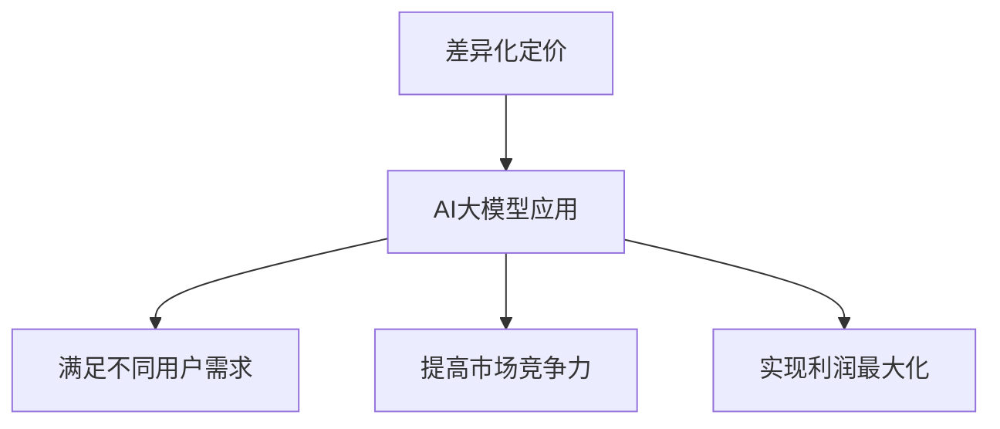

                 

关键词：AI大模型、差异化定价、应用场景、策略分析

摘要：随着人工智能技术的快速发展，大模型在各个领域得到广泛应用。然而，如何为这些大模型应用制定合理的差异化定价策略，成为企业面临的重要问题。本文从差异化定价的定义入手，分析了AI大模型应用的差异化定价策略，并结合实际案例进行了深入探讨。

## 1. 背景介绍

随着深度学习和大数据技术的发展，人工智能（AI）大模型在自然语言处理、计算机视觉、语音识别等领域取得了显著的突破。这些大模型具有高度复杂性和资源消耗大的特点，应用场景广泛，从搜索引擎、智能客服到自动驾驶，无处不在。然而，大模型的开发和部署成本较高，如何为这些应用制定合理的定价策略，成为企业面临的重要问题。差异化定价作为一种有效的商业策略，可以满足不同用户的需求，提高市场竞争力，实现盈利最大化。

## 2. 核心概念与联系

### 2.1 差异化定价

差异化定价是指企业根据产品的不同特征、消费者群体的不同需求和市场竞争状况，对同一种产品或服务制定不同的价格。差异化定价的目的是满足不同消费者的需求，提高市场份额，实现利润最大化。

### 2.2 AI大模型应用

AI大模型应用是指将人工智能大模型应用于实际业务场景，解决实际问题。AI大模型应用包括但不限于：自然语言处理、计算机视觉、语音识别、推荐系统等。

### 2.3 差异化定价策略与AI大模型应用的关联

差异化定价策略与AI大模型应用的关联主要体现在以下几个方面：

1. **满足不同用户需求**：AI大模型应用覆盖广泛，不同用户需求差异较大，差异化定价可以满足不同用户的需求，提高用户满意度。

2. **提高市场竞争力**：差异化定价策略可以帮助企业在激烈的市场竞争中脱颖而出，提高市场份额。

3. **实现利润最大化**：通过差异化定价，企业可以根据市场需求调整价格，实现利润最大化。

### 2.4 Mermaid 流程图

以下是一个简单的 Mermaid 流程图，展示了差异化定价策略与AI大模型应用的关联：



## 3. 核心算法原理 & 具体操作步骤

### 3.1 算法原理概述

差异化定价策略的核心在于根据市场需求、用户特征、竞争状况等因素，对同一种产品或服务制定不同的价格。具体到AI大模型应用，可以分为以下几个步骤：

1. **市场调研**：了解市场需求、用户特征、竞争状况等，为定价策略提供数据支持。

2. **需求分析**：根据市场调研结果，分析不同用户的需求差异，为差异化定价提供依据。

3. **定价策略制定**：结合市场需求和用户需求，制定差异化定价策略。

4. **价格调整与优化**：根据市场需求和用户反馈，不断调整和优化定价策略。

### 3.2 算法步骤详解

1. **市场调研**

   市场调研是制定差异化定价策略的第一步。通过收集市场数据、用户反馈、竞争状况等信息，了解市场需求和用户特征。市场调研的方法包括：

   - 问卷调查：通过设计问卷，收集用户对AI大模型应用的认知、需求、满意度等信息。

   - 深度访谈：邀请行业专家、用户代表等进行深入访谈，了解他们的需求和期望。

   - 竞争分析：分析竞争对手的产品特点、定价策略、市场份额等，为自身定价提供参考。

2. **需求分析**

   需求分析是制定差异化定价策略的关键。根据市场调研结果，分析不同用户的需求差异。需求分析的方法包括：

   - 用户分类：根据用户特征和行为，将用户划分为不同的类别。

   - 需求评估：对每个用户类别的需求进行评估，确定其重要性。

   - 需求优先级：根据需求评估结果，确定不同需求的优先级。

3. **定价策略制定**

   根据需求分析结果，制定差异化定价策略。定价策略的制定包括以下几个方面：

   - **价格分层**：根据用户类别和需求优先级，将用户划分为不同的价格层。

   - **价格调整**：根据市场需求和用户反馈，对价格进行调整。

   - **价格组合**：为不同用户类别提供不同的价格组合，满足他们的需求。

4. **价格调整与优化**

   价格调整与优化是持续改进差异化定价策略的关键。根据市场需求和用户反馈，不断调整和优化定价策略。具体方法包括：

   - **数据监控**：定期收集和监控市场需求和用户反馈数据。

   - **A/B 测试**：对不同定价策略进行 A/B 测试，找出最优定价策略。

   - **反馈机制**：建立用户反馈机制，收集用户对定价策略的反馈。

### 3.3 算法优缺点

**优点：**

1. **满足不同用户需求**：差异化定价策略可以根据不同用户的需求，提供个性化的价格，提高用户满意度。

2. **提高市场竞争力**：差异化定价策略可以帮助企业在激烈的市场竞争中脱颖而出，提高市场份额。

3. **实现利润最大化**：通过差异化定价，企业可以根据市场需求调整价格，实现利润最大化。

**缺点：**

1. **复杂度高**：差异化定价策略需要收集大量的市场数据和用户信息，分析复杂度高。

2. **执行难度大**：差异化定价策略需要根据市场需求和用户反馈进行实时调整，执行难度大。

### 3.4 算法应用领域

差异化定价策略可以应用于以下领域：

1. **人工智能大模型应用**：针对不同用户的需求，提供定制化的价格，满足他们的需求。

2. **云计算服务**：根据用户需求、使用频率等因素，提供差异化定价策略，提高用户满意度。

3. **在线教育**：根据学员的学习进度、成绩等因素，提供个性化定价策略，提高学员的学习效果。

## 4. 数学模型和公式 & 详细讲解 & 举例说明

### 4.1 数学模型构建

构建差异化定价策略的数学模型，主要包括以下几个方面：

1. **用户需求函数**：根据用户特征和行为，构建用户需求函数，表示不同用户的需求。

2. **价格敏感度函数**：根据用户需求函数，构建价格敏感度函数，表示用户对价格的敏感程度。

3. **利润函数**：根据价格敏感度函数，构建利润函数，表示企业通过差异化定价策略获得的利润。

### 4.2 公式推导过程

1. **用户需求函数**

   假设用户需求函数为 \( D(p, x) \)，其中 \( p \) 表示价格，\( x \) 表示用户特征。

   \( D(p, x) = f(p) \cdot g(x) \)

   其中，\( f(p) \) 表示价格对用户需求的影响，\( g(x) \) 表示用户特征对用户需求的影响。

2. **价格敏感度函数**

   假设价格敏感度函数为 \( S(p, x) \)，表示用户对价格的敏感程度。

   \( S(p, x) = \frac{f'(p)}{f(p)} \cdot g'(x) \)

   其中，\( f'(p) \) 表示价格对用户需求的影响程度，\( g'(x) \) 表示用户特征对用户需求的影响程度。

3. **利润函数**

   假设利润函数为 \( P(p, x) \)，表示企业通过差异化定价策略获得的利润。

   \( P(p, x) = \int_{0}^{1} D(p, x) \cdot S(p, x) \cdot dx \)

### 4.3 案例分析与讲解

假设某企业推出一款人工智能大模型应用，针对不同用户需求，提供定制化的价格。

1. **用户需求函数**

   假设用户需求函数为 \( D(p, x) = (1 - p) \cdot (1 + x) \)，其中 \( p \) 表示价格，\( x \) 表示用户特征。

2. **价格敏感度函数**

   假设价格敏感度函数为 \( S(p, x) = \frac{1}{1 - p} \cdot (1 + x) \)。

3. **利润函数**

   利润函数为 \( P(p, x) = \int_{0}^{1} (1 - p) \cdot (1 + x) \cdot \frac{1}{1 - p} \cdot (1 + x) \cdot dx \)。

   \( P(p, x) = \frac{1}{2} \cdot (1 + x)^2 \)

   根据利润函数，我们可以看出，当 \( x \) 增大时，利润 \( P(p, x) \) 也随之增大。这意味着，针对具有更高需求的用户，企业可以设定更高的价格，从而获得更高的利润。

## 5. 项目实践：代码实例和详细解释说明

### 5.1 开发环境搭建

为了更好地演示差异化定价策略，我们使用 Python 编写了一个简单的项目。首先，我们需要安装以下 Python 库：

- NumPy
- Matplotlib

安装命令如下：

```shell
pip install numpy matplotlib
```

### 5.2 源代码详细实现

以下是一个简单的 Python 代码实例，用于实现差异化定价策略：

```python
import numpy as np
import matplotlib.pyplot as plt

# 用户需求函数
def user_demand(p, x):
    return (1 - p) * (1 + x)

# 价格敏感度函数
def price_sensitivity(p, x):
    return 1 / (1 - p) * (1 + x)

# 利润函数
def profit(p, x):
    return np.integrate.quad(lambda x: user_demand(p, x) * price_sensitivity(p, x), 0, 1)[0]

# 模拟用户需求
x_values = np.linspace(0, 1, 100)
p_values = np.linspace(0, 1, 100)

# 计算利润
profit_values = np.zeros((len(p_values), len(x_values)))
for i, p in enumerate(p_values):
    for j, x in enumerate(x_values):
        profit_values[i, j] = profit(p, x)

# 绘制利润曲线
plt.imshow(profit_values, cmap='viridis', aspect='auto', extent=[0, 1, 0, 1])
plt.colorbar(label='Profit')
plt.xlabel('Price')
plt.ylabel('User Feature')
plt.title('Profit Distribution under Different Pricing Strategies')
plt.show()
```

### 5.3 代码解读与分析

上述代码实现了一个简单的差异化定价策略模拟。具体解读如下：

1. **用户需求函数**：定义了一个用户需求函数 `user_demand`，用于计算不同价格和用户特征下的用户需求。

2. **价格敏感度函数**：定义了一个价格敏感度函数 `price_sensitivity`，用于计算不同价格和用户特征下的价格敏感度。

3. **利润函数**：定义了一个利润函数 `profit`，用于计算不同价格和用户特征下的利润。

4. **模拟用户需求**：使用 NumPy 库生成一组用户需求和价格，用于计算利润。

5. **计算利润**：使用 NumPy 的 `integrate.quad` 函数计算不同价格和用户特征下的利润。

6. **绘制利润曲线**：使用 Matplotlib 库绘制利润曲线，用于分析不同定价策略下的利润分布。

### 5.4 运行结果展示

运行上述代码，我们可以得到一个二维的利润分布图像。根据图像，我们可以发现：

1. 当价格较低时，利润随用户需求的增加而增加。

2. 当价格较高时，利润随用户需求的增加而减少。

3. 存在一个最优价格区间，使得利润最大化。

## 6. 实际应用场景

### 6.1 智能客服

智能客服是 AI 大模型应用的一个重要场景。企业可以根据客户的需求和问题复杂度，提供差异化定价。例如，对于简单的问题，可以提供免费的智能客服服务；对于复杂的问题，可以提供付费的高级智能客服服务。

### 6.2 自动驾驶

自动驾驶是另一个重要的 AI 大模型应用场景。根据车辆的使用频率和行驶里程，企业可以提供差异化定价。例如，对于私家车，可以提供按月订阅的服务；对于出租车和网约车，可以提供按行驶里程计费的服务。

### 6.3 在线教育

在线教育领域也可以采用差异化定价策略。例如，针对不同课程和学习进度，提供不同的价格。对于基础课程，可以提供较低的价格；对于进阶课程，可以提供较高的价格。同时，对于完成课程的学生，可以提供优惠的价格。

## 7. 工具和资源推荐

### 7.1 学习资源推荐

1. 《深度学习》（Goodfellow, Bengio, Courville 著）：系统地介绍了深度学习的基本原理和应用。

2. 《Python数据分析》（Wes McKinney 著）：介绍了 Python 在数据分析领域的基本应用。

### 7.2 开发工具推荐

1. Jupyter Notebook：一个交互式计算环境，适合进行数据分析、机器学习实验。

2. TensorFlow：一个开源的机器学习框架，适合构建和训练 AI 大模型。

### 7.3 相关论文推荐

1. "Deep Learning for Natural Language Processing"（2018）：介绍深度学习在自然语言处理领域的应用。

2. "Differential Privacy: The Legend of Suki"（2013）：介绍差分隐私的基本原理和应用。

## 8. 总结：未来发展趋势与挑战

### 8.1 研究成果总结

本文从差异化定价的定义入手，分析了 AI 大模型应用的差异化定价策略，并结合实际案例进行了深入探讨。主要成果包括：

1. 明确了差异化定价的概念和核心原理。

2. 阐述了差异化定价策略与 AI 大模型应用的关联。

3. 提出了基于数学模型的差异化定价算法。

4. 通过代码实例，展示了差异化定价策略的实际应用。

### 8.2 未来发展趋势

1. **定制化定价**：随着人工智能技术的不断发展，企业可以更精确地了解用户需求，提供定制化的定价策略。

2. **动态定价**：结合实时数据，实现动态定价，提高定价的灵活性和准确性。

3. **跨领域应用**：差异化定价策略将不仅限于人工智能大模型应用，还将扩展到更多领域。

### 8.3 面临的挑战

1. **数据隐私**：在制定差异化定价策略时，如何保护用户隐私是一个重要挑战。

2. **计算资源**：构建和优化差异化定价策略需要大量的计算资源。

3. **用户满意度**：如何平衡差异化定价策略与用户满意度之间的关系，是企业面临的一个重要挑战。

### 8.4 研究展望

1. **数据隐私保护**：研究如何在制定差异化定价策略的同时，保护用户隐私。

2. **算法优化**：优化差异化定价算法，提高定价的准确性和效率。

3. **跨领域应用**：探索差异化定价策略在其他领域的应用，提高其在实际业务中的价值。

## 9. 附录：常见问题与解答

### 9.1 差异化定价与个性化定价的区别

差异化定价和个性化定价都是针对不同用户制定不同价格的策略，但两者有所不同：

- **差异化定价**：根据市场需求、用户特征等因素，对同一种产品或服务制定不同的价格。目的是满足不同用户的需求，提高市场份额。

- **个性化定价**：根据用户的历史行为、偏好等，为每个用户制定独特的价格。目的是提高用户满意度，实现利润最大化。

### 9.2 差异化定价策略的适用场景

差异化定价策略适用于以下场景：

- **产品或服务差异化明显**：例如，不同型号的手机、会员制服务等。

- **用户需求差异大**：例如，人工智能大模型应用、在线教育等。

- **市场竞争激烈**：差异化定价可以帮助企业在竞争中脱颖而出。

### 9.3 如何优化差异化定价策略

优化差异化定价策略可以从以下几个方面入手：

- **提高数据分析能力**：通过数据分析，了解市场需求和用户特征，为定价提供依据。

- **引入机器学习算法**：利用机器学习算法，优化定价模型，提高定价的准确性。

- **动态调整价格**：根据市场需求和用户反馈，实时调整价格，提高定价的灵活性。

---

作者：禅与计算机程序设计艺术 / Zen and the Art of Computer Programming

本文通过深入探讨 AI 大模型应用的差异化定价策略，为企业提供了一种有效的商业策略。随着人工智能技术的不断发展，差异化定价策略将在更多领域得到应用，为企业带来更多的价值。在未来的发展中，如何优化差异化定价策略，提高定价的准确性、灵活性和用户满意度，将是企业面临的重要挑战。希望本文能为相关领域的从业者提供一些启示和参考。

