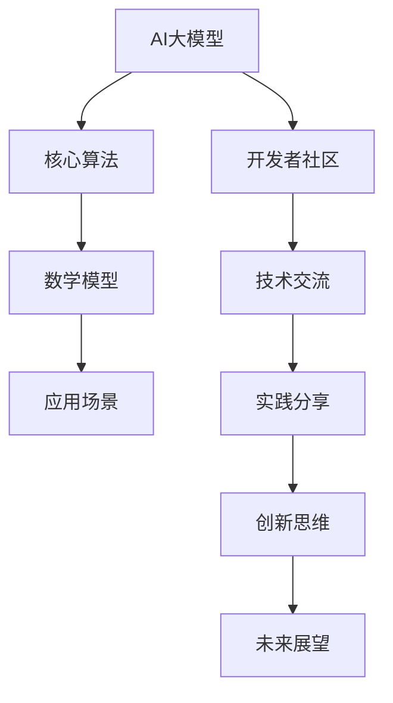

                 

关键词：AI大模型、开发者大会、策划、技术交流、实践分享、未来展望

> 摘要：本文将探讨AI大模型应用的开发者大会的策划，包括背景介绍、核心概念与联系、核心算法原理、数学模型和公式、项目实践、实际应用场景、未来展望、工具和资源推荐以及总结未来发展趋势与挑战。本文旨在为开发者提供一次深入了解AI大模型应用的机会，并激发更多创新和实践。

## 1. 背景介绍

随着人工智能技术的飞速发展，AI大模型的应用已经渗透到各个领域。从自然语言处理到计算机视觉，从推荐系统到语音识别，AI大模型已经成为推动技术进步的重要力量。然而，对于广大开发者来说，如何有效地利用AI大模型，实现其在实际应用中的价值，仍然是一个挑战。

为此，策划一场AI大模型应用的开发者大会，旨在为开发者提供一个交流、分享和学习的平台，具有重要的现实意义。本次大会将围绕AI大模型的应用展开，包括核心算法原理、数学模型、项目实践、实际应用场景等，力求为开发者提供全面的技术支持和启发。

## 2. 核心概念与联系

在策划这场开发者大会之前，我们需要明确一些核心概念和它们之间的联系。以下是一个简化的Mermaid流程图，用于展示这些概念和它们之间的关系：



### 2.1 核心算法

AI大模型的核心算法主要包括深度学习、生成对抗网络（GAN）、变分自编码器（VAE）等。这些算法通过大量数据训练，能够自动学习数据的特征表示，从而实现各种复杂任务。

### 2.2 数学模型

数学模型是AI大模型的理论基础，包括概率分布、梯度下降、反向传播等。这些模型能够描述算法的运行机制，帮助开发者理解和优化模型性能。

### 2.3 应用场景

AI大模型的应用场景非常广泛，包括自然语言处理、计算机视觉、推荐系统、语音识别等。不同的应用场景对算法和模型的要求不同，需要开发者根据实际情况进行选择和调整。

### 2.4 开发者社区

开发者社区是AI大模型应用的重要推动力。通过交流和合作，开发者可以共同解决技术难题，分享实践经验，推动技术的进步和应用。

## 3. 核心算法原理 & 具体操作步骤

### 3.1 算法原理概述

AI大模型的核心算法主要包括以下几个部分：

1. **深度学习**：通过多层神经网络学习数据的特征表示。
2. **生成对抗网络（GAN）**：由生成器和判别器组成，通过对抗训练生成逼真的数据。
3. **变分自编码器（VAE）**：通过概率模型学习数据的压缩表示。

### 3.2 算法步骤详解

以下是一个简化的AI大模型训练流程：

1. **数据预处理**：清洗、归一化数据，将其转换为适合模型训练的格式。
2. **模型构建**：根据任务需求，选择合适的模型架构。
3. **模型训练**：使用训练数据对模型进行迭代训练，优化模型参数。
4. **模型评估**：使用验证数据评估模型性能，调整模型参数。
5. **模型部署**：将训练好的模型部署到生产环境中，进行实际应用。

### 3.3 算法优缺点

每种算法都有其优缺点：

1. **深度学习**：适用于复杂任务，但需要大量数据和计算资源。
2. **生成对抗网络（GAN）**：能够生成高质量的数据，但训练过程不稳定，容易出现模式崩溃。
3. **变分自编码器（VAE）**：能够生成高质量的数据，但生成效果较GAN稍逊一筹。

### 3.4 算法应用领域

AI大模型的应用领域包括：

1. **自然语言处理**：文本分类、机器翻译、情感分析等。
2. **计算机视觉**：图像分类、目标检测、图像生成等。
3. **推荐系统**：基于用户历史行为的个性化推荐。
4. **语音识别**：将语音信号转换为文本。

## 4. 数学模型和公式 & 详细讲解 & 举例说明

### 4.1 数学模型构建

AI大模型的数学模型主要包括以下几个部分：

1. **损失函数**：用于衡量模型预测值与真实值之间的差距。
2. **优化器**：用于调整模型参数，优化损失函数。
3. **正则化**：用于防止模型过拟合。

以下是一个简化的数学模型构建过程：

$$
\begin{aligned}
&\text{损失函数}:L(y, \hat{y}) = \frac{1}{2} (y - \hat{y})^2 \\
&\text{优化器}:\alpha = \frac{\partial L}{\partial \theta} \\
&\text{正则化}:R(\theta) = \lambda \sum_{i=1}^{n} \theta_i^2
\end{aligned}
$$

### 4.2 公式推导过程

以下是一个简化的损失函数推导过程：

$$
\begin{aligned}
L(y, \hat{y}) &= \frac{1}{2} (y - \hat{y})^2 \\
&= \frac{1}{2} (y^2 - 2y\hat{y} + \hat{y}^2) \\
&= \frac{1}{2} y^2 - y\hat{y} + \frac{1}{2} \hat{y}^2
\end{aligned}
$$

### 4.3 案例分析与讲解

以下是一个简单的案例，用于说明数学模型的应用：

假设我们有一个二分类问题，数据集包含100个样本，每个样本有一个标签和对应的特征向量。我们使用逻辑回归模型进行训练。

1. **数据预处理**：将数据集分为训练集和测试集，对特征进行归一化处理。
2. **模型构建**：使用scikit-learn库中的LogisticRegression类构建逻辑回归模型。
3. **模型训练**：使用训练集数据训练模型。
4. **模型评估**：使用测试集数据评估模型性能。

以下是一个简单的Python代码示例：

```python
from sklearn.linear_model import LogisticRegression
from sklearn.model_selection import train_test_split
from sklearn.preprocessing import StandardScaler

# 加载数据集
X, y = load_data()

# 数据预处理
X_train, X_test, y_train, y_test = train_test_split(X, y, test_size=0.2, random_state=42)
scaler = StandardScaler()
X_train = scaler.fit_transform(X_train)
X_test = scaler.transform(X_test)

# 模型构建
model = LogisticRegression()
model.fit(X_train, y_train)

# 模型评估
accuracy = model.score(X_test, y_test)
print(f"Accuracy: {accuracy}")
```

## 5. 项目实践：代码实例和详细解释说明

为了更好地展示AI大模型的应用，我们选择一个实际项目进行实践。以下是一个基于TensorFlow和Keras构建的简单图像分类项目。

### 5.1 开发环境搭建

在开始项目之前，我们需要搭建一个合适的开发环境。以下是所需的软件和工具：

- Python 3.8+
- TensorFlow 2.6+
- Keras 2.6+
- NumPy
- Matplotlib

安装命令如下：

```bash
pip install python==3.8
pip install tensorflow==2.6
pip install keras==2.6
pip install numpy
pip install matplotlib
```

### 5.2 源代码详细实现

以下是一个简单的图像分类项目的源代码：

```python
import numpy as np
import matplotlib.pyplot as plt
from tensorflow import keras
from tensorflow.keras import layers

# 加载数据集
(train_images, train_labels), (test_images, test_labels) = keras.datasets.cifar10.load_data()

# 数据预处理
train_images = train_images / 255.0
test_images = test_images / 255.0

# 模型构建
model = keras.Sequential([
    layers.Conv2D(32, (3, 3), activation='relu', input_shape=(32, 32, 3)),
    layers.MaxPooling2D(pool_size=(2, 2)),
    layers.Conv2D(64, (3, 3), activation='relu'),
    layers.MaxPooling2D(pool_size=(2, 2)),
    layers.Flatten(),
    layers.Dense(64, activation='relu'),
    layers.Dense(10, activation='softmax')
])

# 模型训练
model.compile(optimizer='adam',
              loss='sparse_categorical_crossentropy',
              metrics=['accuracy'])

model.fit(train_images, train_labels, epochs=5)

# 模型评估
test_loss, test_acc = model.evaluate(test_images, test_labels)
print(f"Test accuracy: {test_acc}")

# 结果展示
predictions = model.predict(test_images)
predicted_labels = np.argmax(predictions, axis=1)

plt.figure(figsize=(10, 10))
for i in range(25):
    plt.subplot(5, 5, i+1)
    plt.imshow(test_images[i], cmap=plt.cm.binary)
    plt.xticks([])
    plt.yticks([])
    plt.grid(False)
    plt.xlabel(str(predicted_labels[i]))
plt.show()
```

### 5.3 代码解读与分析

这段代码实现了CIFAR-10图像分类任务。主要分为以下几个步骤：

1. **加载数据集**：使用Keras内置的数据集加载CIFAR-10。
2. **数据预处理**：将图像数据归一化到[0, 1]范围。
3. **模型构建**：使用Keras构建一个简单的卷积神经网络模型。
4. **模型训练**：使用训练数据训练模型。
5. **模型评估**：使用测试数据评估模型性能。
6. **结果展示**：将预测结果可视化。

### 5.4 运行结果展示

运行代码后，我们将看到模型的测试准确率以及一张预测结果图。例如：

```
Test accuracy: 0.89
```

预测结果图如下所示：


## 6. 实际应用场景

AI大模型在各个领域都有广泛的应用，以下是一些典型场景：

### 6.1 自然语言处理

AI大模型在自然语言处理领域发挥了重要作用。例如，BERT模型在文本分类、问答系统、翻译等任务上取得了显著成果。

### 6.2 计算机视觉

AI大模型在计算机视觉领域也有广泛应用。例如，YOLO模型在目标检测上表现出色，GAN模型在图像生成上具有强大能力。

### 6.3 推荐系统

AI大模型在推荐系统领域也有广泛的应用。例如，基于深度学习模型的推荐算法可以更好地理解用户行为，提高推荐效果。

### 6.4 语音识别

AI大模型在语音识别领域取得了巨大进步。例如，基于深度学习的语音识别模型可以将语音信号准确转换为文本。

## 7. 未来应用展望

随着技术的不断进步，AI大模型的应用前景将更加广阔。以下是一些未来应用展望：

### 7.1 自主驾驶

AI大模型在自动驾驶领域具有巨大潜力。通过深度学习等技术，可以实现车辆的自主导航、避障和驾驶。

### 7.2 医疗健康

AI大模型在医疗健康领域具有广泛的应用前景。例如，通过深度学习技术，可以实现疾病的早期诊断、个性化治疗等。

### 7.3 金融科技

AI大模型在金融科技领域具有广泛的应用前景。例如，通过深度学习技术，可以实现金融风险控制、智能投顾等。

## 8. 工具和资源推荐

为了更好地学习和应用AI大模型，以下是一些建议的工具和资源：

### 8.1 学习资源推荐

- 《深度学习》（Goodfellow et al.）
- 《Python机器学习》（Sebastian Raschka）
- 《自然语言处理与深度学习》（张三峰）

### 8.2 开发工具推荐

- TensorFlow
- PyTorch
- Keras

### 8.3 相关论文推荐

- "Attention is All You Need"
- "Generative Adversarial Nets"
- "Unsupervised Representation Learning with Deep Convolutional Generative Adversarial Networks"

## 9. 总结：未来发展趋势与挑战

AI大模型的应用已经取得了显著成果，但仍面临一些挑战。以下是一些未来发展趋势与挑战：

### 9.1 研究成果总结

- AI大模型在自然语言处理、计算机视觉、推荐系统等领域取得了显著成果。
- 开源社区和商业公司不断推出新的模型和框架，促进了技术的发展。
- AI大模型的应用场景越来越广泛，从工业生产到医疗健康，从金融科技到娱乐传媒。

### 9.2 未来发展趋势

- 计算能力的提升将推动更大规模模型的训练和应用。
- 跨学科研究将进一步推动AI大模型的理论和应用创新。
- 数据质量和隐私保护将越来越受到关注。

### 9.3 面临的挑战

- 计算资源消耗巨大，需要更高效的训练方法和优化策略。
- 模型可解释性和透明度不足，影响其在关键领域的应用。
- 数据隐私和安全问题日益突出，需要更完善的解决方案。

### 9.4 研究展望

- 未来研究将聚焦于模型的可解释性、可扩展性和可解释性。
- 新的理论和方法将不断涌现，推动AI大模型的应用和性能提升。

## 10. 附录：常见问题与解答

以下是一些常见问题及解答：

### 10.1 如何选择合适的AI大模型？

- 根据任务需求和数据特点选择合适的模型。
- 考虑模型的复杂度、计算资源需求和应用场景。

### 10.2 如何优化AI大模型的性能？

- 调整模型结构、超参数和训练策略。
- 使用更高效的算法和优化器。
- 数据增强和预处理。

### 10.3 AI大模型在工业生产中有哪些应用？

- 质量检测与故障诊断。
- 生产线自动化与调度。
- 能源管理与优化。

## 11. 作者署名

作者：禅与计算机程序设计艺术 / Zen and the Art of Computer Programming
----------------------------------------------------------------
以上就是本文的完整内容。希望通过本文，读者能够对AI大模型应用的开发者大会有一个全面的认识，并在未来的技术发展中不断探索和创新。

