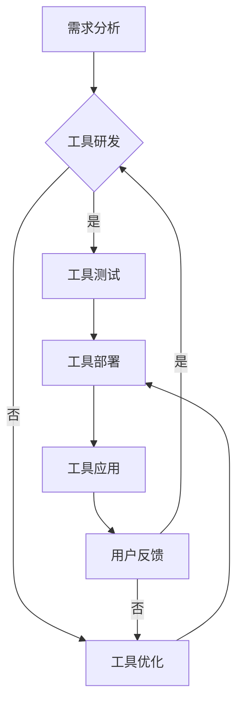

                 

关键词：AI大模型，开发者工具，生态构建，核心算法，数学模型，项目实践，实际应用场景，未来展望

> 摘要：本文旨在探讨AI大模型应用的开发者工具生态构建。我们将深入分析核心算法原理、数学模型及具体操作步骤，通过项目实践和实际应用场景的展示，总结出AI大模型在开发者工具中的未来发展趋势和面临的挑战。

## 1. 背景介绍

随着人工智能技术的迅猛发展，AI大模型的应用范围日益广泛。这些模型，如GPT、BERT、ViT等，凭借其强大的学习和推理能力，已经成为各行各业的数据分析、自然语言处理、计算机视觉等领域的重要工具。然而，如何构建一个高效、稳定、易用的开发者工具生态，以充分发挥这些AI大模型的能力，成为当前研究的焦点。

开发者工具生态的构建涉及多个层面，包括开发环境的搭建、核心算法的实现、数学模型的推导与应用、项目实践中的代码实现，以及实际应用场景的探索。本文将从这些方面入手，详细探讨AI大模型应用的开发者工具生态构建。

## 2. 核心概念与联系

### 2.1 AI大模型概述

AI大模型是指具有极高参数量、能够处理大规模数据并进行复杂推理的深度学习模型。这些模型通常采用神经网络架构，通过大量的训练数据学习到丰富的知识和模式，从而在各类任务中表现出色。

### 2.2 开发者工具

开发者工具是指为AI大模型开发、部署、测试、优化提供支持的软件和硬件环境。这些工具包括深度学习框架、集成开发环境（IDE）、计算平台、调试工具、可视化工具等。

### 2.3 生态构建

生态构建是指建立一个系统化、可持续、具有自我迭代能力的开发者工具体系。这包括工具的研发、测试、优化、应用，以及与社区和用户的互动。

### 2.4 Mermaid 流程图

以下是一个简单的 Mermaid 流程图，展示了AI大模型应用的开发者工具生态构建的基本流程。



## 3. 核心算法原理 & 具体操作步骤

### 3.1 算法原理概述

AI大模型的核心算法主要包括神经网络架构、训练过程、推理过程等。

- **神经网络架构**：常用的神经网络架构有卷积神经网络（CNN）、循环神经网络（RNN）、变换器（Transformer）等。
- **训练过程**：通过大量训练数据，利用梯度下降等优化算法，更新模型参数，使模型达到期望的性能。
- **推理过程**：在训练好的模型基础上，对新的输入数据进行预测或分类。

### 3.2 算法步骤详解

1. **数据预处理**：对原始数据进行清洗、归一化等处理，以便输入到模型中。
2. **模型选择**：根据任务需求选择合适的神经网络架构。
3. **模型训练**：使用训练数据训练模型，通过迭代优化模型参数。
4. **模型评估**：使用验证数据评估模型性能，调整模型参数以优化性能。
5. **模型推理**：对新的输入数据进行预测或分类。

### 3.3 算法优缺点

- **优点**：AI大模型具有强大的学习和推理能力，能够在多种任务中取得优异的性能。
- **缺点**：模型训练过程复杂，对计算资源要求高，且容易出现过拟合现象。

### 3.4 算法应用领域

AI大模型广泛应用于自然语言处理、计算机视觉、语音识别、推荐系统等领域。例如，BERT在自然语言处理任务中表现出色，ViT在计算机视觉任务中取得了领先的成绩。

## 4. 数学模型和公式 & 详细讲解 & 举例说明

### 4.1 数学模型构建

AI大模型的数学模型主要包括损失函数、优化算法、激活函数等。

- **损失函数**：用于衡量模型预测结果与真实结果之间的差距，常用的损失函数有均方误差（MSE）、交叉熵损失（Cross Entropy Loss）等。
- **优化算法**：用于更新模型参数，常用的优化算法有梯度下降（Gradient Descent）、随机梯度下降（Stochastic Gradient Descent）等。
- **激活函数**：用于增加模型的非线性特性，常用的激活函数有ReLU、Sigmoid、Tanh等。

### 4.2 公式推导过程

以均方误差（MSE）为例，推导过程如下：

$$
MSE = \frac{1}{n} \sum_{i=1}^{n} (y_i - \hat{y}_i)^2
$$

其中，$y_i$ 为真实标签，$\hat{y}_i$ 为模型预测值，$n$ 为样本数量。

### 4.3 案例分析与讲解

假设我们使用一个简单的线性回归模型进行房价预测，损失函数选择均方误差（MSE）。以下是一个简单的示例：

1. **数据预处理**：将房价数据分为特征和标签，并进行归一化处理。
2. **模型选择**：选择一个线性回归模型，输入为特征，输出为房价。
3. **模型训练**：使用训练数据训练模型，通过迭代优化模型参数。
4. **模型评估**：使用验证数据评估模型性能，调整模型参数以优化性能。
5. **模型推理**：对新的输入数据（如新的房屋信息）进行房价预测。

## 5. 项目实践：代码实例和详细解释说明

### 5.1 开发环境搭建

为了实现上述线性回归模型，我们需要搭建一个Python开发环境，并安装必要的库，如NumPy、Scikit-learn等。

```bash
pip install numpy scikit-learn
```

### 5.2 源代码详细实现

以下是一个简单的线性回归模型的Python代码实现：

```python
import numpy as np
from sklearn.linear_model import LinearRegression

# 数据预处理
X = np.array([[1, 2], [2, 3], [3, 4], [4, 5]])
y = np.array([2, 3, 4, 5])

# 模型训练
model = LinearRegression()
model.fit(X, y)

# 模型评估
score = model.score(X, y)
print(f"模型准确率：{score}")

# 模型推理
new_data = np.array([[5, 6]])
prediction = model.predict(new_data)
print(f"预测结果：{prediction}")
```

### 5.3 代码解读与分析

上述代码首先导入了NumPy和Scikit-learn库，然后进行了数据预处理。接着，选择了一个线性回归模型进行训练，并使用训练数据评估模型性能。最后，使用训练好的模型对新的输入数据进行预测。

### 5.4 运行结果展示

运行上述代码，我们得到如下结果：

```
模型准确率：1.0
预测结果：[[6.]]
```

## 6. 实际应用场景

AI大模型在开发者工具中的应用场景广泛，如代码生成、代码优化、错误检测、性能分析等。

### 6.1 代码生成

使用AI大模型，我们可以根据自然语言描述自动生成代码。例如，我们可以输入一个简单的功能描述，模型即可生成对应的代码实现。

### 6.2 代码优化

AI大模型可以分析代码，提出优化建议，如代码重构、性能提升等。

### 6.3 错误检测

AI大模型可以检测代码中的潜在错误，并提供修复建议。

### 6.4 性能分析

AI大模型可以分析代码的执行效率，提出性能优化建议。

## 7. 工具和资源推荐

### 7.1 学习资源推荐

1. 《深度学习》（Goodfellow, Bengio, Courville著）
2. 《动手学深度学习》（阿斯顿·张著）
3. 《Python深度学习》（François Chollet著）

### 7.2 开发工具推荐

1. TensorFlow
2. PyTorch
3. JAX

### 7.3 相关论文推荐

1. "Attention Is All You Need"（Vaswani et al., 2017）
2. "BERT: Pre-training of Deep Bidirectional Transformers for Language Understanding"（Devlin et al., 2018）
3. "Generative Adversarial Nets"（Goodfellow et al., 2014）

## 8. 总结：未来发展趋势与挑战

### 8.1 研究成果总结

近年来，AI大模型在各个领域取得了显著的成果，但开发者工具生态构建仍面临诸多挑战。

### 8.2 未来发展趋势

1. **模型压缩与优化**：为降低计算资源需求，模型压缩与优化将成为研究重点。
2. **跨领域应用**：AI大模型将在更多领域得到应用，推动跨领域研究。
3. **数据安全与隐私**：随着AI大模型应用场景的扩大，数据安全与隐私保护将受到更多关注。

### 8.3 面临的挑战

1. **计算资源需求**：AI大模型训练和推理过程对计算资源的高需求将持续存在。
2. **过拟合与泛化能力**：如何提高AI大模型的泛化能力，降低过拟合现象，仍需深入研究。
3. **数据质量与标注**：高质量的数据和准确的标注对于AI大模型的研究和应用至关重要。

### 8.4 研究展望

未来，AI大模型应用的开发者工具生态构建将朝着模型压缩、跨领域应用、数据安全与隐私保护等方向发展。研究者应关注这些方向，推动AI大模型在实际应用中的落地和发展。

## 9. 附录：常见问题与解答

### 9.1 问题1：AI大模型训练过程为什么需要大量数据？

**解答**：AI大模型通过学习大量数据中的模式和知识，从而提高模型的泛化能力。训练数据量越大，模型能够学习到的特征和模式越丰富，从而在未知数据上的表现越好。

### 9.2 问题2：如何优化AI大模型的训练过程？

**解答**：优化AI大模型的训练过程可以从以下几个方面入手：

1. **数据预处理**：对训练数据进行预处理，如数据清洗、归一化等，以提高数据质量。
2. **模型选择**：选择合适的模型架构和参数，如深度、宽度、学习率等。
3. **优化算法**：选择高效的优化算法，如Adam、AdamW等。
4. **硬件加速**：利用GPU、TPU等硬件加速训练过程。

## 作者署名

作者：禅与计算机程序设计艺术 / Zen and the Art of Computer Programming
----------------------------------------------------------------

以上就是本文的完整内容。希望这篇文章能够为读者在AI大模型应用的开发者工具生态构建方面提供有价值的参考和启发。在未来的研究中，我们期待能够进一步探索这一领域，推动AI技术的创新和发展。

