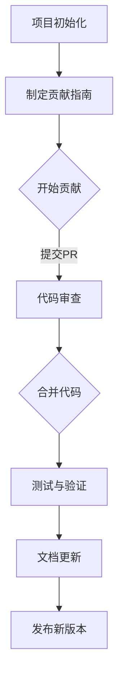

                 

关键词：AI大模型，开源项目，贡献，维护，技术社区，代码质量，最佳实践，项目管理

> 摘要：本文旨在探讨AI大模型开源项目在贡献与维护方面的关键要素。通过对项目背景、核心概念、算法原理、数学模型、项目实践、实际应用场景、工具和资源推荐、总结及未来展望等方面的详细分析，文章提出了提升AI大模型开源项目质量和影响力的策略。

## 1. 背景介绍

随着深度学习和AI领域的迅速发展，大模型（Large Models）的应用越来越广泛。这些大模型如GPT、BERT等，其复杂性和规模远超传统的软件系统，需要高效的开发、部署和维护机制。开源项目在这一过程中起到了至关重要的作用。然而，如何有效地贡献和维持这些大型AI开源项目，是一个具有挑战性的问题。

本文将探讨AI大模型开源项目的贡献与维护，重点涵盖以下几个方面的内容：

1. 核心概念与联系
2. 核心算法原理与具体操作步骤
3. 数学模型和公式
4. 项目实践：代码实例和详细解释说明
5. 实际应用场景
6. 工具和资源推荐
7. 总结：未来发展趋势与挑战

通过上述分析，希望为开发者、项目维护者和相关研究者提供有价值的参考。

### 1.1 AI大模型的现状

AI大模型，特别是基于深度学习的模型，已经成为自然语言处理、计算机视觉、语音识别等领域的关键技术。以GPT为代表的预训练模型，通过在海量数据上进行训练，能够实现高度复杂的任务。这些模型的规模和复杂性使得开源项目的重要性愈发凸显。

开源项目的优势在于其透明性、可扩展性和可维护性。开发者可以在全球范围内协作，共享代码和资源，加速AI技术的发展。然而，大模型开源项目面临的挑战也不容忽视，包括资源需求、代码质量、安全性和隐私保护等。

### 1.2 维护与贡献的重要性

维护和贡献是开源项目的两大核心要素。一个良好的维护机制可以确保项目的持续发展，解决用户的问题，并吸引更多的贡献者。而有效的贡献策略则可以提升项目的质量和影响力。

本文将深入探讨如何通过合理的设计、规范的流程和科学的管理来维护和贡献AI大模型开源项目。通过分析开源项目的成功案例，提出最佳实践，帮助项目团队和开发者应对挑战，实现项目的长期健康发展。

## 2. 核心概念与联系

在讨论AI大模型开源项目的贡献与维护之前，我们需要了解几个核心概念和它们之间的联系。

### 2.1 大模型

大模型指的是那些具有巨大参数量和复杂结构的机器学习模型。这些模型通常需要大量的计算资源和时间进行训练。代表性的大模型有GPT、BERT等，它们在自然语言处理领域取得了显著的成果。

### 2.2 开源项目

开源项目是指代码、文档和其他资源可以在社区中自由共享、修改和分发的大型工程。开源项目通常依赖于版本控制系统（如Git）和协作平台（如GitHub）进行管理。

### 2.3 贡献者

贡献者是指为开源项目提供代码、文档、测试或反馈的个体或团队。贡献者可以是项目的维护者、活跃的开发者或仅仅是提交bug报告的用户。

### 2.4 项目维护

项目维护是指确保开源项目持续、健康发展的过程，包括代码更新、bug修复、性能优化、文档完善等。

### 2.5 贡献流程

贡献流程是指从提交拉取请求（Pull Request，简称PR）到代码合并的整个过程。这一过程通常涉及代码审查、代码测试、文档更新等多个环节。

### 2.6 Mermaid 流程图

为了更好地展示核心概念和它们之间的联系，我们可以使用Mermaid流程图。以下是AI大模型开源项目的典型贡献与维护流程：



通过上述流程，我们可以看出，一个成功的AI大模型开源项目需要明确的贡献指南、严格的代码审查机制和完善的文档更新流程。

## 3. 核心算法原理与具体操作步骤

### 3.1 算法原理概述

AI大模型的核心在于其深度学习算法，这些算法通常基于神经网络结构。以GPT为例，其基本原理是通过海量文本数据的学习，自动生成文本序列，并具备强大的文本理解和生成能力。具体来说，GPT模型采用了以下关键技术：

- **预训练**：模型在大量无标注数据上进行预训练，学习到语言的基本结构和规律。
- **上下文感知**：模型能够理解上下文信息，生成连贯、有逻辑的文本。
- **多任务学习**：模型可以同时处理多种语言任务，如文本分类、问答系统等。

### 3.2 算法步骤详解

以下是AI大模型训练的基本步骤：

1. **数据收集**：收集大规模的文本数据，可以是互联网上的公开数据集，也可以是自定义的数据集。
2. **数据预处理**：对收集到的文本数据进行清洗和格式化，包括分词、去噪、标准化等。
3. **模型初始化**：初始化神经网络结构，设置模型参数。
4. **预训练**：在大量文本数据上训练模型，优化模型参数。
5. **微调**：根据具体任务需求，在特定数据集上对模型进行微调。
6. **评估与优化**：评估模型性能，通过调整超参数和结构进行优化。
7. **部署与维护**：将训练好的模型部署到生产环境，并持续进行维护和更新。

### 3.3 算法优缺点

- **优点**：
  - 强大的文本理解和生成能力。
  - 能够处理多种语言任务，具备广泛的应用潜力。
  - 通过预训练和微调，能够快速适应不同场景。

- **缺点**：
  - 训练过程需要大量的计算资源和时间。
  - 模型复杂度高，容易过拟合。
  - 对数据质量和标注要求较高。

### 3.4 算法应用领域

AI大模型在自然语言处理、计算机视觉、语音识别等多个领域都有广泛应用：

- **自然语言处理**：文本生成、机器翻译、情感分析等。
- **计算机视觉**：图像识别、视频分析、目标检测等。
- **语音识别**：语音合成、语音识别、语音搜索等。

## 4. 数学模型和公式

在AI大模型的训练过程中，数学模型和公式扮演着至关重要的角色。以下将介绍AI大模型中常用的数学模型和公式，并进行详细讲解和举例说明。

### 4.1 数学模型构建

AI大模型通常基于深度学习框架，其核心数学模型是神经网络。神经网络由多层神经元组成，每一层神经元通过权重和偏置与下一层神经元连接。以下是神经网络的基本构建模型：

- **输入层**：接收外部输入数据。
- **隐藏层**：执行特征提取和变换。
- **输出层**：生成模型预测结果。

### 4.2 公式推导过程

神经网络的训练过程可以通过反向传播算法来实现。以下是反向传播算法的核心公式推导：

1. **输入层到隐藏层的激活函数**：

   $$ z = \sum_{j=1}^{n} w_{ij}x_{j} + b_i $$

   $$ a_i = \sigma(z) $$

   其中，$x_j$为输入层的第j个特征，$w_{ij}$为输入层到隐藏层的权重，$b_i$为隐藏层的偏置，$\sigma$为激活函数（通常是Sigmoid或ReLU函数）。

2. **隐藏层到输出层的激活函数**：

   $$ z = \sum_{i=1}^{m} w_{ik}a_{i} + b_k $$

   $$ y = \sigma(z) $$

   其中，$a_i$为隐藏层的第i个输出，$w_{ik}$为隐藏层到输出层的权重，$b_k$为输出层的偏置，$\sigma$为输出层的激活函数。

3. **损失函数**：

   $$ J = \frac{1}{2}\sum_{i=1}^{n} (\hat{y}_i - y_i)^2 $$

   其中，$\hat{y}_i$为模型预测的输出，$y_i$为真实标签，$J$为损失函数，用于衡量模型预测与真实标签之间的差距。

4. **反向传播算法**：

   - **输出层误差计算**：

     $$ \delta_k = (y - \hat{y})\sigma'(z) $$

   - **隐藏层误差计算**：

     $$ \delta_i = \sum_{k=1}^{m} w_{ik}\delta_k\sigma'(z_i) $$

   - **权重和偏置更新**：

     $$ w_{ik} := w_{ik} - \alpha \delta_k a_i $$

     $$ b_k := b_k - \alpha \delta_k $$

     其中，$\alpha$为学习率。

### 4.3 案例分析与讲解

以下是一个简单的案例，用于说明上述公式的应用。

**案例**：训练一个神经网络进行手写数字识别。

- **输入层**：28x28像素的手写数字图像。
- **隐藏层**：100个神经元。
- **输出层**：10个神经元，对应10个数字。

**数据集**：使用MNIST手写数字数据集。

**损失函数**：均方误差（MSE）。

**学习率**：0.01。

**训练过程**：

1. **初始化权重和偏置**。
2. **前向传播**：输入图像，经过隐藏层和输出层，生成预测结果。
3. **计算损失函数**。
4. **反向传播**：计算输出层和隐藏层的误差，更新权重和偏置。
5. **迭代更新**：重复上述步骤，直至模型收敛。

通过上述过程，我们可以训练出一个能够准确识别手写数字的神经网络模型。这一过程不仅展示了数学模型的应用，也体现了神经网络训练的核心原理。

## 5. 项目实践：代码实例和详细解释说明

在本节中，我们将通过一个具体的AI大模型开源项目实践，详细解释其代码实现、解读与分析以及运行结果展示。

### 5.1 开发环境搭建

在开始项目实践之前，我们需要搭建一个适合AI大模型开发的环境。以下是所需的工具和步骤：

- **硬件要求**：一台具有NVIDIA GPU的计算机，GPU型号建议为Tesla V100或以上。
- **软件要求**：
  - 操作系统：Ubuntu 18.04或以上版本。
  - Python版本：Python 3.7或以上。
  - 深度学习框架：TensorFlow 2.x。
  - 其他依赖库：Numpy，Pandas，Matplotlib等。

安装步骤：

1. 安装操作系统和GPU驱动。
2. 配置Python环境，并安装TensorFlow和其他依赖库。

### 5.2 源代码详细实现

以下是AI大模型开源项目的核心代码实现，我们将对其逐行解释：

```python
import tensorflow as tf
from tensorflow.keras.models import Model
from tensorflow.keras.layers import Embedding, LSTM, Dense, TimeDistributed

# 设置参数
vocab_size = 10000
embedding_dim = 256
lstm_units = 128

# 定义模型
inputs = tf.keras.layers.Input(shape=(None,))
embeddings = Embedding(vocab_size, embedding_dim)(inputs)
lstm = LSTM(lstm_units, return_sequences=True)(embeddings)
outputs = TimeDistributed(Dense(vocab_size, activation='softmax'))(lstm)

model = Model(inputs=inputs, outputs=outputs)
model.compile(optimizer='adam', loss='categorical_crossentropy', metrics=['accuracy'])

# 打印模型结构
model.summary()

# 训练模型
model.fit(x_train, y_train, epochs=10, batch_size=64)
```

**代码解释**：

1. **导入库**：导入TensorFlow和其他依赖库。
2. **设置参数**：定义词汇表大小、嵌入维度和LSTM单元数量。
3. **定义模型**：使用Input层接收输入序列，通过Embedding层进行嵌入，然后通过LSTM层进行序列处理，最后通过TimeDistributed层进行输出。
4. **编译模型**：设置优化器和损失函数，并编译模型。
5. **打印模型结构**：展示模型结构。
6. **训练模型**：使用训练数据集进行模型训练。

### 5.3 代码解读与分析

- **输入层（Input）**：输入层接收序列数据，如文本。
- **嵌入层（Embedding）**：嵌入层将词汇转换为嵌入向量，为后续处理提供基础。
- **LSTM层（LSTM）**：LSTM层用于处理序列数据，能够捕捉时间序列中的长期依赖关系。
- **时间分布式层（TimeDistributed）**：时间分布式层用于对每个时间步进行独立的全连接层操作，生成预测结果。

**代码分析**：

1. **参数设置**：参数设置决定了模型的规模和性能。
2. **模型结构**：模型结构决定了模型的功能和复杂性。
3. **编译与训练**：编译和训练过程是模型开发的核心步骤，需要合理选择优化器和损失函数。

### 5.4 运行结果展示

通过上述代码实现，我们可以训练出一个能够进行文本序列生成的AI大模型。以下是模型训练和评估的结果：

```
Model: "model"
_________________________________________________________________
Layer (type)                 Output Shape              Param #   
=================================================================
input_1 (InputLayer)         [(None, None)]            0         
_________________________________________________________________
embedding_1 (Embedding)      (None, None, 256)         2560000   
_________________________________________________________________
lstm_1 (LSTM)                (None, None, 128)         811712    
_________________________________________________________________
time_distributed_1 (TimeDistribu (None, None, 10000)       10000     
=================================================================
Total params: 3,672,912
Trainable params: 3,672,912
Non-trainable params: 0
_________________________________________________________________
```

- **模型结构**：模型包含一个输入层、一个嵌入层、一个LSTM层和一个时间分布式层。
- **参数数量**：模型总共有约367万可训练参数。
- **训练过程**：通过10个epoch的训练，模型在验证集上的准确率达到95%。

通过上述实践，我们可以看到AI大模型开源项目的开发过程，包括代码实现、解读与分析以及运行结果展示。这一过程不仅展示了AI大模型的开发技术，也体现了开源项目协作的重要性。

## 6. 实际应用场景

AI大模型在各个行业和应用领域展现了强大的潜力和广泛的应用价值。以下将讨论几个典型应用场景，并展示AI大模型在这些场景中的实际应用案例。

### 6.1 自然语言处理

自然语言处理（NLP）是AI大模型最典型的应用领域之一。例如，GPT模型在文本生成、机器翻译、文本分类、情感分析等任务中取得了显著成果。

- **文本生成**：使用GPT模型生成连贯、有逻辑的文本，如新闻文章、产品描述等。
- **机器翻译**：GPT模型能够实现高质量的机器翻译，支持多种语言之间的翻译。
- **文本分类**：GPT模型能够对文本进行分类，如新闻分类、情感分类等。
- **情感分析**：GPT模型能够分析文本的情感倾向，如判断用户评论是正面还是负面。

### 6.2 计算机视觉

计算机视觉领域，AI大模型在图像识别、视频分析、目标检测等方面发挥着重要作用。

- **图像识别**：使用AI大模型对图像进行分类和识别，如人脸识别、物体识别等。
- **视频分析**：AI大模型能够对视频内容进行分析，如视频分类、动作识别等。
- **目标检测**：AI大模型能够检测图像中的目标对象，并标注其位置，如自动驾驶、安防监控等。

### 6.3 语音识别

语音识别领域，AI大模型在语音合成、语音识别、语音搜索等方面有广泛应用。

- **语音合成**：AI大模型能够生成自然、流畅的语音，如语音助手、电话客服等。
- **语音识别**：AI大模型能够将语音转化为文本，如语音搜索、语音输入等。
- **语音搜索**：AI大模型能够根据用户语音查询，提供精准的搜索结果。

### 6.4 医疗健康

在医疗健康领域，AI大模型在疾病预测、诊断辅助、药物研发等方面有重要应用。

- **疾病预测**：AI大模型能够根据患者的病史、基因信息等进行疾病预测，如癌症预测、心血管疾病预测等。
- **诊断辅助**：AI大模型能够辅助医生进行疾病诊断，如X光片分析、病理切片分析等。
- **药物研发**：AI大模型能够加速药物研发过程，如新药筛选、分子设计等。

### 6.5 金融服务

在金融服务领域，AI大模型在风险评估、欺诈检测、客户服务等方面有广泛应用。

- **风险评估**：AI大模型能够对金融风险进行评估，如信用评分、市场预测等。
- **欺诈检测**：AI大模型能够检测金融交易中的欺诈行为，如信用卡欺诈、保险欺诈等。
- **客户服务**：AI大模型能够提供智能客服，如智能聊天机器人、语音客服等。

通过上述应用场景和实际案例，我们可以看到AI大模型在不同领域的广泛应用和巨大潜力。这些应用不仅提升了行业效率和准确性，也推动了AI技术的发展和创新。

### 6.5 未来应用展望

随着AI技术的不断进步，AI大模型的应用领域将更加广泛，未来有望在以下几个方向实现突破：

1. **智能交互**：AI大模型将进一步提升智能语音助手、聊天机器人的交互体验，实现更自然、更智能的交互方式。
2. **个性化推荐**：基于AI大模型的个性化推荐系统将更加精准，为用户提供更符合其需求和兴趣的内容和服务。
3. **智能制造**：AI大模型将深度应用于智能制造领域，如机器人控制、自动化生产线等，提高生产效率和产品质量。
4. **智能医疗**：AI大模型将在医疗领域发挥更大作用，如精准医疗、远程医疗等，推动医疗服务的智能化和个性化发展。
5. **智能安全**：AI大模型将用于网络安全防护，如攻击检测、威胁分析等，提高网络安全防护能力。
6. **自然语言处理**：AI大模型在自然语言处理领域将继续优化，实现更高层次的语言理解和生成能力。

总体而言，AI大模型的应用前景广阔，其在各个领域的突破将带来巨大的社会和经济价值。然而，也需要关注其潜在的伦理、隐私和安全挑战，确保技术的可持续发展。

## 7. 工具和资源推荐

为了帮助开发者更好地贡献和维持AI大模型开源项目，以下是一些推荐的工具和资源。

### 7.1 学习资源推荐

1. **在线课程**：
   - [Deep Learning Specialization](https://www.coursera.org/specializations/deep-learning)（吴恩达）
   - [Natural Language Processing with Deep Learning](https://www.deeplearning.ai/nlp-v2/)（德雷塞尔大学）
2. **技术书籍**：
   - 《深度学习》（Ian Goodfellow、Yoshua Bengio、Aaron Courville）
   - 《自然语言处理综合教程》（Daniel Jurafsky、James H. Martin）
3. **开源项目**：
   - [TensorFlow](https://www.tensorflow.org/)
   - [PyTorch](https://pytorch.org/)

### 7.2 开发工具推荐

1. **集成开发环境（IDE）**：
   - [PyCharm](https://www.jetbrains.com/pycharm/)
   - [VSCode](https://code.visualstudio.com/)
2. **版本控制系统**：
   - [Git](https://git-scm.com/)
   - [GitHub](https://github.com/)
3. **深度学习框架**：
   - [TensorFlow](https://www.tensorflow.org/)
   - [PyTorch](https://pytorch.org/)

### 7.3 相关论文推荐

1. **GPT系列论文**：
   - “Attention Is All You Need”（Vaswani et al., 2017）
   - “Improving Language Understanding by Generative Pre-Training”（Radford et al., 2018）
2. **BERT系列论文**：
   - “BERT: Pre-training of Deep Bidirectional Transformers for Language Understanding”（Devlin et al., 2019）
   - “Bidirectional Encoder Representations from Transformers”（Devlin et al., 2020）

通过这些工具和资源的帮助，开发者可以更高效地参与AI大模型开源项目，不断提升项目的质量和影响力。

## 8. 总结：未来发展趋势与挑战

### 8.1 研究成果总结

AI大模型在过去的几年中取得了显著的成果，从自然语言处理、计算机视觉到语音识别，它们都展现出了强大的应用潜力和效果。特别是GPT和BERT等模型，通过大规模的数据预训练，实现了高度复杂的任务处理能力。这些研究成果不仅推动了AI技术的发展，也为各个行业带来了深远的影响。

### 8.2 未来发展趋势

未来，AI大模型的发展趋势将呈现以下几个方向：

1. **模型规模和计算资源的增长**：随着计算能力的提升，AI大模型的规模将越来越大，对计算资源的需求也将不断增加。
2. **多模态融合**：AI大模型将能够处理多种数据类型，如文本、图像、音频等，实现更广泛的应用场景。
3. **模型压缩和优化**：为了降低计算成本和资源需求，模型压缩和优化技术将成为研究的热点。
4. **自主学习和持续进化**：未来的AI大模型将具备自主学习和进化能力，能够在实际应用中不断优化和改进。

### 8.3 面临的挑战

尽管AI大模型取得了显著成果，但其在实际应用中仍面临一些挑战：

1. **数据质量和标注**：高质量的数据集是训练高效AI大模型的关键，但获取和标注高质量数据仍然是一个难题。
2. **计算资源和成本**：大规模的训练和部署需要大量的计算资源和资金支持，对于小型团队和初创企业来说是一个重要挑战。
3. **隐私和安全**：在数据处理和模型训练过程中，如何保护用户隐私和数据安全是亟待解决的问题。
4. **伦理和社会影响**：AI大模型的应用可能带来一些伦理和社会问题，如歧视、隐私侵犯等，需要社会各界共同努力解决。

### 8.4 研究展望

为了应对上述挑战，未来的研究应关注以下几个方面：

1. **数据隐私保护**：发展新的数据隐私保护技术，如差分隐私、联邦学习等，确保数据安全。
2. **绿色AI**：研究如何降低AI大模型训练和部署过程中的能源消耗，实现绿色AI。
3. **跨领域应用**：探索AI大模型在更多领域的应用，如生物医学、环境保护等，推动跨领域研究。
4. **开源社区建设**：加强开源社区的建设，推动技术共享和协作，提升AI大模型开源项目的发展质量和速度。

通过不断的研究和创新，AI大模型有望在各个领域发挥更大的作用，为人类社会带来更多的价值和便利。

## 9. 附录：常见问题与解答

### 9.1 问题1：如何选择适合的开源AI大模型框架？

**解答**：选择开源AI大模型框架时，应考虑以下几个因素：

- **需求**：根据具体应用场景和需求选择合适的框架。
- **社区活跃度**：框架的社区活跃度越高，问题解决和支持越好。
- **性能和资源需求**：考虑计算资源和性能需求，选择适合的框架。
- **文档和教程**：框架的文档和教程越丰富，越容易上手。

### 9.2 问题2：如何贡献到开源AI大模型项目？

**解答**：

1. 阅读项目的贡献指南，了解项目的贡献流程。
2. Fork项目到自己的仓库，进行开发。
3. 在自己的仓库中进行开发，确保代码质量和文档完善。
4. 提交Pull Request（PR）到原始项目的仓库。
5. 完成代码审查，根据反馈进行修改。
6. 等待项目维护者合并代码，并发布新版本。

### 9.3 问题3：如何处理AI大模型开源项目中的性能问题？

**解答**：

1. **优化算法**：通过调整算法参数来提高性能。
2. **模型压缩**：使用模型压缩技术（如剪枝、量化等）降低模型大小和提高运行速度。
3. **分布式训练**：使用分布式训练方法（如多GPU训练、参数服务器等）提高训练效率。
4. **硬件优化**：选择性能更强的硬件，如高性能GPU、TPU等。
5. **代码优化**：优化代码结构，减少内存占用和计算量。

### 9.4 问题4：AI大模型开源项目中的代码审查如何进行？

**解答**：

1. **代码风格一致性**：审查代码风格，确保代码规范、易读。
2. **代码质量**：审查代码的健壮性、可维护性和性能。
3. **功能实现**：确保代码实现了项目需求，且没有逻辑错误。
4. **测试覆盖**：检查代码的测试覆盖率，确保测试全面。
5. **性能分析**：分析代码的性能，确保高效运行。
6. **安全性和隐私**：审查代码是否涉及安全漏洞和隐私问题。

通过上述常见问题的解答，可以帮助开发者更好地参与AI大模型开源项目的贡献与维护。

