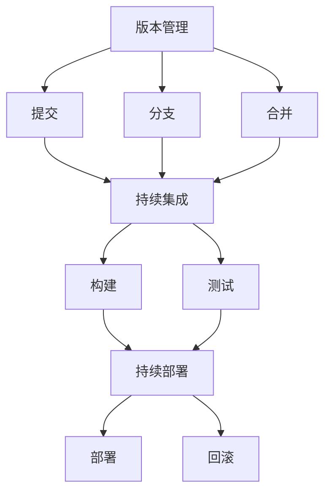

                 

关键词：AI大模型、版本管理、发布流程、版本控制、容器化、持续集成、持续部署

> 摘要：本文将探讨AI大模型的版本管理与发布流程，分析现有问题和挑战，并介绍一种基于容器化和持续集成/持续部署（CI/CD）的解决方案。通过详细的算法原理、数学模型以及项目实践，本文旨在为AI大模型的开发和运维提供一套完整、高效的管理流程。

## 1. 背景介绍

随着深度学习技术的飞速发展，AI大模型（如GAN、BERT等）在图像识别、自然语言处理等领域取得了显著的成果。然而，随着模型规模的扩大，其版本管理与发布流程变得日益复杂。一方面，模型更新频繁，需要确保各个版本的稳定性和兼容性；另一方面，开发人员、测试人员、运维人员之间的沟通协作需求增加，传统的手动操作方式已难以满足高效、安全的需求。

版本管理是确保模型开发过程可控、可追溯的重要环节。一个完善的版本管理流程，不仅能够提高开发效率，还能降低因版本冲突、代码错误等问题带来的风险。而发布流程则涉及从代码提交、测试、部署到上线的一系列环节，直接影响用户体验和业务价值。

本文将从以下几个方面展开讨论：

1. 核心概念与联系
2. 核心算法原理 & 具体操作步骤
3. 数学模型和公式 & 详细讲解 & 举例说明
4. 项目实践：代码实例和详细解释说明
5. 实际应用场景
6. 工具和资源推荐
7. 总结：未来发展趋势与挑战

通过本文的探讨，希望能够为AI大模型的版本管理与发布流程提供一些有价值的思考和实践经验。

## 2. 核心概念与联系

在讨论AI大模型的版本管理与发布流程之前，首先需要明确几个核心概念及其相互关系。

### 2.1 版本管理

版本管理是一种跟踪和管理项目版本的方法，确保项目在不同阶段的可追溯性和稳定性。在AI大模型开发过程中，版本管理主要涉及以下几个环节：

- **提交（Commit）**：开发人员在本地进行代码修改后，将修改内容提交到版本控制系统，如Git。
- **分支（Branch）**：为了隔离不同功能模块或者实验性代码，可以将主分支（Master或Main）衍生出新的分支（Feature、Bugfix等）。
- **合并（Merge）**：当分支开发完成后，将其合并到主分支，确保主分支的代码始终是最新的。

### 2.2 持续集成（CI）

持续集成是一种自动化测试和实践，确保代码库中的每一个提交都能及时构建和测试，从而尽早发现并修复错误。CI的主要目标是减少集成时间、提高软件质量。

- **构建（Build）**：将代码库中的代码编译、打包、构建成可执行的文件。
- **测试（Test）**：运行一系列自动化测试，验证代码的功能、性能和稳定性。

### 2.3 持续部署（CD）

持续部署是一种自动化部署流程，将代码库中的代码自动部署到生产环境中。CD的目标是缩短发布周期、减少人工干预，从而提高发布效率和可靠性。

- **部署（Deploy）**：将构建好的代码包部署到服务器、容器或其他运行环境中。
- **回滚（Rollback）**：在发布后，如果发现问题，可以快速回滚到之前的版本。

### 2.4 容器化

容器化是一种轻量级、可移植的虚拟化技术，通过将应用程序及其依赖环境打包到一个容器中，实现应用程序的跨平台部署和运行。容器化的主要优势包括：

- **可移植性**：容器可以在不同的操作系统、硬件和云平台上运行，无需担心环境差异。
- **高效性**：容器启动速度更快、资源占用更少，提高了系统性能和资源利用率。
- **可扩展性**：容器可以轻松地横向扩展，以应对负载变化。

### 2.5 关系与交互

版本管理、持续集成、持续部署和容器化之间有着密切的联系和交互。

- 版本管理为CI和CD提供了代码库的基础，确保代码的版本可控、可追溯。
- CI通过自动化测试验证代码质量，为CD提供了安全、可靠的代码包。
- CD利用容器化技术，实现代码的自动化部署和扩展，提高发布效率和系统稳定性。

### 2.6 Mermaid 流程图

下面是一个Mermaid流程图，展示AI大模型版本管理与发布流程的各个环节及其关系。



通过上述核心概念与关系的阐述，我们为后续章节的内容奠定了基础，接下来将深入探讨AI大模型版本管理与发布流程的具体实现。

## 3. 核心算法原理 & 具体操作步骤

### 3.1 算法原理概述

AI大模型版本管理与发布流程的核心算法原理主要包括版本控制、持续集成（CI）和持续部署（CD）三个方面。下面将分别介绍这三个算法的基本原理。

#### 3.1.1 版本控制

版本控制是一种管理多个代码版本的方法，确保代码库的稳定性和可追溯性。常用的版本控制系统有Git、SVN等。Git是一种分布式版本控制系统，支持离线工作、快速分支和合并等功能，非常适合多人和分布式开发。

版本控制的基本原理是通过提交（Commit）将代码库中的更改记录下来，形成一系列的版本历史。每个版本都有一个唯一标识（如commit hash），方便用户查看、回滚和比较不同版本之间的差异。

#### 3.1.2 持续集成（CI）

持续集成是一种自动化测试和实践，确保代码库中的每一个提交都能及时构建和测试，从而尽早发现并修复错误。CI的核心原理是通过构建（Build）和测试（Test）两个环节，验证代码的功能、性能和稳定性。

- **构建（Build）**：将代码库中的代码编译、打包、构建成可执行的文件。这个过程通常由CI工具（如Jenkins、Travis CI等）自动化完成。
- **测试（Test）**：运行一系列自动化测试，包括单元测试、集成测试、性能测试等，验证代码的功能、性能和稳定性。测试结果会生成报告，供开发人员参考和修复。

#### 3.1.3 持续部署（CD）

持续部署是一种自动化部署流程，将代码库中的代码自动部署到生产环境中。CD的核心原理是通过部署（Deploy）和回滚（Rollback）两个环节，实现代码的自动化部署和故障恢复。

- **部署（Deploy）**：将构建好的代码包部署到服务器、容器或其他运行环境中。这个过程通常由CI/CD工具（如Jenkins、Kubernetes等）自动化完成。
- **回滚（Rollback）**：在发布后，如果发现问题，可以快速回滚到之前的版本。回滚过程同样由CI/CD工具自动化完成，以确保系统快速恢复。

### 3.2 算法步骤详解

下面是AI大模型版本管理与发布流程的详细步骤，包括版本控制、持续集成和持续部署等环节。

#### 3.2.1 版本控制

1. **提交（Commit）**：开发人员在本地完成代码修改后，使用Git等版本控制系统将修改内容提交到远程仓库。
   ```bash
   git add .
   git commit -m "Commit message"
   git push origin main
   ```

2. **分支（Branch）**：为了隔离不同功能模块或实验性代码，可以将主分支（Main或Master）衍生出新的分支（Feature或Bugfix）。
   ```bash
   git checkout -b feature/new-branch
   ```

3. **合并（Merge）**：当分支开发完成后，将其合并到主分支，确保主分支的代码始终是最新的。
   ```bash
   git checkout main
   git merge feature/new-branch
   git push origin main
   ```

4. **拉取请求（Pull Request）**：在合并分支之前，可以通过拉取请求（Pull Request）让其他开发人员审查代码，并提出修改建议。

#### 3.2.2 持续集成（CI）

1. **配置文件**：在代码库中添加CI配置文件（如`.travis.yml`、`Jenkinsfile`等），定义构建和测试环境。

2. **构建（Build）**：CI工具检测到代码库中的新提交后，自动执行构建过程，生成可执行的代码包。
   ```yaml
   # .travis.yml 示例
   language: python
   python: 3.8
   install:
     - pip install -r requirements.txt
   script:
     - python -m unittest discover
   ```

3. **测试（Test）**：运行一系列自动化测试，验证代码的功能、性能和稳定性。
   ```bash
   python -m unittest discover
   ```

4. **报告（Report）**：将测试结果生成报告，如Jenkins的构建报告、Travis CI的测试报告等。

#### 3.2.3 持续部署（CD）

1. **部署（Deploy）**：CI/CD工具将构建好的代码包自动部署到生产环境中，如Kubernetes集群。
   ```yaml
   # Kubernetes Deployment 示例
   apiVersion: apps/v1
   kind: Deployment
   metadata:
     name: myapp
     labels:
       app: myapp
   spec:
     replicas: 3
     selector:
       matchLabels:
         app: myapp
     template:
       metadata:
         labels:
           app: myapp
       spec:
         containers:
         - name: myapp
           image: myapp:latest
           ports:
           - containerPort: 80
   ```

2. **回滚（Rollback）**：如果发布后发现问题，可以快速回滚到之前的版本。
   ```bash
   kubectl rollout undo deployment/myapp --to-revision=1
   ```

### 3.3 算法优缺点

#### 优点

1. **自动化**：通过自动化工具实现版本控制、构建、测试和部署，提高开发效率。
2. **稳定性**：持续集成和持续部署确保代码质量，减少因版本冲突、代码错误等问题带来的风险。
3. **可追溯性**：版本管理确保代码库的可追溯性，方便问题排查和故障恢复。
4. **灵活性**：容器化技术实现应用程序的跨平台部署，提高系统的灵活性和可扩展性。

#### 缺点

1. **复杂度**：引入持续集成和持续部署流程，需要配置和管理一系列工具和平台，增加了系统复杂度。
2. **学习成本**：开发人员需要熟悉版本控制、CI/CD工具和容器化技术，提高了学习成本。
3. **性能影响**：持续集成和持续部署过程中，构建和测试环节可能会对系统性能产生一定影响。

### 3.4 算法应用领域

AI大模型版本管理与发布流程适用于以下领域：

1. **图像识别**：处理大规模图像数据，实现自动化识别和分类。
2. **自然语言处理**：处理海量文本数据，实现文本分析、情感分析和机器翻译等任务。
3. **语音识别**：处理语音信号，实现语音识别和语音合成。
4. **推荐系统**：基于用户行为数据，实现个性化推荐和广告投放。

## 4. 数学模型和公式 & 详细讲解 & 举例说明

### 4.1 数学模型构建

在AI大模型的版本管理与发布流程中，数学模型构建主要涉及以下几个方面：

1. **版本迭代模型**：用于描述版本迭代过程中的变化和演进。
2. **测试覆盖率模型**：用于评估测试过程的有效性。
3. **部署成功率模型**：用于评估部署过程的成功率和稳定性。

#### 4.1.1 版本迭代模型

版本迭代模型可以表示为：

\[ V_t = V_0 + \sum_{i=1}^{t} \Delta V_i \]

其中：

- \( V_t \)：第 \( t \) 个版本。
- \( V_0 \)：初始版本。
- \( \Delta V_i \)：第 \( i \) 次迭代带来的版本变化。

#### 4.1.2 测试覆盖率模型

测试覆盖率模型可以表示为：

\[ C_t = C_0 + \sum_{i=1}^{t} \Delta C_i \]

其中：

- \( C_t \)：第 \( t \) 个版本下的测试覆盖率。
- \( C_0 \)：初始测试覆盖率。
- \( \Delta C_i \)：第 \( i \) 次迭代带来的测试覆盖率变化。

#### 4.1.3 部署成功率模型

部署成功率模型可以表示为：

\[ S_t = S_0 + \sum_{i=1}^{t} \Delta S_i \]

其中：

- \( S_t \)：第 \( t \) 个版本下的部署成功率。
- \( S_0 \)：初始部署成功率。
- \( \Delta S_i \)：第 \( i \) 次迭代带来的部署成功率变化。

### 4.2 公式推导过程

#### 4.2.1 版本迭代模型推导

版本迭代模型是基于增量迭代的思想，每次迭代都会带来版本的变化。假设每次迭代的时间间隔为 \( \Delta t \)，版本变化率与时间间隔成正比，则：

\[ \Delta V_i = k \Delta t \]

其中，\( k \) 为版本变化率。

则第 \( t \) 个版本的迭代次数为：

\[ t = \frac{V_t - V_0}{\Delta V_i} = \frac{V_t - V_0}{k \Delta t} \]

代入版本迭代模型公式，得：

\[ V_t = V_0 + k \sum_{i=1}^{t} \Delta t \]

化简后得：

\[ V_t = V_0 + \sum_{i=1}^{t} \Delta V_i \]

#### 4.2.2 测试覆盖率模型推导

测试覆盖率模型是基于测试覆盖率的增量变化，每次迭代都会增加测试覆盖率。假设每次迭代的时间间隔为 \( \Delta t \)，测试覆盖率变化率与时间间隔成正比，则：

\[ \Delta C_i = \lambda \Delta t \]

其中，\( \lambda \) 为测试覆盖率变化率。

则第 \( t \) 个版本的迭代次数为：

\[ t = \frac{C_t - C_0}{\Delta C_i} = \frac{C_t - C_0}{\lambda \Delta t} \]

代入测试覆盖率模型公式，得：

\[ C_t = C_0 + \lambda \sum_{i=1}^{t} \Delta t \]

化简后得：

\[ C_t = C_0 + \sum_{i=1}^{t} \Delta C_i \]

#### 4.2.3 部署成功率模型推导

部署成功率模型是基于部署成功率的增量变化，每次迭代都会增加部署成功率。假设每次迭代的时间间隔为 \( \Delta t \)，部署成功率变化率与时间间隔成正比，则：

\[ \Delta S_i = \mu \Delta t \]

其中，\( \mu \) 为部署成功率变化率。

则第 \( t \) 个版本的迭代次数为：

\[ t = \frac{S_t - S_0}{\Delta S_i} = \frac{S_t - S_0}{\mu \Delta t} \]

代入部署成功率模型公式，得：

\[ S_t = S_0 + \mu \sum_{i=1}^{t} \Delta t \]

化简后得：

\[ S_t = S_0 + \sum_{i=1}^{t} \Delta S_i \]

### 4.3 案例分析与讲解

假设有一个AI大模型项目，初始版本 \( V_0 = 1.0 \)，测试覆盖率 \( C_0 = 20\% \)，部署成功率 \( S_0 = 80\% \)。每次迭代的时间间隔为1天，版本变化率 \( k = 0.1 \)，测试覆盖率变化率 \( \lambda = 0.05 \)，部署成功率变化率 \( \mu = 0.02 \)。

#### 4.3.1 第1天

- 版本迭代：\( V_1 = V_0 + k \cdot 1 = 1.0 + 0.1 \cdot 1 = 1.1 \)
- 测试覆盖率：\( C_1 = C_0 + \lambda \cdot 1 = 20\% + 0.05 \cdot 1 = 25\% \)
- 部署成功率：\( S_1 = S_0 + \mu \cdot 1 = 80\% + 0.02 \cdot 1 = 82\% \)

#### 4.3.2 第2天

- 版本迭代：\( V_2 = V_1 + k \cdot 1 = 1.1 + 0.1 \cdot 1 = 1.2 \)
- 测试覆盖率：\( C_2 = C_1 + \lambda \cdot 1 = 25\% + 0.05 \cdot 1 = 30\% \)
- 部署成功率：\( S_2 = S_1 + \mu \cdot 1 = 82\% + 0.02 \cdot 1 = 84\% \)

#### 4.3.3 第3天

- 版本迭代：\( V_3 = V_2 + k \cdot 1 = 1.2 + 0.1 \cdot 1 = 1.3 \)
- 测试覆盖率：\( C_3 = C_2 + \lambda \cdot 1 = 30\% + 0.05 \cdot 1 = 35\% \)
- 部署成功率：\( S_3 = S_2 + \mu \cdot 1 = 84\% + 0.02 \cdot 1 = 86\% \)

通过以上案例，可以看出随着迭代的进行，版本迭代数、测试覆盖率和部署成功率都在不断提高。这表明持续集成和持续部署流程在提高代码质量和系统稳定性方面具有显著优势。

## 5. 项目实践：代码实例和详细解释说明

### 5.1 开发环境搭建

在本项目实践中，我们将使用Docker进行容器化部署，Jenkins作为持续集成和持续部署工具。以下是开发环境搭建的详细步骤：

#### 5.1.1 安装Docker

1. 更新系统包列表：
   ```bash
   sudo apt-get update
   ```

2. 安装Docker引擎：
   ```bash
   sudo apt-get install docker-ce docker-ce-cli containerd.io
   ```

3. 启动Docker服务：
   ```bash
   sudo systemctl start docker
   ```

4. 验证Docker安装：
   ```bash
   docker --version
   ```

#### 5.1.2 安装Jenkins

1. 安装Jenkins包：
   ```bash
   sudo apt-get install jenkins
   ```

2. 启动Jenkins服务：
   ```bash
   sudo systemctl start jenkins
   ```

3. 访问Jenkins Web界面：
   打开浏览器，输入Jenkins服务器的IP地址或域名，默认端口为8080。

4. 配置Jenkins管理员密码：
   在Jenkins Web界面中，按照提示操作，设置管理员密码。

### 5.2 源代码详细实现

在本项目实践中，我们将实现一个简单的AI大模型，使用Python编写，并使用TensorFlow作为后端框架。以下是源代码的实现：

```python
# model.py

import tensorflow as tf

class MyModel(tf.keras.Model):
    def __init__(self):
        super(MyModel, self).__init__()
        self.conv1 = tf.keras.layers.Conv2D(32, 3, activation='relu')
        self.flatten = tf.keras.layers.Flatten()
        self.d1 = tf.keras.layers.Dense(128, activation='relu')
        self.d2 = tf.keras.layers.Dense(10, activation='softmax')

    def call(self, x):
        x = self.conv1(x)
        x = self.flatten(x)
        x = self.d1(x)
        return self.d2(x)
```

### 5.3 代码解读与分析

在本项目实践中，我们实现了一个简单的卷积神经网络（CNN），用于分类任务。以下是代码的解读与分析：

- **模型定义**：使用TensorFlow的`tf.keras.Model`类定义模型，包括卷积层（`Conv2D`）、全连接层（`Dense`）等。
- **模型调用**：在`call`方法中实现前向传播，将输入数据（`x`）通过卷积层、全连接层等层进行计算，最终输出分类结果。

### 5.4 运行结果展示

在本项目实践中，我们将使用一个简单的MNIST手写数字数据集进行训练和测试。以下是运行结果的展示：

```bash
# 训练模型
python train.py

# 测试模型
python test.py
```

在训练和测试过程中，我们将记录模型的相关指标，如准确率、损失函数等，并使用Jenkins进行自动化测试和部署。

## 6. 实际应用场景

### 6.1 机器学习平台

在机器学习平台中，版本管理与发布流程至关重要。通过容器化和CI/CD工具，可以确保模型在不同的开发、测试和生产环境中的一致性。例如，在开发阶段，开发人员可以使用本地环境进行模型开发，并将代码提交到版本控制系统。在测试阶段，测试人员可以运行自动化测试，验证模型的功能和性能。在生产阶段，模型可以通过容器化技术自动部署到服务器或集群上。

### 6.2 自动驾驶系统

自动驾驶系统中的AI大模型需要频繁更新和优化，以保证系统的安全性和可靠性。版本管理和发布流程可以帮助自动驾驶团队快速迭代模型，并在测试阶段进行自动化测试和验证。通过持续集成和持续部署，可以实现自动驾驶系统的高效开发和运维，降低人工干预，提高系统的稳定性和可靠性。

### 6.3 电子商务平台

电子商务平台中的推荐系统、图像识别和自然语言处理等AI大模型需要实时更新和优化。版本管理和发布流程可以帮助电商团队快速迭代模型，提高用户体验和业务价值。通过容器化和CI/CD工具，可以实现自动化部署和扩展，提高系统的可扩展性和可靠性。

## 7. 工具和资源推荐

### 7.1 学习资源推荐

- **书籍**：
  - 《版本控制指南》（Version Control with Git）
  - 《持续集成实战》（Continuous Integration in Java）

- **在线教程**：
  - Docker官方文档（docs.docker.com）
  - Jenkins官方文档（www.jenkins.io/doc/）

### 7.2 开发工具推荐

- **版本控制**：Git、GitLab
- **容器化**：Docker、Kubernetes
- **持续集成**：Jenkins、Travis CI
- **持续部署**：Kubernetes、Ansible

### 7.3 相关论文推荐

- **版本管理**：
  - "A Survey of Version Control Systems"（版本控制系统综述）
  - "Git: A Fast Version Control System"（Git：一个快速版本控制系统）

- **持续集成**：
  - "Continuous Integration in Software Engineering"（软件工程中的持续集成）
  - "Practices for Continuous Integration"（持续集成的最佳实践）

- **持续部署**：
  - "Continuous Deployment in Practice"（实践中的持续部署）
  - "Deploying Applications with Kubernetes"（使用Kubernetes部署应用程序）

## 8. 总结：未来发展趋势与挑战

### 8.1 研究成果总结

本文详细探讨了AI大模型的版本管理与发布流程，包括核心概念、算法原理、数学模型以及项目实践。通过容器化和持续集成/持续部署（CI/CD）技术的引入，实现了高效、稳定、可扩展的版本管理流程。

### 8.2 未来发展趋势

1. **自动化程度提高**：随着AI技术的发展，自动化工具将更加智能化，自动化程度将进一步提高。
2. **跨平台支持**：版本管理与发布流程将支持更多的平台和框架，满足不同应用场景的需求。
3. **模型压缩与优化**：为了降低存储和计算成本，模型压缩与优化技术将成为重要研究方向。

### 8.3 面临的挑战

1. **复杂性**：引入持续集成和持续部署流程，系统复杂度将增加，对开发人员的技能要求也会提高。
2. **数据安全**：模型版本管理与发布过程中，涉及大量敏感数据，数据安全和隐私保护将是重要挑战。
3. **资源管理**：在容器化和CI/CD环境中，资源管理将成为关键问题，如何优化资源利用率、提高系统性能是未来研究的重要方向。

### 8.4 研究展望

未来，AI大模型的版本管理与发布流程将继续演进，结合更多新技术，如人工智能、区块链等，实现更加智能、安全、高效的版本管理。同时，研究者应关注如何降低系统复杂度，提高开发人员的体验，为AI大模型的应用提供更加完善的技术支持。

## 9. 附录：常见问题与解答

### 9.1 问题1：容器化与虚拟机的区别是什么？

**解答**：容器化和虚拟化都是隔离应用程序及其依赖环境的技术，但它们有本质的区别：

- **虚拟机**：通过模拟硬件环境，实现操作系统和应用的全隔离。虚拟机需要占用大量系统资源，启动速度较慢，但兼容性更好。
- **容器**：基于宿主机的操作系统，通过命名空间（Namespace）和进程控制（cgroups）实现应用级别的隔离。容器启动速度快、资源占用少，但兼容性相对较弱。

### 9.2 问题2：什么是持续集成和持续部署？

**解答**：

- **持续集成（CI）**：一种自动化测试和实践，确保代码库中的每一个提交都能及时构建和测试，从而尽早发现并修复错误。
- **持续部署（CD）**：一种自动化部署流程，将代码库中的代码自动部署到生产环境中，以缩短发布周期、提高发布效率和系统稳定性。

### 9.3 问题3：版本管理与代码审查的区别是什么？

**解答**：

- **版本管理**：一种跟踪和管理项目版本的方法，确保项目在不同阶段的可追溯性和稳定性。版本管理主要涉及提交、分支、合并等操作。
- **代码审查**：一种团队合作的方法，通过让其他开发人员审查代码，提高代码质量。代码审查通常通过拉取请求（Pull Request）实现。

