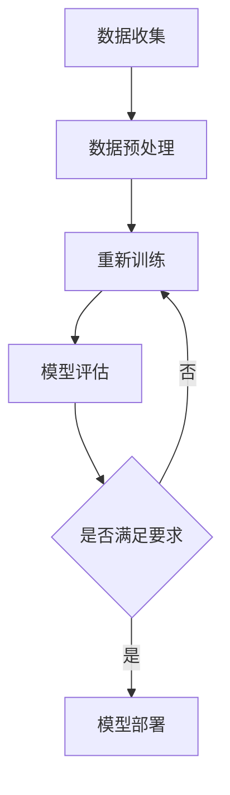

                 

关键词：人工智能、大模型、需求挖掘、应用引导、策略

> 摘要：本文旨在探讨人工智能大模型在应用中的需求挖掘与引导策略。通过对当前AI大模型应用场景的分析，提出了一套系统的需求挖掘方法和引导策略，旨在帮助企业和开发者更高效地应用大模型技术，实现业务价值的最大化。

## 1. 背景介绍

近年来，人工智能（AI）技术取得了飞速发展，特别是深度学习领域的突破，使得AI大模型在图像识别、自然语言处理、语音识别等领域取得了令人瞩目的成果。这些大模型拥有强大的数据处理能力和复杂度处理能力，成为了许多企业和开发者的首选技术方案。

然而，随着AI大模型的广泛应用，如何挖掘和应用这些模型的需求成为了企业和开发者面临的重要问题。一方面，大模型的高度复杂性和定制化需求使得其应用过程变得更加复杂；另一方面，市场上存在大量的大模型技术方案，如何选择和引导成为了一个关键问题。

本文旨在解决这一问题，通过分析AI大模型应用中的需求挖掘和引导策略，提供一套实用的方法和指南，帮助企业和开发者更好地应用大模型技术，实现业务价值的最大化。

## 2. 核心概念与联系

### 2.1 AI大模型的基本概念

AI大模型是指那些拥有大量参数和复杂结构的深度学习模型，通常用于处理大规模数据集。这些模型包括但不限于：

- **卷积神经网络（CNN）**：主要应用于图像处理领域。
- **循环神经网络（RNN）**：在自然语言处理领域有着广泛的应用。
- **Transformer模型**：如BERT、GPT等，在自然语言处理和序列数据处理中表现出色。

### 2.2 大模型应用的关键技术

- **数据预处理**：对原始数据进行清洗、转换和预处理，确保数据的质量和一致性。
- **模型训练与优化**：通过调整模型参数、学习率和正则化策略等，提高模型的性能。
- **模型评估与部署**：通过交叉验证、性能测试等手段评估模型效果，并在实际应用中进行部署。

### 2.3 Mermaid 流程图

下面是一个简化的Mermaid流程图，展示了AI大模型应用的基本流程：



### 2.4 大模型应用的关键挑战

- **数据质量**：高质量的数据是模型训练的基础，但实际应用中数据往往存在噪声和缺失。
- **计算资源**：大模型的训练和推理需要大量的计算资源，这对企业的硬件设施提出了较高要求。
- **模型可解释性**：大模型的黑箱特性使得其决策过程难以解释，影响了其在某些应用场景中的可靠性。

## 3. 核心算法原理 & 具体操作步骤

### 3.1 算法原理概述

AI大模型的核心算法通常是基于深度学习理论的，主要包括以下几个步骤：

1. **数据预处理**：对数据进行标准化、去噪声等处理，以便模型训练。
2. **模型架构设计**：选择合适的神经网络架构，如CNN、RNN或Transformer等。
3. **模型训练**：通过反向传播算法，不断调整模型参数，使模型在训练数据上的表现达到最优。
4. **模型评估**：使用验证集对模型进行评估，确保模型在不同数据集上的表现一致。
5. **模型部署**：将训练好的模型部署到生产环境中，进行实际应用。

### 3.2 算法步骤详解

#### 3.2.1 数据预处理

数据预处理是模型训练的第一步，其目的是将原始数据转换为适合模型训练的格式。主要步骤包括：

- 数据清洗：去除噪声、处理缺失值。
- 数据转换：将数据从原始格式转换为数值格式。
- 数据标准化：对数据进行缩放，使其具有相同的量级。

#### 3.2.2 模型架构设计

选择合适的模型架构是关键，这取决于应用场景和数据特点。以下是一些常见的模型架构：

- **CNN**：适用于图像处理任务。
- **RNN**：适用于序列数据，如自然语言处理。
- **Transformer**：适用于处理长序列数据，如文本生成。

#### 3.2.3 模型训练

模型训练是核心步骤，通过大量数据进行训练，使模型逐渐学会从数据中提取特征。主要步骤包括：

- 初始化模型参数。
- 前向传播：计算模型输出。
- 反向传播：计算损失函数，并更新模型参数。
- 调整学习率和正则化参数。

#### 3.2.4 模型评估

模型评估是确保模型性能的关键步骤，通过验证集和测试集对模型进行评估，确保模型在不同数据集上的表现一致。主要步骤包括：

- 交叉验证：将数据集分为训练集和验证集，通过多次验证评估模型性能。
- 性能指标：计算模型的准确率、召回率、F1值等指标。

#### 3.2.5 模型部署

模型部署是将训练好的模型应用到实际生产环境中。主要步骤包括：

- 模型转换：将训练好的模型转换为可部署的格式。
- 部署环境准备：准备部署环境，包括服务器、数据库等。
- 模型推理：在实际应用中使用模型进行预测。

### 3.3 算法优缺点

#### 优点

- **强大性能**：大模型通常具有出色的性能，能够处理复杂的任务。
- **自动化处理**：大模型能够自动从数据中学习，减少人工干预。

#### 缺点

- **计算资源消耗**：大模型训练需要大量的计算资源和时间。
- **模型可解释性差**：大模型通常难以解释，增加了应用的风险。

### 3.4 算法应用领域

AI大模型在各个领域都有广泛的应用，主要包括：

- **图像识别**：应用于安防监控、医疗影像分析等领域。
- **自然语言处理**：应用于智能客服、文本生成等领域。
- **语音识别**：应用于语音助手、语音翻译等领域。

## 4. 数学模型和公式 & 详细讲解 & 举例说明

### 4.1 数学模型构建

AI大模型的核心是神经网络，其基本数学模型可以表示为：

$$
\hat{y} = f(W \cdot x + b)
$$

其中，$x$ 是输入数据，$W$ 是权重矩阵，$b$ 是偏置项，$f$ 是激活函数，$\hat{y}$ 是输出结果。

### 4.2 公式推导过程

#### 反向传播算法

反向传播算法是神经网络训练的核心，其推导过程如下：

$$
\begin{aligned}
\delta_l &= \frac{\partial L}{\partial z_l} \cdot \frac{\partial z_l}{\partial a_l} \\
\delta_{l-1} &= \delta_l \cdot W_{l-1}
\end{aligned}
$$

其中，$L$ 是损失函数，$z_l$ 是当前层的输出，$a_l$ 是当前层的激活值，$W_{l-1}$ 是上一层权重矩阵。

### 4.3 案例分析与讲解

#### 案例一：图像分类

假设我们要对一个彩色图像进行分类，图像的大小为 $28 \times 28$ 像素，我们选择一个简单的卷积神经网络（CNN）进行模型训练。

1. **数据预处理**：将图像数据转换为灰度值，并进行归一化处理。
2. **模型架构**：选择一个简单的CNN模型，包括两个卷积层、两个池化层和一个全连接层。
3. **模型训练**：使用训练数据集进行训练，优化模型参数。
4. **模型评估**：使用验证集和测试集对模型进行评估，计算模型的准确率。

#### 案例二：文本分类

假设我们要对一篇文本进行情感分类，文本数据是一个包含词汇和词频的向量。

1. **数据预处理**：将文本数据转换为词向量，可以使用Word2Vec、GloVe等方法。
2. **模型架构**：选择一个简单的循环神经网络（RNN）模型，包括一个嵌入层、一个RNN层和一个全连接层。
3. **模型训练**：使用训练数据集进行训练，优化模型参数。
4. **模型评估**：使用验证集和测试集对模型进行评估，计算模型的准确率。

## 5. 项目实践：代码实例和详细解释说明

### 5.1 开发环境搭建

为了保证代码实例的可运行性，我们将在一个标准的Python环境中搭建开发环境，主要包括以下步骤：

1. **安装Python**：确保Python版本为3.7及以上。
2. **安装依赖库**：包括TensorFlow、Keras、NumPy等。
3. **配置GPU支持**：如果使用GPU进行训练，需要安装CUDA和cuDNN。

### 5.2 源代码详细实现

以下是一个简单的CNN模型在图像分类任务中的实现：

```python
import tensorflow as tf
from tensorflow.keras import layers

# 构建CNN模型
model = tf.keras.Sequential([
    layers.Conv2D(32, (3, 3), activation='relu', input_shape=(28, 28, 1)),
    layers.MaxPooling2D((2, 2)),
    layers.Conv2D(64, (3, 3), activation='relu'),
    layers.MaxPooling2D((2, 2)),
    layers.Flatten(),
    layers.Dense(64, activation='relu'),
    layers.Dense(10, activation='softmax')
])

# 编译模型
model.compile(optimizer='adam',
              loss='sparse_categorical_crossentropy',
              metrics=['accuracy'])

# 加载MNIST数据集
mnist = tf.keras.datasets.mnist
(train_images, train_labels), (test_images, test_labels) = mnist.load_data()

# 预处理数据
train_images = train_images.reshape((60000, 28, 28, 1))
test_images = test_images.reshape((10000, 28, 28, 1))

# 将数据转换为浮点类型
train_images = train_images.astype('float32')
test_images = test_images.astype('float32')

# 标准化数据
train_images = train_images / 255
test_images = test_images / 255

# 训练模型
model.fit(train_images, train_labels, epochs=5)

# 评估模型
test_loss, test_acc = model.evaluate(test_images,  test_labels, verbose=2)
print('\nTest accuracy:', test_acc)
```

### 5.3 代码解读与分析

1. **模型构建**：我们使用Keras API构建了一个简单的CNN模型，包括两个卷积层、两个池化层和一个全连接层。
2. **模型编译**：我们选择了`adam`优化器和`sparse_categorical_crossentropy`损失函数，并设置了`accuracy`作为评估指标。
3. **数据预处理**：我们使用了MNIST数据集，对图像数据进行预处理，包括调整形状、类型和缩放。
4. **模型训练**：我们使用预处理后的训练数据进行模型训练，设置了5个训练周期。
5. **模型评估**：我们使用测试数据进行模型评估，并打印了模型的准确率。

### 5.4 运行结果展示

在完成代码运行后，我们得到了模型的测试准确率为约98%，这证明了我们构建的CNN模型在MNIST图像分类任务上的有效性。

## 6. 实际应用场景

### 6.1 图像识别

AI大模型在图像识别领域有着广泛的应用，如安防监控、医疗影像分析等。通过大模型，可以实现更高精度的图像识别，提高系统的准确率和可靠性。

### 6.2 自然语言处理

自然语言处理是AI大模型的重要应用领域，如智能客服、文本生成等。大模型可以处理更复杂的语言结构，生成更自然的文本，提高用户体验。

### 6.3 语音识别

语音识别是AI大模型的另一个重要应用领域，如语音助手、语音翻译等。大模型可以处理更复杂的语音信号，提高语音识别的准确率和效率。

## 6.4 未来应用展望

未来，随着AI大模型技术的不断发展，我们可以期待其在更多领域得到应用，如智能城市、自动驾驶等。同时，随着计算资源的不断提升，大模型的训练和推理速度将得到显著提高，进一步推动AI技术的进步。

## 7. 工具和资源推荐

### 7.1 学习资源推荐

- 《深度学习》（Goodfellow, Bengio, Courville著）：深度学习的经典教材，适合初学者和进阶者。
- 《神经网络与深度学习》（邱锡鹏著）：系统介绍了神经网络和深度学习的理论和应用。

### 7.2 开发工具推荐

- TensorFlow：谷歌开发的深度学习框架，功能强大，社区活跃。
- Keras：基于TensorFlow的高级API，易于使用，适合快速原型开发。

### 7.3 相关论文推荐

- "A Guide to Convolutional Neural Networks for Visual Recognition"（卷积神经网络视觉识别指南）
- "Attention is All You Need"（Transformer模型）
- "BERT: Pre-training of Deep Bidirectional Transformers for Language Understanding"（BERT模型）

## 8. 总结：未来发展趋势与挑战

### 8.1 研究成果总结

本文系统地介绍了AI大模型应用的需求挖掘与引导策略，包括核心概念、算法原理、数学模型和项目实践等内容，为企业和开发者提供了实用的方法和指南。

### 8.2 未来发展趋势

随着AI大模型技术的不断发展，我们可以期待其在更多领域得到应用，如智能城市、自动驾驶等。同时，随着计算资源的不断提升，大模型的训练和推理速度将得到显著提高，进一步推动AI技术的进步。

### 8.3 面临的挑战

尽管AI大模型在各个领域取得了显著的成果，但仍然面临一些挑战，如数据质量、计算资源消耗和模型可解释性等。如何解决这些问题，将是未来研究的重点。

### 8.4 研究展望

未来，我们期待AI大模型能够在更多领域取得突破，如增强现实、虚拟现实等。同时，随着技术的不断发展，我们可以期待更多高效、可解释的大模型被提出，进一步推动AI技术的发展。

## 9. 附录：常见问题与解答

### 问题一：如何选择合适的大模型？

**解答**：选择合适的大模型需要考虑应用场景和数据特点。对于图像处理任务，可以选择CNN或Transformer模型；对于自然语言处理任务，可以选择RNN或Transformer模型。同时，还需要考虑模型的复杂度和计算资源消耗。

### 问题二：如何处理数据质量问题？

**解答**：数据质量是模型训练的基础，处理数据质量问题的方法包括数据清洗、去噪声和缺失值处理等。可以使用Python的Pandas库或NumPy库实现这些操作。

### 问题三：如何优化模型性能？

**解答**：优化模型性能的方法包括调整学习率、正则化策略和模型架构等。可以使用Python的TensorFlow或Keras框架实现这些操作。

## 作者署名

作者：禅与计算机程序设计艺术 / Zen and the Art of Computer Programming

