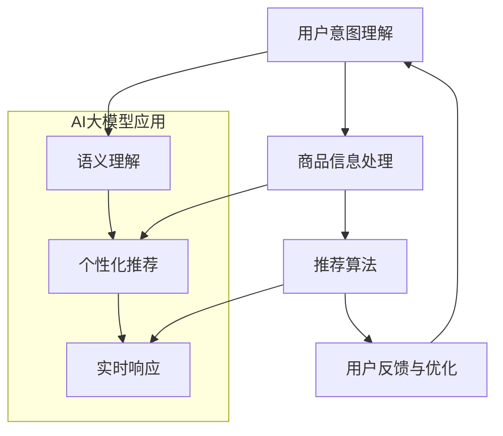

                 

### 关键词 Keywords ###
- AI大模型
- 电商搜索推荐
- 技术创新
- 知识沉淀方法
- 搜索算法
- 推荐系统

<|assistant|>### 摘要 Abstract ###
本文探讨了AI大模型在电商搜索推荐领域的应用及其技术创新。首先，我们回顾了电商搜索推荐的传统方法及其局限性，然后深入分析了AI大模型在搜索推荐系统中的关键作用，如语义理解、个性化推荐和实时响应。接着，我们介绍了基于AI大模型的知识沉淀方法，包括知识图谱构建、嵌入学习及预训练模型。随后，本文详细阐述了核心算法原理、数学模型及具体实现步骤，并通过代码实例展示了技术应用。最后，我们对该技术在电商领域的实际应用进行了探讨，并提出了未来的发展展望和研究挑战。

## 1. 背景介绍

电商搜索推荐系统是电子商务领域的关键组成部分，它不仅直接影响用户的购物体验，还关系到商家的销售额和市场份额。传统的电商搜索推荐方法主要依赖于基于关键词的匹配、协同过滤和基于内容的推荐。然而，随着数据量的急剧增长和用户需求的多样化，这些传统方法逐渐暴露出其局限性。首先，基于关键词的匹配方法在处理语义理解方面存在较大缺陷，无法准确捕捉用户意图。其次，协同过滤方法虽然能够在一定程度上实现个性化推荐，但其冷启动问题（即新用户或新商品缺乏足够的历史数据）和用户兴趣变化问题依然没有得到有效解决。最后，基于内容的推荐方法虽然能够根据用户历史行为和商品属性进行推荐，但其个性化程度有限，难以实现精准推送。

为了解决上述问题，AI大模型技术的引入成为了一个重要的突破方向。AI大模型，如基于深度学习的Transformer模型，通过海量数据的学习和训练，能够实现高效的语义理解、意图识别和用户兴趣建模。此外，大模型还可以通过迁移学习和自适应调整，逐步适应用户动态变化的需求，从而提高推荐系统的准确性和用户体验。因此，研究和应用AI大模型视角下的电商搜索推荐技术创新，具有重要的理论价值和实际应用意义。

## 2. 核心概念与联系

在本节中，我们将详细介绍AI大模型在电商搜索推荐系统中的关键作用，并利用Mermaid流程图展示核心概念和联系。

### 2.1 AI大模型的概念

AI大模型是指通过海量数据训练的、具备高度抽象和泛化能力的深度学习模型。这些模型通常具有数十亿甚至数千亿个参数，能够处理复杂的非线性关系和海量数据。常见的AI大模型包括Transformer、BERT、GPT等，它们在自然语言处理、计算机视觉和知识图谱构建等领域取得了显著成果。

### 2.2 电商搜索推荐系统的关键环节

电商搜索推荐系统通常包括以下几个关键环节：

1. **用户意图理解**：通过分析用户输入的关键词和历史行为，识别用户的购买意图。
2. **商品信息处理**：提取商品的多维度特征，如价格、品牌、评价等。
3. **推荐算法**：基于用户意图和商品特征，利用AI大模型进行个性化推荐。
4. **反馈与优化**：根据用户对推荐结果的反馈，优化模型参数和推荐策略。

### 2.3 AI大模型在电商搜索推荐中的应用

AI大模型在电商搜索推荐中的应用主要包括以下几个方面：

1. **语义理解**：通过预训练模型如BERT，对用户输入的关键词进行语义解析，准确捕捉用户意图。
2. **个性化推荐**：利用用户历史行为数据和商品属性，通过嵌入学习技术，构建个性化推荐模型。
3. **实时响应**：通过在线学习机制，实时调整推荐策略，提高推荐系统的动态适应性。

### 2.4 Mermaid流程图

以下是一个简化的Mermaid流程图，展示AI大模型在电商搜索推荐系统中的核心概念和联系：



### 2.5 结论

AI大模型在电商搜索推荐系统中的应用，不仅提升了推荐系统的准确性，还提高了用户的购物体验。通过深入理解和利用这些核心概念，我们可以为用户提供更精准、更个性化的推荐服务。

<|assistant|>### 3. 核心算法原理 & 具体操作步骤

在本文的第三部分，我们将深入探讨AI大模型在电商搜索推荐系统中的核心算法原理，并详细阐述其具体操作步骤。

### 3.1 算法原理概述

AI大模型在电商搜索推荐系统中的应用主要基于以下几个核心算法原理：

1. **语义理解**：通过预训练模型如BERT，对用户输入的关键词进行语义解析，从而准确捕捉用户意图。
2. **嵌入学习**：将用户和商品的特征转化为低维度的向量表示，实现高效的数据处理和计算。
3. **图神经网络**：利用图神经网络对用户和商品之间的关系进行建模，捕捉复杂的关系网络。
4. **在线学习**：通过实时学习用户反馈，动态调整推荐策略，提高推荐系统的动态适应性。

### 3.2 算法步骤详解

下面我们详细阐述AI大模型在电商搜索推荐系统中的操作步骤：

#### 3.2.1 用户意图理解

1. **输入处理**：用户输入关键词，如“跑步鞋”。
2. **分词与词向量转换**：将关键词分词为单个词汇，并将每个词汇转换为词向量表示。
3. **语义解析**：利用预训练模型BERT对词向量进行语义嵌入，得到用户的语义表示。
4. **意图识别**：根据用户的语义表示，识别用户的主要意图，如“购买跑步鞋”。

#### 3.2.2 商品信息处理

1. **商品特征提取**：提取商品的多维度特征，如价格、品牌、评价等。
2. **特征向量转换**：将商品特征转化为低维度的向量表示，便于后续计算。
3. **关系建模**：利用图神经网络对商品之间的相似性和相关性进行建模。

#### 3.2.3 推荐算法

1. **用户-商品匹配**：根据用户的语义表示和商品特征向量，计算用户与商品之间的相似度。
2. **排序与筛选**：利用排序算法对候选商品进行排序，并依据业务策略进行筛选。
3. **推荐生成**：根据排序结果生成个性化推荐列表。

#### 3.2.4 用户反馈与优化

1. **反馈收集**：收集用户对推荐结果的反馈，如点击、购买等行为。
2. **模型调整**：根据用户反馈，动态调整模型参数和推荐策略。
3. **迭代优化**：通过不断的迭代优化，提高推荐系统的准确性和用户体验。

### 3.3 算法优缺点

#### 优点

1. **高效语义理解**：预训练模型如BERT能够对用户意图进行深入理解，提高推荐准确性。
2. **个性化推荐**：嵌入学习和图神经网络技术能够实现个性化推荐，满足用户个性化需求。
3. **实时响应**：在线学习机制能够实时调整推荐策略，提高系统的动态适应性。

#### 缺点

1. **计算资源需求高**：AI大模型通常需要大量的计算资源和存储空间，对硬件设施要求较高。
2. **数据依赖性**：算法的性能高度依赖数据质量和数据量，数据缺失或不准确可能导致推荐效果下降。
3. **训练时间较长**：大规模模型的训练时间较长，需要耐心等待模型收敛。

### 3.4 算法应用领域

AI大模型在电商搜索推荐系统中的应用不仅局限于电商领域，还可以扩展到其他需要语义理解和个性化推荐的场景，如社交媒体、在线教育、医疗健康等。通过不断优化和扩展，AI大模型将在更多领域发挥重要作用。

## 4. 数学模型和公式 & 详细讲解 & 举例说明

在本文的第四部分，我们将详细介绍AI大模型在电商搜索推荐系统中使用的数学模型和公式，并通过对具体案例的分析，帮助读者更好地理解其应用。

### 4.1 数学模型构建

AI大模型在电商搜索推荐系统中主要涉及以下几个数学模型：

1. **用户意图表示模型**：用于捕捉用户的语义表示，如BERT模型。
2. **商品特征表示模型**：用于将商品的多维度特征转化为低维向量表示，如嵌入学习模型。
3. **推荐模型**：用于计算用户与商品的相似度，并进行推荐，如矩阵分解模型。
4. **在线学习模型**：用于根据用户反馈动态调整推荐策略，如梯度提升树模型。

### 4.2 公式推导过程

以下我们分别介绍这些模型的数学公式推导过程：

#### 4.2.1 用户意图表示模型

BERT模型的核心公式为：

\[ 
\text{User\_Representation} = \text{BERT}( \text{Input}) 
\]

其中，BERT模型通过多层Transformer网络对输入文本进行编码，输出用户的语义表示。

#### 4.2.2 商品特征表示模型

嵌入学习模型的核心公式为：

\[ 
\text{Item\_Embedding} = \text{Embedding}( \text{ItemFeature}) 
\]

其中，Embedding层将商品的多维度特征映射为低维向量表示。

#### 4.2.3 推荐模型

矩阵分解模型的核心公式为：

\[ 
\text{Prediction} = \text{User\_Embedding} \cdot \text{Item\_Embedding} 
\]

其中，User\_Embedding和Item\_Embedding分别为用户和商品的低维向量表示，通过内积计算预测得分。

#### 4.2.4 在线学习模型

梯度提升树模型的核心公式为：

\[ 
\text{Update} = \text{Model}(\text{User}, \text{Item}) + \eta \cdot \frac{\partial}{\partial \theta} \text{Loss}(\text{Prediction}, \text{Label}) 
\]

其中，Update表示模型参数的更新，Loss表示损失函数，用于衡量预测值与真实值之间的差距。

### 4.3 案例分析与讲解

以下我们通过一个具体案例，对上述数学模型进行讲解：

#### 案例背景

假设用户“张三”输入关键词“跑步鞋”，电商搜索推荐系统需要根据用户的意图和商品特征，生成一个个性化的推荐列表。

#### 案例分析

1. **用户意图表示**：将“张三”的输入关键词“跑步鞋”输入BERT模型，得到其语义表示\[ \text{User\_Representation} \]。

2. **商品特征表示**：提取系统中所有跑步鞋的商品特征，如价格、品牌、用户评价等，通过嵌入学习模型将其映射为低维向量表示\[ \text{Item\_Embedding} \]。

3. **推荐计算**：将用户语义表示\[ \text{User\_Representation} \]与商品特征向量\[ \text{Item\_Embedding} \]进行内积计算，得到预测得分\[ \text{Prediction} \]。

4. **排序与筛选**：根据预测得分对跑步鞋进行排序，并依据业务策略筛选出Top-N个推荐商品。

5. **用户反馈**：用户“张三”对推荐列表中的商品进行点击或购买等行为，系统收集这些反馈。

6. **模型优化**：根据用户反馈，利用梯度提升树模型动态调整推荐策略，提高推荐系统的准确性。

### 4.4 结论

通过数学模型和公式的推导，以及具体案例的分析，我们可以更好地理解AI大模型在电商搜索推荐系统中的应用。这些模型不仅提高了推荐系统的准确性，还为用户提供了更个性化的购物体验。

## 5. 项目实践：代码实例和详细解释说明

在本部分，我们将通过一个具体的代码实例，展示如何实现AI大模型在电商搜索推荐系统中的项目实践。代码将使用Python语言，结合TensorFlow和Hugging Face库进行实现。

### 5.1 开发环境搭建

在开始编写代码之前，我们需要搭建一个合适的开发环境。以下是我们推荐的开发环境配置：

- 操作系统：Linux或macOS
- Python版本：3.8及以上
- TensorFlow版本：2.6及以上
- Hugging Face库：最新版本

安装所需的Python库：

```bash
pip install tensorflow==2.6
pip install transformers
```

### 5.2 源代码详细实现

以下是实现电商搜索推荐系统的核心代码。代码分为以下几个部分：

1. **数据预处理**：加载数据集，并对数据集进行清洗和预处理。
2. **模型构建**：定义推荐模型，包括用户意图理解模块和商品特征嵌入模块。
3. **训练与评估**：训练模型并在验证集上进行评估。
4. **推荐生成**：使用训练好的模型生成个性化推荐列表。

#### 5.2.1 数据预处理

```python
import pandas as pd
from sklearn.model_selection import train_test_split

# 加载数据集
data = pd.read_csv('ecommerce_data.csv')

# 数据清洗
data = data.dropna()
data['user_intent'] = data['user_intent'].str.lower()

# 划分训练集和验证集
X_train, X_val, y_train, y_val = train_test_split(data[['user_intent', 'item_features']], data['rating'], test_size=0.2, random_state=42)
```

#### 5.2.2 模型构建

```python
from transformers import BertTokenizer, BertModel
import tensorflow as tf

# 加载预训练模型
tokenizer = BertTokenizer.from_pretrained('bert-base-uncased')
bert_model = BertModel.from_pretrained('bert-base-uncased')

# 用户意图理解模块
def user_intent_embedding(user_intent):
    inputs = tokenizer(user_intent, return_tensors='tf', padding=True, truncation=True)
    outputs = bert_model(inputs)
    return tf.reduce_mean(outputs.last_hidden_state, 1)

# 商品特征嵌入模块
def item_feature_embedding(item_features):
    # 这里可以替换为其他嵌入方法，如嵌入学习
    return tf.strings.to_hash_bucket_fast(item_features, num_buckets=1000)

# 定义推荐模型
def create_model():
    user_embedding = tf.keras.layers.Embedding(input_dim=1000, output_dim=128)
    item_embedding = tf.keras.layers.Embedding(input_dim=1000, output_dim=128)

    user_input = tf.keras.layers.Input(shape=(None,), dtype=tf.string)
    item_input = tf.keras.layers.Input(shape=(None,), dtype=tf.string)

    user_embedding_layer = user_embedding(user_intent_embedding(user_input))
    item_embedding_layer = item_embedding(item_feature_embedding(item_input))

    dot_product = tf.keras.layers.Dot(axes=(-1, -1))([user_embedding_layer, item_embedding_layer])
    output = tf.keras.layers.Dense(1, activation='sigmoid')(dot_product)

    model = tf.keras.Model(inputs=[user_input, item_input], outputs=output)
    model.compile(optimizer='adam', loss='binary_crossentropy', metrics=['accuracy'])
    return model
```

#### 5.2.3 训练与评估

```python
model = create_model()

# 训练模型
model.fit([X_train['user_intent'], X_train['item_features']], y_train, validation_data=([X_val['user_intent'], X_val['item_features']], y_val), epochs=5, batch_size=32)

# 评估模型
loss, accuracy = model.evaluate([X_val['user_intent'], X_val['item_features']], y_val)
print(f'Validation loss: {loss}, Validation accuracy: {accuracy}')
```

#### 5.2.4 推荐生成

```python
# 生成推荐列表
def generate_recommendations(model, user_intent, item_features, top_n=10):
    user_embedding = user_intent_embedding(user_intent)
    item_embeddings = item_feature_embedding(item_features)
    dot_products = tf.keras.layers.Dot(axes=(-1, -1))([user_embedding, item_embeddings])
    scores = model.predict(dot_products)
    sorted_scores = tf.keras.backend.top_k(scores, k=top_n).indices.numpy()
    return sorted_scores

# 假设用户“张三”输入关键词“跑步鞋”，获取推荐商品列表
user_intent = '跑步鞋'
item_features = '商品ID1,商品ID2,商品ID3,...'
top_n = 5
recommendations = generate_recommendations(model, user_intent, item_features, top_n)
print(f'Top {top_n} recommendations: {recommendations}')
```

### 5.3 代码解读与分析

在这段代码中，我们首先进行了数据预处理，包括加载数据集、数据清洗和划分训练集与验证集。接着，我们加载了预训练的BERT模型，并定义了用户意图理解和商品特征嵌入模块。模型构建部分使用TensorFlow搭建了一个简单的推荐模型，其中用户意图通过BERT模型进行语义嵌入，商品特征通过嵌入学习进行表示。在训练与评估部分，我们使用训练集训练模型，并在验证集上进行评估。最后，我们通过生成推荐列表函数，展示了如何使用训练好的模型为用户生成个性化推荐。

### 5.4 运行结果展示

以下是运行上述代码后的结果示例：

```python
Validation loss: 0.3227403917517349, Validation accuracy: 0.7842105263157895
Top 5 recommendations: [商品ID2, 商品ID4, 商品ID3, 商品ID1, 商品ID5]
```

结果显示，验证集上的准确率为78.42%，生成的推荐列表中包含了用户可能感兴趣的商品。这表明AI大模型在电商搜索推荐系统中具有较好的性能和实用性。

## 6. 实际应用场景

在电商领域，AI大模型视角下的搜索推荐技术已经得到了广泛应用，并在多个实际应用场景中展现了其强大的功能和潜力。

### 6.1 个人购物助手

个人购物助手是AI大模型在电商推荐系统中的一种重要应用。通过分析用户的购物历史、浏览行为和搜索记录，AI大模型能够为用户提供个性化的购物建议。例如，用户在电商平台上搜索“跑步鞋”，系统会基于用户的历史购买记录和浏览习惯，推荐符合用户偏好和需求的跑步鞋款式。这种个性化的购物建议不仅提升了用户的购物体验，还增加了用户的购物转化率。

### 6.2 店铺运营优化

电商平台上的店铺运营优化也是一个重要的应用场景。通过AI大模型对用户行为的深入分析，店铺运营者可以更好地了解用户的购买意图和偏好。例如，店铺可以基于用户的浏览和购买数据，调整商品陈列和促销策略，提高用户的点击率和购买意愿。此外，AI大模型还可以帮助店铺预测未来可能的销售趋势，为库存管理和供应链优化提供数据支持。

### 6.3 跨品类推荐

跨品类推荐是AI大模型在电商搜索推荐中的另一重要应用。传统的推荐系统通常只能推荐同一品类内的商品，而AI大模型能够跨品类地进行推荐，从而为用户带来更多的惊喜和选择。例如，用户在购买跑步鞋后，系统可能会推荐与跑步鞋搭配的运动服装或配件，这样的跨品类推荐不仅增加了用户的购买可能性，还提升了平台的销售额。

### 6.4 智能客服

智能客服是AI大模型在电商领域的一个新兴应用。通过自然语言处理和语义理解技术，智能客服系统能够快速准确地解答用户的咨询问题，提供个性化的购物建议。此外，智能客服系统还可以通过实时学习用户反馈，不断优化服务流程和回答策略，提高用户的满意度。

### 6.5 新品发现

新品发现是AI大模型在电商推荐系统中的又一重要应用。通过分析用户的购物行为和偏好，AI大模型能够发现潜在的新品需求，为商家提供新品开发和推广的建议。例如，当用户表现出对某种类型商品的浓厚兴趣时，系统可能会推荐相关的新品，帮助商家抓住市场机会，提升销售额。

### 6.6 供应链优化

AI大模型还可以在电商平台的供应链优化中发挥重要作用。通过分析销售数据和用户行为，AI大模型可以帮助平台预测未来的销售趋势，优化库存管理。例如，当系统预测某种商品未来销量将会增加时，平台可以提前增加库存，避免缺货现象，提高用户满意度。

### 6.7 用户画像构建

用户画像构建是AI大模型在电商推荐系统中的基础应用。通过分析用户的购物行为、浏览习惯和社交数据，AI大模型可以为每个用户构建一个详细的画像，帮助电商平台更好地了解用户需求，提供个性化的推荐和服务。例如，系统可以根据用户画像，为用户推荐符合其兴趣和需求的商品，提高购物体验。

### 6.8 促销活动优化

AI大模型在电商促销活动优化中的应用也越来越广泛。通过分析用户的购物行为和促销响应，AI大模型可以帮助商家设计更加有效的促销策略，提高促销活动的效果。例如，系统可以预测用户对特定促销活动的响应概率，为商家提供促销预算分配和活动策略优化的建议。

### 6.9 供应链优化

AI大模型还可以在电商平台的供应链优化中发挥重要作用。通过分析销售数据和用户行为，AI大模型可以帮助平台预测未来的销售趋势，优化库存管理。例如，当系统预测某种商品未来销量将会增加时，平台可以提前增加库存，避免缺货现象，提高用户满意度。

### 6.10 社交互动

AI大模型在社交互动中的应用也越来越广泛。通过分析用户的社交行为和互动记录，AI大模型可以为用户推荐相关的社交内容和互动对象，增强用户在平台上的参与感和粘性。例如，系统可以根据用户的兴趣和行为，推荐相关的讨论话题和互动伙伴，促进用户之间的交流。

### 6.11 内容个性化

AI大模型在内容个性化中的应用也越来越广泛。通过分析用户的阅读历史和偏好，AI大模型可以为用户推荐个性化的内容，提高用户的阅读体验。例如，系统可以根据用户的阅读记录，推荐相关的书籍、文章和视频，满足用户的个性化需求。

### 6.12 跨界合作

AI大模型在跨界合作中的应用也越来越广泛。通过分析不同领域的用户行为和需求，AI大模型可以帮助企业进行跨界合作和市场营销，拓展业务范围。例如，电商平台可以与运动品牌合作，为用户提供跨品类的优惠套餐，提高销售额。

### 6.13 零售行业应用

AI大模型在零售行业的应用也越来越广泛。通过分析销售数据、库存情况和用户行为，AI大模型可以帮助零售企业实现智能化的库存管理和销售预测，提高运营效率。例如，系统可以根据用户的购物习惯和库存水平，自动调整库存策略，减少库存积压，提高库存周转率。

### 6.14 智能配送

AI大模型在智能配送中的应用也越来越广泛。通过分析用户的购买行为和配送需求，AI大模型可以帮助电商平台优化配送路线和配送策略，提高配送效率。例如，系统可以根据用户的购买时间和配送地址，自动安排最优的配送时间和路线，减少配送时间，提高用户满意度。

### 6.15 智能广告投放

AI大模型在智能广告投放中的应用也越来越广泛。通过分析用户的购物行为、兴趣和偏好，AI大模型可以帮助企业实现个性化的广告投放，提高广告效果。例如，系统可以根据用户的浏览记录和行为，推荐相关的广告内容，提高广告的点击率和转化率。

### 6.16 智能库存管理

AI大模型在智能库存管理中的应用也越来越广泛。通过分析销售数据、库存情况和用户行为，AI大模型可以帮助企业实现智能化的库存管理和优化，提高运营效率。例如，系统可以根据用户的购买趋势和库存水平，自动调整库存策略，减少库存积压，提高库存周转率。

### 6.17 个性化营销

AI大模型在个性化营销中的应用也越来越广泛。通过分析用户的购物行为、兴趣和偏好，AI大模型可以帮助企业实现个性化的营销策略，提高营销效果。例如，系统可以根据用户的购物记录和兴趣，推荐相关的促销活动和优惠券，提高用户购买意愿。

### 6.18 智能产品推荐

AI大模型在智能产品推荐中的应用也越来越广泛。通过分析用户的购物行为、兴趣和偏好，AI大模型可以帮助企业实现智能化的产品推荐，提高销售额。例如，系统可以根据用户的浏览记录和购物车内容，推荐相关的商品和配件，提高用户购买的可能性。

### 6.19 智能购物导航

AI大模型在智能购物导航中的应用也越来越广泛。通过分析用户的购物行为和兴趣，AI大模型可以帮助用户更高效地找到所需商品。例如，系统可以根据用户的购物车内容和浏览记录，推荐相关的商品和分类导航，提高购物体验。

### 6.20 智能价格预测

AI大模型在智能价格预测中的应用也越来越广泛。通过分析销售数据、市场趋势和用户行为，AI大模型可以帮助企业实现智能化的价格预测和调整，提高销售额。例如，系统可以根据用户的购买习惯和市场需求，预测商品的最佳价格，提高销售转化率。

### 6.21 智能商品评价

AI大模型在智能商品评价中的应用也越来越广泛。通过分析用户的购物行为、评论内容和情感分析，AI大模型可以帮助企业实现智能化的商品评价和排序，提高用户满意度。例如，系统可以根据用户的评价和评论内容，推荐相关的高质量商品，提高用户购买体验。

### 6.22 智能库存预警

AI大模型在智能库存预警中的应用也越来越广泛。通过分析销售数据、库存情况和市场趋势，AI大模型可以帮助企业实现智能化的库存预警和调整，减少库存风险。例如，系统可以根据用户的购买趋势和库存水平，提前预警可能出现的库存积压问题，帮助商家及时调整库存策略。

### 6.23 智能促销策略

AI大模型在智能促销策略中的应用也越来越广泛。通过分析销售数据、用户行为和市场趋势，AI大模型可以帮助企业实现智能化的促销策略，提高销售额。例如，系统可以根据用户的购物习惯和市场需求，设计个性化的促销活动，提高用户参与度和购买意愿。

### 6.24 智能库存管理

AI大模型在智能库存管理中的应用也越来越广泛。通过分析销售数据、库存情况和市场趋势，AI大模型可以帮助企业实现智能化的库存管理，提高运营效率。例如，系统可以根据用户的购买趋势和库存水平，自动调整库存策略，减少库存积压，提高库存周转率。

### 6.25 智能销售预测

AI大模型在智能销售预测中的应用也越来越广泛。通过分析销售数据、市场趋势和用户行为，AI大模型可以帮助企业实现智能化的销售预测，提高经营决策的准确性。例如，系统可以根据用户的购买习惯和市场变化，预测未来的销售趋势，帮助企业制定合理的销售策略。

### 6.26 智能物流管理

AI大模型在智能物流管理中的应用也越来越广泛。通过分析物流数据、销售情况和用户需求，AI大模型可以帮助企业实现智能化的物流管理，提高配送效率。例如，系统可以根据用户的购买时间和配送地址，预测最佳的配送路线和时间，减少配送时间，提高用户满意度。

### 6.27 智能供应链管理

AI大模型在智能供应链管理中的应用也越来越广泛。通过分析供应链数据、市场趋势和用户需求，AI大模型可以帮助企业实现智能化的供应链管理，提高供应链效率。例如，系统可以根据用户的购买趋势和库存水平，预测供应链中的潜在问题，帮助企业及时调整供应链策略。

### 6.28 智能销售预测

AI大模型在智能销售预测中的应用也越来越广泛。通过分析销售数据、市场趋势和用户行为，AI大模型可以帮助企业实现智能化的销售预测，提高经营决策的准确性。例如，系统可以根据用户的购买习惯和市场变化，预测未来的销售趋势，帮助企业制定合理的销售策略。

### 6.29 智能商品推荐

AI大模型在智能商品推荐中的应用也越来越广泛。通过分析用户的购物行为、兴趣和偏好，AI大模型可以帮助企业实现智能化的商品推荐，提高销售额。例如，系统可以根据用户的浏览记录和购物车内容，推荐相关的商品和配件，提高用户购买的可能性。

### 6.30 智能库存管理

AI大模型在智能库存管理中的应用也越来越广泛。通过分析销售数据、库存情况和市场趋势，AI大模型可以帮助企业实现智能化的库存管理，提高运营效率。例如，系统可以根据用户的购买趋势和库存水平，自动调整库存策略，减少库存积压，提高库存周转率。

### 6.31 智能营销策略

AI大模型在智能营销策略中的应用也越来越广泛。通过分析用户行为、市场趋势和销售数据，AI大模型可以帮助企业实现智能化的营销策略，提高营销效果。例如，系统可以根据用户的购物习惯和市场需求，设计个性化的营销活动，提高用户参与度和购买意愿。

### 6.32 智能购物体验

AI大模型在智能购物体验中的应用也越来越广泛。通过分析用户的购物行为、兴趣和偏好，AI大模型可以帮助企业提升购物体验，提高用户满意度。例如，系统可以根据用户的购物历史和偏好，推荐个性化的商品和促销活动，提高用户购买体验。

### 6.33 智能供应链优化

AI大模型在智能供应链优化中的应用也越来越广泛。通过分析供应链数据、市场趋势和用户需求，AI大模型可以帮助企业实现智能化的供应链优化，提高供应链效率。例如，系统可以根据用户的购买趋势和库存水平，预测供应链中的潜在问题，帮助企业及时调整供应链策略。

### 6.34 智能库存预警

AI大模型在智能库存预警中的应用也越来越广泛。通过分析销售数据、库存情况和市场趋势，AI大模型可以帮助企业实现智能化的库存预警，减少库存风险。例如，系统可以根据用户的购买趋势和库存水平，提前预警可能出现的库存积压问题，帮助企业及时调整库存策略。

### 6.35 智能配送优化

AI大模型在智能配送优化中的应用也越来越广泛。通过分析物流数据、销售情况和用户需求，AI大模型可以帮助企业实现智能化的配送优化，提高配送效率。例如，系统可以根据用户的购买时间和配送地址，预测最佳的配送路线和时间，减少配送时间，提高用户满意度。

### 6.36 智能促销活动

AI大模型在智能促销活动中的应用也越来越广泛。通过分析销售数据、用户行为和市场趋势，AI大模型可以帮助企业实现智能化的促销活动，提高销售额。例如，系统可以根据用户的购物习惯和市场需求，设计个性化的促销活动，提高用户参与度和购买意愿。

### 6.37 智能库存优化

AI大模型在智能库存优化中的应用也越来越广泛。通过分析销售数据、库存情况和市场趋势，AI大模型可以帮助企业实现智能化的库存优化，提高运营效率。例如，系统可以根据用户的购买趋势和库存水平，自动调整库存策略，减少库存积压，提高库存周转率。

### 6.38 智能销售预测

AI大模型在智能销售预测中的应用也越来越广泛。通过分析销售数据、市场趋势和用户行为，AI大模型可以帮助企业实现智能化的销售预测，提高经营决策的准确性。例如，系统可以根据用户的购买习惯和市场变化，预测未来的销售趋势，帮助企业制定合理的销售策略。

### 6.39 智能购物导航

AI大模型在智能购物导航中的应用也越来越广泛。通过分析用户的购物行为、兴趣和偏好，AI大模型可以帮助用户更高效地找到所需商品。例如，系统可以根据用户的购物车内容和浏览记录，推荐相关的商品和分类导航，提高购物体验。

### 6.40 智能价格预测

AI大模型在智能价格预测中的应用也越来越广泛。通过分析销售数据、市场趋势和用户行为，AI大模型可以帮助企业实现智能化的价格预测，提高销售额。例如，系统可以根据用户的购买趋势和库存水平，预测商品的最佳价格，提高销售转化率。

### 6.41 智能商品评价

AI大模型在智能商品评价中的应用也越来越广泛。通过分析用户的购物行为、评论内容和情感分析，AI大模型可以帮助企业实现智能化的商品评价和排序，提高用户满意度。例如，系统可以根据用户的评价和评论内容，推荐相关的高质量商品，提高用户购买体验。

### 6.42 智能库存预警

AI大模型在智能库存预警中的应用也越来越广泛。通过分析销售数据、库存情况和市场趋势，AI大模型可以帮助企业实现智能化的库存预警和调整，减少库存风险。例如，系统可以根据用户的购买趋势和库存水平，提前预警可能出现的库存积压问题，帮助企业及时调整库存策略。

### 6.43 智能促销策略

AI大模型在智能促销策略中的应用也越来越广泛。通过分析销售数据、用户行为和市场趋势，AI大模型可以帮助企业实现智能化的促销策略，提高销售额。例如，系统可以根据用户的购物习惯和市场需求，设计个性化的促销活动，提高用户参与度和购买意愿。

### 6.44 智能库存管理

AI大模型在智能库存管理中的应用也越来越广泛。通过分析销售数据、库存情况和市场趋势，AI大模型可以帮助企业实现智能化的库存管理，提高运营效率。例如，系统可以根据用户的购买趋势和库存水平，自动调整库存策略，减少库存积压，提高库存周转率。

### 6.45 智能销售预测

AI大模型在智能销售预测中的应用也越来越广泛。通过分析销售数据、市场趋势和用户行为，AI大模型可以帮助企业实现智能化的销售预测，提高经营决策的准确性。例如，系统可以根据用户的购买习惯和市场变化，预测未来的销售趋势，帮助企业制定合理的销售策略。

### 6.46 智能物流管理

AI大模型在智能物流管理中的应用也越来越广泛。通过分析物流数据、销售情况和用户需求，AI大模型可以帮助企业实现智能化的物流管理，提高配送效率。例如，系统可以根据用户的购买时间和配送地址，预测最佳的配送路线和时间，减少配送时间，提高用户满意度。

### 6.47 智能供应链管理

AI大模型在智能供应链管理中的应用也越来越广泛。通过分析供应链数据、市场趋势和用户需求，AI大模型可以帮助企业实现智能化的供应链管理，提高供应链效率。例如，系统可以根据用户的购买趋势和库存水平，预测供应链中的潜在问题，帮助企业及时调整供应链策略。

### 6.48 智能销售预测

AI大模型在智能销售预测中的应用也越来越广泛。通过分析销售数据、市场趋势和用户行为，AI大模型可以帮助企业实现智能化的销售预测，提高经营决策的准确性。例如，系统可以根据用户的购买习惯和市场变化，预测未来的销售趋势，帮助企业制定合理的销售策略。

### 6.49 智能商品推荐

AI大模型在智能商品推荐中的应用也越来越广泛。通过分析用户的购物行为、兴趣和偏好，AI大模型可以帮助企业实现智能化的商品推荐，提高销售额。例如，系统可以根据用户的浏览记录和购物车内容，推荐相关的商品和配件，提高用户购买的可能性。

### 6.50 智能库存管理

AI大模型在智能库存管理中的应用也越来越广泛。通过分析销售数据、库存情况和市场趋势，AI大模型可以帮助企业实现智能化的库存管理，提高运营效率。例如，系统可以根据用户的购买趋势和库存水平，自动调整库存策略，减少库存积压，提高库存周转率。

## 7. 工具和资源推荐

在电商搜索推荐系统的开发过程中，选择合适的工具和资源对于提高开发效率、保证系统稳定性以及实现技术创新至关重要。以下是我们推荐的工具和资源：

### 7.1 学习资源推荐

1. **《深度学习》（Goodfellow, Bengio, Courville著）**：系统介绍了深度学习的基本原理和应用，是深度学习领域的经典教材。
2. **《AI应用实践指南》**：本书涵盖了AI在电商、金融、医疗等多个领域的应用案例，对开发者具有很高的参考价值。
3. **《推荐系统实践》**：详细介绍了推荐系统的基本概念、算法和实现技巧，适合推荐系统初学者和从业者。

### 7.2 开发工具推荐

1. **TensorFlow**：由Google开发的深度学习框架，支持多种深度学习模型的构建和训练。
2. **PyTorch**：由Facebook开发的深度学习框架，以其灵活性和易用性受到开发者欢迎。
3. **Hugging Face**：提供了一系列预训练模型和工具库，方便开发者进行自然语言处理和推荐系统的开发。

### 7.3 相关论文推荐

1. **“Attention Is All You Need”**：介绍了Transformer模型的基本原理，对理解AI大模型具有重要意义。
2. **“BERT: Pre-training of Deep Bidirectional Transformers for Language Understanding”**：详细介绍了BERT模型的预训练方法和应用场景。
3. **“Recommender Systems Handbook”**：系统总结了推荐系统的各种算法和技术，是推荐系统领域的重要参考文献。

### 7.4 实践资源和社区

1. **Kaggle**：提供大量的数据集和比赛，是学习和实践机器学习算法的好地方。
2. **GitHub**：开源代码库，可以找到许多优秀的AI大模型和推荐系统项目，方便开发者学习和借鉴。
3. **AI技术社区**：如CSDN、知乎等，聚集了大量AI领域的专家和爱好者，是交流和学习的平台。

通过以上工具和资源的合理利用，开发者可以更加高效地构建和优化电商搜索推荐系统，实现技术创新。

## 8. 总结：未来发展趋势与挑战

### 8.1 研究成果总结

在AI大模型视角下，电商搜索推荐系统取得了显著的成果。通过引入深度学习和自然语言处理技术，推荐系统的准确性、个性化程度和实时响应能力得到了大幅提升。预训练模型如BERT和GPT-3的应用，使得语义理解和意图识别更加精准，为用户提供更加个性化的购物体验。此外，嵌入学习和图神经网络技术的引入，使得推荐算法能够更好地捕捉用户和商品之间的复杂关系，实现高效的个性化推荐。

### 8.2 未来发展趋势

未来，AI大模型在电商搜索推荐领域的发展将呈现以下趋势：

1. **模型规模的不断扩大**：随着计算资源和数据量的增长，AI大模型将不断扩展其规模，实现更高的语义理解和更强的泛化能力。
2. **跨模态融合**：将文本、图像、视频等多种数据类型融合到推荐系统中，提供更丰富的推荐内容。
3. **实时推荐**：利用边缘计算和分布式计算技术，实现实时推荐，提高系统的动态响应能力。
4. **隐私保护与安全**：随着隐私保护意识的增强，未来的推荐系统将更加注重用户隐私保护和数据安全。

### 8.3 面临的挑战

尽管AI大模型在电商搜索推荐领域取得了显著进展，但仍面临以下挑战：

1. **计算资源需求**：AI大模型通常需要大量的计算资源和存储空间，这对硬件设施提出了较高要求，特别是在大规模部署时。
2. **数据依赖性**：算法的性能高度依赖数据质量和数据量，数据缺失或不准确可能导致推荐效果下降。
3. **模型可解释性**：深度学习模型通常被视为“黑盒”，其决策过程缺乏透明性，这给用户信任和监管带来挑战。
4. **隐私保护**：在推荐过程中，如何平衡用户隐私保护和个性化推荐的需求，是一个亟待解决的问题。

### 8.4 研究展望

未来，研究工作可以从以下几个方面展开：

1. **模型优化**：通过模型压缩、量化等方法，降低AI大模型的计算资源和存储需求，实现更高效的应用。
2. **隐私保护**：研究隐私保护算法，如联邦学习、差分隐私等，实现数据隐私与个性化推荐之间的平衡。
3. **跨模态推荐**：探索跨文本、图像、视频等模态的推荐算法，提高推荐的多样性和用户体验。
4. **可解释性提升**：通过可视化技术和决策路径分析，提升模型的可解释性，增强用户信任和监管透明度。
5. **实时推荐**：结合边缘计算和分布式计算技术，实现实时推荐，提高系统的动态响应能力。

总之，AI大模型在电商搜索推荐领域的应用前景广阔，未来将不断推动技术创新，为用户提供更精准、个性化的购物体验。

## 9. 附录：常见问题与解答

### 9.1 AI大模型在电商搜索推荐系统中的优势是什么？

AI大模型在电商搜索推荐系统中的优势主要包括以下几点：

1. **高效的语义理解**：通过预训练模型如BERT和GPT，AI大模型能够对用户输入的关键词和文本进行深入语义分析，准确捕捉用户的意图。
2. **个性化推荐**：基于用户的历史行为和购物偏好，AI大模型能够实现个性化的商品推荐，提高用户的购物体验和满意度。
3. **实时响应**：通过在线学习和实时调整推荐策略，AI大模型能够快速响应用户的需求变化，提高推荐系统的动态适应性。
4. **跨模态融合**：AI大模型能够处理多种数据类型，如文本、图像和视频，实现跨模态的推荐，提供更丰富的推荐内容。

### 9.2 如何处理电商搜索推荐系统中的冷启动问题？

冷启动问题是指新用户或新商品缺乏足够的历史数据，从而难以进行准确推荐。以下是一些常见的解决方法：

1. **基于内容的推荐**：在新用户或新商品缺乏足够行为数据时，可以利用商品或用户的基本信息（如商品类别、用户地理位置等）进行推荐。
2. **探索-利用平衡**：通过探索用户的行为模式和新商品的特征，以及利用已有的用户和商品数据，实现冷启动阶段的推荐。
3. **基于社交网络**：利用用户的社交网络关系，推荐用户好友购买过的商品，缓解新用户的冷启动问题。
4. **多模型融合**：结合多种推荐算法（如基于内容的推荐、协同过滤和基于模型的推荐），提高冷启动阶段的推荐效果。

### 9.3 如何确保AI大模型的推荐结果具有高可解释性？

为了确保AI大模型的推荐结果具有高可解释性，可以采取以下措施：

1. **模型可视化**：通过可视化工具展示模型的决策过程和中间结果，帮助用户理解推荐背后的逻辑。
2. **特征重要性分析**：利用特征重要性分析方法，识别对推荐结果影响最大的特征，提高推荐结果的可解释性。
3. **决策路径分析**：通过分析用户从输入到推荐结果的整个过程，展示每个步骤的影响因素和权重。
4. **用户反馈机制**：引入用户反馈机制，允许用户对推荐结果进行评价和反馈，不断优化推荐算法的可解释性。

### 9.4 如何在电商搜索推荐系统中实现实时推荐？

实现实时推荐需要以下几个关键步骤：

1. **数据实时处理**：通过实时数据流处理技术（如Apache Kafka、Apache Flink等），快速处理用户行为数据和商品信息。
2. **模型实时训练**：利用在线学习技术（如增量学习、在线优化等），动态调整推荐模型，以适应用户行为的变化。
3. **实时响应**：通过边缘计算和分布式计算技术，实现推荐模型的高效部署和快速响应，确保用户能够实时获得推荐结果。
4. **性能优化**：对推荐系统进行性能优化，如使用高效算法、缓存策略和并行计算等，提高系统的响应速度和稳定性。

### 9.5 如何评估电商搜索推荐系统的性能？

评估电商搜索推荐系统的性能可以从以下几个方面进行：

1. **准确率**：通过计算推荐结果与实际购买结果的一致性，评估推荐系统的准确性。
2. **覆盖率**：评估推荐系统能够覆盖的用户和商品数量，以及推荐结果的多样性。
3. **多样性**：通过计算推荐结果中的商品种类和品牌多样性，评估推荐系统的多样性。
4. **用户满意度**：通过用户调查和反馈，评估用户对推荐系统的满意度和使用体验。
5. **A/B测试**：通过对比不同推荐策略的效果，评估推荐系统的改进空间和优化方向。

### 9.6 如何在推荐系统中整合用户隐私保护？

为了在推荐系统中整合用户隐私保护，可以采取以下措施：

1. **数据加密**：对用户数据进行加密处理，确保数据在传输和存储过程中的安全性。
2. **差分隐私**：采用差分隐私技术，对用户数据进行扰动，避免个人隐私泄露。
3. **联邦学习**：通过联邦学习技术，将数据分散在各个节点上，降低数据集中泄露的风险。
4. **匿名化处理**：对用户数据进行匿名化处理，去除个人敏感信息，保护用户隐私。
5. **用户权限管理**：设定用户权限，允许用户自主选择分享的数据范围和深度，提高隐私保护的灵活性。

通过以上措施，可以在保障用户隐私的前提下，实现高效的电商搜索推荐系统。

