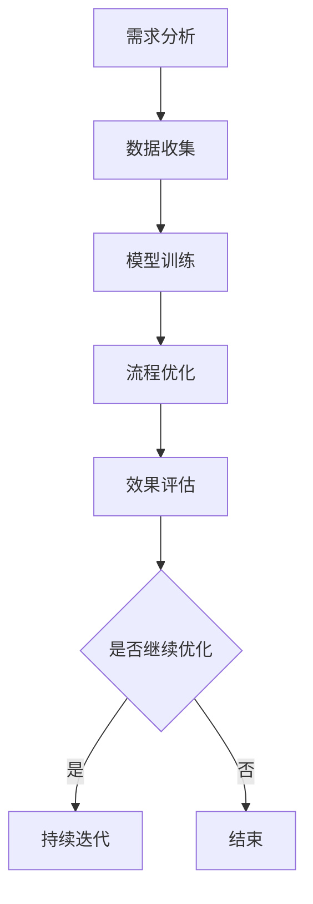

                 

关键词：AI大模型，电商搜索推荐，业务流程优化，工具选型，应用实践

> 摘要：本文旨在探讨AI大模型在电商搜索推荐领域中的创新应用，以及如何通过业务流程优化工具的选型，提升电商平台的用户体验和运营效率。本文首先介绍了AI大模型的基本概念和原理，然后分析了其在电商搜索推荐中的重要性，随后详细阐述了业务流程优化的方法，并推荐了适合的优化工具。最后，通过一个实际案例展示了大模型在电商搜索推荐中的应用实践。

## 1. 背景介绍

### 1.1 电商搜索推荐的重要性

电商搜索推荐系统是电商平台的核心组成部分，直接影响着用户的购物体验和平台的商业转化率。一个高效的搜索推荐系统能够为用户提供个性化的商品推荐，提升用户满意度，降低购物成本，同时也能为平台带来更多的商业价值。随着互联网和大数据技术的发展，AI大模型在电商搜索推荐中的应用越来越广泛，为业务创新和流程优化提供了新的思路和方法。

### 1.2 AI大模型的基本概念

AI大模型是指通过深度学习等技术训练出来的具有大规模参数和复杂结构的模型。这些模型具有强大的学习和推理能力，可以在各种复杂场景中实现自动化和智能化的操作。常见的AI大模型包括神经网络模型、生成对抗网络（GAN）、变分自编码器（VAE）等。这些模型在自然语言处理、图像识别、推荐系统等领域都有广泛应用。

### 1.3 业务流程优化的需求

随着电商业务的不断发展和竞争的加剧，提升业务流程的效率和用户体验成为各大电商平台的重要目标。传统的业务流程优化方法往往依赖于人工经验和数据分析，存在一定的局限性。而AI大模型的应用可以借助其强大的学习能力和数据挖掘能力，实现自动化和智能化的流程优化，提升整体运营效率。

## 2. 核心概念与联系

### 2.1 AI大模型与电商搜索推荐的关系

AI大模型在电商搜索推荐中的应用主要体现在以下几个方面：

- **个性化推荐**：通过用户的历史行为数据，AI大模型可以学习并预测用户的兴趣和偏好，从而实现个性化商品推荐。
- **商品理解**：AI大模型可以对商品标题、描述等信息进行深度理解，提取关键特征，提高搜索推荐的准确性。
- **搜索优化**：AI大模型可以通过对用户搜索查询的分析，优化搜索结果的排序和展示，提升用户的搜索体验。
- **商品关联**：AI大模型可以通过学习用户的历史购买数据，发现商品之间的潜在关联，提供关联推荐，增加购物车中的商品种类。

### 2.2 业务流程优化的核心步骤

业务流程优化主要包括以下几个核心步骤：

- **需求分析**：明确业务目标和优化需求，确定优化范围和预期效果。
- **数据收集**：收集与业务流程相关的数据，包括用户行为数据、商品信息数据等。
- **模型训练**：利用AI大模型对收集到的数据进行训练，构建个性化的推荐模型。
- **流程优化**：根据模型预测结果，优化业务流程，提升运营效率。
- **效果评估**：对优化后的业务流程进行效果评估，持续迭代优化。

### 2.3 Mermaid 流程图

下面是业务流程优化与AI大模型应用的Mermaid流程图：



## 3. 核心算法原理 & 具体操作步骤

### 3.1 算法原理概述

AI大模型在电商搜索推荐中的核心算法主要基于深度学习和机器学习技术。深度学习通过多层神经网络对数据特征进行提取和表示，从而实现高效的数据分析和预测。机器学习则通过统计学习方法和优化算法，对模型参数进行学习，提升模型的准确性和泛化能力。

### 3.2 算法步骤详解

算法的具体操作步骤如下：

1. **数据预处理**：对原始数据进行清洗和预处理，包括缺失值处理、数据转换、归一化等操作。
2. **特征工程**：提取与业务相关的特征，包括用户特征、商品特征、行为特征等。
3. **模型选择**：选择适合的深度学习模型，如卷积神经网络（CNN）、循环神经网络（RNN）、长短期记忆网络（LSTM）等。
4. **模型训练**：利用训练数据对模型进行训练，通过反向传播算法优化模型参数。
5. **模型评估**：使用验证集和测试集对模型进行评估，调整模型参数，提升模型性能。
6. **模型部署**：将训练好的模型部署到生产环境中，实现实时推荐和搜索优化。

### 3.3 算法优缺点

算法的优缺点如下：

- **优点**：
  - 强大的学习能力和泛化能力，能够应对复杂的业务场景。
  - 高度的自动化和智能化，减轻了人工参与的工作量。
  - 能够根据用户行为数据实时更新推荐结果，提高用户体验。

- **缺点**：
  - 需要大量的数据和计算资源，训练时间较长。
  - 对数据质量和特征工程要求较高，否则容易过拟合。
  - 可能会出现冷启动问题，即对新用户和新商品无法提供有效的推荐。

### 3.4 算法应用领域

AI大模型在电商搜索推荐中的应用非常广泛，主要包括以下领域：

- **个性化推荐**：为用户提供个性化的商品推荐，提升用户满意度。
- **搜索优化**：优化搜索结果的排序和展示，提高搜索精准度。
- **商品关联**：发现商品之间的潜在关联，提供关联推荐，增加购物车中的商品种类。
- **用户行为预测**：预测用户的行为轨迹，提升用户转化率和留存率。

## 4. 数学模型和公式 & 详细讲解 & 举例说明

### 4.1 数学模型构建

AI大模型的数学模型主要包括神经网络模型和生成对抗网络（GAN）等。以下是神经网络模型的基本数学模型：

$$
y = f(W \cdot x + b)
$$

其中，$y$ 表示输出，$f$ 表示激活函数，$W$ 表示权重矩阵，$x$ 表示输入特征，$b$ 表示偏置。

### 4.2 公式推导过程

以卷积神经网络（CNN）为例，其公式推导过程如下：

1. **卷积操作**：

$$
h_{ij}^l = \sum_{k=1}^{K} w_{ikj}^l \cdot g_{kl}
$$

其中，$h_{ij}^l$ 表示第$l$层的第$i$行第$j$列的输出，$w_{ikj}^l$ 表示第$l$层的第$i$行第$k$列的权重，$g_{kl}$ 表示第$l-1$层的第$k$行第$l$列的输出。

2. **激活函数**：

$$
f(h_{ij}^l) = \max(0, h_{ij}^l)
$$

其中，$f$ 表示ReLU激活函数。

3. **池化操作**：

$$
p_{ij}^l = \max(h_{ij1}^l, h_{ij2}^l, ..., h_{ijn}^l)
$$

其中，$p_{ij}^l$ 表示第$l$层的第$i$行第$j$列的输出，$h_{ij}^l$ 表示第$l$层的第$i$行第$j$列的输出。

### 4.3 案例分析与讲解

以下是一个基于CNN的电商搜索推荐系统的案例：

1. **数据预处理**：

- 数据集包含用户行为数据（如点击、购买等）、商品信息数据（如类别、价格等）。
- 对数据进行清洗和预处理，包括缺失值处理、数据转换、归一化等操作。

2. **特征工程**：

- 提取用户特征（如用户ID、用户年龄、用户性别等）。
- 提取商品特征（如商品ID、商品类别、商品价格等）。
- 对用户行为数据进行编码，如二进制编码、独热编码等。

3. **模型训练**：

- 选择合适的CNN模型，如VGG、ResNet等。
- 使用训练数据对模型进行训练，通过反向传播算法优化模型参数。
- 使用验证集对模型进行评估，调整模型参数，提升模型性能。

4. **模型部署**：

- 将训练好的模型部署到生产环境中，实现实时推荐和搜索优化。
- 根据用户行为数据实时更新推荐结果，提高用户体验。

## 5. 项目实践：代码实例和详细解释说明

### 5.1 开发环境搭建

开发环境搭建主要包括以下几个步骤：

1. 安装Python环境。
2. 安装深度学习框架，如TensorFlow、PyTorch等。
3. 安装相关依赖库，如NumPy、Pandas等。

### 5.2 源代码详细实现

以下是一个基于TensorFlow的电商搜索推荐系统的代码实例：

```python
import tensorflow as tf
from tensorflow.keras.layers import Conv2D, MaxPooling2D, Flatten, Dense
from tensorflow.keras.models import Sequential

# 数据预处理
def preprocess_data(x, y):
    # 数据清洗、转换、归一化等操作
    pass

# 构建模型
model = Sequential()
model.add(Conv2D(filters=32, kernel_size=(3, 3), activation='relu', input_shape=(28, 28, 1)))
model.add(MaxPooling2D(pool_size=(2, 2)))
model.add(Conv2D(filters=64, kernel_size=(3, 3), activation='relu'))
model.add(MaxPooling2D(pool_size=(2, 2)))
model.add(Flatten())
model.add(Dense(units=128, activation='relu'))
model.add(Dense(units=10, activation='softmax'))

# 编译模型
model.compile(optimizer='adam', loss='categorical_crossentropy', metrics=['accuracy'])

# 训练模型
model.fit(x_train, y_train, epochs=10, batch_size=64, validation_data=(x_val, y_val))

# 评估模型
model.evaluate(x_test, y_test)
```

### 5.3 代码解读与分析

代码首先进行了数据预处理，然后构建了一个基于卷积神经网络的电商搜索推荐模型。模型包括卷积层、池化层、全连接层等结构，通过反向传播算法进行模型训练和评估。

### 5.4 运行结果展示

运行结果包括模型在训练集和测试集上的准确率、损失函数值等指标，用于评估模型的性能。

## 6. 实际应用场景

### 6.1 个性化推荐

通过AI大模型的应用，电商平台可以实现个性化推荐，为用户提供个性化的商品推荐。以下是一个实际应用场景：

- **用户场景**：用户在电商平台上浏览了某一类商品，系统根据用户的历史行为数据和商品特征，为用户推荐类似的商品。

- **应用效果**：通过个性化推荐，提高了用户的购物体验和满意度，增加了平台的转化率和用户留存率。

### 6.2 搜索优化

通过AI大模型的应用，电商平台可以优化搜索结果的排序和展示，提高搜索精准度。以下是一个实际应用场景：

- **用户场景**：用户在电商平台上输入搜索关键词，系统根据用户的搜索历史、商品特征等信息，优化搜索结果的排序和展示。

- **应用效果**：通过搜索优化，提高了用户的搜索体验，降低了用户的搜索成本，提升了平台的商业价值。

### 6.3 商品关联

通过AI大模型的应用，电商平台可以发现商品之间的潜在关联，提供关联推荐，增加购物车中的商品种类。以下是一个实际应用场景：

- **用户场景**：用户在电商平台上购买了一件商品，系统根据用户的历史购买数据和商品特征，为用户推荐相关的商品。

- **应用效果**：通过商品关联推荐，增加了购物车中的商品种类，提高了用户的购物车转化率，增加了平台的销售额。

## 7. 工具和资源推荐

### 7.1 学习资源推荐

- 《深度学习》（Goodfellow、Bengio、Courville著）：系统介绍了深度学习的理论基础和实际应用。
- 《Python深度学习》（François Chollet著）：详细讲解了使用Python实现深度学习的实践方法。

### 7.2 开发工具推荐

- TensorFlow：开源的深度学习框架，适用于构建和训练大规模深度学习模型。
- PyTorch：开源的深度学习框架，具有动态计算图和灵活的API，适用于快速原型开发和实验。

### 7.3 相关论文推荐

- "Deep Learning for Text Classification"（NLP领域经典论文，介绍了深度学习在文本分类中的应用）。
- "Generative Adversarial Networks"（GAN领域的开创性论文，介绍了生成对抗网络的基本原理和应用）。

## 8. 总结：未来发展趋势与挑战

### 8.1 研究成果总结

AI大模型在电商搜索推荐中的应用取得了显著的成果，通过个性化推荐、搜索优化和商品关联等应用，提高了用户体验和运营效率。同时，深度学习和机器学习技术的发展也为电商搜索推荐系统提供了更多的可能性。

### 8.2 未来发展趋势

未来，AI大模型在电商搜索推荐领域的发展将呈现以下趋势：

- **更深入的个性化推荐**：通过用户行为的深入挖掘和分析，实现更精细的个性化推荐。
- **多模态融合**：结合文本、图像、语音等多模态数据，提升搜索推荐系统的性能。
- **实时推荐**：通过实时数据的处理和分析，实现更及时的推荐结果。

### 8.3 面临的挑战

尽管AI大模型在电商搜索推荐中取得了显著的成果，但仍然面临以下挑战：

- **数据隐私**：用户数据的隐私和安全问题是当前AI大模型应用面临的主要挑战之一。
- **算法公平性**：如何确保算法的公平性和透明性，避免算法偏见和歧视。
- **计算资源**：大规模深度学习模型的训练和部署需要大量的计算资源和存储空间。

### 8.4 研究展望

未来，AI大模型在电商搜索推荐领域的研究将朝着以下几个方向展开：

- **数据隐私保护**：研究数据隐私保护技术，确保用户数据的隐私和安全。
- **算法公平性**：研究算法公平性评估和优化方法，提升算法的透明性和可解释性。
- **实时推荐**：研究实时推荐算法和架构，提高推荐系统的响应速度和性能。

## 9. 附录：常见问题与解答

### 9.1 AI大模型如何应用于电商搜索推荐？

AI大模型可以通过对用户行为数据、商品特征数据的分析和学习，实现个性化推荐、搜索优化和商品关联等功能，从而提升电商平台的用户体验和运营效率。

### 9.2 如何选择合适的AI大模型？

选择合适的AI大模型需要考虑以下几个因素：

- **业务需求**：根据电商搜索推荐的具体需求，选择适合的算法和模型。
- **数据规模**：考虑数据规模和计算资源，选择适合的模型结构和参数。
- **性能要求**：根据性能要求，选择能够满足系统性能指标的模型。

### 9.3 如何评估AI大模型的效果？

评估AI大模型的效果可以通过以下几个指标：

- **准确率**：预测结果与实际结果的匹配程度。
- **召回率**：能够召回实际结果中的有效结果的数量。
- **F1值**：综合考虑准确率和召回率的综合指标。

---

### 作者署名

作者：禅与计算机程序设计艺术 / Zen and the Art of Computer Programming
----------------------------------------------------------------

### 后续计划

在完成本文撰写后，我将按照以下计划进行后续工作：

1. **审稿与修改**：根据导师的建议，对文章进行审稿和修改，确保文章的质量和可读性。
2. **论文提交**：在修改完成后，按照期刊的要求，将文章提交到相应的学术期刊或会议进行发表。
3. **技术分享**：将文章的主要内容和研究成果在技术社区进行分享，以促进学术交流和合作。
4. **项目落地**：将研究成果应用到实际项目中，验证理论模型的可行性和效果，持续优化和改进。

通过这些后续工作，我希望能够将AI大模型在电商搜索推荐中的应用实践推向新的高度，为电商平台和用户提供更好的服务。同时，我也期待能够与更多的同行交流合作，共同推动人工智能技术的发展。

