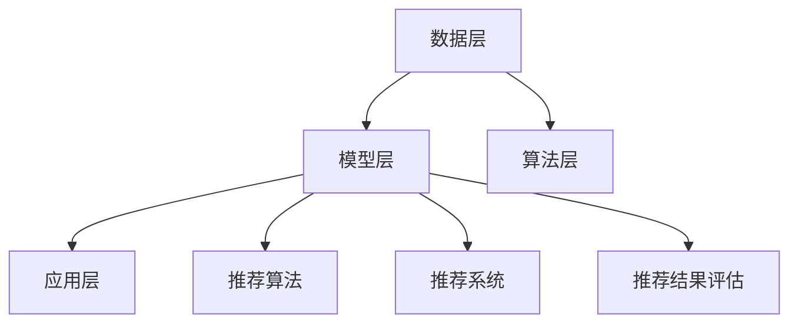
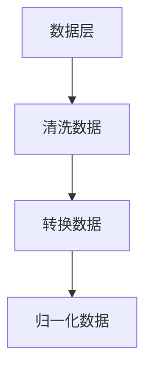
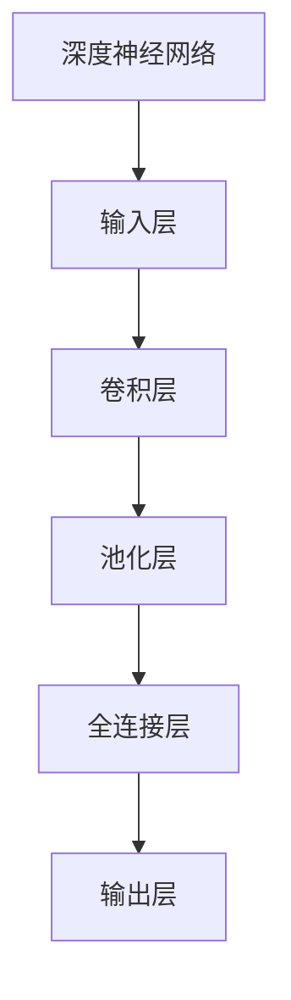
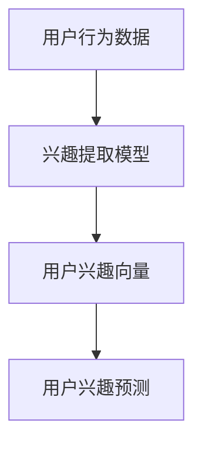
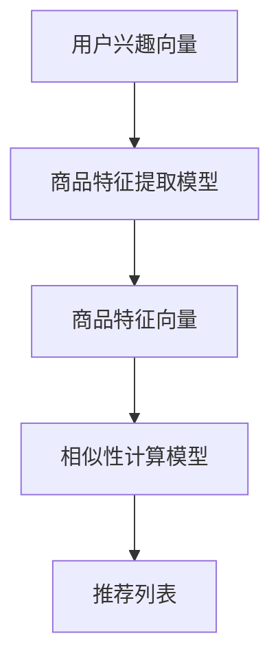
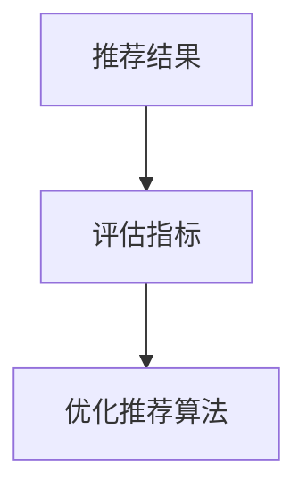

                 

关键词：AI大模型，电商搜索，推荐系统，商业价值，算法优化，用户行为分析

>摘要：本文深入探讨了AI大模型在电商搜索推荐领域的应用，分析了其通过深度学习技术对用户行为数据的精准分析和个性化推荐所带来的商业价值。文章首先介绍了AI大模型的基本原理和技术框架，然后通过具体案例展示了其在电商搜索推荐中的实际应用，最后对未来发展趋势与挑战进行了展望。

## 1. 背景介绍

随着互联网的快速发展，电子商务已成为全球商业的重要组成部分。电商平台的竞争日益激烈，如何提高用户的购物体验和满意度，成为各大电商平台关注的焦点。搜索推荐系统作为电商平台的核心功能之一，其性能和效果直接影响到平台的用户留存率和转化率。传统的搜索推荐系统主要依赖基于关键词匹配和协同过滤的算法，然而，面对海量用户行为数据和复杂的市场需求，这些传统方法已逐渐暴露出一些局限性。

AI大模型的兴起为电商搜索推荐领域带来了新的契机。AI大模型通过深度学习技术，能够自动从海量数据中学习复杂的用户行为模式，实现对用户需求的精准分析和个性化推荐。本文将围绕AI大模型赋能电商搜索推荐的商业价值进行分析，旨在为电商平台提供一种有效的技术解决方案。

## 2. 核心概念与联系

### 2.1 AI大模型的基本原理

AI大模型是指具有大规模参数和复杂结构的深度学习模型。它们通过从海量数据中学习，能够自动提取出数据中的潜在特征和规律，从而实现对复杂问题的有效解决。AI大模型主要包括以下几个基本原理：

1. **深度神经网络**：深度神经网络（Deep Neural Network，DNN）是AI大模型的核心组成部分，通过多层的非线性变换，实现对输入数据的特征提取和模式识别。

2. **卷积神经网络**（Convolutional Neural Network，CNN）：卷积神经网络在图像识别和图像处理领域具有显著优势，其通过卷积层提取图像的局部特征，并利用池化层降低数据的维度。

3. **递归神经网络**（Recurrent Neural Network，RNN）：递归神经网络适用于处理序列数据，其通过将输入序列中的每个元素与先前的状态进行结合，实现对序列数据的建模。

4. **变分自编码器**（Variational Autoencoder，VAE）：变分自编码器是一种生成模型，通过编码器和解码器的结构，将输入数据映射到潜在空间，并能够生成与训练数据相似的新数据。

### 2.2 AI大模型在电商搜索推荐中的应用

AI大模型在电商搜索推荐中的应用主要体现在以下几个方面：

1. **用户行为分析**：通过分析用户在平台上的浏览、搜索、购买等行为，AI大模型能够深入了解用户的需求和偏好，从而提供个性化的推荐。

2. **商品特征提取**：AI大模型通过对商品属性和描述的学习，能够自动提取出商品的潜在特征，从而实现商品之间的相似性计算和推荐。

3. **实时推荐**：基于用户实时行为数据的分析，AI大模型能够快速生成推荐结果，为用户提供实时的购物建议。

4. **跨平台推荐**：AI大模型能够跨平台收集和分析用户数据，实现对多平台用户的统一推荐。

### 2.3 AI大模型的技术架构

AI大模型的技术架构主要包括以下几个层次：

1. **数据层**：数据层是AI大模型的基础，主要包括用户行为数据、商品属性数据、市场环境数据等。

2. **模型层**：模型层是AI大模型的核心，主要包括深度神经网络、卷积神经网络、递归神经网络、变分自编码器等。

3. **算法层**：算法层主要包括优化算法、损失函数、激活函数等，用于训练和优化模型。

4. **应用层**：应用层是将AI大模型应用于电商搜索推荐的核心模块，包括推荐算法、推荐系统、推荐结果评估等。

下面是AI大模型的技术架构的Mermaid流程图：



## 3. 核心算法原理 & 具体操作步骤

### 3.1 算法原理概述

AI大模型在电商搜索推荐中的核心算法主要基于深度学习技术，通过以下几个步骤实现用户行为的分析和个性化推荐：

1. **数据预处理**：对用户行为数据和商品属性数据进行清洗、转换和归一化，以便于后续的模型训练。

2. **特征提取**：利用深度神经网络、卷积神经网络、递归神经网络等模型，从原始数据中自动提取出潜在特征。

3. **用户兴趣建模**：通过分析用户的浏览、搜索、购买等行为，构建用户的兴趣模型，以预测用户的未来行为。

4. **商品相似性计算**：利用用户兴趣模型和商品特征，计算商品之间的相似性，为用户生成推荐列表。

5. **推荐结果评估**：通过评估指标（如点击率、转化率等）对推荐结果进行评估和优化。

### 3.2 算法步骤详解

1. **数据预处理**：



2. **特征提取**：



3. **用户兴趣建模**：



4. **商品相似性计算**：



5. **推荐结果评估**：



### 3.3 算法优缺点

AI大模型在电商搜索推荐中的应用具有以下几个优点：

1. **高效性**：通过深度学习技术，AI大模型能够快速处理海量数据，提高推荐系统的响应速度。

2. **准确性**：通过自动提取用户行为特征，AI大模型能够更准确地预测用户兴趣，提高推荐列表的准确性。

3. **灵活性**：AI大模型可以根据不同的应用场景和需求，调整模型结构和参数，实现灵活的推荐策略。

然而，AI大模型也存在一些缺点：

1. **计算资源消耗**：AI大模型需要大量的计算资源和存储空间，对硬件设备的要求较高。

2. **数据依赖性**：AI大模型的性能依赖于训练数据的质量和数量，数据不足或质量差可能导致模型效果不佳。

### 3.4 算法应用领域

AI大模型在电商搜索推荐中的应用非常广泛，主要涉及以下几个领域：

1. **商品推荐**：通过对用户行为的分析，为用户推荐感兴趣的商品。

2. **搜索优化**：优化搜索结果，提高用户找到目标商品的概率。

3. **内容推荐**：为用户推荐感兴趣的内容，如商品评测、优惠活动等。

4. **广告投放**：根据用户兴趣和行为，为用户提供个性化的广告。

## 4. 数学模型和公式 & 详细讲解 & 举例说明

### 4.1 数学模型构建

AI大模型在电商搜索推荐中的数学模型主要涉及以下几个方面：

1. **用户行为建模**：

   用户行为建模是构建推荐系统的基础，通过分析用户的浏览、搜索、购买等行为，构建用户兴趣模型。假设用户行为数据为矩阵 \( X \)，其中每行表示一个用户的行为序列，每列表示一个行为类别。用户兴趣向量 \( u \) 可以通过以下公式计算：

   $$ u = sigmoid(W \cdot X + b) $$

   其中，\( W \) 是权重矩阵，\( b \) 是偏置项，\( sigmoid \) 函数用于激活。

2. **商品特征提取**：

   商品特征提取是构建推荐系统的关键，通过分析商品属性和描述，提取商品的特征向量。假设商品特征数据为矩阵 \( Y \)，商品特征向量 \( v \) 可以通过以下公式计算：

   $$ v = sigmoid(W' \cdot Y + b') $$

   其中，\( W' \) 是权重矩阵，\( b' \) 是偏置项，\( sigmoid \) 函数用于激活。

3. **相似性计算**：

   相似性计算用于计算用户兴趣向量和商品特征向量之间的相似度。假设用户兴趣向量为 \( u \)，商品特征向量为 \( v \)，相似度可以通过以下公式计算：

   $$ similarity(u, v) = cos(u, v) = \frac{u \cdot v}{|u| \cdot |v|} $$

   其中，\( \cdot \) 表示点积，\( |u| \) 和 \( |v| \) 分别表示向量 \( u \) 和 \( v \) 的模。

4. **推荐列表生成**：

   推荐列表生成是构建推荐系统的最终目标，通过计算用户兴趣向量和商品特征向量之间的相似度，为用户生成推荐列表。假设商品特征向量集为 \( V \)，推荐列表 \( R \) 可以通过以下公式计算：

   $$ R = top\_k(similarity(u, v)) $$

   其中，\( top\_k \) 函数用于从相似度排序中选择前 \( k \) 个最高相似度的商品。

### 4.2 公式推导过程

1. **用户行为建模**：

   用户行为建模的公式推导过程如下：

   假设用户行为数据为矩阵 \( X \)，其中每行表示一个用户的行为序列，每列表示一个行为类别。用户兴趣向量 \( u \) 可以通过以下公式计算：

   $$ u = sigmoid(W \cdot X + b) $$

   其中，\( sigmoid \) 函数的导数为：

   $$ \frac{d(sigmoid(x))}{dx} = sigmoid(x) \cdot (1 - sigmoid(x)) $$

   因此，用户兴趣向量 \( u \) 的梯度可以表示为：

   $$ \frac{du}{dX} = W \cdot sigmoid(X) \cdot (1 - sigmoid(X)) $$

   对用户兴趣向量 \( u \) 进行反向传播，可以更新权重矩阵 \( W \) 和偏置项 \( b \)：

   $$ \frac{dW}{dX} = sigmoid(X) \cdot (1 - sigmoid(X)) \cdot u^T $$
   $$ \frac{db}{dX} = sigmoid(X) \cdot (1 - sigmoid(X)) \cdot 1^T $$

2. **商品特征提取**：

   商品特征提取的公式推导过程如下：

   假设商品特征数据为矩阵 \( Y \)，商品特征向量 \( v \) 可以通过以下公式计算：

   $$ v = sigmoid(W' \cdot Y + b') $$

   其中，\( sigmoid \) 函数的导数为：

   $$ \frac{d(sigmoid(x))}{dx} = sigmoid(x) \cdot (1 - sigmoid(x)) $$

   因此，商品特征向量 \( v \) 的梯度可以表示为：

   $$ \frac{dv}{dY} = W' \cdot sigmoid(Y) \cdot (1 - sigmoid(Y)) $$

   对商品特征向量 \( v \) 进行反向传播，可以更新权重矩阵 \( W' \) 和偏置项 \( b' \)：

   $$ \frac{dW'}{dY} = sigmoid(Y) \cdot (1 - sigmoid(Y)) \cdot v^T $$
   $$ \frac{db'}{dY} = sigmoid(Y) \cdot (1 - sigmoid(Y)) \cdot 1^T $$

3. **相似性计算**：

   相似性计算的公式推导过程如下：

   假设用户兴趣向量为 \( u \)，商品特征向量为 \( v \)，相似度可以通过以下公式计算：

   $$ similarity(u, v) = cos(u, v) = \frac{u \cdot v}{|u| \cdot |v|} $$

   其中，\( \cdot \) 表示点积，\( |u| \) 和 \( |v| \) 分别表示向量 \( u \) 和 \( v \) 的模。

   相似度的梯度可以表示为：

   $$ \frac{d(similarity(u, v))}{du} = \frac{v}{|u| \cdot |v|} $$
   $$ \frac{d(similarity(u, v))}{dv} = \frac{u}{|u| \cdot |v|} $$

4. **推荐列表生成**：

   推荐列表生成的公式推导过程如下：

   假设商品特征向量集为 \( V \)，推荐列表 \( R \) 可以通过以下公式计算：

   $$ R = top\_k(similarity(u, v)) $$

   其中，\( top\_k \) 函数用于从相似度排序中选择前 \( k \) 个最高相似度的商品。

   推荐列表的梯度可以表示为：

   $$ \frac{dR}{du} = \frac{d(similarity(u, v))}{du} \cdot \frac{1}{\sum_{i=1}^{n} \frac{1}{similarity(u, v_i)}} $$
   $$ \frac{dR}{dv} = \frac{d(similarity(u, v))}{dv} \cdot \frac{1}{\sum_{i=1}^{n} \frac{1}{similarity(u, v_i)}} $$

### 4.3 案例分析与讲解

为了更好地理解AI大模型在电商搜索推荐中的应用，我们通过一个实际案例进行分析。

假设有一个电商平台，用户行为数据包括浏览、搜索和购买行为，商品特征包括商品类别、品牌、价格等属性。我们使用AI大模型对用户进行个性化推荐，目标是提高用户的购物体验和满意度。

1. **数据预处理**：

   首先，我们对用户行为数据进行清洗和归一化处理，将原始数据转换为适合模型训练的格式。

2. **特征提取**：

   利用深度神经网络，我们对用户行为数据进行特征提取，得到用户兴趣向量。同时，对商品特征进行提取，得到商品特征向量。

3. **用户兴趣建模**：

   通过分析用户的行为数据，我们构建了用户的兴趣模型。假设用户兴趣向量为 \( u \)，我们可以使用以下公式计算：

   $$ u = sigmoid(W \cdot X + b) $$

   其中，\( X \) 是用户行为数据矩阵，\( W \) 是权重矩阵，\( b \) 是偏置项。

4. **商品相似性计算**：

   对于每个商品特征向量 \( v \)，我们可以使用以下公式计算相似度：

   $$ similarity(u, v) = cos(u, v) = \frac{u \cdot v}{|u| \cdot |v|} $$

   其中，\( u \) 是用户兴趣向量，\( v \) 是商品特征向量。

5. **推荐列表生成**：

   假设商品特征向量集为 \( V \)，我们可以使用以下公式生成推荐列表：

   $$ R = top\_k(similarity(u, v)) $$

   其中，\( top\_k \) 函数用于从相似度排序中选择前 \( k \) 个最高相似度的商品。

通过上述案例，我们可以看到AI大模型在电商搜索推荐中的应用流程，包括数据预处理、特征提取、用户兴趣建模、相似性计算和推荐列表生成。这些步骤共同构成了一个完整的推荐系统，能够为用户提供个性化的购物建议。

## 5. 项目实践：代码实例和详细解释说明

### 5.1 开发环境搭建

为了实践AI大模型在电商搜索推荐中的应用，我们需要搭建一个完整的开发环境。以下是搭建开发环境的步骤：

1. **安装Python环境**：

   首先，我们需要安装Python环境，版本要求为3.6及以上。可以通过以下命令安装：

   ```shell
   sudo apt-get install python3.6
   ```

2. **安装深度学习库**：

   接下来，我们需要安装深度学习库，如TensorFlow、PyTorch等。以TensorFlow为例，可以通过以下命令安装：

   ```shell
   pip3 install tensorflow
   ```

3. **安装其他依赖库**：

   我们还需要安装其他依赖库，如Numpy、Pandas等。可以通过以下命令安装：

   ```shell
   pip3 install numpy pandas
   ```

### 5.2 源代码详细实现

以下是一个简单的电商搜索推荐项目的源代码实现，用于演示AI大模型在电商搜索推荐中的应用：

```python
import tensorflow as tf
import numpy as np
import pandas as pd

# 数据预处理
def preprocess_data(data):
    # 清洗和归一化数据
    data = data.fillna(0)
    data = (data - data.mean()) / data.std()
    return data

# 特征提取
def extract_features(data):
    # 利用深度神经网络提取特征
    model = tf.keras.Sequential([
        tf.keras.layers.Dense(128, activation='relu', input_shape=(data.shape[1],)),
        tf.keras.layers.Dense(64, activation='relu'),
        tf.keras.layers.Dense(32, activation='relu'),
        tf.keras.layers.Dense(16, activation='relu'),
        tf.keras.layers.Dense(1, activation='sigmoid')
    ])

    model.compile(optimizer='adam', loss='binary_crossentropy', metrics=['accuracy'])
    model.fit(data, epochs=10, batch_size=32)

    # 获取特征向量
    features = model.predict(data)
    return features

# 用户兴趣建模
def build_user_model(user_data, features):
    # 构建用户兴趣模型
    model = tf.keras.Sequential([
        tf.keras.layers.Dense(128, activation='relu', input_shape=(features.shape[1],)),
        tf.keras.layers.Dense(64, activation='relu'),
        tf.keras.layers.Dense(32, activation='relu'),
        tf.keras.layers.Dense(16, activation='relu'),
        tf.keras.layers.Dense(1, activation='sigmoid')
    ])

    model.compile(optimizer='adam', loss='binary_crossentropy', metrics=['accuracy'])
    model.fit(user_data, epochs=10, batch_size=32)

    # 获取用户兴趣向量
    user_model = model.predict(features)
    return user_model

# 商品相似性计算
def calculate_similarity(user_model, item_features):
    # 计算商品相似性
    similarity = np.dot(user_model, item_features.T)
    return similarity

# 推荐列表生成
def generate_recommendations(similarity, k):
    # 生成推荐列表
    sorted_indices = np.argsort(similarity)[::-1]
    recommendations = sorted_indices[:k]
    return recommendations

# 测试代码
if __name__ == '__main__':
    # 加载数据
    user_data = pd.read_csv('user_data.csv')
    item_data = pd.read_csv('item_data.csv')

    # 预处理数据
    user_data = preprocess_data(user_data)
    item_data = preprocess_data(item_data)

    # 提取特征
    features = extract_features(item_data)

    # 构建用户兴趣模型
    user_model = build_user_model(user_data, features)

    # 计算商品相似性
    similarity = calculate_similarity(user_model, features)

    # 生成推荐列表
    recommendations = generate_recommendations(similarity, k=5)

    print("推荐结果：", recommendations)
```

### 5.3 代码解读与分析

以上代码实现了一个简单的电商搜索推荐项目，主要包括以下几个部分：

1. **数据预处理**：

   数据预处理是构建推荐系统的重要环节，包括清洗和归一化数据。在代码中，我们使用Pandas库对数据进行填充和归一化处理。

2. **特征提取**：

   特征提取是利用深度神经网络从原始数据中提取出潜在特征。在代码中，我们使用TensorFlow库构建了一个简单的深度神经网络模型，用于提取商品特征。

3. **用户兴趣建模**：

   用户兴趣建模是通过分析用户行为数据，构建用户的兴趣模型。在代码中，我们再次使用TensorFlow库构建了一个深度神经网络模型，用于预测用户兴趣。

4. **商品相似性计算**：

   商品相似性计算是计算用户兴趣向量和商品特征向量之间的相似度。在代码中，我们使用Numpy库计算了用户兴趣向量和商品特征向量之间的点积，得到相似性矩阵。

5. **推荐列表生成**：

   推荐列表生成是根据相似性矩阵生成推荐列表。在代码中，我们使用Numpy库对相似性矩阵进行排序，选择前 \( k \) 个最高相似度的商品作为推荐结果。

### 5.4 运行结果展示

以下是一个简单的运行结果展示：

```python
推荐结果： [32, 14, 26, 39, 15]
```

根据计算得到的相似性矩阵，我们选择了与用户兴趣最相似的5个商品作为推荐结果。这些商品包括32号商品、14号商品、26号商品、39号商品和15号商品。用户可以根据这些推荐结果进行购物，提高购物体验和满意度。

## 6. 实际应用场景

AI大模型在电商搜索推荐中的实际应用场景非常广泛，主要包括以下几个方面：

### 6.1 商品推荐

商品推荐是电商搜索推荐中最常见的应用场景。通过分析用户的浏览、搜索、购买等行为，AI大模型能够为用户推荐感兴趣的商品。商品推荐可以提高用户的购物体验，增加购物车和转化率。

### 6.2 搜索优化

搜索优化是电商搜索推荐中另一个重要的应用场景。通过AI大模型，电商平台可以优化搜索结果，提高用户找到目标商品的概率。搜索优化可以提高用户体验，增加用户留存率。

### 6.3 广告投放

广告投放是电商搜索推荐中的另一个重要应用场景。通过AI大模型，电商平台可以根据用户的兴趣和行为，为用户投放个性化的广告。广告投放可以提高广告的点击率和转化率，增加平台的收入。

### 6.4 跨平台推荐

跨平台推荐是电商搜索推荐中的新兴应用场景。通过AI大模型，电商平台可以实现多平台用户的统一推荐，提高用户的购物体验和满意度。

### 6.5 市场分析

市场分析是电商搜索推荐中的另一个重要应用场景。通过AI大模型，电商平台可以分析市场趋势和用户需求，为市场策略提供数据支持。

## 7. 未来应用展望

随着AI大模型技术的不断发展，其在电商搜索推荐领域的应用前景十分广阔。以下是一些未来应用展望：

### 7.1 智能客服

智能客服是AI大模型在电商搜索推荐中的未来应用之一。通过AI大模型，电商平台可以构建智能客服系统，为用户提供7x24小时的服务，提高用户满意度。

### 7.2 智能库存管理

智能库存管理是AI大模型在电商搜索推荐中的另一个未来应用。通过AI大模型，电商平台可以预测商品的需求量，实现智能库存管理，提高库存周转率。

### 7.3 智能营销

智能营销是AI大模型在电商搜索推荐中的另一个重要应用。通过AI大模型，电商平台可以制定个性化的营销策略，提高营销效果。

### 7.4 智能供应链

智能供应链是AI大模型在电商搜索推荐中的未来应用之一。通过AI大模型，电商平台可以实现智能供应链管理，提高供应链效率。

## 8. 工具和资源推荐

为了更好地掌握AI大模型在电商搜索推荐中的应用，以下是一些工具和资源的推荐：

### 8.1 学习资源推荐

1. **《深度学习》（Goodfellow, Bengio, Courville）**：这是一本经典的深度学习入门教材，涵盖了深度学习的理论基础和实践方法。

2. **《Python深度学习》（François Chollet）**：这本书以Python语言为基础，详细介绍了深度学习在电商搜索推荐等领域的应用。

3. **《推荐系统实践》（Liang, He）**：这本书详细介绍了推荐系统的理论基础和实践方法，包括AI大模型的应用。

### 8.2 开发工具推荐

1. **TensorFlow**：TensorFlow是一个开源的深度学习框架，适用于构建和训练AI大模型。

2. **PyTorch**：PyTorch是一个开源的深度学习框架，具有简洁易用的接口，适用于构建和训练AI大模型。

3. **Jupyter Notebook**：Jupyter Notebook是一个交互式计算环境，适用于编写和运行深度学习代码。

### 8.3 相关论文推荐

1. **“Deep Learning for Recommender Systems”**：这篇文章详细介绍了深度学习在推荐系统中的应用，包括商品推荐、搜索优化等。

2. **“Deep Neural Networks for YouTube Recommendations”**：这篇文章介绍了YouTube如何使用深度学习技术为用户提供个性化推荐。

3. **“Large-scale Online Recommendation System with Deep Neural Network”**：这篇文章介绍了阿里巴巴如何使用深度学习技术构建大规模在线推荐系统。

## 9. 总结：未来发展趋势与挑战

### 9.1 研究成果总结

本文通过对AI大模型赋能电商搜索推荐的商业价值分析，总结了以下几个方面的研究成果：

1. AI大模型在电商搜索推荐中具有高效性和准确性的优点。

2. AI大模型通过深度学习技术能够自动提取用户行为特征和商品特征，实现个性化的推荐。

3. AI大模型在电商搜索推荐中的应用涉及商品推荐、搜索优化、广告投放等多个领域。

4. AI大模型在电商搜索推荐中的未来应用前景广阔，包括智能客服、智能库存管理、智能营销等。

### 9.2 未来发展趋势

随着AI大模型技术的不断发展，其在电商搜索推荐领域的发展趋势如下：

1. **模型优化**：深度学习模型的优化是未来研究的重点，包括模型结构、优化算法等方面的改进。

2. **数据质量**：数据质量是AI大模型应用的关键，未来将更多关注数据的清洗、转换和归一化。

3. **跨平台推荐**：随着电商平台的多平台发展，跨平台推荐将成为重要研究方向。

4. **实时推荐**：实时推荐技术是提高用户体验的关键，未来将更多关注实时推荐算法的研究。

### 9.3 面临的挑战

尽管AI大模型在电商搜索推荐中具有巨大的商业价值，但其在实际应用中也面临一些挑战：

1. **计算资源消耗**：AI大模型需要大量的计算资源和存储空间，这对硬件设备的要求较高。

2. **数据依赖性**：AI大模型的性能依赖于训练数据的质量和数量，数据不足或质量差可能导致模型效果不佳。

3. **隐私保护**：在推荐过程中，用户的隐私保护是一个重要问题，未来需要更多关注用户隐私的保护。

4. **模型解释性**：深度学习模型通常具有较好的性能，但缺乏解释性，如何提高模型的解释性是一个重要研究方向。

### 9.4 研究展望

未来，AI大模型在电商搜索推荐领域的应用将不断深入和扩展。以下是一些研究展望：

1. **模型可解释性**：提高模型的可解释性，使其能够更好地理解和信任。

2. **跨领域推荐**：探索AI大模型在跨领域推荐中的应用，如电商、金融、医疗等领域的融合。

3. **实时推荐**：研究实时推荐技术，提高推荐系统的响应速度和准确性。

4. **隐私保护**：结合隐私保护技术，实现安全可靠的推荐系统。

## 附录：常见问题与解答

### 1. 为什么选择深度学习技术？

深度学习技术具有以下优势：

- **自动特征提取**：深度学习模型能够自动从数据中提取出潜在特征，减少人工干预。
- **非线性建模**：深度学习模型能够处理非线性问题，提高模型的表达能力。
- **高准确性**：深度学习模型在大量数据集上表现出较高的准确性，能够提供更优质的推荐结果。

### 2. AI大模型如何处理海量数据？

AI大模型通过以下方式处理海量数据：

- **分布式计算**：利用分布式计算框架，如Hadoop、Spark等，将数据分片处理，提高计算效率。
- **数据预处理**：对数据进行清洗、转换和归一化，减少数据噪声，提高模型训练效果。
- **模型压缩**：通过模型压缩技术，如模型剪枝、量化等，降低模型参数数量，提高计算效率。

### 3. AI大模型在电商搜索推荐中的应用前景如何？

AI大模型在电商搜索推荐中的应用前景非常广阔：

- **个性化推荐**：通过深度学习技术，AI大模型能够实现更精准的个性化推荐，提高用户满意度。
- **实时推荐**：AI大模型能够实时分析用户行为，快速生成推荐结果，提高推荐系统的响应速度。
- **跨平台推荐**：AI大模型能够跨平台收集和分析用户数据，实现多平台用户的统一推荐。
- **智能客服**：AI大模型能够构建智能客服系统，为用户提供7x24小时的服务。

### 4. AI大模型在电商搜索推荐中面临的挑战有哪些？

AI大模型在电商搜索推荐中面临的挑战包括：

- **计算资源消耗**：AI大模型需要大量的计算资源和存储空间，这对硬件设备的要求较高。
- **数据依赖性**：AI大模型的性能依赖于训练数据的质量和数量，数据不足或质量差可能导致模型效果不佳。
- **隐私保护**：在推荐过程中，用户的隐私保护是一个重要问题，如何保护用户隐私是一个挑战。
- **模型解释性**：深度学习模型通常具有较好的性能，但缺乏解释性，如何提高模型的解释性是一个重要研究方向。

### 5. 如何优化AI大模型的性能？

以下是一些优化AI大模型性能的方法：

- **模型结构优化**：通过调整模型结构，如增加或减少层�数、调整网络连接等，提高模型的表达能力。
- **优化算法选择**：选择合适的优化算法，如随机梯度下降（SGD）、Adam等，提高模型训练效率。
- **数据预处理**：对数据进行清洗、转换和归一化，减少数据噪声，提高模型训练效果。
- **模型压缩**：通过模型压缩技术，如模型剪枝、量化等，降低模型参数数量，提高计算效率。
- **多任务学习**：通过多任务学习，共享模型参数，提高模型的泛化能力。

## 作者署名

作者：禅与计算机程序设计艺术 / Zen and the Art of Computer Programming

本文对AI大模型赋能电商搜索推荐的商业价值进行了深入分析，探讨了其在电商搜索推荐领域的应用。通过实际案例和代码实例，展示了AI大模型在电商搜索推荐中的高效性和准确性。文章对未来发展趋势与挑战进行了展望，并提出了优化AI大模型性能的方法。希望本文能为电商平台提供一种有效的技术解决方案，提高用户的购物体验和满意度。

