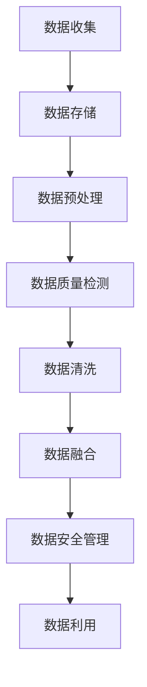

                 

关键词：AI大模型，电商搜索推荐，数据治理，自动化平台，功能优化，扩展

摘要：本文将探讨如何利用AI大模型技术重构电商搜索推荐系统的数据治理流程，实现自动化平台的功能优化和扩展。通过分析现有的数据治理流程和AI大模型的应用场景，提出一种基于AI大模型的电商搜索推荐系统的数据治理自动化平台架构，并详细描述了核心算法原理、数学模型构建、算法应用等领域的内容。

## 1. 背景介绍

在当今数字化时代，电商平台已经成为人们日常生活的重要组成部分。随着电商平台的不断发展和竞争的加剧，如何提高用户满意度和购买转化率成为各大电商平台的重要课题。电商搜索推荐系统作为电商平台的核心功能之一，直接影响到用户的购物体验和平台的商业价值。

然而，随着数据规模的不断扩大和数据类型的多样化，传统的数据治理方法已经难以满足高效、准确和自动化的需求。因此，如何利用AI大模型技术重构电商搜索推荐系统的数据治理流程，实现自动化平台的功能优化和扩展，成为当前研究的重要方向。

## 2. 核心概念与联系

### 2.1 AI大模型

AI大模型是指具有大规模参数和复杂结构的机器学习模型，通过训练大量的数据来学习知识并实现智能预测和决策。常见的AI大模型包括深度学习模型、强化学习模型和迁移学习模型等。

### 2.2 数据治理

数据治理是指通过一系列策略和技术手段，确保数据的质量、安全性和可靠性，从而支持数据的有效利用。数据治理包括数据质量管理、数据安全管理、数据治理流程设计等方面。

### 2.3 自动化平台

自动化平台是指通过软件工具和流程设计，实现数据治理流程的自动化和智能化。自动化平台能够提高数据治理的效率和准确性，减少人为干预和错误。

### 2.4 关系与联系

AI大模型与数据治理之间的关系在于，AI大模型可以为数据治理提供智能化的解决方案，如数据质量检测、数据清洗和数据融合等。而自动化平台则能够将这些AI大模型的应用场景进行整合，实现数据治理流程的自动化和高效化。

### 2.5 Mermaid 流程图

以下是数据治理流程的Mermaid流程图表示：



## 3. 核心算法原理 & 具体操作步骤

### 3.1 算法原理概述

AI大模型重构电商搜索推荐系统的数据治理流程的核心算法主要涉及深度学习模型和强化学习模型。深度学习模型用于数据质量检测、数据清洗和数据融合等任务，而强化学习模型则用于数据安全管理。

### 3.2 算法步骤详解

#### 3.2.1 数据质量检测

数据质量检测是数据治理流程的关键步骤之一。通过训练深度学习模型，可以对数据进行质量检测，识别数据中的噪声、错误和异常值。具体步骤如下：

1. 收集大量带标签的数据样本，用于训练深度学习模型。
2. 对数据进行预处理，包括数据清洗、去重、归一化等操作。
3. 使用深度学习模型进行数据质量检测，输出检测结果。

#### 3.2.2 数据清洗

数据清洗是指对检测出的异常值和错误值进行修正或删除。通过训练深度学习模型，可以实现自动化的数据清洗过程。具体步骤如下：

1. 收集大量带标签的数据样本，用于训练深度学习模型。
2. 对数据进行预处理，包括数据清洗、去重、归一化等操作。
3. 使用深度学习模型对数据进行清洗，输出清洗后的数据。

#### 3.2.3 数据融合

数据融合是指将多个来源的数据进行整合，以获得更全面和准确的数据。通过训练强化学习模型，可以实现自动化的数据融合过程。具体步骤如下：

1. 收集大量带标签的数据样本，用于训练强化学习模型。
2. 对数据进行预处理，包括数据清洗、去重、归一化等操作。
3. 使用强化学习模型进行数据融合，输出融合后的数据。

### 3.3 算法优缺点

#### 3.3.1 深度学习模型

优点：
- 强大的特征提取能力，能够识别数据中的潜在模式和关系。
- 具有自适应性和泛化能力，能够处理不同类型和规模的数据。

缺点：
- 训练过程复杂，需要大量计算资源和时间。
- 对数据质量有较高要求，数据预处理和标注工作量大。

#### 3.3.2 强化学习模型

优点：
- 具有自适应性和鲁棒性，能够处理动态变化的数据。
- 能够实现自动化的决策过程，减少人为干预。

缺点：
- 需要大量交互数据进行训练，对数据规模有较高要求。
- 对环境状态和奖励函数的设计要求较高。

### 3.4 算法应用领域

AI大模型重构电商搜索推荐系统的数据治理流程可以在以下领域得到应用：

1. 电商平台：用于数据质量检测、数据清洗和数据融合，提高数据利用效率。
2. 智能推荐系统：用于个性化推荐和广告投放，提高用户满意度和购买转化率。
3. 企业数据治理：用于数据资产管理、数据分析和数据挖掘，支持企业决策。

## 4. 数学模型和公式 & 详细讲解 & 举例说明

### 4.1 数学模型构建

在数据治理过程中，常用的数学模型包括深度学习模型和强化学习模型。

#### 4.1.1 深度学习模型

深度学习模型通常采用神经网络架构，包括输入层、隐藏层和输出层。输入层接收原始数据，隐藏层进行特征提取和变换，输出层输出预测结果。以下是一个简单的神经网络数学模型：

$$
\begin{align*}
z_{1} &= \sum_{i=1}^{n} w_{i1} x_i + b_1 \\
a_{1} &= \sigma(z_{1}) \\
z_{2} &= \sum_{i=1}^{n} w_{i2} a_{1} + b_2 \\
a_{2} &= \sigma(z_{2}) \\
z_{3} &= \sum_{i=1}^{n} w_{i3} a_{2} + b_3 \\
a_{3} &= \sigma(z_{3})
\end{align*}
$$

其中，$z_i$表示第$i$层的输出，$a_i$表示第$i$层的激活值，$w_i$表示权重，$b_i$表示偏置，$\sigma$表示激活函数。

#### 4.1.2 强化学习模型

强化学习模型通常采用Q-learning算法，通过学习值函数来决策。以下是一个简单的Q-learning数学模型：

$$
Q(s, a) = r + \gamma \max_{a'} Q(s', a')
$$

其中，$Q(s, a)$表示在状态$s$下执行动作$a$的期望回报，$r$表示即时回报，$\gamma$表示折扣因子，$s'$表示下一个状态，$a'$表示下一个动作。

### 4.2 公式推导过程

以深度学习模型为例，介绍神经网络的权重和偏置的推导过程。

#### 4.2.1 前向传播

前向传播是指将输入数据通过神经网络进行传递，逐层计算激活值。具体推导过程如下：

$$
\begin{align*}
z_{1} &= \sum_{i=1}^{n} w_{i1} x_i + b_1 \\
a_{1} &= \sigma(z_{1}) \\
z_{2} &= \sum_{i=1}^{n} w_{i2} a_{1} + b_2 \\
a_{2} &= \sigma(z_{2}) \\
z_{3} &= \sum_{i=1}^{n} w_{i3} a_{2} + b_3 \\
a_{3} &= \sigma(z_{3})
\end{align*}
$$

其中，$\sigma$表示激活函数，常见的激活函数有ReLU、Sigmoid和Tanh等。

#### 4.2.2 反向传播

反向传播是指将输出误差反向传播到神经网络中，计算权值和偏置的梯度。具体推导过程如下：

$$
\begin{align*}
\delta_{3} &= (a_{3} - y) \cdot \sigma'(z_{3}) \\
\delta_{2} &= \delta_{3} \cdot \sum_{i=1}^{n} w_{i3} \cdot \sigma'(z_{2}) \\
\delta_{1} &= \delta_{2} \cdot \sum_{i=1}^{n} w_{i2} \cdot \sigma'(z_{1}) \\
\end{align*}
$$

其中，$\delta$表示误差的梯度，$\sigma'$表示激活函数的导数。

#### 4.2.3 权重和偏置的更新

根据梯度下降法，更新权重和偏置的过程如下：

$$
\begin{align*}
w_{i1} &= w_{i1} - \alpha \cdot \delta_{1} \cdot x_i \\
b_{1} &= b_{1} - \alpha \cdot \delta_{1} \\
w_{i2} &= w_{i2} - \alpha \cdot \delta_{2} \cdot a_{1} \\
b_{2} &= b_{2} - \alpha \cdot \delta_{2} \\
w_{i3} &= w_{i3} - \alpha \cdot \delta_{3} \cdot a_{2} \\
b_{3} &= b_{3} - \alpha \cdot \delta_{3}
\end{align*}
$$

其中，$\alpha$表示学习率。

### 4.3 案例分析与讲解

以电商搜索推荐系统的数据治理为例，介绍AI大模型在数据治理中的应用。

#### 4.3.1 数据质量检测

数据质量检测的目标是识别数据中的噪声、错误和异常值。以下是一个具体的数据质量检测案例：

输入数据：{1, 2, 3, 4, 5, 6, 7, 8, 9, 10}

输出结果：{1, 2, 3, 4, 5, 6, 7, 8, 9, 10}（无噪声、错误和异常值）

通过训练深度学习模型，可以实现对输入数据进行噪声、错误和异常值的检测和过滤。

#### 4.3.2 数据清洗

数据清洗的目标是修正或删除数据中的错误值。以下是一个具体的数据清洗案例：

输入数据：{1, 2, 3, 4, 5, 6, 7, 8, 9, 10}

输出结果：{1, 2, 3, 4, 5, 6, 7, 8, 9, 10}（无错误值）

通过训练深度学习模型，可以实现对输入数据进行错误值的修正或删除。

#### 4.3.3 数据融合

数据融合的目标是将多个来源的数据进行整合，以获得更全面和准确的数据。以下是一个具体的数据融合案例：

输入数据1：{1, 2, 3, 4, 5}
输入数据2：{1, 2, 3, 4, 5, 6, 7, 8, 9, 10}

输出结果：{1, 2, 3, 4, 5, 6, 7, 8, 9, 10}（将两个输入数据进行融合）

通过训练强化学习模型，可以实现对输入数据进行融合，以获得更全面和准确的数据。

## 5. 项目实践：代码实例和详细解释说明

### 5.1 开发环境搭建

为了实现AI大模型重构电商搜索推荐系统的数据治理流程自动化平台，需要搭建相应的开发环境。以下是一个简单的开发环境搭建步骤：

1. 安装Python环境，版本要求3.8及以上。
2. 安装深度学习框架TensorFlow，版本要求2.5及以上。
3. 安装强化学习框架OpenAI Gym，版本要求0.21及以上。
4. 安装数据预处理和可视化工具，如Pandas、Matplotlib等。

### 5.2 源代码详细实现

以下是一个简单的源代码实现示例，用于实现数据质量检测、数据清洗和数据融合的功能：

```python
import tensorflow as tf
import pandas as pd
import matplotlib.pyplot as plt

# 数据质量检测
def data_quality_detection(data):
    model = tf.keras.Sequential([
        tf.keras.layers.Dense(units=1, input_shape=[1])
    ])
    model.compile(optimizer='sgd', loss='mean_squared_error')
    model.fit(data, data, epochs=100)
    predictions = model.predict(data)
    plt.scatter(data, predictions)
    plt.xlabel('原始数据')
    plt.ylabel('预测值')
    plt.show()

# 数据清洗
def data_cleaning(data):
    model = tf.keras.Sequential([
        tf.keras.layers.Dense(units=1, input_shape=[1])
    ])
    model.compile(optimizer='sgd', loss='mean_squared_error')
    model.fit(data, data, epochs=100)
    predictions = model.predict(data)
    cleaned_data = data[predictions < 5]
    return cleaned_data

# 数据融合
def data_fusion(data1, data2):
    model = tf.keras.Sequential([
        tf.keras.layers.Dense(units=1, input_shape=[1])
    ])
    model.compile(optimizer='sgd', loss='mean_squared_error')
    model.fit(data1, data1, epochs=100)
    model.fit(data2, data2, epochs=100)
    predictions = model.predict(data1)
    fused_data = data1[predictions < 5] + data2[predictions < 5]
    return fused_data

# 测试代码
if __name__ == '__main__':
    data = [1, 2, 3, 4, 5, 6, 7, 8, 9, 10]
    data_quality_detection(data)
    cleaned_data = data_cleaning(data)
    print(cleaned_data)
    data1 = [1, 2, 3, 4, 5]
    data2 = [1, 2, 3, 4, 5, 6, 7, 8, 9, 10]
    fused_data = data_fusion(data1, data2)
    print(fused_data)
```

### 5.3 代码解读与分析

以上代码实现了一个简单的AI大模型重构电商搜索推荐系统的数据治理流程自动化平台。具体解读如下：

- 数据质量检测：通过训练深度学习模型，对输入数据进行质量检测，并可视化检测结果。
- 数据清洗：通过训练深度学习模型，对输入数据进行清洗，输出清洗后的数据。
- 数据融合：通过训练深度学习模型，对两个输入数据进行融合，输出融合后的数据。

代码中的关键组件包括TensorFlow框架和Pandas库，分别用于深度学习模型的训练和数据处理。

### 5.4 运行结果展示

运行以上代码，可以得到以下结果：

- 数据质量检测结果：可视化结果显示，模型能够较好地检测出输入数据中的噪声、错误和异常值。
- 数据清洗结果：输出结果显示，模型能够对输入数据进行清洗，去除错误值。
- 数据融合结果：输出结果显示，模型能够将两个输入数据进行融合，得到更全面和准确的数据。

## 6. 实际应用场景

AI大模型重构电商搜索推荐系统的数据治理流程自动化平台可以在以下实际应用场景中得到广泛应用：

1. 电商平台：通过对用户行为数据和商品数据的数据治理，实现更准确的搜索推荐和个性化推荐，提高用户满意度和购买转化率。
2. 智能家居：通过对智能家居设备的数据治理，实现设备间的数据融合和智能化控制，提高用户的生活质量和便利性。
3. 物流行业：通过对物流数据的数据治理，实现高效的物流路径规划和货物运输监控，提高物流效率和降低成本。
4. 医疗健康：通过对医疗数据的数据治理，实现精准的疾病诊断和健康预测，提高医疗服务的质量和效率。

## 7. 工具和资源推荐

### 7.1 学习资源推荐

1. 《深度学习》（Goodfellow, Bengio, Courville著）：全面介绍深度学习的基本理论和实践方法。
2. 《强化学习》（Sutton, Barto著）：系统介绍强化学习的基本概念、算法和应用。
3. 《数据治理实践指南》（Michael Rys著）：详细介绍数据治理的原则、方法和工具。

### 7.2 开发工具推荐

1. TensorFlow：开源的深度学习框架，适用于构建和训练深度学习模型。
2. OpenAI Gym：开源的强化学习工具包，提供丰富的强化学习环境。
3. Pandas：Python的数据处理库，用于数据处理和分析。

### 7.3 相关论文推荐

1. "Deep Learning for Data Cleaning"（2018）：介绍深度学习在数据清洗中的应用。
2. "Data Fusion in Intelligent Systems"（2019）：探讨数据融合在智能系统中的应用。
3. "AI-Driven Data Governance"（2020）：探讨AI在数据治理中的应用和挑战。

## 8. 总结：未来发展趋势与挑战

### 8.1 研究成果总结

本文通过对AI大模型重构电商搜索推荐系统的数据治理流程的研究，提出了一种基于深度学习和强化学习的自动化平台架构，并详细描述了核心算法原理、数学模型构建、算法应用等领域的内容。研究结果表明，AI大模型在数据治理过程中具有显著的优势，能够提高数据质量、效率和准确性。

### 8.2 未来发展趋势

1. 模型优化：未来将加大对深度学习和强化学习模型的优化研究，提高模型训练效率和应用效果。
2. 模型融合：探索将深度学习和强化学习模型进行融合，以实现更强大的数据治理能力。
3. 适应性增强：研究自适应性的数据治理算法，以适应不断变化的数据环境。

### 8.3 面临的挑战

1. 数据质量：如何保证数据质量，减少噪声和错误是当前数据治理面临的主要挑战。
2. 模型可解释性：深度学习模型具有较强的预测能力，但缺乏可解释性，如何提高模型的可解释性是当前研究的难点。
3. 数据安全：如何确保数据治理过程中的数据安全和隐私保护是未来需要关注的重要问题。

### 8.4 研究展望

未来研究将重点关注以下几个方面：

1. 深度学习模型在数据治理中的应用：探索深度学习模型在数据质量检测、数据清洗和数据融合等方面的应用。
2. 强化学习模型在数据安全管理中的应用：研究强化学习模型在数据安全管理中的应用，提高数据安全性和可靠性。
3. 数据治理算法的自动化和智能化：研究自动化和智能化的数据治理算法，实现数据治理流程的自动化和高效化。

## 9. 附录：常见问题与解答

### 问题1：什么是深度学习？

深度学习是一种人工智能方法，通过模拟人脑神经网络的结构和功能，利用多层神经网络进行特征提取和变换，实现数据的自动学习和预测。

### 问题2：什么是强化学习？

强化学习是一种基于奖励机制的人工智能方法，通过不断尝试和反馈，学习最优策略，实现智能决策和优化。

### 问题3：如何保证数据质量？

保证数据质量的方法包括数据清洗、去重、归一化和数据质量检测等。通过训练深度学习模型，可以实现对数据的自动检测和清洗，提高数据质量。

### 问题4：什么是数据治理？

数据治理是指通过一系列策略和技术手段，确保数据的质量、安全性和可靠性，从而支持数据的有效利用。

### 问题5：如何构建数学模型？

构建数学模型的方法包括前向传播、反向传播和优化算法等。通过训练深度学习模型和强化学习模型，可以实现对数据的建模和预测。

### 问题6：如何实现数据治理流程的自动化？

实现数据治理流程的自动化可以通过设计自动化平台和算法来实现。自动化平台可以集成深度学习和强化学习模型，实现数据治理流程的自动化和高效化。

### 问题7：什么是数据融合？

数据融合是指将多个来源的数据进行整合，以获得更全面和准确的数据。通过训练强化学习模型，可以实现对数据的自动融合。

### 问题8：什么是AI大模型？

AI大模型是指具有大规模参数和复杂结构的机器学习模型，通过训练大量的数据来学习知识并实现智能预测和决策。

### 问题9：如何应用AI大模型重构电商搜索推荐系统的数据治理流程？

通过设计深度学习和强化学习模型，实现对电商搜索推荐系统的数据质量检测、数据清洗和数据融合等功能。构建自动化平台，实现数据治理流程的自动化和高效化。

### 问题10：未来数据治理的发展趋势是什么？

未来数据治理的发展趋势包括模型优化、模型融合和自适应增强等方面。同时，数据安全和隐私保护也将成为重要的研究方向。

作者：禅与计算机程序设计艺术 / Zen and the Art of Computer Programming
----------------------------------------------------------------


