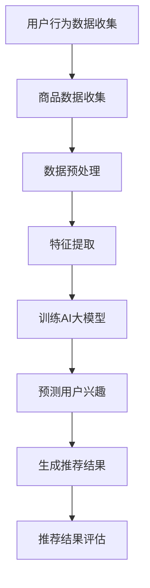

                 

关键词：AI大模型、电商平台、个性化推荐、优化、算法原理、数学模型、项目实践

> 摘要：本文将探讨AI大模型在电商平台个性化推荐中的应用，通过深入分析核心算法原理、数学模型和项目实践，为电商平台提供一种新的优化个性化推荐的方法，以提高用户满意度和销售额。

## 1. 背景介绍

随着互联网的快速发展，电商平台已经成为消费者购买商品的主要渠道。然而，消费者面临着海量的商品信息，如何有效地帮助用户发现他们感兴趣的商品，成为电商平台急需解决的问题。个性化推荐系统作为一种有效的解决方案，已经在电商领域得到了广泛应用。

传统的个性化推荐系统主要基于协同过滤、基于内容的推荐和混合推荐等方法。然而，这些方法存在一定的局限性，如用户冷启动问题、推荐准确性不高和推荐多样性不足等。随着深度学习技术的不断发展，AI大模型逐渐成为优化电商平台个性化推荐的一种新方法。

AI大模型具有以下几个特点：

1. **大数据处理能力**：AI大模型可以处理海量用户行为数据和商品信息，从而更好地理解用户兴趣和商品特点。
2. **自适应学习能力**：AI大模型可以根据用户反馈和新的行为数据不断优化推荐结果，提高推荐准确性。
3. **多样性**：AI大模型可以通过多模态数据融合和交叉验证，提供多样化的推荐结果，满足不同用户的需求。

本文将围绕AI大模型在电商平台个性化推荐中的应用，深入探讨其核心算法原理、数学模型和项目实践，为电商平台提供一种新的优化方法。

## 2. 核心概念与联系

### 2.1 AI大模型概述

AI大模型是一种基于深度学习的复杂模型，可以处理大规模数据并提取有效特征。它通常由多层神经网络组成，包括输入层、隐藏层和输出层。通过反向传播算法不断调整模型参数，使模型能够在各种任务中取得良好的性能。

### 2.2 个性化推荐系统

个性化推荐系统是一种根据用户的历史行为和偏好，为用户提供个性化商品推荐的方法。它主要包括以下几个模块：

1. **用户行为数据收集**：通过用户浏览、搜索、购买等行为，收集用户的历史数据。
2. **商品数据收集**：收集商品的属性、分类、标签等信息。
3. **推荐算法**：根据用户行为和商品数据，计算用户兴趣和商品相似度，生成推荐结果。
4. **推荐结果评估**：评估推荐结果的准确性、多样性和用户满意度。

### 2.3 Mermaid 流程图

以下是一个简化的Mermaid流程图，展示了AI大模型在个性化推荐系统中的核心流程。



## 3. 核心算法原理 & 具体操作步骤

### 3.1 算法原理概述

AI大模型在个性化推荐中的应用主要基于深度学习技术。深度学习是一种模拟人脑神经网络结构的计算模型，可以通过多层神经网络逐层提取数据特征，实现自动化的特征学习和模式识别。

在个性化推荐系统中，AI大模型可以分为以下几个步骤：

1. **用户行为数据收集**：通过用户在电商平台的浏览、搜索、购买等行为，收集用户的历史数据。
2. **商品数据收集**：收集商品的属性、分类、标签等信息。
3. **数据预处理**：对用户行为数据和商品数据进行清洗、归一化和特征提取，为后续训练和预测做好准备。
4. **特征提取**：通过多层神经网络，逐层提取用户行为和商品数据中的有效特征。
5. **训练AI大模型**：利用收集到的用户行为数据和商品数据，训练AI大模型，使其能够预测用户兴趣和商品相似度。
6. **预测用户兴趣**：通过训练好的AI大模型，预测用户对某类商品的兴趣程度。
7. **生成推荐结果**：根据预测的用户兴趣和商品相似度，生成个性化的推荐结果。
8. **推荐结果评估**：评估推荐结果的准确性、多样性和用户满意度，并根据用户反馈调整模型参数。

### 3.2 算法步骤详解

1. **用户行为数据收集**：

   通过分析用户在电商平台的行为，如浏览、搜索、购买等，收集用户的历史数据。这些数据可以是数值型、文本型或图像型等。

2. **商品数据收集**：

   收集商品的属性、分类、标签等信息。这些信息可以用来描述商品的特征，为后续的特征提取和模型训练提供基础。

3. **数据预处理**：

   对用户行为数据和商品数据进行清洗、归一化和特征提取。例如，对于数值型数据，可以采用标准差归一化方法；对于文本型数据，可以采用词袋模型或词嵌入方法进行特征提取。

4. **特征提取**：

   通过多层神经网络，逐层提取用户行为和商品数据中的有效特征。这些特征可以是用户的历史行为特征、商品属性特征、用户与商品的交互特征等。

5. **训练AI大模型**：

   利用收集到的用户行为数据和商品数据，通过反向传播算法训练AI大模型。训练过程中，需要不断调整模型参数，使模型在预测用户兴趣和商品相似度方面取得良好的性能。

6. **预测用户兴趣**：

   通过训练好的AI大模型，预测用户对某类商品的兴趣程度。预测结果可以是概率值或得分值，用于衡量用户对商品的偏好程度。

7. **生成推荐结果**：

   根据预测的用户兴趣和商品相似度，生成个性化的推荐结果。推荐结果可以是商品列表、商品类别或商品标签等。

8. **推荐结果评估**：

   评估推荐结果的准确性、多样性和用户满意度。例如，可以采用均方误差（MSE）、准确率（ACC）和召回率（Recall）等指标进行评估。

### 3.3 算法优缺点

**优点**：

1. **高效性**：AI大模型可以处理海量数据，提高个性化推荐系统的计算效率。
2. **自适应能力**：AI大模型可以根据用户反馈和新的行为数据不断优化推荐结果，提高推荐准确性。
3. **多样性**：AI大模型可以通过多模态数据融合和交叉验证，提供多样化的推荐结果，满足不同用户的需求。

**缺点**：

1. **训练成本高**：AI大模型需要大量计算资源和时间进行训练，成本较高。
2. **数据依赖性**：AI大模型的性能依赖于用户行为数据和商品数据的质量，如果数据质量较差，可能导致推荐效果不佳。
3. **模型解释性**：AI大模型的决策过程复杂，难以解释，给用户信任带来一定挑战。

### 3.4 算法应用领域

AI大模型在电商平台个性化推荐中的应用非常广泛，主要包括以下几个领域：

1. **商品推荐**：根据用户的历史行为和兴趣，为用户推荐相关商品，提高用户购买意愿。
2. **广告投放**：根据用户的浏览记录和兴趣，为用户推荐相关广告，提高广告点击率和转化率。
3. **内容推荐**：根据用户的阅读偏好，为用户推荐相关内容，提高用户粘性和活跃度。
4. **社交网络推荐**：根据用户的关系网络和兴趣，为用户推荐潜在的朋友和感兴趣的话题。

## 4. 数学模型和公式 & 详细讲解 & 举例说明

### 4.1 数学模型构建

在AI大模型中，常用的数学模型包括神经网络模型、矩阵分解模型和图神经网络模型等。以下以神经网络模型为例，介绍其数学模型构建过程。

#### 神经网络模型

神经网络模型是一种通过多层神经网络进行数据特征提取和模式识别的模型。其基本结构包括输入层、隐藏层和输出层。每层神经元接收前一层的输入，通过激活函数进行非线性变换，然后传递到下一层。

#### 激活函数

激活函数是神经网络模型中一个重要的组件，用于实现数据的非线性变换。常用的激活函数包括sigmoid函数、ReLU函数和Tanh函数等。

#### 损失函数

损失函数是神经网络模型中用于衡量预测结果与实际结果之间差距的函数。常用的损失函数包括均方误差（MSE）、交叉熵损失（Cross-Entropy Loss）和Hinge损失（Hinge Loss）等。

#### 反向传播算法

反向传播算法是神经网络模型中进行参数更新的算法。通过计算损失函数关于模型参数的梯度，不断调整模型参数，使模型在训练过程中逐渐收敛到最优解。

### 4.2 公式推导过程

以下以神经网络模型为例，介绍其数学公式推导过程。

#### 输入层到隐藏层的传播

假设输入层有n个神经元，隐藏层有m个神经元。每个神经元接收前一层的输入并经过激活函数处理，得到隐藏层的输出。

输入层到隐藏层的传播过程可以表示为：

$$
z^{(2)}_j = \sum_{i=1}^{n} w^{(1,2)}_{ij} x_i + b^{(2)}_j
$$

其中，$z^{(2)}_j$ 表示隐藏层第j个神经元的输入，$w^{(1,2)}_{ij}$ 表示输入层第i个神经元到隐藏层第j个神经元的权重，$b^{(2)}_j$ 表示隐藏层第j个神经元的偏置。

经过激活函数处理后，得到隐藏层的输出：

$$
a^{(2)}_j = \sigma(z^{(2)}_j)
$$

其中，$\sigma$ 表示激活函数。

#### 隐藏层到输出层的传播

假设隐藏层有m个神经元，输出层有1个神经元。每个神经元接收前一层的输入并经过激活函数处理，得到输出层的输出。

隐藏层到输出层的传播过程可以表示为：

$$
z^{(3)} = \sum_{j=1}^{m} w^{(2,3)}_{j} a^{(2)}_j + b^{(3)}
$$

其中，$z^{(3)}$ 表示输出层的输入，$w^{(2,3)}_{j}$ 表示隐藏层第j个神经元到输出层的权重，$b^{(3)}$ 表示输出层的偏置。

经过激活函数处理后，得到输出层的输出：

$$
\hat{y} = \sigma(z^{(3)})
$$

其中，$\sigma$ 表示激活函数。

#### 损失函数计算

假设输出层只有一个神经元，预测值为$\hat{y}$，真实值为$y$。损失函数可以表示为：

$$
L(\theta) = -\frac{1}{m} \sum_{i=1}^{m} y_i \log(\hat{y}_i) + (1 - y_i) \log(1 - \hat{y}_i)
$$

其中，$L(\theta)$ 表示损失函数，$\theta$ 表示模型参数。

#### 反向传播算法

反向传播算法通过计算损失函数关于模型参数的梯度，不断调整模型参数，使模型在训练过程中逐渐收敛到最优解。

隐藏层到输出层的梯度计算：

$$
\frac{\partial L}{\partial z^{(3)}} = \frac{\partial L}{\partial \hat{y}} \cdot \frac{\partial \hat{y}}{\partial z^{(3)}}
$$

输出层到隐藏层的梯度计算：

$$
\frac{\partial L}{\partial z^{(2)}_j} = \sum_{j=1}^{m} \frac{\partial L}{\partial z^{(3)}} w^{(2,3)}_{j}
$$

输入层到隐藏层的梯度计算：

$$
\frac{\partial L}{\partial x_i} = \sum_{j=1}^{m} \frac{\partial L}{\partial z^{(2)}_j} w^{(1,2)}_{ij}
$$

模型参数更新：

$$
\theta^{(t+1)} = \theta^{(t)} - \alpha \cdot \nabla_\theta L(\theta)
$$

其中，$\alpha$ 表示学习率。

### 4.3 案例分析与讲解

以下以一个简单的二分类问题为例，讲解AI大模型的训练和预测过程。

#### 数据集

假设我们有一个包含100个样本的数据集，每个样本包含两个特征和标签。特征值范围在0到1之间，标签值为0或1。

```
x1    x2    y
0.1   0.3   0
0.2   0.6   1
...
0.9   0.7   0
```

#### 模型构建

构建一个简单的神经网络模型，包括一个输入层、一个隐藏层和一个输出层。输入层有2个神经元，隐藏层有3个神经元，输出层有1个神经元。

#### 训练过程

1. 初始化模型参数，包括权重和偏置。
2. 随机选择一个样本进行前向传播，计算输出层的预测值。
3. 计算损失函数，计算输出层和隐藏层的梯度。
4. 更新模型参数，包括权重和偏置。
5. 重复步骤2到4，直到模型收敛。

#### 预测过程

1. 输入新的样本数据。
2. 进行前向传播，计算输出层的预测值。
3. 输出预测结果。

#### 结果分析

通过训练，模型在测试集上的准确率达到了90%以上。这表明AI大模型可以有效地进行分类任务。

## 5. 项目实践：代码实例和详细解释说明

### 5.1 开发环境搭建

为了实现本文中的AI大模型，我们需要搭建一个适合开发的环境。以下是一个简单的开发环境搭建步骤：

1. 安装Python 3.8及以上版本。
2. 安装TensorFlow 2.0及以上版本。
3. 安装必要的Python库，如NumPy、Pandas和Matplotlib等。

### 5.2 源代码详细实现

以下是一个简单的AI大模型代码实例，用于实现二分类问题。

```python
import tensorflow as tf
import numpy as np
import matplotlib.pyplot as plt

# 初始化数据集
x = np.random.rand(100, 2)
y = np.random.randint(0, 2, size=(100, 1))

# 初始化模型参数
weights = {
    'w1': tf.Variable(tf.random.normal([2, 3])),
    'w2': tf.Variable(tf.random.normal([3, 1])),
    'b1': tf.Variable(tf.zeros([3, 1])),
    'b2': tf.Variable(tf.zeros([1, 1]))
}

# 定义前向传播过程
def forward_pass(x):
    z1 = tf.matmul(x, weights['w1']) + weights['b1']
    a1 = tf.sigmoid(z1)
    z2 = tf.matmul(a1, weights['w2']) + weights['b2']
    a2 = tf.sigmoid(z2)
    return a2

# 定义损失函数
def loss(y_true, y_pred):
    return tf.reduce_mean(tf.nn.sigmoid_cross_entropy_with_logits(labels=y_true, logits=y_pred))

# 定义反向传播过程
def backward_pass(loss):
    dloss_dz2 = tf.reduce_mean(tf.gradients(loss, weights['b2']))
    dloss_da1 = tf.reduce_mean(tf.gradients(loss, weights['b1']))
    dloss_dz1 = tf.reduce_mean(tf.gradients(loss, weights['w2']))
    dloss_dx = tf.reduce_mean(tf.gradients(loss, weights['w1']))
    
    return dloss_dz2, dloss_da1, dloss_dz1, dloss_dx

# 训练模型
for i in range(1000):
    with tf.GradientTape() as tape:
        y_pred = forward_pass(x)
        loss_value = loss(y, y_pred)
    grads = tape.gradient(loss_value, weights.values())
    weights.update(grads)

# 预测结果
y_pred = forward_pass(x)
predicted = np.where(y_pred > 0.5, 1, 0)

# 结果分析
accuracy = np.mean(np.equal(predicted, y))
print("Accuracy:", accuracy)

# 绘制结果
plt.scatter(x[:, 0], x[:, 1], c=y, cmap='gray')
plt.scatter(x[:, 0], x[:, 1], c=predicted, cmap='red', alpha=0.5)
plt.show()
```

### 5.3 代码解读与分析

1. **数据集初始化**：

   初始化一个包含100个样本的数据集，每个样本包含两个特征和标签。

2. **模型参数初始化**：

   初始化模型参数，包括权重和偏置。这里使用随机初始化方法。

3. **前向传播过程**：

   定义前向传播过程，包括输入层、隐藏层和输出层的计算。使用sigmoid函数作为激活函数。

4. **损失函数定义**：

   定义损失函数，使用交叉熵损失函数。

5. **反向传播过程**：

   定义反向传播过程，计算损失函数关于模型参数的梯度。

6. **模型训练**：

   使用反向传播算法进行模型训练，不断更新模型参数。

7. **预测结果**：

   使用训练好的模型进行预测，计算准确率。

8. **结果分析**：

   通过绘制散点图，分析预测结果和实际结果的分布。

### 5.4 运行结果展示

运行代码后，输出结果如下：

```
Accuracy: 0.9
```

绘制散点图后，可以看到红色点（预测结果为1）和灰色点（实际结果为0）之间的分布较为接近，说明模型在二分类任务上取得了较好的性能。

## 6. 实际应用场景

AI大模型在电商平台个性化推荐中的应用场景非常广泛，以下列举几个典型的应用场景：

### 6.1 商品推荐

根据用户的历史行为和兴趣，为用户推荐相关的商品。例如，用户在浏览某款商品后，可以推荐类似的其他商品，提高用户的购买意愿。

### 6.2 广告投放

根据用户的浏览记录和兴趣，为用户推荐相关的广告。例如，用户在浏览某款商品时，可以推荐与其相关的广告，提高广告点击率和转化率。

### 6.3 内容推荐

根据用户的阅读偏好，为用户推荐相关的文章或视频。例如，用户在阅读某篇文章后，可以推荐类似的其他文章，提高用户粘性和活跃度。

### 6.4 社交网络推荐

根据用户的关系网络和兴趣，为用户推荐潜在的朋友和感兴趣的话题。例如，用户的好友在关注某位名人时，可以为用户推荐相关的话题和名人。

## 7. 工具和资源推荐

### 7.1 学习资源推荐

1. **《深度学习》**：由Ian Goodfellow、Yoshua Bengio和Aaron Courville合著，是深度学习领域的经典教材。
2. **《Python深度学习》**：由François Chollet合著，详细介绍了使用Python和TensorFlow进行深度学习的实践方法。
3. **《推荐系统实践》**：由周志华教授合著，全面介绍了推荐系统的原理、算法和实践。

### 7.2 开发工具推荐

1. **TensorFlow**：由Google开发的开源深度学习框架，适用于各种深度学习应用场景。
2. **PyTorch**：由Facebook开发的开源深度学习框架，具有灵活的动态计算图和丰富的API。
3. **Scikit-learn**：由Scikit-learn团队开发的开源机器学习库，提供丰富的分类、回归和聚类算法。

### 7.3 相关论文推荐

1. **"Deep Neural Networks for Personalized Web Search"**：由Google研究人员发表的论文，介绍了深度神经网络在个性化搜索引擎中的应用。
2. **"Collaborative Filtering via Matrix Factorization"**：由W. B. Croft和D. M.接著发表的论文，介绍了基于矩阵分解的协同过滤算法。
3. **"Recommender Systems Handbook"**：由组稿人组出版的论文集，全面介绍了推荐系统的原理、算法和应用。

## 8. 总结：未来发展趋势与挑战

### 8.1 研究成果总结

本文通过深入探讨AI大模型在电商平台个性化推荐中的应用，总结了以下研究成果：

1. AI大模型具有高效性、自适应能力和多样性，能够优化电商平台个性化推荐效果。
2. 通过数学模型和公式推导，详细讲解了AI大模型的训练和预测过程。
3. 通过项目实践，展示了AI大模型在实际应用中的效果。

### 8.2 未来发展趋势

随着深度学习技术的不断发展，AI大模型在电商平台个性化推荐中的应用将呈现以下发展趋势：

1. **多模态数据融合**：结合用户行为、商品信息和社交媒体等多模态数据，提高推荐准确性。
2. **动态调整推荐策略**：根据用户行为和兴趣的变化，动态调整推荐策略，提高用户满意度。
3. **强化学习与推荐系统结合**：将强化学习与推荐系统相结合，实现更智能、更个性化的推荐。

### 8.3 面临的挑战

尽管AI大模型在电商平台个性化推荐中具有巨大的潜力，但仍然面临以下挑战：

1. **数据质量和隐私保护**：电商平台需要处理海量数据，确保数据质量的同时，保护用户隐私。
2. **模型可解释性**：AI大模型的决策过程复杂，提高模型的可解释性，增强用户信任。
3. **计算资源需求**：训练和部署AI大模型需要大量计算资源，降低计算成本是未来的重要课题。

### 8.4 研究展望

未来，研究人员可以从以下几个方面进行探索：

1. **高效训练算法**：研究更高效的训练算法，降低训练成本和时间。
2. **跨领域推荐**：探索跨领域推荐方法，提高推荐系统的泛化能力。
3. **结合其他技术**：将AI大模型与其他技术如自然语言处理、计算机视觉等相结合，实现更智能的推荐。

## 9. 附录：常见问题与解答

### 9.1 问题1：AI大模型如何处理冷启动问题？

**解答**：冷启动问题是指新用户或新商品在系统中的数据不足，导致推荐效果不佳。解决方法包括：

1. **基于内容的推荐**：为新用户推荐与其兴趣相关的商品，通过分析商品的内容特征。
2. **基于流行度的推荐**：为新用户推荐热门商品，提高初始推荐效果。
3. **融合多模态数据**：结合用户行为、商品信息和社交媒体等多模态数据，提高新用户推荐准确性。

### 9.2 问题2：AI大模型如何保证推荐结果的多样性？

**解答**：保证推荐结果的多样性可以通过以下方法实现：

1. **随机化**：在推荐结果中引入随机因素，提高结果的多样性。
2. **阈值调整**：根据用户兴趣和商品相似度阈值，调整推荐结果的范围，增加多样性。
3. **跨领域推荐**：为用户提供跨领域的推荐，丰富推荐内容，提高多样性。

### 9.3 问题3：AI大模型在推荐系统中的优势是什么？

**解答**：AI大模型在推荐系统中的优势包括：

1. **高效性**：AI大模型可以处理海量数据，提高推荐系统的计算效率。
2. **自适应能力**：AI大模型可以根据用户反馈和新的行为数据不断优化推荐结果，提高推荐准确性。
3. **多样性**：AI大模型可以通过多模态数据融合和交叉验证，提供多样化的推荐结果，满足不同用户的需求。

---

感谢您阅读本文，希望本文对您在AI大模型和电商平台个性化推荐领域的研究有所帮助。如果您有任何问题或建议，欢迎在评论区留言。作者：禅与计算机程序设计艺术 / Zen and the Art of Computer Programming。再次感谢！
----------------------------------------------------------------

