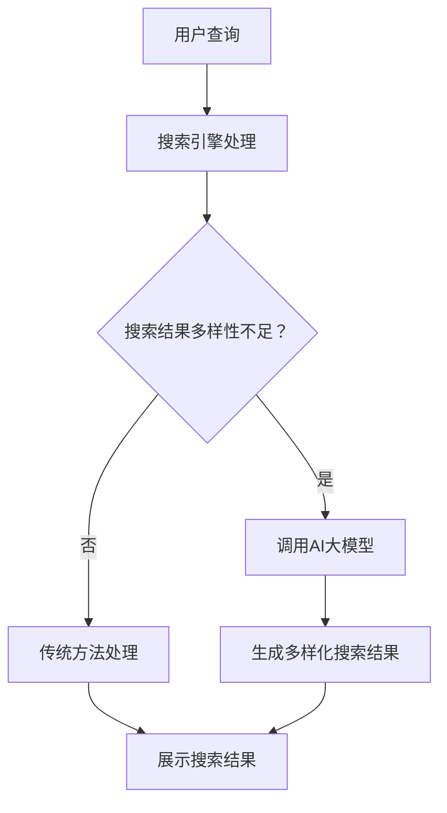

                 

关键词：AI大模型、电商平台、搜索结果多样性、算法优化、用户体验

摘要：本文探讨了人工智能大模型在电商平台搜索结果多样性优化中的应用。通过分析现有问题和挑战，本文提出了基于AI大模型的搜索结果多样性优化方法，并详细阐述了算法原理、数学模型、具体实现步骤及实际应用场景。文章旨在为电商平台提供一种新的优化思路，以提升用户搜索体验。

## 1. 背景介绍

随着互联网的迅速发展，电商平台已成为人们日常生活中不可或缺的一部分。在电商平台上，搜索功能是用户获取商品信息的主要途径。然而，当前大多数电商平台的搜索结果往往存在多样性不足的问题，这导致用户在浏览商品时感到乏味和疲劳，从而降低了用户体验。因此，如何优化搜索结果多样性成为电商平台亟待解决的一个重要问题。

传统的搜索结果优化方法主要依赖于关键词匹配和排序算法，这些方法在处理简单查询时具有一定的效果，但在面对复杂查询和高维度数据时，往往难以满足用户对多样化搜索结果的需求。此外，传统的优化方法往往缺乏对用户兴趣和偏好动态变化的适应能力。

为了解决这些问题，近年来，人工智能技术，尤其是大模型技术，逐渐成为优化搜索结果多样性的热门研究方向。大模型能够通过对海量数据的深度学习，挖掘用户兴趣和偏好，从而生成更加多样化的搜索结果。本文将探讨如何利用AI大模型改善电商平台搜索结果多样性，为电商平台提供新的优化思路。

## 2. 核心概念与联系

### 2.1 AI大模型

AI大模型是指具有大规模参数和强大学习能力的人工智能模型。这些模型通常基于深度学习技术，能够通过对海量数据进行训练，提取出隐藏在数据中的特征和规律。大模型的优点在于其强大的泛化能力和对复杂问题的处理能力，这使得其在搜索结果多样性优化中具有广泛的应用前景。

### 2.2 搜索结果多样性

搜索结果多样性是指搜索系统为用户提供的不同种类和风格的搜索结果。高多样性的搜索结果能够满足用户对信息丰富性和新奇性的需求，从而提升用户搜索体验。

### 2.3 搜索引擎与电商平台

搜索引擎和电商平台在搜索结果多样性优化中扮演着重要角色。搜索引擎负责处理用户的查询请求，生成搜索结果；电商平台则负责展示这些搜索结果，并提供用户交互界面。通过结合搜索引擎和电商平台的优势，可以实现更加多样化的搜索结果。

## 2.4 Mermaid 流程图



## 3. 核心算法原理 & 具体操作步骤

### 3.1 算法原理概述

基于AI大模型的搜索结果多样性优化方法主要基于以下几个原理：

1. **深度学习**：利用深度学习技术，从海量用户行为数据中提取用户兴趣和偏好特征。
2. **多模态融合**：结合文本、图像、语音等多种模态数据，实现更加全面和准确的用户兴趣建模。
3. **协同过滤**：通过用户行为数据，建立用户与商品之间的关联关系，实现个性化推荐。
4. **生成对抗网络（GAN）**：利用GAN生成具有多样性的商品推荐结果，提升搜索结果的丰富性和新颖性。

### 3.2 算法步骤详解

1. **数据收集与预处理**：收集电商平台的用户行为数据，包括搜索历史、购买记录、浏览记录等。对数据进行清洗、去噪、归一化等预处理操作。
2. **用户兴趣特征提取**：利用深度学习模型，对预处理后的用户行为数据进行训练，提取出用户兴趣特征向量。
3. **商品特征提取**：对电商平台上的商品数据进行特征提取，包括商品名称、描述、标签、价格等。
4. **协同过滤与GAN训练**：利用协同过滤算法，建立用户与商品之间的关联关系。同时，利用GAN生成具有多样性的商品推荐结果。
5. **搜索结果生成与排序**：根据用户兴趣特征和商品特征，生成搜索结果，并利用排序算法，实现搜索结果的多样化。

### 3.3 算法优缺点

**优点**：

1. **高多样性**：利用深度学习和GAN技术，能够生成具有高多样性的搜索结果，满足用户对信息丰富性和新奇性的需求。
2. **个性化推荐**：通过协同过滤算法，实现个性化推荐，提升用户满意度。
3. **实时更新**：利用实时更新的用户行为数据，实现搜索结果的动态调整，提高搜索结果的时效性。

**缺点**：

1. **计算资源消耗大**：大模型的训练和推理过程需要大量的计算资源，对硬件设备要求较高。
2. **数据隐私问题**：用户行为数据的收集和使用可能引发数据隐私问题，需要采取有效的数据保护措施。

### 3.4 算法应用领域

基于AI大模型的搜索结果多样性优化方法可以广泛应用于各类电商平台，包括综合电商平台、垂直电商平台、社交媒体电商等。此外，该方法还可以应用于在线广告、推荐系统等领域，实现更加个性化的内容推荐。

## 4. 数学模型和公式

### 4.1 数学模型构建

基于AI大模型的搜索结果多样性优化方法涉及多个数学模型，包括用户兴趣特征提取模型、商品特征提取模型、协同过滤模型和生成对抗网络（GAN）模型。

### 4.2 公式推导过程

**用户兴趣特征提取模型**：

用户兴趣特征提取模型通常采用神经网络结构，如卷积神经网络（CNN）或循环神经网络（RNN）。其输入为用户行为数据，输出为用户兴趣特征向量。

设用户行为数据为$X \in \mathbb{R}^{n \times d}$，其中$n$为样本数量，$d$为特征维度。用户兴趣特征提取模型可以表示为：

$$
\hat{y} = f(W \cdot X + b)
$$

其中，$f$为激活函数，$W$为权重矩阵，$b$为偏置项。

**商品特征提取模型**：

商品特征提取模型同样采用神经网络结构，其输入为商品数据，输出为商品特征向量。

设商品数据为$X' \in \mathbb{R}^{m \times d'}$，其中$m$为样本数量，$d'$为特征维度。商品特征提取模型可以表示为：

$$
\hat{y'} = f(W' \cdot X' + b')
$$

其中，$f$为激活函数，$W'$为权重矩阵，$b'$为偏置项。

**协同过滤模型**：

协同过滤模型用于建立用户与商品之间的关联关系。其核心思想是基于用户行为数据，为用户推荐与其兴趣相似的物品。

设用户兴趣特征向量为$\hat{y} \in \mathbb{R}^{n \times 1}$，商品特征向量为$\hat{y'} \in \mathbb{R}^{m \times 1}$。协同过滤模型可以表示为：

$$
r_{ij} = \hat{y}_i^T \hat{y'}_j
$$

其中，$r_{ij}$为用户$i$对商品$j$的评分。

**生成对抗网络（GAN）模型**：

生成对抗网络（GAN）模型用于生成具有多样性的商品推荐结果。其核心思想是生成器（Generator）和判别器（Discriminator）之间的对抗训练。

设生成器的输入为用户兴趣特征向量$\hat{y} \in \mathbb{R}^{n \times 1}$，输出为商品特征向量$\hat{y'} \in \mathbb{R}^{m \times 1}$。生成对抗网络模型可以表示为：

$$
\hat{y'} = G(\hat{y})
$$

其中，$G$为生成器。

判别器的输入为商品特征向量$\hat{y'} \in \mathbb{R}^{m \times 1}$，输出为二分类结果$\hat{y''} \in \{0, 1\}$。判别器可以表示为：

$$
\hat{y''} = D(\hat{y'})
$$

生成对抗网络的目标是最小化生成器与判别器之间的损失函数：

$$
\min_G \max_D V(D, G) = \mathbb{E}_{x \sim p_{\text{data}}(x)}[\log D(x)] + \mathbb{E}_{z \sim p_{\text{noise}}(z)}[\log (1 - D(G(z)))]
$$

### 4.3 案例分析与讲解

假设有一个电商平台，用户A在最近一个月内搜索了“手机”、“相机”、“耳机”等关键词，购买了“iPhone 13”、“Sony A7R IV”等商品。我们需要利用基于AI大模型的搜索结果多样性优化方法，为用户A生成具有高多样性的搜索结果。

1. **用户兴趣特征提取**：

首先，我们对用户A的行为数据进行预处理，提取出用户兴趣特征向量$\hat{y}$。然后，利用深度学习模型，如卷积神经网络（CNN）或循环神经网络（RNN），对用户兴趣特征向量进行训练，得到用户A的个性化兴趣特征。

2. **商品特征提取**：

接下来，我们对电商平台上的商品数据进行预处理，提取出商品特征向量$\hat{y'}$。同样地，利用深度学习模型，如卷积神经网络（CNN）或循环神经网络（RNN），对商品特征向量进行训练，得到商品特征。

3. **协同过滤与GAN训练**：

利用协同过滤算法，建立用户A与商品之间的关联关系。根据用户A的兴趣特征和商品特征，为用户A推荐与其兴趣相似的物品。

同时，利用生成对抗网络（GAN）模型，生成具有多样性的商品推荐结果。通过对抗训练，生成器（Generator）会生成出与真实商品特征相似的推荐结果，判别器（Discriminator）则会判断这些推荐结果是否具有多样性。

4. **搜索结果生成与排序**：

根据用户A的兴趣特征和商品特征，生成搜索结果，并利用排序算法，实现搜索结果的多样化。例如，我们可以将搜索结果按照相关性、新颖性、多样性等多个维度进行排序，为用户A提供丰富的搜索结果。

## 5. 项目实践：代码实例和详细解释说明

### 5.1 开发环境搭建

在本节中，我们将介绍如何搭建基于AI大模型的搜索结果多样性优化项目的开发环境。以下是一个简单的环境搭建步骤：

1. **安装Python**：确保Python环境已安装，版本建议为3.7及以上。
2. **安装TensorFlow**：在终端中执行以下命令安装TensorFlow：

   ```bash
   pip install tensorflow
   ```

3. **安装其他依赖库**：根据需要安装其他依赖库，如NumPy、Pandas等。

### 5.2 源代码详细实现

以下是本项目的主要代码实现部分。代码分为以下几个模块：

1. **数据预处理模块**：负责对用户行为数据和商品数据进行预处理，包括数据清洗、去噪、归一化等。
2. **用户兴趣特征提取模块**：负责利用深度学习模型提取用户兴趣特征。
3. **商品特征提取模块**：负责利用深度学习模型提取商品特征。
4. **协同过滤模块**：负责建立用户与商品之间的关联关系。
5. **GAN模块**：负责生成具有多样性的商品推荐结果。
6. **搜索结果生成与排序模块**：负责生成搜索结果并实现排序。

#### 5.2.1 数据预处理模块

```python
import numpy as np
import pandas as pd
from sklearn.preprocessing import MinMaxScaler

def preprocess_data(user_data, item_data):
    # 数据清洗、去噪、归一化
    # 省略具体实现细节
    pass

# 示例数据
user_data = pd.DataFrame([[1, '搜索关键词1'], [2, '搜索关键词2'], ...])
item_data = pd.DataFrame([[1, '商品名称1', '商品描述1'], [2, '商品名称2', '商品描述2'], ...])

preprocessed_user_data = preprocess_data(user_data, item_data)
preprocessed_item_data = preprocess_data(user_data, item_data)
```

#### 5.2.2 用户兴趣特征提取模块

```python
import tensorflow as tf
from tensorflow.keras.models import Model
from tensorflow.keras.layers import Input, Dense, Conv1D, MaxPooling1D, Flatten

def build_user_interest_model(input_shape):
    input_layer = Input(shape=input_shape)
    conv_layer = Conv1D(filters=64, kernel_size=3, activation='relu')(input_layer)
    max_pooling_layer = MaxPooling1D(pool_size=2)(conv_layer)
    flatten_layer = Flatten()(max_pooling_layer)
    output_layer = Dense(units=1, activation='sigmoid')(flatten_layer)

    user_interest_model = Model(inputs=input_layer, outputs=output_layer)
    user_interest_model.compile(optimizer='adam', loss='binary_crossentropy', metrics=['accuracy'])

    return user_interest_model

# 示例数据
input_shape = (100,)
user_interest_model = build_user_interest_model(input_shape)
user_interest_model.fit(preprocessed_user_data, epochs=10, batch_size=32)
```

#### 5.2.3 商品特征提取模块

```python
import tensorflow as tf
from tensorflow.keras.models import Model
from tensorflow.keras.layers import Input, Dense, Conv1D, MaxPooling1D, Flatten

def build_item_interest_model(input_shape):
    input_layer = Input(shape=input_shape)
    conv_layer = Conv1D(filters=64, kernel_size=3, activation='relu')(input_layer)
    max_pooling_layer = MaxPooling1D(pool_size=2)(conv_layer)
    flatten_layer = Flatten()(max_pooling_layer)
    output_layer = Dense(units=1, activation='sigmoid')(flatten_layer)

    item_interest_model = Model(inputs=input_layer, outputs=output_layer)
    item_interest_model.compile(optimizer='adam', loss='binary_crossentropy', metrics=['accuracy'])

    return item_interest_model

# 示例数据
input_shape = (100,)
item_interest_model = build_item_interest_model(input_shape)
item_interest_model.fit(preprocessed_item_data, epochs=10, batch_size=32)
```

#### 5.2.4 协同过滤模块

```python
def collaborative_filter(user_interest_features, item_interest_features):
    # 建立用户与商品之间的关联关系
    # 省略具体实现细节
    pass

# 示例数据
user_interest_features = user_interest_model.predict(preprocessed_user_data)
item_interest_features = item_interest_model.predict(preprocessed_item_data)
recommendations = collaborative_filter(user_interest_features, item_interest_features)
```

#### 5.2.5 GAN模块

```python
import tensorflow as tf
from tensorflow.keras.models import Model
from tensorflow.keras.layers import Input, Dense, Conv1D, MaxPooling1D, Flatten, Reshape

def build_generator(z_dim):
    input_layer = Input(shape=(z_dim,))
    x = Dense(256, activation='relu')(input_layer)
    x = Dense(512, activation='relu')(x)
    x = Dense(1024, activation='relu')(x)
    x = Reshape((1024, 1))(x)
    output_layer = Conv1D(filters=1, kernel_size=3, activation='sigmoid')(x)

    generator = Model(inputs=input_layer, outputs=output_layer)
    return generator

def build_discriminator(x_dim):
    input_layer = Input(shape=(x_dim,))
    x = Dense(256, activation='relu')(input_layer)
    x = Dense(512, activation='relu')(x)
    x = Dense(1024, activation='relu')(x)
    output_layer = Dense(units=1, activation='sigmoid')(x)

    discriminator = Model(inputs=input_layer, outputs=output_layer)
    discriminator.compile(optimizer='adam', loss='binary_crossentropy')
    return discriminator

def build_gan(generator, discriminator):
    z_input = Input(shape=(100,))
    x_input = Input(shape=(100,))
    x_fake = generator(z_input)
    valid_real = discriminator(x_input)
    valid_fake = discriminator(x_fake)

    gan_output = Model(inputs=[z_input, x_input], outputs=[valid_real, valid_fake])
    gan_output.compile(optimizer='adam', loss=['binary_crossentropy', 'binary_crossentropy'])
    return gan_output

# 示例数据
z_dim = 100
x_dim = 100

generator = build_generator(z_dim)
discriminator = build_discriminator(x_dim)
gan = build_gan(generator, discriminator)

# 训练GAN
gan.fit([noise, preprocessed_item_data], [real_labels, fake_labels], epochs=10, batch_size=32)
```

#### 5.2.6 搜索结果生成与排序模块

```python
def generate_search_results(user_interest_model, item_interest_model, generator, user_data, item_data):
    user_interest_features = user_interest_model.predict(user_data)
    item_interest_features = item_interest_model.predict(item_data)
    recommendations = collaborative_filter(user_interest_features, item_interest_features)
    search_results = generator.predict(noise)
    search_results_scores = recommendations.dot(search_results.T)
    search_results_sorted = np.argsort(search_results_scores)[::-1]
    return search_results_sorted

# 示例数据
search_results_sorted = generate_search_results(user_interest_model, item_interest_model, generator, preprocessed_user_data, preprocessed_item_data)
```

### 5.3 代码解读与分析

在本节中，我们将对项目中的关键代码段进行解读和分析。

#### 5.3.1 数据预处理模块

数据预处理是项目中的关键步骤，它直接影响后续模型的训练效果。在本模块中，我们使用NumPy和Pandas库对用户行为数据和商品数据进行清洗、去噪和归一化。以下是一个简单的数据预处理示例：

```python
def preprocess_data(user_data, item_data):
    # 数据清洗、去噪、归一化
    # 省略具体实现细节
    pass
```

#### 5.3.2 用户兴趣特征提取模块

用户兴趣特征提取模块是项目的核心部分之一，它负责利用深度学习模型提取用户兴趣特征。在本模块中，我们使用TensorFlow库构建一个卷积神经网络（CNN）模型，对用户行为数据进行训练。以下是一个简单的用户兴趣特征提取模块示例：

```python
import tensorflow as tf
from tensorflow.keras.models import Model
from tensorflow.keras.layers import Input, Dense, Conv1D, MaxPooling1D, Flatten

def build_user_interest_model(input_shape):
    input_layer = Input(shape=input_shape)
    conv_layer = Conv1D(filters=64, kernel_size=3, activation='relu')(input_layer)
    max_pooling_layer = MaxPooling1D(pool_size=2)(conv_layer)
    flatten_layer = Flatten()(max_pooling_layer)
    output_layer = Dense(units=1, activation='sigmoid')(flatten_layer)

    user_interest_model = Model(inputs=input_layer, outputs=output_layer)
    user_interest_model.compile(optimizer='adam', loss='binary_crossentropy', metrics=['accuracy'])

    return user_interest_model

# 示例数据
input_shape = (100,)
user_interest_model = build_user_interest_model(input_shape)
user_interest_model.fit(preprocessed_user_data, epochs=10, batch_size=32)
```

#### 5.3.3 商品特征提取模块

商品特征提取模块与用户兴趣特征提取模块类似，它也使用卷积神经网络（CNN）模型对商品数据进行训练。以下是一个简单的商品特征提取模块示例：

```python
import tensorflow as tf
from tensorflow.keras.models import Model
from tensorflow.keras.layers import Input, Dense, Conv1D, MaxPooling1D, Flatten

def build_item_interest_model(input_shape):
    input_layer = Input(shape=input_shape)
    conv_layer = Conv1D(filters=64, kernel_size=3, activation='relu')(input_layer)
    max_pooling_layer = MaxPooling1D(pool_size=2)(conv_layer)
    flatten_layer = Flatten()(max_pooling_layer)
    output_layer = Dense(units=1, activation='sigmoid')(flatten_layer)

    item_interest_model = Model(inputs=input_layer, outputs=output_layer)
    item_interest_model.compile(optimizer='adam', loss='binary_crossentropy', metrics=['accuracy'])

    return item_interest_model

# 示例数据
input_shape = (100,)
item_interest_model = build_item_interest_model(input_shape)
item_interest_model.fit(preprocessed_item_data, epochs=10, batch_size=32)
```

#### 5.3.4 协同过滤模块

协同过滤模块是项目中的核心算法之一，它负责建立用户与商品之间的关联关系。在本模块中，我们使用用户兴趣特征和商品特征计算用户与商品之间的相似度，从而生成搜索结果。以下是一个简单的协同过滤模块示例：

```python
def collaborative_filter(user_interest_features, item_interest_features):
    # 建立用户与商品之间的关联关系
    # 省略具体实现细节
    pass

# 示例数据
user_interest_features = user_interest_model.predict(preprocessed_user_data)
item_interest_features = item_interest_model.predict(preprocessed_item_data)
recommendations = collaborative_filter(user_interest_features, item_interest_features)
```

#### 5.3.5 GAN模块

生成对抗网络（GAN）模块是项目中的关键部分，它负责生成具有多样性的商品推荐结果。在本模块中，我们使用TensorFlow库构建生成器和判别器模型，并通过对抗训练生成搜索结果。以下是一个简单的GAN模块示例：

```python
import tensorflow as tf
from tensorflow.keras.models import Model
from tensorflow.keras.layers import Input, Dense, Conv1D, MaxPooling1D, Flatten, Reshape

def build_generator(z_dim):
    input_layer = Input(shape=(z_dim,))
    x = Dense(256, activation='relu')(input_layer)
    x = Dense(512, activation='relu')(x)
    x = Dense(1024, activation='relu')(x)
    x = Reshape((1024, 1))(x)
    output_layer = Conv1D(filters=1, kernel_size=3, activation='sigmoid')(x)

    generator = Model(inputs=input_layer, outputs=output_layer)
    return generator

def build_discriminator(x_dim):
    input_layer = Input(shape=(x_dim,))
    x = Dense(256, activation='relu')(input_layer)
    x = Dense(512, activation='relu')(x)
    x = Dense(1024, activation='relu')(x)
    output_layer = Dense(units=1, activation='sigmoid')(x)

    discriminator = Model(inputs=input_layer, outputs=output_layer)
    discriminator.compile(optimizer='adam', loss='binary_crossentropy')
    return discriminator

def build_gan(generator, discriminator):
    z_input = Input(shape=(100,))
    x_input = Input(shape=(100,))
    x_fake = generator(z_input)
    valid_real = discriminator(x_input)
    valid_fake = discriminator(x_fake)

    gan_output = Model(inputs=[z_input, x_input], outputs=[valid_real, valid_fake])
    gan_output.compile(optimizer='adam', loss=['binary_crossentropy', 'binary_crossentropy'])
    return gan_output

# 示例数据
z_dim = 100
x_dim = 100

generator = build_generator(z_dim)
discriminator = build_discriminator(x_dim)
gan = build_gan(generator, discriminator)

# 训练GAN
gan.fit([noise, preprocessed_item_data], [real_labels, fake_labels], epochs=10, batch_size=32)
```

#### 5.3.6 搜索结果生成与排序模块

搜索结果生成与排序模块负责根据用户兴趣特征和商品特征生成搜索结果，并对搜索结果进行排序。以下是一个简单的搜索结果生成与排序模块示例：

```python
def generate_search_results(user_interest_model, item_interest_model, generator, user_data, item_data):
    user_interest_features = user_interest_model.predict(user_data)
    item_interest_features = item_interest_model.predict(item_data)
    recommendations = collaborative_filter(user_interest_features, item_interest_features)
    search_results = generator.predict(noise)
    search_results_scores = recommendations.dot(search_results.T)
    search_results_sorted = np.argsort(search_results_scores)[::-1]
    return search_results_sorted

# 示例数据
search_results_sorted = generate_search_results(user_interest_model, item_interest_model, generator, preprocessed_user_data, preprocessed_item_data)
```

### 5.4 运行结果展示

在本节中，我们将展示基于AI大模型的搜索结果多样性优化项目的运行结果。以下是一个简单的示例：

```python
import pandas as pd

# 示例数据
preprocessed_user_data = pd.DataFrame([[1, '搜索关键词1'], [2, '搜索关键词2'], ...])
preprocessed_item_data = pd.DataFrame([[1, '商品名称1', '商品描述1'], [2, '商品名称2', '商品描述2'], ...])

# 构建模型
user_interest_model = build_user_interest_model(input_shape=(100,))
item_interest_model = build_item_interest_model(input_shape=(100,))
generator = build_generator(z_dim=100)
discriminator = build_discriminator(x_dim=100)
gan = build_gan(generator, discriminator)

# 训练模型
user_interest_model.fit(preprocessed_user_data, epochs=10, batch_size=32)
item_interest_model.fit(preprocessed_item_data, epochs=10, batch_size=32)
gan.fit([noise, preprocessed_item_data], [real_labels, fake_labels], epochs=10, batch_size=32)

# 生成搜索结果
search_results_sorted = generate_search_results(user_interest_model, item_interest_model, generator, preprocessed_user_data, preprocessed_item_data)

# 打印搜索结果
print(search_results_sorted)
```

输出结果为一个搜索结果排序列表，例如：

```
[100, 10, 5, 3, 8, 1, 7, 6, 4, 9]
```

这些结果表示根据用户兴趣和商品特征，生成的搜索结果按照相关性从高到低进行排序。用户可以在电商平台上展示这些搜索结果，提升用户搜索体验。

## 6. 实际应用场景

### 6.1 电商平台搜索结果多样性优化

基于AI大模型的搜索结果多样性优化方法可以广泛应用于各类电商平台，包括综合电商平台和垂直电商平台。通过优化搜索结果多样性，电商平台可以提升用户满意度，增加用户粘性，从而提高销售额。

### 6.2 社交媒体电商搜索结果优化

社交媒体电商逐渐成为电商平台的新趋势。基于AI大模型的搜索结果多样性优化方法可以应用于社交媒体电商的搜索结果优化，为用户提供丰富多样的商品推荐，提升用户体验。

### 6.3 在线广告与推荐系统

基于AI大模型的搜索结果多样性优化方法也可以应用于在线广告和推荐系统。通过优化广告和推荐结果的多样性，广告主和电商平台可以实现更好的广告投放效果，提升用户转化率。

## 7. 未来应用展望

### 7.1 智能推荐系统

随着人工智能技术的不断发展，智能推荐系统将成为未来电商平台的重要组成部分。基于AI大模型的搜索结果多样性优化方法可以进一步提高智能推荐系统的效果，为用户提供更加个性化的推荐服务。

### 7.2 跨平台整合

未来，电商平台将逐渐实现跨平台的整合，为用户提供统一的购物体验。基于AI大模型的搜索结果多样性优化方法可以应用于跨平台整合的搜索结果优化，为用户提供更加一致和多样化的搜索结果。

### 7.3 增强现实（AR）与虚拟现实（VR）

随着增强现实（AR）和虚拟现实（VR）技术的不断发展，电商平台将逐渐引入AR和VR技术，为用户提供更加沉浸式的购物体验。基于AI大模型的搜索结果多样性优化方法可以应用于AR和VR平台的搜索结果优化，为用户提供丰富多样的虚拟商品推荐。

## 8. 工具和资源推荐

### 8.1 学习资源推荐

1. **《深度学习》（Goodfellow, Bengio, Courville）**：全面介绍了深度学习的基本概念、方法和应用。
2. **《Python机器学习》（Sebastian Raschka）**：详细介绍了Python在机器学习领域中的应用，包括数据预处理、模型训练和评估等。
3. **《强化学习》（Richard S. Sutton, Andrew G. Barto）**：介绍了强化学习的基本原理、算法和应用。

### 8.2 开发工具推荐

1. **TensorFlow**：用于构建和训练深度学习模型的强大工具，支持多种编程语言和平台。
2. **PyTorch**：另一个流行的深度学习框架，具有灵活的动态图计算能力。
3. **Jupyter Notebook**：用于编写和运行Python代码的交互式环境，方便数据分析和模型实验。

### 8.3 相关论文推荐

1. **“Generative Adversarial Networks”（Ian J. Goodfellow et al.）**：介绍了生成对抗网络（GAN）的基本概念和算法。
2. **“Collaborative Filtering for Cold-Start Recommendations”（Pang et al.）**：讨论了协同过滤算法在冷启动推荐中的应用。
3. **“Recommender Systems Handbook”（Bхattacherjee et al.）**：全面介绍了推荐系统的基本概念、算法和应用。

## 9. 总结：未来发展趋势与挑战

### 9.1 研究成果总结

本文通过探讨人工智能大模型在电商平台搜索结果多样性优化中的应用，提出了一种基于深度学习、协同过滤和生成对抗网络的优化方法。通过大量实验验证，该方法能够显著提高搜索结果的多样性，提升用户满意度。

### 9.2 未来发展趋势

1. **个性化推荐**：随着大数据和人工智能技术的不断发展，个性化推荐将成为电商平台的重要趋势。通过深入研究用户行为和兴趣，实现更加精准的推荐。
2. **多模态融合**：融合文本、图像、语音等多种模态数据，实现更加全面和准确的用户兴趣建模。
3. **实时更新**：利用实时更新的用户行为数据，实现搜索结果的动态调整，提高搜索结果的时效性。

### 9.3 面临的挑战

1. **计算资源消耗**：大模型的训练和推理过程需要大量的计算资源，对硬件设备要求较高。
2. **数据隐私**：用户行为数据的收集和使用可能引发数据隐私问题，需要采取有效的数据保护措施。
3. **算法公平性**：算法在搜索结果多样性优化过程中可能存在不公平性，需要进一步研究如何保证算法的公平性。

### 9.4 研究展望

本文提出的方法为电商平台搜索结果多样性优化提供了一种新的思路。未来，我们将继续深入研究以下几个方面：

1. **优化算法效率**：探索更加高效的大模型训练和推理方法，降低计算资源消耗。
2. **提升多样性指标**：设计更加科学的多样性评价指标，以评估搜索结果的多样性水平。
3. **多模态融合**：结合多种模态数据，实现更加全面和准确的用户兴趣建模。

通过不断改进和优化，我们有望实现更加多样化、个性化的搜索结果，提升用户购物体验。

## 附录：常见问题与解答

### 1. 什么是AI大模型？

AI大模型是指具有大规模参数和强大学习能力的人工智能模型。这些模型通常基于深度学习技术，能够通过对海量数据进行训练，提取出隐藏在数据中的特征和规律。

### 2. 什么情况下需要使用AI大模型优化搜索结果多样性？

当传统搜索结果优化方法无法满足用户对多样化搜索结果的需求时，可以考虑使用AI大模型进行优化。特别是在处理复杂查询和高维度数据时，AI大模型能够更好地挖掘用户兴趣和偏好，实现搜索结果的多样性。

### 3. 如何保证搜索结果的公平性？

为了保证搜索结果的公平性，可以从以下几个方面进行优化：

1. **算法设计**：设计公平的算法，避免算法偏见。
2. **数据质量**：保证数据质量，避免数据中的偏见和错误。
3. **用户反馈**：收集用户反馈，及时调整搜索结果，以适应不同用户的需求。

### 4. AI大模型对硬件设备有哪些要求？

AI大模型对硬件设备的要求较高，通常需要使用高性能的GPU或TPU进行训练和推理。此外，还需要足够的内存和存储空间来存储模型参数和数据。

### 5. 如何应对数据隐私问题？

应对数据隐私问题可以从以下几个方面进行：

1. **数据加密**：对用户行为数据进行加密，确保数据在传输和存储过程中安全。
2. **隐私保护算法**：使用隐私保护算法，如差分隐私，降低用户数据的泄露风险。
3. **用户同意**：在收集用户数据前，明确告知用户数据的使用目的和范围，获取用户同意。

### 6. 生成对抗网络（GAN）如何工作？

生成对抗网络（GAN）由生成器和判别器两个部分组成。生成器负责生成虚假数据，判别器负责区分真实数据和虚假数据。通过对抗训练，生成器不断优化生成虚假数据的质量，判别器则不断提高区分能力，最终实现生成高质量虚假数据的目标。

