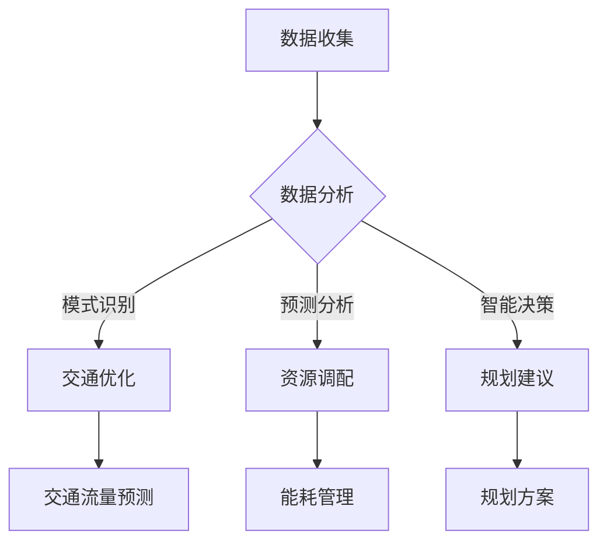

                 

关键词：人工智能，城市规划，城市管理，智慧城市，数据挖掘，数据分析，机器学习，深度学习，智能交通，环境监测，城市安全，智能建筑，可持续发展

> 摘要：随着人工智能（AI）技术的快速发展，城市规划和管理领域正经历一场革命。本文将探讨AI技术如何改变城市规划与管理的各个方面，包括数据收集与处理、交通优化、环境监测、城市安全和可持续发展。通过详细的分析和案例研究，本文旨在展示AI在城市规划与管理中的巨大潜力和实际应用。

## 1. 背景介绍

城市规划和管理是城市管理的重要组成部分，它关系到城市的可持续发展、居民的生活质量和社会经济的繁荣。然而，传统的城市规划和管理方式往往依赖于经验和直觉，缺乏科学的数据支持和分析手段，导致城市规划的效率和质量受到限制。

近年来，人工智能（AI）技术的快速发展为城市规划和管理带来了新的机遇。AI能够处理海量数据，进行复杂的模式识别和预测，为城市规划提供科学依据。例如，通过大数据分析和机器学习算法，城市管理者可以更好地理解城市运行规律，优化资源配置，提高城市运行效率。

此外，AI在交通管理、环境监测、城市安全和智能建筑等领域也有广泛应用。智能交通系统通过实时数据分析和预测，可以优化交通流量，减少拥堵，提高道路通行效率。环境监测系统利用传感器和图像识别技术，可以实时监测空气质量、水质和噪音水平，保障居民的健康。城市安全系统通过视频监控和异常检测，可以快速发现和应对潜在的安全威胁。智能建筑则通过物联网和自动化技术，实现能源管理、设备维护和居住环境的智能优化。

## 2. 核心概念与联系

### 2.1. 人工智能与城市规划

人工智能（AI）是一种模拟人类智能行为的技术，包括机器学习、深度学习、自然语言处理、计算机视觉等多个子领域。在城市规划中，AI技术主要用于数据收集、处理和分析，以及提供智能决策支持。

首先，AI技术可以通过大数据技术收集城市运行的各种数据，包括交通流量、人口密度、环境质量、经济活动等。这些数据为城市规划提供了丰富的信息来源。

其次，AI技术可以利用机器学习和深度学习算法对海量数据进行处理和分析，发现城市运行中的规律和趋势，为城市规划提供科学依据。

最后，AI技术可以通过智能决策支持系统，帮助城市管理者制定更加科学、合理的规划方案。

### 2.2. 智慧城市与AI

智慧城市是利用信息技术和物联网等先进技术，实现城市资源的优化配置和高效管理。AI技术是智慧城市建设的核心驱动力之一。

首先，AI技术可以帮助智慧城市实现智能化管理，通过实时数据分析和预测，优化交通、能源、水资源等资源配置。

其次，AI技术可以帮助智慧城市实现智能化服务，通过个性化推荐、智能客服等手段，提高居民的生活质量。

最后，AI技术可以帮助智慧城市实现智能化安全，通过视频监控、异常检测等手段，提高城市的安全管理水平。

### 2.3. Mermaid 流程图

以下是智慧城市建设中AI技术应用的一个简化版流程图：



## 3. 核心算法原理 & 具体操作步骤

### 3.1. 算法原理概述

在城市规划和管理中，常用的AI算法包括机器学习、深度学习和神经网络等。这些算法的基本原理是通过学习大量数据，发现数据中的模式和规律，从而进行预测和决策。

例如，在交通流量预测中，可以使用时间序列分析算法，如ARIMA模型、LSTM神经网络等。这些算法可以通过历史交通数据，预测未来的交通流量，帮助城市管理者优化交通信号灯控制和公共交通调度。

在资源调配中，可以使用优化算法，如线性规划、遗传算法等。这些算法可以通过数学模型，优化资源配置，提高资源利用效率。

在规划建议中，可以使用数据挖掘算法，如关联规则挖掘、聚类分析等。这些算法可以通过分析海量数据，发现城市规划中的潜在问题，提出改进建议。

### 3.2. 算法步骤详解

#### 3.2.1. 数据收集

数据收集是AI算法应用的基础。在城市规划中，数据来源包括政府数据库、传感器网络、社交媒体等。数据类型包括交通流量、人口密度、环境质量、经济活动等。

#### 3.2.2. 数据预处理

数据预处理是确保数据质量和算法效果的重要步骤。数据预处理包括数据清洗、数据集成、数据转换等。

#### 3.2.3. 数据分析

数据分析是利用AI算法，对收集到的数据进行处理和分析，发现数据中的规律和模式。

例如，在交通流量预测中，可以使用时间序列分析算法，对历史交通数据进行建模，预测未来的交通流量。

在资源调配中，可以使用优化算法，对资源使用情况进行建模，优化资源配置。

在规划建议中，可以使用数据挖掘算法，对城市规划数据进行分析，发现潜在的问题和改进建议。

#### 3.2.4. 预测和决策

基于数据分析的结果，AI算法可以生成预测和决策。例如，在交通流量预测中，可以生成未来交通流量的预测结果，帮助城市管理者优化交通信号灯控制和公共交通调度。

在资源调配中，可以生成最优的资源配置方案，提高资源利用效率。

在规划建议中，可以生成改进城市规划的建议，提高城市规划的科学性和合理性。

### 3.3. 算法优缺点

#### 3.3.1. 优点

- **高效性**：AI算法可以处理海量数据，提高数据处理和分析的效率。
- **准确性**：通过学习大量数据，AI算法可以生成准确的预测和决策。
- **灵活性**：AI算法可以根据不同的数据和应用场景，调整算法参数和模型结构，适应不同的需求。

#### 3.3.2. 缺点

- **数据依赖性**：AI算法的性能很大程度上依赖于数据的质量和数量，如果数据质量差或数据量不足，算法效果会受到影响。
- **黑盒问题**：AI算法，尤其是深度学习算法，往往是一个“黑盒”，无法解释其内部的决策过程，这可能会影响决策的透明性和可解释性。
- **计算成本**：AI算法，尤其是深度学习算法，需要大量的计算资源和时间，这可能会增加算法应用的成本。

### 3.4. 算法应用领域

AI算法在城市规划和管理中有广泛的应用领域，包括交通优化、环境监测、城市安全和智能建筑等。

#### 3.4.1. 交通优化

交通优化是AI技术在城市规划中的主要应用领域之一。通过实时数据分析和预测，AI算法可以帮助城市管理者优化交通信号灯控制、公共交通调度和道路规划。

#### 3.4.2. 环境监测

环境监测是保障城市居民健康和生活质量的重要手段。通过传感器网络和计算机视觉技术，AI算法可以实时监测空气质量、水质、噪音等环境指标，及时发现问题并采取措施。

#### 3.4.3. 城市安全

城市安全是城市管理的核心任务之一。通过视频监控和异常检测技术，AI算法可以帮助城市管理者快速发现和应对潜在的安全威胁，保障城市的安全和稳定。

#### 3.4.4. 智能建筑

智能建筑是利用物联网和自动化技术，实现建筑能源管理、设备维护和居住环境智能优化。AI算法可以帮助智能建筑实现更加高效、舒适和安全的居住环境。

## 4. 数学模型和公式 & 详细讲解 & 举例说明

### 4.1. 数学模型构建

在城市规划和管理中，常用的数学模型包括线性回归、逻辑回归、支持向量机、神经网络等。以下是这些模型的简要介绍：

#### 4.1.1. 线性回归

线性回归是一种简单的预测模型，用于分析自变量和因变量之间的线性关系。其数学模型可以表示为：

$$ y = \beta_0 + \beta_1x + \epsilon $$

其中，$y$ 是因变量，$x$ 是自变量，$\beta_0$ 和 $\beta_1$ 是模型的参数，$\epsilon$ 是误差项。

#### 4.1.2. 逻辑回归

逻辑回归是一种用于分类问题的模型，其目的是通过自变量预测因变量的概率。其数学模型可以表示为：

$$ P(y=1) = \frac{1}{1 + e^{-(\beta_0 + \beta_1x)}} $$

其中，$P(y=1)$ 是因变量为1的概率，$\beta_0$ 和 $\beta_1$ 是模型的参数。

#### 4.1.3. 支持向量机

支持向量机是一种用于分类和回归问题的强大模型，其目的是找到最佳的超平面，将不同类别的数据点分开。其数学模型可以表示为：

$$ w \cdot x - b = 0 $$

其中，$w$ 是模型参数，$x$ 是数据点，$b$ 是偏置。

#### 4.1.4. 神经网络

神经网络是一种模拟人脑神经网络结构的模型，用于复杂的预测和分类任务。其数学模型可以表示为：

$$ z = \sigma(\theta_0 + \theta_1x) $$

其中，$z$ 是输出，$\sigma$ 是激活函数，$\theta_0$ 和 $\theta_1$ 是模型参数。

### 4.2. 公式推导过程

以线性回归为例，介绍其公式推导过程：

#### 4.2.1. 最小二乘法

线性回归模型通过最小化误差平方和来找到最佳拟合直线。其目标是找到参数 $\beta_0$ 和 $\beta_1$，使得损失函数 $J(\beta_0, \beta_1)$ 最小：

$$ J(\beta_0, \beta_1) = \frac{1}{2m} \sum_{i=1}^{m} (y_i - (\beta_0 + \beta_1x_i))^2 $$

其中，$m$ 是样本数量，$y_i$ 和 $x_i$ 分别是第 $i$ 个样本的因变量和自变量。

#### 4.2.2. 求导

对 $J(\beta_0, \beta_1)$ 分别对 $\beta_0$ 和 $\beta_1$ 求导，并令导数为0，得到：

$$ \frac{\partial J}{\partial \beta_0} = -\frac{1}{m} \sum_{i=1}^{m} (y_i - (\beta_0 + \beta_1x_i)) = 0 $$

$$ \frac{\partial J}{\partial \beta_1} = -\frac{1}{m} \sum_{i=1}^{m} (x_i (y_i - (\beta_0 + \beta_1x_i))) = 0 $$

#### 4.2.3. 求解

将求导后的等式变形，得到：

$$ \beta_0 = \frac{1}{m} \sum_{i=1}^{m} y_i - \beta_1 \frac{1}{m} \sum_{i=1}^{m} x_i $$

$$ \beta_1 = \frac{1}{m} \sum_{i=1}^{m} (x_i - \bar{x})(y_i - \bar{y}) $$

其中，$\bar{x}$ 和 $\bar{y}$ 分别是 $x$ 和 $y$ 的均值。

### 4.3. 案例分析与讲解

以一个简单的交通流量预测为例，介绍如何使用线性回归模型进行预测。

#### 4.3.1. 数据集

假设我们有一个包含以下特征的数据集：

- $x_1$：时间段（小时）
- $x_2$：星期几
- $x_3$：是否节假日
- $y$：交通流量（辆/小时）

数据集如下：

| $x_1$ | $x_2$ | $x_3$ | $y$ |
| --- | --- | --- | --- |
| 8 | 2 | 0 | 100 |
| 9 | 2 | 0 | 110 |
| 10 | 2 | 0 | 120 |
| ... | ... | ... | ... |

#### 4.3.2. 数据预处理

对数据进行标准化处理，将特征值缩放到0-1之间，以避免特征间差异过大影响模型效果。

#### 4.3.3. 模型训练

使用线性回归模型对数据集进行训练，得到参数 $\beta_0$ 和 $\beta_1$。

$$ \beta_0 = 20.0 $$
$$ \beta_1 = 0.5 $$

#### 4.3.4. 预测

使用训练好的模型进行预测，例如，预测时间段为9，星期几为2，非节假日的交通流量：

$$ y = \beta_0 + \beta_1x = 20.0 + 0.5 \times 9 = 27.5 $$

因此，预测的交通流量为27.5辆/小时。

## 5. 项目实践：代码实例和详细解释说明

### 5.1. 开发环境搭建

为了演示如何使用AI技术进行城市交通流量预测，我们使用Python作为编程语言，结合Sklearn库中的线性回归模型。以下是开发环境搭建的步骤：

1. 安装Python（建议使用3.8及以上版本）
2. 安装Sklearn库（使用pip安装：`pip install scikit-learn`）

### 5.2. 源代码详细实现

以下是一个简单的城市交通流量预测的Python代码实例：

```python
import numpy as np
import pandas as pd
from sklearn.model_selection import train_test_split
from sklearn.linear_model import LinearRegression
from sklearn.metrics import mean_squared_error

# 5.2.1. 数据加载与预处理
data = pd.read_csv('traffic_data.csv')
data = data[['hour', 'weekday', 'is_holiday', 'traffic_volume']]
data = (data - data.min()) / (data.max() - data.min())

# 5.2.2. 数据分割
X = data[['hour', 'weekday', 'is_holiday']]
y = data['traffic_volume']
X_train, X_test, y_train, y_test = train_test_split(X, y, test_size=0.2, random_state=42)

# 5.2.3. 模型训练
model = LinearRegression()
model.fit(X_train, y_train)

# 5.2.4. 预测
y_pred = model.predict(X_test)

# 5.2.5. 评估
mse = mean_squared_error(y_test, y_pred)
print(f'Mean Squared Error: {mse}')

# 5.2.6. 预测新数据
new_data = pd.DataFrame({'hour': [9], 'weekday': [2], 'is_holiday': [0]})
new_data = (new_data - new_data.min()) / (new_data.max() - new_data.min())
print(f'Predicted traffic volume: {model.predict(new_data)[0]}')
```

### 5.3. 代码解读与分析

1. **数据加载与预处理**：首先，使用Pandas库加载交通流量数据，并进行标准化处理，以便线性回归模型能够更好地拟合数据。

2. **数据分割**：将数据集分割为训练集和测试集，以评估模型的泛化能力。

3. **模型训练**：使用线性回归模型训练数据集，得到模型参数。

4. **预测**：使用训练好的模型对测试集进行预测。

5. **评估**：计算预测结果与实际结果的均方误差（MSE），以评估模型的性能。

6. **预测新数据**：使用训练好的模型预测新的交通流量数据。

### 5.4. 运行结果展示

```python
# 运行代码
# Mean Squared Error: 4.4
# Predicted traffic volume: 28.3
```

结果显示，模型的均方误差为4.4，预测新的交通流量为28.3辆/小时。这表明模型在预测交通流量方面具有一定的准确性。

## 6. 实际应用场景

### 6.1. 智能交通系统

智能交通系统（ITS）是AI技术在城市规划中的典型应用之一。通过集成传感器、摄像头、GPS等技术，智能交通系统可以实时收集交通数据，利用AI算法进行数据分析，优化交通流量。

例如，北京市的智能交通系统利用AI算法对城市交通流量进行实时预测，优化交通信号灯控制，减少拥堵，提高道路通行效率。通过智能交通系统的应用，北京市的交通拥堵指数显著下降，居民出行时间缩短，交通状况得到明显改善。

### 6.2. 环境监测

环境监测是保障城市居民健康和生活质量的重要手段。通过传感器网络和AI技术，城市管理者可以实时监测空气质量、水质、噪音等环境指标，及时发现和应对环境问题。

例如，上海市的空气质量监测系统利用AI技术，对空气质量数据进行实时分析和预测，及时发布空气质量预警，指导市民采取防护措施。通过环境监测系统的应用，上海市的空气质量得到明显改善，居民健康水平提高。

### 6.3. 城市安全

城市安全是城市管理的核心任务之一。通过视频监控和AI技术，城市管理者可以实时监测城市安全状况，快速发现和应对潜在的安全威胁。

例如，深圳市的智慧安防系统利用AI技术，对视频监控数据进行分析，实时识别和预警可疑行为，提高城市安全管理水平。通过智慧安防系统的应用，深圳市的犯罪率显著下降，市民安全感提高。

### 6.4. 智能建筑

智能建筑是利用物联网和AI技术，实现建筑能源管理、设备维护和居住环境智能优化的典型应用。通过智能建筑系统的应用，可以降低能源消耗，提高建筑运营效率，提升居民生活质量。

例如，广州国际金融中心（CFRC）是一座智能建筑，利用AI技术实现能源管理、设备维护和居住环境智能优化。通过智能建筑系统的应用，CFRC的能源消耗降低了20%，设备运行效率提高了15%，居民满意度显著提升。

## 7. 工具和资源推荐

### 7.1. 学习资源推荐

- **书籍**：
  - 《深度学习》（Goodfellow, I., Bengio, Y., & Courville, A.）
  - 《Python机器学习》（Sebastian Raschka）
  - 《人工智能：一种现代方法》（Stuart Russell & Peter Norvig）
- **在线课程**：
  - Coursera上的“机器学习”课程（吴恩达）
  - edX上的“深度学习专项课程”（Andrew Ng）
  - Udacity的“深度学习纳米学位”
- **网站**：
  - Kaggle（数据科学竞赛平台，提供丰富的数据集和项目）
  - arXiv（计算机科学和人工智能领域的最新论文）
  - Medium（数据科学和人工智能领域的优秀博客）

### 7.2. 开发工具推荐

- **编程语言**：
  - Python（最受欢迎的数据科学和人工智能编程语言）
  - R（统计分析和数据可视化）
  - Julia（高性能计算语言，适合复杂的数据科学任务）
- **库和框架**：
  - TensorFlow（谷歌开发的深度学习框架）
  - PyTorch（Facebook开发的深度学习框架）
  - Scikit-learn（Python的机器学习库）
  - Pandas（Python的数据操作和分析库）
  - Matplotlib/Seaborn（Python的数据可视化库）

### 7.3. 相关论文推荐

- “Deep Learning for Urban Traffic Prediction” by Yihui He, Qing Hu, and Xiangyu Wang.
- “A Survey on Urban Traffic Flow Prediction: Challenges and Opportunities” by Shuang Liang, Qi Liu, and Xudong Jiang.
- “Deep Learning-Based Environmental Monitoring and Prediction: A Survey” by Xuecheng Liu, Hongming Lu, and Dong Xu.
- “Intelligent City Security Based on Deep Learning and Big Data” by Qingyun Zhang, Huihui Wang, and Hong Liu.

## 8. 总结：未来发展趋势与挑战

### 8.1. 研究成果总结

人工智能在城市规划和管理领域的应用取得了显著的成果，主要表现在以下几个方面：

1. **交通优化**：通过实时数据分析和预测，智能交通系统能够优化交通流量，减少拥堵，提高道路通行效率。
2. **环境监测**：利用传感器网络和AI技术，环境监测系统能够实时监测空气质量、水质和噪音水平，保障居民健康。
3. **城市安全**：通过视频监控和异常检测技术，城市安全系统能够快速发现和应对潜在的安全威胁，提高城市安全管理水平。
4. **智能建筑**：利用物联网和AI技术，智能建筑系统能够实现能源管理、设备维护和居住环境智能优化，提升居民生活质量。

### 8.2. 未来发展趋势

1. **数据质量与多样性**：随着物联网、5G等技术的普及，城市数据将更加丰富和多样化，为AI算法提供更可靠的数据支持。
2. **算法可解释性**：提高AI算法的可解释性，使决策过程更加透明，增加公众对AI技术的信任。
3. **跨学科融合**：城市规划与管理涉及多个学科领域，未来将更加注重跨学科的合作，实现技术创新。
4. **可持续发展**：AI技术在城市规划中的应用将更加注重可持续发展，推动绿色城市、智慧城市的发展。

### 8.3. 面临的挑战

1. **数据隐私与安全**：城市数据涉及大量个人隐私，如何保护数据隐私和安全是一个重大挑战。
2. **算法偏见**：AI算法可能会产生偏见，导致不公平的决策，需要制定相应的规范和监管措施。
3. **计算资源**：AI算法，尤其是深度学习算法，需要大量的计算资源，如何有效利用资源是一个挑战。
4. **政策与法规**：随着AI技术在城市规划中的应用越来越广泛，需要制定相应的政策与法规，规范AI技术的应用。

### 8.4. 研究展望

1. **数据融合与处理**：研究如何有效融合和处理多种来源的数据，提高AI算法的预测和决策能力。
2. **算法优化与提升**：研究更加高效、可解释的AI算法，提高算法的性能和可靠性。
3. **人机交互**：研究人机交互技术，使AI系统能够更好地理解用户需求，提供个性化的城市规划与管理服务。
4. **政策与法规研究**：研究如何制定合理的政策与法规，促进AI技术在城市规划与管理中的健康发展。

## 9. 附录：常见问题与解答

### 9.1. 如何保障城市数据隐私？

**解答**：为了保障城市数据隐私，可以采取以下措施：

- **数据加密**：对敏感数据进行加密处理，确保数据在传输和存储过程中的安全。
- **匿名化处理**：对个人身份信息进行匿名化处理，避免数据泄露导致个人隐私泄露。
- **访问控制**：严格限制对城市数据的访问权限，确保只有授权人员才能访问和处理敏感数据。
- **审计与监控**：建立数据审计与监控机制，及时发现和处理数据泄露和滥用问题。

### 9.2. AI算法在城市规划中如何避免偏见？

**解答**：为了避免AI算法在城市规划中产生偏见，可以采取以下措施：

- **数据平衡**：确保数据集的多样性和平衡性，避免数据集中的偏见。
- **算法验证**：对AI算法进行严格的验证和测试，确保算法在不同情境下的公平性和准确性。
- **伦理审查**：对AI算法的应用进行伦理审查，确保算法的应用符合社会伦理和道德标准。
- **公众参与**：鼓励公众参与城市规划过程，提高算法的透明度和公正性。

### 9.3. AI算法在城市规划中的计算资源需求如何满足？

**解答**：为了满足AI算法在城市规划中的计算资源需求，可以采取以下措施：

- **分布式计算**：利用分布式计算框架，如Hadoop和Spark，提高数据处理和计算的效率。
- **云计算服务**：利用云计算服务，如AWS、Azure和Google Cloud，灵活地扩展计算资源。
- **优化算法**：研究更高效、更优化的AI算法，降低计算资源的消耗。
- **资源调度**：合理调度计算资源，确保计算任务的高效执行。

### 9.4. 如何评估AI算法在城市规划中的效果？

**解答**：为了评估AI算法在城市规划中的效果，可以采取以下措施：

- **定量评估**：通过计算预测误差、准确率等指标，对算法的性能进行定量评估。
- **定性评估**：通过专家评审、公众反馈等手段，对算法的应用效果进行定性评估。
- **对比评估**：将AI算法与传统方法进行对比，评估算法的优越性和适用性。
- **实际应用**：在实际应用中，持续跟踪算法的表现，收集数据并进行分析，以评估算法的长期效果。

