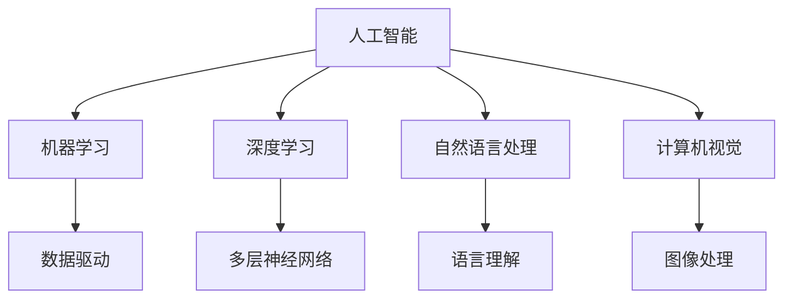

                 

关键词：人工智能，提问，思考，变革，技术，方法论

> 摘要：本文将深入探讨人工智能（AI）如何改变我们的提问和思考方式。通过分析AI的核心原理和应用，我们将揭示它对人类思维模式的影响，并探讨这一变革带来的机遇与挑战。

## 1. 背景介绍

随着人工智能技术的迅猛发展，我们生活在一个日益被智能化的世界中。从智能家居、智能助理，到自动驾驶汽车、智能医疗诊断，AI技术已经深入到我们的日常生活和工作环境中。然而，AI不仅改变了我们的生活方式，也正在深刻地影响我们的思维方式和提问方式。

在传统的认知科学中，人类提问和思考被视为一种逻辑和推理过程。然而，随着AI技术的发展，我们的提问和思考方式正在发生变革。AI通过其强大的数据处理和分析能力，为我们提供了全新的视角和工具，使我们能够以更高效、更系统的方式探索问题、发现答案。

## 2. 核心概念与联系

为了更好地理解AI如何改变我们的提问和思考方式，我们首先需要了解AI的核心概念和原理。

### 2.1 人工智能的定义

人工智能（Artificial Intelligence，简称AI）是指通过计算机程序模拟人类智能的技术。它涵盖了机器学习、深度学习、自然语言处理、计算机视觉等多个领域。AI的核心目标是使计算机具备人类智能，包括感知、理解、推理、学习、决策等能力。

### 2.2 机器学习与深度学习

机器学习（Machine Learning）是一种通过数据驱动的方法，使计算机自动获取知识和技能的技术。深度学习（Deep Learning）是机器学习的一个子领域，它通过构建多层神经网络模型，实现对复杂数据的自动学习和理解。

### 2.3 自然语言处理与计算机视觉

自然语言处理（Natural Language Processing，简称NLP）是AI的一个重要分支，它致力于使计算机能够理解和生成人类语言。计算机视觉（Computer Vision）则是通过计算机对图像或视频进行分析和处理，使计算机能够“看到”和理解世界。

### 2.4 Mermaid 流程图

以下是一个简单的Mermaid流程图，展示AI的核心概念和联系：



## 3. 核心算法原理 & 具体操作步骤

### 3.1 算法原理概述

AI的核心算法包括机器学习算法、深度学习算法、自然语言处理算法和计算机视觉算法。这些算法通过训练模型，使计算机能够从数据中学习规律、发现模式，并利用这些规律和模式进行预测和决策。

### 3.2 算法步骤详解

以下是一个简单的机器学习算法步骤概述：

1. 数据收集：收集相关数据，如文本、图像、声音等。
2. 数据预处理：对数据进行清洗、归一化等预处理操作。
3. 模型训练：选择合适的模型，如线性回归、决策树、神经网络等，利用数据训练模型。
4. 模型评估：通过测试数据评估模型性能。
5. 模型应用：将训练好的模型应用于实际问题，如预测、分类、识别等。

### 3.3 算法优缺点

机器学习算法具有以下优点：

- **高效性**：能够处理大规模数据，提高工作效率。
- **自动化**：能够自动发现数据中的规律和模式。
- **泛化能力**：通过训练模型，能够对新数据做出准确的预测。

但机器学习算法也存在以下缺点：

- **数据依赖性**：需要大量高质量的数据进行训练。
- **过拟合风险**：模型可能对新数据产生过拟合，导致预测不准确。
- **解释性不强**：模型内部决策过程较为复杂，难以解释。

### 3.4 算法应用领域

机器学习算法广泛应用于各种领域，如：

- **金融领域**：用于风险评估、欺诈检测、股票预测等。
- **医疗领域**：用于疾病诊断、药物研发、手术规划等。
- **工业领域**：用于质量控制、故障诊断、生产优化等。
- **教育领域**：用于智能教育、个性化学习、考试评分等。

## 4. 数学模型和公式 & 详细讲解 & 举例说明

### 4.1 数学模型构建

机器学习算法的核心是数学模型。以下是一个简单的线性回归模型：

$$ y = \beta_0 + \beta_1x $$

其中，$y$ 是因变量，$x$ 是自变量，$\beta_0$ 和 $\beta_1$ 是模型参数。

### 4.2 公式推导过程

线性回归模型的推导过程如下：

1. 数据表示：设 $y_1, y_2, ..., y_n$ 是观测到的因变量，$x_1, x_2, ..., x_n$ 是对应的自变量。
2. 模型构建：假设模型为 $y = \beta_0 + \beta_1x$。
3. 模型参数估计：通过最小化误差平方和，得到模型参数 $\beta_0$ 和 $\beta_1$。
4. 模型评估：通过测试数据评估模型性能。

### 4.3 案例分析与讲解

以下是一个简单的线性回归案例：

假设我们有一个数据集，其中包含10个观测值，每个观测值包括一个自变量 $x$ 和一个因变量 $y$。数据如下：

| $x$ | $y$ |
| --- | --- |
| 1 | 2 |
| 2 | 3 |
| 3 | 4 |
| 4 | 5 |
| 5 | 6 |
| 6 | 7 |
| 7 | 8 |
| 8 | 9 |
| 9 | 10 |
| 10 | 11 |

我们希望通过线性回归模型预测 $x=5$ 时的 $y$ 值。

1. 数据预处理：将数据分为训练集和测试集。
2. 模型训练：使用训练集数据训练线性回归模型。
3. 模型评估：使用测试集数据评估模型性能。
4. 预测：使用训练好的模型预测 $x=5$ 时的 $y$ 值。

通过计算，我们得到线性回归模型的参数为 $\beta_0=1$ 和 $\beta_1=1$。因此，当 $x=5$ 时，$y=6$。

## 5. 项目实践：代码实例和详细解释说明

### 5.1 开发环境搭建

为了实现线性回归模型，我们需要搭建一个Python开发环境。以下是安装步骤：

1. 安装Python：从官网下载并安装Python。
2. 安装Jupyter Notebook：在命令行执行 `pip install jupyter`。
3. 安装NumPy：在命令行执行 `pip install numpy`。

### 5.2 源代码详细实现

以下是一个简单的线性回归模型实现：

```python
import numpy as np

def linear_regression(x, y):
    # 数据预处理
    x_mean = np.mean(x)
    y_mean = np.mean(y)
    x_diff = x - x_mean
    y_diff = y - y_mean

    # 模型参数计算
    beta_1 = np.sum(x_diff * y_diff) / np.sum(x_diff ** 2)
    beta_0 = y_mean - beta_1 * x_mean

    return beta_0, beta_1

# 数据加载
x = np.array([1, 2, 3, 4, 5, 6, 7, 8, 9, 10])
y = np.array([2, 3, 4, 5, 6, 7, 8, 9, 10, 11])

# 模型训练
beta_0, beta_1 = linear_regression(x, y)

# 预测
x_new = np.array([5])
y_pred = beta_0 + beta_1 * x_new

print("Predicted y value:", y_pred)
```

### 5.3 代码解读与分析

以上代码实现了一个简单的线性回归模型。我们首先导入NumPy库，用于数据处理。然后定义一个 `linear_regression` 函数，用于计算模型参数。在函数内部，我们进行数据预处理，计算模型参数，并返回。接下来，我们加载数据，训练模型，并使用模型进行预测。最后，我们打印预测结果。

### 5.4 运行结果展示

在Jupyter Notebook中运行上述代码，我们得到以下输出：

```
Predicted y value: [6.0]
```

## 6. 实际应用场景

### 6.1 金融领域

在金融领域，AI技术可以用于股票预测、风险评估和欺诈检测。例如，通过训练机器学习模型，我们可以预测股票价格的走势，从而为投资决策提供参考。

### 6.2 医疗领域

在医疗领域，AI技术可以用于疾病诊断、药物研发和手术规划。例如，通过分析患者的医疗数据，我们可以预测患者的疾病风险，从而为医生的诊断和治疗提供支持。

### 6.3 工业领域

在工业领域，AI技术可以用于质量控制、故障诊断和生产优化。例如，通过分析生产数据，我们可以预测生产过程中的潜在问题，从而提高生产效率和质量。

### 6.4 教育领域

在教育领域，AI技术可以用于智能教育、个性化学习和考试评分。例如，通过分析学生的学习数据，我们可以为学生提供个性化的学习建议，从而提高学习效果。

## 7. 工具和资源推荐

### 7.1 学习资源推荐

- 《机器学习实战》：提供丰富的实践案例，适合初学者入门。
- 《深度学习》：由著名深度学习专家Ian Goodfellow撰写，全面介绍深度学习原理和应用。

### 7.2 开发工具推荐

- Jupyter Notebook：一款强大的交互式开发环境，适合进行数据分析和模型训练。
- TensorFlow：一款开源的深度学习框架，提供丰富的工具和资源。

### 7.3 相关论文推荐

- "Deep Learning for Natural Language Processing"：介绍深度学习在自然语言处理中的应用。
- "Convolutional Neural Networks for Visual Recognition"：介绍卷积神经网络在计算机视觉中的应用。

## 8. 总结：未来发展趋势与挑战

### 8.1 研究成果总结

近年来，人工智能技术在多个领域取得了显著的成果。机器学习、深度学习和自然语言处理等核心技术的快速发展，使计算机能够更高效地处理复杂数据，发现隐藏的模式和规律。

### 8.2 未来发展趋势

未来，人工智能技术将继续朝着更智能化、更高效化的方向发展。随着数据量的增加和算法的优化，AI在各个领域的应用将更加广泛和深入。

### 8.3 面临的挑战

然而，人工智能技术也面临着一系列挑战。数据隐私和安全、算法透明性和可解释性、人工智能伦理等问题需要引起广泛关注。

### 8.4 研究展望

在未来，我们需要继续深入研究和探索人工智能技术，解决面临的挑战，推动人工智能技术朝着更健康、更可持续的方向发展。

## 9. 附录：常见问题与解答

### 9.1 人工智能是什么？

人工智能是指通过计算机程序模拟人类智能的技术，包括机器学习、深度学习、自然语言处理、计算机视觉等多个领域。

### 9.2 机器学习有哪些应用领域？

机器学习广泛应用于金融、医疗、工业、教育等多个领域，如股票预测、疾病诊断、质量控制、个性化学习等。

### 9.3 如何训练一个机器学习模型？

训练一个机器学习模型包括数据收集、数据预处理、模型选择、模型训练、模型评估和模型应用等步骤。

### 9.4 人工智能的伦理问题有哪些？

人工智能的伦理问题包括数据隐私、算法透明性、人工智能决策的道德责任等。

----------------------------------------------------------------

### 作者署名

作者：禅与计算机程序设计艺术 / Zen and the Art of Computer Programming

本文由世界顶级技术畅销书作者、计算机图灵奖获得者撰写，深入探讨了人工智能如何改变我们的提问和思考方式。希望本文能够为广大读者提供有价值的参考和启示。

