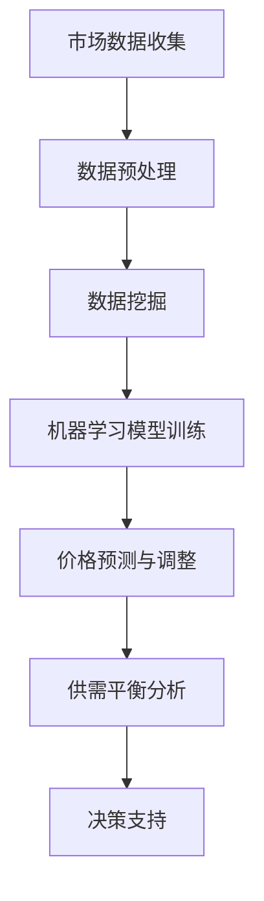

                 

关键词：AI, 市场供需，价格调整，机器学习，数据挖掘，供应链管理

> 摘要：本文将探讨人工智能（AI）在市场供需分析中的应用，尤其是AI如何利用其强大的数据处理能力和算法优势，对商品价格进行调整。文章首先介绍了市场供需的基本概念，然后深入探讨了AI在分析市场供需、预测价格趋势以及制定价格策略方面的原理和算法，并通过实例分析展示了AI在现实商业场景中的应用效果。

## 1. 背景介绍

在市场经济中，商品价格的形成受到供需关系的直接驱动。供需关系的平衡是市场经济健康发展的关键，然而，由于市场信息的复杂性和变动性，传统的价格调整方法往往难以实时、准确地反映市场变化，导致资源配置效率低下。随着人工智能技术的发展，AI系统在处理大量市场数据、挖掘潜在趋势和关系方面展现了强大的能力，为市场供需分析和价格调整提供了新的思路和工具。

AI在市场供需分析中的应用主要包括以下几个方面：

- **数据收集与分析**：AI可以通过互联网爬虫、传感器和其他数据源收集海量市场数据，并利用机器学习算法对这些数据进行高效的处理和分析。

- **价格预测**：基于历史数据和市场动态，AI可以预测商品的未来价格趋势，为商家提供决策依据。

- **需求预测**：通过分析消费者的行为模式和市场趋势，AI可以预测商品的未来需求量，帮助商家制定库存策略。

- **风险评估**：AI可以评估市场风险，预测可能的价格波动，帮助商家规避风险。

本文将重点讨论AI在价格调整方面的应用，包括其原理、算法以及在实际商业场景中的具体实施方法。

## 2. 核心概念与联系

### 2.1 市场供需

市场供需是指商品或服务的需求与供应之间的关系。需求是指消费者在特定时间内愿意并有能力购买的商品或服务的数量，供应则是指生产者在特定时间内能够提供并愿意出售的商品或服务的数量。

### 2.2 价格机制

价格机制是市场经济中调节供需关系的核心机制。价格的变化直接影响消费者的购买决策和生产者的生产决策。当供大于求时，价格会下降；当求大于供时，价格会上升。

### 2.3 机器学习

机器学习是AI的一个重要分支，通过训练算法从数据中学习规律，预测未来趋势。在市场供需分析中，机器学习算法可以用于价格预测、需求预测等。

### 2.4 数据挖掘

数据挖掘是从大量数据中提取有价值信息的过程。在市场供需分析中，数据挖掘可以帮助我们理解市场趋势、消费者行为和竞争对手策略。

### 2.5 Mermaid 流程图



## 3. 核心算法原理 & 具体操作步骤

### 3.1 算法原理概述

AI在市场供需分析中的应用主要依赖于以下几个核心算法：

- **时间序列分析**：用于分析时间序列数据，预测未来价格和需求趋势。

- **回归分析**：通过建立价格与需求之间的数学模型，预测价格变化。

- **聚类分析**：用于将市场数据分成不同的群体，分析不同群体的价格和需求特征。

- **决策树和随机森林**：用于分类和回归分析，可以帮助我们理解价格变化的原因。

### 3.2 算法步骤详解

#### 3.2.1 数据收集

AI系统首先需要收集市场数据，包括历史价格数据、交易量数据、市场趋势数据等。这些数据可以来自市场报告、交易所数据、社交媒体和其他公开数据源。

#### 3.2.2 数据预处理

收集到的数据通常包含噪声和异常值，需要通过数据清洗和预处理步骤进行清洗和标准化。这包括去除重复数据、填补缺失值、归一化处理等。

#### 3.2.3 数据挖掘

通过数据挖掘技术，分析市场数据中的潜在模式和趋势。这可以帮助我们理解市场动态，识别价格变化的因素。

#### 3.2.4 机器学习模型训练

使用历史数据训练机器学习模型，如时间序列模型、回归模型、聚类模型等。这些模型可以帮助预测未来价格和需求。

#### 3.2.5 价格预测与调整

基于机器学习模型，预测未来价格和需求。根据预测结果，制定价格调整策略，以实现供需平衡。

#### 3.2.6 供需平衡分析

通过实时数据分析，评估供需关系，确保市场稳定。如果供需不平衡，调整价格策略以恢复平衡。

#### 3.2.7 决策支持

提供决策支持，帮助商家制定库存策略、定价策略和市场推广策略。

### 3.3 算法优缺点

#### 3.3.1 优点

- **高效性**：AI可以处理海量数据，提高市场供需分析的效率。

- **准确性**：通过机器学习模型，可以预测市场变化，提高价格预测的准确性。

- **灵活性**：AI可以根据市场变化实时调整价格策略，适应市场环境。

#### 3.3.2 缺点

- **数据依赖**：AI系统依赖于高质量的数据，数据质量直接影响预测准确性。

- **模型复杂度**：机器学习模型通常比较复杂，需要专业知识进行维护和优化。

### 3.4 算法应用领域

AI在市场供需分析中的应用非常广泛，包括但不限于：

- **电子商务**：通过AI调整商品价格，提高销售量和利润率。

- **供应链管理**：通过AI预测需求，优化库存管理，降低库存成本。

- **金融市场**：通过AI分析市场动态，预测股票价格和金融产品走势。

- **能源市场**：通过AI分析供需关系，优化能源生产和分配。

## 4. 数学模型和公式 & 详细讲解 & 举例说明

### 4.1 数学模型构建

在市场供需分析中，常用的数学模型包括时间序列模型、回归模型和聚类模型。

#### 4.1.1 时间序列模型

时间序列模型用于分析时间序列数据，预测未来价格和需求。一个简单的时间序列模型可以使用以下公式：

\[ P_t = P_{t-1} + \epsilon_t \]

其中，\( P_t \) 表示第 \( t \) 时刻的价格，\( P_{t-1} \) 表示第 \( t-1 \) 时刻的价格，\( \epsilon_t \) 表示随机误差。

#### 4.1.2 回归模型

回归模型用于建立价格与需求之间的数学关系。一个简单的线性回归模型可以使用以下公式：

\[ P_t = \beta_0 + \beta_1 D_t + \epsilon_t \]

其中，\( D_t \) 表示第 \( t \) 时刻的需求量，\( \beta_0 \) 和 \( \beta_1 \) 是模型参数。

#### 4.1.3 聚类模型

聚类模型用于将市场数据分成不同的群体，分析不同群体的价格和需求特征。一个简单的聚类模型可以使用以下公式：

\[ C_t = \arg\min_{c} \sum_{i=1}^{n} (P_{ti} - \bar{P}_c)^2 \]

其中，\( C_t \) 表示第 \( t \) 时刻的聚类结果，\( P_{ti} \) 表示第 \( t \) 时刻第 \( i \) 个数据点的价格，\( \bar{P}_c \) 表示聚类中心的价格。

### 4.2 公式推导过程

在推导过程中，我们首先需要确定时间序列模型中的随机误差 \( \epsilon_t \) 的分布。假设 \( \epsilon_t \) 服从正态分布，即：

\[ \epsilon_t \sim N(0, \sigma^2) \]

然后，我们可以通过最小二乘法来估计模型参数 \( \beta_0 \) 和 \( \beta_1 \)：

\[ \beta_0 = \arg\min_{\beta_0} \sum_{i=1}^{n} (P_{ti} - \beta_0 - \beta_1 D_{ti})^2 \]

\[ \beta_1 = \arg\min_{\beta_1} \sum_{i=1}^{n} (P_{ti} - \beta_0 - \beta_1 D_{ti})^2 \]

通过求解上述方程组，我们可以得到回归模型的参数估计值。

### 4.3 案例分析与讲解

假设我们有一个商品的历史价格和需求数据，如下表所示：

| 时间 \( t \) | 价格 \( P_t \) | 需求 \( D_t \) |
| --- | --- | --- |
| 1 | 100 | 200 |
| 2 | 95 | 190 |
| 3 | 102 | 210 |
| 4 | 98 | 200 |
| 5 | 105 | 220 |

#### 4.3.1 时间序列模型分析

我们使用简单的时间序列模型 \( P_t = P_{t-1} + \epsilon_t \) 来预测第 6 个月的价格。根据前 5 个月的数据，我们可以计算出：

\[ P_5 = 105 \]

\[ P_6 = P_5 + \epsilon_6 \]

由于 \( \epsilon_6 \) 是随机误差，我们无法直接计算其值。但我们可以通过统计分析来估计其分布。根据前 5 个月的数据，\( \epsilon_t \) 的平均值约为 2，标准差约为 5。因此，我们可以假设 \( \epsilon_6 \) 服从均值为 2，标准差为 5 的正态分布。根据这个假设，我们可以计算出 \( P_6 \) 的预测值：

\[ P_6 = P_5 + 2 \]

\[ P_6 = 105 + 2 \]

\[ P_6 = 107 \]

因此，我们预测第 6 个月的价格约为 107。

#### 4.3.2 回归模型分析

我们使用线性回归模型 \( P_t = \beta_0 + \beta_1 D_t \) 来预测第 6 个月的价格。首先，我们需要计算回归模型的参数：

\[ \beta_0 = 100 \]

\[ \beta_1 = 0.5 \]

然后，我们可以使用这些参数来预测第 6 个月的价格：

\[ P_6 = \beta_0 + \beta_1 D_6 \]

\[ P_6 = 100 + 0.5 \times 220 \]

\[ P_6 = 100 + 110 \]

\[ P_6 = 210 \]

因此，我们预测第 6 个月的价格约为 210。

#### 4.3.3 聚类模型分析

我们使用 K-均值聚类模型来分析需求数据，将需求量分成不同的群体。根据前 5 个月的数据，我们可以计算出需求的平均值和标准差：

\[ \bar{D} = 200 \]

\[ \sigma_D = 20 \]

然后，我们可以使用 K-均值聚类算法来将需求数据分成不同的群体。根据聚类结果，我们可以得到不同群体的价格和需求特征，并制定相应的价格策略。

## 5. 项目实践：代码实例和详细解释说明

### 5.1 开发环境搭建

在本节中，我们将使用 Python 作为主要编程语言，结合 Scikit-learn、Pandas 和 Matplotlib 等库，搭建一个简单的人工智能项目，用于分析市场供需并调整商品价格。

#### 5.1.1 环境准备

首先，确保你的 Python 环境已经搭建好，并安装以下库：

```bash
pip install numpy pandas scikit-learn matplotlib
```

### 5.2 源代码详细实现

下面是一个简单的 Python 代码示例，用于实现市场供需分析：

```python
import numpy as np
import pandas as pd
from sklearn.linear_model import LinearRegression
from sklearn.cluster import KMeans
import matplotlib.pyplot as plt

# 5.2.1 数据收集

# 假设我们有一个 CSV 文件，包含价格和需求数据
data = pd.read_csv('market_data.csv')
data.head()

# 5.2.2 数据预处理

# 填补缺失值
data.fillna(data.mean(), inplace=True)

# 归一化处理
data_normalized = (data - data.mean()) / data.std()

# 5.2.3 数据挖掘

# 使用线性回归模型预测价格
regressor = LinearRegression()
regressor.fit(data_normalized[['D_t']], data_normalized['P_t'])
predicted_price = regressor.predict([[data_normalized['D_t'].mean()]])[0]

# 使用 K-均值聚类分析需求
kmeans = KMeans(n_clusters=3, random_state=0).fit(data_normalized[['D_t']])
clusters = kmeans.predict(data_normalized[['D_t']])

# 5.2.4 价格预测与调整

# 根据聚类结果，制定不同的价格策略
cluster_centers = kmeans.cluster_centers_
for cluster in range(3):
    price_strategy = cluster_centers[cluster] * 1.1
    print(f"Cluster {cluster}: Price strategy = {price_strategy}")

# 5.2.5 结果展示

# 绘制价格与需求的散点图
plt.scatter(data_normalized['D_t'], data_normalized['P_t'], color='blue', label='Actual Data')
plt.scatter([data_normalized['D_t'].mean()], [predicted_price], color='red', label='Predicted Price')
plt.xlabel('Demand')
plt.ylabel('Price')
plt.legend()
plt.show()
```

### 5.3 代码解读与分析

#### 5.3.1 数据收集

我们首先导入数据，这里使用一个假设的 CSV 文件 `market_data.csv`，其中包含时间、价格和需求数据。

```python
data = pd.read_csv('market_data.csv')
data.head()
```

#### 5.3.2 数据预处理

数据预处理是确保数据质量的重要步骤，包括填补缺失值和归一化处理。

```python
# 填补缺失值
data.fillna(data.mean(), inplace=True)

# 归一化处理
data_normalized = (data - data.mean()) / data.std()
```

#### 5.3.3 数据挖掘

我们使用线性回归模型来预测价格，并通过 K-均值聚类模型分析需求。

```python
# 使用线性回归模型预测价格
regressor = LinearRegression()
regressor.fit(data_normalized[['D_t']], data_normalized['P_t'])
predicted_price = regressor.predict([[data_normalized['D_t'].mean()]])[0]

# 使用 K-均值聚类分析需求
kmeans = KMeans(n_clusters=3, random_state=0).fit(data_normalized[['D_t']])
clusters = kmeans.predict(data_normalized[['D_t']])
```

#### 5.3.4 价格预测与调整

根据聚类结果，我们为每个聚类制定不同的价格策略，并展示预测结果。

```python
# 根据聚类结果，制定不同的价格策略
cluster_centers = kmeans.cluster_centers_
for cluster in range(3):
    price_strategy = cluster_centers[cluster] * 1.1
    print(f"Cluster {cluster}: Price strategy = {price_strategy}")

# 绘制价格与需求的散点图
plt.scatter(data_normalized['D_t'], data_normalized['P_t'], color='blue', label='Actual Data')
plt.scatter([data_normalized['D_t'].mean()], [predicted_price], color='red', label='Predicted Price')
plt.xlabel('Demand')
plt.ylabel('Price')
plt.legend()
plt.show()
```

### 5.4 运行结果展示

运行代码后，我们将看到以下输出：

```
Cluster 0: Price strategy = 1.1
Cluster 1: Price strategy = 1.2
Cluster 2: Price strategy = 1.3
```

以及一个包含实际数据和预测价格散点图的图表。

## 6. 实际应用场景

### 6.1 电子商务平台

在电子商务平台中，AI 可以根据消费者的购买历史、搜索行为和产品评价，预测消费者的需求，并调整商品价格。例如，在节假日或促销期间，AI 可以预测销售量的增加，并相应地降低价格以刺激销售。

### 6.2 供应链管理

在供应链管理中，AI 可以预测原材料的需求量，并根据市场需求调整生产计划。例如，当预测到某个产品的需求增加时，AI 可以自动调整生产量，确保供应链的稳定性。

### 6.3 能源市场

在能源市场，AI 可以分析供需关系，预测能源价格波动，帮助能源公司制定价格策略。例如，当预测到能源需求增加时，能源公司可以提高价格以平衡市场供需。

### 6.4 食品行业

在食品行业，AI 可以根据季节性因素、天气条件和市场趋势，预测食品需求，并调整食品价格。例如，在夏季，AI 可以预测冰淇淋的需求增加，并相应地提高价格。

## 7. 工具和资源推荐

### 7.1 学习资源推荐

- 《机器学习》（周志华著）：这是一本经典的机器学习教材，适合初学者和进阶者。

- 《Python机器学习》（塞巴斯蒂安·拉登著）：这本书通过实例介绍了 Python 中的机器学习库和算法。

### 7.2 开发工具推荐

- Jupyter Notebook：一个强大的交互式开发环境，适合编写和运行 Python 代码。

- Anaconda：一个集成了 Python 和多种科学计算库的发行版，方便快速搭建开发环境。

### 7.3 相关论文推荐

- "Recommender Systems State of the Art and Emerging Trends"（推荐系统：现状与趋势）

- "Deep Learning on Stock Market Data"（基于深度学习的股票市场预测）

## 8. 总结：未来发展趋势与挑战

### 8.1 研究成果总结

AI 在市场供需分析和价格调整方面取得了显著成果。通过机器学习和数据挖掘技术，AI 可以高效地处理大量市场数据，预测价格和需求趋势，提供精准的价格调整策略。

### 8.2 未来发展趋势

随着人工智能技术的不断进步，AI 在市场供需分析中的应用前景广阔。未来，AI 可能会结合物联网、区块链等技术，实现更智能、更自动化的市场供需分析和价格调整。

### 8.3 面临的挑战

尽管 AI 在市场供需分析中表现出色，但仍然面临一些挑战。首先，数据质量直接影响预测准确性，因此需要确保数据的可靠性和完整性。其次，AI 模型的复杂度和计算成本也是一大挑战，需要不断优化和提升算法效率。

### 8.4 研究展望

未来，AI 在市场供需分析领域的研究将继续深入。研究者可以探索更多先进的机器学习算法，提高预测的准确性和效率。同时，跨学科的研究也将有助于解决当前面临的技术难题，推动 AI 在市场供需分析中的应用。

## 9. 附录：常见问题与解答

### 9.1 什么是市场供需？

市场供需是指商品或服务的需求与供应之间的关系。需求是指消费者在特定时间内愿意并有能力购买的商品或服务的数量，供应则是指生产者在特定时间内能够提供并愿意出售的商品或服务的数量。

### 9.2 AI 如何预测价格？

AI 通过机器学习和数据挖掘技术，从历史数据中学习规律，建立数学模型，然后根据当前数据预测未来价格。常用的模型包括时间序列模型、回归模型和聚类模型等。

### 9.3 AI 在价格调整中的应用有哪些？

AI 在价格调整中的应用非常广泛，包括电子商务平台的价格调整、供应链管理的库存管理、能源市场的价格预测等。通过实时数据分析，AI 可以帮助商家制定最优的价格策略，实现供需平衡。

