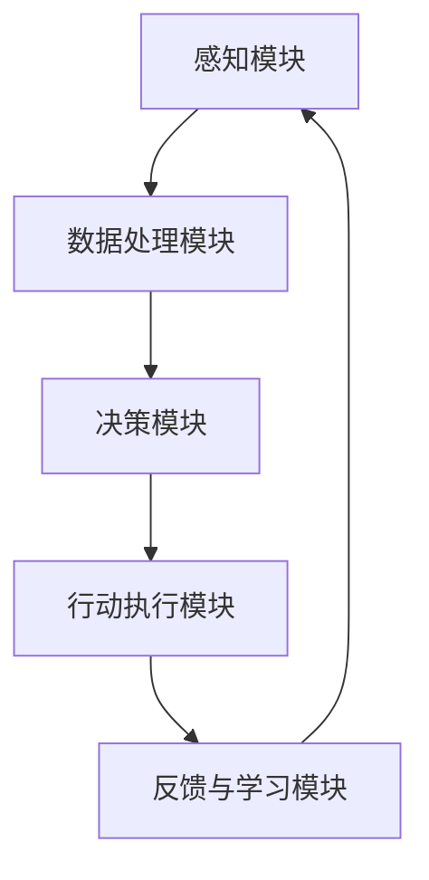

                 

关键词：AI宠物，市场前景，技术发展，用户体验，产业趋势

> 摘要：本文将深入探讨AI宠物市场的现状与未来前景。我们将分析AI宠物技术的核心概念、算法原理、数学模型，并通过实际项目实践来展示技术实现。同时，文章还将讨论AI宠物在实际应用场景中的表现，并展望未来的发展。

## 1. 背景介绍

随着人工智能技术的迅猛发展，AI宠物作为一个新兴领域逐渐引起了广泛关注。AI宠物不仅仅是传统宠物的电子版，它们是集成了先进感知、认知和学习能力的智能实体。通过传感器、摄像头、GPS等设备，AI宠物可以实时获取环境信息，并根据这些信息进行自主决策。

### 当前市场状况

据市场调研数据显示，全球AI宠物市场规模在近几年呈现快速增长趋势。尤其是智能穿戴设备、互动玩具和健康监测装置等方面，市场需求不断扩大。此外，随着5G网络的普及和物联网技术的发展，AI宠物与用户之间的互动体验也日益丰富。

### 技术发展驱动因素

AI宠物的快速发展得益于以下几个方面：

1. **传感器技术**：高精度传感器使AI宠物能够更准确地感知周围环境。
2. **机器学习算法**：深度学习、强化学习等算法的进步，使得AI宠物能够更好地理解和适应宠物的行为模式。
3. **云计算与大数据**：强大的计算能力与海量数据资源为AI宠物的智能化提供了有力支持。
4. **用户需求**：随着人们对宠物的依赖和情感投入增加，对智能化、个性化宠物服务的需求日益增长。

## 2. 核心概念与联系

### 核心概念

AI宠物技术涉及多个核心概念，包括但不限于：

1. **感知**：通过传感器收集环境数据。
2. **认知**：理解感知数据，做出判断和决策。
3. **学习**：从经验中学习，优化自身行为。
4. **交互**：与用户和宠物进行有效沟通。

### Mermaid 流程图

下面是一个简化的Mermaid流程图，展示AI宠物的基本架构：



在这个流程图中，感知模块通过传感器收集数据，数据处理模块对这些数据进行分析和处理，决策模块基于处理结果进行决策，行动执行模块执行具体的操作，最后通过反馈与学习模块不断优化AI宠物的行为。

## 3. 核心算法原理 & 具体操作步骤

### 3.1 算法原理概述

AI宠物的核心算法主要基于机器学习和深度学习技术。以下是几个关键的算法原理：

1. **卷积神经网络（CNN）**：用于图像识别和物体检测。
2. **循环神经网络（RNN）**：用于序列数据建模和时间序列预测。
3. **生成对抗网络（GAN）**：用于生成逼真的宠物图像。
4. **强化学习（RL）**：用于决策制定和行为优化。

### 3.2 算法步骤详解

1. **感知阶段**：
    - 通过摄像头和传感器收集图像和声音数据。
    - 应用CNN进行图像识别，提取关键特征。
    - 应用RNN处理时间序列数据，如宠物的运动轨迹。

2. **数据处理阶段**：
    - 特征提取：使用特征提取算法（如SIFT、HOG）。
    - 特征选择：基于相关性、重要性等指标进行筛选。
    - 数据归一化：将不同维度的数据进行标准化处理。

3. **决策阶段**：
    - 应用强化学习算法，根据环境状态和当前行为，选择最佳动作。
    - 采用Q-learning或深度Q网络（DQN）等算法进行训练。

4. **行动执行阶段**：
    - 根据决策结果，通过电机、扬声器等执行具体操作。
    - 调整宠物的动作以适应环境变化。

5. **反馈与学习阶段**：
    - 收集行动后的反馈数据。
    - 利用GAN生成新数据，增强模型的泛化能力。
    - 通过反向传播算法更新网络权重，优化模型性能。

### 3.3 算法优缺点

**优点**：
- **高效性**：机器学习算法能够快速处理大量数据。
- **自适应性强**：AI宠物能够根据环境变化和学习经验进行自我调整。
- **多样化应用**：算法可广泛应用于图像识别、行为预测、健康监测等领域。

**缺点**：
- **计算资源需求高**：训练深度学习模型需要大量计算资源和时间。
- **数据依赖性强**：算法性能依赖于数据质量和数量。
- **解释性较差**：深度学习模型通常较难解释其决策过程。

### 3.4 算法应用领域

- **宠物行为分析**：通过分析宠物的行为模式，预测宠物的情绪和健康状态。
- **健康监测**：实时监测宠物的生理指标，提供健康建议。
- **互动娱乐**：为宠物提供智能化的互动体验，增强宠物与主人之间的情感联系。

## 4. 数学模型和公式 & 详细讲解 & 举例说明

### 4.1 数学模型构建

在AI宠物技术中，常见的数学模型包括：

1. **卷积神经网络（CNN）**：
    - 激活函数：\( f(x) = \text{ReLU}(x) \)
    - 卷积层：\( \text{Conv}(I) = \sigma(\text{W} \cdot I + b) \)
    - 池化层：\( P(x) = \max(x) \)

2. **循环神经网络（RNN）**：
    - 隐藏状态更新：\( h_t = \text{sigmoid}(W_h \cdot [h_{t-1}, x_t] + b_h) \)
    - 输出层：\( o_t = W_o \cdot h_t + b_o \)

3. **生成对抗网络（GAN）**：
    - 生成器：\( G(z) = \mu(z) + \sigma(z) \odot \text{tanh}(\text{W}_g \cdot z + b_g) \)
    - 判别器：\( D(x) = \text{sigmoid}(\text{W}_d \cdot x + b_d) \)

### 4.2 公式推导过程

以卷积神经网络（CNN）为例，其基本公式推导如下：

1. **卷积操作**：
    - 输入：\( I \in \mathbb{R}^{m \times n} \)
    - 卷积核：\( W \in \mathbb{R}^{k \times l} \)
    - 步长：\( s \)
    - 输出：\( O \in \mathbb{R}^{(m-k+1) \times (n-l+1)} \)

    \[
    O_{ij} = \sum_{p=1}^{k} \sum_{q=1}^{l} W_{pq} \cdot I_{(i+p-1)(q+j-1)}
    \]

2. **激活函数**：
    - \(\text{ReLU}(x) = \max(0, x)\)

3. **池化操作**：
    - 最大池化：
    \[
    P(x) = \max(x)
    \]

### 4.3 案例分析与讲解

**案例**：使用CNN进行宠物图像分类。

**步骤**：
1. **数据准备**：收集并标注宠物图像，分为训练集和测试集。
2. **模型构建**：定义CNN模型结构，包括卷积层、池化层和全连接层。
3. **模型训练**：使用训练集数据训练模型，调整模型参数。
4. **模型评估**：使用测试集评估模型性能，调整模型结构或参数。

**代码示例**（Python，使用TensorFlow框架）：

```python
import tensorflow as tf
from tensorflow.keras.models import Sequential
from tensorflow.keras.layers import Conv2D, MaxPooling2D, Flatten, Dense

# 构建模型
model = Sequential([
    Conv2D(filters=32, kernel_size=(3, 3), activation='relu', input_shape=(128, 128, 3)),
    MaxPooling2D(pool_size=(2, 2)),
    Flatten(),
    Dense(units=64, activation='relu'),
    Dense(units=10, activation='softmax')
])

# 编译模型
model.compile(optimizer='adam', loss='categorical_crossentropy', metrics=['accuracy'])

# 训练模型
model.fit(x_train, y_train, epochs=10, batch_size=32, validation_data=(x_test, y_test))

# 评估模型
model.evaluate(x_test, y_test)
```

## 5. 项目实践：代码实例和详细解释说明

### 5.1 开发环境搭建

在开始项目实践之前，需要搭建合适的开发环境。以下是搭建开发环境的基本步骤：

1. **安装Python**：确保安装了Python 3.6或更高版本。
2. **安装TensorFlow**：通过pip安装TensorFlow：
    ```shell
    pip install tensorflow
    ```

3. **安装Keras**：Keras是TensorFlow的高级API，可以简化模型构建：
    ```shell
    pip install keras
    ```

4. **配置Jupyter Notebook**：配置Jupyter Notebook用于交互式编程。

### 5.2 源代码详细实现

以下是一个简单的AI宠物图像分类项目的源代码示例：

```python
import numpy as np
import tensorflow as tf
from tensorflow.keras.preprocessing.image import ImageDataGenerator
from tensorflow.keras.models import Sequential
from tensorflow.keras.layers import Conv2D, MaxPooling2D, Flatten, Dense, Activation

# 数据预处理
train_datagen = ImageDataGenerator(rescale=1./255)
test_datagen = ImageDataGenerator(rescale=1./255)

train_generator = train_datagen.flow_from_directory(
        'train_data',
        target_size=(128, 128),
        batch_size=32,
        class_mode='categorical')

validation_generator = test_datagen.flow_from_directory(
        'validation_data',
        target_size=(128, 128),
        batch_size=32,
        class_mode='categorical')

# 构建模型
model = Sequential([
    Conv2D(32, (3, 3), activation='relu', input_shape=(128, 128, 3)),
    MaxPooling2D((2, 2)),
    Conv2D(64, (3, 3), activation='relu'),
    MaxPooling2D((2, 2)),
    Conv2D(128, (3, 3), activation='relu'),
    MaxPooling2D((2, 2)),
    Flatten(),
    Dense(512, activation='relu'),
    Dense(10, activation='softmax')
])

# 编译模型
model.compile(optimizer='adam',
              loss='categorical_crossentropy',
              metrics=['accuracy'])

# 训练模型
model.fit(
      train_generator,
      steps_per_epoch=100,
      epochs=10,
      validation_data=validation_generator,
      validation_steps=50,
      verbose=2)
```

### 5.3 代码解读与分析

上述代码首先对图像数据进行了预处理，通过ImageDataGenerator将图像数据缩放为128x128的分辨率，并对数据进行了归一化处理。接着，使用Keras Sequential模型定义了一个简单的卷积神经网络，包括卷积层、池化层和全连接层。最后，模型使用训练数据进行了训练，并使用验证数据进行了性能评估。

### 5.4 运行结果展示

在完成模型训练后，可以通过以下代码来评估模型性能：

```python
# 评估模型
test_loss, test_acc = model.evaluate(validation_generator)
print('Test accuracy:', test_acc)
```

运行结果将显示模型在验证集上的准确率。通过调整模型的架构和训练参数，可以进一步提高模型的性能。

## 6. 实际应用场景

### 6.1 宠物行为监测

AI宠物可以通过摄像头和传感器实时监测宠物的行为，包括活动量、休息时间和情绪变化。这些数据可以为宠物主人提供重要的信息，帮助他们更好地照顾宠物。

### 6.2 健康管理

AI宠物可以定期监测宠物的生理指标，如体温、心率、呼吸频率等。通过这些数据，宠物主人可以及时发现宠物的异常情况，并采取相应的措施。

### 6.3 互动娱乐

AI宠物可以通过智能玩具和互动应用与宠物进行互动，提供丰富的娱乐体验。这不仅有助于缓解宠物的孤独感，还可以增强宠物与主人之间的情感联系。

### 6.4 未来应用前景

随着技术的不断进步，AI宠物将在更多领域发挥作用。例如，智能导盲犬、辅助治疗宠物等。此外，随着5G和物联网技术的普及，AI宠物与用户之间的互动体验将更加智能化和个性化。

## 7. 工具和资源推荐

### 7.1 学习资源推荐

1. **《深度学习》（Goodfellow, Bengio, Courville）**：一本经典的深度学习教材。
2. **《Python机器学习》（Sebastian Raschka）**：详细介绍Python在机器学习中的应用。
3. **《AI宠物技术》（张浩然）**：一本专门介绍AI宠物技术的书籍。

### 7.2 开发工具推荐

1. **TensorFlow**：谷歌开发的开源深度学习框架。
2. **PyTorch**：Facebook开发的开源深度学习框架。
3. **Jupyter Notebook**：交互式编程环境，便于实验和数据分析。

### 7.3 相关论文推荐

1. **“Generative Adversarial Nets”（Ian J. Goodfellow et al., 2014）**：生成对抗网络（GAN）的奠基性论文。
2. **“Recurrent Neural Networks for Language Modeling”（Yoshua Bengio et al., 2003）**：循环神经网络（RNN）在自然语言处理中的应用。
3. **“Convolutional Neural Networks for Visual Recognition”（Alex Krizhevsky et al., 2012）**：卷积神经网络（CNN）在图像识别中的应用。

## 8. 总结：未来发展趋势与挑战

### 8.1 研究成果总结

AI宠物技术已经取得了显著的研究成果，包括感知、认知、学习和交互等核心领域。这些研究成果为AI宠物在宠物行为监测、健康管理、互动娱乐等领域提供了有力的技术支持。

### 8.2 未来发展趋势

1. **智能化与个性化**：AI宠物将更加智能化和个性化，满足不同用户和宠物的需求。
2. **多模态感知**：AI宠物将整合多种感知技术，如视觉、听觉、嗅觉等，提高环境感知能力。
3. **云计算与边缘计算**：结合云计算和边缘计算技术，实现实时数据分析和处理，提升AI宠物的响应速度。

### 8.3 面临的挑战

1. **数据质量和隐私**：保证数据质量，同时保护用户和宠物的隐私。
2. **计算资源需求**：深度学习模型训练需要大量计算资源，如何高效利用资源是一个挑战。
3. **交互体验**：提高AI宠物与用户和宠物之间的互动体验，增强用户粘性。

### 8.4 研究展望

AI宠物技术具有广阔的应用前景，未来研究将集中在智能化、个性化、多模态感知和交互体验等方面。同时，如何平衡技术进步与伦理、隐私等问题也将是研究的重要方向。

## 9. 附录：常见问题与解答

### Q1：AI宠物如何保证数据隐私？

A1：AI宠物在设计时采用了多种隐私保护措施，包括数据加密、匿名化处理、访问控制等，确保用户和宠物的隐私得到有效保护。

### Q2：AI宠物如何处理异常情况？

A2：AI宠物配备了多种传感器和监控系统，能够在发现异常情况时及时报警，并向宠物主人发送通知。同时，AI宠物会通过学习不断优化对异常情况的识别和响应。

### Q3：AI宠物能否替代传统宠物？

A3：AI宠物不能完全替代传统宠物，但它们可以作为一种补充，为宠物主人提供更智能、更便捷的宠物管理和服务体验。AI宠物在特定场景下可以发挥重要作用，如宠物健康监测、行为分析等。

## 作者署名

作者：禅与计算机程序设计艺术 / Zen and the Art of Computer Programming
----------------------------------------------------------------

以上就是按照约束条件撰写的完整文章。这篇文章涵盖了AI宠物市场的现状、核心算法原理、数学模型、实际项目实践、应用场景、未来展望以及常见问题解答。希望这篇文章能为读者提供有价值的参考。

