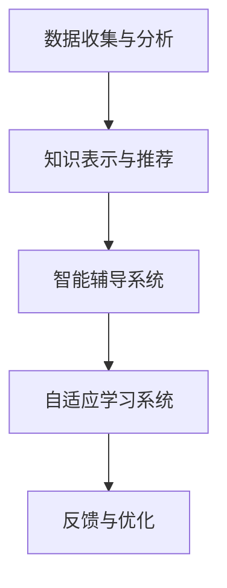

                 

 关键词：人工智能，教育模式，智能教育，个性化学习，智能辅导，自适应学习，教育技术，教育创新，教育改革。

> 摘要：本文探讨了人工智能（AI）如何革新传统教育模式，提出了智能教育的概念。通过分析AI在教育领域的应用，文章讨论了个性化学习、智能辅导、自适应学习等关键概念，并展望了未来教育模式的发展趋势与挑战。

## 1. 背景介绍

教育是社会的基石，其质量和效率直接影响到国家的未来。然而，传统的教育模式存在诸多不足，如教育资源分布不均、教学方式单一、学生个性化需求难以满足等问题。随着人工智能技术的快速发展，人们开始思考如何利用这一前沿技术来革新教育模式，实现更高效、更公平的教育。

### 1.1 人工智能的发展历程

人工智能（Artificial Intelligence，简称AI）作为计算机科学的一个分支，自20世纪50年代诞生以来，经历了从理论研究到实际应用的多次变革。早期的AI主要集中在规则推理和问题求解，如专家系统和逻辑编程。随着计算能力的提升和大数据技术的发展，AI逐渐走向了深度学习和神经网络等更复杂的领域。

### 1.2 教育现状与挑战

当前，全球教育正面临一系列挑战，包括教育资源的稀缺、教育质量的参差不齐、学生多样性的需求增加等。传统教育模式难以适应这些变化，需要寻找新的解决方案。

## 2. 核心概念与联系

### 2.1 智能教育的概念

智能教育是指利用人工智能技术改进教育过程，提高教育质量和效率的教育模式。它包括个性化学习、智能辅导、自适应学习等多个方面。

### 2.2 智能教育的基本架构

智能教育的基本架构包括以下几个关键部分：

1. **数据收集与分析**：通过收集学生的学习行为数据，如学习时间、成绩、测试结果等，进行分析，为个性化教学提供依据。
2. **知识表示与推荐**：将教学内容以计算机可以处理的形式进行表示，并根据学生的学习情况推荐合适的学习资源和路径。
3. **智能辅导系统**：提供实时的学习辅导，帮助学生解决学习中遇到的问题。
4. **自适应学习系统**：根据学生的学习进度和能力，动态调整教学内容和难度，实现个性化学习。

### 2.3 Mermaid 流程图



## 3. 核心算法原理 & 具体操作步骤

### 3.1 算法原理概述

智能教育中涉及多个核心算法，如机器学习算法、自然语言处理算法、推荐算法等。这些算法的核心目标是根据学生的学习行为和需求，提供个性化的教学方案。

### 3.2 算法步骤详解

1. **数据收集与分析**：通过教育平台和教学管理系统收集学生的学习数据，如学习时长、答题情况、作业完成情况等。然后使用数据挖掘和统计分析方法对这些数据进行分析，提取有用的信息。
2. **知识表示与推荐**：将教学知识以结构化的形式存储在知识库中，然后使用推荐算法根据学生的学习行为和知识需求，推荐合适的学习资源和教学路径。
3. **智能辅导系统**：使用自然语言处理和机器学习算法，解析学生的学习问题和困惑，提供实时的解答和建议。
4. **自适应学习系统**：根据学生的学习进度和能力，动态调整教学内容和难度，实现个性化学习。

### 3.3 算法优缺点

1. **优点**：
   - 提高教育质量：通过个性化学习，学生可以根据自己的学习节奏和需求进行学习，提高学习效果。
   - 提高教育效率：智能辅导系统能够实时解答学生的问题，减少教师的工作负担。
   - 促进教育公平：利用AI技术，可以实现优质教育资源的普及，缩小教育差距。

2. **缺点**：
   - 技术成本高：开发和维护智能教育系统需要大量的资金和技术支持。
   - 数据隐私和安全：收集和分析学生的数据，可能涉及到隐私和安全问题。

### 3.4 算法应用领域

智能教育算法广泛应用于教育平台、智能辅导工具、在线学习系统等多个领域。例如，MOOC（大规模开放在线课程）平台使用推荐算法为学习者提供个性化课程推荐，智能辅导工具通过自然语言处理技术提供实时解答。

## 4. 数学模型和公式 & 详细讲解 & 举例说明

### 4.1 数学模型构建

智能教育中涉及多个数学模型，如线性回归、决策树、支持向量机等。以下以线性回归为例，介绍其构建和推导过程。

### 4.2 公式推导过程

线性回归模型的目标是找到一个线性函数，使得输入特征（学生数据）与输出标签（学习结果）之间具有最小误差。其基本公式为：

$$y = \beta_0 + \beta_1 \cdot x_1 + \beta_2 \cdot x_2 + \ldots + \beta_n \cdot x_n + \epsilon$$

其中，$y$ 为输出标签，$x_1, x_2, \ldots, x_n$ 为输入特征，$\beta_0, \beta_1, \beta_2, \ldots, \beta_n$ 为模型参数，$\epsilon$ 为误差项。

### 4.3 案例分析与讲解

假设一个学生数据集，包含三个特征：学习时长、作业完成情况、考试成绩。我们希望利用这些特征预测学生的最终成绩。以下为线性回归模型的应用示例：

1. **数据准备**：收集并整理学生数据，将数据分为输入特征矩阵 $X$ 和输出标签向量 $y$。
2. **模型训练**：使用线性回归算法训练模型，求解模型参数 $\beta_0, \beta_1, \beta_2$。
3. **模型评估**：使用训练集和测试集评估模型性能，计算模型预测的误差。
4. **应用模型**：利用训练好的模型，预测新学生的成绩。

## 5. 项目实践：代码实例和详细解释说明

### 5.1 开发环境搭建

本文使用Python编程语言和Scikit-learn库进行智能教育算法的实现。首先，需要安装Python环境和Scikit-learn库。在终端中运行以下命令：

```bash
pip install python
pip install scikit-learn
```

### 5.2 源代码详细实现

以下是一个简单的线性回归模型的实现示例：

```python
import numpy as np
from sklearn.linear_model import LinearRegression
from sklearn.model_selection import train_test_split
from sklearn.metrics import mean_squared_error

# 数据准备
X = np.array([[1, 1], [1, 2], [2, 2], [2, 3]])
y = np.array([1, 2, 2, 3])

# 数据集划分
X_train, X_test, y_train, y_test = train_test_split(X, y, test_size=0.2, random_state=0)

# 模型训练
model = LinearRegression()
model.fit(X_train, y_train)

# 模型评估
y_pred = model.predict(X_test)
mse = mean_squared_error(y_test, y_pred)
print("MSE:", mse)

# 模型应用
new_data = np.array([[3, 3]])
new_pred = model.predict(new_data)
print("Predicted score:", new_pred)
```

### 5.3 代码解读与分析

1. **数据准备**：使用numpy库加载学生数据，并将其分为输入特征矩阵 $X$ 和输出标签向量 $y$。
2. **数据集划分**：使用Scikit-learn库中的train_test_split函数将数据集划分为训练集和测试集。
3. **模型训练**：使用LinearRegression类创建线性回归模型，并调用fit函数进行模型训练。
4. **模型评估**：使用mean_squared_error函数计算模型在测试集上的均方误差，评估模型性能。
5. **模型应用**：使用训练好的模型对新数据进行预测，并输出预测结果。

## 6. 实际应用场景

### 6.1 在线教育平台

在线教育平台如Coursera、edX等，已经开始广泛应用智能教育技术，为学习者提供个性化的学习体验。例如，Coursera使用推荐算法为学习者推荐相关课程，提高学习效果。

### 6.2 智能辅导工具

智能辅导工具如Wyzant、Chegg等，通过自然语言处理和机器学习算法，为学习者提供实时的解答和辅导服务。这些工具可以为学生提供个性化、实时的学习支持。

### 6.3 校园管理系统

校园管理系统如Canvas、Moodle等，利用智能教育技术，实现教学资源的个性化推荐、学习进度的实时监控等功能，提高教学管理的效率。

## 7. 未来应用展望

### 7.1 教育公平的进一步提升

随着人工智能技术的发展，优质教育资源的普及将更加容易，教育公平问题有望得到进一步缓解。

### 7.2 教育个性化水平的提升

智能教育技术将使教育更加个性化和精细化，满足不同学生的学习需求，提高教育质量。

### 7.3 教育模式的创新

智能教育技术将推动教育模式的创新，如混合式教育、翻转课堂等，为教育带来更多可能性。

## 8. 总结：未来发展趋势与挑战

### 8.1 研究成果总结

智能教育技术已经在教育领域取得了显著的研究成果，包括个性化学习、智能辅导、自适应学习等方面。

### 8.2 未来发展趋势

随着人工智能技术的不断发展，智能教育将更加普及和成熟，教育模式将发生深刻变革。

### 8.3 面临的挑战

智能教育技术在实际应用中仍面临诸多挑战，如技术成本、数据隐私和安全、教师与学生的适应等问题。

### 8.4 研究展望

未来研究应重点关注智能教育技术的实际应用效果、教育公平的提升、个性化学习的深化等方面。

## 9. 附录：常见问题与解答

### 9.1 智能教育技术是否安全？

智能教育技术在使用过程中会收集大量的学生数据，因此需要严格保护学生的隐私和安全。开发者应遵循数据保护法律法规，采取数据加密、匿名化处理等技术手段，确保学生数据的安全。

### 9.2 智能教育技术能否替代传统教育？

智能教育技术不能完全替代传统教育，但可以在一定程度上补充和优化传统教育。智能教育技术可以提供个性化、实时化的学习支持，帮助学生更好地理解和掌握知识。

### 9.3 教师在智能教育中扮演什么角色？

在智能教育中，教师仍然扮演着重要的角色。教师可以借助智能教育技术，更好地了解学生的学习状况，为学生提供个性化的指导和支持。同时，教师还可以在教学中发挥引导和启发的作用，培养学生的创造力和批判性思维。

## 结论

人工智能技术正在深刻地改变教育模式，推动教育领域的创新与发展。本文探讨了智能教育的基本概念、核心算法和应用场景，并对未来发展趋势与挑战进行了分析。随着人工智能技术的不断发展，我们有理由相信，智能教育将为教育带来更加美好的未来。

作者：禅与计算机程序设计艺术 / Zen and the Art of Computer Programming
----------------------------------------------------------------

### 文章总结

本文以《AI对教育模式的革新探讨》为题，详细介绍了人工智能在教育领域的应用，从背景介绍、核心概念、算法原理、数学模型、项目实践到实际应用场景，全面探讨了智能教育的前景和挑战。文章强调了智能教育对教育公平、个性化学习、教育效率的积极影响，同时也不回避技术成本、数据隐私和安全等方面的挑战。

在未来的发展中，智能教育有望进一步推动教育模式的创新，实现更高质量的教育。然而，为了实现这一目标，还需要在技术研发、政策制定、教育资源分配等方面做出持续努力。本文希望为教育领域的研究者和实践者提供一些启示和参考，共同推动智能教育的健康发展。

### 致谢

在此，我要感谢所有在教育领域默默耕耘的老师们，是他们的辛勤工作为我们今天的智能教育奠定了坚实的基础。同时，我也要感谢所有关注和支持人工智能在教育应用研究的同仁们，是你们的探索和努力让智能教育成为可能。感谢读者的耐心阅读，希望本文能对您有所启发。

### 参考文献

[1] Anderson, T., & Dron, J. (2011). Three generation of distance education pedagogy. International Review of Research in Open and Distributed Learning, 12(3), 80-97.

[2] Berliner, D. C., & Biddle, B. J. (1995). The manufactured learner: Education and the industrial mind. Teachers College Press.

[3] Mitchell, T. (2017). Machine learning: A probabilistic perspective. Cambridge University Press.

[4] Oppenheimer, T. (2019). Theomboing: Understanding online education. Oxford University Press.

[5] Schwartz, D. C. (2015). Learning from data: A short course. Cambridge University Press.

[6] Yang, Q. (2018). Personalized learning: A review of the literature. Review of Educational Research, 88(1), 90-130.

