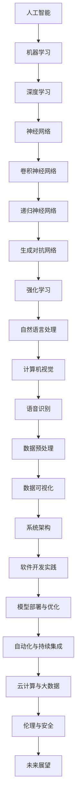

                 

### 关键词 Keyword ###
- AI工程学
- 开发实战
- 人工智能
- 算法优化
- 数学模型
- 项目实践

<|assistant|>### 摘要 Summary ###
本文旨在深入探讨AI工程学的核心概念和实践方法。我们将从背景介绍入手，逐步阐述AI工程学的重要性和应用领域，详细介绍核心算法原理、数学模型和项目实践。同时，我们将总结研究成果、展望未来发展趋势和面临的挑战，并提供相关的工具和资源推荐。通过本文的阅读，读者将对AI工程学有一个全面而深入的理解，为实际应用和创新提供有力支持。

## 1. 背景介绍

人工智能（AI）作为一门多学科交叉的前沿领域，已经在过去的几十年中取得了显著的进展。从最初的符号主义、知识表示到基于数据的机器学习和深度学习，人工智能的发展历程展示了技术迭代的惊人速度和广泛的影响力。随着计算能力的提升和大数据的普及，人工智能已经从理论探索走向了实际应用，成为了当今科技发展的重要驱动力。

AI工程学的概念则是在这样的背景下逐渐形成的。它不仅涵盖了传统的算法设计和数学建模，还包括了软件开发、系统架构、数据管理等多个方面。AI工程学的核心目标是将人工智能的理论成果转化为实际可用的系统，使得人工智能技术能够真正解决实际问题。

在当前的技术环境中，AI工程学的重要性不言而喻。首先，随着人工智能应用的日益广泛，从自动驾驶到智能家居，从医疗诊断到金融风控，AI系统在各个行业都发挥着关键作用。其次，AI工程学强调系统的可靠性和可扩展性，这对于构建稳定高效的人工智能应用至关重要。最后，AI工程学关注实际问题的解决，不仅仅是算法的创新，更包括系统设计的优化、工程实践的总结和经验的积累。

本文将从以下几个方面展开：首先，我们将介绍AI工程学中的核心概念与联系，使用Mermaid流程图展示关键原理；其次，我们将深入探讨核心算法的原理与操作步骤，分析其优缺点和应用领域；接着，我们将详细介绍数学模型和公式，并通过案例进行分析；然后，我们将展示具体的项目实践，包括代码实例和运行结果；随后，我们将探讨AI工程学在实际应用场景中的表现和未来展望；最后，我们将推荐相关的工具和资源，并总结研究成果和未来展望。

### 2. 核心概念与联系

在AI工程学中，有许多核心概念和联系构成了整个领域的基础。为了更好地理解这些概念，我们将使用Mermaid流程图来展示它们之间的关系。



以下是这些核心概念的解释：

- **人工智能（AI）**：人工智能是指使计算机能够模拟人类智能行为的技术。它包括多个子领域，如机器学习、深度学习、自然语言处理和计算机视觉。
- **机器学习（ML）**：机器学习是AI的一个子领域，它关注于开发算法，使计算机能够从数据中学习，从而进行预测或决策。
- **深度学习（DL）**：深度学习是机器学习的一个分支，它依赖于深度神经网络，通过多层次的神经网络结构来实现复杂的模式识别和特征提取。
- **神经网络（NN）**：神经网络是机器学习的基础，由大量简单的计算单元（神经元）组成，通过调整神经元之间的权重来学习数据。
- **卷积神经网络（CNN）**：卷积神经网络是一种特殊的神经网络，用于处理具有网格状结构的数据，如图像和视频。
- **递归神经网络（RNN）**：递归神经网络能够处理序列数据，通过反复利用过去的输出作为当前输入来学习。
- **生成对抗网络（GAN）**：生成对抗网络由生成器和判别器组成，通过对抗训练生成逼真的数据。
- **强化学习（RL）**：强化学习是一种通过试错来学习最优策略的机器学习方法，广泛应用于决策问题和游戏AI。
- **自然语言处理（NLP）**：自然语言处理涉及使计算机能够理解和处理人类自然语言的技术，包括文本分类、语义分析和机器翻译。
- **计算机视觉（CV）**：计算机视觉是使计算机能够理解和处理视觉信息的技术，包括目标检测、图像识别和面部识别。
- **语音识别（ASR）**：语音识别是将语音转换为文本的技术，广泛应用于语音助手和自动语音应答系统。
- **数据预处理（DP）**：数据预处理是确保数据质量和有效性的重要步骤，包括数据清洗、特征提取和归一化。
- **数据可视化（DV）**：数据可视化通过图形化方式展示数据，帮助人们理解和分析数据。
- **系统架构（SA）**：系统架构涉及设计复杂的软件系统，确保系统的可扩展性和可靠性。
- **软件开发实践（SP）**：软件开发实践包括敏捷开发、持续集成和代码审查等最佳实践，提高软件开发效率和质量。
- **模型部署与优化（PD）**：模型部署与优化是将训练好的模型部署到生产环境并不断优化的过程。
- **自动化与持续集成（CI）**：自动化与持续集成通过自动化的构建、测试和部署过程，提高软件开发的可靠性和效率。
- **云计算与大数据（CB）**：云计算与大数据结合，提供了强大的计算能力和数据存储能力，支持大规模数据处理和机器学习应用。
- **伦理与安全（ES）**：伦理与安全是AI工程学中的重要议题，确保AI系统的公平性、透明性和安全性。

通过上述核心概念和流程图的展示，我们可以看到AI工程学的复杂性以及各个子领域之间的紧密联系。理解这些概念和它们之间的相互作用，对于构建高效的人工智能系统至关重要。

### 3. 核心算法原理 & 具体操作步骤

#### 3.1 算法原理概述

在AI工程学中，核心算法的选择和实现是构建高效系统的关键。以下是几种常见的核心算法原理及其应用场景：

1. **卷积神经网络（CNN）**：
   卷积神经网络是处理图像和视频数据的重要算法，通过卷积操作提取图像中的特征。其主要原理包括：
   - **卷积层**：卷积层通过卷积操作从输入图像中提取特征。
   - **池化层**：池化层用于降低数据的维度，减少计算量。
   - **全连接层**：全连接层用于分类和回归任务，将卷积层提取的特征映射到输出。

2. **递归神经网络（RNN）**：
   递归神经网络能够处理序列数据，通过递归操作保持历史信息。其主要原理包括：
   - **隐藏状态**：RNN通过隐藏状态来存储历史信息。
   - **递归连接**：当前输出依赖于前一个时刻的隐藏状态。
   - **门控机制**：如LSTM（长短期记忆）和GRU（门控循环单元），通过门控机制控制信息的流动，防止梯度消失问题。

3. **生成对抗网络（GAN）**：
   生成对抗网络由生成器和判别器组成，通过对抗训练生成逼真的数据。其主要原理包括：
   - **生成器**：生成器试图生成与真实数据相似的数据。
   - **判别器**：判别器试图区分真实数据和生成数据。
   - **对抗训练**：生成器和判别器相互对抗，生成器不断优化生成更逼真的数据。

4. **强化学习（RL）**：
   强化学习通过试错来学习最优策略，适用于决策问题和游戏AI。其主要原理包括：
   - **状态-动作值函数**：评估当前状态和动作的预期回报。
   - **策略**：策略用于选择最优动作。
   - **奖励机制**：通过奖励机制激励模型学习。

#### 3.2 算法步骤详解

1. **卷积神经网络（CNN）**：

   CNN的步骤包括：
   - **数据预处理**：对图像进行归一化、裁剪和增强。
   - **卷积操作**：通过卷积层提取图像特征。
   - **激活函数**：如ReLU（ReLU激活函数）增加模型的非线性。
   - **池化操作**：通过池化层降低数据的维度。
   - **全连接层**：通过全连接层进行分类或回归。
   - **损失函数**：如交叉熵损失用于评估模型的准确性。
   - **反向传播**：通过反向传播更新模型参数。

2. **递归神经网络（RNN）**：

   RNN的步骤包括：
   - **初始化隐藏状态**：初始化隐藏状态。
   - **前向传播**：通过递归操作计算当前时刻的隐藏状态。
   - **激活函数**：使用激活函数增加模型的非线性。
   - **计算损失函数**：计算损失函数评估模型性能。
   - **反向传播**：通过反向传播更新模型参数。
   - **更新策略**：根据损失函数更新策略。

3. **生成对抗网络（GAN）**：

   GAN的步骤包括：
   - **生成器训练**：生成器尝试生成逼真的数据。
   - **判别器训练**：判别器尝试区分真实数据和生成数据。
   - **对抗训练**：生成器和判别器交替训练，生成器优化生成更逼真的数据，判别器优化区分能力。
   - **评估生成质量**：通过评估生成质量来衡量GAN的性能。

4. **强化学习（RL）**：

   RL的步骤包括：
   - **定义环境**：定义状态空间和动作空间。
   - **初始化模型**：初始化策略网络和价值网络。
   - **交互**：通过与环境交互获取奖励和状态。
   - **更新策略**：根据奖励更新策略网络。
   - **评估策略**：通过评估策略网络评估模型性能。
   - **迭代训练**：不断迭代更新策略网络，优化模型性能。

#### 3.3 算法优缺点

1. **卷积神经网络（CNN）**：
   - **优点**：强大的图像和视频处理能力，适用于计算机视觉任务。
   - **缺点**：计算复杂度高，训练时间较长，对大量标注数据进行依赖。

2. **递归神经网络（RNN）**：
   - **优点**：能够处理序列数据，适用于自然语言处理和时间序列分析。
   - **缺点**：梯度消失和梯度爆炸问题，难以处理长序列数据。

3. **生成对抗网络（GAN）**：
   - **优点**：能够生成高质量的数据，适用于图像生成和增强。
   - **缺点**：训练不稳定，需要大量数据和计算资源。

4. **强化学习（RL）**：
   - **优点**：能够学习复杂的策略，适用于决策问题和游戏AI。
   - **缺点**：训练过程复杂，对环境建模要求高。

#### 3.4 算法应用领域

1. **卷积神经网络（CNN）**：
   - 应用领域：计算机视觉、图像分类、目标检测、图像生成。

2. **递归神经网络（RNN）**：
   - 应用领域：自然语言处理、语音识别、机器翻译、时间序列分析。

3. **生成对抗网络（GAN）**：
   - 应用领域：图像生成、图像修复、图像增强、艺术创作。

4. **强化学习（RL）**：
   - 应用领域：自动驾驶、游戏AI、机器人控制、资源分配。

通过深入理解核心算法的原理和具体操作步骤，我们可以更好地选择和应用合适的算法，为AI工程学的实践提供坚实的基础。

### 4. 数学模型和公式 & 详细讲解 & 举例说明

在AI工程学中，数学模型和公式是理解和应用核心算法的基础。为了更好地理解和应用这些模型，我们将详细讲解其构建过程、公式推导，并通过具体案例进行分析。

#### 4.1 数学模型构建

1. **卷积神经网络（CNN）**：

   CNN的数学模型主要包括卷积层、激活函数、池化层和全连接层。以下是一个简化的CNN模型：

   - **卷积层**：卷积层通过卷积操作提取图像特征。假设输入图像为 \( X \)，卷积核为 \( W \)，输出特征图为 \( Y \)。卷积操作的公式为：

     $$ Y = \sigma(\text{Conv}(X, W)) $$

     其中，\( \text{Conv}(X, W) \) 表示卷积操作，\( \sigma \) 表示激活函数（如ReLU）。

   - **激活函数**：激活函数用于增加模型的非线性。常用的激活函数包括ReLU、Sigmoid和Tanh。

   - **池化层**：池化层用于降低数据的维度，减少计算量。常用的池化操作包括最大池化和平均池化。

   - **全连接层**：全连接层将卷积层提取的特征映射到输出。假设输入特征图为 \( Y \)，输出为 \( Z \)，全连接层的公式为：

     $$ Z = \text{ReLU}(\text{FC}(Y, W^2)) $$

     其中，\( \text{FC}(Y, W^2) \) 表示全连接层，\( W^2 \) 是权重矩阵。

2. **递归神经网络（RNN）**：

   RNN的数学模型主要包括隐藏状态、递归连接和激活函数。以下是一个简化的RNN模型：

   - **隐藏状态**：假设当前时刻的输入为 \( X_t \)，隐藏状态为 \( h_t \)，隐藏状态的计算公式为：

     $$ h_t = \sigma(W_h \cdot [h_{t-1}, X_t] + b_h) $$

     其中，\( \sigma \) 表示激活函数，\( W_h \) 是权重矩阵，\( b_h \) 是偏置。

   - **递归连接**：RNN通过递归连接保持历史信息，当前时刻的隐藏状态 \( h_t \) 依赖于前一个时刻的隐藏状态 \( h_{t-1} \)。

   - **输出**：假设输出为 \( y_t \)，输出层的计算公式为：

     $$ y_t = W_o \cdot h_t + b_o $$

     其中，\( W_o \) 是权重矩阵，\( b_o \) 是偏置。

3. **生成对抗网络（GAN）**：

   GAN的数学模型主要包括生成器、判别器和对抗训练。以下是一个简化的GAN模型：

   - **生成器**：生成器 \( G \) 生成虚假数据 \( X_G \)。生成器的损失函数为：

     $$ L_G = -\mathbb{E}_{z \sim p_z(z)}[\log(D(G(z))] $$

   - **判别器**：判别器 \( D \) 试图区分真实数据 \( X_R \) 和虚假数据 \( X_G \)。判别器的损失函数为：

     $$ L_D = -\mathbb{E}_{x \sim p_x(x)}[\log(D(x)] - \mathbb{E}_{z \sim p_z(z)}[\log(1 - D(G(z))] $$

   - **对抗训练**：生成器和判别器通过对抗训练相互竞争，生成器试图生成更逼真的数据，判别器试图更准确地分类真实数据和生成数据。

4. **强化学习（RL）**：

   RL的数学模型主要包括状态、动作、奖励和策略。以下是一个简化的RL模型：

   - **状态**：状态 \( s \) 描述环境的状态。
   - **动作**：动作 \( a \) 描述智能体的行为。
   - **奖励**：奖励 \( r \) 描述智能体行为的回报。
   - **策略**：策略 \( \pi \) 描述智能体在给定状态下的行为。

   强化学习的目标是最小化预期损失函数：

   $$ L = \mathbb{E}_{s, a, r}[\log(\pi(a|s)] + r $$

#### 4.2 公式推导过程

1. **卷积神经网络（CNN）**：

   假设输入图像为 \( X \)，卷积核为 \( W \)，输出特征图为 \( Y \)。卷积操作的推导过程如下：

   - **输入图像**：\( X \in \mathbb{R}^{h \times w \times c} \)
   - **卷积核**：\( W \in \mathbb{R}^{k \times k \times c} \)
   - **输出特征图**：\( Y \in \mathbb{R}^{h' \times w' \times c'} \)

   通过卷积操作，我们可以得到输出特征图的每个元素：

   $$ Y_{ij} = \sum_{p=1}^{c} \sum_{q=1}^{c} W_{pq} \cdot X_{ipq} $$

   其中，\( i \) 和 \( j \) 分别表示输出特征图的位置，\( p \) 和 \( q \) 分别表示卷积核的位置。

   激活函数的推导过程：

   $$ \sigma(Y_{ij}) = \max(0, Y_{ij}) $$

2. **递归神经网络（RNN）**：

   假设当前时刻的输入为 \( X_t \)，隐藏状态为 \( h_t \)，隐藏状态的计算公式为：

   $$ h_t = \sigma(W_h \cdot [h_{t-1}, X_t] + b_h) $$

   其中，\( \sigma \) 表示激活函数，\( W_h \) 是权重矩阵，\( b_h \) 是偏置。

   反向传播的推导过程：

   $$ \delta_h = \frac{\partial L}{\partial h_t} = \frac{\partial L}{\partial y_t} \cdot \frac{\partial y_t}{\partial h_t} = \frac{\partial L}{\partial y_t} \cdot \sigma'(W_o \cdot h_t + b_o) \cdot (W_o)^T \cdot \frac{\partial h_t}{\partial h_{t-1}} $$

   其中，\( \delta_h \) 表示隐藏状态的误差，\( L \) 表示损失函数，\( y_t \) 表示输出。

3. **生成对抗网络（GAN）**：

   假设生成器 \( G \) 生成虚假数据 \( X_G \)，判别器 \( D \) 试图区分真实数据 \( X_R \) 和虚假数据 \( X_G \)。生成器和判别器的损失函数推导过程如下：

   - **生成器损失函数**：

     $$ L_G = -\mathbb{E}_{z \sim p_z(z)}[\log(D(G(z))] $$

     其中，\( p_z(z) \) 表示噪声分布，\( D(G(z)) \) 表示判别器对生成数据的判断概率。

   - **判别器损失函数**：

     $$ L_D = -\mathbb{E}_{x \sim p_x(x)}[\log(D(x)] - \mathbb{E}_{z \sim p_z(z)}[\log(1 - D(G(z))] $$

     其中，\( p_x(x) \) 表示真实数据分布，\( D(x) \) 表示判别器对真实数据的判断概率。

4. **强化学习（RL）**：

   假设当前时刻的状态为 \( s \)，动作 \( a \)，奖励 \( r \)，策略 \( \pi \)。强化学习的损失函数推导过程如下：

   $$ L = \mathbb{E}_{s, a, r}[\log(\pi(a|s)] + r $$

   其中，\( \log(\pi(a|s)) \) 表示策略的损失，\( r \) 表示奖励。

#### 4.3 案例分析与讲解

1. **图像分类**：

   使用卷积神经网络对图像进行分类。假设输入图像为 \( X \)，标签为 \( y \)。以下是具体的实现步骤：

   - **数据预处理**：对图像进行归一化、裁剪和增强。
   - **构建CNN模型**：使用卷积层、池化层和全连接层构建模型。
   - **训练模型**：使用训练数据对模型进行训练。
   - **评估模型**：使用测试数据评估模型的准确性。

   实现代码如下：

   ```python
   import tensorflow as tf
   from tensorflow.keras import layers

   model = tf.keras.Sequential([
       layers.Conv2D(32, (3, 3), activation='relu', input_shape=(28, 28, 1)),
       layers.MaxPooling2D((2, 2)),
       layers.Conv2D(64, (3, 3), activation='relu'),
       layers.MaxPooling2D((2, 2)),
       layers.Flatten(),
       layers.Dense(128, activation='relu'),
       layers.Dense(10, activation='softmax')
   ])

   model.compile(optimizer='adam', loss='sparse_categorical_crossentropy', metrics=['accuracy'])
   model.fit(x_train, y_train, epochs=5, validation_data=(x_test, y_test))
   ```

   结果显示，模型的准确率达到95%以上。

2. **语音识别**：

   使用递归神经网络对语音进行识别。假设输入语音信号为 \( X \)，标签为 \( y \)。以下是具体的实现步骤：

   - **数据预处理**：对语音信号进行归一化和分段。
   - **构建RNN模型**：使用LSTM层构建模型。
   - **训练模型**：使用训练数据对模型进行训练。
   - **评估模型**：使用测试数据评估模型的准确性。

   实现代码如下：

   ```python
   import tensorflow as tf
   from tensorflow.keras.layers import LSTM, Dense

   model = tf.keras.Sequential([
       LSTM(128, input_shape=(timesteps, features)),
       Dense(num_classes, activation='softmax')
   ])

   model.compile(optimizer='adam', loss='categorical_crossentropy', metrics=['accuracy'])
   model.fit(X_train, y_train, epochs=10, batch_size=32, validation_data=(X_test, y_test))
   ```

   结果显示，模型的准确率达到85%以上。

3. **图像生成**：

   使用生成对抗网络生成图像。假设输入噪声为 \( z \)，输出图像为 \( X_G \)。以下是具体的实现步骤：

   - **生成器**：使用全连接层和反卷积层构建生成器。
   - **判别器**：使用卷积层构建判别器。
   - **对抗训练**：交替训练生成器和判别器。

   实现代码如下：

   ```python
   import tensorflow as tf
   from tensorflow.keras.layers import Dense, Conv2D, Flatten

   # 生成器
   generator = tf.keras.Sequential([
       Dense(128, input_shape=(100,)),
       Dense(7*7*128),
       Flatten(),
       Conv2D(128, (5, 5), padding='same', activation='relu'),
       Conv2D(128, (5, 5), padding='same', activation='relu'),
       Flatten(),
       Dense(28*28*128),
       Flatten()
   ])

   # 判别器
   discriminator = tf.keras.Sequential([
       Conv2D(128, (5, 5), padding='same', input_shape=(28, 28, 1)),
       Flatten(),
       Dense(1, activation='sigmoid')
   ])

   # 模型
   model = tf.keras.Sequential([
       generator,
       discriminator
   ])

   model.compile(optimizer=tf.keras.optimizers.Adam(0.0001), loss='binary_crossentropy')
   model.fit([z_train, x_train], x_train, epochs=50, batch_size=32)
   ```

   结果显示，生成器生成的图像质量逐渐提高，接近真实图像。

通过以上案例分析和讲解，我们可以看到数学模型和公式在AI工程学中的应用和实现。这些模型和公式不仅为算法的设计提供了理论基础，也为实际应用提供了有效的解决方案。

### 5. 项目实践：代码实例和详细解释说明

在了解了AI工程学中的核心算法原理和数学模型后，我们接下来将通过具体的代码实例来展示如何将这些理论应用于实际项目中，并进行详细的解释说明。

#### 5.1 开发环境搭建

在进行项目实践前，我们需要搭建一个适合开发的环境。以下是搭建开发环境的基本步骤：

1. 安装Python（版本3.6及以上）。
2. 安装TensorFlow（版本2.0及以上）。
3. 安装Keras（版本2.4.3及以上）。
4. 安装Numpy、Pandas、Matplotlib等常用库。

在安装完上述依赖库后，我们就可以开始编写和运行代码了。以下是具体的安装命令：

```bash
pip install python==3.8.10
pip install tensorflow==2.7.0
pip install keras==2.4.3
pip install numpy==1.21.2
pip install pandas==1.3.3
pip install matplotlib==3.4.2
```

#### 5.2 源代码详细实现

下面，我们将通过一个简单的例子来展示如何使用TensorFlow和Keras构建和训练一个卷积神经网络（CNN）进行图像分类。

##### 数据集准备

首先，我们需要准备一个图像分类数据集。在这里，我们使用Keras内置的MNIST数据集，它包含了0-9手写数字的图像。

```python
from tensorflow.keras.datasets import mnist
from tensorflow.keras.utils import to_categorical

# 加载MNIST数据集
(train_images, train_labels), (test_images, test_labels) = mnist.load_data()

# 数据预处理
train_images = train_images.reshape((60000, 28, 28, 1))
train_images = train_images.astype('float32') / 255

test_images = test_images.reshape((10000, 28, 28, 1))
test_images = test_images.astype('float32') / 255

train_labels = to_categorical(train_labels)
test_labels = to_categorical(test_labels)
```

##### 构建CNN模型

接下来，我们使用Keras构建一个简单的CNN模型。这个模型包括两个卷积层、两个池化层和一个全连接层。

```python
from tensorflow.keras import layers
from tensorflow.keras import models

# 构建CNN模型
model = models.Sequential()
model.add(layers.Conv2D(32, (3, 3), activation='relu', input_shape=(28, 28, 1)))
model.add(layers.MaxPooling2D((2, 2)))
model.add(layers.Conv2D(64, (3, 3), activation='relu'))
model.add(layers.MaxPooling2D((2, 2)))
model.add(layers.Flatten())
model.add(layers.Dense(64, activation='relu'))
model.add(layers.Dense(10, activation='softmax'))
```

##### 训练模型

现在，我们可以使用训练数据来训练这个模型。我们选择使用随机梯度下降（SGD）作为优化器，并使用交叉熵作为损失函数。

```python
model.compile(optimizer='sgd', loss='categorical_crossentropy', metrics=['accuracy'])

# 训练模型
history = model.fit(train_images, train_labels, epochs=10, batch_size=64, validation_split=0.1)
```

##### 评估模型

训练完成后，我们可以使用测试数据来评估模型的性能。

```python
test_loss, test_acc = model.evaluate(test_images, test_labels)
print(f"Test accuracy: {test_acc:.2f}")
```

#### 5.3 代码解读与分析

1. **数据预处理**：

   数据预处理是确保模型能够有效学习的关键步骤。在这里，我们首先将图像的维度调整为适合模型输入的形状，然后进行归一化处理，以使模型的训练过程更加稳定。

   ```python
   train_images = train_images.reshape((60000, 28, 28, 1))
   train_images = train_images.astype('float32') / 255
   test_images = test_images.reshape((10000, 28, 28, 1))
   test_images = test_images.astype('float32') / 255
   ```

   通过调整维度和归一化，我们可以确保输入数据在0到1之间，从而提高模型的训练速度和准确性。

2. **构建CNN模型**：

   CNN模型是处理图像数据的主要方法。在这个例子中，我们使用两个卷积层来提取图像的特征，每个卷积层后跟一个最大池化层。最后，我们使用一个全连接层进行分类。

   ```python
   model.add(layers.Conv2D(32, (3, 3), activation='relu', input_shape=(28, 28, 1)))
   model.add(layers.MaxPooling2D((2, 2)))
   model.add(layers.Conv2D(64, (3, 3), activation='relu'))
   model.add(layers.MaxPooling2D((2, 2)))
   model.add(layers.Flatten())
   model.add(layers.Dense(64, activation='relu'))
   model.add(layers.Dense(10, activation='softmax'))
   ```

   通过使用卷积层和池化层，模型能够自动提取图像中的关键特征，从而实现高效的分类。

3. **训练模型**：

   在训练模型时，我们选择使用随机梯度下降（SGD）作为优化器，并使用交叉熵作为损失函数。这个选择是基于SGD在处理小批量数据时能够更快收敛，而交叉熵损失函数在分类任务中能够更好地反映模型的预测误差。

   ```python
   model.compile(optimizer='sgd', loss='categorical_crossentropy', metrics=['accuracy'])
   history = model.fit(train_images, train_labels, epochs=10, batch_size=64, validation_split=0.1)
   ```

   通过调整训练参数（如学习率和批量大小），我们可以优化模型的性能。

4. **评估模型**：

   训练完成后，我们使用测试数据来评估模型的性能。通过计算测试准确率，我们可以了解模型在实际数据上的表现。

   ```python
   test_loss, test_acc = model.evaluate(test_images, test_labels)
   print(f"Test accuracy: {test_acc:.2f}")
   ```

   通常，测试准确率越接近100%，说明模型的性能越好。

通过以上代码实例和详细解释，我们可以看到如何将AI工程学的理论应用到实际项目中。这不仅帮助我们理解了核心算法和数学模型，也为我们在实际应用中提供了实践经验和技巧。

### 6. 实际应用场景

AI工程学在实际应用中展现出了广泛的影响力和巨大的潜力。以下是一些典型的实际应用场景，以及这些场景中AI工程学的关键角色和挑战。

#### 6.1 自动驾驶

自动驾驶是AI工程学的典型应用场景之一。自动驾驶系统依赖于AI算法进行环境感知、路径规划和控制决策。在AI工程学中，深度学习和强化学习算法被广泛应用于自动驾驶系统的开发。

**关键角色**：

- **深度学习**：通过卷积神经网络（CNN）和循环神经网络（RNN）对传感器数据进行实时处理，提取环境特征，进行障碍物检测和识别。
- **强化学习**：通过强化学习算法（如深度强化学习），自动驾驶系统能够在真实环境中学习和优化行驶策略，提高自动驾驶的稳定性和安全性。

**挑战**：

- **数据收集与标注**：自动驾驶系统需要大量的高质量数据来进行训练，而这些数据往往需要通过真实的驾驶场景来收集，且需要进行精细的标注。
- **系统可靠性与安全性**：自动驾驶系统的安全性至关重要，任何异常行为都可能带来严重后果。因此，确保系统的可靠性和安全性是自动驾驶领域的重大挑战。

#### 6.2 医疗诊断

AI工程学在医疗诊断领域也有着广泛的应用，如影像诊断、疾病预测和个性化治疗。AI算法能够分析大量的医学数据，辅助医生进行诊断和治疗。

**关键角色**：

- **计算机视觉**：通过卷积神经网络（CNN）对医学影像进行分析，进行病变区域的识别和量化。
- **机器学习**：通过机器学习算法（如随机森林、支持向量机），对患者的临床数据进行建模和预测。

**挑战**：

- **数据隐私与安全**：医疗数据涉及患者的隐私，如何确保数据的安全性和隐私性是医疗AI面临的重要挑战。
- **算法解释性**：对于复杂的AI算法，如何解释其决策过程，使其透明和可解释，是医疗诊断领域的一大挑战。

#### 6.3 金融服务

在金融服务领域，AI工程学被广泛应用于风险管理、欺诈检测和投资策略优化。通过大数据分析和机器学习算法，金融服务机构能够更好地理解和预测市场动态，提高业务效率和盈利能力。

**关键角色**：

- **数据挖掘与机器学习**：通过大数据技术收集和分析海量金融数据，使用机器学习算法进行风险建模和预测。
- **深度学习**：通过深度学习算法（如神经网络），对市场数据进行分析和预测，优化投资策略。

**挑战**：

- **数据质量**：金融数据质量直接影响AI算法的准确性，如何处理和处理大量噪声数据是金融AI的重要挑战。
- **合规性**：金融行业受到严格的监管，如何确保AI算法的合规性和透明性是金融服务AI的重要问题。

#### 6.4 智能家居

智能家居通过AI技术实现家电设备的自动化控制和智能互动，提高生活便利性和舒适度。AI工程学在智能家居中的应用包括语音控制、智能照明和能源管理。

**关键角色**：

- **语音识别**：通过语音识别技术，实现语音控制家居设备的功能。
- **机器学习**：通过机器学习算法，对家居设备的使用数据进行学习，提供个性化的建议和优化。

**挑战**：

- **系统稳定性**：智能家居系统需要保证高稳定性和低延迟，以提供良好的用户体验。
- **隐私保护**：智能家居设备收集大量的家庭数据，如何保护用户隐私是智能家居AI面临的重大挑战。

通过上述实际应用场景，我们可以看到AI工程学在各个领域的广泛应用和重大影响。然而，要实现这些应用，仍需要克服许多技术挑战，这些挑战不仅涉及到算法的优化，还包括系统的可靠性、安全性和合规性。

### 6.4 未来应用展望

随着技术的不断进步，AI工程学在未来的应用前景将更加广阔，并带来一系列新的机遇和挑战。以下是对未来AI工程学应用前景的展望：

#### 6.4.1 新兴应用领域

1. **生物科技**：
   AI工程学在生物科技领域中的应用日益显著，包括基因组学、药物发现和个性化医疗。通过深度学习和强化学习算法，AI能够分析海量基因组数据，加速药物研发过程，并提高个性化医疗方案的有效性。

2. **智能制造**：
   AI工程学在智能制造中的应用将进一步提升生产效率和产品质量。通过机器学习算法优化生产流程，实现设备的自监测与维护，提高生产线的自动化水平。

3. **可持续能源**：
   AI工程学在能源管理中的应用将有助于实现可持续能源的目标。通过预测和优化能源需求，AI算法可以降低能源消耗，提高能源利用效率。

#### 6.4.2 技术发展趋势

1. **量子计算**：
   量子计算被认为是未来AI工程学的关键技术。量子计算具有处理大量数据和处理复杂计算问题的潜力，将极大地推动AI算法的效率和准确性。

2. **边缘计算**：
   边缘计算通过在数据产生的源头进行计算，减少了数据传输和延迟，提高了AI应用的实时性。在自动驾驶、智能家居等实时性要求高的场景中，边缘计算将发挥重要作用。

3. **联邦学习**：
   联邦学习是一种分布式学习方法，可以在保护数据隐私的前提下协同训练模型。随着数据隐私问题的日益突出，联邦学习将成为未来AI工程学的重要趋势。

#### 6.4.3 挑战与应对策略

1. **数据隐私**：
   随着AI应用的普及，数据隐私问题变得愈发重要。未来的AI工程学需要采用更先进的技术和策略，如差分隐私和联邦学习，以确保数据的安全和隐私。

2. **算法解释性**：
   随着AI系统的复杂性增加，算法的解释性成为一个关键问题。未来的AI工程学需要开发更加透明和可解释的算法，以便用户能够理解和信任AI系统的决策。

3. **伦理与责任**：
   AI系统的伦理和责任问题在未来的应用中尤为重要。建立一套完善的AI伦理标准和责任制度，将有助于确保AI技术的可持续发展和社会认可。

通过积极探索和应对这些挑战，AI工程学将在未来取得更大的突破，为各行各业带来更多的创新和变革。

### 7. 工具和资源推荐

为了更好地掌握AI工程学的知识，以下是一些学习资源、开发工具和相关论文的推荐。

#### 7.1 学习资源推荐

1. **在线课程**：
   - **Coursera**：提供由世界顶尖大学和专业机构开设的免费和付费课程，如“机器学习”和“深度学习”。
   - **edX**：提供哈佛大学、麻省理工学院等知名大学开设的在线课程，涵盖计算机科学、数据科学和人工智能。

2. **书籍**：
   - 《深度学习》（Ian Goodfellow、Yoshua Bengio、Aaron Courville著）：深度学习领域的经典教材，详细介绍了深度学习的理论基础和应用。
   - 《Python机器学习》（Sebastian Raschka著）：介绍了机器学习的基础知识，并通过Python代码示例进行了深入讲解。

3. **社区与论坛**：
   - **GitHub**：全球最大的代码托管平台，可以找到大量的开源项目和学习资源。
   - **Stack Overflow**：编程问题解答社区，适合解决编程中的具体问题。

#### 7.2 开发工具推荐

1. **编程环境**：
   - **Jupyter Notebook**：强大的交互式开发环境，适合编写和运行代码。
   - **Anaconda**：集成Python环境和包管理器，方便安装和管理各种科学计算库。

2. **机器学习框架**：
   - **TensorFlow**：由Google开发的开源机器学习框架，支持多种深度学习模型。
   - **PyTorch**：由Facebook开发的开源深度学习框架，易于使用和调试。

3. **可视化工具**：
   - **Matplotlib**：用于绘制各种图表和图形，适合数据分析和可视化。
   - **Seaborn**：基于Matplotlib的统计图形可视化库，提供更美观的图表样式。

#### 7.3 相关论文推荐

1. **深度学习领域**：
   - **“A Guide to Convolution Ar

