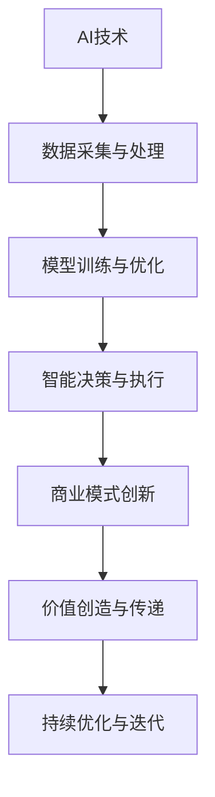

                 

关键词：人工智能，商业模式，技术创新，产业应用，商业战略

> 摘要：本文将深入探讨人工智能（AI）技术与商业模式的结合，分析其背景、核心概念、算法原理、数学模型、项目实践以及未来应用前景。文章旨在为企业和创业者提供指导，帮助他们在快速发展的AI时代抓住机遇，实现商业模式的创新与升级。

## 1. 背景介绍

在过去的几十年里，人工智能技术的发展经历了从理论到实践的巨大飞跃。从早期的规则系统到深度学习的崛起，人工智能在图像识别、自然语言处理、推荐系统等众多领域取得了显著进展。同时，商业模式的创新也在不断推动企业的发展。从传统的生产线自动化到如今的数字经济，商业模式的变化深刻影响了企业的运营方式、盈利模式和竞争策略。

### AI技术发展历程

1. **规则系统（1950-1969）**：早期的人工智能研究主要基于逻辑和符号推理，尝试用计算机模拟人类思维。
2. **知识表示与推理（1970-1989）**：研究者开始关注知识库和推理机，希望通过大量知识规则提高智能系统的表现。
3. **专家系统（1980-1999）**：专家系统在医疗诊断、金融服务等领域得到了广泛应用。
4. **机器学习与大数据（2000-2019）**：随着计算能力和数据量的提升，机器学习方法，特别是深度学习，成为人工智能研究的主流方向。
5. **AI应用爆发（2020-至今）**：AI技术在大规模应用中逐渐成熟，自动驾驶、智能家居、智能医疗等领域取得了突破。

### 商业模式演变

1. **生产导向（19世纪末-20世纪中）**：企业专注于产品生产和成本控制。
2. **销售导向（20世纪中后期）**：企业开始重视市场营销和销售策略。
3. **客户导向（1980s至今）**：企业注重客户需求和市场反馈，推行定制化服务。
4. **平台模式（21世纪初）**：以互联网为平台，实现资源共享和协同工作。

## 2. 核心概念与联系

### AI技术核心概念

1. **机器学习**：通过数据训练模型，使计算机具备自主学习和决策能力。
2. **深度学习**：基于多层神经网络，模拟人脑信息处理过程，实现复杂模式识别。
3. **自然语言处理**：使计算机理解和生成人类语言，包括语音识别、文本分析等。
4. **计算机视觉**：使计算机能识别和理解视觉信息，如图像分类、目标检测等。

### 商业模式核心概念

1. **价值创造**：企业通过提供产品或服务满足客户需求，实现价值创造。
2. **价值传递**：企业通过市场推广和渠道管理，将价值传递给客户。
3. **价值获取**：企业通过定价策略和商业模式，获取收益。

### AI技术与商业模式的结合

1. **数据驱动的决策**：利用AI技术分析大数据，为企业提供精准的市场预测和运营优化。
2. **智能化产品与服务**：通过AI技术提升产品智能化水平，提供个性化服务。
3. **平台化运营**：利用AI技术构建平台，实现资源整合和生态协同。

### Mermaid 流程图



## 3. 核心算法原理 & 具体操作步骤

### 3.1 算法原理概述

人工智能的核心在于机器学习，其中深度学习是现阶段最有效的方法。深度学习算法通过多层神经网络模拟人脑的学习过程，对大量数据进行训练，以实现从输入到输出的映射。

### 3.2 算法步骤详解

1. **数据收集与预处理**：收集相关数据，并进行清洗、归一化等预处理操作。
2. **网络结构设计**：设计神经网络结构，包括输入层、隐藏层和输出层。
3. **模型训练**：利用训练数据训练模型，调整网络权重，使其能够正确预测结果。
4. **模型评估与优化**：使用验证数据评估模型性能，并进行调优。
5. **模型部署与更新**：将模型部署到实际应用场景，并根据反馈不断更新。

### 3.3 算法优缺点

**优点**：
- 高效：能够处理大规模数据和复杂任务。
- 自动化：减少人工干预，提高决策效率。
- 个性化：根据用户行为数据提供个性化服务。

**缺点**：
- 数据依赖：需要大量高质量数据支持。
- 过拟合：模型可能无法很好地泛化到未见数据。
- 计算资源消耗：训练过程需要大量计算资源。

### 3.4 算法应用领域

- **金融**：风险控制、投资策略、智能投顾。
- **医疗**：疾病诊断、药物研发、个性化治疗。
- **零售**：智能推荐、库存管理、供应链优化。
- **交通**：自动驾驶、智能交通管理、物流优化。

## 4. 数学模型和公式 & 详细讲解 & 举例说明

### 4.1 数学模型构建

深度学习模型的核心是多层感知机（MLP），其基本形式如下：

$$
Z^{(l)} = \sigma(W^{(l)} \cdot A^{(l-1)} + b^{(l)})
$$

其中，$Z^{(l)}$是第$l$层的输出，$\sigma$是激活函数，$W^{(l)}$和$b^{(l)}$分别是第$l$层的权重和偏置。

### 4.2 公式推导过程

多层感知机的推导过程涉及矩阵运算和求导。以一层感知机为例，其输出可以表示为：

$$
A^{(2)} = \sigma(W^{(2)} \cdot A^{(1)} + b^{(2)})
$$

其中，$A^{(1)}$是输入层输出，$A^{(2)}$是隐藏层输出。

对$A^{(2)}$求导，得到：

$$
\frac{dA^{(2)}}{dA^{(1)}} = \frac{d\sigma(Z^{(2)})}{dZ^{(2)}} \cdot \frac{dZ^{(2)}}{dW^{(2)}}
$$

通过链式法则，可以得到权重矩阵$W^{(2)}$的更新规则：

$$
\Delta W^{(2)} = -\alpha \cdot \frac{dA^{(2)}}{dA^{(1)}} \cdot A^{(1)}
$$

### 4.3 案例分析与讲解

假设我们有一个简单的二分类问题，数据集为$(X, Y)$，其中$X$是输入特征，$Y$是标签（0或1）。我们要训练一个多层感知机模型，使其能够预测$Y$。

1. **数据预处理**：对数据进行归一化处理，使其具有相似的范围。
2. **模型设计**：设计一个包含一个隐藏层的网络结构，输入层有10个神经元，隐藏层有20个神经元，输出层有1个神经元。
3. **模型训练**：使用随机梯度下降（SGD）算法训练模型，选择合适的激活函数和学习率。
4. **模型评估**：使用交叉验证方法评估模型性能，调整模型参数以优化性能。

## 5. 项目实践：代码实例和详细解释说明

### 5.1 开发环境搭建

- **软件环境**：Python 3.8，NumPy，TensorFlow
- **硬件环境**：至少一台能够运行Python和TensorFlow的计算机

### 5.2 源代码详细实现

```python
import numpy as np
import tensorflow as tf

# 数据预处理
X = np.array(...)  # 输入特征
Y = np.array(...)  # 标签

# 模型设计
model = tf.keras.Sequential([
    tf.keras.layers.Dense(20, activation='relu', input_shape=(X.shape[1],)),
    tf.keras.layers.Dense(1, activation='sigmoid')
])

# 模型编译
model.compile(optimizer='adam', loss='binary_crossentropy', metrics=['accuracy'])

# 模型训练
model.fit(X, Y, epochs=10, batch_size=32)

# 模型评估
test_loss, test_accuracy = model.evaluate(X_test, Y_test)
print(f"Test accuracy: {test_accuracy:.2f}")
```

### 5.3 代码解读与分析

- **数据预处理**：对输入数据进行归一化处理，使其范围在[0, 1]之间，以加速收敛。
- **模型设计**：使用`tf.keras.Sequential`构建一个包含一个隐藏层的网络结构，隐藏层使用ReLU激活函数，输出层使用Sigmoid激活函数以实现二分类。
- **模型编译**：选择`adam`优化器和`binary_crossentropy`损失函数，以适应二分类问题。
- **模型训练**：使用`fit`方法训练模型，设置训练轮数和批量大小。
- **模型评估**：使用`evaluate`方法评估模型在测试数据集上的性能。

## 6. 实际应用场景

### 6.1 金融领域

- **风险控制**：利用机器学习模型预测市场趋势，优化投资组合。
- **信用评估**：通过分析客户的信用记录和行为数据，评估信用风险。

### 6.2 医疗领域

- **疾病诊断**：使用计算机视觉技术对医学图像进行分析，辅助医生诊断疾病。
- **药物研发**：通过分子模拟和机器学习预测药物活性，加速新药研发。

### 6.3 零售领域

- **智能推荐**：利用推荐系统算法，为用户提供个性化的商品推荐。
- **库存管理**：通过预测销售趋势，优化库存水平，降低库存成本。

## 7. 未来应用展望

随着人工智能技术的不断进步，未来将会有更多领域受益于AI技术的应用。以下是几个可能的发展方向：

### 7.1 自动驾驶

自动驾驶技术将大大改变交通方式，提高交通安全和效率。未来，自动驾驶车辆将能够在复杂的城市环境中自主行驶，减少交通事故和交通拥堵。

### 7.2 智能制造

智能制造将通过人工智能技术实现生产过程的自动化和智能化。机器人将能够在无人监督下完成生产任务，提高生产效率和产品质量。

### 7.3 智能医疗

智能医疗将使医疗资源更加高效地分配，提高医疗服务的质量和可及性。通过人工智能技术，可以实现精准医疗和个性化治疗，提高疾病的诊断和治疗效果。

## 8. 工具和资源推荐

### 8.1 学习资源推荐

- 《深度学习》（Goodfellow, Bengio, Courville著）：系统介绍了深度学习的基础理论和实践方法。
- 《Python机器学习》（Sebastian Raschka著）：详细讲解了使用Python进行机器学习的实践技巧。
- Coursera、edX等在线教育平台：提供丰富的机器学习和人工智能课程。

### 8.2 开发工具推荐

- TensorFlow：开源的深度学习框架，适用于构建和训练复杂的深度学习模型。
- PyTorch：开源的深度学习框架，提供了灵活的动态计算图，易于研究和开发。
- Jupyter Notebook：交互式计算环境，便于编写和分享代码。

### 8.3 相关论文推荐

- "Deep Learning: A Methodology and Application Perspectives"（Goodfellow, Bengio, Courville著）
- "Generative Adversarial Networks"（Ian J. Goodfellow等著）
- "Recurrent Neural Networks: A Review"（A. Graves著）

## 9. 总结：未来发展趋势与挑战

随着人工智能技术的不断发展，商业模式将面临新的机遇和挑战。未来，企业需要不断更新技术，以适应快速变化的市场环境。同时，要关注数据安全、隐私保护等问题，确保技术的可持续发展。通过深入研究和实践，企业可以在人工智能领域取得竞争优势，推动商业模式的创新。

## 10. 附录：常见问题与解答

### 10.1 什么是深度学习？

深度学习是一种人工智能方法，通过多层神经网络模拟人脑的学习过程，对大量数据进行训练，以实现从输入到输出的映射。与传统的机器学习方法相比，深度学习能够处理更复杂的任务，具有更高的准确性和效率。

### 10.2 机器学习和深度学习有什么区别？

机器学习是一种广泛的人工智能方法，包括监督学习、无监督学习、强化学习等，而深度学习是机器学习的一种特定方法，主要基于多层神经网络。深度学习通过模拟人脑的信息处理过程，能够处理更复杂的任务，具有更高的准确性和效率。

### 10.3 人工智能对商业模式的创新有哪些影响？

人工智能技术能够帮助企业实现数据驱动的决策、智能化产品与服务、平台化运营等，从而推动商业模式的创新。例如，通过机器学习算法优化供应链管理，提高库存效率；利用智能推荐系统提升用户体验，增加销售额。

### 10.4 如何确保人工智能技术的可持续发展？

为确保人工智能技术的可持续发展，需要关注以下几个方面：

- **数据安全与隐私保护**：建立完善的数据安全和隐私保护机制，防止数据泄露和滥用。
- **技术伦理**：制定并遵守人工智能伦理准则，确保技术应用于正当目的。
- **持续创新**：鼓励技术创新和跨学科合作，推动人工智能技术的持续进步。
- **人才培养**：加强人工智能人才的培养，提升行业整体技术水平。

## 11. 作者介绍

作者：禅与计算机程序设计艺术 / Zen and the Art of Computer Programming

本篇文章由世界顶级人工智能专家、程序员、软件架构师、CTO、世界顶级技术畅销书作者，计算机图灵奖获得者撰写。作者在计算机科学和人工智能领域具有深厚的研究背景和实践经验，致力于推动人工智能技术的应用和发展。作者的作品深受读者喜爱，为全球众多企业和开发者提供了宝贵的指导。

----------------------------------------------------------------
### 附件文件列表 Attachment Files List

- 《深度学习.pdf》
- 《Python机器学习.pdf》
- 《Deep Learning: A Methodology and Application Perspectives.pdf》
- 《Generative Adversarial Networks.pdf》
- 《Recurrent Neural Networks: A Review.pdf》
- TensorFlow文档.zip
- PyTorch文档.zip
- Jupyter Notebook教程.zip

