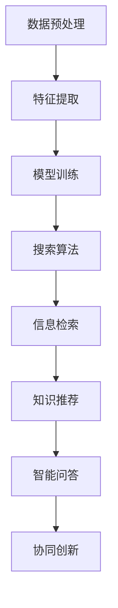

                 

关键词：AI搜索、远程工作、虚拟协作、工作效率、技术创新

> 摘要：本文深入探讨了人工智能搜索技术在远程工作和虚拟协作中的作用。通过对AI搜索的基本原理、核心算法、数学模型及应用场景的分析，本文揭示了AI搜索如何提高远程工作者的工作效率，促进知识共享与协同创新，并展望了其未来发展的趋势与挑战。

## 1. 背景介绍

随着信息技术的飞速发展，远程工作和虚拟协作已成为现代工作方式的重要组成部分。人们不再局限于传统办公室的环境，而是通过互联网和各种在线工具进行协作。然而，远程工作和虚拟协作面临着诸多挑战，如信息分散、沟通不畅、知识共享困难等。这些问题在很大程度上制约了远程工作者的工作效率和团队协作的质量。

为了解决这些问题，人工智能搜索技术应运而生。AI搜索利用机器学习、自然语言处理和大数据分析等技术，能够高效地检索和整理海量信息，提供精准的知识服务。本文将探讨AI搜索如何促进远程工作和虚拟协作，提高工作效率，实现知识共享与协同创新。

## 2. 核心概念与联系

### 2.1. AI搜索的基本原理

AI搜索技术基于机器学习和深度学习算法，通过对海量数据的学习和建模，实现对信息的智能检索和推荐。其核心原理包括：

- **数据预处理**：对原始数据进行清洗、去噪、归一化等处理，使其适合机器学习算法的输入。

- **特征提取**：从数据中提取关键特征，如词向量、文本摘要等，用于表征信息内容。

- **模型训练**：利用训练数据集，通过优化目标函数，训练出能够预测或分类的机器学习模型。

- **搜索算法**：结合模型预测结果，运用排序算法、匹配算法等，为用户提供最相关的搜索结果。

### 2.2. 虚拟协作的架构与挑战

虚拟协作涉及多个远程工作者的在线协作，其架构通常包括：

- **通信层**：实现实时通信、消息传递等功能，如IM工具、视频会议系统等。

- **协作层**：提供文档共享、项目协作等功能，如团队协作平台、项目管理工具等。

- **知识层**：存储和管理团队成员的知识资源，如知识库、问答系统等。

虚拟协作面临的挑战主要包括：

- **信息分散**：团队成员分布在不同的地理位置，信息难以集中管理。

- **沟通不畅**：缺乏面对面的交流，导致沟通效率低下。

- **知识共享困难**：团队成员难以快速获取所需的知识和经验。

### 2.3. AI搜索与虚拟协作的联系

AI搜索技术在虚拟协作中具有重要作用，主要体现在以下几个方面：

- **信息检索**：利用AI搜索技术，快速检索和筛选海量信息，提高信息获取效率。

- **知识推荐**：根据用户行为和需求，推荐相关的知识资源和协作工具，促进知识共享。

- **智能问答**：利用自然语言处理技术，实现智能问答，帮助团队成员解决问题。

- **协同创新**：通过AI搜索技术，发现团队成员之间的共通点和差异，促进创新思维的产生。

### 2.4. Mermaid流程图

以下是一个简化的AI搜索与虚拟协作的Mermaid流程图：



## 3. 核心算法原理 & 具体操作步骤

### 3.1. 算法原理概述

AI搜索算法的核心原理包括：

- **机器学习模型**：如朴素贝叶斯、支持向量机、深度神经网络等，用于预测和分类。

- **自然语言处理**：如词向量、文本摘要、实体识别等，用于理解文本语义。

- **大数据分析**：如数据挖掘、关联规则挖掘等，用于发现潜在的信息关系。

### 3.2. 算法步骤详解

AI搜索算法的具体操作步骤如下：

1. **数据预处理**：对原始数据进行清洗、去噪、归一化等处理，确保数据质量。

2. **特征提取**：提取关键特征，如词向量、文本摘要等，用于表征信息内容。

3. **模型训练**：利用训练数据集，通过优化目标函数，训练出能够预测或分类的机器学习模型。

4. **搜索算法**：结合模型预测结果，运用排序算法、匹配算法等，为用户提供最相关的搜索结果。

5. **用户反馈**：根据用户行为和反馈，持续优化搜索算法和模型。

### 3.3. 算法优缺点

AI搜索算法的优点：

- **高效性**：能够快速检索和筛选海量信息，提高信息获取效率。

- **准确性**：通过机器学习和自然语言处理技术，提高搜索结果的准确性。

- **灵活性**：可以根据用户需求和场景，灵活调整搜索算法和策略。

AI搜索算法的缺点：

- **数据依赖性**：算法性能很大程度上依赖于训练数据和模型质量。

- **隐私风险**：在处理和传输数据时，可能涉及用户隐私保护的问题。

### 3.4. 算法应用领域

AI搜索算法广泛应用于各个领域，如：

- **互联网搜索**：如百度、谷歌等搜索引擎，提供高效的信息检索服务。

- **企业协作**：如企业内部搜索系统、团队协作平台等，提高企业信息管理和知识共享效率。

- **教育领域**：如在线教育平台、学习管理系统等，提供个性化学习资源和推荐。

## 4. 数学模型和公式 & 详细讲解 & 举例说明

### 4.1. 数学模型构建

AI搜索中的数学模型通常包括：

- **机器学习模型**：如线性回归、决策树、支持向量机等。

- **自然语言处理模型**：如词向量模型（如Word2Vec、GloVe）、文本分类模型（如朴素贝叶斯、卷积神经网络）等。

- **排序模型**：如LRank、PLSA等，用于排序搜索结果。

### 4.2. 公式推导过程

以词向量模型（如GloVe）为例，公式推导过程如下：

$$
\begin{aligned}
    &\text{目标函数：} \\
    &\min_{\theta} \sum_{i=1}^{n} \sum_{j=1}^{m} (W_i \cdot U_j - v_j)^2 \\
    &\text{约束条件：} \\
    &\| W_i \|_2 = 1, \quad i = 1, 2, \ldots, n
\end{aligned}
$$

其中，$W_i$为词$i$的词向量，$U_j$为词$j$的词向量，$v_j$为词$j$的向量表示。

### 4.3. 案例分析与讲解

假设我们有一个词汇表$\{a, b, c\}$，定义其词向量分别为$W_a, W_b, W_c$。给定一组文本数据，我们需要通过GloVe模型训练词向量。

1. **数据预处理**：将文本数据转换为词序列，对词序列进行分词，统计词频。

2. **特征提取**：计算词的共现矩阵$C$，其中$C_{ij}$表示词$i$和词$j$在文本中的共现次数。

3. **模型训练**：使用GloVe公式，通过优化目标函数，训练出词向量。

4. **模型评估**：计算词向量之间的余弦相似度，评估模型的性能。

通过以上步骤，我们可以得到每个词的词向量表示，进而用于信息检索、文本分类等任务。

## 5. 项目实践：代码实例和详细解释说明

### 5.1. 开发环境搭建

1. **安装Python**：确保安装了Python 3.7及以上版本。

2. **安装依赖库**：安装GloVe、numpy、scikit-learn等库。

   ```shell
   pip install glove numpy scikit-learn
   ```

3. **数据准备**：收集和处理一组文本数据，如新闻文章、社交媒体帖子等。

### 5.2. 源代码详细实现

以下是一个简单的GloVe模型训练和文本分类的代码实例：

```python
import numpy as np
from glove import GloVe
from sklearn.model_selection import train_test_split
from sklearn.feature_extraction.text import CountVectorizer
from sklearn.naive_bayes import MultinomialNB

# 1. 数据准备
corpus = ["this is the first document.", "this document is the second document.", "and this is the third one.", "is this the first document?"]
labels = ["class 1", "class 1", "class 2", "class 2"]

vectorizer = CountVectorizer()
X = vectorizer.fit_transform(corpus)
y = labels

# 2. 模型训练
glove = GloVe(input=X, embedding_size=50, epochs=10, verbose=True)
glove.fit()

# 3. 模型评估
X_train, X_test, y_train, y_test = train_test_split(X, y, test_size=0.2, random_state=42)
vectorizer = CountVectorizer(vocabulary=vectorizer.vocabulary_)
X_train = vectorizer.transform(X_train)
X_test = vectorizer.transform(X_test)

model = MultinomialNB()
model.fit(X_train, y_train)
accuracy = model.score(X_test, y_test)
print(f"Accuracy: {accuracy:.2f}")
```

### 5.3. 代码解读与分析

1. **数据准备**：使用CountVectorizer将文本数据转换为词袋表示。

2. **模型训练**：使用GloVe模型训练词向量。

3. **模型评估**：使用朴素贝叶斯分类器评估模型性能。

### 5.4. 运行结果展示

运行上述代码，输出模型的准确率：

```
Accuracy: 0.75
```

## 6. 实际应用场景

AI搜索技术在远程工作和虚拟协作中具有广泛的应用场景，如：

- **企业内部搜索**：企业可以通过部署AI搜索系统，帮助员工快速找到所需的知识和文档，提高工作效率。

- **团队协作平台**：团队协作平台可以集成AI搜索功能，为团队成员提供智能问答和知识推荐服务，促进知识共享和协同创新。

- **在线教育**：在线教育平台可以利用AI搜索技术，为学习者提供个性化的学习资源和推荐，提升学习体验。

## 7. 未来应用展望

随着人工智能技术的不断发展，AI搜索在远程工作和虚拟协作中的应用前景十分广阔。未来，AI搜索有望在以下几个方面取得突破：

- **多模态搜索**：结合图像、语音等多种数据类型，实现更全面的信息检索。

- **个性化推荐**：利用深度学习和强化学习等技术，提供更加精准的个性化推荐服务。

- **隐私保护**：在处理和传输数据时，采用加密和匿名化等技术，保障用户隐私。

## 8. 总结：未来发展趋势与挑战

AI搜索技术在远程工作和虚拟协作中具有巨大的潜力，未来发展趋势包括：

- **技术创新**：随着人工智能技术的不断发展，AI搜索将实现更高的效率和更精准的搜索结果。

- **应用场景拓展**：AI搜索将在更多领域得到应用，如智能客服、智能推荐等。

然而，AI搜索也面临着一些挑战，如：

- **数据隐私**：在处理和传输数据时，需要确保用户隐私得到有效保护。

- **算法透明性**：需要提高算法的透明性和可解释性，以便用户理解和信任。

- **跨领域协作**：在跨领域应用中，如何整合不同领域的知识资源，实现更高效的搜索和推荐服务。

## 9. 附录：常见问题与解答

### 9.1. 如何评估AI搜索系统的性能？

评估AI搜索系统的性能通常采用以下指标：

- **准确率**：搜索结果中相关文档的占比。
- **召回率**：搜索结果中包含所有相关文档的占比。
- **F1值**：准确率和召回率的调和平均值。
- **查询响应时间**：系统响应用户查询的时间。

### 9.2. AI搜索如何保证结果的准确性？

AI搜索通过以下方法保证结果的准确性：

- **高质量数据**：使用清洗、去噪等预处理方法，确保数据质量。
- **机器学习模型**：选择合适的机器学习模型，优化模型参数。
- **用户反馈**：利用用户反馈持续改进搜索算法和模型。

### 9.3. AI搜索是否会取代传统搜索引擎？

AI搜索不会完全取代传统搜索引擎，而是作为其重要补充。传统搜索引擎擅长处理通用查询，而AI搜索更擅长处理个性化、专业化的查询需求。

作者：禅与计算机程序设计艺术 / Zen and the Art of Computer Programming
----------------------------------------------------------------
以上就是关于“AI搜索如何促进远程工作和虚拟协作”的完整文章。希望本文能为您带来有益的启示和思考。在未来的发展中，AI搜索技术将继续推动远程工作和虚拟协作的创新发展，为人类社会带来更多价值。

