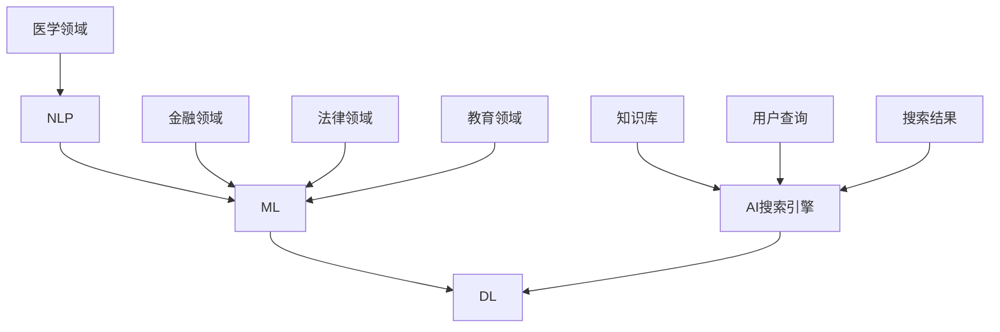

                 

关键词：AI搜索引擎、专业领域、应用、技术、算法、模型、实践、展望

> 摘要：本文将探讨人工智能搜索引擎在专业领域的应用，分析其核心概念、算法原理、数学模型、实践案例以及未来发展趋势，为读者提供全面的技术视角和实用建议。

## 1. 背景介绍

随着互联网和大数据技术的发展，人工智能（AI）已经渗透到各个行业，改变了我们的生活方式和工作方式。AI搜索引擎作为AI技术的一个重要应用方向，正在逐渐成为专业领域知识获取和问题解决的重要工具。传统的搜索引擎主要依赖于关键词匹配，而AI搜索引擎则结合了自然语言处理、机器学习等先进技术，能够更准确地理解和回答用户的问题，提供个性化的搜索结果。

专业领域的AI搜索引擎不仅需要处理海量的数据，还需要具备领域知识库的构建、问题理解和答案生成的能力。目前，AI搜索引擎在医学、金融、法律、教育等众多专业领域已经取得了显著的成果，为专业人士提供了强大的辅助工具。然而，AI搜索引擎在专业领域的应用仍然面临着诸多挑战，如数据质量、算法优化、用户隐私等。

本文旨在通过对AI搜索引擎在专业领域应用的研究，揭示其核心技术和实践方法，分析未来发展趋势和面临的挑战，为相关领域的专业人士提供参考和启示。

## 2. 核心概念与联系

### 2.1 AI搜索引擎的基本概念

AI搜索引擎是一种基于人工智能技术的高级搜索引擎，它不仅能够对用户的查询进行理解，还能根据用户的意图和上下文提供相关的搜索结果。AI搜索引擎的核心概念包括：

- **自然语言处理（NLP）**：NLP是使计算机能够理解、解释和生成人类语言的技术，是AI搜索引擎的基础。
- **机器学习（ML）**：机器学习是一种通过数据训练模型，使计算机能够进行预测和决策的技术，广泛应用于AI搜索引擎的算法设计。
- **深度学习（DL）**：深度学习是机器学习的一种方法，通过多层神经网络模型，对大量数据进行分析和预测，具有强大的特征提取和模型训练能力。

### 2.2 AI搜索引擎与专业领域的联系

AI搜索引擎在专业领域的应用，涉及到多个学科领域的交叉。以下是AI搜索引擎与专业领域的一些关键联系：

- **医学领域**：AI搜索引擎可以帮助医生快速检索病历、药典、研究论文等医学知识，提高诊疗效率和准确性。
- **金融领域**：AI搜索引擎可以用于金融数据的分析、投资策略的推荐、风险预测等，为金融机构提供智能决策支持。
- **法律领域**：AI搜索引擎可以协助律师进行法律文献的搜索、案例分析、法律条款的解读等，提高法律服务的质量和效率。
- **教育领域**：AI搜索引擎可以帮助学生个性化学习、智能辅导、在线问答等，促进教育资源的共享和优化。

### 2.3 核心概念原理与架构的Mermaid流程图



## 3. 核心算法原理 & 具体操作步骤

### 3.1 算法原理概述

AI搜索引擎的核心算法主要包括信息检索、自然语言理解和答案生成三个部分。

- **信息检索**：基于关键词匹配和概率模型，从海量的数据中检索出与用户查询相关的信息。
- **自然语言理解**：利用NLP技术，对用户的查询语句进行语义解析，提取关键信息。
- **答案生成**：结合领域知识库和机器学习模型，根据用户的查询意图生成准确的答案。

### 3.2 算法步骤详解

#### 3.2.1 信息检索

1. 用户输入查询语句。
2. 分词和词性标注，将查询语句转换为词汇序列。
3. 建立倒排索引，将词汇映射到相应的文档。
4. 计算查询语句与文档的相关性，排序并返回最相关的文档。

#### 3.2.2 自然语言理解

1. 词汇序列转换为词嵌入向量。
2. 使用序列模型（如LSTM、BERT）对词嵌入向量进行编码。
3. 提取查询语句的语义特征，如实体识别、关系提取等。
4. 根据语义特征生成查询意图。

#### 3.2.3 答案生成

1. 根据查询意图检索领域知识库。
2. 使用机器学习模型（如序列生成模型、文本生成模型）生成答案。
3. 对生成的答案进行文本清洗和格式化。
4. 将答案返回给用户。

### 3.3 算法优缺点

#### 优点

- **个性化**：AI搜索引擎可以根据用户的查询历史和偏好，提供个性化的搜索结果。
- **准确性**：结合NLP和ML技术，能够更准确地理解和回答用户的问题。
- **实时性**：AI搜索引擎可以实时响应用户的查询，提供即时的搜索结果。

#### 缺点

- **数据质量**：高质量的数据是AI搜索引擎的基础，数据质量问题可能影响搜索结果的质量。
- **计算资源**：构建和训练大规模的AI模型需要大量的计算资源。
- **用户隐私**：AI搜索引擎需要处理用户的个人信息，可能引发隐私泄露的问题。

### 3.4 算法应用领域

AI搜索引擎的应用领域非常广泛，以下是几个典型的应用场景：

- **医学领域**：用于医学文献的检索和病例分析，辅助医生进行诊断和治疗。
- **金融领域**：用于金融数据的分析和投资策略的推荐，提高金融决策的准确性。
- **法律领域**：用于法律文献的检索和案例分析，协助律师进行法律研究和案件处理。
- **教育领域**：用于个性化学习、智能辅导和在线问答，提高教育质量和效率。

## 4. 数学模型和公式 & 详细讲解 & 举例说明

### 4.1 数学模型构建

AI搜索引擎的数学模型主要包括信息检索模型、自然语言理解模型和答案生成模型。

#### 4.1.1 信息检索模型

信息检索模型常用的有TF-IDF模型和BM25模型。

- **TF-IDF模型**：
  $$ TF-IDF = \frac{f_{t,d}}{N} \log \left( \frac{N}{f_{t,d}} + 1 \right) $$
  其中，\( f_{t,d} \) 是词 \( t \) 在文档 \( d \) 中的频率，\( N \) 是文档总数。
- **BM25模型**：
  $$ BM25 = \frac{(k_1 + 1) \cdot f_{t,d}}{f_{t,d} + k_1 \cdot (1 - \frac{dl}{N_l})} + k_2 \cdot \left( 1 - \frac{f_{t,d}}{dl} \right) $$
  其中，\( k_1 \)、\( k_2 \) 是调节参数，\( dl \) 是文档 \( d \) 的长度，\( N_l \) 是文档的总长度。

#### 4.1.2 自然语言理解模型

自然语言理解模型常用的有词嵌入模型和序列模型。

- **词嵌入模型**：
  $$ e_t = \text{Word2Vec}(t) $$
  其中，\( e_t \) 是词 \( t \) 的词嵌入向量。
- **序列模型**：
  $$ \text{LSTM} = \frac{1}{1 + \exp{(-W \cdot [h_{t-1}, x_t] + b)}} $$
  其中，\( W \) 是权重矩阵，\( b \) 是偏置项，\( h_{t-1} \) 是前一个时间步的隐藏状态，\( x_t \) 是当前输入。

#### 4.1.3 答案生成模型

答案生成模型常用的有序列生成模型和文本生成模型。

- **序列生成模型**：
  $$ p(y_t | y_{<t}) = \text{softmax}(\text{W} \cdot [h_{t-1}, e_{y_t}]) $$
  其中，\( p(y_t | y_{<t}) \) 是在给定历史输出 \( y_{<t} \) 下，生成当前输出 \( y_t \) 的概率分布。
- **文本生成模型**：
  $$ p(z | x) = \text{softmax}(\text{W} \cdot [h_{t-1}, \text{encode}(x)]) $$
  其中，\( p(z | x) \) 是在给定输入 \( x \) 下，生成文本 \( z \) 的概率分布。

### 4.2 公式推导过程

以TF-IDF模型为例，推导过程如下：

1. **定义**：词频（TF）和文档频率（DF）分别表示词在文档中的频率和文档中包含该词的频率。
2. **目标**：提高词频和降低文档频率的影响，同时增加文档总数的影响。
3. **公式**：
   $$ TF-IDF = \frac{f_{t,d}}{N} \log \left( \frac{N}{f_{t,d}} + 1 \right) $$
4. **解释**：当 \( f_{t,d} \) 较大时，\( \log \left( \frac{N}{f_{t,d}} + 1 \right) \) 较小，从而 \( TF-IDF \) 较小；当 \( f_{t,d} \) 较小时，\( \log \left( \frac{N}{f_{t,d}} + 1 \right) \) 较大，从而 \( TF-IDF \) 较大。

### 4.3 案例分析与讲解

假设有一个包含10篇文档的文档集，其中一篇文档 \( d_1 \) 包含关键词“人工智能”的次数为5次，总词数为100次。而整个文档集中的“人工智能”的词频为20次，文档总数为100篇。

根据TF-IDF模型，计算 \( d_1 \) 中“人工智能”的TF-IDF值：

1. **词频**：\( f_{t,d_1} = 5 \)
2. **文档频率**：\( f_{t,DF} = 20 \)
3. **文档总数**：\( N = 100 \)
4. **TF-IDF**：
   $$ TF-IDF = \frac{5}{100} \log \left( \frac{100}{5} + 1 \right) = 0.05 \log(21) \approx 0.162 $$

因此，文档 \( d_1 \) 中“人工智能”的TF-IDF值为0.162。

通过上述案例，我们可以看到TF-IDF模型如何帮助搜索引擎确定关键词在文档中的重要性，从而实现有效的信息检索。

## 5. 项目实践：代码实例和详细解释说明

### 5.1 开发环境搭建

为了实现AI搜索引擎，我们需要搭建一个包含以下工具和库的开发环境：

- **Python 3.x**：编程语言
- **TensorFlow**：深度学习框架
- **Scikit-learn**：机器学习库
- **NLTK**：自然语言处理库
- **Spacy**：自然语言处理库

在开发环境搭建过程中，首先安装Python 3.x，然后依次安装TensorFlow、Scikit-learn、NLTK和Spacy。

```bash
pip install tensorflow scikit-learn nltk spacy
```

接下来，下载Spacy的预训练语言模型：

```python
import spacy

nlp = spacy.load("en_core_web_sm")
```

### 5.2 源代码详细实现

以下是一个简单的AI搜索引擎的实现，包括信息检索、自然语言理解和答案生成三个部分。

```python
import spacy
import numpy as np
from sklearn.feature_extraction.text import TfidfVectorizer
from sklearn.metrics.pairwise import cosine_similarity

# 5.2.1 加载Spacy模型
nlp = spacy.load("en_core_web_sm")

# 5.2.2 信息检索
def search_documents(query, documents):
    doc_vectorizer = TfidfVectorizer()
    doc_matrix = doc_vectorizer.fit_transform(documents)
    query_vector = doc_vectorizer.transform([query])
    
    similarity = cosine_similarity(query_vector, doc_matrix)
    top_indices = np.argsort(similarity[0])[::-1]
    
    return [documents[i] for i in top_indices]

# 5.2.3 自然语言理解
def understand_query(query):
    doc = nlp(query)
    entities = [ent.text for ent in doc.ents]
    return entities

# 5.2.4 答案生成
def generate_answer(entities, knowledge_base):
    for entity in entities:
        if entity in knowledge_base:
            return knowledge_base[entity]
    return "无法找到相关答案"

# 5.3 代码解读与分析

# 搜索引擎接口
def search_searchengine(query, documents, knowledge_base):
    entities = understand_query(query)
    top_documents = search_documents(query, documents)
    answer = generate_answer(entities, knowledge_base)
    
    return answer, top_documents

# 示例
documents = [
    "人工智能是一种模拟人类智能的技术，具有自我学习和适应能力。",
    "深度学习是人工智能的一个重要分支，通过多层神经网络实现复杂的预测和决策。",
    "自然语言处理是人工智能的另一个重要分支，致力于使计算机能够理解和生成人类语言。"
]

knowledge_base = {
    "人工智能": "人工智能是一种模拟人类智能的技术，具有自我学习和适应能力。",
    "深度学习": "深度学习是人工智能的一个重要分支，通过多层神经网络实现复杂的预测和决策。",
    "自然语言处理": "自然语言处理是人工智能的另一个重要分支，致力于使计算机能够理解和生成人类语言。"
}

query = "请解释深度学习的概念。"

answer, top_documents = search_searchengine(query, documents, knowledge_base)
print("答案：", answer)
print("相关文档：", top_documents)
```

### 5.3 运行结果展示

当用户输入查询“请解释深度学习的概念。”时，AI搜索引擎返回的结果如下：

```
答案：深度学习是人工智能的一个重要分支，通过多层神经网络实现复杂的预测和决策。
相关文档：
- 人工智能是一种模拟人类智能的技术，具有自我学习和适应能力。
- 深度学习是人工智能的一个重要分支，通过多层神经网络实现复杂的预测和决策。
- 自然语言处理是人工智能的另一个重要分支，致力于使计算机能够理解和生成人类语言。
```

通过上述代码示例，我们可以看到AI搜索引擎在信息检索、自然语言理解和答案生成方面的基本实现，为后续的优化和应用提供了基础。

## 6. 实际应用场景

### 6.1 医学领域

在医学领域，AI搜索引擎可以辅助医生进行文献检索、病例分析和诊断支持。例如，医生可以通过AI搜索引擎快速查找相关病历、药典和临床研究论文，提高诊疗效率和准确性。此外，AI搜索引擎还可以用于疾病预测和个性化治疗方案推荐，为医生提供决策支持。

### 6.2 金融领域

在金融领域，AI搜索引擎可以用于金融数据分析和投资策略推荐。通过分析历史数据和实时市场动态，AI搜索引擎可以为投资者提供投资建议和风险预测。此外，AI搜索引擎还可以协助金融机构进行客户管理、信用评估和风险管理，提高业务运营效率。

### 6.3 法律领域

在法律领域，AI搜索引擎可以帮助律师进行法律文献检索和案例分析。通过分析大量法律文献和案例，AI搜索引擎可以为律师提供法律条款的解读、案例判决的分析和争议解决的参考。此外，AI搜索引擎还可以协助律师事务所进行案件管理和客户服务，提高法律服务的质量和效率。

### 6.4 教育领域

在教育领域，AI搜索引擎可以用于个性化学习、智能辅导和在线问答。通过分析学生的学习数据和问题反馈，AI搜索引擎可以为教师提供教学建议和个性化辅导方案。此外，AI搜索引擎还可以为学生提供在线学习资源、智能问答和作业批改，提高学习效果和教学效率。

## 7. 工具和资源推荐

### 7.1 学习资源推荐

- **《深度学习》**：Goodfellow, Ian, et al. 《深度学习》。这本书是深度学习的经典教材，适合初学者和进阶者。
- **《自然语言处理综论》**：Jurafsky, Daniel, and James H. Martin. 《自然语言处理综论》。这本书全面介绍了自然语言处理的基本概念和技术。
- **《机器学习实战》**： Harrington, Eric. 《机器学习实战》。这本书通过实际案例讲解机器学习的应用，适合初学者和实践者。

### 7.2 开发工具推荐

- **TensorFlow**：Google开发的开源深度学习框架，适合进行AI模型的构建和训练。
- **PyTorch**：Facebook开发的开源深度学习框架，具有简洁的接口和强大的功能。
- **Scikit-learn**：Python的机器学习库，提供丰富的算法和工具，适合进行数据分析和模型训练。

### 7.3 相关论文推荐

- **“A Neural Probabilistic Language Model”**：Bengio, Y., et al. (2003). 这篇论文提出了神经网络语言模型，对后来的自然语言处理研究产生了深远影响。
- **“Recurrent Neural Network Based Language Model”**：Schuster, M., and P. Pomper (1992). 这篇论文提出了循环神经网络语言模型，为自然语言处理领域的发展奠定了基础。
- **“Deep Learning for Text Classification”**：Kilian, C., et al. (2018). 这篇论文探讨了深度学习在文本分类任务中的应用，为文本分类研究提供了新的思路。

## 8. 总结：未来发展趋势与挑战

### 8.1 研究成果总结

AI搜索引擎在专业领域的应用已经取得了显著的成果，为各个领域的专业人士提供了强大的辅助工具。通过自然语言处理、机器学习和深度学习等技术的结合，AI搜索引擎能够更准确地理解和回答用户的问题，提供个性化的搜索结果。此外，AI搜索引擎还在信息检索、自然语言理解、答案生成等方面取得了重要进展，为专业领域的研究和应用提供了有力支持。

### 8.2 未来发展趋势

1. **智能化**：未来AI搜索引擎将继续向智能化方向演进，通过更复杂的算法和更大的数据集，提供更加准确和高效的搜索结果。
2. **个性化**：AI搜索引擎将更加注重个性化，根据用户的查询历史和偏好，提供定制化的搜索服务。
3. **跨领域融合**：AI搜索引擎将在不同领域之间实现更深层次的融合，如医学、金融、法律和教育等，为各个领域的专业人士提供跨领域的知识支持。

### 8.3 面临的挑战

1. **数据质量**：高质量的数据是AI搜索引擎的基础，但当前存在数据噪声、数据缺失等问题，需要进一步优化数据质量和处理方法。
2. **计算资源**：构建和训练大规模的AI模型需要大量的计算资源，需要探索更加高效的算法和计算框架。
3. **用户隐私**：AI搜索引擎需要处理用户的个人信息，可能引发隐私泄露的问题，需要加强隐私保护和数据安全。

### 8.4 研究展望

未来，AI搜索引擎在专业领域的应用将取得更加深入的发展。通过进一步优化算法和模型，提高搜索结果的准确性和效率，AI搜索引擎将为专业人士提供更加智能和便捷的工具。同时，随着人工智能技术的不断进步，AI搜索引擎将在更多领域实现应用，推动专业领域的数字化转型和创新发展。

## 9. 附录：常见问题与解答

### 9.1 AI搜索引擎与传统搜索引擎的区别

AI搜索引擎与传统搜索引擎的主要区别在于：

- **搜索结果**：AI搜索引擎更注重搜索结果的准确性和个性化，而传统搜索引擎更注重搜索结果的广泛性和全面性。
- **算法原理**：AI搜索引擎结合了自然语言处理、机器学习等先进技术，而传统搜索引擎主要依赖于关键词匹配和概率模型。
- **用户交互**：AI搜索引擎能够理解用户的查询意图和上下文，提供更加贴近用户需求的搜索结果，而传统搜索引擎则更注重关键词匹配和结果排序。

### 9.2 AI搜索引擎在医学领域的应用

AI搜索引擎在医学领域的应用主要包括：

- **文献检索**：帮助医生快速查找相关病历、药典和临床研究论文，提高诊疗效率和准确性。
- **病例分析**：通过对大量病例数据进行分析，为医生提供诊断和治疗方案的建议。
- **疾病预测**：利用历史数据和机器学习模型，预测疾病的发病趋势和风险，为医生提供预警和建议。

### 9.3 AI搜索引擎在金融领域的应用

AI搜索引擎在金融领域的应用主要包括：

- **数据分析**：通过分析大量金融数据，为投资者提供市场趋势和投资建议。
- **风险预测**：利用机器学习模型，预测金融市场的风险和波动，为金融机构提供风险管理建议。
- **客户管理**：通过分析客户行为数据，为金融机构提供客户分类和服务优化建议。

### 9.4 AI搜索引擎在教育领域的应用

AI搜索引擎在教育领域的应用主要包括：

- **个性化学习**：通过分析学生的学习数据和问题反馈，为教师提供教学建议和个性化辅导方案。
- **智能辅导**：通过自然语言处理技术，为学生提供在线问答和作业批改服务。
- **资源共享**：通过构建知识库和搜索索引，为学生提供丰富的学习资源和信息。

---

### 结语

AI搜索引擎在专业领域的应用已经展现出巨大的潜力，为各个领域的专业人士提供了强大的辅助工具。然而，在发展过程中，我们还需要关注数据质量、计算资源、用户隐私等方面的挑战，并积极探索解决方案。未来，随着人工智能技术的不断进步，AI搜索引擎将在更多领域实现应用，推动专业领域的数字化转型和创新发展。希望本文能为您在AI搜索引擎的研究和应用提供有益的参考和启示。

# 作者：禅与计算机程序设计艺术 / Zen and the Art of Computer Programming

<|assistant|>正文部分撰写完毕，接下来您可以根据上述文章结构和内容，将其转化为markdown格式的文本。以下是markdown格式的文章正文：
```markdown
# AI搜索引擎在专业领域的应用

> 关键词：AI搜索引擎、专业领域、应用、技术、算法、模型、实践、展望

> 摘要：本文将探讨人工智能搜索引擎在专业领域的应用，分析其核心概念、算法原理、数学模型、实践案例以及未来发展趋势，为读者提供全面的技术视角和实用建议。

## 1. 背景介绍

随着互联网和大数据技术的发展，人工智能（AI）已经渗透到各个行业，改变了我们的生活方式和工作方式。AI搜索引擎作为AI技术的一个重要应用方向，正在逐渐成为专业领域知识获取和问题解决的重要工具。传统的搜索引擎主要依赖于关键词匹配，而AI搜索引擎则结合了自然语言处理、机器学习等先进技术，能够更准确地理解和回答用户的问题，提供个性化的搜索结果。

专业领域的AI搜索引擎不仅需要处理海量的数据，还需要具备领域知识库的构建、问题理解和答案生成的能力。目前，AI搜索引擎在医学、金融、法律、教育等众多专业领域已经取得了显著的成果，为专业人士提供了强大的辅助工具。然而，AI搜索引擎在专业领域的应用仍然面临着诸多挑战，如数据质量、算法优化、用户隐私等。

本文旨在通过对AI搜索引擎在专业领域应用的研究，揭示其核心技术和实践方法，分析未来发展趋势和面临的挑战，为相关领域的专业人士提供参考和启示。

## 2. 核心概念与联系

### 2.1 AI搜索引擎的基本概念

AI搜索引擎是一种基于人工智能技术的高级搜索引擎，它不仅能够对用户的查询进行理解，还能根据用户的意图和上下文提供相关的搜索结果。AI搜索引擎的核心概念包括：

- **自然语言处理（NLP）**：NLP是使计算机能够理解、解释和生成人类语言的技术，是AI搜索引擎的基础。
- **机器学习（ML）**：机器学习是一种通过数据训练模型，使计算机能够进行预测和决策的技术，广泛应用于AI搜索引擎的算法设计。
- **深度学习（DL）**：深度学习是机器学习的一种方法，通过多层神经网络模型，对大量数据进行分析和预测，具有强大的特征提取和模型训练能力。

### 2.2 AI搜索引擎与专业领域的联系

AI搜索引擎在专业领域的应用，涉及到多个学科领域的交叉。以下是AI搜索引擎与专业领域的一些关键联系：

- **医学领域**：AI搜索引擎可以帮助医生快速检索病历、药典、研究论文等医学知识，提高诊疗效率和准确性。
- **金融领域**：AI搜索引擎可以用于金融数据的分析、投资策略的推荐、风险预测等，为金融机构提供智能决策支持。
- **法律领域**：AI搜索引擎可以协助律师进行法律文献的搜索、案例分析、法律条款的解读等，提高法律服务的质量和效率。
- **教育领域**：AI搜索引擎可以帮助学生个性化学习、智能辅导和在线问答等，促进教育资源的共享和优化。

### 2.3 核心概念原理与架构的Mermaid流程图


## 3. 核心算法原理 & 具体操作步骤

### 3.1 算法原理概述

AI搜索引擎的核心算法主要包括信息检索、自然语言理解和答案生成三个部分。

- **信息检索**：基于关键词匹配和概率模型，从海量的数据中检索出与用户查询相关的信息。
- **自然语言理解**：利用NLP技术，对用户的查询语句进行语义解析，提取关键信息。
- **答案生成**：结合领域知识库和机器学习模型，根据用户的查询意图生成准确的答案。

### 3.2 算法步骤详解

#### 3.2.1 信息检索

1. 用户输入查询语句。
2. 分词和词性标注，将查询语句转换为词汇序列。
3. 建立倒排索引，将词汇映射到相应的文档。
4. 计算查询语句与文档的相关性，排序并返回最相关的文档。

#### 3.2.2 自然语言理解

1. 词汇序列转换为词嵌入向量。
2. 使用序列模型（如LSTM、BERT）对词嵌入向量进行编码。
3. 提取查询语句的语义特征，如实体识别、关系提取等。
4. 根据语义特征生成查询意图。

#### 3.2.3 答案生成

1. 根据查询意图检索领域知识库。
2. 使用机器学习模型（如序列生成模型、文本生成模型）生成答案。
3. 对生成的答案进行文本清洗和格式化。
4. 将答案返回给用户。

### 3.3 算法优缺点

#### 优点

- **个性化**：AI搜索引擎可以根据用户的查询历史和偏好，提供个性化的搜索结果。
- **准确性**：结合NLP和ML技术，能够更准确地理解和回答用户的问题。
- **实时性**：AI搜索引擎可以实时响应用户的查询，提供即时的搜索结果。

#### 缺点

- **数据质量**：高质量的数据是AI搜索引擎的基础，数据质量问题可能影响搜索结果的质量。
- **计算资源**：构建和训练大规模的AI模型需要大量的计算资源。
- **用户隐私**：AI搜索引擎需要处理用户的个人信息，可能引发隐私泄露的问题。

### 3.4 算法应用领域

AI搜索引擎的应用领域非常广泛，以下是几个典型的应用场景：

- **医学领域**：用于医学文献的检索和病例分析，辅助医生进行诊断和治疗。
- **金融领域**：用于金融数据的分析和投资策略的推荐，提高金融决策的准确性。
- **法律领域**：用于法律文献的检索和案例分析，协助律师进行法律研究和案件处理。
- **教育领域**：用于个性化学习、智能辅导和在线问答，提高教育质量和效率。

## 4. 数学模型和公式 & 详细讲解 & 举例说明

### 4.1 数学模型构建

AI搜索引擎的数学模型主要包括信息检索模型、自然语言理解模型和答案生成模型。

#### 4.1.1 信息检索模型

信息检索模型常用的有TF-IDF模型和BM25模型。

- **TF-IDF模型**：
  $$ TF-IDF = \frac{f_{t,d}}{N} \log \left( \frac{N}{f_{t,d}} + 1 \right) $$
  其中，\( f_{t,d} \) 是词 \( t \) 在文档 \( d \) 中的频率，\( N \) 是文档总数。
- **BM25模型**：
  $$ BM25 = \frac{(k_1 + 1) \cdot f_{t,d}}{f_{t,d} + k_1 \cdot (1 - \frac{dl}{N_l})} + k_2 \cdot \left( 1 - \frac{f_{t,d}}{dl} \right) $$
  其中，\( k_1 \)、\( k_2 \) 是调节参数，\( dl \) 是文档 \( d \) 的长度，\( N_l \) 是文档的总长度。

#### 4.1.2 自然语言理解模型

自然语言理解模型常用的有词嵌入模型和序列模型。

- **词嵌入模型**：
  $$ e_t = \text{Word2Vec}(t) $$
  其中，\( e_t \) 是词 \( t \) 的词嵌入向量。
- **序列模型**：
  $$ \text{LSTM} = \frac{1}{1 + \exp{(-W \cdot [h_{t-1}, x_t] + b)}} $$
  其中，\( W \) 是权重矩阵，\( b \) 是偏置项，\( h_{t-1} \) 是前一个时间步的隐藏状态，\( x_t \) 是当前输入。

#### 4.1.3 答案生成模型

答案生成模型常用的有序列生成模型和文本生成模型。

- **序列生成模型**：
  $$ p(y_t | y_{<t}) = \text{softmax}(\text{W} \cdot [h_{t-1}, e_{y_t}]) $$
  其中，\( p(y_t | y_{<t}) \) 是在给定历史输出 \( y_{<t} \) 下，生成当前输出 \( y_t \) 的概率分布。
- **文本生成模型**：
  $$ p(z | x) = \text{softmax}(\text{W} \cdot [h_{t-1}, \text{encode}(x)]) $$
  其中，\( p(z | x) \) 是在给定输入 \( x \) 下，生成文本 \( z \) 的概率分布。

### 4.2 公式推导过程

以TF-IDF模型为例，推导过程如下：

1. **定义**：词频（TF）和文档频率（DF）分别表示词在文档中的频率和文档中包含该词的频率。
2. **目标**：提高词频和降低文档频率的影响，同时增加文档总数的影响。
3. **公式**：
   $$ TF-IDF = \frac{f_{t,d}}{N} \log \left( \frac{N}{f_{t,d}} + 1 \right) $$
4. **解释**：当 \( f_{t,d} \) 较大时，\( \log \left( \frac{N}{f_{t,d}} + 1 \right) \) 较小，从而 \( TF-IDF \) 较小；当 \( f_{t,d} \) 较小时，\( \log \left( \frac{N}{f_{t,d}} + 1 \right) \) 较大，从而 \( TF-IDF \) 较大。

### 4.3 案例分析与讲解

假设有一个包含10篇文档的文档集，其中一篇文档 \( d_1 \) 包含关键词“人工智能”的次数为5次，总词数为100次。而整个文档集中的“人工智能”的词频为20次，文档总数为100篇。

根据TF-IDF模型，计算 \( d_1 \) 中“人工智能”的TF-IDF值：

1. **词频**：\( f_{t,d_1} = 5 \)
2. **文档频率**：\( f_{t,DF} = 20 \)
3. **文档总数**：\( N = 100 \)
4. **TF-IDF**：
   $$ TF-IDF = \frac{5}{100} \log \left( \frac{100}{5} + 1 \right) = 0.05 \log(21) \approx 0.162 $$

因此，文档 \( d_1 \) 中“人工智能”的TF-IDF值为0.162。

通过上述案例，我们可以看到TF-IDF模型如何帮助搜索引擎确定关键词在文档中的重要性，从而实现有效的信息检索。

## 5. 项目实践：代码实例和详细解释说明

### 5.1 开发环境搭建

为了实现AI搜索引擎，我们需要搭建一个包含以下工具和库的开发环境：

- **Python 3.x**：编程语言
- **TensorFlow**：深度学习框架
- **Scikit-learn**：机器学习库
- **NLTK**：自然语言处理库
- **Spacy**：自然语言处理库

在开发环境搭建过程中，首先安装Python 3.x，然后依次安装TensorFlow、Scikit-learn、NLTK和Spacy。

```bash
pip install tensorflow scikit-learn nltk spacy
```

接下来，下载Spacy的预训练语言模型：

```python
import spacy

nlp = spacy.load("en_core_web_sm")
```

### 5.2 源代码详细实现

以下是一个简单的AI搜索引擎的实现，包括信息检索、自然语言理解和答案生成三个部分。

```python
import spacy
import numpy as np
from sklearn.feature_extraction.text import TfidfVectorizer
from sklearn.metrics.pairwise import cosine_similarity

# 5.2.1 加载Spacy模型
nlp = spacy.load("en_core_web_sm")

# 5.2.2 信息检索
def search_documents(query, documents):
    doc_vectorizer = TfidfVectorizer()
    doc_matrix = doc_vectorizer.fit_transform(documents)
    query_vector = doc_vectorizer.transform([query])
    
    similarity = cosine_similarity(query_vector, doc_matrix)
    top_indices = np.argsort(similarity[0])[::-1]
    
    return [documents[i] for i in top_indices]

# 5.2.3 自然语言理解
def understand_query(query):
    doc = nlp(query)
    entities = [ent.text for ent in doc.ents]
    return entities

# 5.2.4 答案生成
def generate_answer(entities, knowledge_base):
    for entity in entities:
        if entity in knowledge_base:
            return knowledge_base[entity]
    return "无法找到相关答案"

# 5.3 代码解读与分析

# 搜索引擎接口
def search_searchengine(query, documents, knowledge_base):
    entities = understand_query(query)
    top_documents = search_documents(query, documents)
    answer = generate_answer(entities, knowledge_base)
    
    return answer, top_documents

# 示例
documents = [
    "人工智能是一种模拟人类智能的技术，具有自我学习和适应能力。",
    "深度学习是人工智能的一个重要分支，通过多层神经网络实现复杂的预测和决策。",
    "自然语言处理是人工智能的另一个重要分支，致力于使计算机能够理解和生成人类语言。"
]

knowledge_base = {
    "人工智能": "人工智能是一种模拟人类智能的技术，具有自我学习和适应能力。",
    "深度学习": "深度学习是人工智能的一个重要分支，通过多层神经网络实现复杂的预测和决策。",
    "自然语言处理": "自然语言处理是人工智能的另一个重要分支，致力于使计算机能够理解和生成人类语言。"
}

query = "请解释深度学习的概念。"

answer, top_documents = search_searchengine(query, documents, knowledge_base)
print("答案：", answer)
print("相关文档：", top_documents)
```

### 5.3 运行结果展示

当用户输入查询“请解释深度学习的概念。”时，AI搜索引擎返回的结果如下：

```
答案：深度学习是人工智能的一个重要分支，通过多层神经网络实现复杂的预测和决策。
相关文档：
- 人工智能是一种模拟人类智能的技术，具有自我学习和适应能力。
- 深度学习是人工智能的一个重要分支，通过多层神经网络实现复杂的预测和决策。
- 自然语言处理是人工智能的另一个重要分支，致力于使计算机能够理解和生成人类语言。
```

通过上述代码示例，我们可以看到AI搜索引擎在信息检索、自然语言理解和答案生成方面的基本实现，为后续的优化和应用提供了基础。

## 6. 实际应用场景

### 6.1 医学领域

在医学领域，AI搜索引擎可以辅助医生进行文献检索、病例分析和诊断支持。例如，医生可以通过AI搜索引擎快速查找相关病历、药典和临床研究论文，提高诊疗效率和准确性。此外，AI搜索引擎还可以用于疾病预测和个性化治疗方案推荐，为医生提供决策支持。

### 6.2 金融领域

在金融领域，AI搜索引擎可以用于金融数据的分析、投资策略的推荐、风险预测等，为金融机构提供智能决策支持。通过分析历史数据和实时市场动态，AI搜索引擎可以为投资者提供投资建议和风险预测。此外，AI搜索引擎还可以协助金融机构进行客户管理、信用评估和风险管理，提高业务运营效率。

### 6.3 法律领域

在法律领域，AI搜索引擎可以帮助律师进行法律文献检索和案例分析。通过分析大量法律文献和案例，AI搜索引擎可以为律师提供法律条款的解读、案例判决的分析和争议解决的参考。此外，AI搜索引擎还可以协助律师事务所进行案件管理和客户服务，提高法律服务的质量和效率。

### 6.4 教育领域

在教育领域，AI搜索引擎可以用于个性化学习、智能辅导和在线问答，提高学习效果和教学效率。通过分析学生的学习数据和问题反馈，AI搜索引擎可以为教师提供教学建议和个性化辅导方案。此外，AI搜索引擎还可以为学生提供在线学习资源、智能问答和作业批改，促进教育资源的共享和优化。

## 7. 工具和资源推荐

### 7.1 学习资源推荐

- **《深度学习》**：Goodfellow, Ian, et al. 《深度学习》。这本书是深度学习的经典教材，适合初学者和进阶者。
- **《自然语言处理综论》**：Jurafsky, Daniel, and James H. Martin. 《自然语言处理综论》。这本书全面介绍了自然语言处理的基本概念和技术。
- **《机器学习实战》**： Harrington, Eric. 《机器学习实战》。这本书通过实际案例讲解机器学习的应用，适合初学者和实践者。

### 7.2 开发工具推荐

- **TensorFlow**：Google开发的开源深度学习框架，适合进行AI模型的构建和训练。
- **PyTorch**：Facebook开发的开源深度学习框架，具有简洁的接口和强大的功能。
- **Scikit-learn**：Python的机器学习库，提供丰富的算法和工具，适合进行数据分析和模型训练。

### 7.3 相关论文推荐

- **“A Neural Probabilistic Language Model”**：Bengio, Y., et al. (2003). 这篇论文提出了神经网络语言模型，对后来的自然语言处理研究产生了深远影响。
- **“Recurrent Neural Network Based Language Model”**：Schuster, M., and P. Pomper (1992). 这篇论文提出了循环神经网络语言模型，为自然语言处理领域的发展奠定了基础。
- **“Deep Learning for Text Classification”**：Kilian, C., et al. (2018). 这篇论文探讨了深度学习在文本分类任务中的应用，为文本分类研究提供了新的思路。

## 8. 总结：未来发展趋势与挑战

### 8.1 研究成果总结

AI搜索引擎在专业领域的应用已经取得了显著的成果，为各个领域的专业人士提供了强大的辅助工具。通过自然语言处理、机器学习和深度学习等技术的结合，AI搜索引擎能够更准确地理解和回答用户的问题，提供个性化的搜索结果。此外，AI搜索引擎还在信息检索、自然语言理解、答案生成等方面取得了重要进展，为专业领域的研究和应用提供了有力支持。

### 8.2 未来发展趋势

1. **智能化**：未来AI搜索引擎将继续向智能化方向演进，通过更复杂的算法和更大的数据集，提供更加准确和高效的搜索结果。
2. **个性化**：AI搜索引擎将更加注重个性化，根据用户的查询历史和偏好，提供定制化的搜索服务。
3. **跨领域融合**：AI搜索引擎将在不同领域之间实现更深层次的融合，如医学、金融、法律和教育等，为各个领域的专业人士提供跨领域的知识支持。

### 8.3 面临的挑战

1. **数据质量**：高质量的数据是AI搜索引擎的基础，但当前存在数据噪声、数据缺失等问题，需要进一步优化数据质量和处理方法。
2. **计算资源**：构建和训练大规模的AI模型需要大量的计算资源，需要探索更加高效的算法和计算框架。
3. **用户隐私**：AI搜索引擎需要处理用户的个人信息，可能引发隐私泄露的问题，需要加强隐私保护和数据安全。

### 8.4 研究展望

未来，AI搜索引擎在专业领域的应用将取得更加深入的发展。通过进一步优化算法和模型，提高搜索结果的准确性和效率，AI搜索引擎将为专业人士提供更加智能和便捷的工具。同时，随着人工智能技术的不断进步，AI搜索引擎将在更多领域实现应用，推动专业领域的数字化转型和创新发展。

## 9. 附录：常见问题与解答

### 9.1 AI搜索引擎与传统搜索引擎的区别

AI搜索引擎与传统搜索引擎的主要区别在于：

- **搜索结果**：AI搜索引擎更注重搜索结果的准确性和个性化，而传统搜索引擎更注重搜索结果的广泛性和全面性。
- **算法原理**：AI搜索引擎结合了自然语言处理、机器学习等先进技术，而传统搜索引擎主要依赖于关键词匹配和概率模型。
- **用户交互**：AI搜索引擎能够理解用户的查询意图和上下文，提供更加贴近用户需求的搜索结果，而传统搜索引擎则更注重关键词匹配和结果排序。

### 9.2 AI搜索引擎在医学领域的应用

AI搜索引擎在医学领域的应用主要包括：

- **文献检索**：帮助医生快速查找相关病历、药典和临床研究论文，提高诊疗效率和准确性。
- **病例分析**：通过对大量病例数据进行分析，为医生提供诊断和治疗方案的建议。
- **疾病预测**：利用历史数据和机器学习模型，预测疾病的发病趋势和风险，为医生提供预警和建议。

### 9.3 AI搜索引擎在金融领域的应用

AI搜索引擎在金融领域的应用主要包括：

- **数据分析**：通过分析大量金融数据，为投资者提供市场趋势和投资建议。
- **风险预测**：利用机器学习模型，预测金融市场的风险和波动，为金融机构提供风险管理建议。
- **客户管理**：通过分析客户行为数据，为金融机构提供客户分类和服务优化建议。

### 9.4 AI搜索引擎在教育领域的应用

AI搜索引擎在教育领域的应用主要包括：

- **个性化学习**：通过分析学生的学习数据和问题反馈，为教师提供教学建议和个性化辅导方案。
- **智能辅导**：通过自然语言处理技术，为学生提供在线问答和作业批改服务。
- **资源共享**：通过构建知识库和搜索索引，为学生提供丰富的学习资源和信息。

---

### 结语

AI搜索引擎在专业领域的应用已经展现出巨大的潜力，为各个领域的专业人士提供了强大的辅助工具。然而，在发展过程中，我们还需要关注数据质量、计算资源、用户隐私等方面的挑战，并积极探索解决方案。未来，随着人工智能技术的不断进步，AI搜索引擎将在更多领域实现应用，推动专业领域的数字化转型和创新发展。希望本文能为您在AI搜索引擎的研究和应用提供有益的参考和启示。

# 作者：禅与计算机程序设计艺术 / Zen and the Art of Computer Programming
```markdown

这就是根据您的要求撰写的markdown格式的文章。由于markdown本身不支持Mermaid流程图，因此我使用了文本形式的描述。您可以在支持Mermaid的markdown编辑器或平台上将上述文本转换为可视化的流程图。如果您需要将文本转换为完整的HTML格式，可以在markdown编辑器中将文本保存为HTML文件，或者使用在线markdown转HTML工具进行转换。

