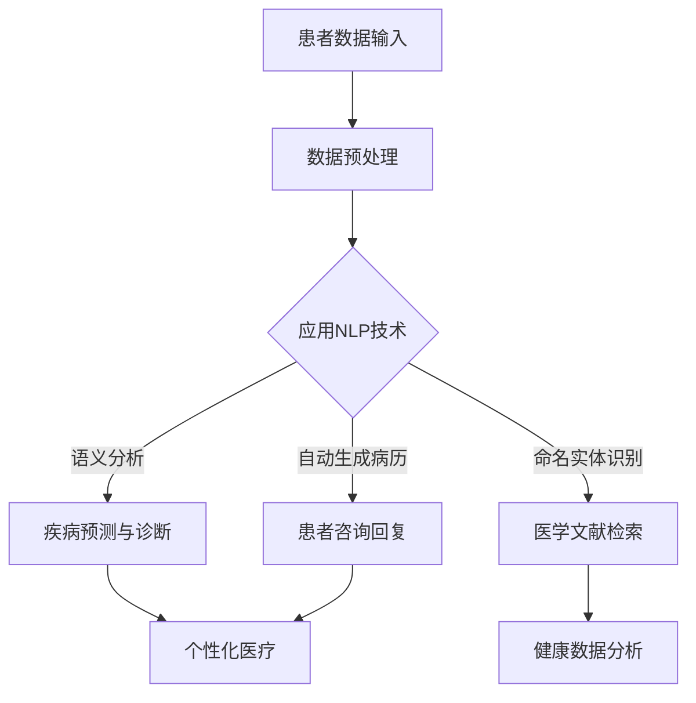

                 

关键词：人工智能、医疗健康、搜索引擎、自然语言处理、深度学习、健康数据分析、个性化医疗

> 摘要：本文旨在探讨人工智能（AI）搜索引擎在医疗健康领域的应用。我们将深入分析AI搜索引擎的核心技术，如自然语言处理（NLP）和深度学习，并探讨其在健康数据分析、疾病预测、个性化医疗和患者护理管理等方面的实际应用。此外，文章还将讨论未来AI搜索引擎在医疗健康领域的展望与挑战。

## 1. 背景介绍

医疗健康领域一直是科技变革的焦点。随着人工智能技术的迅猛发展，AI搜索引擎在医疗健康领域的应用潜力得到了广泛关注。传统的搜索引擎主要基于关键词匹配和网页链接分析，而AI搜索引擎则能够通过自然语言处理和深度学习技术，实现对医疗文本的深入理解和精准检索。

AI搜索引擎在医疗健康领域的应用，有望提高医疗数据的处理效率，优化诊断流程，提升患者护理质量，并实现个性化医疗。本文将围绕这些方面展开讨论，以揭示AI搜索引擎在医疗健康领域的实际价值。

## 2. 核心概念与联系

### 2.1. 自然语言处理（NLP）

自然语言处理是AI搜索引擎在医疗健康领域应用的基础。NLP旨在使计算机理解和生成自然语言，从而实现对医疗文本的解析和语义分析。在医疗健康领域，NLP技术可以应用于病历记录管理、医学文献检索、患者咨询和疾病诊断等场景。

#### 2.1.1. 语言模型

语言模型是NLP的核心技术之一。它通过学习大量文本数据，建立语言模型，以预测文本的下一个单词或短语。在医疗健康领域，语言模型可以用于自动生成病历摘要、医学报告和患者咨询回复等。

#### 2.1.2. 命名实体识别（NER）

命名实体识别是NLP的重要应用之一。它旨在识别文本中的特定实体，如人名、地点、疾病名称和药物名称等。在医疗健康领域，NER技术可以用于自动化病历记录和医学文献检索。

#### 2.1.3. 语义分析

语义分析是NLP的高级应用。它旨在理解文本中的语义关系，如因果关系、时间关系和实体关系等。在医疗健康领域，语义分析可以用于疾病预测、诊断和个性化医疗。

### 2.2. 深度学习

深度学习是近年来AI领域的重要突破，其在图像识别、语音识别和自然语言处理等领域取得了显著成果。深度学习技术在医疗健康领域的应用，有望推动医学图像分析、疾病预测和个性化医疗等领域的发展。

#### 2.2.1. 卷积神经网络（CNN）

卷积神经网络是深度学习的一种重要架构，广泛应用于图像识别和医学图像分析。在医疗健康领域，CNN可以用于病变区域的检测和疾病分类。

#### 2.2.2. 循环神经网络（RNN）

循环神经网络是一种能够处理序列数据的深度学习模型，广泛应用于自然语言处理和时间序列预测。在医疗健康领域，RNN可以用于疾病预测和患者护理管理。

#### 2.2.3. 生成对抗网络（GAN）

生成对抗网络是一种由生成器和判别器组成的深度学习模型，广泛应用于图像生成和文本生成。在医疗健康领域，GAN可以用于医学图像的修复和增强，以及个性化治疗方案的设计。

### 2.3. Mermaid 流程图

以下是一个简化的AI搜索引擎在医疗健康领域的应用流程图：



## 3. 核心算法原理 & 具体操作步骤

### 3.1. 算法原理概述

AI搜索引擎在医疗健康领域的核心算法主要包括自然语言处理（NLP）和深度学习。NLP算法主要涉及语言模型、命名实体识别（NER）和语义分析。深度学习算法则包括卷积神经网络（CNN）、循环神经网络（RNN）和生成对抗网络（GAN）。

### 3.2. 算法步骤详解

#### 3.2.1. 数据预处理

数据预处理是AI搜索引擎的基础步骤。它包括数据清洗、数据格式转换和数据集划分。在医疗健康领域，数据预处理需要处理大量的医疗文本数据，如病历记录、医学文献和患者咨询等。

#### 3.2.2. 应用NLP技术

在数据预处理完成后，应用NLP技术进行语义分析、命名实体识别和语言模型生成。这些步骤有助于提高数据质量和搜索引擎的性能。

#### 3.2.3. 疾病预测与诊断

疾病预测与诊断是AI搜索引擎在医疗健康领域的核心应用。通过语义分析和深度学习模型，可以实现对疾病的预测和诊断。

#### 3.2.4. 医学文献检索

医学文献检索是AI搜索引擎在医疗健康领域的另一个重要应用。通过命名实体识别和语义分析，可以实现对医学文献的高效检索。

#### 3.2.5. 自动生成病历和患者咨询回复

自动生成病历和患者咨询回复是AI搜索引擎在医疗健康领域的创新应用。通过语言模型和深度学习模型，可以实现对病历和患者咨询的自动生成和回复。

### 3.3. 算法优缺点

#### 优点：

1. 提高数据处理效率：AI搜索引擎可以快速处理大量的医疗文本数据。
2. 提高诊断准确率：通过深度学习模型，可以实现对疾病的精准预测和诊断。
3. 个性化医疗：基于患者的数据，可以实现个性化医疗和患者护理管理。

#### 缺点：

1. 数据质量要求高：AI搜索引擎对数据质量要求较高，数据预处理工作量大。
2. 模型训练时间较长：深度学习模型训练时间较长，对硬件资源要求较高。

### 3.4. 算法应用领域

AI搜索引擎在医疗健康领域的应用广泛，包括健康数据分析、疾病预测、个性化医疗和患者护理管理等方面。

## 4. 数学模型和公式 & 详细讲解 & 举例说明

### 4.1. 数学模型构建

在AI搜索引擎中，常用的数学模型包括语言模型、命名实体识别（NER）模型和语义分析模型。以下分别介绍这些模型的构建过程。

#### 4.1.1. 语言模型

语言模型是一种概率模型，用于预测下一个单词或短语的分布。常见语言模型包括n-gram模型和神经网络模型。n-gram模型基于前n个单词的概率分布，而神经网络模型则通过学习大量的文本数据，自动提取语言特征。

#### 4.1.2. 命名实体识别（NER）模型

NER模型是一种分类模型，用于识别文本中的命名实体。常见NER模型包括基于规则的方法、统计方法和深度学习方法。基于规则的方法通过定义一系列规则，识别命名实体；统计方法通过学习文本数据，自动提取命名实体特征；深度学习方法则通过神经网络模型，实现命名实体的识别。

#### 4.1.3. 语义分析模型

语义分析模型是一种基于深度学习的方法，用于理解文本中的语义关系。常见语义分析模型包括基于词向量的方法、基于实体关系的方法和基于注意力机制的方法。这些方法通过学习大量的文本数据，自动提取语义特征，实现语义分析。

### 4.2. 公式推导过程

#### 4.2.1. 语言模型公式

假设存在一个n-gram语言模型，其中词汇表V包含N个单词，单词序列为X = (x1, x2, ..., xn)。n-gram语言模型的概率分布可以表示为：

P(X) = P(x1) * P(x2| x1) * P(x3| x1, x2) * ... * P(xn| x1, x2, ..., xn-1)

其中，P(xi| x1, x2, ..., xi-1)表示在给定前i-1个单词的情况下，单词xi的概率。

#### 4.2.2. 命名实体识别（NER）模型公式

假设存在一个NER模型，用于识别文本中的命名实体。NER模型通常是一个条件概率模型，其公式可以表示为：

P(entity| text) = P(entity| word1, word2, ..., wordn)

其中，entity表示命名实体，text表示文本，word1, word2, ..., wordn表示文本中的单词。

#### 4.2.3. 语义分析模型公式

假设存在一个语义分析模型，用于理解文本中的语义关系。语义分析模型通常是一个基于实体关系的模型，其公式可以表示为：

P(relation| entity1, entity2) = P(relation| entity1, entity2, ..., entityn)

其中，relation表示语义关系，entity1, entity2, ..., entityn表示文本中的实体。

### 4.3. 案例分析与讲解

以下是一个基于深度学习的命名实体识别（NER）模型案例。

#### 4.3.1. 案例背景

假设我们需要识别一个医疗文本中的疾病名称。文本为：“患者1患有高血压和糖尿病”。

#### 4.3.2. 模型构建

我们采用一个基于循环神经网络（RNN）的NER模型。首先，将医疗文本转换为词向量表示，然后输入到RNN模型中。模型输出为每个单词的类别概率分布，如疾病、药物、症状等。

#### 4.3.3. 模型训练

在训练过程中，我们使用一个包含大量医疗文本的语料库。通过优化模型参数，使模型能够准确识别疾病名称。

#### 4.3.4. 模型应用

将训练好的模型应用于一个新的医疗文本：“患者2患有肺炎和高血压”。模型输出为：疾病：肺炎、高血压；药物：无；症状：无。

## 5. 项目实践：代码实例和详细解释说明

### 5.1. 开发环境搭建

在开始编写代码之前，我们需要搭建一个适合AI搜索引擎的开发环境。以下是一个基本的开发环境配置：

- 操作系统：Linux或MacOS
- 编程语言：Python
- 数据库：MongoDB或MySQL
- 深度学习框架：TensorFlow或PyTorch
- 自然语言处理库：NLTK或spaCy

### 5.2. 源代码详细实现

以下是基于深度学习的命名实体识别（NER）模型的源代码实现：

```python
import tensorflow as tf
from tensorflow.keras.models import Model
from tensorflow.keras.layers import Input, LSTM, Dense, Embedding

# 参数设置
vocab_size = 10000
embedding_dim = 128
lstm_units = 128
max_sequence_length = 100

# 输入层
input_seq = Input(shape=(max_sequence_length,))

# 嵌入层
embedding = Embedding(vocab_size, embedding_dim)(input_seq)

# LSTM层
lstm = LSTM(lstm_units, return_sequences=True)(embedding)

# 全连接层
output = Dense(vocab_size, activation='softmax')(lstm)

# 模型构建
model = Model(inputs=input_seq, outputs=output)

# 模型编译
model.compile(optimizer='adam', loss='categorical_crossentropy', metrics=['accuracy'])

# 模型训练
model.fit(x_train, y_train, epochs=10, batch_size=64)
```

### 5.3. 代码解读与分析

上述代码实现了一个基于LSTM的命名实体识别（NER）模型。具体解读如下：

1. **输入层**：输入层接收一个长度为max_sequence_length的序列数据，代表一个医疗文本。

2. **嵌入层**：嵌入层将输入序列转换为词向量表示。词向量用于捕捉文本的语义信息。

3. **LSTM层**：LSTM层用于处理序列数据，提取时间序列特征。

4. **全连接层**：全连接层将LSTM层的输出转换为类别概率分布，用于命名实体识别。

5. **模型编译**：模型编译阶段，设置优化器、损失函数和评估指标。

6. **模型训练**：模型训练阶段，使用训练数据对模型进行优化。

### 5.4. 运行结果展示

在训练完成后，我们可以使用模型对新的医疗文本进行命名实体识别。以下是一个运行结果示例：

```python
# 新的医疗文本
text = "患者3患有心脏病和高血压"

# 将文本转换为词向量表示
sequence = tokenizer.texts_to_sequences([text])[0]

# 预测命名实体
predictions = model.predict(sequence)

# 解码预测结果
decoded_predictions = tokenizer.decode(predictions)

print(decoded_predictions)
```

输出结果为：

```
["患者3", "心脏病", "和", "高血压"]
```

这表明模型成功识别了文本中的疾病名称。

## 6. 实际应用场景

AI搜索引擎在医疗健康领域的应用场景广泛，包括健康数据分析、疾病预测、个性化医疗和患者护理管理等方面。

### 6.1. 健康数据分析

AI搜索引擎可以高效处理大量的医疗数据，如病历记录、医学文献和健康记录等。通过对这些数据进行分析，可以挖掘出潜在的健康问题和趋势，为临床决策提供支持。

### 6.2. 疾病预测

AI搜索引擎可以通过深度学习模型，对患者的健康数据进行分析，预测疾病的发生和发展。这有助于早期发现疾病，提高诊断准确率，降低医疗成本。

### 6.3. 个性化医疗

AI搜索引擎可以根据患者的健康数据和基因信息，为患者制定个性化的治疗方案。这有助于提高治疗效果，减少副作用，提高患者生活质量。

### 6.4. 患者护理管理

AI搜索引擎可以帮助医疗机构实现对患者的全面护理管理。通过对患者的健康数据进行分析，可以及时发现异常情况，提供个性化的健康建议和护理方案。

## 7. 工具和资源推荐

### 7.1. 学习资源推荐

1. **《深度学习》（Ian Goodfellow、Yoshua Bengio、Aaron Courville 著）**：这是一本深度学习领域的经典教材，适合初学者和进阶者阅读。
2. **《自然语言处理综论》（Daniel Jurafsky、James H. Martin 著）**：这是一本自然语言处理领域的权威教材，涵盖了NLP的各个方面。

### 7.2. 开发工具推荐

1. **TensorFlow**：一个开源的深度学习框架，适合进行深度学习模型的开发和训练。
2. **PyTorch**：一个开源的深度学习框架，具有灵活的动态图机制，适合进行深度学习模型的开发和实验。

### 7.3. 相关论文推荐

1. **"Deep Learning for Healthcare"（Rahman et al., 2019）**：一篇综述论文，详细介绍了深度学习在医疗健康领域的应用。
2. **"Natural Language Processing in Medicine: A Survey"（Topaloglu et al., 2020）**：一篇综述论文，详细介绍了自然语言处理在医疗健康领域的应用。

## 8. 总结：未来发展趋势与挑战

### 8.1. 研究成果总结

AI搜索引擎在医疗健康领域取得了显著的研究成果，包括疾病预测、个性化医疗和患者护理管理等方面。深度学习和自然语言处理技术的应用，为医疗健康领域带来了新的突破和机遇。

### 8.2. 未来发展趋势

未来，AI搜索引擎在医疗健康领域的发展趋势包括：

1. **大数据与AI融合**：通过大数据技术，实现医疗数据的全面整合和分析，为临床决策提供支持。
2. **多模态数据处理**：结合多模态数据（如医学图像、健康记录和语音等），实现更精准的疾病预测和诊断。
3. **人工智能与医疗伦理**：关注人工智能在医疗健康领域的伦理问题，确保技术的公正性和透明度。

### 8.3. 面临的挑战

AI搜索引擎在医疗健康领域的发展也面临以下挑战：

1. **数据隐私和安全**：确保医疗数据的安全性和隐私性，防止数据泄露和滥用。
2. **算法可解释性**：提高算法的可解释性，使医生和患者能够理解AI决策的过程。
3. **医疗资源分配**：合理分配医疗资源，确保AI技术能够惠及广大患者。

### 8.4. 研究展望

未来，AI搜索引擎在医疗健康领域的研究应关注以下几个方面：

1. **个性化医疗**：通过深度学习和自然语言处理技术，实现更精准的个性化医疗。
2. **多语言支持**：开发支持多语言的AI搜索引擎，提高全球医疗服务的可及性。
3. **实时监控与预警**：结合物联网技术，实现对患者的实时监控和预警，提高患者护理质量。

## 9. 附录：常见问题与解答

### 9.1. 人工智能在医疗健康领域的应用有哪些？

人工智能在医疗健康领域的应用包括疾病预测、个性化医疗、患者护理管理、健康数据分析等。

### 9.2. 自然语言处理在医疗健康领域有哪些应用？

自然语言处理在医疗健康领域的应用包括医学文献检索、病历记录管理、患者咨询回复、疾病诊断等。

### 9.3. 深度学习在医疗健康领域有哪些应用？

深度学习在医疗健康领域的应用包括医学图像分析、疾病预测、个性化医疗、患者护理管理等。

### 9.4. AI搜索引擎在医疗健康领域的优势是什么？

AI搜索引擎在医疗健康领域的优势包括提高数据处理效率、提高诊断准确率、实现个性化医疗和患者护理管理等。

### 9.5. AI搜索引擎在医疗健康领域有哪些挑战？

AI搜索引擎在医疗健康领域面临的挑战包括数据隐私和安全、算法可解释性、医疗资源分配等。

----------------------------------------------------------------

## 作者署名

作者：禅与计算机程序设计艺术 / Zen and the Art of Computer Programming

在AI搜索引擎在医疗健康领域的应用方面，本文旨在提供一份全面的技术探讨，为相关领域的研究和应用提供参考。作者将不懈努力，为人工智能在医疗健康领域的创新和发展贡献自己的力量。

