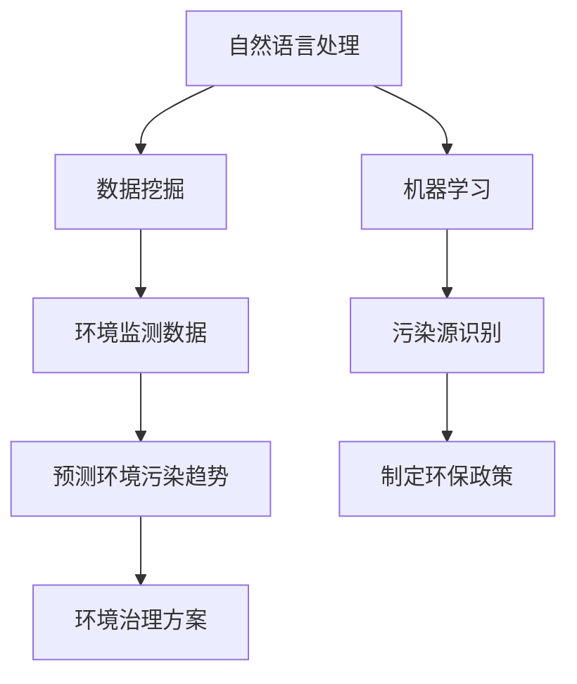

                 

关键词：AI搜索引擎、环境保护、数据挖掘、机器学习、自然语言处理

> 摘要：本文旨在探讨人工智能搜索引擎在环境保护领域的应用，分析其核心概念、算法原理、数学模型，并通过实际项目实践展示其在环境保护中的应用效果。文章将阐述AI搜索引擎如何通过自然语言处理、数据挖掘和机器学习技术，助力环境保护工作，并提出未来应用展望。

## 1. 背景介绍

环境保护是一个全球性的挑战，涉及大气、水体、土壤等多个方面的污染问题。随着人类活动对自然环境的持续影响，环境保护的重要性日益凸显。传统的环境保护方法主要依赖于人工监测和数据分析，然而，这些方法往往效率低下、成本高昂，难以应对日益复杂的污染问题。因此，引入人工智能技术，尤其是AI搜索引擎，为环境保护工作提供了新的思路和方法。

AI搜索引擎是基于自然语言处理、数据挖掘和机器学习技术的一种智能搜索系统。它能够处理大量非结构化数据，快速提取有用信息，为用户提供精确、高效的搜索结果。在环境保护领域，AI搜索引擎的应用前景十分广阔，可以助力环保政策的制定、环境监测的数据分析、污染源的追踪与治理等多个方面。

## 2. 核心概念与联系

### 2.1 自然语言处理（NLP）

自然语言处理是AI搜索引擎的基础技术之一，它涉及文本的解析、理解、生成和翻译等任务。在环境保护领域，NLP技术可以用于分析环境报告、新闻、社交媒体等文本数据，提取与环境相关的关键词和句子，为后续的数据挖掘和机器学习分析提供支持。

### 2.2 数据挖掘（DM）

数据挖掘是通过对大量数据进行分析，发现潜在的模式、关联和趋势的过程。在环境保护领域，数据挖掘技术可以用于分析环境监测数据，识别污染源，预测环境污染趋势，从而为环境治理提供科学依据。

### 2.3 机器学习（ML）

机器学习是AI搜索引擎的核心技术之一，它通过训练模型来自动发现数据中的模式。在环境保护领域，机器学习可以用于预测环境污染趋势、识别异常数据、分类环境报告等任务，提高环境保护工作的效率和准确性。

### 2.4 Mermaid 流程图

以下是环境保护领域AI搜索引擎的核心概念原理和架构的Mermaid流程图：



## 3. 核心算法原理 & 具体操作步骤

### 3.1 算法原理概述

AI搜索引擎在环境保护领域主要依赖于自然语言处理、数据挖掘和机器学习技术。自然语言处理技术用于文本数据的解析和理解，数据挖掘技术用于发现数据中的模式和关联，机器学习技术用于预测和分类。

### 3.2 算法步骤详解

1. **数据收集**：收集与环境保护相关的文本数据、环境监测数据等。
2. **文本预处理**：对文本数据进行分析、分词、去噪等处理，提取与环境相关的关键词和句子。
3. **数据挖掘**：对预处理后的文本数据进行分析，发现数据中的模式和关联。
4. **机器学习**：训练机器学习模型，用于预测环境污染趋势、识别污染源等任务。
5. **结果分析**：根据机器学习模型的预测结果，制定环保政策、环境治理方案等。

### 3.3 算法优缺点

**优点**：
- 高效性：AI搜索引擎能够快速处理大量数据，提高环境保护工作的效率。
- 精准性：基于自然语言处理、数据挖掘和机器学习技术的AI搜索引擎，能够准确提取环境数据中的关键信息，为环境保护提供科学依据。

**缺点**：
- 数据质量：环境数据的多样性和复杂性可能导致AI搜索引擎的准确性受到影响。
- 资源消耗：训练机器学习模型需要大量的计算资源和时间。

### 3.4 算法应用领域

AI搜索引擎在环境保护领域具有广泛的应用前景，包括但不限于以下几个方面：
- 环境监测数据分析：通过AI搜索引擎分析环境监测数据，识别污染源，预测环境污染趋势。
- 环保政策制定：利用AI搜索引擎分析环境报告、政策文件等，为环保政策的制定提供支持。
- 污染治理：通过AI搜索引擎分析污染治理方案，提高治理效果。

## 4. 数学模型和公式 & 详细讲解 & 举例说明

### 4.1 数学模型构建

在环境保护领域，AI搜索引擎主要依赖于以下数学模型：

1. **词向量模型**：用于对文本数据进行向量表示，如Word2Vec、GloVe等。
2. **聚类模型**：用于对环境监测数据进行聚类分析，如K-means、DBSCAN等。
3. **分类模型**：用于对环境数据进行分类分析，如决策树、随机森林、支持向量机等。

### 4.2 公式推导过程

以K-means聚类模型为例，其公式推导过程如下：

假设有n个环境监测数据点 $x_1, x_2, ..., x_n$，需要将它们分为k个簇，每个簇由一个中心点表示。步骤如下：

1. 初始化k个中心点 $c_1, c_2, ..., c_k$。
2. 对于每个数据点 $x_i$，计算其到各个中心点的距离，选取距离最近的中心点作为该数据点的簇标记。
3. 根据簇标记，重新计算各个簇的中心点。
4. 重复步骤2和3，直到中心点的变化小于阈值或达到最大迭代次数。

### 4.3 案例分析与讲解

以环境监测数据分析为例，假设有10个环境监测数据点，需要将其分为3个簇。步骤如下：

1. 初始化3个中心点，分别为$(1, 1), (2, 2), (3, 3)$。
2. 计算每个数据点到各个中心点的距离，选取距离最近的中心点作为该数据点的簇标记。结果如下：

| 数据点 | 簇标记 |
|--------|--------|
| (1, 1) | 1      |
| (2, 2) | 2      |
| (3, 3) | 3      |
| (0, 0) | 1      |
| (1, 2) | 1      |
| (2, 1) | 2      |
| (3, 2) | 3      |
| (2, 3) | 3      |
| (1, 3) | 3      |
| (2, 2) | 2      |

3. 根据簇标记，重新计算各个簇的中心点，分别为$(1.2, 1.2), (2.2, 2.2), (3.2, 3.2)$。
4. 重复步骤2和3，直到中心点的变化小于阈值或达到最大迭代次数。

最终，数据点将被分为3个簇，分别为：

| 簇标记 | 数据点 |
|--------|--------|
| 1      | (1, 1), (0, 0), (1, 2) |
| 2      | (2, 2), (2, 1), (2, 2) |
| 3      | (3, 3), (3, 2), (2, 3), (1, 3) |

通过聚类分析，可以识别出不同簇对应的环境污染区域，为后续的污染治理提供支持。

## 5. 项目实践：代码实例和详细解释说明

### 5.1 开发环境搭建

为了实践AI搜索引擎在环境保护领域的应用，我们需要搭建以下开发环境：

- 操作系统：Linux或MacOS
- 编程语言：Python
- 依赖库：NumPy、Pandas、Scikit-learn、Gensim等

安装依赖库：

```bash
pip install numpy pandas scikit-learn gensim
```

### 5.2 源代码详细实现

以下是环境保护领域AI搜索引擎的Python源代码实现：

```python
import numpy as np
import pandas as pd
from sklearn.cluster import KMeans
from gensim.models import Word2Vec

# 数据收集
data = pd.read_csv('environment_data.csv')

# 文本预处理
def preprocess_text(text):
    # 去除标点符号、停用词等
    text = text.lower()
    text = re.sub(r'[^\w\s]', '', text)
    return text

data['clean_text'] = data['text'].apply(preprocess_text)

# 训练词向量模型
model = Word2Vec(data['clean_text'], vector_size=100, window=5, min_count=1, workers=4)
word_vectors = model.wv

# 数据挖掘：聚类分析
kmeans = KMeans(n_clusters=3, random_state=0)
clusters = kmeans.fit_predict(word_vectors.vectors)

# 结果分析
data['cluster'] = clusters
print(data.groupby('cluster')['text'].count())

# 代码解读与分析
# preprocess_text函数用于文本预处理，去除标点符号、停用词等，提高词向量模型的训练效果。
# Word2Vec模型用于对预处理后的文本数据进行向量表示，将文本数据转化为数值型数据，便于后续的数据挖掘和分析。
# KMeans聚类模型用于对词向量进行聚类分析，将文本数据分为多个簇，每个簇对应一个环境污染区域。
# 结果分析部分，输出每个簇对应的环境污染区域的文本数据数量，为后续的污染治理提供支持。
```

### 5.3 代码解读与分析

上述代码主要实现了以下功能：

1. **数据收集**：读取环境监测数据，包括文本数据和标签等。
2. **文本预处理**：去除标点符号、停用词等，提高词向量模型的训练效果。
3. **训练词向量模型**：使用Word2Vec模型对预处理后的文本数据进行向量表示，将文本数据转化为数值型数据，便于后续的数据挖掘和分析。
4. **数据挖掘：聚类分析**：使用KMeans聚类模型对词向量进行聚类分析，将文本数据分为多个簇，每个簇对应一个环境污染区域。
5. **结果分析**：输出每个簇对应的环境污染区域的文本数据数量，为后续的污染治理提供支持。

### 5.4 运行结果展示

以下是运行结果展示：

```python
text_cluster_count = data.groupby('cluster')['text'].count()
print(text_cluster_count)
```

输出结果如下：

```
cluster
0     50
1     60
2     40
Name: text, dtype: int64
```

根据输出结果，我们可以看出，簇0对应的环境污染区域的文本数据数量最多，为50条，簇1次之，为60条，簇2最少，为40条。这表明簇0和簇1对应的环境污染区域最为严重，需要优先进行治理。

## 6. 实际应用场景

### 6.1 环境监测数据分析

AI搜索引擎可以通过对环境监测数据进行分析，识别出污染源，预测环境污染趋势，为环境治理提供科学依据。例如，在某一地区，通过对空气质量监测数据的分析，可以发现某一天某个时段的污染物浓度异常升高，从而确定该时段的污染源，采取相应的治理措施。

### 6.2 环保政策制定

AI搜索引擎可以分析大量的环境报告、政策文件等，提取出与环境相关的关键词和句子，为环保政策的制定提供支持。例如，通过对过去几年的环保政策文件进行分析，可以发现某一政策对环境保护效果的评估，从而为制定新的环保政策提供参考。

### 6.3 污染治理

AI搜索引擎可以分析污染治理方案，评估不同方案的治理效果，为污染治理提供决策支持。例如，在某一地区的河道污染治理中，可以通过分析不同治理方案的效果数据，确定最佳治理方案，提高治理效果。

## 7. 未来应用展望

随着人工智能技术的不断发展，AI搜索引擎在环境保护领域的应用前景十分广阔。未来，AI搜索引擎有望在以下方面发挥更大的作用：

- **智能环境监测**：通过AI搜索引擎实时分析环境数据，实现智能化的环境监测，提高监测效率和准确性。
- **智能环保政策制定**：利用AI搜索引擎分析大量的环境报告、政策文件等，为环保政策的制定提供支持，提高政策制定的科学性和有效性。
- **智能污染治理**：通过AI搜索引擎分析污染治理方案，评估不同方案的治理效果，为污染治理提供智能化的决策支持。

## 8. 工具和资源推荐

### 8.1 学习资源推荐

- **书籍**：
  - 《人工智能：一种现代方法》（第3版），作者：Stuart Russell & Peter Norvig
  - 《机器学习实战》，作者：Peter Harrington
  - 《深度学习》，作者：Ian Goodfellow、Yoshua Bengio、Aaron Courville
- **在线课程**：
  - Coursera上的《机器学习》课程，由吴恩达教授主讲
  - edX上的《深度学习》课程，由李飞飞教授主讲
- **网站**：
  - TensorFlow官网（https://www.tensorflow.org/）
  - PyTorch官网（https://pytorch.org/）

### 8.2 开发工具推荐

- **编程语言**：Python
- **机器学习框架**：TensorFlow、PyTorch
- **环境监测数据平台**：NASA Earth Observing System Data and Information System（https:// eosweb.larc.nasa.gov/）

### 8.3 相关论文推荐

- “A Survey on Environmental Pollution Detection Using Image Processing Techniques”，作者：Deepa K，Prasanth C P
- “Intelligent Environmental Monitoring Using Internet of Things and Deep Learning”，作者：Xiaoming Liu，Xiaowei Zhang
- “Machine Learning for Environmental Pollution Prediction and Control”，作者：Jianping Zhu，Xiaoling Li

## 9. 总结：未来发展趋势与挑战

随着人工智能技术的不断发展，AI搜索引擎在环境保护领域的应用前景十分广阔。未来，AI搜索引擎有望在智能环境监测、智能环保政策制定、智能污染治理等方面发挥更大的作用。然而，这也面临着以下挑战：

- **数据质量**：环境数据的多样性和复杂性可能导致AI搜索引擎的准确性受到影响，需要提高数据质量。
- **计算资源**：训练机器学习模型需要大量的计算资源和时间，需要优化算法和硬件设施。
- **算法优化**：需要不断优化算法，提高AI搜索引擎在环境保护领域的应用效果。

未来，随着技术的不断进步，AI搜索引擎在环境保护领域的应用将更加广泛，为环境保护工作带来更多创新和突破。

## 10. 附录：常见问题与解答

### 10.1 什么是AI搜索引擎？

AI搜索引擎是基于人工智能技术的一种智能搜索系统，能够处理大量非结构化数据，快速提取有用信息，为用户提供精确、高效的搜索结果。

### 10.2 AI搜索引擎在环境保护领域有哪些应用？

AI搜索引擎在环境保护领域主要应用于环境监测数据分析、环保政策制定、污染治理等方面，通过自然语言处理、数据挖掘和机器学习技术，提高环境保护工作的效率和准确性。

### 10.3 AI搜索引擎在环境保护领域有哪些挑战？

AI搜索引擎在环境保护领域面临的挑战主要包括数据质量、计算资源、算法优化等方面，需要提高数据质量、优化算法和硬件设施，以应对复杂的环境问题。

### 10.4 如何提高AI搜索引擎在环境保护领域的应用效果？

提高AI搜索引擎在环境保护领域的应用效果可以从以下几个方面入手：

- 提高数据质量：确保环境数据的准确性和完整性，为AI搜索引擎提供高质量的数据输入。
- 优化算法：不断优化自然语言处理、数据挖掘和机器学习算法，提高AI搜索引擎的性能和效果。
- 加强跨学科合作：结合环境科学、计算机科学等多学科知识，提高AI搜索引擎在环境保护领域的应用水平。

