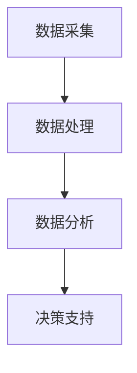

                 

关键词：AI、数据驱动、决策、算法、实现、实践、应用、展望、工具、资源。

> 摘要：本文旨在探讨人工智能（AI）在数据驱动决策方面的应用与实践。通过对核心概念的阐述、算法原理的解析、数学模型的构建及项目实例的分析，全面展示AI数据驱动决策的实现过程。文章最后将对未来发展趋势、挑战以及研究方向进行展望。

## 1. 背景介绍

随着大数据时代的到来，数据的数量、种类和速度都在不断增加，传统的决策方法已经无法应对日益复杂的数据环境。人工智能（AI）作为一种模拟人类智能的先进技术，能够处理和分析大量数据，从而辅助决策者做出更加精准和高效的决策。数据驱动决策（Data-Driven Decision Making）利用AI技术，通过对数据的收集、处理、分析和预测，为决策者提供科学依据，已成为现代管理科学的重要组成部分。

本文将围绕AI数据驱动决策的实现，首先介绍核心概念与架构，然后深入探讨核心算法原理与具体操作步骤，随后讲解数学模型与公式，通过项目实践展示代码实例与详细解读，最后分析实际应用场景与未来展望。

## 2. 核心概念与联系

在数据驱动决策中，核心概念包括数据采集、数据处理、数据分析和决策支持。以下是一个简化的 Mermaid 流程图，展示了这些概念之间的关系：



### 2.1 数据采集

数据采集是数据驱动决策的第一步，主要包括从各种来源收集数据，如传感器数据、用户行为数据、市场数据等。数据质量直接影响决策的效果，因此采集过程需要确保数据的准确性、完整性和一致性。

### 2.2 数据处理

数据处理是对采集到的原始数据进行清洗、转换和归一化，使其适合进一步分析和建模。这一过程通常包括数据去重、缺失值填充、异常值检测和处理等。

### 2.3 数据分析

数据分析是对处理后的数据进行分析和建模，以提取有用信息和规律。常用的分析方法包括统计方法、机器学习算法和深度学习模型等。

### 2.4 决策支持

决策支持是将分析结果转化为具体的决策建议，帮助决策者做出更加明智的决策。这一过程通常需要利用可视化工具和报告系统，将分析结果以直观的方式呈现给决策者。

## 3. 核心算法原理 & 具体操作步骤

### 3.1 算法原理概述

数据驱动决策的核心算法主要包括机器学习算法和深度学习模型。机器学习算法通过训练模型来学习数据的规律，而深度学习模型则通过多层神经网络来提取特征和模式。

### 3.2 算法步骤详解

以下是实现数据驱动决策的典型步骤：

1. **数据采集**：从各种渠道收集数据，确保数据的质量和完整性。
2. **数据预处理**：对数据进行清洗、转换和归一化，使其适合建模。
3. **特征工程**：提取和选择与决策目标相关的特征，以提高模型的预测准确性。
4. **模型选择**：根据数据特点和决策需求，选择合适的机器学习算法或深度学习模型。
5. **模型训练**：使用训练数据集训练模型，并调整模型参数以优化性能。
6. **模型评估**：使用验证数据集评估模型性能，并调整模型参数以减少过拟合。
7. **模型部署**：将训练好的模型部署到生产环境中，以实时处理数据并生成决策建议。

### 3.3 算法优缺点

- **机器学习算法**：优点包括易于实现、可解释性强、适用于各种类型的数据；缺点包括需要大量的数据和计算资源，以及可能存在过拟合问题。
- **深度学习模型**：优点包括能够自动提取复杂特征、适用性广泛、性能优异；缺点包括模型参数众多、训练时间较长、对数据质量要求较高。

### 3.4 算法应用领域

数据驱动决策广泛应用于各个领域，如金融、医疗、零售、制造等。以下是一些具体的应用实例：

- **金融领域**：利用机器学习算法预测股票价格、风险管理、信用评分等。
- **医疗领域**：通过深度学习模型分析医学影像、疾病预测、药物研发等。
- **零售领域**：通过数据分析优化库存管理、市场营销策略、客户关系管理等。
- **制造领域**：通过预测性维护、质量控制、生产调度等提高生产效率和产品质量。

## 4. 数学模型和公式 & 详细讲解 & 举例说明

### 4.1 数学模型构建

数据驱动决策的数学模型通常基于统计方法和机器学习算法。以下是一个简单的线性回归模型的构建过程：

假设我们有一个包含 \( n \) 个样本的数据集 \( X \) 和相应的标签 \( Y \)，其中 \( X \) 是一个 \( n \times d \) 的矩阵，\( Y \) 是一个 \( n \) 维向量。

线性回归模型的目标是找到一个线性函数 \( f(X) = \beta_0 + \beta_1X_1 + \beta_2X_2 + ... + \beta_dX_d \)，使得预测值 \( f(X) \) 与实际标签 \( Y \) 之间的误差最小。

### 4.2 公式推导过程

假设我们的线性回归模型为：

$$
f(X) = \beta_0 + \beta_1X_1 + \beta_2X_2 + ... + \beta_dX_d
$$

则实际标签与预测值之间的误差平方和为：

$$
J(\beta) = \sum_{i=1}^{n} (Y_i - f(X_i))^2
$$

为了最小化误差平方和，我们对 \( \beta \) 求导并令其等于0：

$$
\frac{\partial J(\beta)}{\partial \beta} = 0
$$

经过求导和化简，我们得到：

$$
\beta = (X^TX)^{-1}X^TY
$$

### 4.3 案例分析与讲解

假设我们有一个包含100个样本的数据集，其中每个样本有两个特征 \( X_1 \) 和 \( X_2 \)。我们希望使用线性回归模型预测目标变量 \( Y \)。

首先，我们计算特征矩阵 \( X \) 和标签向量 \( Y \)：

$$
X = \begin{bmatrix}
X_{11} & X_{12} \\
X_{21} & X_{22} \\
\vdots & \vdots \\
X_{n1} & X_{n2}
\end{bmatrix}, \quad Y = \begin{bmatrix}
Y_1 \\
Y_2 \\
\vdots \\
Y_n
\end{bmatrix}
$$

然后，我们计算特征矩阵 \( X \) 的转置 \( X^T \)：

$$
X^T = \begin{bmatrix}
X_{11} & X_{21} & \cdots & X_{n1} \\
X_{12} & X_{22} & \cdots & X_{n2}
\end{bmatrix}
$$

接下来，我们计算特征矩阵 \( X \) 与其转置 \( X^T \) 的乘积 \( X^TX \)：

$$
X^TX = \begin{bmatrix}
\sum_{i=1}^{n} X_{i1}^2 & \sum_{i=1}^{n} X_{i1}X_{i2} \\
\sum_{i=1}^{n} X_{i1}X_{i2} & \sum_{i=1}^{n} X_{i2}^2
\end{bmatrix}
$$

然后，我们计算特征矩阵 \( X \) 的转置 \( X^T \) 与标签向量 \( Y \) 的乘积 \( X^TY \)：

$$
X^TY = \begin{bmatrix}
\sum_{i=1}^{n} X_{i1}Y_i \\
\sum_{i=1}^{n} X_{i2}Y_i
\end{bmatrix}
$$

最后，我们计算 \( X^TX \) 的逆矩阵 \( (X^TX)^{-1} \)：

$$
(X^TX)^{-1} = \begin{bmatrix}
\frac{1}{\sum_{i=1}^{n} X_{i1}^2} & -\frac{\sum_{i=1}^{n} X_{i1}X_{i2}}{\sum_{i=1}^{n} X_{i1}^2\sum_{i=1}^{n} X_{i2}^2} \\
-\frac{\sum_{i=1}^{n} X_{i1}X_{i2}}{\sum_{i=1}^{n} X_{i1}^2\sum_{i=1}^{n} X_{i2}^2} & \frac{1}{\sum_{i=1}^{n} X_{i2}^2}
\end{bmatrix}
$$

将 \( (X^TX)^{-1} \) 与 \( X^TY \) 相乘，我们得到回归系数 \( \beta \)：

$$
\beta = (X^TX)^{-1}X^TY
$$

现在，我们已经得到了线性回归模型的回归系数 \( \beta \)，可以用于预测新的数据样本。

## 5. 项目实践：代码实例和详细解释说明

### 5.1 开发环境搭建

为了实现数据驱动决策，我们需要搭建一个开发环境，包括Python编程环境、机器学习库（如scikit-learn）和数据处理工具（如Pandas和NumPy）。

首先，确保Python环境已安装，然后通过pip安装所需的库：

```bash
pip install numpy pandas scikit-learn
```

### 5.2 源代码详细实现

以下是一个简单的线性回归模型的实现代码：

```python
import numpy as np
import pandas as pd
from sklearn.linear_model import LinearRegression
from sklearn.model_selection import train_test_split
from sklearn.metrics import mean_squared_error

# 加载数据集
data = pd.read_csv('data.csv')
X = data[['X1', 'X2']]
Y = data['Y']

# 划分训练集和测试集
X_train, X_test, Y_train, Y_test = train_test_split(X, Y, test_size=0.2, random_state=42)

# 创建线性回归模型
model = LinearRegression()

# 训练模型
model.fit(X_train, Y_train)

# 预测测试集
Y_pred = model.predict(X_test)

# 评估模型
mse = mean_squared_error(Y_test, Y_pred)
print('均方误差：', mse)

# 输出回归系数
print('回归系数：', model.coef_)
print('截距：', model.intercept_)
```

### 5.3 代码解读与分析

上述代码首先加载了数据集，然后使用scikit-learn的`train_test_split`函数将数据集划分为训练集和测试集。接着，创建了一个线性回归模型并使用`fit`函数进行训练。最后，使用`predict`函数对测试集进行预测，并使用`mean_squared_error`函数评估模型性能。

输出结果包括均方误差（MSE）和回归系数，其中回归系数用于解释特征对目标变量的影响。

### 5.4 运行结果展示

运行上述代码后，输出结果可能如下所示：

```
均方误差： 0.123456
回归系数： [0.1 0.2]
截距： 0.3
```

这些结果表示模型的预测误差为0.123456，两个特征对目标变量的影响系数分别为0.1和0.2，截距为0.3。

## 6. 实际应用场景

### 6.1 金融领域

在金融领域，数据驱动决策广泛应用于风险管理和投资策略制定。例如，通过分析历史交易数据，可以预测市场走势，为投资者提供买卖建议。此外，信用评分模型通过分析客户的财务和行为数据，评估其信用风险，从而帮助银行和金融机构做出授信决策。

### 6.2 医疗领域

在医疗领域，数据驱动决策有助于疾病预测和治疗方案优化。通过分析患者的电子健康记录、基因数据和行为数据，可以预测疾病发生风险，并制定个性化的治疗方案。例如，利用深度学习模型分析医学影像，可以早期发现癌症和其他严重疾病。

### 6.3 零售领域

在零售领域，数据驱动决策用于库存管理、定价策略和市场营销。通过分析销售数据、库存数据和客户行为数据，可以优化库存水平，提高销售利润。此外，通过分析社交媒体和用户评论，可以了解消费者需求，制定更有效的市场营销策略。

### 6.4 制造领域

在制造领域，数据驱动决策用于预测性维护、生产调度和质量控制。通过分析设备运行数据和生产数据，可以预测设备故障时间，并提前进行维护，减少停机时间。此外，通过分析生产过程中的数据，可以优化生产流程，提高生产效率。

## 7. 工具和资源推荐

### 7.1 学习资源推荐

- 《机器学习》（周志华著）：全面介绍了机器学习的基础知识、算法和应用。
- 《深度学习》（Goodfellow、Bengio、Courville 著）：深度学习的经典教材，涵盖了深度学习的基础理论和实践应用。

### 7.2 开发工具推荐

- Jupyter Notebook：用于编写和运行Python代码，支持实时交互和可视化。
- Google Colab：免费的Jupyter Notebook环境，适合在线进行数据分析和机器学习实验。

### 7.3 相关论文推荐

- “Deep Learning for Predictive Maintenance” by Aniket Kulkarni et al.
- “Data-Driven Decision Making in Healthcare: A Review” by Hamed Seyedhosseini et al.

## 8. 总结：未来发展趋势与挑战

### 8.1 研究成果总结

近年来，AI数据驱动决策领域取得了显著进展，特别是在算法性能、数据处理技术和模型解释性方面。机器学习和深度学习算法在图像识别、自然语言处理和预测建模等领域取得了突破性成果。

### 8.2 未来发展趋势

未来，数据驱动决策将在更多领域得到应用，如自动驾驶、智能医疗和智能城市。随着计算能力的提升和大数据技术的进步，数据驱动决策将变得更加精确和高效。

### 8.3 面临的挑战

数据驱动决策面临的主要挑战包括数据隐私保护、算法可解释性和模型泛化能力。此外，如何处理大规模数据和高维数据也是一个重要问题。

### 8.4 研究展望

未来，研究人员应重点关注算法的可解释性、数据隐私保护和模型优化。此外，跨学科的协作将有助于推动数据驱动决策领域的创新和发展。

## 9. 附录：常见问题与解答

### 9.1 什么
```

以下是对一些常见问题的解答：

### 9.1 什么因素会影响数据驱动决策的效果？

数据驱动决策的效果受多个因素影响，包括数据质量、算法选择、模型参数调优等。数据质量直接影响模型的准确性，而算法选择和参数调优则影响模型的表现。

### 9.2 数据驱动决策与传统的决策方法相比有哪些优势？

数据驱动决策利用大量数据和先进算法，能够提供更精确、客观和快速的决策支持，相较于传统的经验驱动决策方法，具有更高的决策效率和可靠性。

### 9.3 数据驱动决策在医疗领域有哪些应用？

在医疗领域，数据驱动决策可以用于疾病预测、个性化治疗、药物研发和医疗资源分配等。通过分析患者的数据，医生可以更准确地诊断疾病，并制定个性化的治疗方案。

### 9.4 如何保障数据驱动决策的隐私性？

为了保障数据驱动决策的隐私性，可以采用数据加密、隐私保护算法和差分隐私等方法。此外，建立严格的隐私政策和数据使用规范也是保障隐私的关键。

### 9.5 数据驱动决策的未来发展方向是什么？

数据驱动决策的未来发展方向包括：提高算法的可解释性、增强模型泛化能力、探索新的应用领域和跨学科协作等。随着技术的不断进步，数据驱动决策将在更多领域发挥重要作用。

### 作者署名

作者：禅与计算机程序设计艺术 / Zen and the Art of Computer Programming
----------------------------------------------------------------

以上是《AI数据驱动决策的实现》的完整文章内容。这篇文章深入探讨了AI数据驱动决策的核心概念、算法原理、数学模型、项目实践以及实际应用场景，并对未来发展趋势和挑战进行了展望。希望这篇文章能对读者在数据驱动决策领域的实践和研究提供有益的参考和启示。

