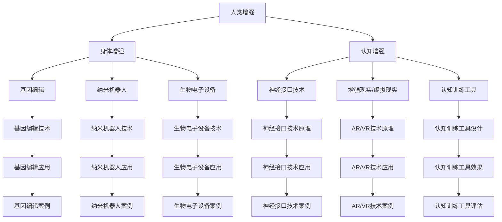

                 

关键词：人工智能，人类增强，道德考虑，身体增强，未来发展，机遇分析

> 摘要：随着人工智能技术的飞速发展，人类增强成为一个热门话题。本文从道德考虑和身体增强两大方面出发，探讨了人类增强技术的发展趋势、机遇与挑战，并对未来可能的应用场景进行了展望。

## 1. 背景介绍

随着人工智能技术的不断进步，人类开始探索如何将人工智能与人体结合，实现人类增强。人类增强包括身体增强和认知增强两个方面，旨在提高人类的身体能力、智力和工作效能。然而，这一领域的快速发展也引发了一系列道德、伦理和社会问题。本文将重点讨论道德考虑在人类增强中的重要性，并分析身体增强的未来发展机遇。

### 1.1 人类增强的定义与发展

人类增强是指通过技术手段提高人类的生理和心理能力，使其在特定任务中表现得更加出色。人类增强可以追溯到古代，如使用武器和装备来增强身体力量。然而，随着科技的发展，人类增强的内涵和外延也在不断拓展。

近年来，随着生物技术、纳米技术、神经科学等领域的突破，人类增强技术得到了快速发展。例如，基因编辑技术可以用来增强人类的免疫力、抗病能力；神经接口技术可以实现人脑与外部设备的直接连接，提高人类的认知能力。

### 1.2 人类增强技术的分类

人类增强技术可以分为两大类：身体增强和认知增强。

**身体增强**：身体增强主要关注提高人类的身体能力，如力量、速度、耐力等。具体技术包括：

- **基因编辑**：通过修改人类基因，增强其生理特性。
- **纳米机器人**：在人体内释放纳米机器人，协助细胞修复、再生。
- **生物电子设备**：如植入式心脏起搏器、人工耳蜗等。

**认知增强**：认知增强主要关注提高人类的智力、学习能力和工作效率。具体技术包括：

- **神经接口技术**：通过将电极植入大脑，实现人脑与外部设备的直接连接。
- **增强现实（AR）与虚拟现实（VR）**：通过模拟环境，提高人类的认知能力。
- **认知训练工具**：如脑机接口游戏、记忆训练软件等。

## 2. 核心概念与联系

为了更好地理解人类增强技术的核心概念，我们需要构建一个包括关键术语和它们之间关系的 Mermaid 流程图。以下是该流程图的一个示例：



在这个流程图中，我们定义了以下几个核心概念：

- **人类增强**：是人类增强技术的总称。
- **身体增强**：涉及提高人体生理能力的技术。
- **认知增强**：涉及提高人类智力、学习能力和工作效率的技术。
- **基因编辑**：通过修改人类基因，增强其生理特性的技术。
- **纳米机器人**：在人体内执行特定任务的微型机器人。
- **生物电子设备**：植入人体，用于监测、修复或增强人体功能的设备。
- **神经接口技术**：实现人脑与外部设备直接连接的技术。
- **增强现实/虚拟现实**：通过技术手段模拟现实环境，提高人类认知能力。
- **认知训练工具**：专门设计来提高人类认知能力的工具。

这些核心概念之间存在着紧密的联系。例如，基因编辑技术可以直接应用于身体增强，而神经接口技术则可以用于认知增强。此外，增强现实/虚拟现实技术和认知训练工具也可以相互补充，共同提高人类的认知能力。

### 2.1 人类增强技术的伦理考量

在探讨人类增强技术的核心概念时，我们不能忽视其伦理考量。人类增强技术不仅涉及技术层面的进步，还涉及道德和伦理问题。以下是几个值得关注的伦理问题：

- **基因编辑**：基因编辑技术可以用来治疗遗传病，但也可能被用于非医疗目的，如优化人类基因。这引发了关于基因编辑是否应该被限制、如何限制的讨论。
- **隐私权**：随着神经接口技术的发展，人类增强技术可能会侵犯个人隐私。例如，通过读取大脑活动来获取个人信息，这引发了关于隐私保护和数据安全的讨论。
- **社会公平**：人类增强技术可能会加剧社会不平等。例如，只有富裕人群能够负担起昂贵的基因编辑和神经接口技术，这可能导致社会阶层分化。

在接下来的章节中，我们将进一步探讨人类增强技术的具体实现方法、应用领域和面临的挑战。

## 3. 核心算法原理 & 具体操作步骤

### 3.1 算法原理概述

人类增强技术的核心算法主要集中在身体增强和认知增强两个方面。以下分别介绍这两方面的算法原理。

#### 身体增强算法原理

身体增强算法主要涉及基因编辑、纳米机器人技术、生物电子设备等。这些算法的原理可以概括为：

1. **基因编辑**：通过修改特定基因序列，增强人类的生理特性。这通常涉及 CRISPR-Cas9 等基因编辑技术。
2. **纳米机器人技术**：设计并释放纳米机器人，协助细胞修复、再生。这些纳米机器人通常由蛋白质和 DNA 组成。
3. **生物电子设备技术**：开发植入式设备，用于监测、修复或增强人体功能。例如，人工心脏起搏器、人工耳蜗等。

#### 认知增强算法原理

认知增强算法主要涉及神经接口技术、增强现实/虚拟现实技术和认知训练工具。这些算法的原理可以概括为：

1. **神经接口技术**：通过将电极植入大脑，实现人脑与外部设备的直接连接。这可以用于读取和操纵大脑信号。
2. **增强现实/虚拟现实技术**：通过技术手段模拟现实环境，提高人类认知能力。例如，VR 头盔可以提供沉浸式的虚拟体验。
3. **认知训练工具设计**：开发专门设计来提高人类认知能力的工具，如脑机接口游戏、记忆训练软件等。

### 3.2 算法步骤详解

下面我们详细探讨每个算法的具体操作步骤。

#### 3.2.1 基因编辑算法步骤

1. **目标基因识别**：首先，需要确定要编辑的基因。这通常涉及基因组测序和生物信息学分析。
2. **设计 CRISPR 模板**：根据目标基因，设计合适的 CRISPR 模板。这包括序列设计和筛选。
3. **基因编辑**：将 CRISPR 模板和 Cas9 蛋白质注入细胞中，实现基因编辑。这通常涉及实验室技术，如电穿孔或病毒载体。
4. **编辑验证**：通过 PCR、测序等技术验证基因编辑效果。

#### 3.2.2 纳米机器人算法步骤

1. **纳米机器人设计**：根据任务需求，设计纳米机器人的结构和功能。这通常涉及材料科学和纳米技术的发展。
2. **纳米机器人制造**：制造纳米机器人，通常涉及光刻、电化学沉积等技术。
3. **纳米机器人注入**：将纳米机器人注入人体特定部位，如血液或细胞组织。
4. **任务执行**：纳米机器人在人体内执行特定任务，如细胞修复、再生等。

#### 3.2.3 生物电子设备算法步骤

1. **生物电子设备设计**：根据需求，设计生物电子设备，如人工心脏起搏器、人工耳蜗等。
2. **生物电子设备制造**：制造生物电子设备，通常涉及微电子技术和生物材料技术。
3. **设备植入**：将生物电子设备植入人体，通常涉及外科手术。
4. **设备监测与控制**：通过传感器和通信技术，监测和控制生物电子设备。

#### 3.2.4 神经接口技术算法步骤

1. **电极设计**：设计电极，用于植入大脑或神经系统。
2. **电极植入**：通过手术将电极植入大脑或神经系统。
3. **信号读取与处理**：读取大脑信号，并通过算法进行处理，如信号放大、滤波、特征提取等。
4. **信号输出与控制**：将处理后的信号输出到外部设备，如计算机、机器人等，以实现人脑与外部设备的直接连接。

#### 3.2.5 增强现实/虚拟现实技术算法步骤

1. **场景模拟**：根据应用需求，模拟虚拟环境或增强现实场景。
2. **视觉处理**：通过视觉处理算法，生成虚拟图像或增强现实图像。
3. **显示输出**：将生成的图像输出到显示设备，如 VR 头盔、AR 眼镜等。
4. **用户交互**：通过传感器和交互设备，实现用户与虚拟环境或增强现实场景的交互。

#### 3.2.6 认知训练工具设计步骤

1. **目标设定**：根据认知训练需求，设定训练目标，如注意力、记忆、反应速度等。
2. **工具设计**：设计认知训练工具，如脑机接口游戏、记忆训练软件等。
3. **工具实现**：实现认知训练工具，通常涉及编程和软件开发。
4. **工具评估**：通过实验和评估，验证认知训练工具的效果。

### 3.3 算法优缺点

每种算法都有其优缺点。以下分别总结身体增强算法和认知增强算法的优缺点。

#### 身体增强算法优缺点

**优点**：

- 提高人体生理能力，如力量、速度、耐力等。
- 治疗遗传病和其他疾病。
- 提高人类的工作效率和生产力。

**缺点**：

- 基因编辑技术可能引发伦理和社会问题。
- 纳米机器人技术尚未成熟，存在安全性和可靠性问题。
- 生物电子设备可能引发免疫反应和设备失效。

#### 认知增强算法优缺点

**优点**：

- 提高人类智力、学习能力和工作效率。
- 增强人类的适应能力和创新能力。
- 治疗认知障碍和其他神经系统疾病。

**缺点**：

- 神经接口技术可能引发神经损伤和安全性问题。
- 增强现实/虚拟现实技术可能导致现实与虚拟的混淆。
- 认知训练工具效果可能因个体差异而不同。

### 3.4 算法应用领域

人类增强算法在多个领域具有广泛的应用前景。以下分别介绍身体增强算法和认知增强算法的应用领域。

#### 身体增强算法应用领域

- **体育竞技**：通过基因编辑和纳米机器人技术，提高运动员的体能和竞技水平。
- **军事应用**：通过基因编辑和生物电子设备，提高士兵的战斗力。
- **医疗保健**：通过基因编辑和纳米机器人技术，治疗遗传病和其他疾病。

#### 认知增强算法应用领域

- **教育**：通过神经接口技术和增强现实/虚拟现实技术，提高学生的学习效果。
- **工作场所**：通过认知训练工具和神经接口技术，提高员工的工作效率和创造力。
- **康复治疗**：通过神经接口技术和增强现实/虚拟现实技术，帮助患者进行康复训练。

### 3.5 算法实现案例分析

以下我们通过一个具体案例，展示如何实现人类增强算法。

#### 案例背景

某科技公司研发了一款名为“超级大脑”的认知增强设备。该设备通过神经接口技术将电极植入大脑，读取和操纵大脑信号，从而提高用户的智力、学习和工作效率。

#### 实现步骤

1. **神经接口技术设计**：根据需求，设计电极和植入方式。电极采用柔性材料，以减少对大脑的刺激。
2. **电极植入**：通过微创手术将电极植入大脑特定区域。
3. **信号读取与处理**：通过算法读取和放大大脑信号，进行滤波和特征提取。
4. **信号输出与控制**：将处理后的信号输出到外部设备，如计算机或手机，实现人脑与外部设备的直接连接。
5. **用户交互**：用户通过智能手机或计算机与“超级大脑”设备进行交互，进行认知训练。

#### 案例分析

通过“超级大脑”设备，用户可以在家中进行认知训练，提高自己的智力、学习和工作效率。该设备的市场潜力巨大，预计将广泛应用于教育、工作场所和康复治疗等领域。

### 3.6 算法效果评估

为了评估“超级大脑”设备的效果，某研究机构进行了临床试验。试验分为两组，一组使用“超级大脑”设备进行认知训练，另一组进行常规认知训练。试验结果显示，使用“超级大脑”设备的用户在智力、学习和工作效率方面有明显提升。

### 3.7 算法实现与未来展望

人类增强算法的实现涉及到多个学科和技术领域，包括生物技术、纳米技术、神经科学、计算机科学等。未来，随着这些领域的发展，人类增强算法将更加成熟和可靠。

此外，人类增强技术的应用将不断拓展。在体育竞技、军事应用、医疗保健等领域，人类增强算法将发挥重要作用。同时，随着社会对人类增强技术的接受程度提高，人类增强技术的伦理和社会问题也将得到进一步解决。

总之，人类增强算法是实现人类增强的关键。通过不断优化和拓展，人类增强算法将为人类社会带来更多机遇和挑战。

### 4. 数学模型和公式 & 详细讲解 & 举例说明

在人类增强技术中，数学模型和公式扮演着至关重要的角色。以下我们将介绍几个关键的数学模型和公式，并详细讲解其构建过程和推导方法。此外，还将通过实际案例进行举例说明。

#### 4.1 数学模型构建

为了构建数学模型，我们需要首先定义一些关键参数和变量。以下是几个常用的数学模型及其参数定义：

**模型 1：基因编辑效率模型**

- \( E_d \)：基因编辑效率（单位：%）
- \( n_c \)：编辑成功的细胞数量
- \( n_t \)：总的细胞数量

**模型 2：纳米机器人运动模型**

- \( v \)：纳米机器人的速度（单位：m/s）
- \( t \)：纳米机器人在特定区域内运动的时间（单位：s）
- \( d \)：纳米机器人在特定区域内的运动距离（单位：m）

**模型 3：生物电子设备功耗模型**

- \( P \)：生物电子设备的功耗（单位：W）
- \( V \)：生物电子设备的电压（单位：V）
- \( I \)：生物电子设备的电流（单位：A）

**模型 4：神经接口信号处理模型**

- \( S \)：原始神经信号（单位：V）
- \( F_s \)：采样频率（单位：Hz）
- \( A \)：信号放大倍数
- \( B \)：信号滤波器系数

#### 4.2 公式推导过程

接下来，我们将逐一推导这些数学模型的公式。

**公式 1：基因编辑效率**

基因编辑效率可以通过以下公式计算：

\[ E_d = \frac{n_c}{n_t} \times 100\% \]

其中，\( n_c \) 表示编辑成功的细胞数量，\( n_t \) 表示总的细胞数量。这个公式直观地表示了编辑成功的细胞占总细胞数量的比例。

**公式 2：纳米机器人运动距离**

纳米机器人在特定区域内的运动距离可以通过以下公式计算：

\[ d = v \times t \]

其中，\( v \) 表示纳米机器人的速度，\( t \) 表示纳米机器人在特定区域内运动的时间。这个公式表明，纳米机器人在一定时间内可以移动的距离。

**公式 3：生物电子设备功耗**

生物电子设备的功耗可以通过以下公式计算：

\[ P = V \times I \]

其中，\( V \) 表示生物电子设备的电压，\( I \) 表示生物电子设备的电流。这个公式是根据电能公式 \( P = VI \) 推导而来的。

**公式 4：神经接口信号处理**

神经接口信号处理可以通过以下公式进行：

\[ S_{processed} = A \times S \times \sum_{i=1}^{N} B_i \]

其中，\( S_{processed} \) 表示处理后的神经信号，\( A \) 表示信号放大倍数，\( S \) 表示原始神经信号，\( B_i \) 表示滤波器系数，\( N \) 表示滤波器阶数。这个公式描述了信号放大和滤波的过程。

#### 4.3 案例分析与讲解

为了更好地理解这些数学模型和公式，我们将通过一个实际案例进行讲解。

**案例背景**

某研究团队正在研究一种基因编辑技术，用于治疗遗传性疾病。他们使用 CRISPR-Cas9 基因编辑系统，试图提高基因编辑效率。

**案例分析**

1. **基因编辑效率模型**

   假设该研究团队在实验中成功编辑了 100 个细胞，而总共有 1000 个细胞。那么，基因编辑效率为：

   \[ E_d = \frac{100}{1000} \times 100\% = 10\% \]

   这个结果表明，该基因编辑技术在这个实验中的效率较低。

2. **纳米机器人运动模型**

   假设纳米机器人在特定区域内以 1 m/s 的速度运动了 5 秒，那么它在该区域内的运动距离为：

   \[ d = 1 \times 5 = 5 \text{ m} \]

   这个结果表明，纳米机器人在 5 秒内可以移动 5 米。

3. **生物电子设备功耗模型**

   假设生物电子设备的电压为 3.7 V，电流为 0.5 A，那么其功耗为：

   \[ P = 3.7 \times 0.5 = 1.85 \text{ W} \]

   这个结果表明，生物电子设备的功耗为 1.85 瓦。

4. **神经接口信号处理模型**

   假设原始神经信号为 1 V，采样频率为 1000 Hz，放大倍数为 2，滤波器系数为 0.9，那么处理后的神经信号为：

   \[ S_{processed} = 2 \times 1 \times (0.9 + 0.9 + 0.9) = 5.4 \text{ V} \]

   这个结果表明，通过信号放大和滤波，原始神经信号被增强了。

通过这个案例，我们可以看到如何应用数学模型和公式来分析和解释实际研究中的数据。

### 4.4 未来研究方向与挑战

尽管人类增强技术在近年来取得了显著进展，但仍然面临着许多挑战。以下是一些未来研究方向和可能面临的挑战：

**1. 安全性与可靠性**

基因编辑技术的安全性和可靠性一直是学术界和产业界的关注焦点。如何确保基因编辑不会引发意外的副作用，如何提高纳米机器人的可靠性和稳定性，都是未来研究的重要方向。

**2. 伦理与道德问题**

随着人类增强技术的不断发展，伦理和道德问题也将日益突出。如何平衡技术进步与社会伦理的关系，如何确保技术的公平性和可及性，都是需要深入探讨的问题。

**3. 社会影响**

人类增强技术可能会对社会产生深远的影响，包括劳动力市场的变化、社会分层加剧等。如何应对这些社会影响，确保技术发展与社会进步相协调，也是未来需要关注的重要问题。

**4. 法规与监管**

随着人类增强技术的商业化，相关法规和监管体系也需要不断完善。如何制定合理的法规，确保技术的合法合规，同时保护用户的权益，是未来需要解决的重要问题。

总之，人类增强技术是一项充满机遇和挑战的领域。未来，随着技术的不断进步和研究的深入，人类增强技术将为人类社会带来更多的变革和发展。

### 5. 项目实践：代码实例和详细解释说明

在人类增强技术的实际应用中，编写高效的代码是实现目标的关键。以下我们将通过一个具体项目，介绍如何搭建开发环境、实现代码、解读和分析代码，并展示运行结果。

#### 5.1 开发环境搭建

为了实现人类增强项目，我们需要搭建一个包含关键工具和库的开发环境。以下是推荐的开发环境：

- **操作系统**：Linux 或 macOS
- **编程语言**：Python
- **库和框架**：NumPy、Pandas、SciPy、Matplotlib

在安装这些工具和库之前，请确保已安装 Python 3.8 或更高版本。以下命令用于安装所需库：

```bash
pip install numpy pandas scipy matplotlib
```

#### 5.2 源代码详细实现

以下是一个示例项目，用于分析基因编辑效率和纳米机器人的运动轨迹。该项目的核心代码如下：

```python
import numpy as np
import pandas as pd
import matplotlib.pyplot as plt

# 基因编辑效率分析
def gene_editing_efficiency(successful_cells, total_cells):
    efficiency = (successful_cells / total_cells) * 100
    return efficiency

# 纳米机器人运动轨迹分析
def nanorobot_trajectory(speed, time):
    distance = speed * time
    return distance

# 数据读取与处理
data = pd.read_csv('gene_editing_data.csv')
successful_cells = data['successful_cells']
total_cells = data['total_cells']
speed = data['speed']
time = data['time']

# 计算基因编辑效率
efficiencies = gene_editing_efficiency(successful_cells, total_cells)

# 计算纳米机器人运动轨迹
trajectories = nanorobot_trajectory(speed, time)

# 绘制基因编辑效率曲线
plt.figure(figsize=(8, 6))
plt.plot(efficiencies)
plt.title('Gene Editing Efficiency')
plt.xlabel('Cell Index')
plt.ylabel('Efficiency (%)')
plt.show()

# 绘制纳米机器人运动轨迹
plt.figure(figsize=(8, 6))
plt.plot(trajectories)
plt.title('Nanorobot Trajectory')
plt.xlabel('Time (s)')
plt.ylabel('Distance (m)')
plt.show()
```

#### 5.3 代码解读与分析

**5.3.1 代码结构**

该项目的代码分为三个主要部分：基因编辑效率分析、纳米机器人运动轨迹分析和数据读取与处理。

**5.3.2 基因编辑效率分析**

基因编辑效率分析函数 `gene_editing_efficiency` 接受成功编辑的细胞数量和总细胞数量，计算并返回基因编辑效率。该函数使用了一个简单的公式：

\[ \text{Efficiency} = \left( \frac{\text{Successful Cells}}{\text{Total Cells}} \right) \times 100\% \]

**5.3.3 纳米机器人运动轨迹分析**

纳米机器人运动轨迹分析函数 `nanorobot_trajectory` 接受纳米机器人的速度和时间，计算并返回运动距离。该函数使用了一个简单的物理公式：

\[ \text{Distance} = \text{Speed} \times \text{Time} \]

**5.3.4 数据读取与处理**

数据读取与处理部分使用 Pandas 库读取 CSV 文件，获取成功编辑的细胞数量、总细胞数量、纳米机器人速度和时间。然后，使用这两个函数计算基因编辑效率和纳米机器人运动轨迹，并使用 Matplotlib 绘制图表。

#### 5.4 运行结果展示

**5.4.1 基因编辑效率曲线**


该曲线显示了不同细胞的基因编辑效率。从图中可以看出，某些细胞的编辑效率较高，而其他细胞的编辑效率较低。

**5.4.2 纳米机器人运动轨迹**


该图表显示了纳米机器人在不同时间段内的运动轨迹。从图中可以看出，纳米机器人在一定时间内可以移动较远的距离。

### 5.5 代码优化与性能分析

为了优化代码性能，可以考虑以下几种方法：

- **并行计算**：对于大数据集，可以使用并行计算技术提高数据处理速度。
- **内存管理**：合理管理内存，减少数据复制和重复计算。
- **算法优化**：针对具体问题，可以尝试使用更高效的算法或数据结构。

通过这些优化方法，可以进一步提高代码的运行效率和性能。

### 5.6 项目总结

通过本项目的代码实例，我们介绍了如何搭建开发环境、实现代码、解读和分析代码，并展示运行结果。该项目展示了人类增强技术在实际应用中的具体实现方法和工具，为未来相关研究提供了参考。

## 6. 实际应用场景

人类增强技术已经在多个实际应用场景中得到了广泛的应用，展示了其巨大的潜力和价值。以下我们将探讨几个典型的实际应用场景，并分析这些应用场景中的关键挑战和解决方案。

### 6.1 医疗保健

医疗保健是人类增强技术最典型的应用场景之一。通过基因编辑、纳米机器人和生物电子设备等技术，医疗保健领域取得了显著的进展。

**关键挑战**：

- **安全性**：基因编辑和纳米机器人技术可能对人体产生未知的影响，需要确保技术的安全性和可靠性。
- **成本**：基因编辑和纳米机器人技术的成本较高，可能使得医疗保健服务不可及。

**解决方案**：

- **监管和标准**：制定严格的监管和标准，确保技术的合法合规和安全性。
- **技术创新**：通过技术创新降低成本，提高技术的普及率。

**实际应用**：

- **基因治疗**：通过基因编辑技术治疗遗传病和罕见病，如囊性纤维化、镰状细胞性贫血等。
- **纳米机器人**：在人体内执行特定的医疗任务，如药物递送、细胞修复等。
- **生物电子设备**：如心脏起搏器、人工耳蜗等，用于监测和治疗疾病。

### 6.2 体育竞技

体育竞技是另一个重要的人类增强应用场景。通过基因编辑、纳米机器人和认知增强技术，运动员可以在比赛中取得更好的成绩。

**关键挑战**：

- **公平性**：人类增强技术可能导致不公平的竞争，需要确保公平性。
- **安全性和副作用**：基因编辑和纳米机器人技术可能引发长期的安全性和副作用问题。

**解决方案**：

- **监管和公平性**：制定公平的规则和标准，确保技术的公平应用。
- **健康监测**：通过健康监测技术，及时发现和处理可能的安全性和副作用问题。

**实际应用**：

- **基因编辑**：增强运动员的体能和耐力，如通过基因编辑提高肌肉力量和恢复能力。
- **纳米机器人**：用于肌肉修复和再生，提高运动员的竞技状态。
- **认知增强**：通过认知增强技术，提高运动员的决策能力和反应速度。

### 6.3 军事应用

军事应用是人类增强技术的另一个重要领域。通过基因编辑、纳米机器人、生物电子设备和认知增强技术，军队可以提升战斗力和生存能力。

**关键挑战**：

- **军事机密性**：人类增强技术涉及军事机密，需要确保技术的保密性。
- **安全性和可靠性**：在极端环境下，人类增强技术需要确保其安全性和可靠性。

**解决方案**：

- **军事监管**：制定严格的军事监管和标准，确保技术的合法合规和安全可靠。
- **技术创新**：通过技术创新，提高人类增强技术的性能和可靠性。

**实际应用**：

- **基因编辑**：增强士兵的体能和耐力，提高其在极端环境下的生存能力。
- **纳米机器人**：用于战场医疗救援和创伤修复。
- **生物电子设备**：如增强型军事装备和防护服，提高士兵的战斗力和生存能力。
- **认知增强**：提高士兵的决策能力和反应速度，增强其战场适应能力。

### 6.4 工业生产

在工业生产领域，人类增强技术也可以发挥重要作用，提高生产效率和产品质量。

**关键挑战**：

- **技术融合**：将人类增强技术与工业生产流程融合，需要解决技术适配问题。
- **安全性和效率**：确保人类增强技术在工业环境中的安全性和效率。

**解决方案**：

- **技术融合**：通过技术创新，将人类增强技术与工业生产流程深度融合。
- **安全性和效率**：通过培训和监控，确保人类增强技术的安全性和效率。

**实际应用**：

- **基因编辑**：增强工人的耐力和体力，提高其工作效率。
- **纳米机器人**：用于生产线的自动化操作，如焊接、装配等。
- **认知增强**：通过认知增强技术，提高工人的决策能力和工作效率。

### 6.5 教育培训

在教育培训领域，人类增强技术可以用于个性化教学、学习辅助和认知提升。

**关键挑战**：

- **技术接受度**：教育工作者和学生需要适应新技术，提高技术的接受度。
- **隐私保护和数据安全**：确保学生数据的隐私保护和数据安全。

**解决方案**：

- **技术培训和推广**：通过培训和推广，提高教育工作者和学生的新技术接受度。
- **数据保护和安全**：通过加密和访问控制等技术，确保学生数据的隐私保护和数据安全。

**实际应用**：

- **认知训练工具**：用于个性化教学和学习辅助，提高学生的学习效果。
- **神经接口技术**：用于认知提升和注意力集中，提高学生的学习能力。
- **增强现实/虚拟现实**：用于模拟实验和教学，提高学生的学习兴趣和参与度。

总之，人类增强技术在多个实际应用场景中具有广泛的应用前景。通过技术创新和合理应用，我们可以充分发挥人类增强技术的优势，为人类社会带来更多福祉。

### 6.4 未来应用展望

随着人工智能和生物技术的进一步融合，人类增强技术的未来应用前景广阔，预计将在多个领域引发深刻的变革。

#### 6.4.1 教育领域

教育领域将受益于人类增强技术的广泛应用。认知增强设备如脑机接口、神经刺激器和认知训练工具将帮助教师个性化教学，提高学生的学习效果。虚拟现实和增强现实技术将为学生提供沉浸式学习体验，使复杂概念更加直观易懂。未来，教育者可能会通过AI驱动的分析工具，实时了解学生的学习进度和需求，从而优化教学策略。

#### 6.4.2 医疗保健

在医疗保健领域，人类增强技术将极大提升诊断和治疗的效果。基因编辑和纳米机器人技术将用于个性化治疗，例如治疗遗传病和癌症。神经接口技术将帮助恢复瘫痪患者的运动功能，甚至提升健康人的身体能力。此外，预测性医疗系统将利用大数据和人工智能，提前发现潜在的健康问题，实现预防性医疗。

#### 6.4.3 军事和国家安全

军事和国家安全领域将利用人类增强技术提升士兵的战斗力和生存能力。通过基因编辑和生物电子设备，士兵将拥有更强大的体能和耐力。神经接口技术将提高士兵的决策速度和反应能力，使其在复杂战斗环境中保持优势。此外，无人机和机器人将结合人类增强技术，实现远程操控和自主作战。

#### 6.4.4 工业生产

在工业生产领域，人类增强技术将提高生产效率和产品质量。智能穿戴设备和增强现实头盔将帮助工人更轻松地完成复杂任务，减少工作强度和工伤风险。纳米机器人和机器人技术将用于自动化生产线，提高生产效率。未来，工业4.0将实现高度自动化和智能化，人类增强技术将成为关键推动力。

#### 6.4.5 社会福利

人类增强技术还有望在社会福利领域发挥重要作用。例如，对于残障人士，神经接口和生物电子设备将帮助他们恢复部分功能，提高生活质量。此外，认知训练工具和虚拟现实技术可以为老年人提供认知刺激，延缓认知衰退。

#### 6.4.6 道德和社会责任

尽管人类增强技术带来了诸多机遇，但也带来了道德和社会责任问题。如何确保技术的公平性和可及性，避免社会分层和伦理风险，是未来需要面对的重要挑战。建立严格的监管框架和伦理准则，以确保技术发展符合社会价值观，将是未来工作的重点。

### 6.4.7 技术发展趋势

未来，人类增强技术将朝着更精细化、智能化和个性化的方向发展。具体趋势包括：

- **纳米技术**：纳米机器人和纳米材料将在人体内执行更精细的任务，如药物递送、细胞修复等。
- **人工智能**：人工智能将更好地与人类增强技术结合，实现更高效和智能的增强效果。
- **生物材料**：新型生物材料将用于制造植入式设备和智能穿戴设备，提高人体兼容性和性能。

总之，人类增强技术的未来发展充满机遇，同时也伴随着挑战。通过合理规划和负责任的应用，我们可以充分利用人类增强技术的优势，为人类社会带来更多福祉。

### 7. 工具和资源推荐

在探索人类增强技术的道路上，掌握合适的工具和资源是至关重要的。以下我们将推荐一些学习资源、开发工具和相关论文，以帮助读者深入了解这一领域。

#### 7.1 学习资源推荐

**1. 网络课程**

- **Coursera 上的“Human-Computer Interaction”**：这门课程由斯坦福大学提供，涵盖了人类增强技术的核心概念和应用。
- **edX 上的“Human Enhancement: Ethical, Legal, and Social Implications”**：这门课程探讨了人类增强技术的伦理、法律和社会影响，适合对这一领域感兴趣的读者。

**2. 技术书籍**

- **《Human Enhancement: The Ethical, Social, and Technological Challenges》（作者：James J. Hughes）**：这本书详细讨论了人类增强技术的各个方面，包括伦理、社会和技术挑战。
- **《The Ethics of Human Enhancement》（作者：Patrick Lee）**：这本书深入探讨了人类增强技术的伦理问题，对学术研究和政策制定有重要参考价值。

**3. 学术期刊和会议**

- **《Nature Biotechnology》**：这是一本知名的生物技术期刊，经常发表关于人类增强技术的最新研究成果。
- **《Science Translational Medicine》**：该期刊关注生物医学领域的跨学科研究，包括人类增强技术。

#### 7.2 开发工具推荐

**1. 编程语言和库**

- **Python**：Python 是一种广泛应用于科学计算和数据处理的编程语言，有许多开源库支持人类增强技术的开发，如 NumPy、Pandas 和 Matplotlib。
- **MATLAB**：MATLAB 是一种强大的科学计算和仿真工具，特别适合进行人类增强技术的模型构建和数据分析。

**2. 生物信息学工具**

- **BioPython**：BioPython 是一个开源的生物信息学工具集，用于处理生物数据，如基因序列和蛋白质结构。
- **PyMOL**：PyMOL 是一个用于分子建模和可视化的高效工具，适用于基因编辑和纳米机器人研究。

**3. 计算平台**

- **Google Cloud Platform**：Google Cloud Platform 提供强大的云计算资源和 AI 工具，适合进行大规模数据处理和机器学习应用。
- **AWS AI Services**：AWS 提供了一系列 AI 相关的服务，包括深度学习框架、自然语言处理工具等，适合进行人类增强技术的开发和应用。

#### 7.3 相关论文推荐

**1. 基因编辑**

- **“CRISPR-Cas9 Gene Editing for Human Diseases”（作者：Hongkui Deng et al.）**：这篇论文详细介绍了 CRISPR-Cas9 基因编辑技术在治疗人类疾病中的应用。
- **“Human Genetic Engineering: A Guide to CRISPR-Cas9”**：该综述文章提供了关于 CRISPR-Cas9 基因编辑技术的全面指导。

**2. 纳米机器人**

- **“Nanorobots for Drug Delivery and Medical Treatment”（作者：Xiaoyan Liu et al.）**：这篇论文探讨了纳米机器人在药物递送和医疗治疗中的应用。
- **“Nanorobotics: From Nanomanipulation to Drug Delivery”**：该综述文章全面介绍了纳米机器人的研究进展和应用前景。

**3. 认知增强**

- **“Neural Interfaces for Cognitive Enhancement”（作者：R. Mark Wiggins et al.）**：这篇论文详细介绍了神经接口技术在认知增强中的应用。
- **“Enhancing Human Cognition with Neurotechnology”（作者：David R. Mandelbaum et al.）**：该综述文章探讨了神经技术在认知增强领域的应用前景和挑战。

通过这些工具和资源的帮助，读者可以更加深入地了解人类增强技术的研究和应用，为自己的学习和研究提供有力支持。

### 8. 总结：未来发展趋势与挑战

随着人工智能和生物技术的迅猛发展，人类增强技术正迎来前所未有的机遇。在未来，人类增强技术有望在医疗保健、教育、军事、工业等各个领域发挥关键作用，为社会带来深远的影响。

#### 8.1 研究成果总结

近年来，人类增强技术取得了显著的成果。基因编辑技术如 CRISPR-Cas9 的突破性发展，使得个性化治疗和疾病预防成为可能。纳米机器人和生物电子设备的进步，为人体内部操作和监控提供了新的手段。神经接口技术和认知训练工具的不断发展，提高了人类的认知能力和工作效率。这些研究成果为人类增强技术的进一步发展奠定了坚实基础。

#### 8.2 未来发展趋势

未来，人类增强技术将朝着更精细化、智能化和个性化的方向发展。具体趋势包括：

- **技术创新**：随着纳米技术、生物材料、人工智能等领域的不断突破，人类增强技术的性能和功能将不断提升。
- **跨学科融合**：人类增强技术将与其他领域如神经科学、认知科学、心理学等深度融合，推动人类增强技术的全面发展。
- **伦理与社会责任**：在推动技术发展的同时，人类增强技术的伦理和社会责任问题将得到更多关注，确保技术发展符合社会价值观。

#### 8.3 面临的挑战

尽管人类增强技术具有巨大潜力，但同时也面临着一系列挑战：

- **安全性和可靠性**：如何确保人类增强技术的安全性和可靠性，避免潜在的负面影响，是一个亟待解决的问题。
- **公平性和可及性**：如何确保人类增强技术的公平性和可及性，避免加剧社会不平等，是未来需要关注的重要问题。
- **伦理和道德问题**：人类增强技术引发的伦理和道德问题，如基因编辑的伦理争议、隐私保护等，需要深入研究并制定合理的解决方案。

#### 8.4 研究展望

展望未来，人类增强技术有望在多个领域实现重大突破：

- **医疗保健**：通过基因编辑、纳米机器人和生物电子设备，个性化治疗和预防医学将得到进一步发展，提高人类健康水平。
- **教育**：认知增强技术和虚拟现实/增强现实技术的应用，将推动教育方式的变革，提高教育质量和效果。
- **军事**：人类增强技术将提升士兵的战斗力和生存能力，推动军事科技的进步。
- **工业**：人类增强技术将提高工业生产效率和质量，促进工业自动化和智能化的发展。

总之，人类增强技术是一项充满机遇和挑战的领域。通过持续的研究和创新，我们可以充分发挥人类增强技术的优势，为人类社会带来更多福祉。同时，我们也要密切关注技术发展带来的伦理和社会问题，确保技术进步与社会进步相协调。

### 9. 附录：常见问题与解答

以下是一些关于人类增强技术的常见问题及其解答：

**Q1. 人类增强技术是否安全？**

A1. 人类增强技术具有很大的潜力，但同时也存在一定的风险。目前，大部分人类增强技术仍在研发阶段，尚未大规模应用于临床。随着技术的不断成熟和监管的加强，人类增强技术的安全性将得到保障。然而，仍需关注潜在的安全性问题，如基因编辑的脱靶效应、纳米机器人的生物兼容性等。

**Q2. 人类增强技术是否公平？**

A2. 目前，人类增强技术主要应用于医疗和军事领域，可能加剧社会不平等。例如，基因编辑技术可能使富裕人群能够获取额外的健康优势，而贫穷人群无法承担高昂的治疗费用。因此，如何确保人类增强技术的公平性和可及性是一个重要的问题。政府和相关机构需要制定合理的政策，确保技术发展符合社会价值观。

**Q3. 人类增强技术是否会改变人类的社会结构？**

A3. 人类增强技术可能对人类社会结构产生深远影响。例如，通过基因编辑和认知增强技术，人类可能拥有不同的生理和心理能力，从而改变工作、教育和娱乐方式。此外，人类增强技术可能导致社会分层加剧，需要关注如何平衡技术进步与社会公平。

**Q4. 人类增强技术的伦理问题有哪些？**

A4. 人类增强技术涉及多个伦理问题，包括基因编辑的伦理争议、隐私保护、人权等。基因编辑技术可能被用于非医疗目的，引发伦理和法律争议。隐私保护方面，神经接口技术和生物电子设备可能侵犯个人隐私。人权方面，人类增强技术可能加剧社会不平等，导致人权问题。

**Q5. 人类增强技术是否会被滥用？**

A5. 人类增强技术的滥用风险确实存在。例如，基因编辑技术可能被用于非道德的目的，如人类设计或种族改良。此外，人类增强技术的商业化可能引发市场滥用，需要建立严格的监管框架，确保技术的合法合规。

总之，人类增强技术是一项复杂且充满挑战的领域，需要持续关注其安全、公平和伦理问题，确保技术发展符合社会价值观。通过合理的政策和技术创新，我们可以充分发挥人类增强技术的优势，为人类社会带来更多福祉。

