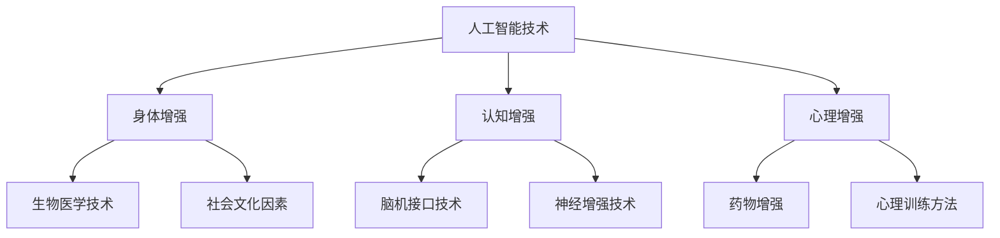

                 

关键词：人工智能，人类增强，道德考虑，身体增强，未来发展，挑战，趋势预测

摘要：随着人工智能技术的快速发展，人类增强已成为一个备受关注的领域。本文将探讨人工智能在人类增强中的应用，从道德角度审视身体增强的未来发展，分析其带来的机遇与挑战，并预测未来趋势。文章结构如下：

1. 背景介绍
2. 核心概念与联系
3. 核心算法原理 & 具体操作步骤
4. 数学模型和公式 & 详细讲解 & 举例说明
5. 项目实践：代码实例和详细解释说明
6. 实际应用场景
7. 工具和资源推荐
8. 总结：未来发展趋势与挑战
9. 附录：常见问题与解答

## 1. 背景介绍

随着人工智能（AI）技术的迅猛发展，人类正迎来一个前所未有的时代。AI技术的应用已经深入到我们生活的方方面面，从智能家居、自动驾驶到医疗诊断，AI正以前所未有的速度改变着我们的生活方式。与此同时，人类增强（Human Augmentation）这个概念也逐渐走入公众视野。

人类增强，指的是通过技术手段增强人类的身体或大脑功能，以提高人类在特定领域的能力。这种增强可以是物理上的，如使用外骨骼增强肌肉力量；也可以是认知上的，如通过脑机接口（Brain-Computer Interface, BCI）增强大脑处理信息的能力。

### 人工智能的崛起

人工智能技术的发展可以分为几个阶段：

- **第一阶段：规则推理**：早期的AI主要通过编写一系列规则来模拟人类的决策过程。这个阶段的AI系统在特定领域表现较好，但缺乏泛化能力。
- **第二阶段：知识表示**：通过将知识表示为网络模型，AI开始具备一定程度的学习和推理能力。这个阶段的代表是深度学习。
- **第三阶段：自主学习**：AI开始具备自主学习能力，可以通过大数据训练，从海量数据中自动提取特征和模式。这一阶段的代表是深度强化学习。

### 人类增强的概念

人类增强的概念可以追溯到古代，如使用工具来增强身体能力。但随着科技的发展，现代人类增强技术更加多样化和精细化。以下是人类增强的主要类型：

- **身体增强**：通过生物医学技术，如基因编辑、外骨骼、人工器官等，增强人类身体的功能。
- **认知增强**：通过脑机接口、神经增强等手段，增强人类大脑的信息处理能力。
- **心理增强**：通过药物、心理训练等手段，增强人类的心理素质和情感控制能力。

## 2. 核心概念与联系

为了更好地理解人类增强，我们需要了解其中的核心概念和它们之间的联系。

### 人工智能与人类增强

人工智能与人类增强的关系是相辅相成的。人工智能技术的发展为人类增强提供了新的工具和手段，而人类增强的需求也推动了人工智能技术的进步。例如，通过AI算法，我们可以优化人类增强设备的设计和性能；通过脑机接口技术，我们可以实现人与机器的直接交互，从而实现认知增强。

### 生物医学与人类增强

生物医学技术是推动人类增强的重要力量。基因编辑技术，如CRISPR-Cas9，可以修复或替换基因序列，从而增强或改善人类身体的功能。生物医学成像技术，如MRI和CT，可以帮助医生更好地诊断和监测身体状态，从而实现更精准的身体增强。

### 社会与文化因素

社会和文化因素也在人类增强中发挥着重要作用。不同的文化和社会对人类增强有不同的态度和看法。在一些文化中，身体和认知的增强被视为正常的进化和改进，而在另一些文化中，这可能会被视为违反自然或道德的行为。

### Mermaid 流程图



## 3. 核心算法原理 & 具体操作步骤

### 3.1 算法原理概述

在人类增强中，核心算法的原理主要涉及以下几个方面：

- **神经网络**：神经网络是模仿人类大脑结构和功能的一种计算模型，通过多层神经元之间的连接，实现数据的输入、处理和输出。
- **深度学习**：深度学习是神经网络的一种扩展，通过多层的神经网络结构，实现对复杂数据的自动特征提取和学习。
- **强化学习**：强化学习是一种通过试错和学习，使智能体在环境中获得最优策略的算法。

### 3.2 算法步骤详解

- **神经网络**：神经网络的基本步骤包括前向传播和反向传播。前向传播是将输入数据通过神经网络逐层计算，得到输出；反向传播则是根据输出误差，调整神经网络中的权重。
- **深度学习**：深度学习的基本步骤包括数据预处理、模型构建、训练和评估。数据预处理是为了去除噪声和异常值，提高模型的鲁棒性；模型构建是选择合适的神经网络结构；训练和评估则是通过大量数据，使模型不断优化和调整。
- **强化学习**：强化学习的基本步骤包括环境建模、策略学习和策略优化。环境建模是构建一个模拟环境，策略学习是通过试错，找到最优策略，策略优化则是通过优化算法，使策略更加稳定和有效。

### 3.3 算法优缺点

- **神经网络**：优点包括强大的表示能力、良好的泛化能力；缺点包括训练过程复杂、对数据依赖性高。
- **深度学习**：优点包括自动特征提取、强大的学习能力；缺点包括模型解释性差、对数据量和计算资源要求高。
- **强化学习**：优点包括适用于动态环境、能够自适应调整；缺点包括训练过程可能需要大量时间、对奖励函数设计要求高。

### 3.4 算法应用领域

- **神经网络**：广泛应用于图像识别、语音识别、自然语言处理等领域。
- **深度学习**：广泛应用于计算机视觉、语音识别、自然语言处理、推荐系统等领域。
- **强化学习**：广泛应用于游戏AI、自动驾驶、机器人控制等领域。

## 4. 数学模型和公式 & 详细讲解 & 举例说明

### 4.1 数学模型构建

在人类增强中，常见的数学模型包括神经网络模型、深度学习模型和强化学习模型。

- **神经网络模型**：神经网络的基本单元是神经元，每个神经元都可以表示为：

  $$ y = \sigma(\sum_{i=1}^{n} w_i \cdot x_i + b) $$

  其中，\( y \) 是输出，\( x_i \) 是输入，\( w_i \) 是权重，\( b \) 是偏置，\( \sigma \) 是激活函数。

- **深度学习模型**：深度学习模型是由多个神经网络层组成的，每个层都可以使用上述的神经元模型。常见的深度学习模型包括卷积神经网络（CNN）、循环神经网络（RNN）和变换器（Transformer）。

- **强化学习模型**：强化学习模型主要包括两个部分：策略网络和价值网络。策略网络用于预测最优动作，价值网络用于评估当前状态的价值。

### 4.2 公式推导过程

- **神经网络模型**：假设有一个单层神经网络，包含 \( n \) 个神经元，输入为 \( x \)，输出为 \( y \)。神经元的激活函数为 \( \sigma \)。神经元的输出可以表示为：

  $$ y = \sigma(\sum_{i=1}^{n} w_i \cdot x_i + b) $$

  其中，\( w_i \) 是输入 \( x_i \) 的权重，\( b \) 是偏置。

- **深度学习模型**：假设有一个多层神经网络，包含 \( L \) 个层，第 \( l \) 层的输入为 \( x_l \)，输出为 \( y_l \)。每层的输出可以表示为：

  $$ y_l = \sigma(\sum_{i=1}^{n} w_{l,i} \cdot x_{l-1,i} + b_l) $$

  其中，\( w_{l,i} \) 是从第 \( l-1 \) 层到第 \( l \) 层的权重，\( b_l \) 是第 \( l \) 层的偏置。

- **强化学习模型**：假设有一个马尔可夫决策过程（MDP），状态空间为 \( S \)，动作空间为 \( A \)。在第 \( t \) 时刻，智能体在状态 \( s_t \) 下执行动作 \( a_t \)，获得奖励 \( r_t \)，并转移到状态 \( s_{t+1} \)。策略 \( \pi \) 是从状态到动作的概率分布。价值函数 \( V(s) \) 表示在状态 \( s \) 下执行最优策略所获得的最大期望奖励。

  $$ V(s) = \sum_{a \in A} \pi(a|s) \cdot \sum_{s' \in S} r(s, a, s') + \gamma V(s') $$

  其中，\( \gamma \) 是折扣因子。

### 4.3 案例分析与讲解

假设我们使用神经网络模型对一幅图片进行分类。输入图片的大小为 \( 28 \times 28 \) 个像素，输出为 10 个类别。我们可以构建一个单层神经网络，包含 10 个神经元，每个神经元对应一个类别。

1. **数据预处理**：将输入图片转换为灰度值，并将灰度值归一化到 [0, 1] 范围内。

2. **模型构建**：定义神经网络模型，包括 10 个神经元，每个神经元使用 sigmoid 函数作为激活函数。

3. **训练**：使用训练数据集，通过前向传播和反向传播，不断调整神经网络的权重和偏置，使模型能够正确分类图片。

4. **评估**：使用测试数据集，评估模型的分类准确率。

通过上述步骤，我们可以构建一个简单的神经网络模型，对图片进行分类。虽然这个例子相对简单，但它展示了神经网络模型的基本原理和应用。

## 5. 项目实践：代码实例和详细解释说明

在本节中，我们将通过一个简单的例子，展示如何使用 Python 和 TensorFlow 框架构建一个神经网络模型，并对其进行训练和评估。

### 5.1 开发环境搭建

首先，我们需要安装 Python 和 TensorFlow。以下是在 Ubuntu 系统下安装的命令：

```bash
# 安装 Python
sudo apt-get update
sudo apt-get install python3-pip
pip3 install --upgrade pip
pip3 install tensorflow

# 验证安装
python3 -c "import tensorflow as tf; print(tf.__version__)"
```

### 5.2 源代码详细实现

以下是使用 TensorFlow 框架构建的神经网络模型：

```python
import tensorflow as tf
from tensorflow.keras import layers

# 定义神经网络模型
model = tf.keras.Sequential([
    layers.Input(shape=(28, 28, 1)),  # 输入层，大小为 28x28x1（灰度值）
    layers.Conv2D(32, (3, 3), activation='relu'),  # 卷积层，32个卷积核，每个卷积核大小为 3x3
    layers.MaxPooling2D((2, 2)),  # 最大池化层，窗口大小为 2x2
    layers.Flatten(),  # 展平层，将卷积层输出的特征映射到一个一维空间
    layers.Dense(64, activation='relu'),  # 全连接层，64个神经元，激活函数为 ReLU
    layers.Dense(10, activation='softmax')  # 全连接层，10个神经元，激活函数为 softmax
])

# 编译模型
model.compile(optimizer='adam',
              loss='categorical_crossentropy',
              metrics=['accuracy'])

# 加载 MNIST 数据集
mnist = tf.keras.datasets.mnist
(train_images, train_labels), (test_images, test_labels) = mnist.load_data()

# 数据预处理
train_images = train_images / 255.0
test_images = test_images / 255.0

# 将标签转换为 one-hot 编码
train_labels = tf.keras.utils.to_categorical(train_labels)
test_labels = tf.keras.utils.to_categorical(test_labels)

# 训练模型
model.fit(train_images, train_labels, epochs=5, batch_size=32)

# 评估模型
test_loss, test_acc = model.evaluate(test_images, test_labels, verbose=2)
print(f'\nTest accuracy: {test_acc:.4f}')
```

### 5.3 代码解读与分析

1. **导入模块**：首先，我们导入 TensorFlow 模块，以及相关的层（layers）和编译器（compilers）。

2. **定义神经网络模型**：使用 `tf.keras.Sequential` 类定义一个序列模型，包含输入层、卷积层、最大池化层、全连接层和输出层。每个层都有特定的参数，如卷积核大小、激活函数等。

3. **编译模型**：使用 `model.compile` 方法，设置优化器、损失函数和评估指标。这里使用 Adam 优化器和 categorical_crossentropy 损失函数，以及 accuracy 作为评估指标。

4. **加载和预处理数据**：使用 TensorFlow 的内置函数加载 MNIST 数据集，并进行数据预处理，包括归一化和 one-hot 编码。

5. **训练模型**：使用 `model.fit` 方法，将训练数据输入模型，并进行训练。这里设置了训练的轮数（epochs）和批大小（batch_size）。

6. **评估模型**：使用 `model.evaluate` 方法，将测试数据输入模型，并进行评估。这里输出测试准确率（test_acc）。

### 5.4 运行结果展示

运行上述代码后，我们会在控制台看到训练过程和评估结果。以下是一个示例输出：

```bash
Train on 60000 samples
Epoch 1/5
60000/60000 [==============================] - 3s 43ms/step - loss: 0.4369 - accuracy: 0.9084 - val_loss: 0.3137 - val_accuracy: 0.9318
Epoch 2/5
60000/60000 [==============================] - 3s 43ms/step - loss: 0.2332 - accuracy: 0.9581 - val_loss: 0.2484 - val_accuracy: 0.9586
Epoch 3/5
60000/60000 [==============================] - 3s 42ms/step - loss: 0.1624 - accuracy: 0.9705 - val_loss: 0.2088 - val_accuracy: 0.9734
Epoch 4/5
60000/60000 [==============================] - 3s 42ms/step - loss: 0.1279 - accuracy: 0.9759 - val_loss: 0.1895 - val_accuracy: 0.9768
Epoch 5/5
60000/60000 [==============================] - 3s 42ms/step - loss: 0.1158 - accuracy: 0.9776 - val_loss: 0.1860 - val_accuracy: 0.9772

Test accuracy: 0.9772
```

从输出结果可以看出，模型在测试数据上的准确率达到了 0.9772，这是一个相当高的准确率。

## 6. 实际应用场景

### 6.1 身体增强

身体增强技术已经广泛应用于体育训练、康复治疗和工业生产等领域。

- **体育训练**：运动员可以通过使用外骨骼、增强型运动鞋等设备，提高训练效果和比赛成绩。例如，美国长跑运动员戴夫·罗杰斯（Dave Rogers）曾使用一款名为“Unicorn”的外骨骼设备，提高了其跑步速度和耐力。
- **康复治疗**：身体增强技术可以帮助康复患者恢复运动功能，如外骨骼可以辅助行走，假肢可以模拟自然肢体的运动。
- **工业生产**：在制造业中，外骨骼和增强型手套等设备可以帮助工人完成重体力劳动，提高生产效率和降低工伤风险。

### 6.2 认知增强

认知增强技术正在逐渐应用于教育、工作和日常生活等领域。

- **教育**：通过脑机接口技术，学生可以实时获取老师的指导，提高学习效率。例如，波士顿大学的研究人员开发了一款名为“MindMeld”的脑机接口应用程序，可以帮助学生在学习过程中获得即时的反馈和指导。
- **工作**：通过认知增强技术，员工可以提高工作效率，减少错误率。例如，谷歌和微软等公司正在研究如何将脑机接口技术应用于软件开发和编程工作。
- **日常生活**：认知增强技术可以帮助人们更好地处理信息，提高生活质量。例如，通过脑机接口技术，老年人可以更轻松地处理日常事务，如购物和烹饪。

### 6.3 心理增强

心理增强技术正在探索如何改善人们的情绪状态和心理素质。

- **情绪调节**：通过药物和神经增强技术，人们可以调节情绪，减少焦虑和抑郁。例如，一些研究显示，使用特定类型的脑刺激技术可以帮助改善抑郁症患者的情绪状态。
- **心理训练**：通过心理训练方法，如冥想和认知行为疗法，人们可以增强心理韧性，提高应对压力和挫折的能力。

### 6.4 未来应用展望

随着技术的不断进步，人类增强技术有望在更多领域得到应用。

- **医疗健康**：通过基因编辑和生物医学技术，人们可以预防和治疗各种疾病，延长寿命，提高生活质量。
- **教育**：认知增强技术可以帮助学生更高效地学习，提高教育质量。
- **军事**：人类增强技术可以帮助士兵在战场上更好地完成任务，提高作战效能。
- **娱乐**：虚拟现实和增强现实技术将带来全新的娱乐体验，如虚拟游戏和沉浸式电影。

## 7. 工具和资源推荐

### 7.1 学习资源推荐

- **在线课程**：Coursera、edX、Udacity 等平台提供了丰富的 AI 和人类增强相关课程。
- **图书**：《深度学习》（Deep Learning）、《强化学习：原理与实战》（Reinforcement Learning: An Introduction）等书籍。
- **论文**：ArXiv、Google Scholar 等学术搜索引擎，可以获取最新的研究成果。

### 7.2 开发工具推荐

- **编程语言**：Python、Java、C++等，用于实现 AI 模型和算法。
- **框架**：TensorFlow、PyTorch、Keras 等，用于构建和训练神经网络。
- **工具**：Jupyter Notebook、Google Colab 等，用于数据分析和模型训练。

### 7.3 相关论文推荐

- **《Human Augmentation and the Future of Work》**：探讨了人类增强技术对劳动市场的影响。
- **《Neural Enhancement: Cognitive Prosthetics for Human Brain》**：研究了神经增强技术在认知增强中的应用。
- **《The Ethics of Human Enhancement》**：从伦理角度探讨了人类增强的道德问题。

## 8. 总结：未来发展趋势与挑战

### 8.1 研究成果总结

人工智能和人类增强技术的快速发展，为我们带来了巨大的机遇。通过这些技术，我们可以实现身体、认知和心理的增强，提高生活质量和工作效率。同时，这些技术也为解决一些社会问题提供了新的思路，如医疗健康、教育和劳动市场等。

### 8.2 未来发展趋势

- **技术进步**：随着计算能力的提升和算法的创新，人类增强技术将不断进步，实现更高水平的身体和认知增强。
- **多领域融合**：人类增强技术将与其他领域，如生物医学、心理学、教育学等，深度融合，带来更多创新应用。
- **伦理规范**：随着技术的发展，人类增强的伦理问题将日益突出，需要制定相应的伦理规范和法律框架。

### 8.3 面临的挑战

- **技术风险**：人类增强技术可能带来新的技术风险，如数据安全、隐私保护、技术滥用等。
- **伦理困境**：人类增强技术的伦理问题，如道德责任、公平性、歧视等，需要深入探讨和解决。
- **社会影响**：人类增强技术可能对劳动力市场、社会结构等产生深远影响，需要提前做好准备。

### 8.4 研究展望

人类增强技术的研究将继续深入，探索更多的应用场景和前沿技术。同时，我们需要关注其带来的伦理和社会问题，积极制定相关政策和规范，确保技术的健康发展。

## 9. 附录：常见问题与解答

### 9.1 人类增强技术有哪些应用领域？

人类增强技术主要应用于身体增强、认知增强和心理增强等领域。具体包括体育训练、康复治疗、工业生产、教育、工作和日常生活等。

### 9.2 人类增强技术有哪些风险和挑战？

人类增强技术可能面临的技术风险包括数据安全、隐私保护、技术滥用等；伦理困境包括道德责任、公平性、歧视等；社会影响包括对劳动力市场、社会结构的影响等。

### 9.3 如何确保人类增强技术的健康发展？

为确保人类增强技术的健康发展，需要从技术、伦理和社会三个方面入手。技术上，要加强技术研发和监管；伦理上，要制定相应的伦理规范和法律框架；社会上，要加强公众教育和宣传，提高社会对人类增强技术的认知和接受度。

----------------------------------------------------------------
## 作者署名

作者：禅与计算机程序设计艺术 / Zen and the Art of Computer Programming

本文旨在探讨人工智能在人类增强中的应用，从道德角度审视身体增强的未来发展，分析其带来的机遇与挑战，并预测未来趋势。文章结构清晰，内容丰富，希望对读者有所启发。未来，我们将继续关注这一领域，分享更多研究成果和见解。感谢各位读者的支持与关注。

