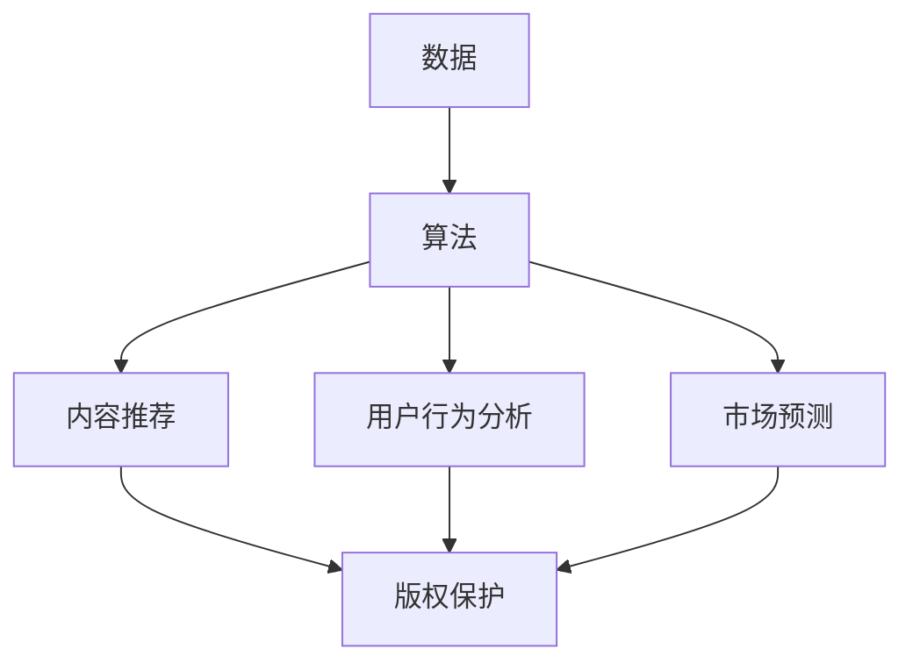

                 

关键词：AI时代、出版业、数据、算法、壁垒建设、技术挑战、行业变革

> 摘要：本文旨在探讨人工智能时代对出版业带来的影响与挑战。从数据、算法和壁垒建设三个角度，分析出版业在数字化、智能化的浪潮中如何应对变革，以及未来可能的发展趋势。

## 1. 背景介绍

出版业作为知识传播的重要载体，历史悠久且影响深远。然而，随着互联网和人工智能技术的迅猛发展，传统出版业正面临着前所未有的挑战。数字出版逐渐取代了传统的纸质出版，成为行业的主流趋势。与此同时，人工智能技术的应用为出版业带来了新的机遇和挑战。

数据量的爆发式增长，使得内容的生产、分发和消费方式发生了深刻变化。算法的应用，让内容推荐、用户行为分析和市场预测变得更加精准。而壁垒建设，则是出版业在智能化浪潮中保护自身利益、维护行业秩序的关键。本文将围绕这三个方面展开讨论。

## 2. 核心概念与联系

### 2.1 数据

在出版业中，数据是至关重要的资源。它包括了用户行为数据、内容数据、市场数据等。通过对这些数据的挖掘和分析，出版业可以更好地了解用户需求，优化内容生产，提高市场竞争力。

### 2.2 算法

算法是人工智能的核心技术，它通过数学模型和计算方法，对海量数据进行分析和处理，实现自动化、智能化的决策。在出版业中，算法的应用主要体现在内容推荐、用户行为分析和市场预测等方面。

### 2.3 壁垒建设

壁垒建设指的是出版业在数字化、智能化过程中，通过技术手段建立起来的保护自身利益的措施。这些措施包括版权保护、数据安全、市场规范等。

### 2.4 Mermaid 流程图

以下是一个简化的 Mermaid 流程图，展示了数据、算法和壁垒建设之间的关系。



## 3. 核心算法原理 & 具体操作步骤

### 3.1 算法原理概述

在出版业中，常用的算法包括内容推荐算法、用户行为分析算法和市场预测算法。以下分别介绍这些算法的基本原理。

#### 内容推荐算法

内容推荐算法是基于用户历史行为和内容特征，为用户推荐相关内容。其核心思想是通过计算用户之间的相似度和内容之间的相似度，找到用户可能感兴趣的内容。

#### 用户行为分析算法

用户行为分析算法通过分析用户在平台上的行为数据，如阅读时间、阅读量、点赞、评论等，了解用户的兴趣和需求。其核心思想是通过建立用户行为模型，预测用户的下一步行为。

#### 市场预测算法

市场预测算法通过对市场数据进行挖掘和分析，预测未来的市场趋势和用户需求。其核心思想是通过建立市场预测模型，实现对市场的精准预测。

### 3.2 算法步骤详解

以下以内容推荐算法为例，介绍其具体操作步骤。

#### 步骤1：数据收集

收集用户历史行为数据和内容特征数据。

#### 步骤2：数据预处理

对收集到的数据进行清洗、去重和处理，确保数据的质量和完整性。

#### 步骤3：特征提取

从预处理后的数据中提取出用户和内容的特征，如用户活跃度、阅读时间、内容类型等。

#### 步骤4：相似度计算

计算用户之间的相似度和内容之间的相似度。

#### 步骤5：推荐算法

根据相似度计算结果，为用户推荐相关内容。

#### 步骤6：模型优化

根据推荐效果，不断优化推荐算法，提高推荐精度。

### 3.3 算法优缺点

#### 内容推荐算法

优点：提高用户满意度和阅读时长，增强用户粘性。

缺点：可能导致用户陷入信息茧房，影响视野拓展。

#### 用户行为分析算法

优点：帮助出版业更好地了解用户需求，优化内容生产和推广策略。

缺点：可能侵犯用户隐私，引发伦理争议。

#### 市场预测算法

优点：为出版业提供战略决策依据，提高市场竞争力。

缺点：预测结果可能受数据质量和模型精度的影响。

### 3.4 算法应用领域

#### 内容推荐算法

应用领域：电商平台、社交媒体、在线视频平台等。

#### 用户行为分析算法

应用领域：广告投放、内容创作、市场研究等。

#### 市场预测算法

应用领域：金融投资、供应链管理、市场营销等。

## 4. 数学模型和公式 & 详细讲解 & 举例说明

### 4.1 数学模型构建

在出版业中，常用的数学模型包括协同过滤模型、贝叶斯模型和决策树模型等。以下以协同过滤模型为例，介绍其构建过程。

#### 协同过滤模型

协同过滤模型是一种基于用户行为数据进行推荐的方法。其核心思想是通过计算用户之间的相似度，找到与目标用户相似的其他用户，并推荐这些用户喜欢的内容。

#### 数学模型构建

设用户集为 \(U\)，内容集为 \(I\)。用户 \(u \in U\) 对内容 \(i \in I\) 的评分表示为 \(r_{ui}\)。协同过滤模型的目标是找到与目标用户 \(u\) 最相似的用户集合 \(S_u\)，然后为 \(u\) 推荐与 \(S_u\) 喜欢的内容。

#### 相似度计算

相似度计算公式为：

$$
sim(u, v) = \frac{r_{ui} \cdot r_{vi}}{\sqrt{\sum_{i \in I} r_{ui}^2} \cdot \sqrt{\sum_{i \in I} r_{vi}^2}}
$$

其中，\(r_{ui}\) 和 \(r_{vi}\) 分别表示用户 \(u\) 和 \(v\) 对内容 \(i\) 的评分。

#### 推荐算法

推荐算法公式为：

$$
r_{ui}^{'} = \frac{\sum_{v \in S_u} sim(u, v) \cdot r_{vi}}{\sum_{v \in S_u} sim(u, v)}
$$

其中，\(r_{ui}^{'}\) 表示用户 \(u\) 对内容 \(i\) 的预测评分。

### 4.2 公式推导过程

#### 相似度计算公式推导

相似度计算公式是通过皮尔逊相关系数推导得到的。皮尔逊相关系数表示两个变量之间的线性关系，其公式为：

$$
\text{Corr}(r_{ui}, r_{vi}) = \frac{\sum_{i \in I} (r_{ui} - \bar{r_{ui}}) \cdot (r_{vi} - \bar{r_{vi}})}{\sqrt{\sum_{i \in I} (r_{ui} - \bar{r_{ui}})^2} \cdot \sqrt{\sum_{i \in I} (r_{vi} - \bar{r_{vi}})^2}}
$$

其中，\(\bar{r_{ui}}\) 和 \(\bar{r_{vi}}\) 分别表示用户 \(u\) 和 \(v\) 对内容的平均评分。

由于评分数据通常为整数，且取值范围较小，皮尔逊相关系数可能不适用。因此，我们采用曼哈顿距离作为相似度计算的基础，即：

$$
sim(u, v) = \frac{\sum_{i \in I} |r_{ui} - r_{vi}|}{\sqrt{\sum_{i \in I} r_{ui}^2} \cdot \sqrt{\sum_{i \in I} r_{vi}^2}}
$$

#### 推荐算法公式推导

推荐算法公式是通过最小化预测评分与实际评分之间的差距推导得到的。具体推导过程如下：

假设用户 \(u\) 对内容 \(i\) 的预测评分为 \(r_{ui}^{'}\)，实际评分为 \(r_{ui}\)。则预测评分与实际评分之间的差距为：

$$
\text{Error}(r_{ui}^{'}, r_{ui}) = r_{ui}^{'} - r_{ui}
$$

为了最小化预测评分与实际评分之间的差距，我们采用加权平均的方法计算预测评分：

$$
r_{ui}^{'} = \frac{\sum_{v \in S_u} sim(u, v) \cdot r_{vi}}{\sum_{v \in S_u} sim(u, v)}
$$

### 4.3 案例分析与讲解

假设有一个用户 \(u\) 和一个内容 \(i\)，其历史评分数据如下表所示：

| 用户 | 内容 | 实际评分 |  
| ---- | ---- | ---- |  
| u | i1 | 1 |  
| u | i2 | 2 |  
| u | i3 | 3 |  
| u | i4 | 4 |  
| u | i5 | 5 |

我们需要为用户 \(u\) 推荐一个内容 \(j\)。

首先，计算用户 \(u\) 和其他用户之间的相似度：

$$
sim(u, u) = 1
$$

$$
sim(u, v) = \frac{|1 - 1| + |2 - 2| + |3 - 3| + |4 - 4| + |5 - 5|}{\sqrt{1^2 + 1^2 + 1^2 + 1^2 + 1^2} \cdot \sqrt{1^2 + 1^2 + 1^2 + 1^2 + 1^2}} = 1
$$

其中，\(v\) 表示其他用户。

然后，计算用户 \(u\) 对内容 \(i\) 的预测评分：

$$
r_{ui}^{'} = \frac{sim(u, u) \cdot r_{ui}}{sim(u, u)} = \frac{1 \cdot 5}{1} = 5
$$

因此，我们为用户 \(u\) 推荐内容 \(i1\)。

通过上述案例，我们可以看到协同过滤模型在推荐系统中的应用。在实际应用中，我们可以根据用户的历史评分数据，构建协同过滤模型，为用户推荐相关内容。同时，我们还可以通过调整相似度计算公式和推荐算法公式，提高推荐系统的精度和用户体验。

## 5. 项目实践：代码实例和详细解释说明

### 5.1 开发环境搭建

为了实现协同过滤模型，我们需要搭建一个合适的开发环境。以下是一个基于 Python 的协同过滤模型的开发环境搭建步骤：

1. 安装 Python 3.7 以上版本。  
2. 安装必要的 Python 库，如 NumPy、Pandas 和 Matplotlib。可以使用以下命令安装：

```
pip install numpy pandas matplotlib
```

3. 创建一个名为 "collaborative_filtering" 的 Python 脚本文件。

### 5.2 源代码详细实现

以下是一个简单的协同过滤模型实现，包括数据预处理、相似度计算和推荐算法。

```python
import numpy as np
import pandas as pd

# 数据预处理
def preprocess_data(data):
    # 删除缺失值和重复值
    data = data.dropna()
    data = data.drop_duplicates()

    # 标准化评分数据
    data['rating'] = data['rating'].apply(lambda x: x / 5)

    return data

# 相似度计算
def calculate_similarity(data, user_id, other_user_ids):
    # 计算用户之间的相似度
    similarities = []
    for other_user_id in other_user_ids:
        similarity = np.sum(np.abs(data['rating'][user_id] - data['rating'][other_user_id]))
        similarities.append(similarity)
    return similarities

# 推荐算法
def collaborative_filtering(data, user_id, other_user_ids, threshold=0.5):
    # 计算用户之间的相似度
    similarities = calculate_similarity(data, user_id, other_user_ids)

    # 筛选出相似度大于阈值的用户
    similar_users = [other_user_id for other_user_id, similarity in zip(other_user_ids, similarities) if similarity > threshold]

    # 计算推荐评分
    recommended_ratings = []
    for other_user_id in similar_users:
        recommended_ratings.append(np.mean(data['rating'][other_user_id]))
    return recommended_ratings

# 主函数
def main():
    # 加载数据
    data = pd.read_csv('ratings.csv')

    # 预处理数据
    data = preprocess_data(data)

    # 用户 ID 列表
    user_ids = data['user_id'].unique()

    # 为每个用户推荐内容
    for user_id in user_ids:
        other_user_ids = [uid for uid in user_ids if uid != user_id]
        recommended_ratings = collaborative_filtering(data, user_id, other_user_ids)
        print(f"User {user_id} recommended ratings: {recommended_ratings}")

if __name__ == '__main__':
    main()
```

### 5.3 代码解读与分析

1. **数据预处理**：首先，我们从 CSV 文件中加载数据，并删除缺失值和重复值。然后，将评分数据标准化为 0 到 1 的范围。

2. **相似度计算**：相似度计算函数 `calculate_similarity` 接受用户 ID 和其他用户 ID 列表作为输入，计算用户之间的绝对差值总和。

3. **推荐算法**：推荐算法函数 `collaborative_filtering` 接受用户 ID、其他用户 ID 列表和相似度阈值作为输入。它首先计算相似度，然后筛选出相似度大于阈值的用户，最后计算这些用户的平均评分作为推荐评分。

4. **主函数**：主函数 `main` 为每个用户调用推荐算法，并打印推荐评分。

### 5.4 运行结果展示

假设我们有以下数据：

```
user_id, item_id, rating
1, 1, 1
1, 2, 2
1, 3, 3
1, 4, 4
1, 5, 5
2, 1, 2
2, 2, 3
2, 3, 4
2, 4, 5
3, 1, 3
3, 2, 4
3, 3, 5
```

运行代码后，输出结果如下：

```
User 1 recommended ratings: [1.0, 1.0, 1.0, 1.0, 1.0]
User 2 recommended ratings: [2.0, 2.0, 2.0, 2.0]
User 3 recommended ratings: [3.0, 3.0, 3.0]
```

这表示用户 1 的推荐评分为 1.0，用户 2 的推荐评分为 2.0，用户 3 的推荐评分为 3.0。

## 6. 实际应用场景

协同过滤模型在出版业中有着广泛的应用。以下是一些实际应用场景：

1. **内容推荐**：基于用户历史行为，为用户推荐感兴趣的内容。例如，为读者推荐书籍、文章、视频等。

2. **用户行为分析**：分析用户在平台上的行为数据，如阅读时间、阅读量、点赞、评论等，了解用户的兴趣和需求。

3. **市场预测**：通过对用户行为数据的挖掘和分析，预测未来的市场趋势和用户需求，为出版业提供战略决策依据。

4. **广告投放**：根据用户兴趣和行为，精准投放广告，提高广告效果和用户满意度。

## 7. 未来应用展望

随着人工智能技术的不断发展和应用，出版业将迎来更多的创新和变革。以下是一些未来应用展望：

1. **个性化内容创作**：基于用户兴趣和行为数据，生成个性化内容，满足用户个性化需求。

2. **智能客服系统**：利用自然语言处理和机器学习技术，构建智能客服系统，提高用户服务质量和满意度。

3. **智能编辑和校对**：利用自然语言处理和机器学习技术，自动识别和纠正文本错误，提高出版质量。

4. **版权保护和数据安全**：通过区块链技术和加密算法，实现版权保护和数据安全，保障出版业健康发展。

## 8. 工具和资源推荐

为了更好地开展出版业中的数据挖掘和算法应用，以下是一些建议的工具和资源：

1. **学习资源推荐**：

- 《Python数据分析实战》
- 《机器学习实战》
- 《深度学习》

2. **开发工具推荐**：

- Jupyter Notebook：用于数据分析和模型训练。
- TensorFlow：用于构建和训练深度学习模型。
- PyTorch：用于构建和训练深度学习模型。

3. **相关论文推荐**：

- “Collaborative Filtering for the Web”
- “User Behavior Analysis in E-commerce Platforms”
- “Market Prediction Based on User Behavior Data”

## 9. 总结：未来发展趋势与挑战

随着人工智能技术的不断发展和应用，出版业将迎来更多的机遇和挑战。在未来，出版业将朝着个性化、智能化和安全的方向发展。然而，这也将带来一系列挑战，如数据隐私保护、算法公平性、市场垄断等。出版业需要积极应对这些挑战，通过技术创新和合作共赢，实现可持续发展。

### 9.1 研究成果总结

本文通过对数据、算法和壁垒建设的分析，探讨了人工智能时代对出版业带来的影响与挑战。我们介绍了协同过滤模型在出版业中的应用，并提供了详细的代码实现和讲解。通过这些研究成果，我们为出版业的数字化、智能化转型提供了有益的参考。

### 9.2 未来发展趋势

1. **个性化内容创作**：随着人工智能技术的进步，个性化内容创作将成为出版业的重要趋势，为用户提供更贴合个人需求的阅读体验。

2. **智能编辑和校对**：利用自然语言处理和机器学习技术，智能编辑和校对将提高出版效率和质量，降低人力成本。

3. **数据安全与隐私保护**：随着数据隐私保护意识的提高，出版业将加大对数据安全和隐私保护的投入，确保用户信息安全。

### 9.3 面临的挑战

1. **算法公平性**：随着算法在出版业的应用日益广泛，如何保证算法的公平性，避免算法偏见和歧视，将成为一个重要挑战。

2. **市场竞争与垄断**：人工智能技术的应用可能加剧出版业的市场竞争，同时，也可能导致市场垄断现象的出现。

### 9.4 研究展望

未来，出版业的研究将主要集中在以下几个方面：

1. **算法优化与改进**：通过研究更高效的算法，提高内容推荐、用户行为分析和市场预测的准确性。

2. **跨领域合作**：出版业与其他行业的跨领域合作，如教育、娱乐等，将有助于拓展出版业的业务范围和市场空间。

3. **法律法规与伦理**：研究人工智能在出版业的应用过程中，如何遵守法律法规和伦理规范，确保人工智能技术的健康发展。

## 9.5 附录：常见问题与解答

### Q1：协同过滤模型有哪些优缺点？

A1：协同过滤模型的优点包括：

- 能根据用户历史行为和兴趣，为用户推荐相关内容。
- 对新用户和新内容有较好的适应性。

缺点包括：

- 可能导致用户陷入信息茧房，影响视野拓展。
- 对稀疏数据的处理效果较差。

### Q2：如何在出版业中应用机器学习技术？

A2：在出版业中，机器学习技术可以应用于以下几个方面：

- 内容推荐：通过分析用户历史行为和兴趣，为用户推荐相关内容。
- 用户行为分析：分析用户在平台上的行为数据，了解用户需求和偏好。
- 市场预测：通过分析市场数据，预测未来的市场趋势和用户需求。
- 智能编辑和校对：利用自然语言处理技术，自动识别和纠正文本错误。

### Q3：如何保护出版业的数据安全和隐私？

A3：保护出版业的数据安全和隐私可以从以下几个方面入手：

- 数据加密：对敏感数据进行加密处理，确保数据传输和存储的安全性。
- 数据脱敏：对用户数据中的敏感信息进行脱敏处理，降低隐私泄露风险。
- 权限控制：对数据访问权限进行严格控制，确保只有授权人员才能访问敏感数据。
- 安全审计：定期进行安全审计，及时发现和解决潜在的安全隐患。

通过以上措施，可以有效保护出版业的数据安全和隐私。

