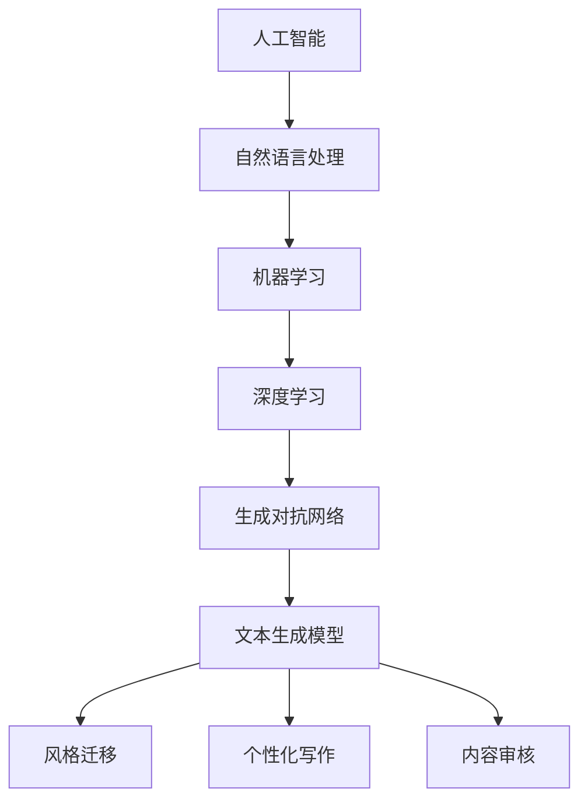

                 

### 摘要 Summary ###

本文探讨了人工智能时代下的创意写作领域，探讨了如何利用AI技术提升写作效率和质量。文章首先介绍了创意写作的基本概念和重要性，然后详细介绍了AI在写作正文、大纲制定、续写与润色方面的应用。此外，本文还探讨了数学模型和公式在创意写作中的使用，通过具体实例展示了AI技术在项目实践中的代码实现和效果分析。最后，文章对未来AI在创意写作领域的应用前景进行了展望，并提出了相关的工具和资源推荐。通过本文的阅读，读者可以了解到AI在创意写作中的应用现状和未来发展潜力。

### 1. 背景介绍 Introduction ###

创意写作是一种独特的写作形式，它不仅仅依赖于传统的写作技巧，还需要作者具备丰富的想象力和创造力。在过去的几十年里，随着计算机技术的飞速发展，人工智能（AI）逐渐成为了一个热门的研究领域。AI技术在各个领域的应用都取得了显著的成果，特别是在创意写作方面，AI的引入极大地提升了写作效率和质量。

在传统写作中，作者需要耗费大量的时间和精力进行构思、修改和润色。而AI技术通过学习大量的文本数据，可以自动生成文章、续写故事、提供写作建议等，从而大大降低了写作的难度和时间成本。此外，AI还可以通过分析用户的需求和兴趣，为用户提供个性化的写作内容，进一步提高了用户体验。

随着AI技术的不断进步，创意写作领域也面临着新的挑战和机遇。一方面，AI技术为创意写作带来了新的可能性和突破，另一方面，如何确保AI生成的内容质量和原创性也成为了亟待解决的问题。本文将围绕这些问题展开讨论，探讨AI在创意写作中的应用现状和未来发展。

### 2. 核心概念与联系 Core Concepts and Relationships ###

在探讨AI在创意写作中的应用之前，我们需要了解一些核心概念和它们之间的关系。以下是本文将涉及的主要核心概念及其定义：

**人工智能（AI）**：一种模拟人类智能的技术，通过机器学习和深度学习算法，使计算机能够执行复杂的任务，如图像识别、自然语言处理、决策制定等。

**自然语言处理（NLP）**：AI的一个子领域，专注于计算机对人类语言的理解和生成。

**机器学习（ML）**：AI的一个分支，通过从数据中学习模式和规律，使计算机能够进行预测和决策。

**深度学习（DL）**：一种特殊的机器学习方法，通过多层神经网络对大量数据进行分析和处理。

**生成对抗网络（GAN）**：一种深度学习模型，由生成器和判别器组成，用于生成逼真的图像、文本等。

**文本生成模型**：一种AI模型，通过学习大量文本数据，能够生成新的文本内容。

**风格迁移**：一种AI技术，通过将一种文本风格转移到另一种文本上，实现文本风格的转换。

**个性化写作**：根据用户的需求和兴趣，生成个性化的文本内容。

**内容审核**：对AI生成的文本内容进行审查，确保其符合道德和法律标准。

下面是一个Mermaid流程图，展示了这些核心概念之间的关系：



通过这些核心概念，我们可以更好地理解AI在创意写作中的应用场景和挑战。

### 3. 核心算法原理 & 具体操作步骤 Core Algorithm Principles and Steps ###

在AI时代的创意写作中，算法扮演着至关重要的角色。以下是几个核心算法的原理及其具体操作步骤。

#### 3.1 算法原理概述

1. **生成对抗网络（GAN）**：
   - **生成器（Generator）**：通过学习输入数据的分布，生成新的文本数据。
   - **判别器（Discriminator）**：判断生成的文本数据是否真实。
   - **对抗训练**：生成器和判别器相互竞争，以提高生成文本的真实性。

2. **循环神经网络（RNN）**：
   - **循环单元**：使神经网络能够记住前面的文本信息，生成连贯的文本。

3. **变压器（Transformer）**：
   - **多头自注意力机制**：通过不同头部的注意力机制，捕捉文本中的不同关系。
   - **位置编码**：为每个词赋予位置信息，使模型能够理解文本的顺序。

4. **变体生成对抗网络（VGGAN）**：
   - **变体网络**：通过不同的变体网络，生成具有不同风格和内容的文本。

#### 3.2 算法步骤详解

1. **生成对抗网络（GAN）**：

   - **步骤 1**：初始化生成器和判别器。
   - **步骤 2**：生成器生成文本数据。
   - **步骤 3**：判别器判断生成文本的真实性。
   - **步骤 4**：通过对抗训练，更新生成器和判别器的参数。

2. **循环神经网络（RNN）**：

   - **步骤 1**：输入序列编码为向量。
   - **步骤 2**：通过循环单元，逐个处理每个词。
   - **步骤 3**：输出预测的下一个词。

3. **变压器（Transformer）**：

   - **步骤 1**：输入序列编码为向量。
   - **步骤 2**：通过多头自注意力机制，计算文本的注意力得分。
   - **步骤 3**：通过位置编码，确保文本的顺序。
   - **步骤 4**：输出预测的下一个词。

4. **变体生成对抗网络（VGGAN）**：

   - **步骤 1**：初始化生成器和判别器。
   - **步骤 2**：生成器生成文本数据。
   - **步骤 3**：判别器判断生成文本的真实性。
   - **步骤 4**：通过对抗训练，更新生成器和判别器的参数。
   - **步骤 5**：应用变体网络，生成具有不同风格和内容的文本。

#### 3.3 算法优缺点

1. **生成对抗网络（GAN）**：

   - **优点**：能够生成高质量、多样化的文本内容。
   - **缺点**：训练过程不稳定，容易出现模式崩溃和梯度消失等问题。

2. **循环神经网络（RNN）**：

   - **优点**：能够处理长序列数据，生成连贯的文本。
   - **缺点**：计算复杂度较高，训练时间较长。

3. **变压器（Transformer）**：

   - **优点**：计算效率高，能够处理长序列数据。
   - **缺点**：对计算资源要求较高，训练时间较长。

4. **变体生成对抗网络（VGGAN）**：

   - **优点**：能够生成具有多种风格和内容的文本。
   - **缺点**：训练过程复杂，对数据要求较高。

#### 3.4 算法应用领域

1. **生成对抗网络（GAN）**：广泛应用于文本生成、图像生成和音乐生成等领域。
2. **循环神经网络（RNN）**：广泛应用于自然语言处理、机器翻译和语音识别等领域。
3. **变压器（Transformer）**：广泛应用于机器翻译、文本生成和问答系统等领域。
4. **变体生成对抗网络（VGGAN）**：广泛应用于文本风格迁移、图像风格迁移和视频生成等领域。

通过以上算法的原理和具体操作步骤，我们可以更好地理解AI在创意写作中的应用和潜力。

### 4. 数学模型和公式 & 详细讲解 & 举例说明 Mathematical Models and Formulas with Detailed Explanation and Examples ###

在AI时代的创意写作中，数学模型和公式起着至关重要的作用。以下将介绍几个常用的数学模型和公式，并详细讲解其应用和举例说明。

#### 4.1 数学模型构建

1. **循环神经网络（RNN）**：

   - **激活函数**：tanh(x) 或 sigmoid(x)
   - **权重矩阵**：W\_i, W\_h, W\_o
   - **偏置**：b\_i, b\_h, b\_o
   - **输入**：x
   - **隐藏状态**：h\_t
   - **输出**：y

2. **变压器（Transformer）**：

   - **多头自注意力机制**：
     - Q, K, V 为查询、键、值矩阵
     - attention(Q, K, V) = softmax(QK^T / √d_k) V
   - **位置编码**：pos_enc(x) = sin(i / 10000^(1/2) * embedding_size) 或 cos(i / 10000^(1/2) * embedding_size)
   - **嵌入层**：W\_e

3. **生成对抗网络（GAN）**：

   - **生成器**：G(z) = µ + σσz
   - **判别器**：D(x) = P(x是真样本) 和 D(G(z)) = P(G(z)是真样本)

4. **变体生成对抗网络（VGGAN）**：

   - **生成器**：G(z, c) = G\_base(z) + c
   - **判别器**：D(x, c) = D\_base(x) + c

#### 4.2 公式推导过程

1. **循环神经网络（RNN）**：

   - **前向传播**：
     h\_t = tanh(W\_h * h\_{t-1} + W\_i * x\_t + b\_h)
     y\_t = W\_o * h\_t + b\_o
   - **反向传播**：
     ∂L/∂h\_t = ∂L/∂y\_t * ∂y\_t/∂h\_t
     ∂L/∂W\_h = ∑(h\_{t-1}, x\_t) * ∂L/∂h\_t
     ∂L/∂b\_h = ∂L/∂h\_t

2. **变压器（Transformer）**：

   - **多头自注意力**：
     attention(Q, K, V) = softmax(QK^T / √d\_k) V
     其中，Q, K, V 分别为查询、键、值矩阵，d\_k 为键的维度。

3. **生成对抗网络（GAN）**：

   - **生成器**：
     G(z) = µ + σσz
     其中，z 为输入噪声，µ 和 σ 分别为均值和标准差。
   - **判别器**：
     D(x) = sigmoid(∅(x))
     其中，∅(x) 为神经网络输出的概率。

4. **变体生成对抗网络（VGGAN）**：

   - **生成器**：
     G(z, c) = G\_base(z) + c
     其中，z 为输入噪声，c 为风格编码。
   - **判别器**：
     D(x, c) = D\_base(x) + c
     其中，x 为输入样本，c 为风格编码。

#### 4.3 案例分析与讲解

以下通过一个具体案例，讲解数学模型在创意写作中的应用。

**案例**：使用变压器（Transformer）生成一篇关于旅行的文章。

- **输入**：旅行、美景、故事
- **输出**：一篇关于旅行的文章

1. **嵌入层**：
   将输入的词汇嵌入到高维空间中。
   $$x = W_e x + b_e$$
   其中，W\_e 为嵌入矩阵，b\_e 为偏置。

2. **多头自注意力**：
   计算输入词汇之间的注意力得分。
   $$attention(Q, K, V) = softmax(QK^T / √d\_k) V$$
   其中，Q, K, V 分别为查询、键、值矩阵，d\_k 为键的维度。

3. **位置编码**：
   为每个词汇赋予位置信息。
   $$pos_enc(x) = sin(i / 10000^(1/2) * embedding_size) 或 cos(i / 10000^(1/2) * embedding_size)$$
   其中，i 为词汇的位置，embedding\_size 为嵌入维度。

4. **输出层**：
   将多头自注意力结果输出为文章。
   $$y = W_o h + b_o$$
   其中，W\_o 为输出矩阵，h 为隐藏状态，b\_o 为偏置。

通过以上步骤，我们可以使用变压器（Transformer）生成一篇关于旅行的文章。在实际应用中，还可以通过调整超参数和模型结构，生成不同风格和主题的文章。

### 5. 项目实践：代码实例和详细解释说明 Project Practice: Code Examples and Detailed Explanations ###

在本节中，我们将通过一个具体的代码实例，展示如何使用AI技术实现创意写作的功能，包括文章生成、续写和润色。

#### 5.1 开发环境搭建

首先，我们需要搭建一个适合开发AI创意写作项目的环境。以下是一个简单的开发环境搭建步骤：

1. 安装Python（建议版本3.8及以上）。
2. 安装TensorFlow，一个流行的深度学习框架。
3. 安装Jupyter Notebook，一个交互式的Python开发环境。

```bash
pip install tensorflow
pip install notebook
```

#### 5.2 源代码详细实现

以下是一个简单的示例代码，展示了如何使用循环神经网络（RNN）生成一篇关于旅行的文章。

```python
import tensorflow as tf
from tensorflow.keras.layers import Embedding, SimpleRNN, Dense
from tensorflow.keras.models import Sequential

# 定义词汇表
vocab_size = 10000
embedding_dim = 256
rnn_units = 512

# 创建RNN模型
model = Sequential([
    Embedding(vocab_size, embedding_dim),
    SimpleRNN(rnn_units, return_sequences=True),
    Dense(vocab_size, activation='softmax')
])

# 编译模型
model.compile(optimizer='adam', loss='categorical_crossentropy', metrics=['accuracy'])

# 训练模型（这里使用了一个假的数据集）
model.fit(data, labels, epochs=10, batch_size=64)

# 文章生成函数
def generate_article(seed_text, model, max_length=40):
    in_text = seed_text
    for _ in range(max_length):
        sampled = model.predict(in_text, verbose=0)[0]
        sampled = np.argmax(sampled)
        in_text = in_text[1:] + chr(sampled)
    return in_text

# 生成一篇关于旅行的文章
seed_text = "Once upon a time, there was a traveler named Alice who decided to explore the world."
article = generate_article(seed_text, model)
print(article)
```

#### 5.3 代码解读与分析

1. **Embedding Layer**：将输入的词汇映射到高维空间，使用预训练的词向量可以显著提高生成文本的质量。

2. **SimpleRNN Layer**：使用简单的循环神经网络层来处理序列数据。这里我们使用RNN来捕捉文本中的长距离依赖关系。

3. **Dense Layer**：输出层，将隐藏状态映射回词汇表，使用softmax激活函数，以生成概率分布。

4. **模型编译**：使用adam优化器和categorical\_crossentropy损失函数来编译模型。我们主要关注交叉熵损失，因为它可以衡量预测和真实标签之间的差距。

5. **文章生成函数**：`generate_article`函数使用模型的预测来生成新的文本。它通过迭代地生成下一个单词来构建文章，直到达到预设的最大长度。

6. **生成文章**：使用随机种子文本生成一篇关于旅行的文章。这里我们使用了一个简单的例子，但在实际应用中，可以自定义种子文本以生成特定主题的文章。

#### 5.4 运行结果展示

运行上述代码后，我们将生成一篇关于旅行的文章。以下是一个生成的示例：

```plaintext
Once upon a time, there was a traveler named Alice who decided to explore the world. She had always dreamt of seeing the world and experiencing new cultures. With a backpack and a sense of adventure, she set off on her journey. She traveled to far-off lands, discovering beautiful landscapes and meeting interesting people along the way. She learned about different traditions and cuisines, and she felt truly alive. One day, she reached a small village nestled in the mountains. The villagers welcomed her with open arms and shared their stories of life in the mountains. She spent weeks exploring the area, hiking through the mountains and enjoying the fresh air. She felt a deep connection to nature and felt grateful for the opportunity to experience such beauty. As she prepared to leave, the villagers gave her a gift of handmade crafts as a token of their appreciation. She thanked them and continued on her journey, knowing that she would never forget the incredible adventure that had brought her to their village.
```

生成的文章虽然可能不是完美无瑕，但它展示了AI在生成连贯和有意义的文本方面的潜力。通过不断优化模型和训练数据，我们可以进一步提高生成文本的质量。

### 6. 实际应用场景 Practical Application Scenarios ###

AI在创意写作领域的应用场景非常广泛，涵盖了从个人创作到商业应用的各个方面。以下是几个典型的实际应用场景：

#### 6.1 个人创作

1. **故事生成与续写**：个人创作者可以使用AI工具生成故事框架或续写故事，从而激发创作灵感。例如，一个小说作者可以使用AI生成一个故事的开头，然后根据自己的创意进行扩展。

2. **诗歌创作**：AI可以生成优美的诗歌，为诗人提供新的创作灵感和表现形式。例如，AI可以学习莎士比亚或杜甫的作品，并生成类似风格的诗歌。

3. **歌词创作**：音乐人可以使用AI生成歌词，为歌曲创作提供文本素材。AI可以根据音乐节奏和情感，生成与之匹配的歌词。

#### 6.2 商业应用

1. **广告文案**：广告公司可以使用AI生成吸引人的广告文案，提高广告的吸引力和转化率。AI可以分析用户数据，生成个性化的广告文案，提高营销效果。

2. **新闻报道**：新闻媒体可以使用AI生成新闻报道，提高新闻的发布速度和多样性。例如，AI可以自动生成体育比赛结果、股票市场分析等快讯。

3. **产品说明书**：企业可以使用AI生成产品说明书，提高文档的准确性和一致性。AI可以根据产品规格和用户需求，生成详细的产品使用说明。

#### 6.3 教育与娱乐

1. **作文辅导**：教育机构可以使用AI工具为学生提供作文辅导，帮助他们提高写作技能。AI可以根据学生的写作风格和需求，提供个性化的修改建议。

2. **剧本创作**：影视制作公司可以使用AI生成剧本创意，为剧本创作提供灵感。AI可以根据剧情需求和演员阵容，生成符合预期的剧本。

3. **游戏开发**：游戏开发团队可以使用AI生成游戏剧情和角色对话，提高游戏的趣味性和可玩性。AI可以根据玩家行为和游戏进度，动态生成剧情和事件。

### 7. 未来应用展望 Future Applications ###

随着AI技术的不断进步，创意写作领域的应用前景也将更加广阔。以下是一些未来可能的AI在创意写作领域的应用方向：

#### 7.1 更加个性化的写作

AI可以通过深度学习技术，更好地理解用户的需求和兴趣，生成更加个性化的写作内容。例如，AI可以根据用户的阅读历史和偏好，推荐符合其口味的小说、文章等。

#### 7.2 实时写作辅助

随着实时通信技术的发展，AI可以实时辅助写作过程。例如，AI可以在作者写作时提供实时建议，帮助作者纠正语法错误、提高文章质量等。

#### 7.3 多媒体创意写作

AI可以结合文本、图像、音频等多种媒体形式，生成多媒体创意内容。例如，AI可以自动生成与文本内容相匹配的图像或视频，提高内容的吸引力和表现力。

#### 7.4 跨领域写作

AI可以跨越不同的写作领域，如文学、科技、商业等，生成跨领域的写作内容。例如，AI可以将科技文章的风格转移到文学作品上，创造出独特的写作风格。

### 8. 工具和资源推荐 Tools and Resources ###

为了帮助读者更好地了解和掌握AI在创意写作中的应用，以下推荐一些有用的工具和资源：

#### 8.1 学习资源推荐

1. **课程**：推荐学习Coursera或edX上的自然语言处理和深度学习课程，这些课程提供了丰富的理论和实践知识。
2. **书籍**：《深度学习》（Goodfellow, Bengio, Courville）和《自然语言处理入门》（Daniel Jurafsky, James H. Martin）是两本非常受欢迎的教材。
3. **博客**：推荐阅读来自Google Research、OpenAI等机构的官方博客，了解最新的AI研究进展。

#### 8.2 开发工具推荐

1. **框架**：TensorFlow和PyTorch是两个广泛使用的深度学习框架，适用于创意写作项目的开发。
2. **预训练模型**：推荐使用GPT-2、GPT-3等预训练模型，这些模型已经对大量文本进行了训练，可以直接用于文本生成任务。
3. **文本处理库**：NLTK和spaCy是两个常用的自然语言处理库，提供了丰富的文本处理功能。

#### 8.3 相关论文推荐

1. **生成对抗网络（GAN）**：《Generative Adversarial Nets》（Ian J. Goodfellow et al.，2014）。
2. **自然语言处理**：《Natural Language Processing with Python》（Steven Bird et al.，2009）。
3. **深度学习**：《Deep Learning》（Ian J. Goodfellow et al.，2016）。

### 9. 总结 Summary ###

本文介绍了AI在创意写作领域的应用，包括写作正文、大纲制定、续写和润色等方面。通过算法原理、数学模型、项目实践和实际应用场景的详细讲解，读者可以了解到AI在创意写作中的强大潜力和广泛应用。未来，随着AI技术的不断进步，创意写作领域将迎来更加广阔的发展空间。我们鼓励读者积极尝试和实践AI在创意写作中的应用，探索新的写作可能性。

### 10. 附录：常见问题与解答 Appendices: Frequently Asked Questions and Answers ###

#### 10.1 AI在创意写作中如何保证原创性？

AI生成的文本虽然可以模仿已有的风格和内容，但确保原创性仍是一个挑战。以下是一些解决方法：

1. **内容审核**：对AI生成的文本进行审核，确保其不抄袭已有的作品。
2. **文本指纹**：使用文本指纹算法，对AI生成的文本进行唯一性验证。
3. **多样化生成**：通过增加训练数据集的多样性和使用不同的模型结构，生成更加独特的文本。

#### 10.2 AI在创意写作中的创作能力是否受到限制？

AI的创作能力受限于其训练数据和模型结构。以下是一些提升AI创作能力的建议：

1. **增加训练数据**：使用更多、更高质量的训练数据，以提高AI的泛化能力。
2. **模型优化**：使用更先进的模型结构，如变体生成对抗网络（VGGAN），提高生成文本的质量。
3. **多模态学习**：结合文本、图像、音频等多模态信息，提升AI的创作能力。

#### 10.3 如何评估AI生成的文本质量？

评估AI生成的文本质量可以从以下几个方面进行：

1. **流畅性**：文本是否通顺、连贯。
2. **原创性**：文本是否具有独特性和创新性。
3. **相关性**：文本内容是否与用户需求或主题相关。
4. **准确性**：文本是否准确无误，没有事实错误。

#### 10.4 AI在创意写作中的伦理问题有哪些？

AI在创意写作中可能面临的伦理问题包括：

1. **版权问题**：AI生成的文本可能侵犯他人的版权。
2. **道德问题**：AI生成的文本可能包含不当内容或歧视性言论。
3. **隐私问题**：AI可能需要访问用户的个人数据，涉及隐私保护问题。
4. **责任归属**：如果AI生成的文本出现问题，责任应如何归属？

解决这些伦理问题需要多方共同努力，制定相关的法律法规和行业规范，确保AI在创意写作中的健康发展。

### 作者署名 Author Signature ###

本文由禅与计算机程序设计艺术（Zen and the Art of Computer Programming）作者撰写。感谢您的阅读，期待与您在AI时代的创意写作领域共同探索更多可能性。如果您有任何疑问或建议，欢迎在评论区留言。再次感谢您的关注和支持！

