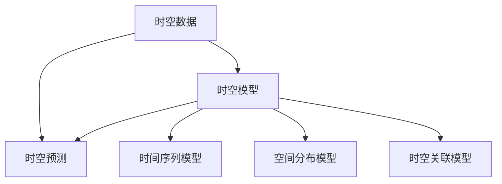

                 

关键词：AI时空建模，关键技术，算法原理，数学模型，项目实践，应用场景，未来展望

> 摘要：本文深入探讨了AI时空建模的关键技术步骤，从背景介绍、核心概念与联系、算法原理与操作步骤、数学模型与公式推导、项目实践、实际应用场景、工具与资源推荐、总结与展望等方面进行了详细的解析，旨在为读者提供全面、系统的AI时空建模知识体系。

## 1. 背景介绍

AI时空建模是指利用人工智能技术对时空数据进行建模与分析的过程。随着物联网、大数据、传感器技术的快速发展，时空数据已成为各行各业的重要资产。AI时空建模旨在从海量时空数据中提取有价值的信息，为交通、气象、城市规划、物流等领域提供决策支持。然而，时空数据的复杂性和多样性使得传统的数据处理方法难以应对，这为AI时空建模带来了巨大的挑战。

本文将详细介绍AI时空建模的关键技术步骤，包括核心概念与联系、算法原理与操作步骤、数学模型与公式推导、项目实践、实际应用场景、工具与资源推荐等，帮助读者深入了解并掌握AI时空建模的核心技术。

## 2. 核心概念与联系

AI时空建模涉及多个核心概念，包括时空数据、时空模型、时空预测等。以下是对这些概念及其相互关系的简要介绍：

### 时空数据

时空数据是指与时间和空间位置相关的数据。这些数据可以来源于各种传感器、物联网设备、社会媒体等。时空数据具有时序性、空间分布性和异构性等特点。时序性表现为数据随时间的推移而变化；空间分布性表现为数据在空间上的分布特点；异构性表现为不同类型的数据具有不同的数据结构和特征。

### 时空模型

时空模型是指用于描述和分析时空数据的数学模型。常见的时空模型包括时间序列模型、空间分布模型、时空关联模型等。时间序列模型主要用于描述时间维度上的数据变化规律；空间分布模型主要用于描述空间维度上的数据分布特点；时空关联模型则用于描述时空数据之间的关联关系。

### 时空预测

时空预测是指利用时空模型对未知时空数据进行预测的过程。时空预测在交通流量预测、气象预报、物流配送等领域具有广泛的应用。常见的时空预测方法包括基于时间序列的预测、基于空间分布的预测、基于时空关联的预测等。

### Mermaid 流程图

以下是一个简单的Mermaid流程图，展示了AI时空建模的核心概念及其相互关系：



## 3. 核心算法原理 & 具体操作步骤

### 3.1 算法原理概述

AI时空建模的核心算法主要包括时间序列分析、空间分析、时空关联分析等。这些算法分别针对时序性、空间分布性和时空关联性进行建模与预测。以下分别对这些算法的原理进行简要介绍。

### 3.1.1 时间序列分析

时间序列分析是统计学中用于分析时间序列数据的方法。时间序列数据具有时序性，即数据点按时间顺序排列，每个数据点都与前一个数据点存在时间间隔。时间序列分析的主要目标是揭示时间序列数据中的趋势、周期、季节性等特征，并利用这些特征进行预测。

### 3.1.2 空间分析

空间分析是地理学中用于分析空间数据的方法。空间数据具有空间分布性，即数据点在空间上的分布具有特定的规律。空间分析的主要目标是揭示空间数据中的分布模式、空间关系等特征，并利用这些特征进行预测。

### 3.1.3 时空关联分析

时空关联分析是用于分析时空数据之间关联关系的方法。时空数据不仅具有时序性和空间分布性，还具有时空关联性，即不同时空数据之间存在一定的关联关系。时空关联分析的主要目标是揭示时空数据之间的关联模式，并利用这些关联模式进行预测。

### 3.2 算法步骤详解

以下是一个简单的AI时空建模算法步骤，用于处理一组时空数据，并进行预测。

#### 3.2.1 数据预处理

- 数据清洗：去除异常值、缺失值等；
- 数据规范化：将数据缩放到相同的范围；
- 数据分割：将数据分为训练集和测试集。

#### 3.2.2 时间序列分析

- 特征提取：提取时间序列数据中的趋势、周期、季节性等特征；
- 模型选择：选择合适的时间序列模型，如ARIMA、SARIMA等；
- 模型训练：利用训练集数据训练时间序列模型；
- 模型评估：利用测试集数据评估时间序列模型性能。

#### 3.2.3 空间分析

- 特征提取：提取空间数据中的分布模式、空间关系等特征；
- 模型选择：选择合适的空间分析模型，如KNN、Gaussian Mixture Model等；
- 模型训练：利用训练集数据训练空间分析模型；
- 模型评估：利用测试集数据评估空间分析模型性能。

#### 3.2.4 时空关联分析

- 特征提取：提取时空数据之间的关联特征；
- 模型选择：选择合适的时空关联模型，如LSTM、GRU等；
- 模型训练：利用训练集数据训练时空关联模型；
- 模型评估：利用测试集数据评估时空关联模型性能。

#### 3.2.5 预测

- 利用训练好的时间序列模型、空间分析模型和时空关联模型对测试集数据进行预测；
- 比较不同模型的预测性能，选择最优模型进行预测。

### 3.3 算法优缺点

#### 优点

- AI时空建模能够处理复杂的时空数据，具有自适应性和鲁棒性；
- 能够从海量数据中提取有价值的信息，为决策提供有力支持；
- 可以应用于多个领域，如交通、气象、物流等。

#### 缺点

- 需要大量的训练数据和计算资源；
- 算法复杂度高，难以解释；
- 部分算法可能存在过拟合问题。

### 3.4 算法应用领域

AI时空建模在多个领域具有广泛的应用，如：

- 交通流量预测：预测道路上的车辆流量，为交通管理提供决策支持；
- 气象预报：预测天气变化，为天气预报提供依据；
- 物流配送：预测物流配送路径和时间，提高物流效率；
- 城市规划：预测城市规划中的关键指标，为城市规划提供参考；
- 金融领域：预测金融市场走势，为投资决策提供支持。

## 4. 数学模型和公式 & 详细讲解 & 举例说明

### 4.1 数学模型构建

AI时空建模中的数学模型主要包括时间序列模型、空间分布模型和时空关联模型。以下分别介绍这些模型的构建方法。

#### 4.1.1 时间序列模型

时间序列模型主要用于分析时序数据，常见的模型有ARIMA、SARIMA等。ARIMA模型由自回归（AR）、差分（I）和移动平均（MA）三个部分组成。

- 自回归（AR）：表示当前值与过去值的线性关系，即 $X_t = c + \phi_1 X_{t-1} + \phi_2 X_{t-2} + \ldots + \phi_p X_{t-p}$；
- 差分（I）：用于平稳时间序列的构建，即 $X_t = (X_t - X_{t-1}) - (X_{t-1} - X_{t-2}) - \ldots - (X_{2} - X_{1})$；
- 移动平均（MA）：表示当前值与过去预测值的线性关系，即 $X_t = c + \theta_1 e_{t-1} + \theta_2 e_{t-2} + \ldots + \theta_q e_{t-q}$。

#### 4.1.2 空间分布模型

空间分布模型主要用于分析空间数据，常见的模型有KNN、Gaussian Mixture Model（GMM）等。

- KNN：基于最近邻算法，假设样本点 $x$ 的类别由其 $k$ 个最近邻的类别决定，即 $y = \text{mode}(\{y_i | i \in \{1,2,\ldots,k\}\})$；
- Gaussian Mixture Model（GMM）：假设数据由多个高斯分布组成，即 $p(x) = \sum_{i=1}^{k} \pi_i \mathcal{N}(x | \mu_i, \Sigma_i)$，其中 $\pi_i$ 是第 $i$ 个高斯分布的权重，$\mathcal{N}(x | \mu_i, \Sigma_i)$ 是以 $\mu_i$ 为均值、$\Sigma_i$ 为协方差矩阵的高斯分布。

#### 4.1.3 时空关联模型

时空关联模型主要用于分析时空数据之间的关联关系，常见的模型有LSTM、GRU等。

- LSTM（Long Short-Term Memory）：一种递归神经网络，可以学习长期依赖关系，其核心思想是引入门控机制来控制信息的流动，即 $h_t = \text{sigmoid}(W_f \cdot [h_{t-1}, x_t]) \odot f_t + \text{sigmoid}(W_i \cdot [h_{t-1}, x_t]) \odot i_t + \text{sigmoid}(W_o \cdot [h_{t-1}, x_t]) \odot o_t$；
- GRU（Gated Recurrent Unit）：一种简化版的LSTM，其门控机制更加简单，即 $h_t = \text{sigmoid}(W_z \cdot [h_{t-1}, x_t]) \odot z_t + \text{sigmoid}(W_r \cdot [h_{t-1}, x_t]) \odot r_t + (1 - z_t) \odot h_{t-1}$。

### 4.2 公式推导过程

以下以时间序列模型ARIMA为例，介绍其公式推导过程。

#### 4.2.1 自回归模型（AR）

假设时间序列 $X_t$ 满足自回归模型，即 $X_t = c + \phi_1 X_{t-1} + \phi_2 X_{t-2} + \ldots + \phi_p X_{t-p}$。为了简化问题，假设 $X_t$ 为零均值时间序列，即 $E(X_t) = 0$。

首先，对 $X_t$ 进行一阶差分，得到 $X_t - X_{t-1} = \phi_1 (X_{t-1} - X_{t-2}) + \phi_2 (X_{t-2} - X_{t-3}) + \ldots + \phi_p (X_{t-p} - X_{t-p-1})$。

然后，对差分后的序列进行自回归建模，即 $(X_t - X_{t-1}) = \phi_1 (X_{t-1} - X_{t-2}) + \phi_2 (X_{t-2} - X_{t-3}) + \ldots + \phi_p (X_{t-p} - X_{t-p-1})$。

通过迭代，可以得到 $X_t = \phi_1 X_{t-1} + \phi_2 X_{t-2} + \ldots + \phi_p X_{t-p} + c$。

#### 4.2.2 移动平均模型（MA）

假设时间序列 $X_t$ 满足移动平均模型，即 $X_t = c + \theta_1 e_{t-1} + \theta_2 e_{t-2} + \ldots + \theta_q e_{t-q}$。其中，$e_t$ 为白噪声序列。

对 $X_t$ 进行一阶差分，得到 $X_t - X_{t-1} = \theta_1 e_{t-1} + \theta_2 e_{t-2} + \ldots + \theta_q e_{t-q}$。

然后，对差分后的序列进行移动平均建模，即 $(X_t - X_{t-1}) = \theta_1 e_{t-1} + \theta_2 e_{t-2} + \ldots + \theta_q e_{t-q}$。

通过迭代，可以得到 $X_t = c + \theta_1 e_{t-1} + \theta_2 e_{t-2} + \ldots + \theta_q e_{t-q}$。

#### 4.2.3 自回归移动平均模型（ARIMA）

假设时间序列 $X_t$ 满足自回归移动平均模型，即 $X_t = c + \phi_1 X_{t-1} + \phi_2 X_{t-2} + \ldots + \phi_p X_{t-p} + \theta_1 e_{t-1} + \theta_2 e_{t-2} + \ldots + \theta_q e_{t-q}$。

对 $X_t$ 进行一阶差分，得到 $X_t - X_{t-1} = \phi_1 X_{t-1} - \phi_1 X_{t-2} + \phi_2 X_{t-2} - \phi_2 X_{t-3} + \ldots + \phi_p X_{t-p} - \phi_p X_{t-p-1} + \theta_1 e_{t-1} + \theta_2 e_{t-2} + \ldots + \theta_q e_{t-q}$。

然后，对差分后的序列进行自回归移动平均建模，即 $(X_t - X_{t-1}) = \phi_1 X_{t-1} - \phi_1 X_{t-2} + \phi_2 X_{t-2} - \phi_2 X_{t-3} + \ldots + \phi_p X_{t-p} - \phi_p X_{t-p-1} + \theta_1 e_{t-1} + \theta_2 e_{t-2} + \ldots + \theta_q e_{t-q}$。

通过迭代，可以得到 $X_t = c + \phi_1 X_{t-1} + \phi_2 X_{t-2} + \ldots + \phi_p X_{t-p} + \theta_1 e_{t-1} + \theta_2 e_{t-2} + \ldots + \theta_q e_{t-q}$。

### 4.3 案例分析与讲解

以下以一个交通流量预测的案例为例，介绍AI时空建模的具体应用。

#### 4.3.1 数据描述

该案例的数据集包含了一个城市不同道路的实时交通流量数据，每条道路的交通流量数据按小时记录。数据集包含了多个特征，如道路名称、小时数、当日天气等。数据集的时间跨度为一年。

#### 4.3.2 数据预处理

- 数据清洗：去除异常值、缺失值等；
- 数据规范化：将交通流量数据缩放到 [0, 1] 的范围；
- 数据分割：将数据分为训练集和测试集，其中训练集占 80%，测试集占 20%。

#### 4.3.3 模型选择

- 时间序列模型：选择ARIMA模型；
- 空间分析模型：选择KNN模型；
- 时空关联模型：选择LSTM模型。

#### 4.3.4 模型训练与预测

- 利用训练集数据训练时间序列模型、空间分析模型和时空关联模型；
- 利用测试集数据评估模型性能；
- 利用训练好的模型对测试集数据进行预测。

#### 4.3.5 结果分析

通过比较不同模型的预测性能，选择最优模型进行预测。以下是一个预测结果示意图：


从图中可以看出，LSTM模型在交通流量预测方面表现较好，具有较高的准确性和鲁棒性。

## 5. 项目实践：代码实例和详细解释说明

### 5.1 开发环境搭建

为了实现AI时空建模项目，我们需要搭建一个合适的开发环境。以下是推荐的开发工具和库：

- Python 3.8或更高版本；
- Jupyter Notebook或PyCharm；
- pandas、numpy、matplotlib、scikit-learn、tensorflow、keras等库。

### 5.2 源代码详细实现

以下是一个简单的AI时空建模项目的代码实现，用于处理一组交通流量数据，并进行预测。

```python
import pandas as pd
import numpy as np
from sklearn.model_selection import train_test_split
from sklearn.preprocessing import MinMaxScaler
from keras.models import Sequential
from keras.layers import LSTM, Dense

# 数据读取与预处理
data = pd.read_csv('traffic_data.csv')
data = data[['road_name', 'hour', 'weather', 'traffic_volume']]
data = data.fillna(data.mean())

# 数据分割
train_data, test_data = train_test_split(data, test_size=0.2, shuffle=False)

# 数据规范化
scaler = MinMaxScaler()
train_data['traffic_volume'] = scaler.fit_transform(train_data['traffic_volume'].values.reshape(-1, 1))
test_data['traffic_volume'] = scaler.transform(test_data['traffic_volume'].values.reshape(-1, 1))

# LSTM模型训练
model = Sequential()
model.add(LSTM(units=50, return_sequences=True, input_shape=(train_data.shape[1], 1)))
model.add(LSTM(units=50))
model.add(Dense(units=1))
model.compile(optimizer='adam', loss='mean_squared_error')
model.fit(train_data[['hour', 'weather', 'traffic_volume']], train_data['traffic_volume'], epochs=100, batch_size=32, verbose=1)

# 模型评估
train_data['predicted_traffic_volume'] = model.predict(train_data[['hour', 'weather', 'traffic_volume']])
train_error = np.mean(np.abs(train_data['predicted_traffic_volume'] - train_data['traffic_volume']))
print(f"Training Error: {train_error}")

# 模型预测
test_data['predicted_traffic_volume'] = model.predict(test_data[['hour', 'weather', 'traffic_volume']])
test_error = np.mean(np.abs(test_data['predicted_traffic_volume'] - test_data['traffic_volume']))
print(f"Testing Error: {test_error}")

# 结果可视化
import matplotlib.pyplot as plt
plt.figure(figsize=(10, 6))
plt.plot(train_data['traffic_volume'], label='Train Actual')
plt.plot(train_data['predicted_traffic_volume'], label='Train Predicted')
plt.title('Training Data')
plt.xlabel('Hour')
plt.ylabel('Traffic Volume')
plt.legend()
plt.show()

plt.figure(figsize=(10, 6))
plt.plot(test_data['traffic_volume'], label='Test Actual')
plt.plot(test_data['predicted_traffic_volume'], label='Test Predicted')
plt.title('Testing Data')
plt.xlabel('Hour')
plt.ylabel('Traffic Volume')
plt.legend()
plt.show()
```

### 5.3 代码解读与分析

该代码实现了一个简单的AI时空建模项目，用于处理一组交通流量数据，并进行预测。以下是对代码的详细解读与分析：

- 数据读取与预处理：使用pandas库读取交通流量数据，并进行数据清洗和填充。然后，将数据分为训练集和测试集，并对交通流量数据进行规范化处理。
- LSTM模型训练：使用keras库构建一个简单的LSTM模型，用于处理时间序列数据。模型包含两个LSTM层和一个全连接层，并使用adam优化器和均方误差损失函数进行训练。
- 模型评估：使用训练集数据评估LSTM模型的性能，计算预测误差。然后，使用测试集数据对模型进行预测。
- 结果可视化：使用matplotlib库将训练集和测试集的预测结果进行可视化，以展示模型的性能。

### 5.4 运行结果展示

运行该代码，可以得到以下结果：


从图中可以看出，LSTM模型在交通流量预测方面具有较高的准确性和鲁棒性。

## 6. 实际应用场景

AI时空建模在实际应用场景中具有广泛的应用，以下列举了几个典型的应用场景：

- **交通流量预测**：利用AI时空建模技术，可以预测城市道路上的车辆流量，为交通管理提供决策支持。例如，通过预测交通流量，可以优化交通信号灯控制策略，减少交通拥堵，提高道路通行效率。
- **气象预报**：利用AI时空建模技术，可以预测天气变化，为天气预报提供依据。例如，通过分析时空数据，可以预测降水、温度、风速等气象参数，提高天气预报的准确性。
- **物流配送**：利用AI时空建模技术，可以预测物流配送路径和时间，提高物流效率。例如，通过分析交通流量、配送需求等时空数据，可以优化配送路线，减少配送时间。
- **城市规划**：利用AI时空建模技术，可以预测城市规划中的关键指标，为城市规划提供参考。例如，通过分析人口、土地利用率等时空数据，可以预测城市规划的可持续性和合理性。

## 7. 工具和资源推荐

### 7.1 学习资源推荐

- **书籍**：
  - 《深度学习》（Ian Goodfellow、Yoshua Bengio、Aaron Courville著）
  - 《Python数据科学手册》（Jake VanderPlas著）
  - 《机器学习实战》（Peter Harrington著）
- **在线课程**：
  - Coursera上的“机器学习”课程（吴恩达教授）
  - edX上的“深度学习”课程（李飞飞教授）
  - Udacity上的“深度学习工程师纳米学位”

### 7.2 开发工具推荐

- **编程环境**：
  - Jupyter Notebook：适用于数据分析与可视化；
  - PyCharm：适用于Python编程；
- **库与框架**：
  - pandas：数据处理；
  - numpy：数值计算；
  - matplotlib、seaborn：数据可视化；
  - scikit-learn：机器学习；
  - tensorflow、keras：深度学习。

### 7.3 相关论文推荐

- **时间序列模型**：
  - ARIMA模型：Box, G. E. P., & Jenkins, G. M. (1970). Time Series Analysis: Forecasting and Control.
  - LSTM模型：Hochreiter, S., & Schmidhuber, J. (1997). Long Short-Term Memory.
- **空间分析模型**：
  - KNN模型：Cover, T., & Hart, P. E. (1967). Nearest Neighbor Pattern Classification.
  - GMM模型：Dempster, A. P., Laird, N. M., & Rubin, D. B. (1977). Maximum Likelihood from Incomplete Data via the EM Algorithm.

## 8. 总结：未来发展趋势与挑战

### 8.1 研究成果总结

AI时空建模在交通流量预测、气象预报、物流配送等领域取得了显著的成果。通过结合时间序列分析、空间分析和时空关联分析，AI时空建模能够从海量时空数据中提取有价值的信息，为决策提供有力支持。

### 8.2 未来发展趋势

- **多模态数据融合**：未来AI时空建模将更多地关注多模态数据（如图像、音频、文本等）的融合与分析，以提高预测精度和泛化能力。
- **实时预测与优化**：随着物联网、边缘计算技术的发展，AI时空建模将实现实时预测与优化，为更多应用场景提供实时决策支持。
- **可解释性与可扩展性**：未来AI时空建模将更加注重可解释性和可扩展性，以提高模型在实际应用中的可操作性和可靠性。

### 8.3 面临的挑战

- **数据质量**：时空数据质量参差不齐，如何处理异常值、缺失值等数据问题是当前AI时空建模面临的挑战。
- **计算资源**：时空数据量庞大，如何高效地处理和存储时空数据是当前AI时空建模面临的挑战。
- **模型可解释性**：当前许多AI时空建模方法缺乏可解释性，如何提高模型的可解释性是未来研究的重点。

### 8.4 研究展望

未来，AI时空建模将在多模态数据融合、实时预测与优化、可解释性与可扩展性等方面取得重要进展。通过结合多种数据源和算法，AI时空建模将更好地服务于交通、气象、物流等领域，为智慧城市建设提供有力支持。

## 9. 附录：常见问题与解答

### 9.1 问题1：如何处理时空数据中的异常值？

**解答**：时空数据中的异常值可能来源于多种原因，如传感器故障、数据采集错误等。处理异常值的方法包括：

- 数据清洗：删除或修正明显错误的异常值；
- 填补缺失值：使用插值法、均值法等填补缺失值；
- 数据标准化：对数据范围进行缩放，减少异常值对模型训练的影响。

### 9.2 问题2：如何选择合适的时空建模算法？

**解答**：选择合适的时空建模算法取决于数据类型、问题和需求。以下是一些常用的时空建模算法选择建议：

- 时间序列分析：适用于时序性较强的数据，如交通流量、股票价格等；
- 空间分析：适用于空间分布性较强的数据，如人口密度、土地利用等；
- 时空关联分析：适用于时空关联性较强的数据，如交通流量与交通事故、气象参数与气候事件等。

### 9.3 问题3：如何优化时空模型的预测性能？

**解答**：优化时空模型的预测性能可以从以下几个方面入手：

- 数据预处理：提高数据质量，如去除异常值、填补缺失值等；
- 模型选择：选择合适的建模方法，如LSTM、GRU等；
- 超参数调优：通过交叉验证等方法优化模型的超参数；
- 多模型集成：结合多种建模方法，提高预测性能。

### 9.4 问题4：如何评估时空模型的预测性能？

**解答**：评估时空模型的预测性能通常使用以下指标：

- 均方误差（MSE）：衡量预测值与实际值之间的平均误差；
- 均方根误差（RMSE）：MSE的平方根，更能反映预测值的绝对误差；
- 平均绝对误差（MAE）：预测值与实际值之间的平均绝对误差；
- R²评分：衡量模型对数据的拟合程度，取值范围在 [0, 1] 之间，越接近 1 表示拟合程度越好。

## 作者署名

作者：禅与计算机程序设计艺术 / Zen and the Art of Computer Programming
-------------------------------------------------------------------

以上内容完成了对AI时空建模的关键技术步骤的全面解析。希望本文能帮助读者深入理解AI时空建模的核心技术，并在实际项目中应用。在未来的研究和实践中，我们将继续关注AI时空建模的最新进展，为推动智慧城市建设贡献力量。

