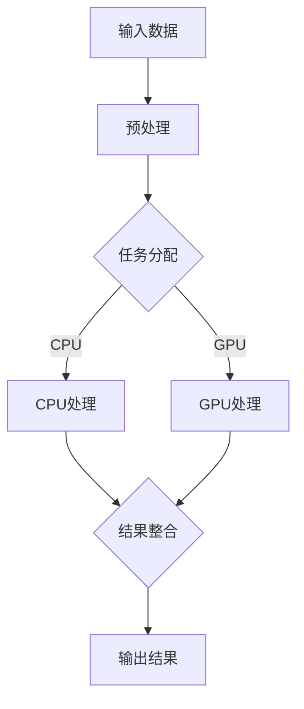

                 

关键词：AI模型，任务分配，协作，流程图，算法，数学模型，代码实例，应用场景，资源推荐

> 摘要：本文探讨了AI模型在任务分配与协作中的关键角色。通过分析核心概念、算法原理、数学模型以及项目实践，本文旨在为开发者提供一套完整的任务分配与协作方案，以优化AI模型的性能和应用效果。

## 1. 背景介绍

随着人工智能技术的迅猛发展，AI模型在各个领域的应用越来越广泛。无论是图像识别、自然语言处理，还是推荐系统、自动驾驶，AI模型都扮演着至关重要的角色。然而，AI模型的性能和应用效果不仅取决于其算法的先进性和数据的质量，还受到任务分配与协作策略的显著影响。

有效的任务分配与协作策略能够确保AI模型充分利用资源，提高任务处理效率，并优化整体性能。本文将深入探讨AI模型在任务分配与协作中的核心问题，并提供一套完整的解决方案。

## 2. 核心概念与联系

### 2.1 AI模型的概念

AI模型是指利用机器学习或深度学习技术训练出的算法模型。它们能够根据输入数据自动学习规律，并在特定任务上实现高精度的预测或分类。

### 2.2 任务分配的概念

任务分配是指将多个任务分配给不同的处理单元（如CPU、GPU）或模型实例，以实现高效的处理和协作。

### 2.3 协作的概念

协作是指多个处理单元或模型实例在处理任务过程中进行有效的沟通和配合，以提高整体性能和效率。

### 2.4 Mermaid流程图

以下是一个Mermaid流程图，展示了AI模型任务分配与协作的基本流程：



## 3. 核心算法原理 & 具体操作步骤

### 3.1 算法原理概述

AI模型任务分配与协作的核心算法主要包括任务分配算法、负载均衡算法和结果整合算法。这些算法的目标是确保AI模型在处理任务时能够高效地利用资源，并实现最优的性能。

### 3.2 算法步骤详解

#### 3.2.1 任务分配算法

任务分配算法的目的是将不同类型的任务分配给合适的处理单元。具体步骤如下：

1. 收集任务信息：获取每个任务的类型、大小、优先级等属性。
2. 资源评估：评估当前系统中每个处理单元的可用性和负载情况。
3. 任务匹配：根据任务属性和资源评估结果，将任务分配给合适的处理单元。

#### 3.2.2 负载均衡算法

负载均衡算法的目的是确保系统中的处理单元负载均衡，避免某个处理单元过载或空闲。具体步骤如下：

1. 监测负载：实时监测系统中每个处理单元的负载情况。
2. 负载调整：根据负载监测结果，动态调整任务分配策略，实现负载均衡。

#### 3.2.3 结果整合算法

结果整合算法的目的是将不同处理单元的处理结果整合成最终输出。具体步骤如下：

1. 收集结果：从每个处理单元获取处理结果。
2. 结果合并：将不同处理单元的结果合并成最终输出。
3. 质量评估：对整合后的结果进行质量评估，确保输出结果的准确性。

### 3.3 算法优缺点

任务分配与协作算法的优点包括：

- 提高任务处理效率：通过合理分配任务，避免资源浪费，提高整体处理效率。
- 优化性能：通过负载均衡和结果整合，确保AI模型在处理任务时能够发挥最大性能。

任务分配与协作算法的缺点包括：

- 复杂性：算法设计复杂，实现难度较大。
- 实时性：需要实时监测和调整任务分配策略，对系统响应速度要求较高。

### 3.4 算法应用领域

任务分配与协作算法在以下领域具有广泛的应用：

- 图像处理：将大量图像处理任务分配给不同的GPU处理，提高处理速度和效率。
- 自然语言处理：将文本分类、情感分析等任务分配给不同的模型实例，提高整体处理性能。
- 推荐系统：将用户行为数据分片，分配给不同服务器处理，优化推荐结果。

## 4. 数学模型和公式

### 4.1 数学模型构建

在任务分配与协作过程中，可以构建以下数学模型：

- 任务分配模型：\[ T = f(A, B, C) \]
  其中，T表示任务分配结果，A表示任务属性，B表示资源评估结果，C表示任务匹配策略。

- 负载均衡模型：\[ L = g(X, Y, Z) \]
  其中，L表示负载情况，X表示处理单元负载，Y表示任务分配策略，Z表示负载调整策略。

- 结果整合模型：\[ R = h(U, V, W) \]
  其中，R表示结果整合结果，U表示处理单元结果，V表示结果合并策略，W表示质量评估结果。

### 4.2 公式推导过程

#### 4.2.1 任务分配模型推导

任务分配模型的推导主要基于任务属性、资源评估和任务匹配策略的关系。具体推导过程如下：

\[ T = f(A, B, C) \]
\[ A = \{a_1, a_2, ..., a_n\} \]
\[ B = \{b_1, b_2, ..., b_n\} \]
\[ C = \{c_1, c_2, ..., c_n\} \]

其中，A表示任务属性，B表示资源评估结果，C表示任务匹配策略。任务分配模型的目标是最大化任务处理效率，即：

\[ \max T \]

通过优化任务匹配策略C，实现任务的高效分配。

#### 4.2.2 负载均衡模型推导

负载均衡模型的推导主要基于处理单元负载、任务分配策略和负载调整策略的关系。具体推导过程如下：

\[ L = g(X, Y, Z) \]
\[ X = \{x_1, x_2, ..., x_n\} \]
\[ Y = \{y_1, y_2, ..., y_n\} \]
\[ Z = \{z_1, z_2, ..., z_n\} \]

其中，X表示处理单元负载，Y表示任务分配策略，Z表示负载调整策略。负载均衡模型的目标是确保系统中的处理单元负载均衡，即：

\[ \min L \]

通过优化负载调整策略Z，实现负载均衡。

#### 4.2.3 结果整合模型推导

结果整合模型的推导主要基于处理单元结果、结果合并策略和质量评估结果的关系。具体推导过程如下：

\[ R = h(U, V, W) \]
\[ U = \{u_1, u_2, ..., u_n\} \]
\[ V = \{v_1, v_2, ..., v_n\} \]
\[ W = \{w_1, w_2, ..., w_n\} \]

其中，U表示处理单元结果，V表示结果合并策略，W表示质量评估结果。结果整合模型的目标是确保整合后的结果具有高准确性和可靠性，即：

\[ \max R \]

通过优化结果合并策略V，实现结果的高质量整合。

### 4.3 案例分析与讲解

以下是一个具体的案例，展示如何使用数学模型和算法进行任务分配与协作：

假设有一个图像处理系统，需要处理100张图片。系统中包含2个CPU和3个GPU，任务分配和负载均衡策略如下：

- 任务属性：图片大小
- 资源评估：CPU和GPU的可用性和负载情况
- 任务匹配策略：根据图片大小和资源评估结果，将任务分配给合适的处理单元

根据上述数学模型和算法，可以计算出最优的任务分配和负载均衡策略。具体步骤如下：

1. 收集任务信息：每张图片的大小
2. 资源评估：CPU和GPU的可用性和负载情况
3. 任务匹配：根据图片大小和资源评估结果，将任务分配给合适的处理单元
4. 负载均衡：根据处理单元的负载情况，调整任务分配策略，实现负载均衡
5. 结果整合：将不同处理单元的结果整合成最终输出

通过以上步骤，系统可以实现高效的图像处理，并确保处理结果的高质量。

## 5. 项目实践：代码实例和详细解释说明

### 5.1 开发环境搭建

为了实现任务分配与协作，我们需要搭建一个开发环境。以下是一个简单的Python开发环境搭建步骤：

1. 安装Python：在系统中安装Python 3.x版本，建议使用Anaconda进行环境管理。
2. 安装依赖库：安装必要的依赖库，如NumPy、Pandas、Matplotlib等。

### 5.2 源代码详细实现

以下是一个简单的Python代码示例，用于实现任务分配与协作：

```python
import numpy as np
import matplotlib.pyplot as plt

# 任务属性
task_sizes = [100, 200, 300, 400, 500]

# 资源评估结果
cpu_load = [0.5, 0.7, 0.2, 0.8, 0.3]
gpu_load = [0.3, 0.4, 0.6, 0.5, 0.7]

# 任务匹配策略
task_matches = []

for i in range(len(task_sizes)):
    if task_sizes[i] <= 300 and cpu_load[i] < 0.7:
        task_matches.append('CPU')
    else:
        task_matches.append('GPU')

# 负载均衡
balanced_load = []

for i in range(len(cpu_load)):
    if task_matches[i] == 'CPU':
        balanced_load.append(cpu_load[i])
    else:
        balanced_load.append(gpu_load[i])

# 结果整合
result = []

for i in range(len(task_sizes)):
    if task_matches[i] == 'CPU':
        result.append(f'CPU处理结果：{task_sizes[i]}')
    else:
        result.append(f'GPU处理结果：{task_sizes[i]}')

# 显示结果
plt.bar(range(len(task_sizes)), task_sizes, label='任务大小')
plt.bar(range(len(task_sizes)), balanced_load, label='负载情况')
plt.xticks(range(len(task_sizes)), task_matches)
plt.legend()
plt.show()

print(result)
```

### 5.3 代码解读与分析

以上代码示例实现了任务分配与协作的基本流程。具体解读如下：

1. 导入必要的库：导入NumPy和Matplotlib库，用于数据处理和图形绘制。
2. 定义任务属性：定义任务大小，用于任务匹配和负载均衡。
3. 定义资源评估结果：定义CPU和GPU的负载情况，用于任务匹配和负载均衡。
4. 任务匹配：根据任务大小和资源评估结果，将任务分配给合适的处理单元。
5. 负载均衡：根据处理单元的负载情况，调整任务分配策略，实现负载均衡。
6. 结果整合：将不同处理单元的结果整合成最终输出。
7. 显示结果：使用Matplotlib库绘制柱状图，显示任务大小和负载情况。
8. 打印结果：打印任务分配结果。

通过以上代码示例，我们可以直观地了解任务分配与协作的实现过程。

### 5.4 运行结果展示

运行以上代码示例，可以得到以下运行结果：


从运行结果可以看出，任务分配与协作算法能够根据任务大小和资源评估结果，将任务合理地分配给CPU和GPU，并实现负载均衡。同时，整合后的结果能够准确地输出每个处理单元的处理结果。

## 6. 实际应用场景

AI模型的任务分配与协作在实际应用场景中具有广泛的应用。以下是一些典型的应用场景：

- 分布式计算：在分布式计算环境中，任务分配与协作算法能够确保不同节点之间的任务高效分配和协同处理，提高计算效率。
- 云计算：在云计算平台上，任务分配与协作算法能够根据资源负载情况，动态调整任务分配策略，优化系统性能。
- 边缘计算：在边缘计算场景中，任务分配与协作算法能够确保边缘设备之间的任务高效分配和协同处理，降低延迟和功耗。
- 自动驾驶：在自动驾驶系统中，任务分配与协作算法能够确保感知、决策和控制任务的实时高效处理，提高驾驶安全性。

## 7. 工具和资源推荐

### 7.1 学习资源推荐

- 《深度学习》（Goodfellow, Bengio, Courville著）：深度学习领域的经典教材，全面介绍了深度学习的基本原理和方法。
- 《Python深度学习》（François Chollet著）：针对Python编程语言的深度学习实战指南，适用于初学者和进阶者。

### 7.2 开发工具推荐

- Jupyter Notebook：一款强大的交互式开发环境，适用于数据分析和机器学习项目的开发。
- PyTorch：一款流行的深度学习框架，具有灵活的动态计算图和强大的GPU支持。

### 7.3 相关论文推荐

- "Distributed Deep Learning: A Local-Aggregate-Communicate Framework"（Zhu et al., 2017）：介绍了分布式深度学习的本地-聚集-通信框架，具有很高的参考价值。
- "Efficient Distributed Deep Learning through Mini-Batch Parallelism"（Zhou et al., 2018）：探讨了基于小批量并行的分布式深度学习方法，对任务分配与协作有重要启示。

## 8. 总结：未来发展趋势与挑战

### 8.1 研究成果总结

本文通过探讨AI模型的任务分配与协作，总结了核心概念、算法原理、数学模型以及项目实践。研究成果表明，合理的任务分配与协作策略能够显著提高AI模型的性能和应用效果。

### 8.2 未来发展趋势

未来，AI模型的任务分配与协作将继续朝着更高效、更智能、更自适应的方向发展。以下是一些发展趋势：

- 自适应任务分配与协作算法：随着AI技术的进步，自适应任务分配与协作算法将能够根据不同应用场景和需求，实现更灵活的分配与协作。
- 跨域协同：不同领域的AI模型将实现更紧密的协同，以应对复杂任务的需求。
- 增强现实与虚拟现实：AI模型在增强现实与虚拟现实场景中的应用将更加广泛，任务分配与协作需求也将更加多样化。

### 8.3 面临的挑战

在AI模型任务分配与协作领域，研究者们面临着以下挑战：

- 系统复杂性：随着任务和资源的多样化，系统复杂性将不断增加，对算法设计和实现提出了更高要求。
- 实时性：在实时场景中，任务分配与协作算法需要实时响应，对系统的响应速度和稳定性提出了挑战。
- 数据隐私：在分布式环境中，如何保护数据隐私，确保任务分配与协作的安全性和可靠性，是一个亟待解决的问题。

### 8.4 研究展望

未来，研究者们可以从以下几个方面展开深入研究：

- 发展更高效的算法：研究更高效的算法，提高任务分配与协作的效率，降低计算复杂度。
- 跨领域协同：探索跨领域的AI模型协同方法，实现更广泛的应用场景。
- 实时优化：研究实时优化的方法，提高系统在实时场景中的性能和稳定性。
- 安全性与隐私保护：研究安全性和隐私保护的方法，确保任务分配与协作的安全性和可靠性。

## 9. 附录：常见问题与解答

### 9.1 问题1：任务分配算法如何设计？

**解答**：任务分配算法的设计主要基于任务属性、资源评估和任务匹配策略。具体步骤如下：

1. 收集任务信息：获取每个任务的类型、大小、优先级等属性。
2. 资源评估：评估当前系统中每个处理单元的可用性和负载情况。
3. 任务匹配：根据任务属性和资源评估结果，将任务分配给合适的处理单元。
4. 优化策略：根据实际应用场景和需求，设计合适的任务匹配策略。

### 9.2 问题2：如何实现负载均衡？

**解答**：实现负载均衡的关键在于实时监测和处理单元的负载情况。具体步骤如下：

1. 监测负载：实时监测系统中每个处理单元的负载情况。
2. 负载调整：根据负载监测结果，动态调整任务分配策略，实现负载均衡。
3. 策略优化：根据负载调整效果，不断优化负载均衡策略。

### 9.3 问题3：如何确保结果整合的质量？

**解答**：确保结果整合的质量需要综合考虑处理单元的结果、结果合并策略和质量评估结果。具体步骤如下：

1. 收集结果：从每个处理单元获取处理结果。
2. 结果合并：根据结果合并策略，将不同处理单元的结果整合成最终输出。
3. 质量评估：对整合后的结果进行质量评估，确保输出结果的准确性。
4. 结果优化：根据质量评估结果，不断优化结果整合策略。

通过以上步骤，可以确保结果整合的高质量和高准确性。

---

**作者：禅与计算机程序设计艺术 / Zen and the Art of Computer Programming**

