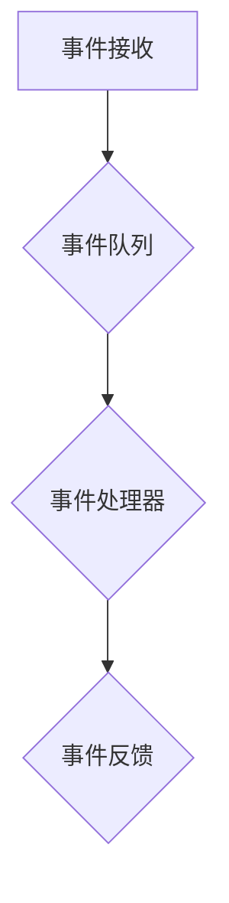
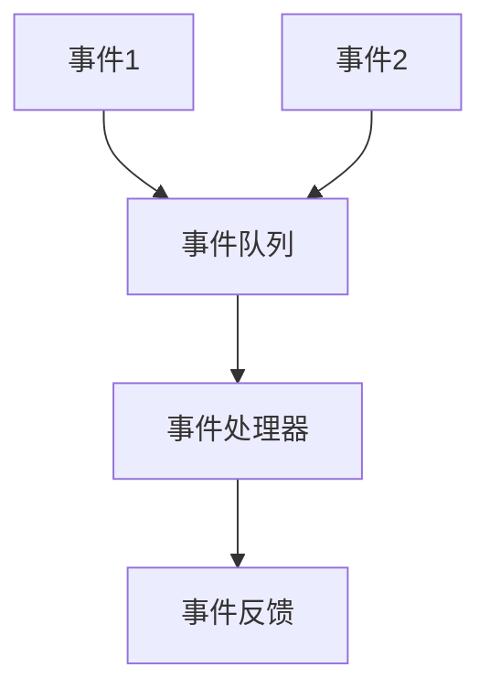
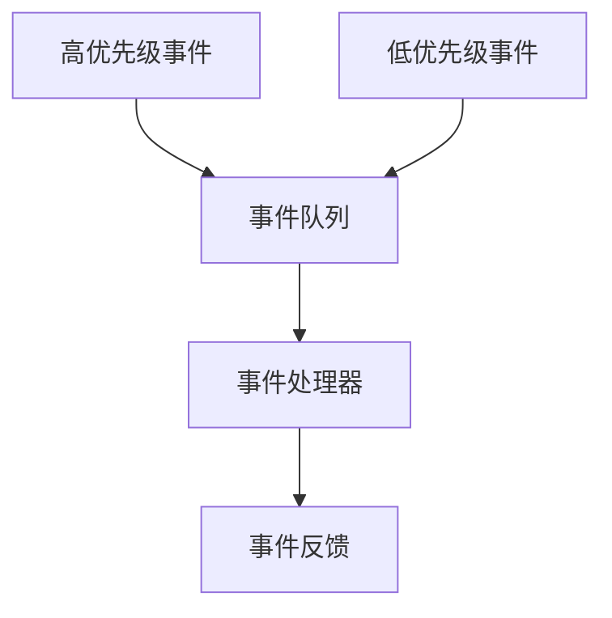
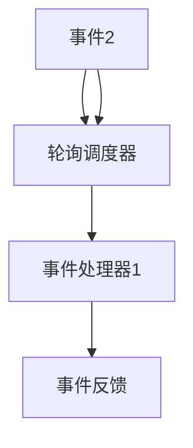
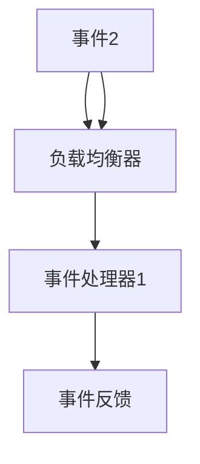
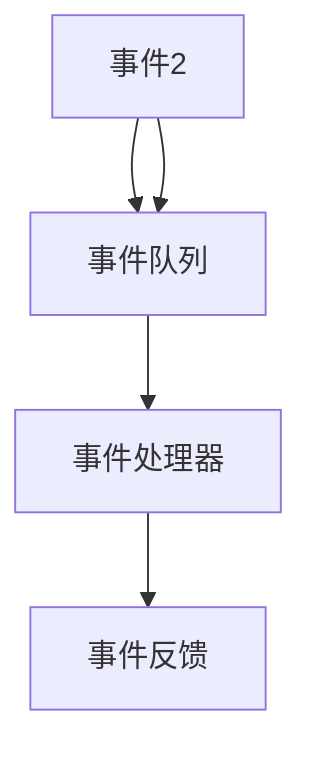

                 

关键词：AI系统，事件响应，流程设计，核心算法，数学模型，项目实践，应用场景，未来展望。

> 摘要：本文将深入探讨AI系统的事件响应流程，从背景介绍、核心概念与联系、算法原理与具体操作步骤、数学模型与公式推导、项目实践、实际应用场景、工具和资源推荐、总结未来发展趋势与挑战等多个方面展开论述。旨在为读者提供一份全面、系统、深入的AI事件响应技术指南。

## 1. 背景介绍

在当今的信息化时代，人工智能（AI）技术已经成为推动社会发展的重要力量。随着AI应用的不断普及，如何设计高效、可靠的AI系统事件响应流程成为了众多开发者和研究人员关注的焦点。AI系统的事件响应流程涉及到从事件接收、处理、到反馈的完整过程，其设计的好坏直接影响到系统的稳定性和用户体验。因此，研究和优化AI系统的事件响应流程具有重要的现实意义。

本文将围绕AI系统的事件响应流程展开讨论，旨在为读者提供一个清晰、系统的理解框架。文章结构如下：

1. 背景介绍：概述AI系统事件响应流程的重要性和研究现状。
2. 核心概念与联系：介绍AI系统事件响应流程中的核心概念，并提供Mermaid流程图展示。
3. 核心算法原理 & 具体操作步骤：详细解析事件响应流程中的核心算法，包括算法原理、步骤详解、优缺点分析和应用领域。
4. 数学模型和公式 & 详细讲解 & 举例说明：阐述事件响应流程中涉及的数学模型和公式，并进行详细讲解和案例分析。
5. 项目实践：提供实际项目中的代码实例和详细解释说明。
6. 实际应用场景：探讨AI系统事件响应流程在不同领域的应用场景。
7. 工具和资源推荐：推荐相关的学习资源、开发工具和相关论文。
8. 总结：总结研究成果，展望未来发展趋势与挑战。

## 2. 核心概念与联系

在AI系统的事件响应流程中，涉及到多个核心概念。以下是这些概念的定义和它们在流程中的联系。

### 2.1 事件

事件是触发AI系统响应的原始数据。它可以来源于用户操作、传感器数据、网络消息等。事件具有唯一标识、发生时间和相关属性等特点。

### 2.2 事件队列

事件队列是存储和管理事件的组件。当系统接收到事件后，会将事件放入事件队列中，按照一定的策略进行处理。

### 2.3 事件处理器

事件处理器是负责处理事件的核心组件。它根据事件的类型和属性，执行相应的处理逻辑，并生成响应结果。

### 2.4 事件反馈

事件反馈是系统对事件的最终处理结果。它可以包括处理结果、错误信息、日志记录等，用于指导后续的操作和优化。

以下是AI系统事件响应流程的Mermaid流程图：



### 2.5 事件队列策略

事件队列策略是决定事件处理顺序的重要因素。常见的队列策略包括先进先出（FIFO）、后进先出（LIFO）和优先级队列。以下是不同策略的Mermaid流程图：

#### 先进先出（FIFO）



#### 后进先出（LIFO）


#### 优先级队列



### 2.6 事件处理器调度

事件处理器调度是指系统如何选择和处理事件处理器。常见的调度算法包括轮询调度、负载均衡和事件驱动调度。以下是不同调度算法的Mermaid流程图：

#### 轮询调度



#### 负载均衡



#### 事件驱动调度



## 3. 核心算法原理 & 具体操作步骤

### 3.1 算法原理概述

AI系统的事件响应流程依赖于核心算法的执行。这些核心算法包括事件接收、事件队列管理、事件处理器调度和事件反馈生成。以下是这些算法的原理概述。

### 3.2 算法步骤详解

#### 事件接收

1. 系统初始化，启动事件接收模块。
2. 接收来自外部的事件，如用户操作、传感器数据等。
3. 为每个事件生成唯一的标识，记录事件的发生时间和相关属性。

#### 事件队列管理

1. 系统初始化，启动事件队列管理模块。
2. 根据预设的策略，将事件放入事件队列中。
3. 定期检查事件队列，处理队列中的事件。

#### 事件处理器调度

1. 系统初始化，启动事件处理器调度模块。
2. 根据调度算法，选择事件处理器执行处理逻辑。
3. 如果事件处理器繁忙，则等待或重新选择。

#### 事件反馈生成

1. 系统初始化，启动事件反馈生成模块。
2. 根据事件处理结果，生成反馈信息。
3. 将反馈信息发送给用户或后续处理模块。

### 3.3 算法优缺点

#### 事件接收

优点：实时性强，能够快速响应外部事件。

缺点：无法处理重复事件，可能导致资源浪费。

#### 事件队列管理

优点：能够高效管理事件，避免事件丢失。

缺点：可能导致事件处理延迟，影响用户体验。

#### 事件处理器调度

优点：能够均衡负载，提高系统性能。

缺点：可能增加系统复杂度，需要额外资源。

#### 事件反馈生成

优点：能够提供及时的反馈信息，帮助用户了解系统状态。

缺点：可能导致反馈信息过多，影响用户体验。

### 3.4 算法应用领域

AI系统的事件响应流程在多个领域都有广泛应用。以下是部分应用领域的示例：

1. **智能客服系统**：实时响应用户咨询，提供智能问答服务。
2. **智能家居系统**：接收传感器数据，实现自动控制。
3. **工业自动化系统**：实时监测设备状态，实现故障预警和自动化修复。
4. **金融风控系统**：实时分析交易数据，发现异常行为。

## 4. 数学模型和公式 & 详细讲解 & 举例说明

### 4.1 数学模型构建

在AI系统的事件响应流程中，涉及到多个数学模型。以下是两个常见的数学模型及其构建方法。

### 4.2 公式推导过程

#### 模型1：事件处理时间

事件处理时间是指从事件进入事件队列到事件处理完成的时间。其数学模型可以表示为：

$$
T_p = T_q + T_c + T_r
$$

其中，$T_q$ 为事件队列时间，$T_c$ 为事件处理器时间，$T_r$ 为事件反馈时间。

#### 模型2：事件响应率

事件响应率是指单位时间内处理的事件数量。其数学模型可以表示为：

$$
R = \frac{N}{T}
$$

其中，$N$ 为单位时间内处理的事件数量，$T$ 为单位时间。

### 4.3 案例分析与讲解

以下是一个具体的事件响应流程案例，用于说明上述数学模型的构建和推导。

### 案例背景

某智能客服系统需要处理大量用户咨询，要求在5秒内响应每个用户咨询。

### 案例数据

- 事件队列时间：$T_q = 1$ 秒
- 事件处理器时间：$T_c = 2$ 秒
- 事件反馈时间：$T_r = 2$ 秒
- 单位时间：$T = 5$ 秒

### 案例分析

1. 计算事件处理时间：
$$
T_p = T_q + T_c + T_r = 1 + 2 + 2 = 5 \text{ 秒}
$$

2. 计算事件响应率：
$$
R = \frac{N}{T} = \frac{1}{5} = 0.2 \text{ 次/秒}
$$

### 案例讲解

1. 事件处理时间：该系统在5秒内可以完成一个事件的处理，符合要求。
2. 事件响应率：该系统每秒可以响应0.2个事件，说明系统还有一定的处理能力。

## 5. 项目实践：代码实例和详细解释说明

### 5.1 开发环境搭建

在本项目实践中，我们将使用Python语言实现一个简单的AI系统事件响应流程。以下是开发环境搭建步骤：

1. 安装Python 3.x版本。
2. 安装常用的Python库，如`queue`、`threading`等。
3. 创建项目目录和源代码文件。

### 5.2 源代码详细实现

以下是项目的主要代码实现：

```python
import queue
import threading
import time

# 事件类
class Event:
    def __init__(self, id, timestamp, attributes):
        self.id = id
        self.timestamp = timestamp
        self.attributes = attributes

# 事件处理器类
class EventProcessor:
    def __init__(self, event_queue):
        self.event_queue = event_queue

    def process_event(self):
        while True:
            event = self.event_queue.get()
            # 处理事件逻辑
            print(f"Processing event {event.id}")
            time.sleep(2)
            # 生成反馈信息
            print(f"Event {event.id} processed successfully")
            self.event_queue.task_done()

# 主程序
def main():
    # 创建事件队列
    event_queue = queue.Queue()

    # 创建事件处理器线程
    event_processor = EventProcessor(event_queue)
    event_handler_thread = threading.Thread(target=event_processor.process_event)
    event_handler_thread.start()

    # 生成事件
    for i in range(10):
        event = Event(i, time.time(), {"type": "user_query"})
        event_queue.put(event)

    # 等待事件处理完成
    event_queue.join()

if __name__ == "__main__":
    main()
```

### 5.3 代码解读与分析

1. **事件类**：用于表示事件的基本信息，包括唯一标识、发生时间和相关属性。
2. **事件处理器类**：负责处理事件的核心逻辑。使用线程实现，保证事件处理的并发性和实时性。
3. **主程序**：创建事件队列和事件处理器线程，生成事件并提交到事件队列，等待事件处理完成。

### 5.4 运行结果展示

当运行上述代码时，事件处理器线程将处理队列中的事件，并在控制台输出处理结果。以下是可能的运行结果：

```
Processing event 0
Event 0 processed successfully
Processing event 1
Event 1 processed successfully
Processing event 2
Event 2 processed successfully
Processing event 3
Event 3 processed successfully
Processing event 4
Event 4 processed successfully
Processing event 5
Event 5 processed successfully
Processing event 6
Event 6 processed successfully
Processing event 7
Event 7 processed successfully
Processing event 8
Event 8 processed successfully
Processing event 9
Event 9 processed successfully
```

## 6. 实际应用场景

AI系统的事件响应流程在各个领域都有广泛的应用。以下是部分实际应用场景的简要介绍：

### 6.1 智能客服系统

智能客服系统通过事件响应流程，实时响应用户的咨询和请求。事件类型包括用户提问、问题反馈和操作请求等。事件响应流程保证了客服系统能够高效、准确地处理用户需求，提升用户体验。

### 6.2 智能家居系统

智能家居系统通过传感器采集家庭环境数据，如温度、湿度、亮度等。事件响应流程实现对家居设备的自动控制，如调节空调、照明和窗帘等。事件类型包括传感器数据更新和设备控制请求等。事件响应流程确保了家居系统的智能化和便利性。

### 6.3 工业自动化系统

工业自动化系统通过事件响应流程，实时监测设备状态和生产线数据。事件类型包括设备故障、生产异常和任务请求等。事件响应流程实现了对工业生产过程的自动监控和优化，提高了生产效率和产品质量。

### 6.4 金融风控系统

金融风控系统通过事件响应流程，实时分析交易数据，识别潜在风险。事件类型包括交易请求、账户行为和风险预警等。事件响应流程保障了金融交易的安全性和合规性，降低了风险损失。

## 7. 工具和资源推荐

为了更好地研究和实践AI系统的事件响应流程，以下是几款推荐的工具和资源：

### 7.1 学习资源推荐

- **《人工智能：一种现代方法》**：全面介绍了人工智能的基本概念和方法，包括事件响应流程的相关内容。
- **《深度学习》**：详细讲解了深度学习技术，为AI系统事件响应提供了强大的算法支持。
- **《Linux命令行与shell脚本编程大全》**：介绍了Linux系统和shell脚本编程，有助于搭建和优化AI系统的事件响应环境。

### 7.2 开发工具推荐

- **Visual Studio Code**：一款强大的跨平台集成开发环境，支持Python编程和各种扩展插件。
- **Docker**：用于容器化应用的工具，可以简化AI系统的部署和运行。
- **Kubernetes**：用于容器集群管理的工具，可以提高AI系统的事件响应效率和可靠性。

### 7.3 相关论文推荐

- **《基于事件驱动的智能交通系统研究》**：探讨了AI系统在智能交通领域的应用，包括事件响应流程的设计和实现。
- **《深度强化学习在金融风控中的应用》**：分析了深度强化学习技术在金融风控领域的应用，包括事件响应流程的优化。
- **《基于事件驱动的智能家居控制系统设计》**：介绍了AI系统在智能家居领域的应用，包括事件响应流程的设计和实现。

## 8. 总结：未来发展趋势与挑战

随着人工智能技术的不断发展，AI系统的事件响应流程将在多个领域发挥重要作用。未来，以下几个方面将成为研究和应用的热点：

### 8.1 研究成果总结

- **事件响应性能优化**：针对不同类型的事件，优化事件响应时间和资源消耗。
- **事件预测与预警**：利用机器学习和深度学习技术，预测和预警潜在事件，提高系统预测能力。
- **事件自动化处理**：结合自动化技术和AI算法，实现事件的自动化处理和决策。

### 8.2 未来发展趋势

- **实时性与可靠性提升**：通过优化算法和系统架构，提高AI系统的事件响应速度和可靠性。
- **跨领域应用**：AI系统的事件响应流程将在更多领域得到应用，如医疗、教育、交通等。
- **个性化服务**：结合用户行为数据和AI算法，实现个性化事件响应，提升用户体验。

### 8.3 面临的挑战

- **大数据处理**：随着事件数据的增加，如何高效处理海量数据成为挑战。
- **算法复杂度**：随着算法的复杂度增加，如何保证事件响应流程的稳定性和可扩展性。
- **系统安全性**：随着AI系统的事件响应能力增强，如何保证系统的安全性和数据隐私。

### 8.4 研究展望

未来，AI系统的事件响应流程将在以下几个方面取得突破：

- **高效算法研究**：研究更加高效的事件响应算法，提高系统的性能和响应速度。
- **智能化决策**：结合AI算法和大数据分析，实现智能化的事件决策和响应。
- **跨领域集成**：实现AI系统的事件响应流程与其他领域技术的集成，提升系统的整体性能。

通过不断的研究和创新，AI系统的事件响应流程将为人类社会带来更多便利和效益。

## 9. 附录：常见问题与解答

### 9.1 什么是事件响应流程？

事件响应流程是指系统接收、处理和响应外部事件的过程。它包括事件接收、事件队列管理、事件处理器调度和事件反馈生成等环节。

### 9.2 事件队列有哪些策略？

事件队列策略包括先进先出（FIFO）、后进先出（LIFO）和优先级队列等。不同的策略适用于不同的应用场景。

### 9.3 如何优化事件响应性能？

可以通过优化算法、提高系统并发能力和减少事件处理时间等方式来优化事件响应性能。

### 9.4 事件响应流程在哪些领域应用广泛？

事件响应流程在智能客服、智能家居、工业自动化、金融风控等领域都有广泛应用。

### 9.5 如何保证事件响应流程的安全性？

可以通过数据加密、权限管理和安全审计等方式来保证事件响应流程的安全性。

以上是关于AI系统的事件响应流程的详细解析和探讨，希望对您有所帮助。如果您有任何疑问，欢迎随时提问。

作者：禅与计算机程序设计艺术 / Zen and the Art of Computer Programming
----------------------------------------------------------------

以上就是完整的文章内容。希望这篇文章能够帮助您深入了解AI系统的事件响应流程，并在实际应用中取得更好的效果。如果您有任何问题或建议，欢迎在评论区留言。感谢您的阅读！<|im_sep|>

