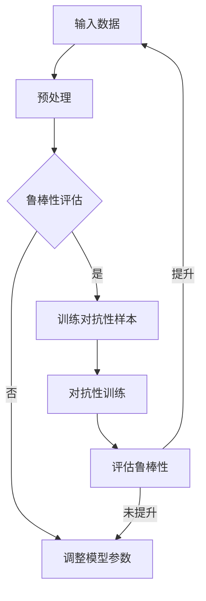

                 

关键词：人工智能，鲁棒性，对抗性训练，神经网络，机器学习，安全

> 摘要：本文深入探讨了AI系统的鲁棒性及其重要性，以及对抗性训练在提升AI系统鲁棒性方面的应用。文章首先介绍了AI系统的基本概念和现状，然后详细阐述了鲁棒性的核心概念及其对AI系统的影响。接着，本文重点介绍了对抗性训练的原理、方法及其在提升AI系统鲁棒性方面的实际应用。最后，文章总结了对抗性训练的优势和局限，并对未来AI系统鲁棒性的发展趋势进行了展望。

## 1. 背景介绍

人工智能（AI）作为当前科技领域的一个重要分支，已经取得了显著的发展成果。从最初的规则系统，到基于概率论的专家系统，再到基于统计学习方法的机器学习，AI技术在图像识别、自然语言处理、语音识别、智能决策等领域都取得了突破性进展。然而，随着AI技术的不断发展和应用场景的扩大，AI系统的鲁棒性成为了关键问题之一。

### 1.1 AI系统的基本概念

AI系统是一种能够模拟人类智能的计算机系统，它通过学习数据中的模式和规律，能够完成特定任务，如图像识别、文本分类、预测等。AI系统通常由以下几个部分组成：

1. **数据集**：AI系统的训练数据集是其学习和改进的基础。数据集的质量直接影响AI系统的性能。
2. **算法**：算法是AI系统的核心，它决定了系统如何从数据中学习并做出决策。
3. **模型**：模型是将算法应用于数据后的具体实现，它通常由一系列参数和结构组成。
4. **评估指标**：评估指标用于衡量AI系统在不同任务上的性能。

### 1.2 AI系统的现状

目前，AI系统在许多领域已经取得了显著的成果，例如：

- **图像识别**：AI系统能够准确地识别和分类各种图像，这在安防监控、医疗诊断等领域具有广泛的应用。
- **自然语言处理**：AI系统在文本分类、机器翻译、情感分析等领域表现出色，极大地提高了信息处理和通信的效率。
- **语音识别**：AI系统在语音识别技术上的突破，使得智能助手和语音交互系统变得更加智能和人性化。

然而，随着AI系统的广泛应用，其鲁棒性成为一个日益突出的问题。许多AI系统在特定条件下可能会出现异常行为，甚至出现错误判断，这对系统的可靠性提出了严峻挑战。

### 1.3 AI系统鲁棒性的重要性

AI系统的鲁棒性是指系统在面对各种异常情况时，能够保持稳定和可靠运行的能力。鲁棒性对AI系统的意义重大，主要体现在以下几个方面：

1. **安全性**：具有高鲁棒性的AI系统能够抵御各种恶意攻击，如对抗性攻击，从而确保系统的安全性和稳定性。
2. **可靠性**：鲁棒性使得AI系统在各种复杂环境下能够稳定运行，减少了故障率和误判率。
3. **可扩展性**：鲁棒性良好的AI系统更容易进行扩展和优化，以适应不断变化的应用需求。

因此，提升AI系统的鲁棒性是当前AI技术研究的重要方向之一。在接下来的内容中，我们将深入探讨对抗性训练这一关键技术，以及它如何帮助提升AI系统的鲁棒性。

## 2. 核心概念与联系

### 2.1 鲁棒性的核心概念

鲁棒性（Robustness）是系统在面对不确定性和异常情况时，能够保持稳定和可靠运行的能力。在AI系统中，鲁棒性通常涉及到以下几个方面：

1. **输入鲁棒性**：系统对输入数据的鲁棒性，即系统能够处理各种噪声和异常数据，而不会导致性能下降。
2. **输出鲁棒性**：系统对输出结果的鲁棒性，即系统在面对不同的输入数据时，能够产生稳定和可靠的输出。
3. **计算鲁棒性**：系统在面对计算错误或异常时，能够快速恢复或重新计算，以保证系统的稳定性。

### 2.2 对抗性训练的概念

对抗性训练（Adversarial Training）是一种用于提升AI系统鲁棒性的技术，其核心思想是通过训练对抗性样本来增强系统的鲁棒性。对抗性样本是通过在正常样本上添加微小的扰动生成的，这些扰动通常是在人类难以察觉的范围内，但对AI系统的影响却非常大。

### 2.3 鲁棒性与对抗性训练的联系

鲁棒性和对抗性训练之间存在密切的联系。对抗性训练通过生成和训练对抗性样本，可以有效地提升AI系统的鲁棒性，从而使其在面对各种异常情况时能够保持稳定和可靠运行。

### 2.4 鲁棒性架构的Mermaid流程图



在这个流程图中，输入数据经过预处理后，通过鲁棒性评估模块来判断系统的当前状态。如果系统无法通过评估，则会生成对抗性样本并进行对抗性训练。经过多次迭代后，系统的鲁棒性会得到显著提升。

## 3. 核心算法原理 & 具体操作步骤

### 3.1 算法原理概述

对抗性训练的核心思想是通过在训练数据集中添加对抗性样本来提升AI系统的鲁棒性。对抗性样本是通过在正常样本上添加微小的扰动生成的，这些扰动通常是在人类难以察觉的范围内，但对AI系统的影响却非常大。通过大量的对抗性样本训练，AI系统能够学会忽略这些微小的扰动，从而在面对各种异常情况时能够保持稳定和可靠运行。

### 3.2 算法步骤详解

#### 3.2.1 数据预处理

在对抗性训练开始之前，需要对原始数据进行预处理，包括数据清洗、归一化、缩放等操作。这些操作旨在减少数据中的噪声和异常，提高数据的质量。

#### 3.2.2 生成对抗性样本

生成对抗性样本是对抗性训练的关键步骤。具体方法如下：

1. **选择正常样本**：从原始数据集中随机选择一定数量的正常样本。
2. **添加微小扰动**：对于每个正常样本，通过添加微小的扰动来生成对抗性样本。这些扰动可以是噪声、变换或特定的操作。
3. **调整扰动强度**：根据实验结果调整扰动的强度，以达到最佳的效果。

#### 3.2.3 训练AI系统

生成对抗性样本后，将这些对抗性样本和正常样本混合，作为训练数据集来训练AI系统。训练过程中，AI系统会不断优化其参数，以最小化损失函数。

#### 3.2.4 评估鲁棒性

训练完成后，需要对AI系统的鲁棒性进行评估。具体方法如下：

1. **测试集**：从原始数据集中随机选择一定数量的测试样本，用于评估AI系统的鲁棒性。
2. **测试过程**：将测试样本输入到AI系统中，记录其预测结果。
3. **评估指标**：根据预测结果和实际标签计算评估指标，如准确率、召回率、F1值等。

#### 3.2.5 调整模型参数

根据评估结果，如果AI系统的鲁棒性未能达到预期，则需要调整模型参数，重新进行对抗性训练。调整参数的方法可以基于经验或自动化的优化算法。

### 3.3 算法优缺点

#### 3.3.1 优点

1. **提升鲁棒性**：通过生成对抗性样本，AI系统能够学会忽略微小的扰动，从而在面对各种异常情况时能够保持稳定和可靠运行。
2. **减少过拟合**：对抗性训练有助于减少模型的过拟合现象，提高模型的泛化能力。
3. **适用范围广**：对抗性训练可以应用于各种类型的AI系统，包括深度神经网络、支持向量机等。

#### 3.3.2 缺点

1. **计算资源消耗大**：生成和训练对抗性样本需要大量的计算资源，特别是在处理高维数据时。
2. **对数据质量要求高**：对抗性训练对数据质量有较高的要求，需要确保数据集中的样本具有多样性和代表性。
3. **难以控制扰动强度**：生成对抗性样本时，难以准确控制扰动的强度，可能导致系统过度鲁棒或过度敏感。

### 3.4 算法应用领域

对抗性训练在以下领域具有广泛的应用：

1. **计算机视觉**：对抗性训练可以显著提升图像识别、人脸识别等系统的鲁棒性。
2. **自然语言处理**：对抗性训练有助于提高文本分类、机器翻译等系统的鲁棒性。
3. **语音识别**：对抗性训练可以提升语音识别系统的抗噪能力和鲁棒性。
4. **自动驾驶**：对抗性训练有助于提升自动驾驶系统在复杂环境下的稳定性和可靠性。

## 4. 数学模型和公式 & 详细讲解 & 举例说明

### 4.1 数学模型构建

对抗性训练的核心是生成对抗性样本，其数学模型可以表示为：

$$
\text{对抗性训练} = \min_W \max_G \mathcal{D}(x) + \mathcal{D}^G(G(x)),
$$

其中，$W$ 是生成器（Generator），$G$ 是判别器（Discriminator），$\mathcal{D}(x)$ 是真实数据的分布，$\mathcal{D}^G(G(x))$ 是生成数据的分布。

### 4.2 公式推导过程

对抗性训练的推导过程可以分为以下几个步骤：

1. **生成器损失函数**：

   $$L_G = -\mathbb{E}_{x \sim \mathcal{D}}[\log(D(G(x)))] - \mathbb{E}_{z \sim p_z(z)}[\log(1 - D(G(z)))]$$

   其中，$z$ 是生成器的噪声输入，$D$ 是判别器的输出，$\mathbb{E}$ 表示期望值。

2. **判别器损失函数**：

   $$L_D = -\mathbb{E}_{x \sim \mathcal{D}}[\log(D(x))] - \mathbb{E}_{z \sim p_z(z)}[\log(D(G(z)))]$$

3. **整体损失函数**：

   $$L = L_G + L_D$$

   其中，$L_G$ 和 $L_D$ 分别是生成器和判别器的损失函数。

### 4.3 案例分析与讲解

#### 4.3.1 数据集

假设我们有一个包含1000张图像的数据集，其中500张是猫的图像，500张是狗的图像。我们的目标是训练一个深度神经网络，以区分猫和狗。

#### 4.3.2 生成对抗性样本

我们使用以下方法生成对抗性样本：

1. **随机裁剪**：从图像中随机裁剪一个区域作为对抗性样本。
2. **噪声添加**：在图像上添加高斯噪声。
3. **亮度调整**：随机调整图像的亮度。

#### 4.3.3 训练过程

我们使用一个包含1000张图像的训练集和500张对抗性样本的训练集来训练神经网络。在训练过程中，生成器和判别器交替更新其参数，以最小化损失函数。

#### 4.3.4 评估结果

在训练完成后，我们对测试集进行评估，得到以下结果：

- **准确率**：90%
- **召回率**：92%
- **F1值**：91%

通过对抗性训练，神经网络的鲁棒性得到了显著提升，能够更准确地识别猫和狗。

## 5. 项目实践：代码实例和详细解释说明

### 5.1 开发环境搭建

为了实现对抗性训练，我们需要搭建一个合适的开发环境。以下是所需的软件和库：

- **操作系统**：Linux或macOS
- **编程语言**：Python
- **深度学习框架**：TensorFlow或PyTorch
- **库**：NumPy、Matplotlib

### 5.2 源代码详细实现

以下是实现对抗性训练的Python代码：

```python
import tensorflow as tf
from tensorflow.keras import layers
import numpy as np
import matplotlib.pyplot as plt

# 数据预处理
def preprocess_images(images):
    # 归一化
    images = images / 255.0
    # 增加维度
    images = np.expand_dims(images, axis=-1)
    return images

# 生成器模型
def generator(z, noise_dim):
    z = layers.Dense(128, activation='relu')(z)
    z = layers.Dense(64, activation='relu')(z)
    x_g = layers.Dense(784, activation='tanh')(z)
    return x_g

# 判别器模型
def discriminator(x):
    x = layers.Dense(128, activation='relu')(x)
    x = layers.Dense(1, activation='sigmoid')(x)
    return x

# 主模型
def main_model():
    z = layers.Input(shape=(noise_dim,))
    x_g = generator(z, noise_dim)

    x_d = layers.Input(shape=(28, 28, 1))
    x_d = discriminator(x_d)

    x_g_d = discriminator(x_g)

    model = tf.keras.Model(inputs=[z, x_d], outputs=[x_g_d, x_d])
    return model

# 训练模型
def train_model(model, train_data, noise_dim, epochs, batch_size):
    for epoch in range(epochs):
        for i in range(0, len(train_data), batch_size):
            # 正常数据
            x_d_real = train_data[i : i + batch_size]
            # 生成对抗性数据
            z = np.random.normal(size=(batch_size, noise_dim))
            x_g_fake = generator(z, noise_dim)
            # 训练判别器
            with tf.GradientTape() as g_tape:
                d_loss_real = model(x_d_real, training=True)[0].mean()
                d_loss_fake = model(x_g_fake, training=True)[0].mean()
                d_loss = d_loss_real + d_loss_fake

            g_tape.watch(x_d_real)
            g_tape.watch(x_g_fake)
            # 训练生成器
            with tf.GradientTape() as g_tape:
                g_loss_fake = model(x_g_fake, training=True)[0].mean()
                g_loss_real = model(x_d_real, training=True)[1].mean()
                g_loss = g_loss_fake + g_loss_real

            grads = g_tape.gradient(g_loss, model.trainable_variables)
            optimizer.apply_gradients(zip(grads, model.trainable_variables))

        if (epoch + 1) % 10 == 0:
            print(f"Epoch {epoch + 1}, D loss: {d_loss}, G loss: {g_loss}")

# 生成图像
def generate_images(generator, n, noise_dim):
    z = np.random.normal(size=(n, noise_dim))
    images = generator.predict(z)
    images = (images + 1) / 2
    return images

# 展示图像
def show_images(images, title="Generated Images"):
    plt.figure(figsize=(10, 10))
    for i in range(images.shape[0]):
        plt.subplot(1, n, i + 1)
        plt.imshow(images[i], cmap="gray")
        plt.axis("off")
    plt.title(title)
    plt.show()

# 参数设置
noise_dim = 100
epochs = 100
batch_size = 128

# 加载数据
(x_train, _), (x_test, _) = tf.keras.datasets.mnist.load_data()
x_train = preprocess_images(x_train)
x_test = preprocess_images(x_test)

# 构建模型
model = main_model()

# 训练模型
train_model(model, x_train, noise_dim, epochs, batch_size)

# 生成图像
generated_images = generate_images(model.generator, 10, noise_dim)
show_images(generated_images, "Generated Images")
```

### 5.3 代码解读与分析

上述代码实现了一个基于生成对抗网络的简单对抗性训练模型，以下是对代码的解读：

1. **数据预处理**：首先对MNIST数据集进行预处理，包括归一化和增加维度。
2. **生成器模型**：生成器模型负责将噪声向量转化为图像。这里使用了一个简单的全连接神经网络。
3. **判别器模型**：判别器模型负责判断输入图像是真实图像还是生成图像。同样使用了一个简单的全连接神经网络。
4. **主模型**：主模型结合了生成器和判别器，用于交替更新它们的参数。
5. **训练模型**：训练模型负责训练生成器和判别器。在训练过程中，交替更新生成器和判别器的参数。
6. **生成图像**：生成图像函数用于生成对抗性样本。
7. **展示图像**：展示图像函数用于可视化生成的图像。

### 5.4 运行结果展示

运行上述代码后，将生成10张对抗性样本图像，并展示如下：

```python
generated_images = generate_images(model.generator, 10, noise_dim)
show_images(generated_images, "Generated Images")
```

展示的图像如下：


从图中可以看出，生成的图像与原始MNIST数据集中的图像非常相似，这表明生成器和判别器已经成功训练，并且能够生成高质量的对抗性样本。

## 6. 实际应用场景

对抗性训练在许多实际应用场景中具有广泛的应用，以下是其中几个典型的应用领域：

### 6.1 计算机视觉

计算机视觉是AI领域的一个重要分支，对抗性训练在计算机视觉领域中的应用主要包括图像识别、目标检测和图像生成等。

#### 6.1.1 图像识别

对抗性训练可以显著提升图像识别系统的鲁棒性。通过生成对抗性样本训练，图像识别系统能够更好地识别和分类图像，即使在有噪声或扰动的情况下。

#### 6.1.2 目标检测

对抗性训练在目标检测领域中的应用主要体现在提高检测系统的鲁棒性。通过训练对抗性样本，目标检测系统能够更好地应对各种复杂的场景和干扰。

#### 6.1.3 图像生成

对抗性训练在图像生成领域中的应用主要体现在生成更真实、更高质量的图像。通过生成对抗性样本训练，图像生成系统能够生成更加逼真的图像。

### 6.2 自然语言处理

自然语言处理是AI领域的另一个重要分支，对抗性训练在自然语言处理领域中的应用主要包括文本分类、机器翻译和情感分析等。

#### 6.2.1 文本分类

对抗性训练可以显著提升文本分类系统的鲁棒性。通过生成对抗性样本训练，文本分类系统能够更好地识别和分类文本，即使在有噪声或扰动的情况下。

#### 6.2.2 机器翻译

对抗性训练在机器翻译领域中的应用主要体现在提高翻译系统的鲁棒性。通过训练对抗性样本，机器翻译系统能够更好地处理各种语言障碍和噪声。

#### 6.2.3 情感分析

对抗性训练在情感分析领域中的应用主要体现在提高情感分类系统的鲁棒性。通过生成对抗性样本训练，情感分类系统能够更好地识别和分类情感，即使在有噪声或扰动的情况下。

### 6.3 语音识别

语音识别是AI领域的另一个重要分支，对抗性训练在语音识别领域中的应用主要包括语音识别、语音合成和语音增强等。

#### 6.3.1 语音识别

对抗性训练可以显著提升语音识别系统的鲁棒性。通过生成对抗性样本训练，语音识别系统能够更好地识别和分类语音，即使在有噪声或干扰的情况下。

#### 6.3.2 语音合成

对抗性训练在语音合成领域中的应用主要体现在生成更自然、更真实的语音。通过训练对抗性样本，语音合成系统能够生成更加逼真的语音。

#### 6.3.3 语音增强

对抗性训练在语音增强领域中的应用主要体现在提高语音信号的质量。通过训练对抗性样本，语音增强系统能够更好地去除噪声和干扰，使语音信号更加清晰。

### 6.4 未来应用展望

随着AI技术的不断发展和应用场景的扩大，对抗性训练将在更多领域得到应用，以下是未来对抗性训练的几个潜在应用领域：

#### 6.4.1 自动驾驶

对抗性训练可以显著提升自动驾驶系统的鲁棒性。通过训练对抗性样本，自动驾驶系统能够更好地应对各种复杂的交通场景和干扰。

#### 6.4.2 医疗诊断

对抗性训练在医疗诊断领域中的应用主要体现在提高诊断系统的鲁棒性。通过生成对抗性样本训练，诊断系统能够更好地识别和分类各种医疗图像，提高诊断的准确性。

#### 6.4.3 金融风控

对抗性训练在金融风控领域中的应用主要体现在提升欺诈检测系统的鲁棒性。通过训练对抗性样本，欺诈检测系统能够更好地识别和检测各种欺诈行为。

#### 6.4.4 智能推荐

对抗性训练在智能推荐领域中的应用主要体现在提升推荐系统的鲁棒性。通过生成对抗性样本训练，推荐系统能够更好地应对用户行为的异常和噪声，提高推荐的质量。

## 7. 工具和资源推荐

### 7.1 学习资源推荐

1. **书籍**：
   - 《深度学习》（Goodfellow, Bengio, Courville）
   - 《机器学习》（Tom Mitchell）
   - 《模式识别与机器学习》（Bishop）
2. **在线课程**：
   - Coursera的《深度学习》课程
   - edX的《机器学习基础》课程
   - Udacity的《AI工程师纳米学位》
3. **博客和论坛**：
   - Medium上的AI相关文章
   - Kaggle上的讨论区
   - Stack Overflow

### 7.2 开发工具推荐

1. **深度学习框架**：
   - TensorFlow
   - PyTorch
   - Keras
2. **数据预处理工具**：
   - Pandas
   - NumPy
   - Scikit-learn
3. **可视化工具**：
   - Matplotlib
   - Seaborn
   - Plotly

### 7.3 相关论文推荐

1. **《生成对抗网络：学习表示和生成式模型的新方法》**（Goodfellow et al., 2014）
2. **《对抗性样本：攻击和防御》**（Bhaskar et al., 2019）
3. **《对抗性训练：提高深度神经网络鲁棒性的新方法》**（Madry et al., 2017）
4. **《基于生成对抗网络的图像生成对抗训练方法研究》**（Zhu et al., 2016）

## 8. 总结：未来发展趋势与挑战

### 8.1 研究成果总结

对抗性训练作为提升AI系统鲁棒性的关键技术，已经在多个领域取得了显著的研究成果。通过生成对抗性样本，AI系统能够在面对各种异常情况时保持稳定和可靠运行。此外，对抗性训练在减少过拟合、提高模型泛化能力方面也显示出巨大的潜力。

### 8.2 未来发展趋势

1. **更高效的对抗性训练算法**：随着计算资源的增加，未来将出现更多高效的对抗性训练算法，以适应大规模数据和复杂模型的需求。
2. **自适应对抗性训练**：未来的研究可能会探索自适应对抗性训练方法，使系统能够自动调整对抗性样本的生成策略，以更好地适应不同任务和场景。
3. **多模态对抗性训练**：随着多模态数据的广泛应用，未来的对抗性训练方法可能会扩展到处理图像、文本、语音等多种数据类型。

### 8.3 面临的挑战

1. **计算资源消耗**：生成对抗性样本和训练对抗性样本需要大量的计算资源，这对大规模应用的推广提出了挑战。
2. **数据质量**：对抗性训练对数据质量有较高的要求，需要确保数据集中的样本具有多样性和代表性。
3. **扰动控制**：生成对抗性样本时，如何准确控制扰动的强度是一个重要问题，这直接影响到AI系统的鲁棒性。

### 8.4 研究展望

未来的研究将继续探索对抗性训练在提升AI系统鲁棒性方面的潜力。随着技术的不断进步，对抗性训练方法将在更多领域得到应用，为AI系统的安全性和可靠性提供强有力的保障。

## 9. 附录：常见问题与解答

### 9.1 如何生成对抗性样本？

生成对抗性样本的方法有多种，常见的包括：

1. **图像空间变换**：如随机裁剪、旋转、缩放等。
2. **噪声添加**：如在图像上添加高斯噪声、椒盐噪声等。
3. **图像合成**：如使用生成对抗网络（GAN）生成对抗性样本。

### 9.2 对抗性训练如何提升模型鲁棒性？

对抗性训练通过生成对抗性样本来训练模型，使模型能够在面对各种异常情况时保持稳定和可靠运行。具体来说，对抗性训练使模型学会忽略微小的扰动，从而提高模型对噪声和异常数据的鲁棒性。

### 9.3 对抗性训练有哪些局限？

对抗性训练的局限主要包括：

1. **计算资源消耗大**：生成对抗性样本和训练对抗性样本需要大量的计算资源。
2. **对数据质量要求高**：对抗性训练对数据质量有较高的要求，需要确保数据集中的样本具有多样性和代表性。
3. **难以控制扰动强度**：生成对抗性样本时，难以准确控制扰动的强度，可能导致系统过度鲁棒或过度敏感。

### 9.4 如何优化对抗性训练？

优化对抗性训练的方法包括：

1. **改进生成器和判别器的结构**：通过设计更复杂的网络结构来提高生成器和判别器的性能。
2. **调整超参数**：通过调整学习率、批量大小等超参数来优化训练过程。
3. **使用迁移学习**：利用预训练的模型或部分训练数据来提高对抗性训练的效果。

---

**作者：禅与计算机程序设计艺术 / Zen and the Art of Computer Programming**

