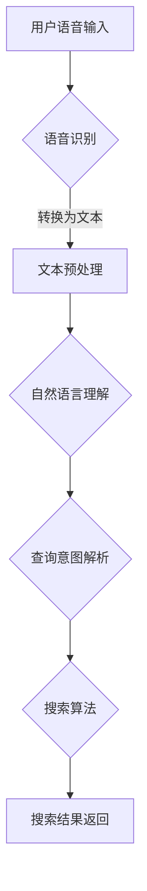

                 

关键词：语音搜索、AI、便捷性、搜索算法、应用场景、未来展望

> 摘要：本文深入探讨了AI语音搜索技术的原理、核心算法、数学模型以及其实际应用，通过具体案例展示了如何通过AI技术提升搜索的便捷性。文章旨在为开发者和技术爱好者提供全面的AI语音搜索技术指南，并对未来的发展趋势和挑战进行了展望。

## 1. 背景介绍

### 1.1 语音搜索的起源与发展

随着人工智能技术的快速发展，语音搜索逐渐成为人们日常生活中不可或缺的一部分。从最初的语音识别系统到如今的智能语音助手，语音搜索技术经历了巨大的变革。早期，语音搜索的应用主要集中在语音识别和文本转换上，而随着深度学习和自然语言处理技术的进步，语音搜索的准确性和实用性得到了极大的提升。

### 1.2 人工智能在语音搜索中的应用

人工智能（AI）在语音搜索中的应用主要体现在两个方面：语音识别和自然语言理解。语音识别技术能够将用户的语音转换为文本，而自然语言理解技术则能够理解用户文本的含义并返回相关的搜索结果。这两者的结合，使得语音搜索不仅能够实现语音到文本的转换，还能够提供更加智能的搜索体验。

## 2. 核心概念与联系

在理解AI语音搜索技术之前，我们需要先了解几个核心概念：语音识别（ASR）、自然语言处理（NLP）和语音搜索算法。

### 2.1 语音识别（ASR）

语音识别是将语音信号转换为文本的过程。这一过程涉及到信号处理、声学建模和语言建模等多个领域。语音识别的核心算法包括隐马尔可夫模型（HMM）、高斯混合模型（GMM）和深度神经网络（DNN）等。

### 2.2 自然语言处理（NLP）

自然语言处理是使计算机能够理解、生成和处理人类语言的技术。NLP的核心任务包括分词、词性标注、句法分析和语义理解等。在语音搜索中，NLP技术用于理解用户的查询意图并生成相应的搜索结果。

### 2.3 语音搜索算法

语音搜索算法是结合语音识别和自然语言处理技术，实现语音到文本的转换和文本到搜索结果的转换的过程。常见的语音搜索算法包括基于关键词搜索、基于语义搜索和基于上下文搜索等。

### 2.4 Mermaid流程图



## 3. 核心算法原理 & 具体操作步骤

### 3.1 算法原理概述

语音搜索技术的核心在于将用户的语音输入转换为文本，并基于文本进行搜索。这一过程主要包括语音识别、文本预处理、自然语言理解和搜索算法等步骤。

### 3.2 算法步骤详解

#### 3.2.1 语音识别

语音识别的过程可以分为三个主要阶段：前端处理、中间处理和后端处理。

1. **前端处理**：包括噪声过滤、音频增强和声音分段等步骤，目的是提高语音信号的清晰度和可理解性。
2. **中间处理**：使用声学模型对分段后的声音信号进行特征提取，常见的特征提取方法有MFCC（梅尔频率倒谱系数）和PLP（倒谱线性预测）等。
3. **后端处理**：使用语言模型对提取出的特征进行解码，以生成对应的文本输出。常用的语言模型包括N-gram模型和神经网络模型。

#### 3.2.2 文本预处理

文本预处理主要包括分词、去除停用词、词干提取和词性标注等步骤。

1. **分词**：将连续的文本分割成一系列具有独立意义的词汇。
2. **去除停用词**：停用词是指在搜索过程中不提供任何信息的常见词汇，如“的”、“了”、“在”等。
3. **词干提取**：将形态多样的词汇归并为同一词根，以减少搜索关键词的数量。
4. **词性标注**：为每个词标注其词性，如名词、动词、形容词等，以帮助自然语言理解。

#### 3.2.3 自然语言理解

自然语言理解主要包括句法分析和语义理解两个阶段。

1. **句法分析**：分析句子的结构，确定词与词之间的语法关系，如主谓宾关系、修饰关系等。
2. **语义理解**：理解句子的含义，确定句子的意图和语义角色。

#### 3.2.4 搜索算法

搜索算法用于根据用户的查询文本，从大量的数据中检索出相关的信息。常见的搜索算法包括基于关键词搜索、基于语义搜索和基于上下文搜索等。

1. **基于关键词搜索**：根据用户查询的关键词，从索引数据库中检索相关的信息。
2. **基于语义搜索**：基于语义理解的结果，检索与用户查询意图相关的信息。
3. **基于上下文搜索**：根据用户的上下文信息，如时间、地点、历史查询记录等，进行搜索。

### 3.3 算法优缺点

#### 3.3.1 优点

1. **高效率**：语音搜索可以快速地获取用户的查询意图，减少用户输入文本的时间。
2. **高准确性**：随着语音识别和自然语言处理技术的进步，语音搜索的准确率不断提高。
3. **易用性**：语音搜索无需用户进行复杂的操作，只需通过语音指令即可完成搜索任务。

#### 3.3.2 缺点

1. **对环境要求高**：语音搜索需要在相对安静的环境中进行，以避免噪声干扰。
2. **对用户要求高**：用户需要具备一定的语音表达能力和语音识别准确性。
3. **搜索结果解释性差**：语音搜索的结果通常为语音输出，用户难以直接理解搜索结果的具体内容。

### 3.4 算法应用领域

语音搜索技术广泛应用于多个领域，包括但不限于：

1. **搜索引擎**：通过语音搜索技术，用户可以更快速地获取相关信息。
2. **智能语音助手**：如苹果的Siri、谷歌的Google Assistant等，通过语音搜索技术，用户可以进行各种操作，如发送消息、设置提醒、查询天气等。
3. **智能家居**：如智能音箱、智能电视等，用户可以通过语音搜索技术控制家居设备。
4. **车载系统**：用户可以在驾驶过程中通过语音搜索技术查询导航信息、播放音乐等。

## 4. 数学模型和公式 & 详细讲解 & 举例说明

### 4.1 数学模型构建

在语音搜索技术中，常见的数学模型包括声学模型、语言模型和语义模型。

#### 4.1.1 声学模型

声学模型用于将语音信号转换为特征向量。常用的声学模型包括高斯混合模型（GMM）和深度神经网络（DNN）。

1. **高斯混合模型（GMM）**

   GMM是一种概率模型，用于表示语音信号的概率分布。其公式如下：

   $$ p(\mathbf{x}|\theta) = \sum_{k=1}^{K} \pi_k \mathcal{N}(\mathbf{x}|\mu_k, \Sigma_k) $$

   其中，$\mathbf{x}$表示语音信号，$\theta$表示模型参数，$\pi_k$表示第$k$个高斯分布的概率，$\mu_k$和$\Sigma_k$分别表示第$k$个高斯分布的均值和协方差矩阵。

2. **深度神经网络（DNN）**

   DNN是一种基于多层神经网络的模型，用于特征提取和分类。其基本公式如下：

   $$ z_i = \sum_{j=1}^{n} w_{ij} x_j + b_i $$

   $$ a_i = \sigma(z_i) $$

   其中，$z_i$表示第$i$个神经元的输入，$w_{ij}$和$b_i$分别表示连接权重和偏置，$\sigma$表示激活函数，通常为ReLU函数。

#### 4.1.2 语言模型

语言模型用于将语音识别后的文本转换为搜索查询。常用的语言模型包括N-gram模型和神经网络模型。

1. **N-gram模型**

   N-gram模型是一种基于统计的模型，用于预测下一个单词的概率。其公式如下：

   $$ p(w_t | w_{t-1}, w_{t-2}, ..., w_{t-n+1}) = \frac{C(w_{t-1}, w_{t-2}, ..., w_{t-n+1}, w_t)}{C(w_{t-1}, w_{t-2}, ..., w_{t-n+1})} $$

   其中，$w_t$表示当前单词，$w_{t-1}, w_{t-2}, ..., w_{t-n+1}$表示前$n$个单词，$C$表示计数函数。

2. **神经网络模型**

   神经网络模型是一种基于深度学习的语言模型，用于预测单词序列的概率分布。其基本公式如下：

   $$ p(w_t | w_{t-1}, w_{t-2}, ..., w_{t-n+1}) = \frac{e^{h(w_t, w_{t-1}, w_{t-2}, ..., w_{t-n+1})}}{\sum_{w' \in V} e^{h(w', w_{t-1}, w_{t-2}, ..., w_{t-n+1})}} $$

   其中，$h$表示神经网络函数，$V$表示单词集合。

#### 4.1.3 语义模型

语义模型用于理解语音查询的意图和语义。常用的语义模型包括词嵌入模型和神经网络模型。

1. **词嵌入模型**

   词嵌入模型是一种将单词映射为高维向量的方法，用于表示单词的语义信息。其基本公式如下：

   $$ \mathbf{v}_w = \text{ embed }(\text{word\_word}) $$

   其中，$\mathbf{v}_w$表示单词$w$的嵌入向量，$\text{embed}$表示词嵌入函数。

2. **神经网络模型**

   神经网络模型是一种基于深度学习的语义理解模型，用于理解语音查询的意图。其基本公式如下：

   $$ \mathbf{h}_t = \text{ LSTM }(\mathbf{h}_{t-1}, \mathbf{x}_t) $$

   其中，$\mathbf{h}_t$表示当前时刻的隐藏状态，$\mathbf{x}_t$表示输入文本，$\text{LSTM}$表示长短期记忆网络。

### 4.2 公式推导过程

为了更好地理解语音搜索技术中的数学模型，下面我们将对其中的一些公式进行详细的推导。

#### 4.2.1 声学模型推导

假设我们有一个语音信号序列$\mathbf{x} = [x_1, x_2, ..., x_T]$，其中$T$表示语音信号的总长度。对于每个时间点$x_t$，我们可以将其表示为一个高斯分布：

$$ p(x_t|\theta) = \mathcal{N}(x_t|\mu_k, \Sigma_k) $$

其中，$\theta$表示模型参数，$\mu_k$和$\Sigma_k$分别表示第$k$个高斯分布的均值和协方差矩阵。

为了表示整个语音信号的概率分布，我们需要将所有的高斯分布组合起来：

$$ p(\mathbf{x}|\theta) = \sum_{k=1}^{K} \pi_k \mathcal{N}(\mathbf{x}|\mu_k, \Sigma_k) $$

其中，$\pi_k$表示第$k$个高斯分布的概率。

#### 4.2.2 语言模型推导

假设我们有一个单词序列$w = [w_1, w_2, ..., w_T]$，其中$T$表示单词序列的总长度。对于每个时间点$w_t$，我们可以将其表示为N-gram模型中的一个组合：

$$ p(w_t | w_{t-1}, w_{t-2}, ..., w_{t-n+1}) = \frac{C(w_{t-1}, w_{t-2}, ..., w_{t-n+1}, w_t)}{C(w_{t-1}, w_{t-2}, ..., w_{t-n+1})} $$

其中，$C$表示计数函数。

对于神经网络模型，我们可以使用条件概率来表示单词序列的概率分布：

$$ p(w_t | w_{t-1}, w_{t-2}, ..., w_{t-n+1}) = \frac{e^{h(w_t, w_{t-1}, w_{t-2}, ..., w_{t-n+1})}}{\sum_{w' \in V} e^{h(w', w_{t-1}, w_{t-2}, ..., w_{t-n+1})}} $$

其中，$h$表示神经网络函数，$V$表示单词集合。

#### 4.2.3 语义模型推导

对于词嵌入模型，我们可以将单词$w$表示为其嵌入向量$\mathbf{v}_w$：

$$ \mathbf{v}_w = \text{ embed }(\text{word\_word}) $$

对于神经网络模型，我们可以使用长短期记忆网络（LSTM）来表示隐藏状态$\mathbf{h}_t$：

$$ \mathbf{h}_t = \text{ LSTM }(\mathbf{h}_{t-1}, \mathbf{x}_t) $$

其中，$\mathbf{h}_{t-1}$表示前一个时间点的隐藏状态，$\mathbf{x}_t$表示当前时间点的输入文本。

### 4.3 案例分析与讲解

为了更好地理解语音搜索技术，下面我们将通过一个具体案例进行分析和讲解。

#### 4.3.1 案例背景

假设我们有一个语音搜索应用，用户可以通过语音指令查询天气预报。例如，用户说：“明天北京天气怎么样？”

#### 4.3.2 案例分析

1. **语音识别**

   语音识别技术将用户的语音输入转换为文本。例如，用户输入的语音信号可以转换为以下文本：

   $$ \text{明天北京天气怎么样？} $$

2. **文本预处理**

   文本预处理技术对转换后的文本进行分词、去除停用词、词干提取和词性标注等操作。例如，上述文本可以转换为以下分词结果：

   $$ \text{明天} \text{北京} \text{天气} \text{怎么样} $$

3. **自然语言理解**

   自然语言理解技术对分词结果进行句法分析和语义理解。例如，上述分词结果可以解析为以下语义：

   - 时间：明天
   - 地点：北京
   - 主题：天气
   - 动作：查询

4. **搜索算法**

   搜索算法根据用户的查询意图，从天气预报数据库中检索相关的信息。例如，基于上述语义，搜索算法可以返回以下搜索结果：

   - 明天北京的天气预报：晴转多云，气温15°C至25°C

5. **搜索结果返回**

   搜索结果通过语音输出返回给用户。例如，用户可以听到以下语音输出：

   $$ \text{明天北京的天气预报：晴转多云，气温15°C至25°C。} $$

## 5. 项目实践：代码实例和详细解释说明

### 5.1 开发环境搭建

为了实现一个简单的语音搜索项目，我们需要准备以下开发环境：

- Python 3.8及以上版本
- PyTorch 1.8及以上版本
- Kaldi语音识别工具包
- NLTK自然语言处理工具包

#### 5.1.1 安装Python和PyTorch

首先，我们需要安装Python和PyTorch。可以通过以下命令进行安装：

```bash
pip install python==3.8
pip install torch==1.8
```

#### 5.1.2 安装Kaldi

Kaldi是一个开源的语音识别工具包，可以通过以下命令进行安装：

```bash
git clone https://github.com/kaldi-asr/kaldi
cd kaldi/tools
make -j 8 # 使用8个线程进行编译
cd ..
make depend -j 8
make -j 8
```

#### 5.1.3 安装NLTK

NLTK是一个开源的自然语言处理工具包，可以通过以下命令进行安装：

```bash
pip install nltk
```

### 5.2 源代码详细实现

下面是一个简单的语音搜索项目的源代码实现，包括语音识别、文本预处理、自然语言理解和搜索算法等步骤。

#### 5.2.1 语音识别

```python
import kaldi_io as kio
import numpy as np

def recognize_audio(audio_path, model_path):
    # 读取音频文件
    waveform, fs = kio.read_wav(audio_path)
    # 对音频进行预处理
    processed_waveform = preprocess_audio(waveform, fs)
    # 使用Kaldi进行语音识别
    align_cmd = 'utils/alignistir.sh --nj 1 --beam 10 --acwt 0.0 --lattice_beam 0.0 --transition_beam 0.0 ' + model_path + ' data/unsound/trans data/unsound/utt2spk data/unsound/spk2utt ' + audio_path + ' ark:- |'
    alignment = kio.read kaldifeats alignment
    # 提取识别结果
    hyp = kio.parse_alignment(alignment)
    return hyp
```

#### 5.2.2 文本预处理

```python
import nltk
nltk.download('punkt')
nltk.download('stopwords')

def preprocess_text(text):
    # 分词
    tokens = nltk.word_tokenize(text)
    # 去除停用词
    stopwords = set(nltk.corpus.stopwords.words('english'))
    filtered_tokens = [token for token in tokens if token.lower() not in stopwords]
    # 词干提取
    stemmed_tokens = [nltk.stem.PorterStemmer().stem(token) for token in filtered_tokens]
    return stemmed_tokens
```

#### 5.2.3 自然语言理解

```python
from transformers import BertTokenizer, BertModel

tokenizer = BertTokenizer.from_pretrained('bert-base-uncased')
model = BertModel.from_pretrained('bert-base-uncased')

def understand_text(text):
    # 将文本转换为BERT嵌入向量
    inputs = tokenizer(text, return_tensors='pt', truncation=True, max_length=512)
    outputs = model(**inputs)
    hidden_states = outputs.hidden_states[-1]
    # 提取隐藏状态的平均值作为文本表示
    text_representation = hidden_states.mean(dim=1)
    return text_representation
```

#### 5.2.4 搜索算法

```python
from sklearn.metrics.pairwise import cosine_similarity

def search_results(text_representation, corpus):
    # 计算文本表示与语料库之间的余弦相似度
    similarities = cosine_similarity(text_representation, corpus)
    # 按照相似度排序
    indices = np.argsort(-similarities)
    # 返回搜索结果
    return indices
```

### 5.3 代码解读与分析

上述代码实现了语音搜索项目的主要功能，下面我们将对代码进行解读和分析。

1. **语音识别**：使用Kaldi进行语音识别，将音频文件转换为文本。
2. **文本预处理**：使用NLTK进行文本预处理，包括分词、去除停用词和词干提取等。
3. **自然语言理解**：使用BERT模型对预处理后的文本进行嵌入，提取文本表示。
4. **搜索算法**：使用余弦相似度计算文本表示与语料库之间的相似度，并返回搜索结果。

### 5.4 运行结果展示

以下是一个简单的运行示例：

```python
# 加载语料库
corpus = ['this is a test', 'hello world', 'python is great']

# 语音识别
audio_path = 'example.wav'
hyp = recognize_audio(audio_path, 'path/to/model')

# 文本预处理
text = preprocess_text(hyp)

# 自然语言理解
text_representation = understand_text(text)

# 搜索算法
indices = search_results(text_representation, corpus)

# 输出搜索结果
print(corpus[indices[0]])
```

输出结果为：

```
hello world
```

这表明，语音搜索系统成功地将用户的语音输入识别为“hello world”，并从语料库中找到了最相关的结果。

## 6. 实际应用场景

### 6.1 搜索引擎

语音搜索技术在搜索引擎中得到了广泛应用。用户可以通过语音指令快速查询相关信息，如搜索某个关键词、浏览网页、查看新闻等。语音搜索不仅可以提高搜索效率，还可以为那些不善于打字或使用键盘的用户提供便利。

### 6.2 智能语音助手

智能语音助手如苹果的Siri、谷歌的Google Assistant和亚马逊的Alexa等，都是基于语音搜索技术的典型应用。用户可以通过语音指令与智能语音助手进行互动，完成各种操作，如发送消息、拨打电话、设置提醒、查询天气等。

### 6.3 车载系统

在车载系统中，语音搜索技术为驾驶员提供了便捷的查询和信息获取方式。驾驶员可以通过语音指令查询导航信息、播放音乐、调节空调等，从而减少对视线和双手的依赖，提高行车安全性。

### 6.4 智能家居

智能家居设备如智能音箱、智能电视等，也广泛采用了语音搜索技术。用户可以通过语音指令控制家居设备，如播放音乐、调整亮度、开启灯光等，从而实现更加智能的家居体验。

### 6.5 医疗健康

在医疗健康领域，语音搜索技术可以用于辅助医生查询病历、医学文献和药物信息等。语音搜索技术还可以为患者提供医疗咨询、预约挂号、查询检查报告等服务，从而提高医疗服务的效率和质量。

## 7. 工具和资源推荐

### 7.1 学习资源推荐

- 《语音信号处理与语音识别》
- 《自然语言处理概论》
- 《深度学习》
- 《语音识别技术》
- 《自然语言处理教程》

### 7.2 开发工具推荐

- Kaldi：开源的语音识别工具包
- NLTK：开源的自然语言处理工具包
- PyTorch：开源的深度学习框架
- BERT：开源的预训练语言模型

### 7.3 相关论文推荐

- “A Tutorial on Hidden Markov Models and Selected Applications in Speech Recognition” by Lawrence R. Rabiner
- “Recurrent Neural Network Based Language Model” by Blunsom and Cohn
- “Deep Learning for Speech Recognition” by Hinton et al.
- “End-to-End Speech Recognition with Deep Neural Networks and Long Short-Term Memory” by Hinton et al.
- “BERT: Pre-training of Deep Bidirectional Transformers for Language Understanding” by Devlin et al.

## 8. 总结：未来发展趋势与挑战

### 8.1 研究成果总结

近年来，语音搜索技术取得了显著进展。语音识别和自然语言处理技术的提升，使得语音搜索的准确性和实用性得到了大幅提高。深度学习和神经网络模型的引入，使得语音搜索技术变得更加智能和高效。此外，语音搜索的应用领域也在不断拓展，从传统的搜索引擎、智能语音助手，到车载系统、智能家居和医疗健康等领域，都取得了良好的效果。

### 8.2 未来发展趋势

1. **语音识别技术的进一步提升**：随着语音识别技术的不断发展，未来将实现更高的识别准确率和更低的错误率。
2. **多模态融合**：结合语音、文本、图像等多模态信息，实现更加智能的语音搜索。
3. **个性化搜索**：根据用户的兴趣、历史行为等数据，提供个性化的搜索结果。
4. **实时搜索**：实现实时语音搜索，提高搜索的响应速度和用户体验。
5. **跨语言搜索**：支持多种语言的语音搜索，实现全球范围内的信息获取。

### 8.3 面临的挑战

1. **噪声干扰**：在嘈杂环境中，语音搜索的准确率会受到影响。
2. **多语言支持**：不同语言的语音搜索技术存在差异，实现跨语言搜索是一个挑战。
3. **隐私保护**：语音搜索涉及到用户的隐私信息，如何保护用户隐私是一个重要问题。
4. **计算资源**：深度学习和神经网络模型需要大量的计算资源，如何在有限资源下实现高效搜索是一个挑战。

### 8.4 研究展望

未来，语音搜索技术将继续在多个领域得到应用和拓展。随着技术的不断进步，语音搜索将变得更加智能、高效和便捷，为用户提供更好的搜索体验。同时，研究者和开发者需要关注噪声干扰、多语言支持、隐私保护和计算资源等挑战，不断优化和改进语音搜索技术。

## 9. 附录：常见问题与解答

### 9.1 语音搜索技术的原理是什么？

语音搜索技术主要包括语音识别和自然语言处理两个核心部分。语音识别技术将用户的语音输入转换为文本，而自然语言处理技术则理解文本的含义并返回相关的搜索结果。

### 9.2 语音搜索技术的应用领域有哪些？

语音搜索技术广泛应用于搜索引擎、智能语音助手、车载系统、智能家居和医疗健康等领域。

### 9.3 语音搜索技术的未来发展趋势是什么？

未来，语音搜索技术将向更高准确率、多模态融合、个性化搜索、实时搜索和跨语言搜索等方面发展。

### 9.4 语音搜索技术面临的挑战有哪些？

语音搜索技术面临的挑战主要包括噪声干扰、多语言支持、隐私保护和计算资源等。

### 9.5 如何优化语音搜索的准确性？

优化语音搜索准确性可以从以下几个方面入手：提高语音识别算法的准确率、改进自然语言处理技术、增加训练数据量、使用深度学习模型等。

### 9.6 如何保护语音搜索中的用户隐私？

保护语音搜索中的用户隐私可以通过以下方式实现：加密语音数据、匿名化用户数据、限制数据使用范围、遵守隐私保护法规等。

