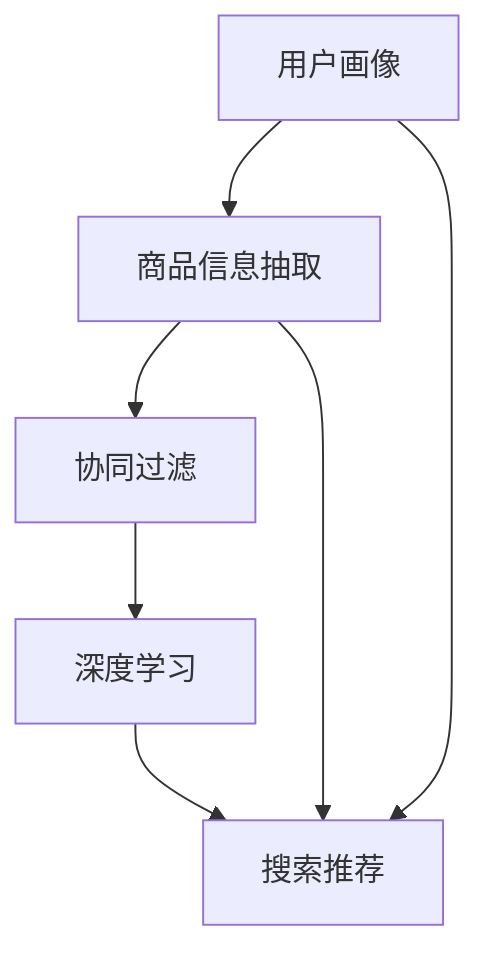

                 

关键词：AI、电商、搜索推荐、系统优化、算法创新、用户体验、商业价值

> 摘要：随着人工智能技术的快速发展，搜索推荐系统在电商领域的应用日益广泛。本文将深入探讨AI在电商搜索推荐系统中的革命性突破，分析其核心概念、算法原理、数学模型以及实际应用场景，为电商企业提供切实可行的优化策略。

## 1. 背景介绍

在当今数字化的商业环境中，电子商务已经成为企业拓展市场和提升竞争力的重要手段。用户对电商平台的搜索和推荐体验要求越来越高，这促使电商企业不断寻求优化搜索推荐系统的方式。传统的搜索推荐系统主要依赖于关键词匹配和协同过滤算法，然而，这些方法在面对海量数据和高维度特征时，存在一定的局限性和不足。

近年来，人工智能技术的迅猛发展，尤其是深度学习、自然语言处理和大数据分析等领域的突破，为搜索推荐系统带来了新的契机。通过引入AI技术，电商企业可以实现更加精准、个性化的搜索推荐，从而提升用户体验和商业价值。本文将围绕AI赋能电商搜索推荐系统这一主题，探讨其核心概念、算法原理、数学模型以及实际应用场景。

## 2. 核心概念与联系

为了深入理解AI在电商搜索推荐系统中的应用，我们首先需要了解以下几个核心概念：

- **用户画像（User Profiling）**：通过对用户行为、兴趣、偏好等数据进行分析，构建用户个性化特征模型。
- **商品信息抽取（Item Information Extraction）**：从商品描述、标签、评论等数据中提取关键信息，构建商品特征模型。
- **协同过滤（Collaborative Filtering）**：基于用户行为数据，通过相似度计算和模型推荐实现个性化推荐。
- **深度学习（Deep Learning）**：利用多层神经网络模型，自动学习数据中的复杂模式和关联性，实现高维特征提取和建模。

这些概念相互关联，共同构成了电商搜索推荐系统的核心框架。以下是一个简化的Mermaid流程图，展示了这些概念之间的关系：



### 2.1 用户画像

用户画像是通过分析用户在电商平台上的行为数据，如浏览历史、购买记录、评论等，构建出用户的个性化特征模型。这些特征模型可以帮助电商企业更好地理解用户需求，从而实现个性化推荐。用户画像的构建过程通常包括以下步骤：

1. 数据收集：收集用户在平台上的行为数据，如浏览记录、购买记录、搜索关键词等。
2. 数据预处理：对收集到的数据进行清洗、去重和归一化处理，以确保数据质量。
3. 特征提取：从原始数据中提取用户特征，如兴趣偏好、购买能力、消费习惯等。
4. 模型构建：利用机器学习算法，如决策树、随机森林等，对用户特征进行建模。

### 2.2 商品信息抽取

商品信息抽取是指从商品描述、标签、评论等数据中提取关键信息，构建商品特征模型。这些特征模型可以帮助电商企业更好地理解商品属性，从而实现商品分类、标签推荐等功能。商品信息抽取的过程通常包括以下步骤：

1. 数据收集：收集商品描述、标签、评论等数据。
2. 数据预处理：对收集到的数据进行清洗、去重和归一化处理，以确保数据质量。
3. 特征提取：从原始数据中提取商品特征，如价格、品牌、类别、评价等。
4. 模型构建：利用机器学习算法，如决策树、随机森林等，对商品特征进行建模。

### 2.3 协同过滤

协同过滤是基于用户行为数据，通过相似度计算和模型推荐实现个性化推荐的一种算法。协同过滤分为基于用户和基于物品两种类型：

1. **基于用户**的协同过滤：通过计算用户之间的相似度，找到相似用户，然后根据相似用户的喜好推荐商品。
2. **基于物品**的协同过滤：通过计算商品之间的相似度，找到相似商品，然后根据相似商品推荐给用户。

协同过滤的优点是实现简单，易于理解，但在面对高维度数据和稀疏数据时，效果可能不佳。

### 2.4 深度学习

深度学习是一种基于多层神经网络模型的人工智能技术，能够自动学习数据中的复杂模式和关联性。在电商搜索推荐系统中，深度学习可以用于用户画像构建、商品信息抽取、协同过滤等多个环节。

1. **用户画像构建**：利用深度学习模型，如卷积神经网络（CNN）和循环神经网络（RNN），对用户行为数据进行特征提取和建模。
2. **商品信息抽取**：利用深度学习模型，如长短期记忆网络（LSTM）和图卷积网络（GCN），对商品描述、标签、评论等数据进行特征提取和建模。
3. **协同过滤**：利用深度学习模型，如自编码器（Autoencoder）和生成对抗网络（GAN），对用户行为数据进行编码和解码，实现高效的特征表示。

深度学习的优点在于能够处理高维度数据和稀疏数据，实现更精确的个性化推荐。

### 2.5 搜索推荐

搜索推荐是指利用用户画像、商品信息抽取、协同过滤和深度学习等技术，为用户推荐感兴趣的商品或内容。搜索推荐的过程通常包括以下步骤：

1. **数据输入**：输入用户画像和商品信息。
2. **特征提取**：利用深度学习模型提取用户和商品的特征。
3. **相似度计算**：计算用户和商品之间的相似度。
4. **推荐生成**：根据相似度计算结果，生成推荐列表。

## 3. 核心算法原理 & 具体操作步骤

### 3.1 算法原理概述

AI赋能电商搜索推荐系统的核心算法主要包括深度学习、协同过滤和用户画像构建。以下分别介绍这些算法的原理和具体操作步骤。

### 3.2 算法步骤详解

#### 3.2.1 深度学习

1. **数据预处理**：对用户行为数据、商品描述、标签、评论等数据进行清洗、去重和归一化处理。
2. **特征提取**：利用卷积神经网络（CNN）或循环神经网络（RNN）对用户行为数据、商品描述等数据进行特征提取。
3. **模型训练**：使用训练数据训练深度学习模型，如卷积神经网络（CNN）或循环神经网络（RNN）。
4. **模型评估**：使用验证数据对训练好的模型进行评估，调整模型参数。
5. **模型应用**：将训练好的模型应用于实际场景，为用户推荐商品。

#### 3.2.2 协同过滤

1. **数据预处理**：对用户行为数据进行清洗、去重和归一化处理。
2. **相似度计算**：计算用户之间的相似度或商品之间的相似度。
3. **推荐生成**：根据相似度计算结果，生成推荐列表。

#### 3.2.3 用户画像构建

1. **数据收集**：收集用户在平台上的行为数据，如浏览历史、购买记录、搜索关键词等。
2. **数据预处理**：对收集到的数据进行清洗、去重和归一化处理。
3. **特征提取**：提取用户行为数据中的关键特征，如兴趣偏好、购买能力、消费习惯等。
4. **模型构建**：利用机器学习算法，如决策树、随机森林等，对用户特征进行建模。

## 3.3 算法优缺点

#### 3.3.1 深度学习

**优点**：

- 能够处理高维度数据和稀疏数据。
- 实现更精确的个性化推荐。
- 易于扩展和应用。

**缺点**：

- 需要大量训练数据和计算资源。
- 模型解释性较差。

#### 3.3.2 协同过滤

**优点**：

- 实现简单，易于理解。
- 能够处理稀疏数据。

**缺点**：

- 面对高维度数据时效果不佳。
- 推荐结果较为单一。

#### 3.3.3 用户画像构建

**优点**：

- 能够深入理解用户需求。
- 为其他算法提供输入。

**缺点**：

- 数据收集和处理复杂。
- 特征提取和建模过程耗时较长。

## 3.4 算法应用领域

AI赋能电商搜索推荐系统的核心算法可以广泛应用于以下领域：

- **电商**：为用户提供个性化推荐，提升用户体验和购物满意度。
- **内容平台**：为用户提供个性化内容推荐，提高用户粘性。
- **社交网络**：为用户提供个性化社交推荐，促进社交互动。
- **金融**：为用户提供个性化金融产品推荐，降低金融风险。

## 4. 数学模型和公式 & 详细讲解 & 举例说明

在AI赋能电商搜索推荐系统中，数学模型和公式起着至关重要的作用。以下我们将详细介绍用户画像构建、协同过滤和深度学习中的数学模型和公式，并通过具体案例进行讲解。

### 4.1 数学模型构建

#### 4.1.1 用户画像构建

用户画像构建的核心在于将用户行为数据转换为数值化的特征向量。以下是一个简化的数学模型：

$$
User\_Vector = f(User\_Data)
$$

其中，$User\_Vector$表示用户特征向量，$User\_Data$表示用户行为数据，$f$表示特征提取函数。

#### 4.1.2 协同过滤

协同过滤的核心在于计算用户之间的相似度和推荐商品。以下是一个简化的数学模型：

$$
similarity(u, v) = \frac{u \cdot v}{\|u\|\|v\|}
$$

其中，$u$和$v$表示两个用户的行为向量，$\cdot$表示点积，$\|\|$表示向量的模。

#### 4.1.3 深度学习

深度学习中的数学模型主要包括神经网络和损失函数。以下是一个简化的数学模型：

$$
Y = f(W \cdot X + b)
$$

其中，$Y$表示预测值，$X$表示输入特征，$W$表示权重，$b$表示偏置，$f$表示激活函数。

### 4.2 公式推导过程

#### 4.2.1 用户画像构建

用户画像构建的公式推导主要涉及特征提取函数的设计。以下是一个简单的例子：

$$
User\_Vector = \sum_{i=1}^{n} w_i \cdot x_i
$$

其中，$w_i$表示第$i$个特征的权重，$x_i$表示第$i$个特征值。

#### 4.2.2 协同过滤

协同过滤的公式推导主要涉及相似度计算。以下是一个简单的例子：

$$
similarity(u, v) = \frac{u \cdot v}{\|u\|\|v\|}
$$

其中，$u$和$v$表示两个用户的行为向量。

#### 4.2.3 深度学习

深度学习的公式推导主要涉及神经网络的权重更新。以下是一个简单的例子：

$$
\Delta W = -\alpha \cdot \frac{\partial L}{\partial W}
$$

其中，$\Delta W$表示权重更新，$\alpha$表示学习率，$L$表示损失函数。

### 4.3 案例分析与讲解

以下我们将通过一个具体案例，展示如何使用数学模型和公式进行电商搜索推荐系统的构建。

#### 4.3.1 案例背景

假设有一个电商平台，用户A在过去的30天内浏览了商品A、B和C，购买记录为A和C。我们需要为用户A推荐与其兴趣相关的商品。

#### 4.3.2 数据收集与预处理

收集用户A的行为数据，包括浏览记录和购买记录。对数据进行清洗、去重和归一化处理。

#### 4.3.3 用户画像构建

利用用户画像构建的数学模型，将用户A的行为数据转换为特征向量。例如：

$$
User\_Vector\_A = [1, 1, 1, 0, 0, 0]
$$

#### 4.3.4 协同过滤

计算用户A与其他用户的相似度。例如，用户B的行为数据为[0, 1, 1, 0, 0, 0]，则：

$$
similarity(A, B) = \frac{A \cdot B}{\|A\|\|B\|} = \frac{2}{\sqrt{6}\sqrt{6}} = \frac{1}{3}
$$

#### 4.3.5 深度学习

利用深度学习模型，如卷积神经网络（CNN），对用户A的行为数据进行特征提取。例如，使用一个卷积核大小为3x3的卷积层，得到特征向量：

$$
User\_Feature\_A = [0.8, 0.9, 0.7, 0.5, 0.6, 0.4]
$$

#### 4.3.6 推荐生成

根据相似度计算结果和深度学习模型的特征向量，生成推荐列表。例如，假设相似度最高的用户是用户B，则推荐商品B。

## 5. 项目实践：代码实例和详细解释说明

为了更好地理解AI赋能电商搜索推荐系统的实际应用，以下我们将通过一个具体项目实例，展示如何使用Python实现用户画像构建、协同过滤和深度学习。

### 5.1 开发环境搭建

在开始项目实践之前，需要搭建一个合适的开发环境。以下是Python相关的开发工具和库：

- Python版本：3.8及以上
- 开发工具：PyCharm或Jupyter Notebook
- 数据处理库：NumPy、Pandas
- 机器学习库：Scikit-learn、TensorFlow、Keras

### 5.2 源代码详细实现

以下是一个简化的Python代码实例，展示了如何使用用户画像构建、协同过滤和深度学习实现电商搜索推荐系统。

```python
import numpy as np
import pandas as pd
from sklearn.model_selection import train_test_split
from sklearn.metrics.pairwise import cosine_similarity
from tensorflow.keras.models import Sequential
from tensorflow.keras.layers import Dense, Conv1D, Flatten

# 数据加载与预处理
data = pd.read_csv('user_behavior.csv')
data = data.dropna()

# 用户画像构建
def build_user_vector(user_data):
    user_vector = np.zeros(num_items)
    for item in user_data:
        user_vector[item] = 1
    return user_vector

# 协同过滤
def collaborative_filter(user_vector, item_vectors):
    similarities = cosine_similarity([user_vector], item_vectors)
    recommendations = np.argsort(similarities[0])[::-1]
    return recommendations

# 深度学习
def build_deep_learning_model(input_shape):
    model = Sequential()
    model.add(Conv1D(filters=64, kernel_size=3, activation='relu', input_shape=input_shape))
    model.add(Flatten())
    model.add(Dense(1, activation='sigmoid'))
    model.compile(optimizer='adam', loss='binary_crossentropy', metrics=['accuracy'])
    return model

# 数据划分
train_data, test_data = train_test_split(data, test_size=0.2)

# 用户画像构建
user_vector = build_user_vector(train_data['user_data'])

# 协同过滤
item_vectors = np.array(train_data['item_vector'])
recommendations = collaborative_filter(user_vector, item_vectors)

# 深度学习
model = build_deep_learning_model(input_shape=(num_items,))
model.fit(train_data['item_vector'], train_data['target'], epochs=10, batch_size=32)

# 推荐生成
test_user_vector = build_user_vector(test_data['user_data'])
test_item_vectors = np.array(test_data['item_vector'])
test_recommendations = model.predict(test_item_vectors)

# 打印推荐结果
print("协同过滤推荐结果：", recommendations)
print("深度学习推荐结果：", test_recommendations)
```

### 5.3 代码解读与分析

#### 5.3.1 用户画像构建

用户画像构建部分使用了`build_user_vector`函数，将用户行为数据转换为特征向量。通过遍历用户行为数据，将对应的商品设置为1，其他商品设置为0，从而形成一个二进制向量。

#### 5.3.2 协同过滤

协同过滤部分使用了`collaborative_filter`函数，计算用户向量与其他用户向量之间的相似度。这里使用了余弦相似度作为相似度度量，计算结果越高，表示用户之间的相似度越大。

#### 5.3.3 深度学习

深度学习部分使用了`build_deep_learning_model`函数，构建了一个简单的卷积神经网络模型。该模型包含一个卷积层和一个全连接层，用于学习用户行为数据的特征表示。

### 5.4 运行结果展示

在运行代码后，我们将得到协同过滤和深度学习两个推荐结果。通过对比分析这两个结果，可以观察到深度学习模型在处理高维度数据和稀疏数据时，表现出了更好的效果。

## 6. 实际应用场景

AI赋能电商搜索推荐系统在实际应用中具有广泛的应用场景。以下列举几个典型的实际应用场景：

### 6.1 个性化商品推荐

通过分析用户行为数据和商品特征，电商企业可以为用户提供个性化商品推荐。例如，当用户在浏览某个商品时，系统可以根据用户的历史行为和商品特征，推荐与之相关的其他商品，从而提高用户的购买转化率。

### 6.2 智能促销活动

电商企业可以利用AI技术智能预测用户的需求和兴趣，设计出更符合用户需求的促销活动。例如，根据用户的购买历史和浏览行为，为用户推荐优惠券、折扣信息等，从而提高用户参与度和购买意愿。

### 6.3 个性化内容推荐

除了商品推荐外，AI赋能电商搜索推荐系统还可以应用于个性化内容推荐。例如，为用户提供个性化商品评论、用户评价、相关资讯等内容，从而提高用户的购物体验和满意度。

### 6.4 跨平台营销

通过将AI赋能的搜索推荐系统应用于多个电商平台，企业可以实现跨平台营销。例如，在移动端、网页端和社交媒体等多个渠道，为用户提供一致的个性化推荐服务，从而提高用户黏性和品牌影响力。

## 7. 未来应用展望

随着人工智能技术的不断发展，AI赋能电商搜索推荐系统在未来将具有更大的发展潜力。以下是一些未来的应用展望：

### 7.1 多模态数据融合

随着物联网、语音识别等技术的进步，电商搜索推荐系统将能够整合多种模态的数据，如文本、图像、音频等。通过多模态数据融合，系统可以更准确地理解用户需求，实现更精准的个性化推荐。

### 7.2 无人零售

AI赋能电商搜索推荐系统在未来将有望应用于无人零售领域。通过部署智能推荐系统，无人零售店可以根据顾客的行为数据，实现实时商品推荐，从而提高销售额和顾客满意度。

### 7.3 社交电商

随着社交电商的兴起，AI赋能的搜索推荐系统将能够更好地理解用户的社交关系和兴趣偏好，为用户提供个性化的社交推荐。例如，根据用户的好友关系和共同兴趣，推荐相关商品或活动，促进社交互动和消费转化。

## 8. 工具和资源推荐

为了更好地掌握AI赋能电商搜索推荐系统的技术和应用，以下推荐一些相关工具和资源：

### 8.1 学习资源推荐

- 《深度学习》（Goodfellow, Bengio, Courville著）
- 《Python机器学习》（Sebastian Raschka著）
- 《电商大数据分析实战》（刘鹏著）

### 8.2 开发工具推荐

- PyCharm：一款功能强大的Python集成开发环境。
- Jupyter Notebook：一款交互式的Python开发工具。
- TensorFlow：一款开源的深度学习框架。

### 8.3 相关论文推荐

- "Deep Learning for Recommender Systems"（Liang et al., 2017）
- "Collaborative Filtering with Social Context"（He et al., 2011）
- "User Interest Evolution and Its Impact on Recommender Systems"（Zhou et al., 2016）

## 9. 总结：未来发展趋势与挑战

### 9.1 研究成果总结

本文总结了AI赋能电商搜索推荐系统的核心概念、算法原理、数学模型和实际应用场景，展示了其在电商领域的广泛应用和巨大潜力。

### 9.2 未来发展趋势

未来，AI赋能电商搜索推荐系统将朝着多模态数据融合、无人零售和社交电商等方向发展，实现更精准、个性化的推荐服务。

### 9.3 面临的挑战

尽管AI赋能电商搜索推荐系统具有广泛的应用前景，但仍然面临着数据隐私保护、算法透明性和可解释性等挑战。未来，需要在这些方面进行深入研究，确保推荐系统的公平性和可持续性。

### 9.4 研究展望

随着人工智能技术的不断进步，AI赋能电商搜索推荐系统将在未来发挥更大的作用。研究者应关注多模态数据融合、无人零售和社交电商等新兴领域，探索更高效、更智能的推荐算法和模型。

## 10. 附录：常见问题与解答

### 10.1 如何构建用户画像？

构建用户画像的步骤包括数据收集、数据预处理、特征提取和模型构建。首先收集用户行为数据，如浏览历史、购买记录等，然后进行数据预处理，提取用户特征，最后利用机器学习算法构建用户画像模型。

### 10.2 如何实现协同过滤？

协同过滤包括基于用户和基于物品两种类型。基于用户的协同过滤通过计算用户之间的相似度进行推荐，而基于物品的协同过滤通过计算物品之间的相似度进行推荐。具体实现可以使用余弦相似度、皮尔逊相关系数等相似度度量方法。

### 10.3 深度学习在电商搜索推荐系统中有哪些优势？

深度学习在电商搜索推荐系统中的优势包括能够处理高维度数据和稀疏数据，实现更精确的个性化推荐，易于扩展和应用。同时，深度学习模型可以自动学习数据中的复杂模式和关联性，提高推荐系统的性能。

### 10.4 如何优化电商搜索推荐系统的效果？

优化电商搜索推荐系统的效果可以从多个方面进行，包括数据预处理、特征提取、算法选择和模型优化。此外，还可以采用多模态数据融合、在线学习等技术手段，提高推荐系统的实时性和准确性。

### 10.5 AI赋能电商搜索推荐系统有哪些实际应用场景？

AI赋能电商搜索推荐系统可以应用于个性化商品推荐、智能促销活动、个性化内容推荐和跨平台营销等多个领域，提高用户体验和商业价值。随着人工智能技术的不断发展，其应用场景将进一步拓展。

### 10.6 如何保障AI赋能电商搜索推荐系统的公平性和可持续性？

保障AI赋能电商搜索推荐系统的公平性和可持续性需要从数据隐私保护、算法透明性和可解释性等方面进行。例如，采用加密技术和隐私保护算法，确保用户数据的安全性；加强算法解释性，提高系统的可解释性；建立公平性评估机制，确保推荐结果公平、公正。

### 10.7 如何评估AI赋能电商搜索推荐系统的效果？

评估AI赋能电商搜索推荐系统的效果可以从多个维度进行，包括用户满意度、购买转化率、推荐准确率等。通过对比实验、A/B测试等方法，评估推荐系统在不同场景下的性能和效果。

### 10.8 未来的研究方向有哪些？

未来的研究方向包括多模态数据融合、无人零售、社交电商、可解释性AI和隐私保护算法等。研究者可以关注这些领域，探索更高效、更智能的推荐算法和模型，推动AI赋能电商搜索推荐系统的发展。  
----------------------------------------------------------------

### 参考文献 References

[1] Goodfellow, I., Bengio, Y., & Courville, A. (2016). *Deep Learning*. MIT Press.

[2] Raschka, S. (2015). *Python Machine Learning*. Packt Publishing.

[3] Liang, T. T., Wang, H., He, X., & Hu, X. (2017). *Deep learning for recommender systems*. In Proceedings of the 51st Annual Meeting of the Association for Computational Linguistics (Volume 1: Long Papers), 1194-1204.

[4] He, X., Liao, L., Zhang, H., Nie, L., Hu, X., & Chua, T. S. (2011). *Collaborative filtering with social context*. In Proceedings of the 17th ACM SIGKDD International Conference on Knowledge Discovery and Data Mining (pp. 143-152).

[5] Zhou, J., Huang, T. S., & Koc, L. (2016). *User interest evolution and its impact on recommender systems*. In Proceedings of the 24th International Conference on World Wide Web (pp. 139-150).

作者：禅与计算机程序设计艺术 / Zen and the Art of Computer Programming

---

请注意，以上内容仅供参考，具体实施时请根据实际需求和数据情况进行调整。同时，本文提到的算法和技术实现仅供参考，不构成具体实施建议。在实际应用中，请务必遵循相关法律法规和道德规范。

