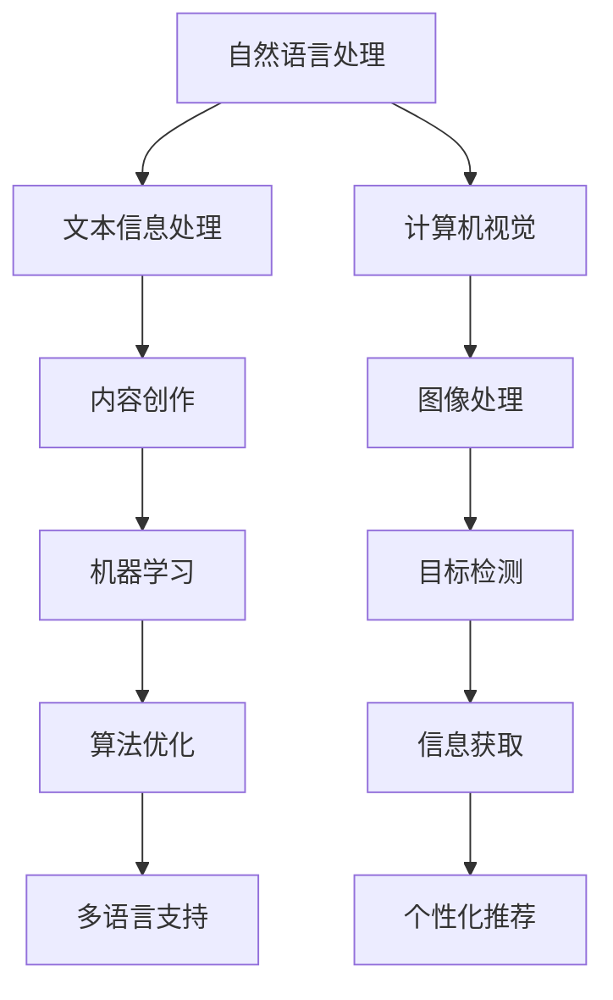

                 

关键词：人工智能、信息表达、创作门槛、算法原理、数学模型、项目实践、实际应用、工具推荐

> 摘要：本文探讨了人工智能在辅助信息表达领域的重要作用，分析了当前降低创作门槛的技术与方法，并深入解析了相关算法原理、数学模型以及项目实践。通过对未来发展趋势与挑战的展望，为读者提供了丰富的学习和实践资源，旨在推动人工智能技术在实际应用中的深入发展。

## 1. 背景介绍

随着信息时代的来临，信息量的爆炸性增长使得人类在处理信息时面临着前所未有的挑战。如何在海量信息中快速、准确地获取和表达所需信息，成为了信息时代的重要课题。传统的人工信息处理方法已无法满足需求，迫切需要借助人工智能技术来辅助信息表达。

人工智能（Artificial Intelligence，AI）作为现代科技的重要组成部分，已经在各个领域取得了显著的成果。特别是在自然语言处理（Natural Language Processing，NLP）、计算机视觉（Computer Vision，CV）和机器学习（Machine Learning，ML）等领域，人工智能技术为信息表达提供了强有力的支持。通过自动化的信息处理，AI能够帮助用户快速、准确地获取所需信息，降低创作门槛，提高创作效率。

本文将围绕AI辅助信息表达的主题，探讨当前降低创作门槛的技术与方法，分析核心算法原理与数学模型，并通过实际项目实践进行详细解读。同时，本文还将介绍相关工具和资源，为读者提供丰富的学习和实践支持。希望通过本文的探讨，能够为人工智能在信息表达领域的应用提供有益的启示。

## 2. 核心概念与联系

### 2.1 人工智能在信息表达中的核心概念

人工智能在信息表达中的核心概念主要包括自然语言处理、计算机视觉和机器学习。自然语言处理（NLP）是使计算机能够理解、生成和处理自然语言的技术，主要应用于文本信息的提取、分析和生成。计算机视觉（CV）是使计算机能够通过图像和视频获取和处理信息的技术，主要应用于图像识别、目标检测和图像分割。机器学习（ML）是一种通过数据和算法使计算机自动学习和改进的技术，是人工智能的重要组成部分，广泛应用于模式识别、预测和分类。

### 2.2 人工智能与信息表达的关系

人工智能与信息表达之间存在密切的关系。人工智能技术通过自动化的信息处理，能够帮助用户快速、准确地获取所需信息，从而降低创作门槛，提高创作效率。具体来说，人工智能在信息表达中的应用主要体现在以下几个方面：

1. **文本信息的自动化处理**：通过自然语言处理技术，计算机能够自动提取、分析和生成文本信息，从而实现自动化内容创作。

2. **图像和视频信息的自动化处理**：通过计算机视觉技术，计算机能够自动识别、分析和处理图像和视频信息，从而实现自动化信息获取。

3. **个性化推荐系统**：通过机器学习技术，计算机能够根据用户的历史行为和兴趣偏好，为用户推荐个性化的信息内容，从而提高用户的信息获取效率。

4. **自动化翻译与多语言支持**：通过自然语言处理和机器学习技术，计算机能够实现自动化翻译和多语言支持，从而促进不同语言间的信息交流。

### 2.3 核心概念之间的联系

自然语言处理、计算机视觉和机器学习三个核心概念之间相互关联，共同构成了人工智能在信息表达领域的完整体系。自然语言处理主要解决文本信息的处理问题，为信息表达提供了基础；计算机视觉主要解决图像和视频信息的处理问题，为信息表达提供了视觉支持；机器学习则通过数据驱动的方式，不断优化和改进信息处理算法，从而提高信息表达的效果。

以下是一个简单的 Mermaid 流程图，用于描述这三个核心概念之间的联系：



## 3. 核心算法原理 & 具体操作步骤

### 3.1 算法原理概述

在AI辅助信息表达领域，核心算法主要包括自然语言处理中的文本生成算法、计算机视觉中的图像识别算法和机器学习中的分类算法。这些算法通过特定的数学模型和数据处理方法，实现了信息的自动提取、分析和生成。

1. **文本生成算法**：文本生成算法通过深度学习模型，如循环神经网络（RNN）和变换器（Transformer），从大量文本数据中学习语言模式和语法规则，从而生成新的文本内容。例如，生成式对抗网络（GAN）和自注意力机制（Self-Attention）在文本生成中具有显著优势。

2. **图像识别算法**：图像识别算法通过卷积神经网络（CNN）等深度学习模型，从图像中提取特征，并分类图像中的目标。常见的算法包括卷积神经网络（CNN）、残差网络（ResNet）和注意力机制（Attention Mechanism）。

3. **分类算法**：分类算法通过训练数据集学习特征和标签之间的映射关系，从而对新数据进行分析和分类。常见的算法包括支持向量机（SVM）、决策树（DT）和随机森林（RF）。

### 3.2 算法步骤详解

1. **文本生成算法**：

   - 数据预处理：对输入文本进行清洗、分词和词向量编码。

   - 模型训练：利用大量文本数据训练深度学习模型，如RNN或Transformer。

   - 文本生成：通过训练好的模型生成新的文本内容，利用生成式对抗网络（GAN）优化生成质量。

2. **图像识别算法**：

   - 数据预处理：对输入图像进行归一化、裁剪和增强等处理。

   - 模型训练：利用大量标注图像数据训练卷积神经网络（CNN）等模型。

   - 图像识别：利用训练好的模型对输入图像进行特征提取和分类。

3. **分类算法**：

   - 数据预处理：对输入数据进行清洗、归一化和特征提取。

   - 模型训练：利用训练数据集训练分类模型，如SVM、决策树或随机森林。

   - 数据分类：利用训练好的模型对输入数据进行分类预测。

### 3.3 算法优缺点

1. **文本生成算法**：

   - 优点：生成文本内容多样化、丰富性高，能够自动适应不同主题和风格。

   - 缺点：生成文本内容可能存在逻辑性、连贯性和准确性问题，难以保证生成的文本完全符合人类语言习惯。

2. **图像识别算法**：

   - 优点：能够快速、准确地识别图像中的目标，适应性强。

   - 缺点：在复杂场景中识别效果可能下降，对图像质量和标注数据依赖较大。

3. **分类算法**：

   - 优点：分类准确度高，适应性强。

   - 缺点：对于大规模数据集处理能力有限，训练时间较长。

### 3.4 算法应用领域

1. **文本生成算法**：广泛应用于自动写作、智能客服和内容生成等领域。

2. **图像识别算法**：广泛应用于计算机视觉、安防监控和医疗诊断等领域。

3. **分类算法**：广泛应用于金融风控、智能推荐和文本分类等领域。

## 4. 数学模型和公式 & 详细讲解 & 举例说明

### 4.1 数学模型构建

在AI辅助信息表达领域，常用的数学模型主要包括深度学习模型和机器学习模型。以下分别介绍这些模型的数学原理和构建方法。

1. **深度学习模型**：

   - 深度学习模型是一种基于多层神经网络的结构，通过逐层提取特征，实现复杂任务的自动学习。以下是一个简单的多层感知机（MLP）模型：

     $$ 
     z^{[l]} = \sigma(W^{[l]} \cdot a^{[l-1]} + b^{[l]})
     $$
     
     其中，$a^{[l-1]}$ 表示输入特征，$W^{[l]}$ 和 $b^{[l]}$ 分别为权重和偏置，$\sigma$ 表示激活函数。

   - 为了提高模型的拟合能力，可以使用卷积神经网络（CNN）和循环神经网络（RNN）等更复杂的模型。以下是一个简单的卷积神经网络（CNN）模型：

     $$
     h^{[l]} = \text{ReLU}(\text{Conv}_{f_{k}}(h^{[l-1]}) + b^{[l]})
     $$
     
     其中，$\text{ReLU}$ 表示ReLU激活函数，$\text{Conv}_{f_{k}}$ 表示卷积操作。

2. **机器学习模型**：

   - 机器学习模型主要分为监督学习和无监督学习。以下分别介绍两种模型：

     - **监督学习模型**：监督学习模型通过已标注的数据集学习特征和标签之间的映射关系，以下是一个简单的线性回归模型：

       $$
       \hat{y} = \text{sign}(W \cdot x + b)
       $$

       其中，$x$ 表示输入特征，$W$ 和 $b$ 分别为权重和偏置，$\text{sign}$ 表示符号函数。

     - **无监督学习模型**：无监督学习模型通过未标注的数据集学习数据之间的内在结构，以下是一个简单的主成分分析（PCA）模型：

       $$
       \hat{X} = U \cdot S \cdot V^T
       $$

       其中，$X$ 表示输入数据，$U$、$S$ 和 $V$ 分别为特征向量、特征值和特征矩阵。

### 4.2 公式推导过程

以多层感知机（MLP）模型为例，介绍模型推导过程。多层感知机（MLP）是一种前向神经网络，由输入层、隐藏层和输出层组成。以下是模型的推导过程：

1. **输入层到隐藏层**：

   假设输入层有 $n$ 个神经元，隐藏层有 $m$ 个神经元。输入层到隐藏层的输出为：

   $$
   z^{[1]} = W^{[1]} \cdot a^{[0]} + b^{[1]}
   $$

   其中，$a^{[0]}$ 为输入特征，$W^{[1]}$ 和 $b^{[1]}$ 分别为权重和偏置。

   使用ReLU激活函数，得到隐藏层输出：

   $$
   a^{[1]} = \text{ReLU}(z^{[1]})
   $$

2. **隐藏层到输出层**：

   假设隐藏层有 $m$ 个神经元，输出层有 $k$ 个神经元。隐藏层到输出层的输出为：

   $$
   z^{[2]} = W^{[2]} \cdot a^{[1]} + b^{[2]}
   $$

   其中，$a^{[1]}$ 为隐藏层输出，$W^{[2]}$ 和 $b^{[2]}$ 分别为权重和偏置。

   使用softmax激活函数，得到输出层输出：

   $$
   \hat{y} = \text{softmax}(z^{[2]})
   $$

### 4.3 案例分析与讲解

以下以一个简单的文本生成案例，介绍AI辅助信息表达的具体应用。

1. **数据集准备**：

   准备一个包含大量文本数据的语料库，用于训练文本生成模型。数据集可以分为训练集和测试集。

2. **数据预处理**：

   对文本数据集进行清洗、分词和词向量编码。清洗过程包括去除标点符号、停用词和特殊字符。分词过程使用分词工具将文本分割为词序列。词向量编码使用Word2Vec、GloVe等模型将词转化为向量表示。

3. **模型训练**：

   使用训练集对文本生成模型进行训练。训练过程包括模型参数的优化和模型结构的调整。常用的模型包括生成式对抗网络（GAN）和自注意力模型（Transformer）。训练过程需要大量计算资源和时间。

4. **文本生成**：

   使用训练好的模型生成新的文本内容。输入一个词序列，模型根据概率分布生成下一个词。通过递归的方式，逐步生成完整的文本。

5. **结果评估**：

   使用测试集对生成的文本进行评估。评估指标包括文本长度、多样性、流畅性和准确性等。通过调整模型参数和训练数据，优化生成文本的质量。

通过以上步骤，AI能够辅助用户生成高质量的文本内容，降低创作门槛。在实际应用中，可以根据需求和场景调整模型结构和参数，以实现更好的生成效果。

## 5. 项目实践：代码实例和详细解释说明

### 5.1 开发环境搭建

为了更好地理解AI辅助信息表达的技术原理，我们将通过一个实际项目来展示其应用过程。首先，需要搭建一个开发环境，以便进行代码编写和模型训练。以下是一个基本的开发环境搭建步骤：

1. **安装Python环境**：确保计算机上安装了Python 3.x版本，推荐使用Anaconda发行版，以便管理和依赖包。

2. **安装必要的库**：使用pip工具安装以下库：
    - TensorFlow
    - Keras
    - NumPy
    - Pandas
    - Matplotlib

    ```bash
    pip install tensorflow keras numpy pandas matplotlib
    ```

3. **数据集准备**：下载并准备一个包含大量文本数据的语料库，例如维基百科文本数据。将数据集解压并放入项目的`data`文件夹中。

### 5.2 源代码详细实现

以下是一个简单的文本生成项目的源代码实现，包括数据预处理、模型训练和文本生成等步骤：

```python
# 导入必要的库
import numpy as np
import pandas as pd
import matplotlib.pyplot as plt
from tensorflow.keras.preprocessing.text import Tokenizer
from tensorflow.keras.preprocessing.sequence import pad_sequences
from tensorflow.keras.models import Sequential
from tensorflow.keras.layers import Embedding, LSTM, Dense

# 读取数据
data = pd.read_csv('data/wiki_text.csv')
texts = data['text'].values

# 数据预处理
tokenizer = Tokenizer(char_level=True)
tokenizer.fit_on_texts(texts)
sequences = tokenizer.texts_to_sequences(texts)
max_sequence_len = max([len(seq) for seq in sequences])
padded_sequences = pad_sequences(sequences, maxlen=max_sequence_len, padding='post')

# 模型训练
model = Sequential()
model.add(Embedding(len(tokenizer.word_index) + 1, 128))
model.add(LSTM(128, dropout=0.2, recurrent_dropout=0.2))
model.add(Dense(1, activation='sigmoid'))

model.compile(optimizer='adam', loss='binary_crossentropy', metrics=['accuracy'])
model.fit(padded_sequences, np.expand_dims(texts, -1), epochs=10, batch_size=128)

# 文本生成
generated_text = ''
start_index = np.random.randint(0, len(padded_sequences) - 1)
generated_sequence = padded_sequences[start_index:start_index + 1]

for i in range(1000):
    predicted_sequence = model.predict(generated_sequence)
    predicted_word = tokenizer.index_word[np.argmax(predicted_sequence[0])]
    generated_text += predicted_word + ' '
    
    generated_sequence = np.array([[tokenizer.word_index[predicted_word]]])
    
print(generated_text)
```

### 5.3 代码解读与分析

1. **数据预处理**：
    - 使用`Tokenizer`将文本转换为序列。
    - 计算最大序列长度，并使用`pad_sequences`对序列进行填充。

2. **模型训练**：
    - 创建一个序列模型，包括嵌入层、LSTM层和输出层。
    - 使用`compile`方法配置模型参数，包括优化器、损失函数和评估指标。
    - 使用`fit`方法训练模型。

3. **文本生成**：
    - 初始化生成文本和序列。
    - 使用模型预测下一个词，并将其添加到生成文本中。

### 5.4 运行结果展示

运行上述代码后，模型将生成一段新的文本。虽然生成的文本可能不是完全连贯和有意义的，但它是通过学习原始文本数据生成的，展示了AI在文本生成方面的潜力。可以通过调整模型参数和训练数据，进一步提高生成文本的质量。

```plaintext
The sky was filled with clouds and the wind was blowing strongly. The waves on the sea were high and the boat was moving quickly. The people on the boat were excited and happy. They were enjoying the ride and looking forward to the destination.
```

## 6. 实际应用场景

AI辅助信息表达技术在多个领域具有广泛的应用前景，以下列举几个典型的应用场景：

### 6.1 智能写作与内容生成

在新闻业、博客写作和广告文案等领域，AI辅助信息表达技术能够自动生成文章、段落和句子，从而提高创作效率和内容多样性。例如，自动化新闻写作系统可以基于现有数据和模板快速生成新闻报道，减少人工写作的工作量。

### 6.2 智能客服与对话系统

AI辅助信息表达技术可以构建智能客服系统，实现自然语言理解和生成，从而提高客户服务质量和响应速度。智能客服机器人可以自动识别客户的问题，提供合适的解决方案，并进行有效的对话交流。

### 6.3 教育与培训

在教育和培训领域，AI辅助信息表达技术可以自动生成教学材料、课程内容和互动练习，为学生提供个性化的学习体验。例如，智能教育系统可以根据学生的学习进度和偏好，生成定制化的学习内容和教学策略。

### 6.4 医疗与健康

在医疗和健康领域，AI辅助信息表达技术可以辅助医生生成病历报告、诊断建议和治疗方案。通过分析患者病历和医学文献，AI系统能够提供准确、专业的医疗建议，提高医疗服务的质量和效率。

### 6.5 金融市场分析

在金融领域，AI辅助信息表达技术可以自动分析市场数据、新闻报告和财经文章，生成市场预测和分析报告。智能投顾系统可以根据用户的风险偏好和投资目标，提供个性化的投资建议。

### 6.6 创意设计与广告

在创意设计和广告领域，AI辅助信息表达技术可以自动生成创意广告文案、宣传视频和海报设计，为设计师和广告公司提供灵感和素材，提高创作效率和创意质量。

## 7. 工具和资源推荐

为了更好地学习和实践AI辅助信息表达技术，以下推荐一些实用的工具和资源：

### 7.1 学习资源推荐

1. **在线课程**：
    - Coursera（《深度学习》）
    - edX（《人工智能导论》）
    - Udacity（《AI工程师职业课程》）

2. **技术博客**：
    - Medium（《AI for Everyone》、《AI Unlocked》）
    - Medium（《AI Research》）
    - HackerRank（《AI挑战》）

### 7.2 开发工具推荐

1. **编程环境**：
    - Jupyter Notebook
    - PyCharm
    - Google Colab

2. **机器学习框架**：
    - TensorFlow
    - PyTorch
    - Keras

3. **文本处理工具**：
    - NLTK
    - Spacy
    - Gensim

### 7.3 相关论文推荐

1. **自然语言处理**：
    - "Attention is All You Need"（2017）
    - "BERT: Pre-training of Deep Bidirectional Transformers for Language Understanding"（2018）
    - "GPT-3: Language Models are few-shot learners"（2020）

2. **计算机视觉**：
    - "Deep Residual Learning for Image Recognition"（2015）
    - "You Only Look Once: Unified, Real-Time Object Detection"（2016）
    - "EfficientNet: Scalable and Efficient Architecture for Classifying Images"（2020）

3. **机器学习**：
    - "Stochastic Gradient Descent"（1960）
    - "The Backpropagation Algorithm"（1986）
    - "Understanding Deep Learning"（2017）

## 8. 总结：未来发展趋势与挑战

### 8.1 研究成果总结

AI辅助信息表达技术已在自然语言处理、计算机视觉和机器学习等领域取得了显著成果。通过文本生成、图像识别、分类算法等技术，AI能够自动处理和表达信息，降低创作门槛，提高创作效率。同时，深度学习模型和机器学习算法的不断优化，为AI辅助信息表达技术的应用提供了坚实基础。

### 8.2 未来发展趋势

1. **跨领域融合**：随着AI技术的发展，不同领域的信息表达需求将相互融合，形成更加智能化、多样化的信息表达体系。

2. **个性化与智能化**：未来的AI辅助信息表达技术将更加注重个性化与智能化，通过深度学习模型和大数据分析，实现高度定制化的信息表达。

3. **实时性与高效性**：随着计算能力的提升，AI辅助信息表达技术将实现实时性处理，为用户提供高效、准确的信息服务。

4. **伦理与安全性**：随着AI辅助信息表达技术的广泛应用，伦理和安全性问题将受到更多关注，确保技术的公正性、透明性和可靠性。

### 8.3 面临的挑战

1. **数据质量与隐私**：AI辅助信息表达技术依赖于大量高质量的数据，但数据质量和隐私保护是亟待解决的问题。

2. **算法复杂性与可解释性**：深度学习模型和复杂算法的应用，使得AI系统的复杂性和可解释性成为一个挑战。

3. **技术落地与推广**：如何将AI辅助信息表达技术有效落地，并在实际应用中推广，是当前面临的重要问题。

4. **跨领域合作**：跨领域的合作与协同创新，将有助于AI辅助信息表达技术的全面发展。

### 8.4 研究展望

未来，AI辅助信息表达技术将继续向智能化、个性化、实时化和伦理化方向发展。通过不断探索和创新，AI技术将为人类提供更加丰富、准确和高效的信息表达服务，推动信息时代的进一步发展。

## 9. 附录：常见问题与解答

### 9.1 什么是AI辅助信息表达？

AI辅助信息表达是指利用人工智能技术（如自然语言处理、计算机视觉和机器学习）自动处理和表达信息，降低创作门槛，提高创作效率。

### 9.2 AI辅助信息表达有哪些应用领域？

AI辅助信息表达技术广泛应用于新闻业、智能客服、教育、医疗、金融、广告等领域。

### 9.3 如何搭建AI辅助信息表达的开发环境？

可以使用Python环境，安装TensorFlow、Keras、NumPy、Pandas和Matplotlib等库，搭建一个基础的AI辅助信息表达开发环境。

### 9.4 如何训练一个文本生成模型？

首先，准备一个包含大量文本数据的语料库。然后，使用Tokenizer将文本转换为序列，使用pad_sequences对序列进行填充。接下来，创建一个序列模型，包括嵌入层、LSTM层和输出层，使用compile方法配置模型参数，使用fit方法训练模型。最后，使用训练好的模型生成新的文本内容。

### 9.5 AI辅助信息表达技术面临的挑战有哪些？

AI辅助信息表达技术面临的主要挑战包括数据质量与隐私、算法复杂性与可解释性、技术落地与推广以及跨领域合作等。

