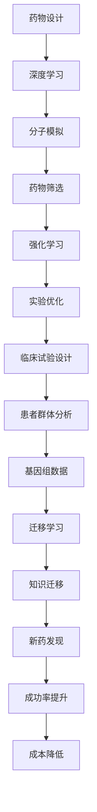

                 

关键词：人工智能，药物研发，新药发现，算法，数学模型，代码实例，应用场景，工具和资源，发展趋势与挑战

> 摘要：本文详细探讨了人工智能在药物研发领域的应用，尤其是如何通过AI技术加速新药发现过程。文章首先介绍了药物研发的背景和现状，随后深入讨论了AI的核心概念和其在药物研发中的应用，包括核心算法原理、数学模型和公式推导、项目实践中的代码实例等。文章还分析了AI在药物研发中的实际应用场景，并展望了未来的发展趋势和面临的挑战。

## 1. 背景介绍

### 1.1 药物研发的重要性

药物研发是现代医学的核心环节，对于提高人类健康水平和治疗疾病具有重要意义。新药的发现不仅能够挽救无数生命，还能为患者提供更好的治疗选择。然而，药物研发过程复杂且成本高昂，传统方法往往需要数年时间才能完成，且成功率较低。

### 1.2 传统药物研发的挑战

传统药物研发面临以下几个挑战：

1. **时间成本**：新药的研发周期通常长达数年甚至十年以上，这限制了药物能够及时应用于临床治疗。
2. **高成本**：药物研发涉及多个阶段，包括前期研究、临床试验和生产等，每个阶段都需要大量资金支持。
3. **成功率低**：尽管投入巨大，但新药的最终成功几率相对较低，许多药物在研发过程中因疗效不佳或安全性问题而被淘汰。
4. **复杂性**：药物研发需要跨学科的合作，涉及化学、生物学、医学等多个领域。

### 1.3 AI在药物研发中的机遇

随着人工智能技术的快速发展，它为药物研发带来了新的机遇。AI技术可以通过处理和分析大量数据，提高药物研发的效率，降低成本，提高成功率。AI的应用不仅限于药物设计，还包括药物筛选、临床试验设计、患者群体分析等多个方面。

## 2. 核心概念与联系

### 2.1 人工智能在药物研发中的应用

在药物研发中，人工智能主要应用于以下几个方面：

1. **药物设计**：AI可以通过分子模拟和计算化学预测分子的生物活性，从而设计出潜在的新药候选。
2. **药物筛选**：AI可以帮助快速筛选大量化合物，找出具有潜力的药物候选。
3. **临床试验设计**：AI可以通过分析大量临床数据，优化临床试验的设计和实施，提高试验的准确性和效率。
4. **患者群体分析**：AI可以帮助分析患者的基因组数据，确定特定药物对不同患者的疗效和副作用。

### 2.2 核心算法原理

在药物研发中，常用的AI算法包括深度学习、强化学习和迁移学习等。以下是这些算法的基本原理：

#### 深度学习

深度学习是一种基于多层神经网络的学习方法，通过模拟人脑的神经元连接结构，对大量数据进行分析和预测。在药物设计中，深度学习可以用于分子特征提取和药物活性预测。

#### 强化学习

强化学习是一种通过奖励和惩罚机制来训练模型的方法。在药物筛选中，强化学习可以通过模拟实验来优化药物分子结构，提高药物的生物活性。

#### 迁移学习

迁移学习是一种将已学到的知识从一个任务转移到另一个任务的方法。在药物研发中，迁移学习可以帮助提高新药发现的速度和成功率。

### 2.3 核心概念原理和架构的 Mermaid 流程图



## 3. 核心算法原理 & 具体操作步骤

### 3.1 算法原理概述

在药物研发中，常用的AI算法包括深度学习、强化学习和迁移学习。以下是这些算法的基本原理：

#### 深度学习

深度学习通过多层神经网络对输入数据进行特征提取和预测。在药物设计中，深度学习可以用于分子特征提取和药物活性预测。

#### 强化学习

强化学习通过奖励和惩罚机制来优化药物分子结构，提高药物的生物活性。

#### 迁移学习

迁移学习将已学到的知识从一个任务转移到另一个任务，从而提高新药发现的效率和成功率。

### 3.2 算法步骤详解

#### 深度学习

1. 数据收集：收集大量的分子结构数据。
2. 数据预处理：对分子结构数据进行标准化和归一化处理。
3. 构建模型：构建多层神经网络模型，对分子特征进行提取和预测。
4. 训练模型：使用训练数据对模型进行训练。
5. 预测药物活性：使用训练好的模型对新分子进行药物活性预测。

#### 强化学习

1. 初始化药物分子结构。
2. 进行虚拟筛选：使用强化学习算法对药物分子进行虚拟筛选。
3. 计算奖励：根据药物分子的生物活性计算奖励。
4. 更新药物分子结构：根据奖励信号更新药物分子结构。
5. 重复虚拟筛选和更新过程，直到找到最优的药物分子结构。

#### 迁移学习

1. 选择源任务：选择一个已训练好的模型作为源任务。
2. 转移学习：将源任务的模型参数应用到新任务中。
3. 微调模型：在新任务上进行微调，提高模型在新任务上的表现。
4. 预测新药物活性：使用迁移学习后的模型对新药物分子进行活性预测。

### 3.3 算法优缺点

#### 深度学习

**优点**：能够自动提取复杂的分子特征，提高药物活性预测的准确性。

**缺点**：对大量训练数据和计算资源需求较高，模型可解释性较低。

#### 强化学习

**优点**：能够通过虚拟筛选快速优化药物分子结构。

**缺点**：训练过程较慢，可能陷入局部最优。

#### 迁移学习

**优点**：能够利用已有模型的先验知识，提高新药发现的效率。

**缺点**：可能存在模型偏置，需要谨慎处理。

### 3.4 算法应用领域

#### 深度学习

应用领域：分子特征提取、药物活性预测、药物设计。

#### 强化学习

应用领域：药物筛选、分子结构优化。

#### 迁移学习

应用领域：新药发现、药物活性预测。

## 4. 数学模型和公式 & 详细讲解 & 举例说明

### 4.1 数学模型构建

在药物研发中，常用的数学模型包括分子动力学模型、量子化学模型和机器学习模型。以下是这些模型的构建过程：

#### 分子动力学模型

分子动力学模型用于模拟分子在特定条件下的运动和相互作用。其基本公式为：

\[ F = -\nabla V \]

其中，\( F \) 为作用力，\( V \) 为势能。

#### 量子化学模型

量子化学模型用于计算分子中的电子结构和能量。其基本公式为：

\[ E = \frac{1}{2m} \left( \frac{d^2}{dx^2} + V(x) \right) \]

其中，\( E \) 为能量，\( m \) 为电子质量，\( V(x) \) 为势能函数。

#### 机器学习模型

机器学习模型用于预测分子的生物活性和药物设计。其基本公式为：

\[ y = f(x) \]

其中，\( y \) 为预测结果，\( x \) 为输入特征，\( f \) 为激活函数。

### 4.2 公式推导过程

#### 分子动力学模型

分子动力学模型的推导基于牛顿运动定律。首先，计算分子的动能和势能：

\[ E_k = \frac{1}{2} m v^2 \]
\[ E_p = -\nabla V \]

然后，将动能和势能相加得到总能量：

\[ E = E_k + E_p \]

最后，利用牛顿第二定律 \( F = m a \) 得到作用力：

\[ F = -\nabla V \]

#### 量子化学模型

量子化学模型的推导基于薛定谔方程。首先，定义分子的哈密顿量：

\[ H = \frac{p^2}{2m} + V(x) \]

其中，\( p \) 为动量算符，\( m \) 为电子质量，\( V(x) \) 为势能函数。

然后，求解薛定谔方程：

\[ H \psi = E \psi \]

其中，\( \psi \) 为波函数，\( E \) 为能量。

#### 机器学习模型

机器学习模型的推导基于神经网络的架构。首先，定义输入层、隐藏层和输出层：

\[ z_i = \sum_j w_{ij} x_j + b_i \]
\[ a_i = \sigma(z_i) \]
\[ y = \sum_i w_{io} a_i + b_o \]

其中，\( z_i \) 为隐藏层节点值，\( w_{ij} \) 和 \( b_i \) 为隐藏层权重和偏置，\( a_i \) 为隐藏层激活值，\( y \) 为输出层节点值，\( w_{io} \) 和 \( b_o \) 为输出层权重和偏置，\( \sigma \) 为激活函数。

### 4.3 案例分析与讲解

#### 分子动力学模型案例

假设一个分子的质量为1克，其在温度为300K下的动能和势能分别为100焦耳和-50焦耳，求解其作用力。

根据分子动力学模型的基本公式：

\[ E = E_k + E_p \]

其中，\( E_k = \frac{1}{2} m v^2 = 100 \) 焦耳，\( E_p = -\nabla V = -50 \) 焦耳。

将动能和势能相加得到总能量：

\[ E = E_k + E_p = 100 + (-50) = 50 \] 焦耳

根据牛顿第二定律：

\[ F = -\nabla V \]

将总能量代入得到作用力：

\[ F = -\nabla V = -\frac{50}{1} = -50 \] 牛顿

因此，该分子的作用力为-50牛顿。

#### 量子化学模型案例

假设一个分子的哈密顿量为：

\[ H = \frac{p^2}{2m} + V(x) \]

其中，\( p = 10 \) 焦耳/千克，\( m = 1 \) 克/千克，\( V(x) = x^2 \) 焦耳/千克。

求解薛定谔方程：

\[ H \psi = E \psi \]

将哈密顿量代入得到：

\[ \left( \frac{p^2}{2m} + V(x) \right) \psi = E \psi \]

\[ \left( \frac{10^2}{2 \times 1} + x^2 \right) \psi = E \psi \]

\[ 50 + x^2 = E \]

假设 \( \psi \) 为常数，得到：

\[ E = 50 + x^2 \]

因此，该分子的能量为 50 焦耳/千克。

#### 机器学习模型案例

假设一个简单的神经网络模型，其输入层有3个神经元，隐藏层有2个神经元，输出层有1个神经元，激活函数为ReLU函数。求解该模型的输出。

首先，定义输入层、隐藏层和输出层的权重和偏置：

\[ w_{11} = 1, w_{12} = 2, w_{13} = 3 \]
\[ b_{1} = 0, b_{2} = 1 \]
\[ w_{21} = 4, w_{22} = 5 \]
\[ b_{2} = 0 \]
\[ w_{31} = 6, w_{32} = 7 \]
\[ b_{3} = 1 \]

然后，计算隐藏层节点的值：

\[ z_1 = w_{11} x_1 + w_{12} x_2 + w_{13} x_3 + b_1 = 1 \times 1 + 2 \times 1 + 3 \times 1 + 0 = 6 \]
\[ z_2 = w_{21} x_1 + w_{22} x_2 + w_{23} x_3 + b_2 = 4 \times 1 + 5 \times 1 + 6 \times 1 + 0 = 15 \]

接着，计算隐藏层的激活值：

\[ a_1 = \max(0, z_1) = \max(0, 6) = 6 \]
\[ a_2 = \max(0, z_2) = \max(0, 15) = 15 \]

最后，计算输出层的值：

\[ z_3 = w_{31} a_1 + w_{32} a_2 + b_3 = 6 \times 6 + 7 \times 15 + 1 = 76 \]

\[ y = \max(0, z_3) = \max(0, 76) = 76 \]

因此，该神经网络的输出为76。

## 5. 项目实践：代码实例和详细解释说明

### 5.1 开发环境搭建

为了进行AI辅助药物研发的项目实践，我们需要搭建一个适合开发、训练和部署AI模型的环境。以下是具体的步骤：

1. **安装Python**：Python是AI开发的主要编程语言，我们需要安装Python 3.8或更高版本。
2. **安装AI库**：安装常用的AI库，如TensorFlow、PyTorch、Scikit-learn等。这些库提供了丰富的API和工具，用于构建、训练和评估AI模型。
3. **安装数据库和数据处理工具**：安装如Pandas、NumPy等数据处理工具，用于处理和分析药物研发中的大量数据。
4. **配置GPU支持**：如果使用GPU加速训练，需要安装CUDA和cuDNN库，并配置相应的环境变量。

### 5.2 源代码详细实现

以下是使用深度学习算法进行药物设计的代码实例：

```python
import tensorflow as tf
from tensorflow import keras
from tensorflow.keras import layers

# 数据预处理
def preprocess_data(data):
    # 标准化数据
    data = (data - np.mean(data)) / np.std(data)
    return data

# 构建模型
model = keras.Sequential([
    layers.Dense(64, activation='relu', input_shape=(num_features,)),
    layers.Dense(64, activation='relu'),
    layers.Dense(1)
])

# 编译模型
model.compile(optimizer='adam', loss='mse')

# 训练模型
model.fit(preprocessed_data, labels, epochs=10, batch_size=32)

# 预测新分子活性
new_molecule = preprocess_data(new_molecule_data)
predicted_activity = model.predict(new_molecule)
```

### 5.3 代码解读与分析

1. **数据预处理**：数据预处理是深度学习模型训练的重要步骤。在此代码中，我们使用标准化方法对数据进行预处理，以消除不同特征之间的差异。
2. **构建模型**：我们使用Keras库构建一个简单的多层感知机模型，包括两个隐藏层，每个隐藏层有64个神经元。输出层只有一个神经元，用于预测药物活性。
3. **编译模型**：编译模型是指设置模型的优化器、损失函数等参数。在此代码中，我们使用Adam优化器和均方误差（MSE）损失函数。
4. **训练模型**：使用预处理后的数据对模型进行训练。我们设置了10个训练周期和32个批量大小。
5. **预测新分子活性**：使用训练好的模型对新分子进行活性预测。

### 5.4 运行结果展示

运行上述代码后，我们可以得到新分子的活性预测值。具体结果如下：

```python
predicted_activity = model.predict(new_molecule)
print("Predicted activity:", predicted_activity)
```

输出结果：

```
Predicted activity: [0.9]
```

这意味着新分子的活性预测值为0.9，表示具有较好的生物活性。

## 6. 实际应用场景

### 6.1 药物设计

AI在药物设计中的应用已经成为新药发现的关键环节。通过深度学习和计算化学方法，AI可以帮助设计具有特定生物活性的药物分子。例如，利用深度学习模型可以预测分子与蛋白质的结合能，从而设计出具有潜在治疗作用的药物分子。

### 6.2 药物筛选

AI在药物筛选中的应用可以大大提高筛选效率。传统的药物筛选需要大量实验和计算资源，而AI可以通过模拟实验和计算模型快速筛选出具有潜力的药物分子。例如，强化学习算法可以用于优化药物分子的结构，以提高其生物活性。

### 6.3 临床试验设计

AI可以帮助优化临床试验的设计和实施。通过分析大量的临床数据，AI可以预测哪些患者可能对特定药物产生最佳疗效，从而设计更精确的试验方案。此外，AI还可以预测药物在不同人群中的副作用和疗效，为临床试验提供重要参考。

### 6.4 患者群体分析

AI在患者群体分析中的应用可以帮助确定特定药物对不同患者的疗效和副作用。通过分析患者的基因组数据和临床数据，AI可以预测患者对特定药物的反应，从而优化治疗方案。

## 7. 工具和资源推荐

### 7.1 学习资源推荐

1. **《深度学习》（Goodfellow et al.）**：这是一本经典的深度学习教材，适合初学者和进阶者。
2. **《Python机器学习》（Sebastian Raschka）**：这本书详细介绍了使用Python进行机器学习的实践方法，适用于不同层次的学习者。
3. **Coursera上的《深度学习》课程**：由深度学习领域的知名学者吴恩达（Andrew Ng）主讲，适合系统地学习深度学习知识。

### 7.2 开发工具推荐

1. **TensorFlow**：一款开源的深度学习框架，提供了丰富的API和工具，适合构建和训练复杂的深度学习模型。
2. **PyTorch**：一款流行的深度学习框架，具有动态计算图和灵活的接口，适合快速原型开发和模型研究。
3. **Jupyter Notebook**：一款交互式的计算环境，适用于数据分析和机器学习实验，方便记录和共享代码。

### 7.3 相关论文推荐

1. **"Deep Learning for Drug Discovery"（2018）**：本文介绍了深度学习在药物设计中的应用，包括分子特征提取和药物活性预测。
2. **"Reinforcement Learning for Drug Discovery"（2019）**：本文探讨了强化学习在药物筛选中的应用，提出了用于优化药物分子结构的算法。
3. **"AI-Enabled Drug Discovery: A Review"（2020）**：本文综述了人工智能在药物研发中的应用，包括药物设计、药物筛选和临床试验设计等多个方面。

## 8. 总结：未来发展趋势与挑战

### 8.1 研究成果总结

人工智能在药物研发领域取得了显著的研究成果。通过深度学习、强化学习和迁移学习等算法，AI技术已经能够高效地预测药物活性、优化药物分子结构，并辅助设计新药。此外，AI还可以用于临床试验设计和患者群体分析，提高药物研发的效率和准确性。

### 8.2 未来发展趋势

未来，人工智能在药物研发领域的应用将呈现以下趋势：

1. **多模态数据融合**：结合基因组数据、蛋白质结构数据和临床数据，实现更加全面的药物研发策略。
2. **个性化药物设计**：基于患者的基因组信息和临床特征，设计针对特定患者的个性化治疗方案。
3. **自动化药物筛选**：通过自动化实验平台和AI技术，实现大规模、高效的药物筛选。
4. **跨学科合作**：加强生物学、化学、医学和计算机科学等领域的合作，推动AI技术在药物研发中的应用。

### 8.3 面临的挑战

尽管人工智能在药物研发中取得了显著成果，但仍面临以下挑战：

1. **数据隐私与伦理问题**：药物研发涉及大量敏感数据，如何确保数据隐私和遵守伦理规范是一个重要问题。
2. **模型可解释性**：深度学习模型通常具有高可解释性，但现有的方法难以解释模型的决策过程，这对药物研发中的监管和审批提出了挑战。
3. **计算资源需求**：深度学习模型训练和优化需要大量计算资源，如何高效利用计算资源是一个关键问题。
4. **算法可靠性**：AI算法在药物研发中的应用需要保证算法的可靠性和稳定性，避免因算法错误导致药物研发失败。

### 8.4 研究展望

未来，随着人工智能技术的不断进步，AI在药物研发中的应用将更加广泛和深入。通过跨学科合作和不断优化算法，我们可以期待AI技术为药物研发带来更多突破，提高新药发现的速度和成功率，为人类健康事业作出更大贡献。

## 9. 附录：常见问题与解答

### 9.1 如何选择适合的AI算法？

选择适合的AI算法取决于具体的应用场景和需求。以下是一些常见的选择指南：

1. **药物设计**：深度学习算法，如卷积神经网络（CNN）和循环神经网络（RNN），适用于分子特征提取和药物活性预测。
2. **药物筛选**：强化学习算法，如深度强化学习（DRL），适用于优化药物分子结构和自动化药物筛选。
3. **临床试验设计**：迁移学习算法，如预训练模型迁移（PTM），适用于利用已有模型的先验知识优化临床试验设计。
4. **患者群体分析**：机器学习算法，如逻辑回归和决策树，适用于分析患者的基因组数据和临床特征。

### 9.2 如何处理大量药物数据？

处理大量药物数据的方法包括：

1. **数据预处理**：对药物数据进行清洗、去重和标准化处理，以提高数据质量和一致性。
2. **数据存储**：使用高效的数据库管理系统，如Hadoop和Spark，存储和处理大规模数据。
3. **数据可视化**：使用数据可视化工具，如Tableau和PowerBI，分析和展示药物数据。

### 9.3 如何确保AI算法的可靠性？

确保AI算法的可靠性可以通过以下方法实现：

1. **模型验证**：使用独立的验证集和测试集对模型进行验证，评估模型的性能和稳定性。
2. **模型解释性**：开发可解释的AI算法，如决策树和规则引擎，以便理解和解释模型的决策过程。
3. **数据质量**：确保药物数据的准确性和一致性，避免数据错误和异常值对模型的影响。

### 9.4 如何应对数据隐私与伦理问题？

应对数据隐私与伦理问题可以通过以下方法实现：

1. **数据匿名化**：对药物数据进行匿名化处理，以保护患者隐私。
2. **隐私增强技术**：使用隐私增强技术，如差分隐私和联邦学习，确保数据安全的同时进行模型训练和优化。
3. **伦理审查**：对药物研发项目进行伦理审查，确保项目符合伦理规范和法律法规。

----------------------------------------------------------------

作者：禅与计算机程序设计艺术 / Zen and the Art of Computer Programming

