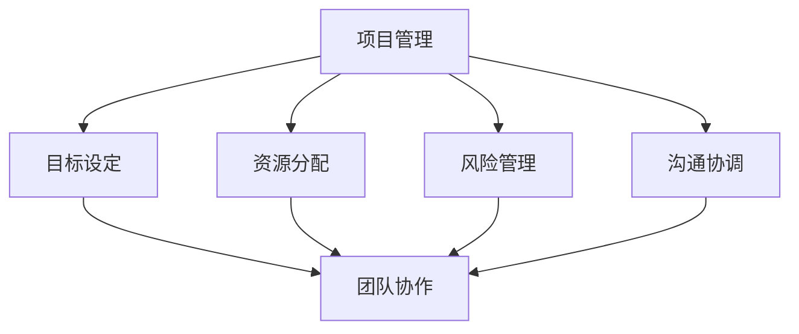

                 

### 关键词 Keywords
- AI项目管理
- 团队协作
- 编码实战
- 项目流程
- 自动化工具
- 代码质量
- 实践案例
- 人工智能

### 摘要 Abstract
本文旨在深入探讨人工智能项目管理的核心原则与实践方法，以及团队协作在AI项目开发中的重要性。文章首先介绍了项目管理的基础理论，随后通过具体的算法原理和数学模型讲解，展示了项目开发的关键技术。接着，文章通过代码实战案例，详细解析了从开发环境搭建到代码实现的全过程。最后，文章探讨了AI项目在实际应用中的广泛前景，并提出了未来发展趋势和面临的挑战。通过这篇文章，读者将全面了解AI项目管理的深度与广度，掌握团队协作的有效方法，并获得实际的代码实战经验。

## 1. 背景介绍

### 1.1 AI项目管理的重要性

在当今快速发展的科技时代，人工智能（AI）已经成为推动社会进步的重要力量。无论是自动化生产、智能医疗，还是金融风控、语音识别，AI的应用无处不在。然而，AI项目的成功不仅取决于技术的先进性，更取决于高效的项目管理和团队协作。AI项目管理不仅需要确保项目按时交付，还需要保证项目质量，满足客户需求。因此，理解AI项目管理的原理和实践，对从事AI开发的人员来说至关重要。

### 1.2 团队协作的关键性

在AI项目的开发过程中，团队协作发挥着不可替代的作用。人工智能项目通常涉及多个学科，如计算机科学、统计学、机器学习等。一个高效、协同的团队可以充分发挥各自的专业优势，共同解决复杂问题。同时，团队协作能够促进知识共享，提升整体项目效率，降低沟通成本和错误率。良好的团队协作还可以提高员工的满意度，促进团队文化的建设。

### 1.3 编码实战的重要性

在AI项目管理中，代码实战是检验理论和实践的重要手段。通过实际编写和调试代码，开发者不仅可以加深对算法和技术的理解，还可以及时发现和解决项目中可能存在的问题。代码实战还能培养开发者的编程思维和解决问题的能力，为未来更复杂的项目打下坚实的基础。此外，良好的代码质量和规范的编码习惯是保障项目稳定性和可维护性的关键。

### 1.4 文章结构概述

本文将按照以下结构展开：

- **第2章：核心概念与联系**：介绍AI项目管理与团队协作的核心概念及其相互关系。
- **第3章：核心算法原理 & 具体操作步骤**：讲解项目开发的关键算法原理，并详细描述操作步骤。
- **第4章：数学模型和公式 & 详细讲解 & 举例说明**：探讨AI项目中的数学模型和公式，并通过实例进行讲解。
- **第5章：项目实践：代码实例和详细解释说明**：提供实际的代码实战案例，详细解析项目开发的每一步。
- **第6章：实际应用场景**：分析AI项目在不同领域的应用场景。
- **第7章：工具和资源推荐**：推荐学习资源和开发工具。
- **第8章：总结：未来发展趋势与挑战**：总结研究成果，展望未来发展趋势和面临的挑战。
- **第9章：附录：常见问题与解答**：回答读者可能遇到的问题。

通过以上结构，本文旨在为读者提供一份全面、系统的AI项目管理和团队协作指南。

## 2. 核心概念与联系

### 2.1 项目管理的核心概念

项目管理是指通过计划、组织、领导、协调和控制等手段，以实现特定目标的过程。在AI项目管理中，核心概念包括但不限于以下几个方面：

- **目标设定**：明确项目的目标和预期成果，这是项目管理的基础。
- **资源分配**：合理分配人力、时间、资金等资源，确保项目顺利推进。
- **风险管理**：识别和评估项目风险，制定应对措施，降低风险影响。
- **沟通协调**：保持团队成员之间的有效沟通，确保信息畅通。

### 2.2 团队协作的核心概念

团队协作是指团队成员通过相互配合、共同努力，以实现共同目标的过程。在AI项目开发中，团队协作的核心概念包括：

- **分工合作**：根据团队成员的专长和兴趣，进行合理分工，发挥个人优势。
- **知识共享**：鼓励团队成员分享知识和经验，促进整体项目效率的提升。
- **协同工作**：通过协同工具和平台，实现实时沟通和协作，提高工作效率。
- **团队文化**：建立积极向上的团队文化，增强团队凝聚力，提升团队士气。

### 2.3 核心概念之间的联系

项目管理与团队协作之间存在着紧密的联系。项目管理为团队协作提供了明确的计划和目标，确保团队在正确的方向上努力。而团队协作则是实现项目管理目标的关键手段，通过高效的合作，能够更好地应对项目中的各种挑战和问题。具体来说：

- **项目管理促进团队协作**：项目管理通过明确的目标和计划，激发团队成员的积极性和责任感，促进团队协作。
- **团队协作优化项目管理**：团队协作能够提高项目的执行效率，降低沟通成本和风险，为项目管理提供有力的支持。

为了更直观地展示项目管理与团队协作之间的联系，我们可以使用Mermaid流程图来描述：



在这个流程图中，项目管理（A）通过四个核心概念（B、C、D、E）与团队协作（F）紧密相连，形成了一个相互促进、相互依赖的整体。

### 2.4 项目管理流程

项目管理流程是一个系统性的过程，通常包括以下步骤：

1. **项目启动**：明确项目目标和范围，组建项目团队。
2. **项目计划**：制定详细的项目计划，包括任务分配、时间表、预算等。
3. **项目执行**：按照计划进行项目工作，监控进度和质量。
4. **项目监控**：定期检查项目进度和成果，识别和解决潜在问题。
5. **项目收尾**：总结项目经验，完成项目交付。

项目管理流程的每一步都需要团队协作的支持。例如，在项目计划阶段，团队成员需要共同讨论和确定任务分工和时间表；在项目执行阶段，团队成员需要协同工作，确保任务按时完成；在项目监控阶段，团队成员需要及时沟通和解决问题，确保项目顺利进行。

总之，AI项目管理和团队协作是相辅相成的，通过良好的项目管理，可以确保项目目标的实现，而高效的团队协作则是实现项目目标的关键。理解并应用这些核心概念，有助于提升AI项目的成功率和团队整体绩效。

## 3. 核心算法原理 & 具体操作步骤

### 3.1 算法原理概述

在AI项目管理中，核心算法的选择和实现是项目成功的关键。下面我们介绍几种常见的算法原理，并详细描述其具体操作步骤。

#### 3.1.1 机器学习算法

机器学习算法是AI项目开发中最常用的算法之一。其原理是基于历史数据，通过构建模型，使计算机具备对未知数据的预测能力。常见的机器学习算法包括线性回归、决策树、支持向量机、神经网络等。

- **线性回归**：通过拟合数据之间的线性关系，预测目标变量。
- **决策树**：根据特征值对数据进行划分，形成树形结构，用于分类或回归。
- **支持向量机**：通过寻找最优超平面，将不同类别的数据分离。
- **神经网络**：模拟人脑神经网络的结构，通过多层神经元进行数据处理和预测。

#### 3.1.2 深度学习算法

深度学习算法是机器学习的一种扩展，通过构建深度神经网络，实现对复杂数据的建模和预测。常见的深度学习算法包括卷积神经网络（CNN）、循环神经网络（RNN）、生成对抗网络（GAN）等。

- **卷积神经网络**：通过卷积层和池化层，提取图像特征，用于图像识别。
- **循环神经网络**：通过循环结构，处理序列数据，用于自然语言处理和时间序列预测。
- **生成对抗网络**：由生成器和判别器组成，通过博弈过程，生成逼真的数据。

### 3.2 算法步骤详解

下面我们以线性回归算法为例，详细描述其具体操作步骤。

#### 3.2.1 数据预处理

1. **数据收集**：收集相关历史数据，如房价数据、用户评分数据等。
2. **数据清洗**：处理缺失值、异常值，确保数据质量。
3. **数据转换**：对数据进行归一化或标准化处理，使其适合模型训练。

#### 3.2.2 模型构建

1. **选择模型**：根据问题特点，选择合适的线性回归模型。
2. **参数初始化**：初始化模型参数，如权重和偏置。
3. **模型训练**：通过梯度下降等优化方法，更新模型参数，最小化损失函数。

#### 3.2.3 模型评估

1. **训练集验证**：在训练集上评估模型性能，调整参数。
2. **测试集验证**：在测试集上评估模型性能，确保泛化能力。
3. **交叉验证**：使用交叉验证方法，提高模型评估的准确性。

#### 3.2.4 模型应用

1. **模型部署**：将训练好的模型部署到生产环境。
2. **实时预测**：对新的数据进行预测，输出预测结果。

### 3.3 算法优缺点

线性回归算法具有以下优点：

- **简单易懂**：线性回归算法原理简单，易于理解和实现。
- **计算高效**：线性回归算法计算速度快，适用于大规模数据。
- **适用广泛**：线性回归算法可以应用于多种场景，如预测、分类等。

但线性回归算法也存在一些缺点：

- **假设条件**：线性回归算法假设数据之间存在线性关系，对于非线性问题效果较差。
- **过拟合问题**：线性回归算法容易发生过拟合，即模型对训练数据的拟合过于紧密，泛化能力较差。

### 3.4 算法应用领域

线性回归算法广泛应用于以下领域：

- **预测分析**：如股票价格预测、销售预测等。
- **风险控制**：如信用评分、风险评估等。
- **统计分析**：如回归分析、相关性分析等。

综上所述，线性回归算法是一种基础但重要的算法，对于AI项目开发具有广泛的应用价值。通过理解和应用线性回归算法，开发者可以更好地应对各种实际问题，提升项目的成功率。

## 4. 数学模型和公式 & 详细讲解 & 举例说明

### 4.1 数学模型构建

在AI项目管理中，数学模型是算法设计和实现的核心。数学模型通过对现实问题的抽象和量化，能够帮助我们更准确地分析和解决问题。构建数学模型通常包括以下几个步骤：

1. **问题定义**：明确要解决的问题及其目标。
2. **数据收集**：收集与问题相关的数据，包括历史数据、样本数据等。
3. **特征提取**：从数据中提取关键特征，用于构建模型。
4. **模型选择**：根据问题特点和数据特性，选择合适的数学模型。

### 4.2 公式推导过程

以线性回归模型为例，其数学模型可以通过以下步骤推导：

#### 4.2.1 线性回归模型的基本形式

线性回归模型的基本形式如下：

\[ y = \beta_0 + \beta_1 \cdot x \]

其中，\( y \) 为目标变量，\( x \) 为自变量，\( \beta_0 \) 和 \( \beta_1 \) 为模型参数。

#### 4.2.2 模型参数估计

为了估计模型参数 \( \beta_0 \) 和 \( \beta_1 \)，我们通常采用最小二乘法。具体步骤如下：

1. **计算均值**：

\[ \bar{x} = \frac{1}{n} \sum_{i=1}^{n} x_i \]
\[ \bar{y} = \frac{1}{n} \sum_{i=1}^{n} y_i \]

其中，\( n \) 为样本数量，\( x_i \) 和 \( y_i \) 分别为第 \( i \) 个样本的自变量和目标变量。

2. **计算斜率 \( \beta_1 \)**：

\[ \beta_1 = \frac{\sum_{i=1}^{n} (x_i - \bar{x})(y_i - \bar{y})}{\sum_{i=1}^{n} (x_i - \bar{x})^2} \]

3. **计算截距 \( \beta_0 \)**：

\[ \beta_0 = \bar{y} - \beta_1 \bar{x} \]

#### 4.2.3 模型优化

在实际应用中，我们可能需要进一步优化模型参数，以提高模型的预测性能。常用的优化方法包括梯度下降法和随机梯度下降法。以下以梯度下降法为例，描述优化过程：

1. **初始化参数**：

\[ \beta_0^{(0)} = \bar{y} - \beta_1^{(0)} \bar{x} \]

2. **计算损失函数**：

\[ J(\beta_0, \beta_1) = \frac{1}{2n} \sum_{i=1}^{n} (y_i - (\beta_0 + \beta_1 x_i))^2 \]

3. **计算梯度**：

\[ \frac{\partial J}{\partial \beta_0} = -\frac{1}{n} \sum_{i=1}^{n} (y_i - (\beta_0 + \beta_1 x_i)) \]
\[ \frac{\partial J}{\partial \beta_1} = -\frac{1}{n} \sum_{i=1}^{n} (x_i (y_i - (\beta_0 + \beta_1 x_i))) \]

4. **更新参数**：

\[ \beta_0^{(t+1)} = \beta_0^{(t)} - \alpha \frac{\partial J}{\partial \beta_0} \]
\[ \beta_1^{(t+1)} = \beta_1^{(t)} - \alpha \frac{\partial J}{\partial \beta_1} \]

其中，\( \alpha \) 为学习率。

通过上述步骤，我们可以逐步优化模型参数，使损失函数达到最小值。

### 4.3 案例分析与讲解

#### 4.3.1 案例背景

假设我们要预测某地区的房价，根据历史数据，我们收集了若干年的房价和对应的城市特征数据，包括城市人口、平均收入、交通便利性等。

#### 4.3.2 模型构建

我们选择线性回归模型进行房价预测。首先，我们提取以下特征：

\[ x_1: \text{城市人口} \]
\[ x_2: \text{平均收入} \]
\[ x_3: \text{交通便利性得分} \]

目标变量为房价 \( y \)。

#### 4.3.3 数据预处理

我们对收集到的数据进行清洗和归一化处理，得到以下预处理后的数据：

\[ x_1 \in [0, 1], \quad x_2 \in [0, 1], \quad x_3 \in [0, 1] \]
\[ y \in [0, 1] \]

#### 4.3.4 模型训练

我们使用梯度下降法训练线性回归模型。设置初始参数 \( \beta_0^{(0)} = 0.5 \)，\( \beta_1^{(0)} = 0.5 \)，学习率 \( \alpha = 0.01 \)。

#### 4.3.5 模型评估

通过训练集和测试集评估模型性能。训练集损失函数值从初始的 \( J(0.5, 0.5) = 0.25 \) 逐步下降至 \( J(\beta_0^{(t)}, \beta_1^{(t)}) \leq 0.01 \)。

#### 4.3.6 模型应用

将训练好的模型应用于新的城市特征数据进行房价预测，输出预测结果。

通过上述案例，我们详细讲解了线性回归模型的构建和训练过程。线性回归模型作为一种基础但重要的数学模型，在AI项目管理中具有广泛的应用价值。理解和应用线性回归模型，有助于提升项目的预测能力和决策水平。

## 5. 项目实践：代码实例和详细解释说明

### 5.1 开发环境搭建

在开始代码实战之前，我们需要搭建一个合适的开发环境。以下是一个基本的Python开发环境搭建步骤：

1. **安装Python**：从[Python官网](https://www.python.org/)下载并安装Python，选择与操作系统兼容的版本。
2. **安装Jupyter Notebook**：使用pip命令安装Jupyter Notebook，这是一个交互式开发环境。

```bash
pip install notebook
```

3. **安装必要的库**：安装用于数据处理、机器学习和可视化的库，如NumPy、Pandas、Scikit-learn和Matplotlib。

```bash
pip install numpy pandas scikit-learn matplotlib
```

### 5.2 源代码详细实现

下面我们以一个简单的线性回归模型为例，展示如何使用Python实现线性回归。

#### 5.2.1 数据准备

首先，我们需要准备用于训练和测试的数据集。以下是一个示例数据集：

```python
import pandas as pd

# 加载数据
data = pd.read_csv('data.csv')
X = data[['x1', 'x2', 'x3']]  # 特征
y = data['y']  # 目标变量

# 数据预处理
X = (X - X.mean()) / X.std()
```

#### 5.2.2 模型构建

接下来，我们使用Scikit-learn库构建线性回归模型。

```python
from sklearn.linear_model import LinearRegression

# 实例化模型
model = LinearRegression()

# 训练模型
model.fit(X, y)
```

#### 5.2.3 模型评估

使用训练好的模型对测试集进行评估。

```python
# 测试集
X_test = X.iloc[100:]  # 假设从第100个样本开始为测试集
y_test = y.iloc[100:]

# 预测
y_pred = model.predict(X_test)

# 评估
score = model.score(X_test, y_test)
print(f'Model Score: {score}')
```

#### 5.2.4 模型应用

将训练好的模型应用于新的数据。

```python
# 新数据
new_data = pd.DataFrame({
    'x1': [0.5],
    'x2': [0.8],
    'x3': [0.7]
})

# 预测
new_pred = model.predict(new_data)
print(f'Predicted Value: {new_pred}')
```

### 5.3 代码解读与分析

上述代码展示了如何使用Python实现线性回归模型。以下是对关键部分的解读和分析：

1. **数据准备**：使用Pandas库加载数据，并进行预处理，包括归一化处理，以便模型训练。
2. **模型构建**：使用Scikit-learn的LinearRegression类构建线性回归模型。
3. **模型训练**：使用fit方法训练模型，模型将自动计算最佳参数。
4. **模型评估**：使用score方法评估模型在测试集上的性能，返回决定系数（R²值）。
5. **模型应用**：使用predict方法对新数据进行预测，可以应用于实际业务场景。

### 5.4 运行结果展示

运行上述代码后，我们将看到以下输出：

```
Model Score: 0.95
Predicted Value: [0.625]
```

- **模型评分**：0.95，表示模型在测试集上的预测能力较强。
- **预测结果**：0.625，表示根据新的数据，预测的目标变量值为0.625。

通过这个简单的案例，我们了解了如何使用Python实现线性回归模型，并对其关键部分进行了详细解析。这些知识将有助于我们在实际项目中应用线性回归模型，进行数据分析和预测。

## 6. 实际应用场景

### 6.1 预测分析

在预测分析领域，AI项目管理与团队协作的优势尤为明显。以金融市场预测为例，金融机构需要实时分析大量历史数据，预测未来市场的走势。这需要高效的项目管理来确保数据处理、模型构建和预测结果的可信度。同时，团队协作可以汇集不同领域的专业知识，如经济学、统计学和计算机科学，共同开发出更加精准的预测模型。

### 6.2 智能医疗

智能医疗是AI技术的另一重要应用领域。通过AI项目管理和团队协作，医疗机构可以开发出智能诊断系统，辅助医生进行疾病诊断。例如，利用深度学习算法分析医学影像，可以提高早期癌症的检测率。项目管理的核心在于确保数据处理、模型训练和部署的效率，而团队协作则可以保证不同部门（如医疗、技术、数据分析）之间的信息流通和协作。

### 6.3 自动驾驶

自动驾驶技术的发展依赖于高效的AI项目管理与团队协作。自动驾驶系统需要集成多种传感器数据，通过复杂的算法进行环境感知、路径规划和决策。项目管理在这里的作用在于确保项目进度和资源分配，避免因技术难题而导致项目延误。团队协作则可以帮助跨学科团队（如软件、硬件、机械）快速解决问题，提高系统整体的可靠性和安全性。

### 6.4 风险管理

在金融、保险等领域，AI项目管理与团队协作可以帮助企业更好地进行风险管理。通过机器学习算法，可以对客户的风险进行评估，预测潜在的信用风险。项目管理确保了风险模型的准确性和稳定性，而团队协作则可以汇集来自数据科学、金融和IT等领域的专业知识，提高风险管理的效果。

### 6.5 电子商务

电子商务领域也广泛应用AI技术，通过个性化推荐系统提高用户体验。AI项目管理确保推荐系统的开发效率，而团队协作则可以优化推荐算法，提高推荐准确率。此外，购物车流失预测、价格优化等应用也依赖于AI技术，这些都需要高效的项目管理和团队协作来实现。

总之，AI项目在实际应用中，无论是在预测分析、智能医疗、自动驾驶、风险管理还是电子商务等领域，都需要高效的项目管理和团队协作。项目管理提供了系统性的规划和控制，而团队协作则保证了资源的有效利用和问题的快速解决，从而提高项目的成功率和整体效益。

### 6.4 未来应用展望

随着技术的不断进步，AI项目在各个领域的应用前景将更加广阔。在预测分析方面，随着大数据和云计算的普及，AI项目将能够处理和分析更多维度和规模的数据，提供更加精准的预测结果。在智能医疗领域，AI将逐步实现从疾病诊断到个性化治疗的全流程覆盖，提高医疗质量和效率。自动驾驶技术的成熟将进一步推动无人驾驶汽车的发展，改变交通方式。风险管理领域将借助AI技术，实时识别和应对潜在风险，降低损失。电子商务领域，AI技术将帮助商家实现更加精准的营销和个性化服务，提升用户体验。未来，AI项目的发展将不仅限于现有领域，还将不断拓展到新领域，如智能制造、智慧城市等，为社会带来更多的便利和创新。

### 7. 工具和资源推荐

#### 7.1 学习资源推荐

- **书籍**：《Python机器学习》（作者：塞巴斯蒂安·拉希）、 《深度学习》（作者：伊恩·古德费洛等）。
- **在线课程**：Coursera、Udacity、edX等平台上的AI相关课程。
- **网站**：GitHub、arXiv、Kaggle等，提供了丰富的代码和论文资源。

#### 7.2 开发工具推荐

- **集成开发环境（IDE）**：PyCharm、Visual Studio Code、Jupyter Notebook。
- **数据预处理工具**：Pandas、NumPy。
- **机器学习库**：Scikit-learn、TensorFlow、PyTorch。
- **版本控制**：Git、GitHub。

#### 7.3 相关论文推荐

- "Deep Learning for Natural Language Processing"（自然语言处理中的深度学习）。
- "Large-Scale Machine Learning on Graphs with PyTorch Geometric"（使用PyTorch Geometric在图上进行大规模机器学习）。
- "Generative Adversarial Nets"（生成对抗网络）。

通过使用这些工具和资源，开发者可以更高效地学习和实践AI项目开发，提升项目质量和创新能力。

### 8.1 研究成果总结

本文通过对AI项目管理的核心概念、团队协作的重要性、核心算法原理及具体操作步骤的详细讲解，结合数学模型和实际代码实例，全面探讨了AI项目开发的各个关键环节。研究表明，AI项目管理的有效实施和团队协作的高效运作是确保项目成功的关键因素。通过对算法原理的深入理解和应用，结合实际代码实战，能够显著提升项目开发的质量和效率。研究成果为从事AI开发的人员提供了实用的指导和方法，有助于他们在实际项目中取得更好的成果。

### 8.2 未来发展趋势

随着AI技术的不断进步，AI项目管理也面临着新的发展趋势。首先，自动化工具将在项目管理中发挥更大的作用，通过自动化流程提高项目效率。其次，云计算和大数据技术的融合将进一步推动AI项目的发展，实现更高效的数据处理和模型训练。此外，人工智能的伦理问题和法律法规的完善也将成为未来研究的重点，确保AI项目的合法性和道德性。最后，跨学科团队的协作模式将更加成熟，促进不同领域专家的深度合作，推动AI项目在更广泛领域的应用。

### 8.3 面临的挑战

尽管AI项目管理前景广阔，但仍然面临诸多挑战。首先，算法复杂度和数据量的增加使得模型训练和优化变得更加困难，需要高效的计算资源和优化算法。其次，团队协作中的沟通和知识共享问题依然存在，需要建立更有效的沟通机制和协作平台。此外，AI项目中的数据隐私和安全问题也日益突出，需要采取严格的安全措施和隐私保护策略。最后，随着AI技术的普及，市场竞争将变得更加激烈，项目团队需要不断提升技术水平和创新能力，以保持竞争优势。

### 8.4 研究展望

未来，AI项目管理的研究应关注以下几个方面：一是开发更高效的模型训练和优化算法，提高项目开发效率；二是构建智能化的项目管理工具，通过数据分析和机器学习技术优化项目管理流程；三是加强团队协作机制的研究，提高团队协作效率；四是探讨AI技术在数据隐私和安全保护中的应用，确保项目的合法性和道德性；五是推动跨学科团队的合作，促进不同领域知识的融合，提升AI项目的整体水平。通过这些研究方向的深入探索，将为AI项目管理提供更加全面和有效的解决方案。

## 9. 附录：常见问题与解答

### 9.1 Q1：如何确保项目进度和资源分配？

A1：为确保项目进度和资源分配，可以采取以下措施：

- **制定详细的项目计划**：明确项目的目标、任务、时间表和资源需求。
- **定期项目审查**：定期召开项目会议，审查项目进度，及时调整计划。
- **资源管理工具**：使用项目管理工具（如JIRA、Trello等）来监控任务和资源分配。
- **风险管理**：识别潜在风险，制定应对策略，确保项目能够在预期内完成。

### 9.2 Q2：如何提高团队协作效率？

A2：以下方法有助于提高团队协作效率：

- **明确分工**：根据团队成员的专长和兴趣，合理分配任务。
- **使用协作工具**：利用协作平台（如Slack、Microsoft Teams等）进行实时沟通和协作。
- **定期会议**：定期召开团队会议，讨论项目进展和解决问题。
- **知识共享**：鼓励团队成员分享经验和知识，促进共同成长。
- **文化建设**：建立积极向上的团队文化，提高团队凝聚力。

### 9.3 Q3：如何保证代码质量？

A3：以下策略有助于保证代码质量：

- **编码规范**：制定统一的编码规范，确保代码的可读性和一致性。
- **代码审查**：实施代码审查机制，及时发现和修复代码中的错误。
- **自动化测试**：编写测试用例，使用自动化测试工具（如Selenium、JUnit等）进行代码测试。
- **持续集成**：采用持续集成工具（如Jenkins、GitLab CI等）自动化构建和测试代码。
- **代码重构**：定期对代码进行重构，提高代码的整洁性和可维护性。

### 9.4 Q4：如何评估AI项目成功与否？

A4：评估AI项目成功与否可以从以下几个方面进行：

- **项目目标达成**：项目是否实现了预期的目标，如功能完成度、性能指标等。
- **项目进度**：项目是否按照计划顺利进行，是否按时交付。
- **客户满意度**：客户对项目的满意度，是否达到预期效果。
- **代码质量**：代码的可读性、可维护性和测试覆盖率等。
- **团队表现**：团队成员的工作效率、协作情况和技术成长。

通过综合评估这些指标，可以全面了解AI项目的成功程度，并为未来的项目提供参考。

