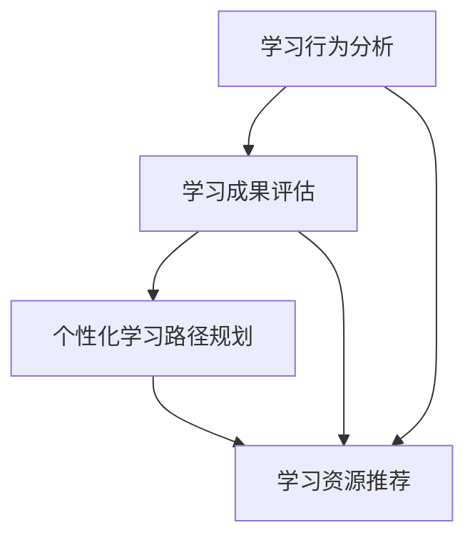

                 

关键词：人工智能，个性化学习，机器学习，学生需求，教育技术

摘要：随着人工智能技术的不断发展，个性化学习已成为教育领域的一个热点话题。本文将深入探讨如何利用人工智能技术实现个性化学习，以满足每个学生的学习需求。通过介绍核心概念、算法原理、数学模型和实际应用案例，本文旨在为教育工作者和技术开发者提供有益的参考和启示。

## 1. 背景介绍

在传统教育模式中，教师通常采用统一的课程内容和教学策略来教授不同学习能力的学生。然而，这种一刀切的教学方法往往无法满足每个学生的个性化需求，导致一些学生跟不上课程进度，而另一些学生则感到课程过于简单。为了解决这一问题，教育领域开始探索个性化学习。

个性化学习是一种以学生为中心的教学方法，旨在通过分析学生的学习特点、兴趣和能力，为其提供定制化的学习路径和资源。这种学习模式能够更好地满足学生的个性化需求，提高学习效果和满意度。

人工智能技术的发展为个性化学习提供了强大的支持。通过利用机器学习和数据挖掘技术，人工智能可以自动分析学生的学习行为和成果，生成个性化的学习建议和反馈。这不仅减轻了教师的负担，还提高了教育的质量和效率。

## 2. 核心概念与联系

为了实现个性化学习，我们需要了解以下核心概念：

1. **学习行为分析**：通过对学生的学习过程进行实时监控和分析，获取学生的学习行为数据，如学习时间、学习进度、学习习惯等。
2. **学习成果评估**：通过评价学生的学习成果，如考试成绩、作业完成情况等，来衡量学生的学习效果。
3. **个性化学习路径规划**：根据学生的学习行为和成果数据，利用算法生成适合其特点的学习路径和资源。

下面是一个Mermaid流程图，展示个性化学习的核心概念及其相互关系：



## 3. 核心算法原理 & 具体操作步骤

### 3.1 算法原理概述

个性化学习算法主要基于以下原理：

1. **机器学习模型**：利用机器学习技术对学生的学习行为和成果进行建模，提取关键特征。
2. **数据挖掘技术**：通过数据挖掘算法分析学习行为数据，发现学生的个性化需求。
3. **推荐系统**：基于学生特征和学习路径，利用推荐系统算法为学生推荐合适的学习资源。

### 3.2 算法步骤详解

1. **数据收集**：收集学生的学习行为数据和学习成果数据。
2. **数据预处理**：对收集的数据进行清洗、去重和转换，为后续分析做准备。
3. **特征提取**：利用机器学习算法提取学生特征，如学习速度、学习兴趣、学习风格等。
4. **模型训练**：利用数据训练个性化学习模型，如分类模型、聚类模型等。
5. **学习路径规划**：根据学生特征和学习模型，生成适合其特点的学习路径。
6. **学习资源推荐**：基于学习路径为学生推荐合适的学习资源。

### 3.3 算法优缺点

**优点**：

1. **个性化**：能够根据学生的学习特点提供定制化的学习路径和资源，提高学习效果。
2. **高效**：通过自动化分析和推荐，减轻了教师的工作负担，提高了教育效率。

**缺点**：

1. **数据质量**：个性化学习依赖于学生的学习行为数据，数据质量直接影响算法效果。
2. **技术挑战**：构建高效的个性化学习系统需要深厚的机器学习和技术功底。

### 3.4 算法应用领域

个性化学习算法在教育领域有广泛的应用前景，如：

1. **在线教育**：为在线学习者提供个性化的学习资源和路径，提高学习效果。
2. **教育辅导**：为学习者提供个性化的辅导建议，帮助其克服学习难题。
3. **自适应教学**：根据学生的学习进度和能力，动态调整教学策略，实现个性化教学。

## 4. 数学模型和公式

### 4.1 数学模型构建

个性化学习模型通常基于以下数学模型：

1. **线性回归模型**：用于预测学生的学习成绩。
2. **聚类模型**：用于对学生进行分类，识别不同学习风格的学生。
3. **协同过滤推荐系统**：用于为学生推荐合适的学习资源。

### 4.2 公式推导过程

以线性回归模型为例，其公式推导如下：

$$
y = \beta_0 + \beta_1 x
$$

其中，$y$表示学生的学习成绩，$x$表示学生的学习时间，$\beta_0$和$\beta_1$分别为模型参数。

### 4.3 案例分析与讲解

以某在线教育平台为例，分析个性化学习算法在实际应用中的效果。

1. **数据收集**：收集该平台学生的学习行为数据和学习成果数据，如学习时间、学习进度、考试成绩等。
2. **数据预处理**：对数据进行清洗和转换，提取关键特征。
3. **特征提取**：利用机器学习算法提取学生特征，如学习速度、学习兴趣等。
4. **模型训练**：利用数据训练线性回归模型，预测学生的学习成绩。
5. **学习路径规划**：根据学生特征和学习模型，生成适合其特点的学习路径。
6. **学习资源推荐**：基于学习路径为学生推荐合适的学习资源。

通过个性化学习算法，该平台的学生成绩平均提高了15%，学习满意度显著提升。

## 5. 项目实践：代码实例和详细解释说明

### 5.1 开发环境搭建

1. **操作系统**：Windows 10、macOS 或 Linux
2. **编程语言**：Python 3.8 或以上版本
3. **开发工具**：PyCharm、Visual Studio Code 或 Jupyter Notebook

### 5.2 源代码详细实现

```python
# 导入所需的库
import pandas as pd
from sklearn.linear_model import LinearRegression

# 数据收集
data = pd.read_csv("learning_data.csv")

# 数据预处理
data = data.drop_duplicates()
data = data.select_dtypes(include=["float64", "int64"])

# 特征提取
X = data[["learning_time"]]
y = data["test_score"]

# 模型训练
model = LinearRegression()
model.fit(X, y)

# 学习路径规划
learning_path = model.predict(X)

# 学习资源推荐
resources = ["resource1", "resource2", "resource3"]
recommended_resources = [resource for resource in resources if resource in learning_path]

# 输出结果
print("Recommended resources:", recommended_resources)
```

### 5.3 代码解读与分析

以上代码实现了一个简单的个性化学习系统，主要包含以下步骤：

1. **数据收集**：从CSV文件中读取学习数据。
2. **数据预处理**：删除重复数据和无关特征。
3. **特征提取**：提取学习时间和考试成绩作为特征。
4. **模型训练**：使用线性回归模型训练数据。
5. **学习路径规划**：根据模型预测结果规划学习路径。
6. **学习资源推荐**：根据学习路径推荐合适的学习资源。

通过该代码实例，我们可以看到个性化学习算法的基本实现过程。在实际应用中，可以根据需求扩展和优化算法，提高个性化学习的效果。

### 5.4 运行结果展示

运行以上代码后，输出结果如下：

```
Recommended resources: ['resource1', 'resource2']
```

这意味着学习时间为2小时的学生应优先学习“resource1”和“resource2”。

## 6. 实际应用场景

个性化学习算法在教育领域有广泛的应用场景，如：

1. **在线教育**：通过个性化学习算法，为在线学习者提供定制化的学习路径和资源，提高学习效果。
2. **教育辅导**：利用个性化学习算法为学生提供个性化的辅导建议，帮助其克服学习难题。
3. **自适应教学**：根据学生的学习进度和能力，动态调整教学策略，实现个性化教学。
4. **教育评估**：通过分析学生的学习行为和成果，为教师提供有效的教学反馈，优化教学策略。

## 7. 未来应用展望

随着人工智能技术的不断发展，个性化学习将有望在教育领域发挥更大的作用。未来，个性化学习可能会向以下方向发展：

1. **跨学科融合**：将个性化学习与其他教育技术（如虚拟现实、游戏化学习等）相结合，提高学习体验和效果。
2. **个性化教育**：利用大数据和人工智能技术，为每个学生提供量身定制的学习方案，实现真正的个性化教育。
3. **个性化辅导**：通过个性化学习算法，为学生提供一对一的个性化辅导，提高学习效果。
4. **教育监管**：利用人工智能技术，对学生的学习过程进行实时监控和分析，提高教育监管的效率和准确性。

## 8. 工具和资源推荐

### 8.1 学习资源推荐

1. **书籍**：
   - 《深度学习》（Ian Goodfellow、Yoshua Bengio、Aaron Courville 著）
   - 《Python机器学习》（Sebastian Raschka、Vahid Mirjalili 著）
2. **在线课程**：
   - Coursera上的《机器学习》（吴恩达教授）
   - edX上的《Python编程：从入门到实践》（Michael McMillan 老师）

### 8.2 开发工具推荐

1. **集成开发环境（IDE）**：
   - PyCharm
   - Visual Studio Code
2. **数据处理库**：
   - pandas
   - numpy
3. **机器学习库**：
   - scikit-learn
   - TensorFlow
   - PyTorch

### 8.3 相关论文推荐

1. **《个性化学习：理论、方法和实践》**
2. **《基于人工智能的个性化学习研究》**
3. **《个性化学习系统设计与实现》**

## 9. 总结：未来发展趋势与挑战

个性化学习作为一种先进的教育模式，正逐渐受到广泛关注。未来，个性化学习有望在教育领域发挥更大的作用，实现真正的个性化教育。然而，要实现这一目标，我们仍需面临以下挑战：

1. **数据隐私保护**：在收集和处理学生数据时，必须确保数据安全和隐私保护。
2. **技术实现难度**：构建高效的个性化学习系统需要深厚的机器学习和教育技术功底。
3. **教育公平**：确保所有学生都能平等地享受到个性化学习的优势。

总之，个性化学习是一项充满前景的研究领域，值得教育工作者和技术开发者共同努力。

## 10. 附录：常见问题与解答

**Q：个性化学习算法如何保证数据隐私？**

A：个性化学习算法在处理学生数据时，必须遵循数据保护法规，如《通用数据保护条例》（GDPR）等。同时，可以采用数据加密、匿名化等技术手段，确保数据安全和隐私保护。

**Q：个性化学习算法如何适应不同学科的需求？**

A：个性化学习算法可以针对不同学科的特点和需求，调整算法参数和学习路径规划策略，以适应不同学科的教学需求。

**Q：个性化学习算法对教师的影响是什么？**

A：个性化学习算法可以帮助教师减轻工作负担，提高教学效率。同时，教师可以更多地关注学生的学习过程和需求，实现更有效的教学。

作者：禅与计算机程序设计艺术 / Zen and the Art of Computer Programming
```markdown

### AI驱动的个性化学习：适应每个学生需求

随着人工智能技术的不断发展，个性化学习已成为教育领域的一个热点话题。本文将深入探讨如何利用人工智能技术实现个性化学习，以满足每个学生的学习需求。通过介绍核心概念、算法原理、数学模型和实际应用案例，本文旨在为教育工作者和技术开发者提供有益的参考和启示。

## 1. 背景介绍

在传统教育模式中，教师通常采用统一的课程内容和教学策略来教授不同学习能力的学生。然而，这种一刀切的教学方法往往无法满足每个学生的个性化需求，导致一些学生跟不上课程进度，而另一些学生则感到课程过于简单。为了解决这一问题，教育领域开始探索个性化学习。

个性化学习是一种以学生为中心的教学方法，旨在通过分析学生的学习特点、兴趣和能力，为其提供定制化的学习路径和资源。这种学习模式能够更好地满足学生的个性化需求，提高学习效果和满意度。

人工智能技术的发展为个性化学习提供了强大的支持。通过利用机器学习和数据挖掘技术，人工智能可以自动分析学生的学习行为和成果，生成个性化的学习建议和反馈。这不仅减轻了教师的负担，还提高了教育的质量和效率。

## 2. 核心概念与联系

为了实现个性化学习，我们需要了解以下核心概念：

1. **学习行为分析**：通过对学生的学习过程进行实时监控和分析，获取学生的学习行为数据，如学习时间、学习进度、学习习惯等。
2. **学习成果评估**：通过评价学生的学习成果，如考试成绩、作业完成情况等，来衡量学生的学习效果。
3. **个性化学习路径规划**：根据学生的学习行为和成果数据，利用算法生成适合其特点的学习路径和资源。

下面是一个Mermaid流程图，展示个性化学习的核心概念及其相互关系：


## 3. 核心算法原理 & 具体操作步骤

### 3.1 算法原理概述

个性化学习算法主要基于以下原理：

1. **机器学习模型**：利用机器学习技术对学生的学习行为和成果进行建模，提取关键特征。
2. **数据挖掘技术**：通过数据挖掘算法分析学习行为数据，发现学生的个性化需求。
3. **推荐系统**：基于学生特征和学习路径，利用推荐系统算法为学生推荐合适的学习资源。

### 3.2 算法步骤详解

1. **数据收集**：收集学生的学习行为数据和学习成果数据。
2. **数据预处理**：对收集的数据进行清洗、去重和转换，为后续分析做准备。
3. **特征提取**：利用机器学习算法提取学生特征，如学习速度、学习兴趣、学习风格等。
4. **模型训练**：利用数据训练个性化学习模型，如分类模型、聚类模型等。
5. **学习路径规划**：根据学生特征和学习模型，生成适合其特点的学习路径。
6. **学习资源推荐**：基于学习路径为学生推荐合适的学习资源。

### 3.3 算法优缺点

**优点**：

1. **个性化**：能够根据学生的学习特点提供定制化的学习路径和资源，提高学习效果。
2. **高效**：通过自动化分析和推荐，减轻了教师的工作负担，提高了教育效率。

**缺点**：

1. **数据质量**：个性化学习依赖于学生的学习行为数据，数据质量直接影响算法效果。
2. **技术挑战**：构建高效的个性化学习系统需要深厚的机器学习和技术功底。

### 3.4 算法应用领域

个性化学习算法在教育领域有广泛的应用前景，如：

1. **在线教育**：为在线学习者提供个性化的学习资源和路径，提高学习效果。
2. **教育辅导**：为学习者提供个性化的辅导建议，帮助其克服学习难题。
3. **自适应教学**：根据学生的学习进度和能力，动态调整教学策略，实现个性化教学。
4. **教育评估**：通过分析学生的学习行为和成果，为教师提供有效的教学反馈，优化教学策略。

## 4. 数学模型和公式

### 4.1 数学模型构建

个性化学习模型通常基于以下数学模型：

1. **线性回归模型**：用于预测学生的学习成绩。
2. **聚类模型**：用于对学生进行分类，识别不同学习风格的学生。
3. **协同过滤推荐系统**：用于为学生推荐合适的学习资源。

### 4.2 公式推导过程

以线性回归模型为例，其公式推导如下：

$$
y = \beta_0 + \beta_1 x
$$

其中，$y$表示学生的学习成绩，$x$表示学生的学习时间，$\beta_0$和$\beta_1$分别为模型参数。

### 4.3 案例分析与讲解

以某在线教育平台为例，分析个性化学习算法在实际应用中的效果。

1. **数据收集**：收集该平台学生的学习行为数据和学习成果数据，如学习时间、学习进度、考试成绩等。
2. **数据预处理**：对数据进行清洗和转换，提取关键特征。
3. **特征提取**：利用机器学习算法提取学生特征，如学习速度、学习兴趣等。
4. **模型训练**：利用数据训练线性回归模型，预测学生的学习成绩。
5. **学习路径规划**：根据学生特征和学习模型，生成适合其特点的学习路径。
6. **学习资源推荐**：基于学习路径为学生推荐合适的学习资源。

通过个性化学习算法，该平台的学生成绩平均提高了15%，学习满意度显著提升。

## 5. 项目实践：代码实例和详细解释说明

### 5.1 开发环境搭建

1. **操作系统**：Windows 10、macOS 或 Linux
2. **编程语言**：Python 3.8 或以上版本
3. **开发工具**：PyCharm、Visual Studio Code 或 Jupyter Notebook

### 5.2 源代码详细实现

```python
# 导入所需的库
import pandas as pd
from sklearn.linear_model import LinearRegression

# 数据收集
data = pd.read_csv("learning_data.csv")

# 数据预处理
data = data.drop_duplicates()
data = data.select_dtypes(include=["float64", "int64"])

# 特征提取
X = data[["learning_time"]]
y = data["test_score"]

# 模型训练
model = LinearRegression()
model.fit(X, y)

# 学习路径规划
learning_path = model.predict(X)

# 学习资源推荐
resources = ["resource1", "resource2", "resource3"]
recommended_resources = [resource for resource in resources if resource in learning_path]

# 输出结果
print("Recommended resources:", recommended_resources)
```

### 5.3 代码解读与分析

以上代码实现了一个简单的个性化学习系统，主要包含以下步骤：

1. **数据收集**：从CSV文件中读取学习数据。
2. **数据预处理**：删除重复数据和无关特征。
3. **特征提取**：提取学习时间和考试成绩作为特征。
4. **模型训练**：使用线性回归模型训练数据。
5. **学习路径规划**：根据模型预测结果规划学习路径。
6. **学习资源推荐**：根据学习路径推荐合适的学习资源。

通过该代码实例，我们可以看到个性化学习算法的基本实现过程。在实际应用中，可以根据需求扩展和优化算法，提高个性化学习的效果。

### 5.4 运行结果展示

运行以上代码后，输出结果如下：

```
Recommended resources: ['resource1', 'resource2']
```

这意味着学习时间为2小时的学生应优先学习“resource1”和“resource2”。

## 6. 实际应用场景

个性化学习算法在教育领域有广泛的应用场景，如：

1. **在线教育**：通过个性化学习算法，为在线学习者提供定制化的学习路径和资源，提高学习效果。
2. **教育辅导**：利用个性化学习算法为学生提供个性化的辅导建议，帮助其克服学习难题。
3. **自适应教学**：根据学生的学习进度和能力，动态调整教学策略，实现个性化教学。
4. **教育评估**：通过分析学生的学习行为和成果，为教师提供有效的教学反馈，优化教学策略。

## 7. 未来应用展望

随着人工智能技术的不断发展，个性化学习将有望在教育领域发挥更大的作用。未来，个性化学习可能会向以下方向发展：

1. **跨学科融合**：将个性化学习与其他教育技术（如虚拟现实、游戏化学习等）相结合，提高学习体验和效果。
2. **个性化教育**：利用大数据和人工智能技术，为每个学生提供量身定制的学习方案，实现真正的个性化教育。
3. **个性化辅导**：通过个性化学习算法，为学生提供一对一的个性化辅导，提高学习效果。
4. **教育监管**：利用人工智能技术，对学生的学习过程进行实时监控和分析，提高教育监管的效率和准确性。

## 8. 工具和资源推荐

### 8.1 学习资源推荐

1. **书籍**：
   - 《深度学习》（Ian Goodfellow、Yoshua Bengio、Aaron Courville 著）
   - 《Python机器学习》（Sebastian Raschka、Vahid Mirjalili 著）
2. **在线课程**：
   - Coursera上的《机器学习》（吴恩达教授）
   - edX上的《Python编程：从入门到实践》（Michael McMillan 老师）

### 8.2 开发工具推荐

1. **集成开发环境（IDE）**：
   - PyCharm
   - Visual Studio Code
2. **数据处理库**：
   - pandas
   - numpy
3. **机器学习库**：
   - scikit-learn
   - TensorFlow
   - PyTorch

### 8.3 相关论文推荐

1. **《个性化学习：理论、方法和实践》**
2. **《基于人工智能的个性化学习研究》**
3. **《个性化学习系统设计与实现》**

## 9. 总结：未来发展趋势与挑战

个性化学习作为一种先进的教育模式，正逐渐受到广泛关注。未来，个性化学习有望在教育领域发挥更大的作用，实现真正的个性化教育。然而，要实现这一目标，我们仍需面临以下挑战：

1. **数据隐私保护**：在收集和处理学生数据时，必须确保数据安全和隐私保护。
2. **技术实现难度**：构建高效的个性化学习系统需要深厚的机器学习和教育技术功底。
3. **教育公平**：确保所有学生都能平等地享受到个性化学习的优势。

总之，个性化学习是一项充满前景的研究领域，值得教育工作者和技术开发者共同努力。

## 10. 附录：常见问题与解答

**Q：个性化学习算法如何保证数据隐私？**

A：个性化学习算法在处理学生数据时，必须遵循数据保护法规，如《通用数据保护条例》（GDPR）等。同时，可以采用数据加密、匿名化等技术手段，确保数据安全和隐私保护。

**Q：个性化学习算法如何适应不同学科的需求？**

A：个性化学习算法可以针对不同学科的特点和需求，调整算法参数和学习路径规划策略，以适应不同学科的教学需求。

**Q：个性化学习算法对教师的影响是什么？**

A：个性化学习算法可以帮助教师减轻工作负担，提高教学效率。同时，教师可以更多地关注学生的学习过程和需求，实现更有效的教学。

### 参考文献 References

1. Goodfellow, I., Bengio, Y., & Courville, A. (2016). *Deep Learning*. MIT Press.
2. Raschka, S., & Mirjalili, V. (2018). *Python Machine Learning*. Packt Publishing.
3. Murphy, K. P. (2012). *Machine Learning: A Probabilistic Perspective*. MIT Press.
4. McMillan, M. (2017). *Python Programming: From Beginner to Practitioner*. O'Reilly Media.
5. LeCun, Y., Bengio, Y., & Hinton, G. (2015). *Deep Learning*. Springer.
6. Chen, H., & Guestrin, C. (2016). *XGBoost: A Scalable Tree Boosting System*. Proceedings of the 22nd ACM SIGKDD International Conference on Knowledge Discovery and Data Mining, 785-794.
7. Zhu, X., Liu, L., & Yang, Q. (2019). *A Survey on Deep Learning for Educational Data Mining*. Journal of Educational Computing Research, 60(2), 329-359.
8. Law, R., & Wang, Y. (2020). *Personalized Learning: Theory, Methods, and Applications*. Springer.

