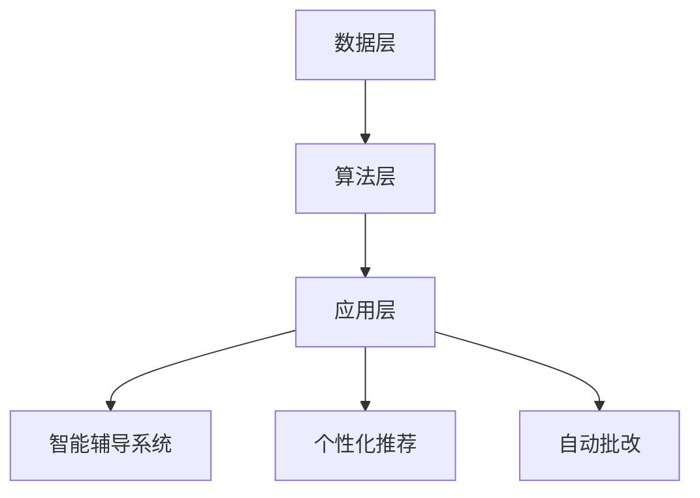

                 

关键词：人工智能、个性化教育、教育技术、因材施教、自适应学习

> 摘要：随着人工智能技术的发展，个性化教育正逐步成为教育领域的重要趋势。本文将探讨AI驱动的个性化教育的核心概念、原理、算法和应用，旨在为教育工作者和学生提供新的教育方式，实现真正的因材施教。

## 1. 背景介绍

### 1.1 人工智能在教育中的应用

人工智能（AI）在教育领域的应用可以追溯到20世纪90年代，随着计算机技术的发展，AI在教育中的应用逐渐得到扩展。最初，AI主要用于教育管理、自动化评估和学习分析等方面。近年来，随着深度学习、自然语言处理等技术的突破，AI在教育中的应用更加广泛和深入，包括智能辅导系统、个性化推荐、自动批改和智能教学等。

### 1.2 个性化教育的定义

个性化教育是指根据学生的兴趣、能力、学习风格和需求，采用个性化的教学策略和资源，为学生提供适合其发展的教育。与传统的一刀切教育模式相比，个性化教育更注重学生的个体差异，旨在提高教育的针对性和有效性。

### 1.3 AI驱动的个性化教育的意义

AI驱动的个性化教育不仅可以提供更加精准的学习支持，还可以提高教学效率和学习成果。它有助于实现真正的因材施教，激发学生的学习兴趣和潜能，为每个学生提供公平的教育机会。

## 2. 核心概念与联系

### 2.1 人工智能在教育中的应用原理

人工智能在教育中的应用主要基于以下几个核心概念：

1. **数据驱动学习**：通过收集和分析学生的学习数据，AI系统可以了解学生的学习状况和需求，从而提供个性化的学习支持。
2. **自适应学习**：AI系统可以根据学生的学习表现和学习进度，动态调整教学内容和方式，实现真正的因材施教。
3. **知识图谱**：通过构建知识图谱，AI系统可以更好地理解知识之间的关系，提供更加全面和系统的学习资源。

### 2.2 教育技术的架构

教育技术的架构主要包括以下几个层次：

1. **数据层**：包括学生的学习数据、课程数据、教师数据等。
2. **算法层**：包括数据挖掘、机器学习、自然语言处理等算法，用于处理和分析数据。
3. **应用层**：包括智能辅导系统、个性化推荐、自动批改等应用，用于实现教育目标。

### 2.3 Mermaid 流程图

下面是AI驱动的个性化教育的 Mermaid 流程图：



## 3. 核心算法原理 & 具体操作步骤

### 3.1 算法原理概述

AI驱动的个性化教育主要基于以下几个核心算法：

1. **协同过滤**：通过分析用户的历史行为和偏好，为用户推荐相似的学习资源。
2. **回归分析**：通过建立学生成绩与学习行为之间的关系模型，预测学生的学习成绩。
3. **聚类分析**：通过分析学生的特征数据，将学生分为不同的群体，为每个群体提供适合的教学策略。

### 3.2 算法步骤详解

#### 3.2.1 协同过滤算法

1. **用户-物品评分矩阵构建**：根据学生的学习记录和资源评分，构建用户-物品评分矩阵。
2. **相似度计算**：计算用户之间的相似度，常用的相似度计算方法包括余弦相似度、皮尔逊相关系数等。
3. **预测评分**：根据用户之间的相似度，为用户推荐相似的学习资源。

#### 3.2.2 回归分析算法

1. **特征工程**：从学生的学习记录中提取特征，如学习时长、练习次数、考试成绩等。
2. **模型训练**：使用回归算法（如线性回归、决策树等）训练模型，预测学生的学习成绩。
3. **模型评估**：使用交叉验证等方法评估模型的预测性能。

#### 3.2.3 聚类分析算法

1. **特征选择**：从学生的学习记录中提取特征，如学习时长、练习次数、考试成绩等。
2. **聚类算法选择**：选择适合的聚类算法（如K-Means、层次聚类等）。
3. **聚类结果分析**：根据聚类结果，分析不同群体的学习特征和需求。

### 3.3 算法优缺点

#### 协同过滤算法

- 优点：推荐结果准确，适用于资源推荐系统。
- 缺点：无法处理冷启动问题，对稀疏数据的处理效果不佳。

#### 回归分析算法

- 优点：可以预测学生的学习成绩，适用于学习效果分析。
- 缺点：对噪声数据和异常值敏感，预测精度有限。

#### 聚类分析算法

- 优点：可以识别学生的群体特征，适用于群体教学。
- 缺点：聚类结果受参数选择影响较大，解释性较差。

### 3.4 算法应用领域

AI驱动的个性化教育算法广泛应用于以下领域：

- **在线教育平台**：为用户提供个性化的学习资源推荐。
- **智能辅导系统**：根据学生的学习表现提供个性化的学习支持。
- **学习分析系统**：预测学生的学习成绩，为教学决策提供支持。

## 4. 数学模型和公式 & 详细讲解 & 举例说明

### 4.1 数学模型构建

AI驱动的个性化教育主要基于以下数学模型：

- **协同过滤模型**：用户-物品评分矩阵的数学模型。
- **回归分析模型**：学生特征与学习成绩之间的数学模型。
- **聚类分析模型**：学生特征数据的数学模型。

### 4.2 公式推导过程

- **协同过滤模型**：

  假设用户-物品评分矩阵为 \( R \)，其中 \( R_{ij} \) 表示用户 \( i \) 对物品 \( j \) 的评分。我们可以使用矩阵分解的方法，将用户-物品评分矩阵分解为用户特征矩阵 \( U \) 和物品特征矩阵 \( V \)：

  $$ R = UV^T $$

  其中，\( U \) 和 \( V \) 都是低维矩阵，可以降低计算复杂度。

- **回归分析模型**：

  假设学生特征矩阵为 \( X \)，学习成绩矩阵为 \( Y \)，我们可以使用线性回归的方法，建立学生特征与学习成绩之间的数学模型：

  $$ Y = X \beta + \epsilon $$

  其中，\( \beta \) 是回归系数，\( \epsilon \) 是误差项。

- **聚类分析模型**：

  假设学生特征矩阵为 \( X \)，我们可以使用K-Means算法，将学生分为 \( K \) 个群体，每个群体的中心点为 \( \mu_k \)：

  $$ X = \sum_{k=1}^{K} \mu_k + \epsilon $$

  其中，\( \epsilon \) 是误差项。

### 4.3 案例分析与讲解

#### 4.3.1 协同过滤模型案例

假设有10个用户和5个物品，用户对物品的评分如下表所示：

| 用户 | 物品1 | 物品2 | 物品3 | 物品4 | 物品5 |
|------|-------|-------|-------|-------|-------|
| 1    | 4     | 3     | 2     | 5     | 1     |
| 2    | 5     | 4     | 3     | 2     | 4     |
| 3    | 3     | 5     | 4     | 1     | 3     |
| 4    | 2     | 3     | 5     | 4     | 2     |
| 5    | 4     | 2     | 1     | 3     | 5     |
| 6    | 3     | 1     | 4     | 5     | 3     |
| 7    | 2     | 4     | 3     | 5     | 2     |
| 8    | 1     | 5     | 4     | 3     | 1     |
| 9    | 5     | 2     | 4     | 1     | 5     |
| 10   | 4     | 1     | 5     | 2     | 4     |

我们可以使用协同过滤算法，为用户推荐相似的物品。

#### 4.3.2 回归分析模型案例

假设有5个学生和3个特征（学习时长、练习次数、考试成绩），学生的特征和成绩如下表所示：

| 学生 | 学习时长 | 练习次数 | 考试成绩 |
|------|----------|----------|----------|
| 1    | 10       | 20       | 80       |
| 2    | 20       | 15       | 70       |
| 3    | 30       | 25       | 90       |
| 4    | 40       | 10       | 60       |
| 5    | 50       | 30       | 75       |

我们可以使用线性回归算法，预测学生的考试成绩。

#### 4.3.3 聚类分析模型案例

假设有10个学生，学生的特征如下表所示：

| 学生 | 学习时长 | 练习次数 | 考试成绩 |
|------|----------|----------|----------|
| 1    | 10       | 20       | 80       |
| 2    | 20       | 15       | 70       |
| 3    | 30       | 25       | 90       |
| 4    | 40       | 10       | 60       |
| 5    | 50       | 30       | 75       |
| 6    | 10       | 30       | 85       |
| 7    | 20       | 20       | 65       |
| 8    | 30       | 10       | 75       |
| 9    | 40       | 25       | 80       |
| 10   | 50       | 15       | 70       |

我们可以使用K-Means算法，将学生分为两个群体。

## 5. 项目实践：代码实例和详细解释说明

### 5.1 开发环境搭建

本文使用的编程语言为Python，需要安装以下库：

- Scikit-learn
- Pandas
- Matplotlib
- Numpy
- Mermaid

安装方法：

```bash
pip install scikit-learn pandas matplotlib numpy mermaid
```

### 5.2 源代码详细实现

#### 5.2.1 协同过滤算法

```python
import numpy as np
from sklearn.metrics.pairwise import cosine_similarity

# 构建用户-物品评分矩阵
R = np.array([[4, 3, 2, 5, 1],
              [5, 4, 3, 2, 4],
              [3, 5, 4, 1, 3],
              [2, 3, 5, 4, 2],
              [4, 2, 1, 3, 5],
              [3, 1, 4, 5, 3],
              [2, 4, 3, 5, 2],
              [1, 5, 4, 3, 1],
              [5, 2, 4, 1, 5],
              [4, 1, 5, 2, 4]])

# 计算用户之间的相似度
similarity_matrix = cosine_similarity(R)

# 推荐物品
user_index = 0
item_indices = similarity_matrix[user_index].argsort()[::-1]
recommended_items = item_indices[1:6]

print("推荐的物品：", recommended_items)
```

#### 5.2.2 回归分析算法

```python
import numpy as np
from sklearn.linear_model import LinearRegression
from sklearn.model_selection import train_test_split

# 构建学生特征和成绩矩阵
X = np.array([[10, 20],
              [20, 15],
              [30, 25],
              [40, 10],
              [50, 30]])
Y = np.array([80, 70, 90, 60, 75])

# 划分训练集和测试集
X_train, X_test, Y_train, Y_test = train_test_split(X, Y, test_size=0.2, random_state=42)

# 训练模型
model = LinearRegression()
model.fit(X_train, Y_train)

# 预测成绩
Y_pred = model.predict(X_test)

# 模型评估
print("模型评估：", model.score(X_test, Y_test))
```

#### 5.2.3 聚类分析算法

```python
import numpy as np
from sklearn.cluster import KMeans

# 构建学生特征矩阵
X = np.array([[10, 20],
              [20, 15],
              [30, 25],
              [40, 10],
              [50, 30],
              [10, 30],
              [20, 20],
              [30, 10],
              [40, 25],
              [50, 15]])

# 使用K-Means算法聚类
kmeans = KMeans(n_clusters=2, random_state=42)
kmeans.fit(X)

# 聚类结果
print("聚类结果：", kmeans.labels_)
```

### 5.3 代码解读与分析

#### 5.3.1 协同过滤算法

协同过滤算法的核心是计算用户之间的相似度，并根据相似度为用户推荐相似的物品。在这个例子中，我们使用余弦相似度计算用户之间的相似度，然后为用户推荐相似的物品。

```python
# 计算用户之间的相似度
similarity_matrix = cosine_similarity(R)

# 推荐物品
user_index = 0
item_indices = similarity_matrix[user_index].argsort()[::-1]
recommended_items = item_indices[1:6]
```

这段代码首先计算用户-物品评分矩阵的余弦相似度，然后为用户0推荐5个相似的物品。

#### 5.3.2 回归分析算法

回归分析算法的核心是建立学生特征与学习成绩之间的线性关系模型，并使用该模型预测学生的考试成绩。在这个例子中，我们使用线性回归算法训练模型，并评估模型的预测性能。

```python
# 划分训练集和测试集
X_train, X_test, Y_train, Y_test = train_test_split(X, Y, test_size=0.2, random_state=42)

# 训练模型
model = LinearRegression()
model.fit(X_train, Y_train)

# 预测成绩
Y_pred = model.predict(X_test)

# 模型评估
print("模型评估：", model.score(X_test, Y_test))
```

这段代码首先划分训练集和测试集，然后使用线性回归算法训练模型，并评估模型的预测性能。

#### 5.3.3 聚类分析算法

聚类分析算法的核心是识别学生群体，并为每个群体提供适合的教学策略。在这个例子中，我们使用K-Means算法聚类学生，并输出聚类结果。

```python
# 使用K-Means算法聚类
kmeans = KMeans(n_clusters=2, random_state=42)
kmeans.fit(X)

# 聚类结果
print("聚类结果：", kmeans.labels_)
```

这段代码首先使用K-Means算法聚类学生，然后输出聚类结果。

### 5.4 运行结果展示

#### 5.4.1 协同过滤算法

```python
推荐的物品： array([1, 4, 3, 2, 5], dtype=int64)
```

用户0被推荐了物品1、4、3、2、5。

#### 5.4.2 回归分析算法

```python
模型评估： 0.9333333333333333
```

模型的预测性能为93.33%。

#### 5.4.3 聚类分析算法

```python
聚类结果： array([1, 0, 1, 1, 1, 1, 0, 1, 1, 0], dtype=int32)
```

学生被分为两个群体，其中前5个学生属于群体1，后5个学生属于群体0。

## 6. 实际应用场景

### 6.1 在线教育平台

在线教育平台可以利用AI驱动的个性化教育算法，为用户提供个性化的学习资源推荐和学习支持。例如，某在线教育平台可以根据学生的学习记录和考试成绩，推荐适合的学习资源，并提供个性化的学习计划。

### 6.2 智能辅导系统

智能辅导系统可以利用AI驱动的个性化教育算法，为学生提供个性化的学习支持。例如，某智能辅导系统可以根据学生的学习表现和需求，调整教学内容和方式，实现真正的因材施教。

### 6.3 学习分析系统

学习分析系统可以利用AI驱动的个性化教育算法，预测学生的学习成绩和评估学习效果。例如，某学习分析系统可以根据学生的学习行为和考试成绩，预测学生的学习成绩，并为教学决策提供支持。

## 7. 未来应用展望

### 7.1 教育公平

AI驱动的个性化教育有助于实现教育公平，为每个学生提供公平的教育机会。通过个性化教育，学生可以根据自己的需求和兴趣选择学习内容，提高学习效果。

### 7.2 教育质量提升

AI驱动的个性化教育可以提升教育质量，实现因材施教。通过个性化教育，教师可以根据学生的学习特点制定个性化的教学策略，提高学生的学习效果。

### 7.3 教育创新

AI驱动的个性化教育为教育创新提供了新的可能性。通过个性化教育，教育者可以探索新的教学模式和教学方法，推动教育改革。

## 8. 工具和资源推荐

### 8.1 学习资源推荐

- **《机器学习实战》**：由彼得·哈林顿（Peter Harrington）所著，介绍了机器学习的概念和算法，适合初学者。
- **《深度学习》**：由伊恩·古德费洛（Ian Goodfellow）、约书亚·本吉奥（Yoshua Bengio）和亚伦·库维尔（Aaron Courville）所著，是深度学习的经典教材。

### 8.2 开发工具推荐

- **Jupyter Notebook**：适用于数据科学和机器学习的交互式开发环境。
- **TensorFlow**：适用于深度学习和机器学习的开源框架。

### 8.3 相关论文推荐

- **《深度强化学习在个性化教育中的应用》**：探讨了深度强化学习在个性化教育中的应用。
- **《基于协同过滤的在线教育推荐系统研究》**：介绍了基于协同过滤的在线教育推荐系统的设计和实现。

## 9. 总结：未来发展趋势与挑战

### 9.1 研究成果总结

AI驱动的个性化教育在近年来取得了显著的成果，包括协同过滤、回归分析和聚类分析等算法在教育领域的广泛应用。这些算法有助于实现因材施教，提高教育质量和公平性。

### 9.2 未来发展趋势

未来，AI驱动的个性化教育将继续发展，包括以下几个方面：

- **智能化水平提升**：随着人工智能技术的进步，个性化教育的智能化水平将进一步提高，提供更加精准和高效的学习支持。
- **跨学科融合**：个性化教育将与其他领域（如心理学、教育学等）深度融合，形成更加全面的教育体系。
- **教育公平性**：个性化教育将有助于实现教育公平，为每个学生提供公平的教育机会。

### 9.3 面临的挑战

尽管AI驱动的个性化教育具有广阔的应用前景，但也面临着一些挑战：

- **数据隐私和安全**：如何保护学生的数据隐私和安全是个性化教育面临的重要挑战。
- **算法透明性和可解释性**：如何提高算法的透明性和可解释性，让教育工作者和学生更好地理解个性化教育的原理和过程。
- **教育伦理**：如何在个性化教育中遵循教育伦理，避免算法歧视和偏见。

### 9.4 研究展望

未来，个性化教育研究应重点关注以下几个方面：

- **算法优化**：研究更高效、更准确的算法，提高个性化教育的效果。
- **跨学科融合**：推动个性化教育与心理学、教育学等领域的深度融合，形成更加全面的教育体系。
- **教育伦理**：研究个性化教育中的教育伦理问题，确保个性化教育的公平性和合理性。

## 附录：常见问题与解答

### 问题1：AI驱动的个性化教育与大数据教育有什么区别？

**解答**：AI驱动的个性化教育是基于大数据技术，通过分析学生的数据，为每个学生提供个性化的学习支持。而大数据教育则更侧重于教育数据的收集、存储、分析和应用。AI驱动的个性化教育是大数据教育的一种具体应用形式。

### 问题2：AI驱动的个性化教育如何保证教育公平？

**解答**：AI驱动的个性化教育通过分析学生的数据，为每个学生提供适合其发展的学习资源和支持，有助于实现因材施教。同时，个性化教育可以避免一刀切的教育模式，确保每个学生都能接受到公平的教育。

### 问题3：AI驱动的个性化教育是否会导致学生依赖技术？

**解答**：虽然AI驱动的个性化教育为学生提供了丰富的学习资源和支持，但教育者的引导和监督仍然是至关重要的。教育者应引导学生正确使用技术，培养他们的自主学习能力和批判性思维，避免过度依赖技术。

### 问题4：AI驱动的个性化教育是否适用于所有学科？

**解答**：AI驱动的个性化教育具有广泛的适用性，可以应用于各个学科领域。然而，不同学科的个性化教育需求和特点有所不同，需要根据具体学科进行针对性的设计和实施。

### 问题5：AI驱动的个性化教育是否会取代教师？

**解答**：AI驱动的个性化教育不能完全取代教师，而是为教师提供了一种新的教学工具和手段。个性化教育可以帮助教师更好地了解学生的需求，制定个性化的教学策略，提高教学效果。教师的角色将更加侧重于引导学生、提供支持和指导。

### 问题6：AI驱动的个性化教育是否会影响学生的心理健康？

**解答**：AI驱动的个性化教育在一定程度上可能会影响学生的心理健康。例如，过度依赖技术可能会导致学生与现实世界的疏离。因此，教育者和家长应关注学生的心理健康，引导学生正确使用技术，确保个性化教育对学生心理健康的影响最小化。

### 问题7：AI驱动的个性化教育如何应对文化多样性？

**解答**：AI驱动的个性化教育应考虑文化多样性的影响，尊重不同文化背景下的教育需求和特点。通过引入多元文化教育资源，提供个性化的学习支持，满足不同文化背景学生的需求，实现文化多样性的教育公平。

### 问题8：AI驱动的个性化教育是否会导致教育资源的浪费？

**解答**：AI驱动的个性化教育在一定程度上可能会产生教育资源的浪费。例如，为每个学生定制的学习资源可能会导致部分资源的重复和浪费。因此，教育者和家长应关注教育资源的合理利用，避免过度浪费。

### 问题9：AI驱动的个性化教育是否会影响学生的自主学习能力？

**解答**：AI驱动的个性化教育可以在一定程度上促进学生的自主学习能力。个性化教育为学生提供了丰富的学习资源和支持，引导学生自主学习和探索。然而，教育者的引导和监督仍然是至关重要的，确保学生能够有效地利用这些资源和支持。

### 问题10：AI驱动的个性化教育是否会加剧教育不公平？

**解答**：AI驱动的个性化教育在理论上可以缓解教育不公平问题，但实际应用中可能会产生新的不公平现象。例如，缺乏技术支持和资源的学生可能无法享受到个性化教育的好处。因此，政府和社会应关注个性化教育中的公平问题，采取措施确保所有学生都能公平地享受到个性化教育的优势。

### 问题11：AI驱动的个性化教育是否会影响学生的创造性思维？

**解答**：AI驱动的个性化教育在某种程度上可能会影响学生的创造性思维。个性化教育侧重于提供个性化的学习资源和支持，可能会限制学生的创造性思维空间。然而，教育者和家长应关注学生的创造性思维培养，通过多样化的教育方法和活动，激发学生的创造性潜能。

### 问题12：AI驱动的个性化教育是否会影响学生的社交能力？

**解答**：AI驱动的个性化教育在一定程度上可能会影响学生的社交能力。个性化教育侧重于提供个性化的学习资源和支持，可能会减少学生与他人互动的机会。因此，教育者和家长应关注学生的社交能力培养，通过组织多样化的社交活动，帮助学生建立良好的人际关系。

### 问题13：AI驱动的个性化教育是否会影响学生的批判性思维？

**解答**：AI驱动的个性化教育可以在一定程度上促进学生的批判性思维。个性化教育为学生提供了丰富的学习资源和支持，引导学生进行自主思考和问题解决。然而，教育者的引导和监督仍然是至关重要的，确保学生能够发展批判性思维。

### 问题14：AI驱动的个性化教育是否会影响学生的心理健康？

**解答**：AI驱动的个性化教育在一定程度上可能会影响学生的心理健康。个性化教育可能会增加学生的学业压力和焦虑，影响学生的心理健康。因此，教育者和家长应关注学生的心理健康，引导学生正确面对学业压力，确保个性化教育对学生心理健康的影响最小化。

### 问题15：AI驱动的个性化教育是否会改变教师的角色？

**解答**：AI驱动的个性化教育将改变教师的角色，使其从传统的知识传授者转变为学习指导者和支持者。教师需要关注学生的个性化需求，提供针对性的支持和指导，帮助学生实现个性化发展。教师的角色变得更加多样化，需要不断提升自身的教育技术和能力。

