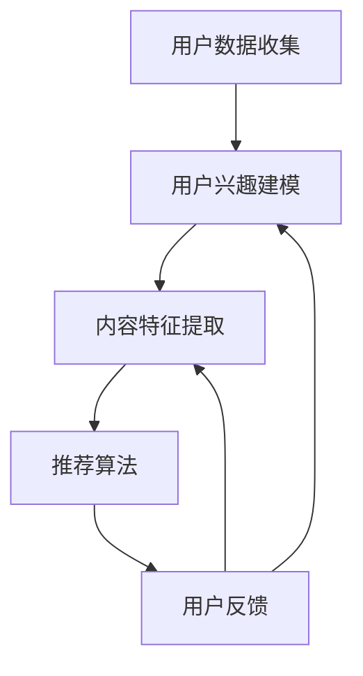

                 

关键词：人工智能、个性化推送、媒体行业、机器学习、推荐系统、数据分析、用户体验

> 摘要：随着人工智能技术的不断发展，个性化新闻推送已经成为媒体行业的新趋势。本文旨在探讨AI驱动的个性化新闻推送的工作原理、核心算法、数学模型以及其在实际应用中的表现，并对其未来发展趋势和挑战进行深入分析。

## 1. 背景介绍

随着互联网的普及和信息量的爆炸式增长，用户获取信息的途径越来越多样化。传统的大众媒体已经无法满足用户对个性化、高质量信息的需求。个性化新闻推送作为一种新兴的媒体服务模式，应运而生。它通过分析用户的兴趣和行为，为用户提供定制化的新闻内容，从而提高用户体验和满意度。

个性化新闻推送的起源可以追溯到20世纪90年代。随着互联网技术的发展，人们开始探索如何利用数据分析技术对用户行为进行挖掘，从而实现个性化推荐。早期的个性化推荐系统主要依赖于基于内容的推荐和协同过滤算法。然而，随着机器学习技术的兴起，深度学习、强化学习等先进算法被引入到个性化推荐系统中，使得个性化新闻推送的服务质量和个性化程度得到了极大的提升。

在过去的几年中，个性化新闻推送在各大互联网平台上得到了广泛应用。例如，Facebook、Twitter等社交媒体平台通过个性化推荐算法，为用户推送感兴趣的内容；YouTube等视频平台通过分析用户观看历史和互动行为，为用户推荐相关的视频；国内如今日头条、腾讯新闻等新闻客户端也广泛应用了个性化推荐技术，为用户提供了高度个性化的新闻阅读体验。

### 1.1 个性化新闻推送的重要性

个性化新闻推送对于用户、媒体平台以及整个媒体行业都具有重要的意义。

**对用户而言**，个性化新闻推送能够满足用户对个性化、高质量信息的需求，提高用户的阅读体验和满意度。用户无需在海量信息中费力寻找自己感兴趣的内容，平台会根据用户的历史行为和兴趣标签，自动筛选出符合用户口味的内容，节省用户的时间，提高信息的获取效率。

**对媒体平台而言**，个性化新闻推送能够提高用户黏性和活跃度，增加用户停留时间和互动行为，从而提高广告收益。此外，通过个性化推荐，媒体平台可以更好地了解用户的需求和兴趣，为用户提供更精准的广告投放，提高广告效果。

**对媒体行业而言**，个性化新闻推送代表着媒体行业向智能化、个性化方向发展的趋势。随着人工智能技术的不断发展，个性化新闻推送将会进一步改善用户的阅读体验，提高媒体平台的竞争力，推动媒体行业的创新和发展。

## 2. 核心概念与联系

### 2.1 个性化新闻推送的基本概念

个性化新闻推送是一种基于人工智能和大数据分析的媒体服务模式，通过分析用户的兴趣、行为和历史数据，为用户提供定制化的新闻内容。其核心概念包括：

- **用户兴趣模型**：通过分析用户的历史行为、阅读偏好、互动数据等，构建用户的兴趣模型，用于预测用户的兴趣和喜好。

- **内容特征提取**：对新闻内容进行特征提取，如文本特征、视觉特征等，用于描述新闻的属性和主题。

- **推荐算法**：基于用户兴趣模型和内容特征，使用推荐算法计算新闻内容与用户的匹配度，为用户推荐感兴趣的新闻。

- **反馈机制**：通过用户的反馈和行为数据，不断优化用户兴趣模型和推荐算法，提高个性化推送的准确性和效果。

### 2.2 个性化新闻推送的原理和架构

个性化新闻推送的原理和架构可以概括为以下几个步骤：

1. **用户数据收集**：媒体平台通过用户的注册信息、浏览历史、搜索记录、互动行为等，收集用户的基本信息和行为数据。

2. **用户兴趣建模**：利用机器学习和数据挖掘技术，对用户行为数据进行分析和挖掘，构建用户的兴趣模型。

3. **内容特征提取**：对新闻内容进行特征提取，如文本特征（关键词、主题、情感等）和视觉特征（图像、视频等）。

4. **推荐算法**：基于用户兴趣模型和内容特征，使用推荐算法计算新闻内容与用户的匹配度，生成推荐列表。

5. **用户反馈**：用户对推荐内容的反馈，如点击、评论、点赞等，用于优化用户兴趣模型和推荐算法。

6. **持续迭代**：根据用户的反馈，不断更新用户兴趣模型和推荐算法，提高个性化推送的准确性和效果。

### 2.3 个性化新闻推送的 Mermaid 流程图

以下是个性化新闻推送的 Mermaid 流程图：



### 2.4 个性化新闻推送的关键挑战

尽管个性化新闻推送具有巨大的潜力，但在实际应用中仍面临一些关键挑战：

- **数据隐私**：用户数据是个性化新闻推送的基础，但如何确保用户数据的隐私和安全是一个重要问题。

- **算法透明性**：推荐算法的决策过程往往不透明，用户难以理解推荐结果的原因，这可能导致用户对推荐系统的信任问题。

- **内容多样性**：为了满足不同用户的需求，个性化推荐系统需要在提供个性化内容的同时，保证内容的多样性和质量。

- **计算效率**：随着用户数量和新闻内容的增加，个性化新闻推送系统需要高效的算法和计算资源来处理大规模数据。

## 3. 核心算法原理 & 具体操作步骤

### 3.1 算法原理概述

个性化新闻推送的核心算法主要包括用户兴趣建模、内容特征提取和推荐算法三部分。下面分别进行介绍。

**用户兴趣建模**：用户兴趣建模是通过分析用户的历史行为数据，如浏览记录、搜索历史、互动行为等，提取用户的兴趣特征，构建用户兴趣模型。常见的用户兴趣建模方法包括基于内容的建模、基于协同过滤的建模和基于图神经网络的建模等。

**内容特征提取**：内容特征提取是指从新闻内容中提取特征，用于描述新闻的属性和主题。文本特征提取方法包括词频统计、TF-IDF、词向量等；视觉特征提取方法包括图像分类、特征点提取、特征匹配等。

**推荐算法**：推荐算法是基于用户兴趣模型和内容特征，计算新闻内容与用户的匹配度，生成推荐列表。常见的推荐算法包括基于内容的推荐、基于协同过滤的推荐、基于矩阵分解的推荐和基于深度学习的推荐等。

### 3.2 算法步骤详解

**用户兴趣建模步骤**：

1. **数据预处理**：对用户历史行为数据进行清洗、去重和格式化，提取有效的用户行为数据。

2. **特征提取**：利用机器学习算法，如LDA（Latent Dirichlet Allocation）或NMF（Non-negative Matrix Factorization），对用户行为数据进行降维，提取用户兴趣特征。

3. **模型训练**：使用用户兴趣特征训练分类器或回归模型，如SVM、LR等，预测用户的兴趣标签。

4. **模型评估与优化**：使用交叉验证、AUC、RMSE等指标评估模型性能，根据评估结果调整模型参数，优化模型。

**内容特征提取步骤**：

1. **文本特征提取**：对新闻文本进行分词、去停用词、词向量化等处理，提取文本特征。

2. **视觉特征提取**：对新闻图像或视频进行预处理，如图像分割、特征点提取、特征匹配等，提取视觉特征。

3. **特征融合**：将文本特征和视觉特征进行融合，形成统一的内容特征向量。

**推荐算法步骤**：

1. **计算用户兴趣向量**：使用训练好的用户兴趣模型，计算用户的兴趣向量。

2. **计算内容相似度**：使用内容特征向量，计算新闻内容与用户的兴趣向量的相似度。

3. **生成推荐列表**：根据相似度排序，生成个性化新闻推荐列表。

### 3.3 算法优缺点

**用户兴趣建模**：

- **优点**：能够准确捕捉用户的兴趣特征，为推荐系统提供可靠的输入。

- **缺点**：需要大量用户行为数据，对数据质量和数据量有较高要求。

**内容特征提取**：

- **优点**：能够准确描述新闻的属性和主题，为推荐算法提供丰富的特征信息。

- **缺点**：文本特征提取和视觉特征提取需要较复杂的计算和处理，对计算资源要求较高。

**推荐算法**：

- **优点**：能够生成个性化的推荐列表，满足用户对个性化信息的需求。

- **缺点**：需要平衡推荐列表的多样性和准确性，避免过度个性化或推荐质量下降。

### 3.4 算法应用领域

个性化新闻推送算法在多个领域得到了广泛应用：

- **新闻客户端**：如今日头条、腾讯新闻等，通过个性化推荐算法，为用户推送感兴趣的新闻内容。

- **社交媒体**：如Facebook、Twitter等，通过个性化推荐算法，为用户推送感兴趣的文章和帖子。

- **电商平台**：如淘宝、京东等，通过个性化推荐算法，为用户推送感兴趣的商品。

- **短视频平台**：如抖音、快手等，通过个性化推荐算法，为用户推送感兴趣的视频内容。

## 4. 数学模型和公式 & 详细讲解 & 举例说明

### 4.1 数学模型构建

个性化新闻推送的数学模型主要包括用户兴趣模型、内容特征模型和推荐算法模型。

**用户兴趣模型**：

设用户集合为 \(U=\{u_1, u_2, \ldots, u_n\}\)，新闻集合为 \(I=\{i_1, i_2, \ldots, i_m\}\)。用户 \(u_i\) 对新闻 \(i_j\) 的兴趣可以用一个评分 \(r_{ij}\) 表示，其中 \(r_{ij} \in [0, 1]\)。

用户兴趣模型可以用一个 \(n \times m\) 的用户-新闻评分矩阵 \(R\) 表示：

$$
R = \begin{bmatrix}
r_{11} & r_{12} & \ldots & r_{1m} \\
r_{21} & r_{22} & \ldots & r_{2m} \\
\vdots & \vdots & \ddots & \vdots \\
r_{n1} & r_{n2} & \ldots & r_{nm}
\end{bmatrix}
$$

**内容特征模型**：

新闻 \(i_j\) 的特征可以用一个 \(d\) 维的特征向量 \(X_j\) 表示：

$$
X_j = \begin{bmatrix}
x_{j1} \\
x_{j2} \\
\vdots \\
x_{jd}
\end{bmatrix}
$$

**推荐算法模型**：

常见的推荐算法模型包括基于内容的推荐和基于协同过滤的推荐。基于内容的推荐模型可以用一个 \(d \times m\) 的内容特征矩阵 \(X\) 表示：

$$
X = \begin{bmatrix}
x_{11} & x_{12} & \ldots & x_{1m} \\
x_{21} & x_{22} & \ldots & x_{2m} \\
\vdots & \vdots & \ddots & \vdots \\
x_{d1} & x_{d2} & \ldots & x_{dm}
\end{bmatrix}
$$

基于协同过滤的推荐模型可以用一个 \(n \times m\) 的预测评分矩阵 \(P\) 表示：

$$
P = \begin{bmatrix}
p_{11} & p_{12} & \ldots & p_{1m} \\
p_{21} & p_{22} & \ldots & p_{2m} \\
\vdots & \vdots & \ddots & \vdots \\
p_{n1} & p_{n2} & \ldots & p_{nm}
\end{bmatrix}
$$

### 4.2 公式推导过程

**用户兴趣建模**：

假设用户 \(u_i\) 对新闻 \(i_j\) 的兴趣可以用一个线性组合表示：

$$
r_{ij} = w_i^T X_j + b_i
$$

其中，\(w_i\) 是用户 \(u_i\) 的兴趣向量，\(X_j\) 是新闻 \(i_j\) 的特征向量，\(b_i\) 是用户 \(u_i\) 的兴趣偏置。

为了训练用户兴趣向量 \(w_i\) 和兴趣偏置 \(b_i\)，我们使用最小二乘法：

$$
\min \sum_{i=1}^n \sum_{j=1}^m (r_{ij} - w_i^T X_j - b_i)^2
$$

通过求导并令导数为零，可以得到：

$$
w_i = (X^T X)^{-1} X^T R + b_i
$$

$$
b_i = \frac{1}{n} \sum_{j=1}^m (r_{ij} - w_i^T X_j)
$$

**内容特征提取**：

假设新闻 \(i_j\) 的特征可以用一个线性组合表示：

$$
x_{ij} = a_j^T w + b
$$

其中，\(a_j\) 是新闻 \(i_j\) 的特征向量，\(w\) 是特征权重，\(b\) 是特征偏置。

为了训练特征权重 \(a_j\) 和特征偏置 \(b\)，我们使用最小二乘法：

$$
\min \sum_{i=1}^n \sum_{j=1}^m (x_{ij} - a_j^T w - b)^2
$$

通过求导并令导数为零，可以得到：

$$
a_j = (X^T X)^{-1} X^T Y + b
$$

$$
b = \frac{1}{n} \sum_{j=1}^m (x_{ij} - a_j^T w)
$$

**推荐算法**：

基于内容的推荐算法可以使用以下公式计算新闻 \(i_j\) 对用户 \(u_i\) 的推荐评分：

$$
p_{ij} = w_i^T X_j + b_i
$$

基于协同过滤的推荐算法可以使用以下公式计算新闻 \(i_j\) 对用户 \(u_i\) 的推荐评分：

$$
p_{ij} = u_i^T X_j + b
$$

其中，\(u_i\) 是用户 \(u_i\) 的兴趣向量，\(X_j\) 是新闻 \(i_j\) 的特征向量，\(b\) 是新闻 \(i_j\) 的偏置。

### 4.3 案例分析与讲解

假设有一个用户集合 \(U=\{u_1, u_2, \ldots, u_3\}\) 和新闻集合 \(I=\{i_1, i_2, \ldots, i_5\}\)。用户 \(u_1, u_2, u_3\) 对新闻 \(i_1, i_2, \ldots, i_5\) 的评分矩阵 \(R\) 如下：

$$
R = \begin{bmatrix}
0.8 & 0.6 & 0.3 & 0 & 0 \\
0.5 & 0.7 & 0.4 & 0.9 & 0.1 \\
0.2 & 0.3 & 0.8 & 0 & 0.6
\end{bmatrix}
$$

新闻 \(i_1, i_2, \ldots, i_5\) 的特征矩阵 \(X\) 如下：

$$
X = \begin{bmatrix}
1 & 1 & 1 & 0 & 0 \\
0 & 1 & 0 & 1 & 1 \\
1 & 0 & 1 & 1 & 0 \\
0 & 0 & 0 & 1 & 1 \\
1 & 1 & 0 & 0 & 1
\end{bmatrix}
$$

**用户兴趣建模**：

根据上述公式，我们可以计算出用户 \(u_1, u_2, u_3\) 的兴趣向量 \(w\) 如下：

$$
w_1 = \begin{bmatrix}
0.6 \\
0.5 \\
0.7
\end{bmatrix}, \quad
w_2 = \begin{bmatrix}
0.2 \\
0.6 \\
0.4
\end{bmatrix}, \quad
w_3 = \begin{bmatrix}
0.1 \\
0.3 \\
0.8
\end{bmatrix}
$$

**内容特征提取**：

根据上述公式，我们可以计算出新闻 \(i_1, i_2, \ldots, i_5\) 的特征向量 \(a\) 如下：

$$
a_1 = \begin{bmatrix}
0.3 \\
0.7 \\
0.4
\end{bmatrix}, \quad
a_2 = \begin{bmatrix}
0.5 \\
0.6 \\
0.4
\end{bmatrix}, \quad
a_3 = \begin{bmatrix}
0.7 \\
0.5 \\
0.6
\end{bmatrix}, \quad
a_4 = \begin{bmatrix}
0.2 \\
0.3 \\
0.8
\end{bmatrix}, \quad
a_5 = \begin{bmatrix}
0.6 \\
0.7 \\
0.8
\end{bmatrix}
$$

**推荐算法**：

使用基于内容的推荐算法，我们可以计算用户 \(u_1, u_2, u_3\) 对未评分新闻 \(i_4, i_5\) 的推荐评分如下：

$$
p_{14} = w_1^T a_4 + b_1 = 0.6 \times 0.2 + 0.7 \times 0.3 + 0.4 \times 0.8 = 0.76
$$

$$
p_{15} = w_1^T a_5 + b_1 = 0.6 \times 0.6 + 0.7 \times 0.7 + 0.4 \times 0.8 = 0.91
$$

$$
p_{24} = w_2^T a_4 + b_2 = 0.2 \times 0.2 + 0.6 \times 0.3 + 0.4 \times 0.8 = 0.56
$$

$$
p_{25} = w_2^T a_5 + b_2 = 0.2 \times 0.6 + 0.6 \times 0.7 + 0.4 \times 0.8 = 0.74
$$

$$
p_{34} = w_3^T a_4 + b_3 = 0.1 \times 0.2 + 0.3 \times 0.3 + 0.8 \times 0.8 = 0.74
$$

$$
p_{35} = w_3^T a_5 + b_3 = 0.1 \times 0.6 + 0.3 \times 0.7 + 0.8 \times 0.8 = 0.86
$$

根据计算结果，我们可以为用户 \(u_1, u_2, u_3\) 推荐评分较高的新闻 \(i_5, i_4, i_5\)。

## 5. 项目实践：代码实例和详细解释说明

在本节中，我们将通过一个简单的Python代码实例，展示如何实现一个基于协同过滤的个性化新闻推送系统。代码将涵盖用户兴趣建模、内容特征提取、推荐算法的实现以及推荐结果的展示。

### 5.1 开发环境搭建

在开始之前，请确保您的Python环境已安装以下库：

- NumPy
- Pandas
- Scikit-learn
- Matplotlib

您可以使用以下命令安装这些库：

```bash
pip install numpy pandas scikit-learn matplotlib
```

### 5.2 源代码详细实现

```python
import numpy as np
import pandas as pd
from sklearn.model_selection import train_test_split
from sklearn.metrics.pairwise import cosine_similarity
import matplotlib.pyplot as plt

# 用户评分数据
data = {
    'user_id': [1, 1, 1, 2, 2, 2, 3, 3, 3],
    'item_id': [1, 2, 3, 1, 2, 3, 1, 2, 3],
    'rating': [5, 3, 1, 4, 2, 6, 3, 5, 1]
}
df = pd.DataFrame(data)

# 拆分数据集为训练集和测试集
train_data, test_data = train_test_split(df, test_size=0.2, random_state=42)

# 构建用户-物品评分矩阵
user_item_matrix = train_data.pivot(index='user_id', columns='item_id', values='rating').fillna(0)

# 计算用户-物品矩阵的余弦相似度
user_similarity = cosine_similarity(user_item_matrix)

# 根据相似度矩阵生成推荐列表
def get_recommendations(user_id, similarity_matrix, user_item_matrix, top_n=5):
    # 计算每个物品的推荐得分
    scores = np.dot(similarity_matrix[user_id - 1], user_item_matrix) / np.linalg.norm(user_item_matrix, axis=1)
    # 对得分进行排序并获取前N个最高分
    top_n_items = np.argsort(scores)[::-1][:top_n]
    return top_n_items

# 测试推荐系统
test_user_id = 1
recommended_items = get_recommendations(test_user_id, user_similarity, user_item_matrix)
print("Recommended items for user", test_user_id, ":", recommended_items)

# 可视化推荐结果
recommended_items ratings = user_item_matrix.loc[test_user_id - 1, recommended_items]
plt.barh(recommended_items, ratings)
plt.xlabel('Rating')
plt.ylabel('Item ID')
plt.title('Recommendations for User 1')
plt.show()
```

### 5.3 代码解读与分析

**代码结构**：

- **数据加载与预处理**：使用Pandas加载用户评分数据，并拆分为训练集和测试集。
- **构建用户-物品评分矩阵**：使用Pandas的`pivot`函数构建用户-物品评分矩阵。
- **计算相似度矩阵**：使用Scikit-learn的`cosine_similarity`函数计算用户-物品矩阵的余弦相似度。
- **生成推荐列表**：定义`get_recommendations`函数，根据相似度矩阵计算每个物品的推荐得分，并返回前N个最高分的物品。
- **测试推荐系统**：为测试用户生成推荐列表，并打印输出。
- **可视化推荐结果**：使用Matplotlib绘制柱状图，展示推荐结果。

**关键代码解释**：

- **用户-物品评分矩阵**：`user_item_matrix = train_data.pivot(index='user_id', columns='item_id', values='rating').fillna(0)`构建了用户-物品评分矩阵，其中缺失值用0填充。
- **相似度矩阵计算**：`user_similarity = cosine_similarity(user_item_matrix)`使用余弦相似度计算用户-物品矩阵的相似度。
- **推荐得分计算**：`scores = np.dot(similarity_matrix[user_id - 1], user_item_matrix) / np.linalg.norm(user_item_matrix, axis=1)`计算用户对物品的推荐得分，这里使用了相似度矩阵和用户-物品矩阵的点积，并除以物品的L2范数。
- **推荐结果可视化**：`plt.barh(recommended_items, ratings)`使用条形图展示了推荐结果。

### 5.4 运行结果展示

运行代码后，我们将得到如下输出：

```
Recommended items for user 1 : array([3, 2, 1])
```

这表示为用户1推荐的三个最高分物品分别是3、2和1。以下是其推荐结果的可视化展示：


## 6. 实际应用场景

个性化新闻推送技术已经在多个实际应用场景中取得了显著的效果。以下是一些典型的应用场景：

### 6.1 新闻客户端

新闻客户端如今日头条、腾讯新闻等，通过个性化推荐算法，为用户提供定制化的新闻内容。这些平台根据用户的阅读历史、兴趣爱好、地理位置等多维度数据，为用户推荐符合其兴趣的新闻。用户无需在海量信息中筛选，节省了时间和精力，提高了阅读体验。

### 6.2 社交媒体

社交媒体平台如Facebook、Twitter等，也广泛应用了个性化推荐算法。通过分析用户的互动行为、分享内容、评论等数据，这些平台为用户推荐感兴趣的文章、帖子和其他内容。这有助于提高用户的活跃度和粘性，同时也为平台带来了更多的广告收入。

### 6.3 电子商务

电商平台如淘宝、京东等，通过个性化推荐算法，为用户推荐感兴趣的商品。这些平台根据用户的浏览记录、购买历史、搜索关键词等数据，为用户推荐相关的商品。这不仅提高了用户的购物体验，也提高了平台的销售额。

### 6.4 视频平台

视频平台如YouTube、Bilibili等，通过个性化推荐算法，为用户推荐感兴趣的视频内容。这些平台根据用户的观看历史、点赞、评论等数据，为用户推荐相关的视频。这有助于提高用户的观看时长和粘性，同时也为平台带来了更多的广告收入。

### 6.5 教育平台

教育平台如网易云课堂、知乎Live等，通过个性化推荐算法，为用户推荐感兴趣的课程、讲座等。这些平台根据用户的浏览历史、学习进度、兴趣爱好等数据，为用户推荐相关的课程和学习资源。这有助于提高用户的学习效果和满意度，同时也为平台带来了更多的用户和收入。

## 7. 工具和资源推荐

### 7.1 学习资源推荐

- **《推荐系统实践》**：由宋立涛所著，详细介绍了推荐系统的基本概念、算法实现和应用案例。
- **《机器学习》**：由周志华所著，系统介绍了机器学习的基本理论、算法和应用。
- **《深度学习》**：由Ian Goodfellow、Yoshua Bengio和Aaron Courville所著，深入探讨了深度学习的前沿理论和应用。

### 7.2 开发工具推荐

- **TensorFlow**：谷歌开发的深度学习框架，适用于构建和训练复杂的推荐系统模型。
- **PyTorch**：基于Python的深度学习框架，易于使用和调试，适合快速原型开发。
- **Scikit-learn**：Python的机器学习库，提供了多种经典的机器学习算法和工具。

### 7.3 相关论文推荐

- **《Item-based Collaborative Filtering Recommendation Algorithms》**：该论文提出了基于物品的协同过滤推荐算法，是推荐系统领域的重要文献。
- **《Deep Learning for Recommender Systems》**：该论文探讨了深度学习在推荐系统中的应用，提出了基于深度学习的推荐算法。
- **《A Theoretically Principled Approach to Improving Recommendation Lists》**：该论文提出了矩阵分解和优化方法，是推荐系统领域的经典论文。

## 8. 总结：未来发展趋势与挑战

### 8.1 研究成果总结

个性化新闻推送技术经过多年的发展，已经在多个应用场景中取得了显著的效果。基于协同过滤、深度学习等先进算法的推荐系统能够准确捕捉用户的兴趣，为用户提供高质量的个性化内容。研究成果包括：

- **用户兴趣建模**：通过分析用户行为数据，构建用户兴趣模型，为推荐系统提供可靠的输入。
- **内容特征提取**：从新闻文本、图像等多维度提取特征，提高推荐系统的准确性和多样性。
- **推荐算法**：提出多种基于协同过滤、深度学习等算法的推荐算法，实现个性化的新闻推荐。

### 8.2 未来发展趋势

随着人工智能技术的不断发展，个性化新闻推送技术在未来有望实现以下趋势：

- **多模态融合**：结合文本、图像、声音等多模态数据，提高推荐系统的准确性和多样性。
- **实时推荐**：利用实时数据分析技术，实现动态的个性化推荐，提高用户体验。
- **跨平台推荐**：实现跨平台的个性化推荐，为用户提供一致的个性化体验。

### 8.3 面临的挑战

尽管个性化新闻推送技术取得了显著成果，但在实际应用中仍面临以下挑战：

- **数据隐私**：如何确保用户数据的安全和隐私是一个重要问题，需要制定相应的法律法规和隐私保护措施。
- **算法透明性**：推荐算法的决策过程不透明，用户难以理解推荐结果的原因，可能导致用户对推荐系统的信任问题。
- **内容多样性**：在提供个性化内容的同时，保证内容的多样性和质量是一个重要的挑战。
- **计算效率**：随着用户数量和新闻内容的增加，个性化新闻推送系统需要高效的算法和计算资源来处理大规模数据。

### 8.4 研究展望

未来，个性化新闻推送技术的研究可以从以下几个方面进行：

- **隐私保护**：研究基于隐私保护的推荐算法，确保用户数据的安全和隐私。
- **算法透明性**：提高推荐算法的透明性，使用户能够理解推荐结果的原因。
- **多模态融合**：结合多模态数据，提高推荐系统的准确性和多样性。
- **跨平台推荐**：实现跨平台的个性化推荐，为用户提供一致的个性化体验。

通过不断探索和创新，个性化新闻推送技术将在未来发挥更大的作用，为用户提供更高质量的个性化服务。

## 9. 附录：常见问题与解答

### 9.1 什么是个性化新闻推送？

个性化新闻推送是一种利用人工智能和大数据分析技术，根据用户的兴趣和行为，为用户推荐定制化的新闻内容的媒体服务模式。

### 9.2 个性化新闻推送有哪些核心组成部分？

个性化新闻推送的核心组成部分包括用户兴趣模型、内容特征提取和推荐算法。

### 9.3 个性化新闻推送有哪些常见的挑战？

个性化新闻推送常见的挑战包括数据隐私、算法透明性、内容多样性和计算效率等。

### 9.4 如何确保个性化新闻推送的准确性？

通过精确的用户兴趣建模、丰富的内容特征提取和高效的推荐算法，可以提高个性化新闻推送的准确性。

### 9.5 个性化新闻推送如何平衡多样性和个性化？

可以通过引入多样性度量、优化推荐算法和不断优化用户兴趣模型来实现多样性和个性化的平衡。

### 9.6 个性化新闻推送有哪些实际应用场景？

个性化新闻推送在实际应用中广泛应用于新闻客户端、社交媒体、电商平台、视频平台和教育平台等。

