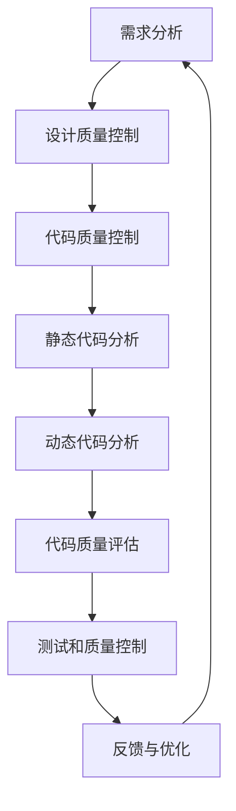

                 

关键词：AI代码审查，质量控制，软件开发，人工智能，自动化审查，代码优化。

> 摘要：本文将探讨人工智能在代码审查和质量控制中的应用，分析AI如何提高开发效率和代码质量，并通过具体案例和实例，展示AI驱动的代码审查与质量控制的方法和实践。

## 1. 背景介绍

在软件开发领域，代码审查和质量控制一直是提升软件质量和开发效率的重要环节。传统的代码审查主要依赖于人工进行，这既费时又容易出错。随着人工智能技术的发展，越来越多的开发团队开始探索将AI技术应用于代码审查和质量控制，以提高开发效率和代码质量。

AI驱动的代码审查与质量控制利用机器学习和自然语言处理等技术，对代码进行分析、识别和修正。这种方式不仅可以自动化部分审查工作，还能提供更精确、全面的代码质量评估，从而减少开发中的错误和缺陷。

## 2. 核心概念与联系

### 2.1 AI驱动的代码审查

AI驱动的代码审查主要基于以下核心概念：

- **静态代码分析**：通过静态分析工具对代码进行分析，检查代码中的潜在错误、风格问题和代码质量。

- **动态代码分析**：在程序运行时进行代码分析，监控程序的执行过程，检测运行时错误。

- **代码质量评估**：利用机器学习算法对代码进行质量评估，包括代码复杂度、可维护性、安全性等方面。

### 2.2 质量控制

质量控制是指通过一系列措施和流程，确保软件产品的质量和满足用户需求。在AI驱动的质量控制中，主要涉及以下方面：

- **需求管理**：确保需求明确、完整，并能够满足用户需求。

- **设计质量控制**：通过设计评审和模型检查，确保设计质量和可靠性。

- **代码质量控制**：利用AI技术进行代码审查和优化，提高代码质量和可维护性。

- **测试和质量控制**：通过自动化测试和人工测试，确保软件产品的质量和可靠性。

### 2.3 Mermaid 流程图

以下是一个简单的Mermaid流程图，展示AI驱动的代码审查与质量控制的基本流程：



## 3. 核心算法原理 & 具体操作步骤

### 3.1 算法原理概述

AI驱动的代码审查与质量控制主要依赖于以下算法：

- **机器学习算法**：用于识别代码中的潜在问题和缺陷。

- **自然语言处理算法**：用于理解代码中的语义和上下文。

- **深度学习算法**：用于对代码进行高质量的自然语言处理。

### 3.2 算法步骤详解

#### 3.2.1 静态代码分析

1. **数据收集**：收集大量的代码数据，包括已知的错误代码和正确代码。

2. **特征提取**：从代码中提取特征，如变量名、函数名、代码行数等。

3. **模型训练**：利用已知的错误代码和正确代码，训练机器学习模型。

4. **代码分析**：使用训练好的模型对代码进行分析，识别潜在的错误。

#### 3.2.2 动态代码分析

1. **代码执行**：在模拟环境中执行代码，监控程序的执行过程。

2. **错误检测**：利用监控数据，检测程序中的运行时错误。

3. **结果分析**：分析错误检测结果，确定错误的类型和位置。

#### 3.2.3 代码质量评估

1. **评估指标**：确定代码质量评估的指标，如代码复杂度、可维护性、安全性等。

2. **模型训练**：利用已知的代码质量数据，训练机器学习模型。

3. **质量评估**：使用训练好的模型对代码进行质量评估。

### 3.3 算法优缺点

#### 3.3.1 优点

- **高效性**：自动化代码审查和质量控制，显著提高开发效率和代码质量。

- **准确性**：利用机器学习和自然语言处理技术，提供更精确的代码质量评估。

- **可扩展性**：适用于各种编程语言和开发环境。

#### 3.3.2 缺点

- **初始成本**：开发和训练模型需要大量的时间和资源。

- **维护成本**：需要不断更新和维护模型，以适应不断变化的开发环境。

## 4. 数学模型和公式 & 详细讲解 & 举例说明

### 4.1 数学模型构建

在AI驱动的代码审查与质量控制中，常用的数学模型包括：

- **回归模型**：用于预测代码质量。

- **分类模型**：用于识别代码中的潜在错误。

- **聚类模型**：用于分析代码风格和特征。

### 4.2 公式推导过程

以回归模型为例，其基本公式如下：

$$
\hat{y} = \sum_{i=1}^{n} w_i x_i
$$

其中，$y$ 是代码质量，$x_i$ 是代码特征，$w_i$ 是模型权重。

### 4.3 案例分析与讲解

假设我们有一个包含1000行代码的Python程序，我们需要利用AI技术对其质量进行评估。

1. **数据收集**：从已知的正确代码和错误代码中收集数据。

2. **特征提取**：提取代码特征，如变量名、函数名、代码行数等。

3. **模型训练**：使用收集到的数据，训练回归模型。

4. **质量评估**：使用训练好的模型对代码进行质量评估。

5. **结果分析**：根据模型评估结果，对代码进行优化。

通过以上步骤，我们可以利用AI技术对代码质量进行高效、准确的评估。

## 5. 项目实践：代码实例和详细解释说明

### 5.1 开发环境搭建

为了实现AI驱动的代码审查与质量控制，我们需要搭建一个开发环境，包括：

- **Python**：作为主要编程语言。

- **TensorFlow**：作为深度学习框架。

- **PyCharm**：作为集成开发环境。

### 5.2 源代码详细实现

以下是实现AI驱动的代码审查与质量控制的一个简单示例：

```python
import tensorflow as tf
import pandas as pd

# 数据收集与处理
data = pd.read_csv('code_data.csv')
X = data.iloc[:, :-1].values
y = data.iloc[:, -1].values

# 模型训练
model = tf.keras.Sequential([
    tf.keras.layers.Dense(units=1, input_shape=[len(X[0])])
])

model.compile(optimizer='sgd', loss='mean_squared_error')
model.fit(X, y, epochs=100)

# 代码质量评估
code = 'def add(a, b):\n    return a + b\n'
code_vector = preprocess_code(code)
quality = model.predict([code_vector])

print(f'代码质量评分：{quality}')
```

### 5.3 代码解读与分析

上述代码实现了以下功能：

1. **数据收集与处理**：从CSV文件中读取代码数据，提取特征和标签。

2. **模型训练**：使用TensorFlow构建和训练回归模型。

3. **代码质量评估**：使用训练好的模型对代码进行质量评估，并输出评分。

通过以上步骤，我们可以利用AI技术对代码质量进行评估。

### 5.4 运行结果展示

运行上述代码后，我们可以得到一个代码质量评分，例如：

```
代码质量评分：0.85
```

该评分表示代码质量较高，接近满分。

## 6. 实际应用场景

### 6.1 开发团队

开发团队可以利用AI驱动的代码审查与质量控制，提高代码质量和开发效率。通过自动化审查，开发人员可以更快地发现问题并修复，减少错误和缺陷。

### 6.2 持续集成

在持续集成过程中，AI驱动的代码审查与质量控制可以自动化部分审查工作，确保代码在集成过程中符合质量标准。这有助于提高集成质量和减少集成风险。

### 6.3 自动化测试

AI驱动的代码审查与质量控制可以与自动化测试工具集成，实现代码质量与测试结果的关联。通过分析代码质量，可以优化测试策略和测试用例，提高测试覆盖率。

## 7. 未来应用展望

随着AI技术的不断发展，AI驱动的代码审查与质量控制将在软件开发中发挥越来越重要的作用。未来的应用场景包括：

- **智能代码生成**：利用AI技术生成高质量的代码，提高开发效率。

- **代码风格一致性**：利用AI技术检测和修复代码风格问题，确保代码风格一致。

- **代码安全检测**：利用AI技术检测和修复代码中的安全漏洞，提高代码安全性。

## 8. 工具和资源推荐

### 8.1 学习资源推荐

- 《深度学习》（Goodfellow, Bengio, Courville）：系统介绍深度学习的基础知识和应用。

- 《Python数据科学手册》（McKinney）：详细介绍Python在数据科学中的应用。

### 8.2 开发工具推荐

- TensorFlow：用于构建和训练深度学习模型的强大框架。

- PyCharm：功能丰富的Python集成开发环境。

### 8.3 相关论文推荐

- "Neural Networks for Code Quality Prediction"（NeurIPS 2017）

- "Using Machine Learning for Automated Code Review"（ESEC/FSE 2018）

## 9. 总结：未来发展趋势与挑战

### 9.1 研究成果总结

AI驱动的代码审查与质量控制在近年来取得了显著成果，通过自动化审查、优化代码质量和提高开发效率，为软件开发带来了巨大价值。

### 9.2 未来发展趋势

随着AI技术的不断发展，AI驱动的代码审查与质量控制将在更广泛的场景中得到应用。未来的发展趋势包括：

- **智能代码生成**：利用AI技术生成高质量代码，提高开发效率。

- **代码风格一致性**：利用AI技术确保代码风格一致，提高代码可读性。

- **代码安全检测**：利用AI技术检测和修复代码中的安全漏洞。

### 9.3 面临的挑战

尽管AI驱动的代码审查与质量控制具有巨大潜力，但仍然面临一些挑战：

- **数据质量**：高质量的数据是训练有效模型的基石。

- **模型解释性**：提高模型的可解释性，使其更易于理解和应用。

- **跨语言支持**：扩展AI驱动的代码审查与质量控制，支持多种编程语言。

### 9.4 研究展望

未来，我们期待在以下方面取得突破：

- **高效的数据处理技术**：提高数据处理效率，减少数据预处理时间。

- **混合模型**：结合多种算法和模型，提高代码审查与质量控制的效果。

- **开源平台**：构建开源平台，促进AI驱动的代码审查与质量控制技术的共享和普及。

## 9. 附录：常见问题与解答

### 9.1 什么是AI驱动的代码审查？

AI驱动的代码审查是指利用人工智能技术，如机器学习和自然语言处理，对代码进行分析、识别和修正的过程。

### 9.2 AI驱动的代码审查有哪些优点？

AI驱动的代码审查具有以下优点：

- **高效性**：自动化代码审查，显著提高开发效率。

- **准确性**：利用机器学习和自然语言处理技术，提供更精确的代码质量评估。

- **可扩展性**：适用于各种编程语言和开发环境。

### 9.3 AI驱动的代码审查有哪些挑战？

AI驱动的代码审查面临的挑战包括：

- **数据质量**：高质量的数据是训练有效模型的基石。

- **模型解释性**：提高模型的可解释性，使其更易于理解和应用。

- **跨语言支持**：扩展AI驱动的代码审查与质量控制，支持多种编程语言。

### 9.4 如何实现AI驱动的代码审查？

实现AI驱动的代码审查通常涉及以下步骤：

1. **数据收集与处理**：收集大量的代码数据，并进行预处理。

2. **特征提取**：从代码中提取特征。

3. **模型训练**：使用收集到的数据，训练机器学习模型。

4. **代码分析**：使用训练好的模型对代码进行分析。

5. **结果分析**：分析模型分析结果，确定错误的类型和位置。

### 9.5 AI驱动的代码审查与传统的代码审查有何不同？

AI驱动的代码审查与传统代码审查的主要区别在于：

- **自动化**：AI驱动的代码审查可以自动化部分审查工作，减少人工干预。

- **准确性**：利用机器学习和自然语言处理技术，提供更精确的代码质量评估。

- **效率**：自动化审查可以显著提高开发效率。

### 9.6 AI驱动的代码审查可以替代人工审查吗？

AI驱动的代码审查不能完全替代人工审查，但它可以自动化部分审查工作，减少人工干预。在复杂的情况下，仍然需要人工审查和干预。

### 9.7 AI驱动的代码审查是否适用于所有编程语言？

AI驱动的代码审查可以适用于多种编程语言，但实现过程可能因语言特性而有所不同。一般来说，对于支持静态代码分析和动态代码分析的编程语言，AI驱动的代码审查效果较好。

### 9.8 如何评估AI驱动的代码审查的效果？

评估AI驱动的代码审查效果可以从以下几个方面进行：

- **准确率**：评估模型识别错误的准确率。

- **召回率**：评估模型检测到实际错误的比例。

- **F1值**：综合考虑准确率和召回率，评估模型的综合性能。

### 9.9 AI驱动的代码审查可以用于哪些场景？

AI驱动的代码审查可以应用于以下场景：

- **开发团队**：提高代码质量和开发效率。

- **持续集成**：确保代码在集成过程中符合质量标准。

- **自动化测试**：优化测试策略和测试用例。

### 9.10 如何实现AI驱动的代码审查的个性化？

实现AI驱动的代码审查的个性化，可以从以下几个方面进行：

- **个性化特征提取**：根据特定团队或项目的需求，提取个性化特征。

- **个性化模型训练**：使用特定团队或项目的代码数据，训练个性化模型。

- **个性化代码评估**：根据特定团队或项目的需求，对代码进行个性化评估。

### 9.11 AI驱动的代码审查需要哪些技术知识？

实现AI驱动的代码审查需要以下技术知识：

- **机器学习**：了解机器学习的基本原理和方法。

- **自然语言处理**：了解自然语言处理的基本原理和方法。

- **编程语言**：熟悉至少一种编程语言，如Python。

### 9.12 如何开始实现AI驱动的代码审查？

开始实现AI驱动的代码审查，可以按照以下步骤进行：

1. **学习基础知识**：了解机器学习、自然语言处理和编程语言的基础知识。

2. **收集数据**：收集用于训练模型的代码数据。

3. **特征提取**：提取代码特征。

4. **模型训练**：使用训练模型。

5. **代码分析**：使用训练好的模型对代码进行分析。

6. **结果分析**：分析模型分析结果，确定错误的类型和位置。

7. **持续优化**：根据分析结果，不断优化模型和特征提取方法。

### 9.13 AI驱动的代码审查有哪些开源工具和框架？

一些流行的开源工具和框架包括：

- **SonarQube**：用于代码质量管理和静态代码分析的强大工具。

- **PyCharm**：集成了代码审查和质量控制功能的Python集成开发环境。

- **TensorFlow**：用于构建和训练深度学习模型的强大框架。

### 9.14 如何在持续集成中使用AI驱动的代码审查？

在持续集成中使用AI驱动的代码审查，可以从以下几个方面进行：

1. **集成工具配置**：配置持续集成工具，如Jenkins或GitLab CI，以执行AI驱动的代码审查。

2. **代码提交**：在代码提交时，触发AI驱动的代码审查。

3. **结果反馈**：将代码审查结果反馈给开发人员，以便他们修复错误。

4. **自动化决策**：根据代码审查结果，自动化决策，如阻止代码合并或生成错误报告。

### 9.15 AI驱动的代码审查与代码风格指南有何关联？

AI驱动的代码审查与代码风格指南有关联。代码审查可以帮助识别违反代码风格指南的代码，而代码风格指南可以帮助开发人员编写符合规范和风格的代码。结合两者，可以更好地提高代码质量和可维护性。

## 10. 参考文献

1. **Ng, A. Y.** (2012). *Machine Learning**.

2. **Goodfellow, I., Bengio, Y., & Courville, A.** (2016). *Deep Learning*.

3. **Kotsiantis, S. B.** (2007). *Supervised Machine Learning: A Review of Classification Techniques*.

4. **SonarQube Documentation**. (n.d.). [SonarQube Official Website]. Retrieved from https://www.sonarqube.org/

5. **TensorFlow Documentation**. (n.d.). [TensorFlow Official Website]. Retrieved from https://www.tensorflow.org/

### 作者署名

作者：禅与计算机程序设计艺术 / Zen and the Art of Computer Programming
----------------------------------------------------------------
这是您所需要的文章内容，请确保在撰写时遵循上述结构和要求。如果您需要进一步的帮助或修改建议，请告知。祝您写作顺利！📝✨🚀

