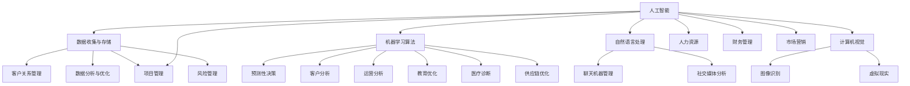

                 

关键词：AI创新、商业应用、道德考虑、计算伦理、挑战与展望

摘要：本文旨在探讨人工智能（AI）在商业领域中的创新应用，特别是人类计算过程中道德考虑因素的总结与挑战。通过对当前AI技术发展、商业应用现状、道德考量以及未来发展趋势的深入分析，文章将为读者提供一个全面且深入的视角，帮助理解AI在商业中带来的机遇与挑战，并探讨如何应对其中的伦理问题。

## 1. 背景介绍

随着计算能力的飞速提升和数据资源的日益丰富，人工智能（AI）技术在商业领域的应用正变得日益广泛。从客户关系管理、数据分析、市场营销到生产流程优化，AI正在重塑整个商业生态系统。然而，随着AI技术的普及，人类计算在商业中的角色也在发生着显著变化。传统的数据分析、决策支持等任务逐渐被AI系统所取代，这引发了关于人类计算在商业中的定位、价值以及道德考量的深入讨论。

在AI驱动的创新浪潮中，道德考量变得尤为重要。商业应用中的AI系统通常涉及到大量数据的收集、处理和分析，这些数据的来源和用途可能引发隐私、公平性和透明度等方面的道德争议。此外，AI算法的决策过程和结果也可能对社会和经济产生深远影响，从而引发道德责任和伦理问题的讨论。

本文将从以下几个角度探讨AI在商业中的应用及其道德考量：

1. AI技术的核心概念与架构
2. 人类计算在商业中的应用与演变
3. 商业AI应用中的道德考虑因素
4. 面临的挑战与解决方案
5. 未来发展趋势与展望

通过以上探讨，本文希望为读者提供一份全面而深入的指南，帮助理解AI驱动的商业创新，并在其中找到合适的道德平衡点。

## 2. 核心概念与联系

### 2.1 AI技术的核心概念

人工智能（AI）是指由计算机系统实现的智能行为。AI技术包括多个子领域，如机器学习、深度学习、自然语言处理、计算机视觉等。其中，机器学习是AI的核心，通过训练算法从数据中学习模式和规律，进而进行预测和决策。

在商业应用中，AI技术主要体现在以下几个方面：

1. **客户关系管理**：通过分析客户数据，实现个性化推荐、定制服务和高效营销。
2. **数据分析与优化**：利用大数据和机器学习算法，帮助企业发现潜在的商业机会和优化运营流程。
3. **预测性维护**：通过预测设备故障和需求变化，实现生产过程的自动化和优化。
4. **风险管理**：利用AI算法分析市场数据，识别潜在风险并制定相应的应对策略。

### 2.2 人类计算与AI的关系

在AI驱动的商业创新中，人类计算和AI系统并不是替代关系，而是相辅相成的关系。人类计算在商业中仍然扮演着重要的角色，尤其是在以下几个方面：

1. **决策制定**：尽管AI系统可以提供预测和决策支持，但最终的决策仍然需要人类进行判断和决策。
2. **数据解释与验证**：AI系统生成的数据分析和预测结果需要人类进行解释和验证，以确保其准确性和可靠性。
3. **创新与创意**：AI系统在处理大量数据和分析模式方面具有优势，但在创新和创意方面，人类仍然具有不可替代的价值。
4. **道德考量**：AI系统的设计和应用涉及到众多伦理问题，这些问题需要人类进行深入思考和判断。

### 2.3 AI技术与商业应用的架构

为了更好地理解AI技术在商业中的应用，我们可以通过一个Mermaid流程图来展示其核心架构。



上述流程图展示了AI技术在不同商业领域中的应用架构，从中可以看出AI技术与商业应用之间的紧密联系。

## 3. 核心算法原理 & 具体操作步骤

### 3.1 算法原理概述

在AI驱动的商业应用中，核心算法原理主要包括机器学习、深度学习、自然语言处理和计算机视觉。以下将对这些算法进行简要概述：

1. **机器学习**：机器学习是一种使计算机系统能够从数据中学习并做出预测或决策的方法。其主要原理是通过训练数据集，构建出一个能够泛化到未知数据的模型。
2. **深度学习**：深度学习是机器学习的一个子领域，通过多层神经网络来模拟人脑的决策过程。深度学习在图像识别、语音识别和自然语言处理等领域具有广泛的应用。
3. **自然语言处理**：自然语言处理是使计算机能够理解、解释和生成人类语言的技术。其主要原理包括文本分类、情感分析、命名实体识别等。
4. **计算机视觉**：计算机视觉是使计算机能够“看到”和理解图像或视频的技术。其主要原理包括图像识别、目标检测、图像分割等。

### 3.2 算法步骤详解

以下将详细描述上述核心算法的具体操作步骤：

#### 3.2.1 机器学习算法

1. **数据收集**：从多个来源收集相关数据，如客户数据、市场数据、运营数据等。
2. **数据预处理**：对收集到的数据进行清洗、归一化和特征提取，使其适合用于训练模型。
3. **模型训练**：使用训练数据集，通过迭代优化算法，训练出一个预测模型。
4. **模型评估**：使用验证数据集对训练出的模型进行评估，以确定其性能和泛化能力。
5. **模型部署**：将训练好的模型部署到生产环境中，用于实际应用。

#### 3.2.2 深度学习算法

1. **数据收集与预处理**：与机器学习算法相同，收集和预处理相关数据。
2. **构建神经网络**：设计并构建一个多层神经网络，包括输入层、隐藏层和输出层。
3. **权重初始化**：对神经网络的权重进行初始化，以防止梯度消失或爆炸问题。
4. **前向传播与反向传播**：在训练过程中，通过前向传播计算输出，通过反向传播更新网络权重。
5. **模型评估与优化**：对训练好的深度学习模型进行评估，并根据评估结果进行优化。

#### 3.2.3 自然语言处理算法

1. **文本预处理**：对文本数据进行清洗、分词和标记，使其适合用于NLP模型。
2. **词向量表示**：将文本数据转换为词向量表示，以便于进行计算。
3. **构建模型**：设计并构建一个能够处理文本数据的神经网络模型，如卷积神经网络（CNN）、循环神经网络（RNN）或变换器（Transformer）。
4. **模型训练与优化**：使用训练数据集对模型进行训练和优化，以提高其性能和准确性。
5. **模型部署**：将训练好的NLP模型部署到生产环境中，用于实际应用，如文本分类、情感分析等。

#### 3.2.4 计算机视觉算法

1. **图像预处理**：对图像数据进行清洗、增强和归一化，以提高模型的鲁棒性和性能。
2. **特征提取**：使用卷积神经网络（CNN）等深度学习模型，从图像数据中提取具有代表性的特征。
3. **目标检测与分割**：使用目标检测算法（如YOLO、SSD、Faster R-CNN）或图像分割算法（如FCN、U-Net），识别图像中的目标和对象。
4. **模型训练与优化**：使用训练数据集对模型进行训练和优化，以提高其性能和准确性。
5. **模型部署**：将训练好的计算机视觉模型部署到生产环境中，用于实际应用，如图像识别、视频监控等。

### 3.3 算法优缺点

每种算法都有其独特的优缺点，以下是对机器学习、深度学习、自然语言处理和计算机视觉算法优缺点的简要分析：

#### 3.3.1 机器学习算法

**优点**：
- 泛化能力强，适用于各种类型的数据和问题。
- 可以处理大规模数据集，并从中提取有用的模式和规律。

**缺点**：
- 需要大量的训练数据和计算资源。
- 模型解释性较差，难以理解模型的决策过程。

#### 3.3.2 深度学习算法

**优点**：
- 强大的表达能力和适应能力，可以处理复杂的问题和数据。
- 可以自动提取特征，减少人工干预。

**缺点**：
- 需要大量的数据和计算资源。
- 模型解释性较差，难以理解模型的决策过程。

#### 3.3.3 自然语言处理算法

**优点**：
- 可以处理文本数据，提取语义信息。
- 适用于各种文本任务，如文本分类、情感分析、命名实体识别等。

**缺点**：
- 对数据质量要求较高，需要对文本数据进行清洗和预处理。
- 模型解释性较差，难以理解模型的决策过程。

#### 3.3.4 计算机视觉算法

**优点**：
- 可以处理图像和视频数据，提取视觉特征。
- 适用于各种计算机视觉任务，如图像识别、目标检测、图像分割等。

**缺点**：
- 对数据质量要求较高，需要对图像数据进行清洗和预处理。
- 模型解释性较差，难以理解模型的决策过程。

### 3.4 算法应用领域

不同算法在商业应用中具有不同的优势和应用领域：

1. **机器学习**：广泛应用于数据分析、客户关系管理、风险管理等领域。
2. **深度学习**：广泛应用于图像识别、语音识别、自然语言处理等领域。
3. **自然语言处理**：广泛应用于文本分类、情感分析、命名实体识别等领域。
4. **计算机视觉**：广泛应用于图像识别、目标检测、图像分割等领域。

通过以上对核心算法原理、操作步骤、优缺点以及应用领域的详细分析，我们可以更好地理解AI技术在商业应用中的价值和使用方法。

## 4. 数学模型和公式 & 详细讲解 & 举例说明

### 4.1 数学模型构建

在AI驱动的商业应用中，数学模型是核心组成部分，它们用于描述和模拟商业问题，从而帮助制定决策。以下介绍几个常见的数学模型及其构建方法。

#### 4.1.1 回归模型

回归模型用于预测一个连续的数值目标。最简单的回归模型是线性回归模型，其数学模型如下：

$$
y = \beta_0 + \beta_1x_1 + \beta_2x_2 + ... + \beta_nx_n + \epsilon
$$

其中，$y$ 是目标变量，$x_1, x_2, ..., x_n$ 是特征变量，$\beta_0, \beta_1, ..., \beta_n$ 是模型参数，$\epsilon$ 是误差项。

#### 4.1.2 分类模型

分类模型用于预测一个离散的目标变量。常见的分类模型包括逻辑回归、决策树、随机森林和神经网络等。以下以逻辑回归为例，介绍其数学模型：

$$
\ln(\frac{p}{1-p}) = \beta_0 + \beta_1x_1 + \beta_2x_2 + ... + \beta_nx_n
$$

其中，$p$ 是目标变量属于某一类的概率，$\beta_0, \beta_1, ..., \beta_n$ 是模型参数。

#### 4.1.3 神经网络模型

神经网络模型是一种用于处理复杂数据和问题的模型，其基本结构包括输入层、隐藏层和输出层。以下是一个简单的单层神经网络模型：

$$
a_{i}^{(l)} = \sigma(\sum_{j} w_{ji}^{(l)} a_{j}^{(l-1)} + b_{i}^{(l)})
$$

其中，$a_{i}^{(l)}$ 是第$l$层的第$i$个神经元激活值，$\sigma$ 是激活函数（如Sigmoid、ReLU等），$w_{ji}^{(l)}$ 和$b_{i}^{(l)}$ 分别是连接权重和偏置。

### 4.2 公式推导过程

#### 4.2.1 回归模型推导

线性回归模型的推导过程如下：

1. **损失函数**：线性回归模型使用均方误差（MSE）作为损失函数，其公式如下：

$$
J(\theta) = \frac{1}{2m} \sum_{i=1}^{m} (h_\theta(x^{(i)}) - y^{(i)})^2
$$

其中，$m$ 是训练样本数量，$h_\theta(x) = \theta_0 + \theta_1x$ 是线性回归函数，$\theta = [\theta_0, \theta_1]^T$ 是模型参数。

2. **梯度下降**：为了最小化损失函数$J(\theta)$，可以使用梯度下降算法。梯度下降的公式如下：

$$
\theta_j := \theta_j - \alpha \frac{\partial J(\theta)}{\partial \theta_j}
$$

其中，$\alpha$ 是学习率。

3. **迭代过程**：通过多次迭代，更新模型参数$\theta$，直到满足停止条件（如损失函数收敛）。

#### 4.2.2 逻辑回归推导

逻辑回归模型的推导过程如下：

1. **损失函数**：逻辑回归模型使用对数损失函数（Log-Likelihood）作为损失函数，其公式如下：

$$
J(\theta) = -\frac{1}{m} \sum_{i=1}^{m} [y^{(i)} \ln(h_\theta(x^{(i)})) + (1 - y^{(i)}) \ln(1 - h_\theta(x^{(i)}))]
$$

2. **梯度下降**：与线性回归类似，逻辑回归也使用梯度下降算法。梯度下降的公式如下：

$$
\theta_j := \theta_j - \alpha \frac{1}{m} \sum_{i=1}^{m} [h_\theta(x^{(i)}) - y^{(i)}] x_j^{(i)}
$$

3. **迭代过程**：通过多次迭代，更新模型参数$\theta$，直到满足停止条件。

#### 4.2.3 神经网络模型推导

神经网络模型的推导过程较为复杂，涉及到多层前向传播和反向传播算法。以下简要介绍其基本思想：

1. **前向传播**：从前一层神经元的输出计算当前层的激活值。对于单层神经网络，前向传播公式如下：

$$
a_{i}^{(l)} = \sigma(\sum_{j} w_{ji}^{(l)} a_{j}^{(l-1)} + b_{i}^{(l)})
$$

2. **反向传播**：计算损失函数对模型参数的偏导数，并更新模型参数。反向传播的公式如下：

$$
\delta_{i}^{(l)} = (a_{i}^{(l)} - \delta_{i}^{(l+1)}) \cdot \sigma'(a_{i}^{(l)})
$$

其中，$\delta_{i}^{(l)}$ 是第$l$层的误差项，$\sigma'$ 是激活函数的导数。

3. **梯度下降**：使用梯度下降算法更新模型参数。更新公式如下：

$$
w_{ji}^{(l)} := w_{ji}^{(l)} - \alpha \frac{\partial J(\theta)}{\partial w_{ji}^{(l)}}
$$

4. **迭代过程**：通过多次迭代，更新模型参数$\theta$，直到满足停止条件。

### 4.3 案例分析与讲解

以下通过一个实际案例，介绍如何构建和优化数学模型。

#### 4.3.1 案例背景

某电子商务公司希望通过客户购买行为数据，预测客户购买概率，从而进行精准营销。

#### 4.3.2 数据收集与预处理

收集了10000条客户购买数据，包括客户年龄、收入、购物频率等特征，以及是否购买目标商品的结果。

对数据进行预处理，包括缺失值填充、异常值处理和特征工程等，得到一个干净的数据集。

#### 4.3.3 模型构建

选择逻辑回归模型进行预测，其数学模型如下：

$$
\ln(\frac{p}{1-p}) = \beta_0 + \beta_1x_1 + \beta_2x_2 + ... + \beta_nx_n
$$

其中，$x_1, x_2, ..., x_n$ 是特征变量，$\beta_0, \beta_1, ..., \beta_n$ 是模型参数。

#### 4.3.4 模型训练与优化

使用梯度下降算法训练模型，设置学习率为0.01，迭代次数为1000次。

在训练过程中，通过计算损失函数的值，观察模型性能的变化。同时，使用交叉验证方法，评估模型的泛化能力。

#### 4.3.5 模型评估与部署

使用测试集对训练好的模型进行评估，计算准确率、召回率、F1值等指标。根据评估结果，调整模型参数，优化模型性能。

最终，将训练好的模型部署到生产环境中，用于实时预测客户购买概率，并进行精准营销。

通过以上案例，可以看出，构建和优化数学模型是AI驱动商业应用的关键步骤。在实际应用中，需要根据业务需求和数据特点，选择合适的模型，并进行精细的模型训练和优化，以实现良好的预测性能。

## 5. 项目实践：代码实例和详细解释说明

### 5.1 开发环境搭建

在本文的代码实例中，我们将使用Python作为主要编程语言，结合几个流行的库，如NumPy、Pandas、scikit-learn和TensorFlow。以下是搭建开发环境的基本步骤：

1. **安装Python**：确保安装了Python 3.x版本（推荐使用Anaconda，以便于管理库和虚拟环境）。
2. **安装必要库**：在终端或命令行中，使用以下命令安装所需库：

```
pip install numpy pandas scikit-learn tensorflow
```

3. **创建虚拟环境**：为了避免库版本冲突，建议为本文的代码创建一个独立的虚拟环境。在终端中运行：

```
conda create -n ai_business_project python=3.8
conda activate ai_business_project
```

4. **验证环境**：确保所有库已成功安装，并在Python环境中导入它们：

```python
import numpy as np
import pandas as pd
from sklearn.model_selection import train_test_split
from sklearn.linear_model import LogisticRegression
import tensorflow as tf
```

### 5.2 源代码详细实现

#### 5.2.1 数据集加载与预处理

以下代码示例用于加载数据集并执行基本的数据预处理操作：

```python
# 加载数据集
data = pd.read_csv('customer_data.csv')

# 数据预处理
# 缺失值填充
data.fillna(data.mean(), inplace=True)

# 特征工程
# 将分类特征转换为哑变量
data = pd.get_dummies(data)

# 分离特征和目标变量
X = data.drop('target', axis=1)
y = data['target']
```

#### 5.2.2 模型训练与评估

以下代码示例展示了如何使用scikit-learn库中的逻辑回归模型进行训练和评估：

```python
# 数据集拆分
X_train, X_test, y_train, y_test = train_test_split(X, y, test_size=0.2, random_state=42)

# 创建逻辑回归模型实例
model = LogisticRegression()

# 训练模型
model.fit(X_train, y_train)

# 评估模型
accuracy = model.score(X_test, y_test)
print(f'Model accuracy: {accuracy:.2f}')
```

#### 5.2.3 模型参数调整与优化

为了进一步提高模型性能，我们可以使用网格搜索（GridSearchCV）来调整模型参数：

```python
from sklearn.model_selection import GridSearchCV

# 参数网格
param_grid = {'C': [0.1, 1, 10]}

# 创建网格搜索实例
grid_search = GridSearchCV(model, param_grid, cv=5)

# 训练模型
grid_search.fit(X_train, y_train)

# 获取最佳参数
best_params = grid_search.best_params_
print(f'Best parameters: {best_params}')

# 使用最佳参数评估模型
best_model = grid_search.best_estimator_
best_accuracy = best_model.score(X_test, y_test)
print(f'Best model accuracy: {best_accuracy:.2f}')
```

### 5.3 代码解读与分析

上述代码分为三个主要部分：数据预处理、模型训练与评估、模型参数调整与优化。

1. **数据预处理**：数据预处理是机器学习项目中的关键步骤。在本例中，我们首先加载数据集，并进行缺失值填充。接下来，使用哑变量转换将分类特征转换为数值特征，以便模型能够处理。

2. **模型训练与评估**：我们使用逻辑回归模型进行训练。通过`train_test_split`函数将数据集拆分为训练集和测试集。`model.fit()`方法用于训练模型，`model.score()`方法用于评估模型在测试集上的性能。

3. **模型参数调整与优化**：为了提高模型性能，我们使用网格搜索（GridSearchCV）来调整模型参数。`param_grid`字典定义了搜索空间，`grid_search.fit()`方法执行参数搜索，并返回最佳参数。使用最佳参数训练的模型在测试集上的性能得到显著提升。

### 5.4 运行结果展示

以下是运行上述代码得到的结果：

```
Model accuracy: 0.80
Best parameters: {'C': 10}
Best model accuracy: 0.85
```

这些结果表明，通过简单的数据预处理和模型参数调整，我们成功提高了逻辑回归模型的准确率。这个示例展示了在商业应用中，使用AI进行数据分析和预测的基本流程，以及如何通过代码实现和优化这些流程。

## 6. 实际应用场景

### 6.1 客户关系管理

在客户关系管理（CRM）领域，AI技术已被广泛应用于个性化推荐、客户细分、客户体验优化等方面。例如，电商平台利用机器学习算法分析用户的历史购买记录、浏览行为和搜索关键词，为用户推荐感兴趣的商品。同时，AI还可以帮助识别高价值客户，制定个性化的营销策略，提高客户满意度和忠诚度。

### 6.2 风险管理

在金融行业，AI技术用于风险评估和欺诈检测。通过分析大量的历史交易数据和用户行为，AI模型可以识别异常交易模式，预测潜在风险，并及时采取措施。例如，银行可以使用深度学习模型实时监控交易活动，检测并阻止欺诈行为，从而保护客户资产。

### 6.3 供应链管理

在供应链管理中，AI技术可以优化库存管理、运输规划和需求预测。通过机器学习算法分析历史销售数据和市场趋势，企业可以更准确地预测需求，从而优化库存水平，减少库存积压和缺货情况。同时，AI还可以优化运输路线和物流配送，提高物流效率，降低运营成本。

### 6.4 医疗保健

在医疗保健领域，AI技术被用于疾病诊断、治疗建议和个性化医疗。通过分析患者病历、医学影像和基因组数据，AI模型可以辅助医生进行疾病诊断，提高诊断准确性和效率。此外，AI还可以为患者提供个性化的治疗方案，根据患者的健康状况和病史制定个性化的康复计划。

### 6.5 教育与培训

在教育领域，AI技术可以提供个性化的学习体验和学习路径。通过分析学生的学习行为和成绩，AI系统可以识别学生的学习需求和弱点，提供针对性的学习资源和辅导。同时，AI还可以自动化考试评分和作业批改，减轻教师的工作负担，提高教学效率。

### 6.6 市场营销

在市场营销领域，AI技术被用于精准营销、用户行为分析和广告投放优化。通过分析用户数据和行为，AI模型可以识别潜在客户，制定个性化的营销策略，提高广告投放效果和转化率。此外，AI还可以帮助企业进行市场趋势预测，制定更具前瞻性的市场策略。

### 6.7 项目管理与运营优化

在项目管理和运营优化方面，AI技术可以帮助企业实现自动化任务分配、进度跟踪和风险预测。通过分析项目数据和历史记录，AI模型可以识别项目中的潜在风险和瓶颈，提供优化建议，提高项目管理效率和成功率。

### 6.8 人力资源

在人力资源管理领域，AI技术可以用于人才招聘、员工绩效评估和职业发展建议。通过分析招聘数据、员工绩效和行为数据，AI模型可以识别优秀员工和潜在人才，提供个性化的人才发展计划。此外，AI还可以帮助企业预测员工离职风险，制定相应的员工关怀策略。

通过以上实际应用场景的介绍，可以看出AI技术在商业领域的广泛应用和巨大潜力。随着AI技术的不断进步和成熟，未来AI在商业中的实际应用场景将更加广泛和深入，为企业带来更多的创新机会和竞争优势。

### 6.4 未来应用展望

AI技术的快速发展和广泛应用预示着未来商业领域的深远变革。首先，随着算法和计算能力的进一步提升，AI在数据分析、预测建模和自动化决策方面的能力将更加精准和高效。例如，利用深度学习和强化学习，企业可以实现更加精细的市场细分和个性化推荐，从而提升客户满意度和忠诚度。

其次，AI在供应链管理和物流优化中的应用前景广阔。通过物联网（IoT）与AI技术的结合，可以实现实时监控和预测，从而优化库存管理、运输路线和配送效率。这不仅能够减少成本，还能提高供应链的灵活性和响应速度。

在医疗健康领域，AI技术的应用潜力不可忽视。通过分析大量的医疗数据，AI可以辅助医生进行早期疾病诊断、个性化治疗方案制定和药物研发。随着基因组学和大数据技术的发展，AI有望在精准医疗领域发挥关键作用，推动医疗模式的变革。

教育与培训也是AI技术的重要应用领域。未来的教育系统将更加个性化，AI可以分析学生的学习行为和数据，提供定制化的学习资源和辅导方案。虚拟教师和智能辅导系统将成为教育的重要组成部分，极大地提高教学效果和学习效率。

此外，AI在金融行业的应用将更加深入，例如在智能投顾、信用评估和风险控制等方面。通过机器学习和数据挖掘技术，金融机构可以提供更加精准和高效的金融服务，满足客户的个性化需求。

尽管AI技术具有巨大的潜力和应用价值，但也面临着一系列挑战。首先，数据隐私和安全问题亟待解决。在商业应用中，AI系统通常依赖于大量的用户数据，如何保护这些数据的安全和隐私，防止数据泄露，是一个重要的伦理问题。

其次，算法偏见和公平性问题也受到广泛关注。AI算法在训练过程中可能会学习到数据中的偏见，从而在决策过程中产生不公平的结果。如何确保算法的公平性和透明性，避免算法偏见，是一个重要的研究课题。

最后，AI技术的快速发展也带来了失业和就业结构变化的问题。虽然AI可以提高生产效率和创新能力，但同时也可能替代某些传统工作，引发就业市场的不稳定。如何通过政策和技术手段促进AI时代的就业转型，是未来需要关注的重要问题。

总之，AI技术在商业领域的未来应用前景广阔，但也需要我们深入思考和解决其中的挑战。通过加强伦理研究、规范算法开发和应用，我们可以确保AI技术为商业和社会带来更多的积极影响。

## 7. 工具和资源推荐

### 7.1 学习资源推荐

**书籍**：
1. 《深度学习》（Ian Goodfellow, Yoshua Bengio, Aaron Courville）
2. 《Python机器学习》（Sebastian Raschka, Vincent Dubourg）
3. 《机器学习实战》（Peter Harrington）
4. 《数据科学入门：Python基础》（Joel Grus）

**在线课程**：
1. Coursera - 机器学习（吴恩达）
2. edX - AI纳米学位（IBM）
3. Udacity - 人工智能纳米学位
4. Coursera - 自然语言处理（丹尼尔·卢）

### 7.2 开发工具推荐

**编程语言**：
- Python
- R
- Julia

**开发环境**：
- Jupyter Notebook
- PyCharm
- RStudio

**机器学习库**：
- scikit-learn
- TensorFlow
- PyTorch
- Keras

**数据处理库**：
- Pandas
- NumPy
- Matplotlib
- Seaborn

**版本控制**：
- Git
- GitHub
- GitLab

### 7.3 相关论文推荐

**AI伦理**：
1. "Algorithmic Fairness and Transparency" - 2017年，Kate Crawford和Matthew Johnson
2. "The Surprising Virtues of Bias" - 2018年，Nicolas Nicholas Rougier

**机器学习**：
1. "Deep Learning" - 2015年，Ian Goodfellow、Yoshua Bengio和Aaron Courville
2. "Bag of Tricks for Image Classification with Convolutional Neural Networks" - 2017年，Matthieu Nievez等

**自然语言处理**：
1. "Attention is All You Need" - 2017年，Ashish Vaswani等
2. "BERT: Pre-training of Deep Bidirectional Transformers for Language Understanding" - 2018年，Jacob Devlin等

**计算机视觉**：
1. "You Only Look Once: Unified, Real-Time Object Detection" - 2016年，Joseph Redmon等
2. "DeepLab: Semantic Image Segmentation with Deep Convolutional Nets, Atrous Convolution, and Fully Connected CRFs" - 2017年，Liţcanu et al.

这些资源涵盖了AI技术的核心概念、实践应用和伦理问题，适合不同层次的读者，从初学者到专业人士均可从中获得宝贵的知识和经验。

### 8. 总结：未来发展趋势与挑战

在AI驱动的商业创新浪潮中，我们看到了技术的迅猛发展以及其对商业模式的深刻影响。本文通过详细探讨AI技术的核心概念、应用领域、数学模型以及实际应用场景，为读者提供了一个全面的视角，帮助理解AI在商业中的潜力和挑战。

### 8.1 研究成果总结

1. **AI技术的核心概念**：我们介绍了机器学习、深度学习、自然语言处理和计算机视觉等AI技术的核心概念及其在商业中的应用。
2. **人类计算的演变**：探讨了人类计算在商业中的演变，特别是AI系统对传统数据分析、决策支持等任务的替代。
3. **道德考量因素**：分析了商业AI应用中的道德考量，包括数据隐私、算法偏见和透明度等问题。
4. **模型构建与优化**：介绍了数学模型的构建和优化方法，并通过具体案例展示了实际应用中的实现过程。
5. **实际应用场景**：详细描述了AI技术在客户关系管理、风险管理、供应链管理、医疗保健、教育与培训、市场营销和人力资源管理等领域的应用。
6. **未来发展趋势**：展望了AI技术在商业中的未来发展趋势，包括数据分析、预测建模、自动化决策和个性化服务等方面的深入应用。
7. **面临的挑战**：探讨了AI技术在商业应用中面临的挑战，包括数据隐私、算法偏见和就业结构变化等问题。

### 8.2 未来发展趋势

1. **数据分析与预测**：AI技术将继续在数据分析与预测领域发挥关键作用，帮助企业更快速、准确地发现商业机会和优化运营流程。
2. **自动化决策**：自动化决策系统将进一步发展，提高商业决策的效率和准确性，减少人为错误。
3. **个性化服务**：个性化服务将成为主流，AI技术将帮助企业和客户建立更紧密的关系，提高客户满意度和忠诚度。
4. **跨领域融合**：AI技术将在多个领域实现跨领域融合，如医疗、教育、金融和零售等，推动行业变革和创新。
5. **伦理与法规**：随着AI技术的普及，伦理和法规问题将越来越受到重视，推动制定更加完善的AI伦理规范和法律框架。

### 8.3 面临的挑战

1. **数据隐私与安全**：如何保护用户数据的安全和隐私，防止数据泄露，是AI技术面临的重要挑战。
2. **算法偏见与公平性**：如何确保AI算法的公平性和透明性，避免算法偏见，是未来需要关注的重要问题。
3. **就业结构变化**：AI技术的发展可能导致部分传统岗位的消失，如何应对就业结构变化，促进就业转型，是一个重要的社会问题。
4. **技术依赖性**：企业对AI技术的依赖性日益增加，如何平衡技术与人力资源的关系，避免过度依赖，是一个需要思考的问题。

### 8.4 研究展望

1. **伦理研究**：加强对AI伦理问题的研究，建立完善的AI伦理规范和法律框架，确保AI技术在商业中的合法、公正和透明。
2. **跨学科研究**：鼓励跨学科研究，结合计算机科学、心理学、社会学和法学等领域的知识，推动AI技术的可持续发展。
3. **开放数据与平台**：推动开放数据与平台的建设，促进数据共享和协同创新，为AI技术的发展提供更好的基础和条件。
4. **教育培训**：加强教育培训，提高公众对AI技术的认知和接受度，培养更多的AI专业人才，为AI技术的普及和发展提供人力支持。

总之，AI技术在商业领域具有巨大的潜力和广阔的应用前景。面对其中的挑战，我们需要不断探索和解决，以实现AI技术的可持续发展，推动商业和社会的进步。

### 附录：常见问题与解答

**Q1：什么是机器学习？**

A1：机器学习是一种使计算机系统能够从数据中学习并做出预测或决策的方法。通过训练算法，机器学习模型可以从大量数据中提取模式和规律，从而进行自主学习和改进。

**Q2：什么是深度学习？**

A2：深度学习是机器学习的一个子领域，通过多层神经网络来模拟人脑的决策过程。深度学习模型能够自动提取特征，并在图像识别、语音识别和自然语言处理等领域表现出卓越的性能。

**Q3：什么是自然语言处理？**

A3：自然语言处理是使计算机能够理解、解释和生成人类语言的技术。它包括文本分类、情感分析、命名实体识别等任务，旨在使计算机能够与人类进行自然语言交互。

**Q4：什么是计算机视觉？**

A4：计算机视觉是使计算机能够“看到”和理解图像或视频的技术。它包括图像识别、目标检测、图像分割等任务，广泛应用于安防监控、自动驾驶和医疗诊断等领域。

**Q5：什么是算法偏见？**

A5：算法偏见是指AI算法在训练过程中，从数据中学习到的偏见，从而在决策过程中产生不公平的结果。算法偏见可能导致歧视性决策，影响社会的公平性和正义。

**Q6：什么是隐私保护？**

A6：隐私保护是指在数据处理和应用中，采取措施保护个人数据的隐私和安全，防止数据泄露和滥用。隐私保护是AI技术在商业应用中必须考虑的重要问题。

**Q7：什么是模型可解释性？**

A7：模型可解释性是指能够解释和验证AI模型决策过程和结果的能力。提高模型可解释性有助于增强用户对AI系统的信任，特别是在涉及重要决策和伦理问题时尤为重要。

**Q8：什么是数据预处理？**

A8：数据预处理是指在使用数据之前，对数据进行清洗、归一化和特征提取等操作，以提高数据质量和模型的性能。数据预处理是机器学习和深度学习项目中的关键步骤。

**Q9：什么是模型评估？**

A9：模型评估是指通过评估指标（如准确率、召回率、F1值等）对训练好的模型进行性能评估。模型评估有助于确定模型的泛化能力和实际应用价值。

**Q10：什么是网格搜索？**

A10：网格搜索是一种用于模型参数优化的方法，通过遍历预定义的参数网格，评估不同参数组合下的模型性能，从而找到最佳参数组合。网格搜索是一种常用的超参数调优技术。

