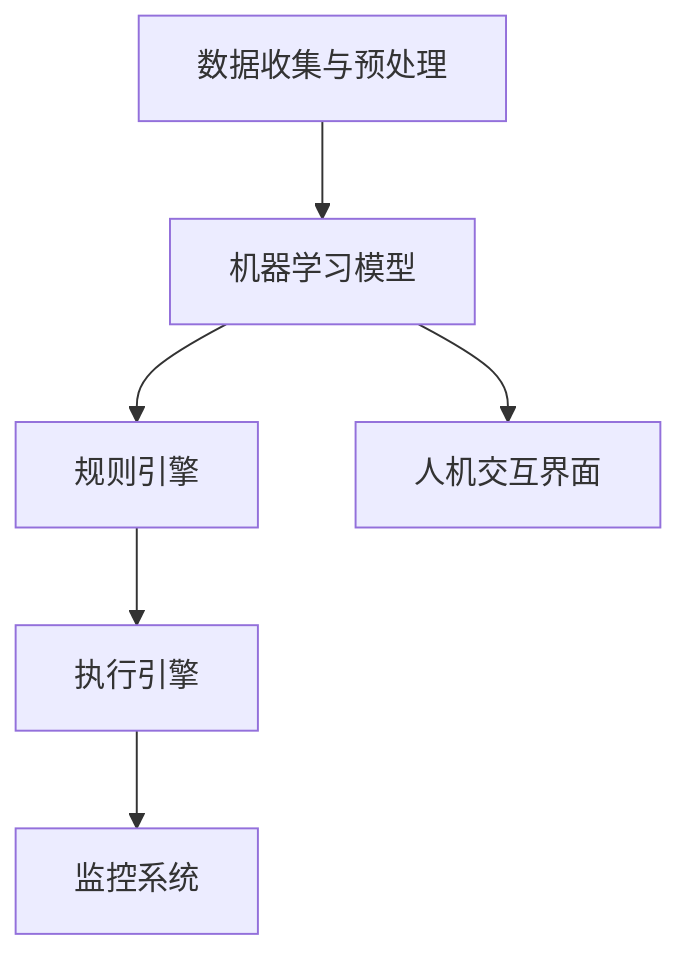

                 

关键词：人工智能，工作流自动化，趋势分析，算法原理，应用场景，未来展望。

> 摘要：本文将探讨AI驱动的现代工作流自动化的趋势，深入分析其核心概念、算法原理以及实际应用。我们将通过详细的技术讲解、案例分析和未来展望，为您呈现一个全面的工作流自动化蓝图。

## 1. 背景介绍

在信息化和数字化快速发展的时代，企业对于提高工作效率和降低成本的需求日益增长。工作流自动化作为提升企业运营效率的关键技术，受到了广泛关注。传统的手工操作和重复性任务不仅浪费人力资源，还容易导致错误。随着人工智能技术的发展，AI驱动的自动化工作流逐渐成为可能，为企业带来了巨大的变革。

AI驱动的自动化工作流通过机器学习、自然语言处理、图像识别等AI技术，实现了对大量数据的处理和分析，从而自动化执行一系列复杂的任务。这种技术的引入，不仅提高了工作效率，还增强了系统的适应性和灵活性。

## 2. 核心概念与联系

### 2.1 AI驱动的自动化工作流原理

AI驱动的自动化工作流主要依赖于以下几个核心概念：

- **机器学习**：通过从数据中学习模式和规律，实现自动化的决策和操作。
- **自然语言处理**：理解和生成自然语言，实现人机交互和文本分析。
- **图像识别**：自动识别和分类图像内容，实现图像信息的自动化处理。

### 2.2 AI驱动的自动化工作流架构

AI驱动的自动化工作流通常包括以下几个关键组件：

1. **数据收集与预处理**：收集相关的数据，并进行清洗和格式化，以供机器学习模型训练。
2. **机器学习模型**：构建和应用机器学习模型，进行数据分析和预测。
3. **规则引擎**：定义和执行工作流中的业务规则和逻辑。
4. **执行引擎**：自动化执行具体任务和操作，如发送通知、更新数据库等。
5. **监控系统**：监控工作流执行过程，确保系统的稳定性和可靠性。

以下是AI驱动的自动化工作流架构的Mermaid流程图：



## 3. 核心算法原理 & 具体操作步骤

### 3.1 算法原理概述

AI驱动的自动化工作流的核心算法主要基于以下几种：

- **监督学习**：通过已有的标注数据训练模型，实现对新数据的分类或回归。
- **无监督学习**：通过未标注的数据发现数据中的模式，实现聚类或降维。
- **强化学习**：通过与环境的交互学习策略，实现自动化决策和优化。

### 3.2 算法步骤详解

1. **数据收集与预处理**：
   - 收集相关数据，如用户操作日志、业务流程数据等。
   - 进行数据清洗，去除噪声和异常值。
   - 数据格式化，以满足机器学习模型的输入要求。

2. **机器学习模型训练**：
   - 选择合适的机器学习算法，如决策树、支持向量机、神经网络等。
   - 使用训练数据训练模型，调整参数以达到最佳性能。

3. **模型评估与优化**：
   - 使用验证数据评估模型性能，调整模型参数。
   - 进行交叉验证，确保模型的泛化能力。

4. **模型部署与应用**：
   - 将训练好的模型部署到生产环境中。
   - 根据实际业务需求，应用模型进行自动化决策和任务执行。

### 3.3 算法优缺点

- **优点**：
  - 高效处理大量数据，自动化执行复杂任务。
  - 提高工作流的灵活性和可扩展性。
  - 降低人力成本和错误率。

- **缺点**：
  - 需要大量高质量的数据进行训练。
  - 模型开发和部署过程复杂。
  - 需要持续维护和更新模型。

### 3.4 算法应用领域

- **金融服务**：自动化审批贷款、信用卡申请等流程。
- **医疗健康**：自动化诊断、患者管理等流程。
- **物流与供应链**：自动化库存管理、订单处理等流程。
- **人力资源**：自动化招聘、员工管理、绩效评估等流程。

## 4. 数学模型和公式 & 详细讲解 & 举例说明

### 4.1 数学模型构建

在AI驱动的自动化工作流中，常见的数学模型包括：

- **线性回归模型**：用于预测数值型目标变量。
- **逻辑回归模型**：用于预测二分类目标变量。
- **支持向量机（SVM）**：用于分类问题。
- **神经网络模型**：用于复杂的数据处理和预测。

### 4.2 公式推导过程

以线性回归模型为例，其公式推导过程如下：

$$
y = \beta_0 + \beta_1x_1 + \beta_2x_2 + ... + \beta_nx_n + \epsilon
$$

其中，$y$ 为目标变量，$x_1, x_2, ..., x_n$ 为特征变量，$\beta_0, \beta_1, ..., \beta_n$ 为模型参数，$\epsilon$ 为误差项。

### 4.3 案例分析与讲解

以一个简单的房屋价格预测案例为例，我们使用线性回归模型进行预测。数据集包含房屋的面积、卧室数量和价格等信息。

1. **数据收集与预处理**：
   - 收集1000个房屋数据样本。
   - 数据清洗，去除缺失值和异常值。
   - 数据标准化，将特征变量缩放到相同的范围。

2. **模型训练**：
   - 选择线性回归模型。
   - 使用训练数据集训练模型，调整参数。

3. **模型评估**：
   - 使用验证数据集评估模型性能，计算均方误差（MSE）等指标。
   - 调整模型参数，优化模型性能。

4. **模型部署与应用**：
   - 将训练好的模型部署到生产环境中。
   - 输入新的房屋数据，预测价格。

## 5. 项目实践：代码实例和详细解释说明

### 5.1 开发环境搭建

1. 安装Python 3.7及以上版本。
2. 安装所需的库，如NumPy、Pandas、Scikit-learn等。

### 5.2 源代码详细实现

以下是一个简单的线性回归模型实现的代码示例：

```python
import numpy as np
import pandas as pd
from sklearn.linear_model import LinearRegression
from sklearn.model_selection import train_test_split
from sklearn.metrics import mean_squared_error

# 数据加载
data = pd.read_csv('house_price_data.csv')
X = data[['area', 'bedrooms']]
y = data['price']

# 数据预处理
X = X.values
y = y.values
X = np.hstack((np.ones((X.shape[0], 1)), X))
X_train, X_test, y_train, y_test = train_test_split(X, y, test_size=0.2, random_state=42)

# 模型训练
model = LinearRegression()
model.fit(X_train, y_train)

# 模型评估
y_pred = model.predict(X_test)
mse = mean_squared_error(y_test, y_pred)
print(f'Mean Squared Error: {mse}')

# 模型部署与应用
new_data = np.array([[1500, 3]])
new_price = model.predict(new_data)
print(f'Predicted Price: {new_price[0]}')
```

### 5.3 代码解读与分析

- 数据加载和预处理部分：
  - 使用Pandas库读取CSV文件，提取特征变量和目标变量。
  - 数据标准化，将特征变量缩放到相同的范围。

- 模型训练部分：
  - 选择线性回归模型。
  - 使用训练数据集训练模型，调整参数。

- 模型评估部分：
  - 使用验证数据集评估模型性能，计算均方误差（MSE）等指标。

- 模型部署与应用部分：
  - 将训练好的模型部署到生产环境中。
  - 输入新的房屋数据，预测价格。

## 6. 实际应用场景

AI驱动的自动化工作流在各个行业领域都有广泛的应用。以下是一些典型的应用场景：

- **金融服务**：自动化审批贷款、信用卡申请等流程，提高审批效率和降低错误率。
- **医疗健康**：自动化诊断、患者管理等流程，提高医疗质量和降低运营成本。
- **物流与供应链**：自动化库存管理、订单处理等流程，提高供应链效率。
- **人力资源**：自动化招聘、员工管理、绩效评估等流程，提高人力资源管理效率。

## 7. 未来应用展望

随着AI技术的不断发展，AI驱动的自动化工作流将在更多领域得到应用。未来发展趋势包括：

- **个性化定制**：根据用户行为和需求，实现更加个性化的自动化服务。
- **跨行业融合**：不同行业之间的自动化工作流相互融合，实现更高效的运营模式。
- **智能化运维**：通过AI技术实现自动化工作流的自我优化和维护。

## 8. 工具和资源推荐

### 8.1 学习资源推荐

- **书籍**：
  - 《机器学习》（作者：周志华）
  - 《深度学习》（作者：Ian Goodfellow）
- **在线课程**：
  - Coursera：机器学习（吴恩达）
  - edX：人工智能导论（DeepLearning.AI）

### 8.2 开发工具推荐

- **编程语言**：Python、R
- **机器学习库**：Scikit-learn、TensorFlow、PyTorch
- **数据分析库**：Pandas、NumPy、Matplotlib

### 8.3 相关论文推荐

- **论文列表**：
  - 《Deep Learning》（作者：Ian Goodfellow）
  - 《Learning to Represent Chemical molecules for Prediction》（作者：Andrew J. Patterson等）
  - 《A Survey on Machine Learning Techniques for Predicting Software Failures》（作者：Xiaowei Wang等）

## 9. 总结：未来发展趋势与挑战

### 9.1 研究成果总结

AI驱动的自动化工作流在提高工作效率、降低成本、提高系统灵活性等方面取得了显著成果。随着AI技术的不断发展，自动化工作流将在更多领域得到应用。

### 9.2 未来发展趋势

- **个性化定制**：根据用户行为和需求，实现更加个性化的自动化服务。
- **跨行业融合**：不同行业之间的自动化工作流相互融合，实现更高效的运营模式。
- **智能化运维**：通过AI技术实现自动化工作流的自我优化和维护。

### 9.3 面临的挑战

- **数据质量和数量**：自动化工作流需要大量高质量的数据进行训练和验证。
- **模型解释性**：提高模型的解释性，确保决策的透明度和可解释性。
- **安全性和隐私保护**：保障数据安全和用户隐私，防止数据泄露和滥用。

### 9.4 研究展望

未来，AI驱动的自动化工作流将继续发展，实现更加智能化、个性化和高效化。同时，研究人员将继续探索如何解决面临的挑战，推动自动化工作流技术的进步。

## 附录：常见问题与解答

### 9.1 什么是工作流自动化？

工作流自动化是指通过技术手段，将一系列手动操作转化为自动化的流程，以提高工作效率和降低成本。

### 9.2 AI驱动的自动化工作流有哪些优点？

AI驱动的自动化工作流具有以下优点：

- 提高工作效率和准确性。
- 降低人力成本和错误率。
- 提高系统的灵活性和可扩展性。

### 9.3 AI驱动的自动化工作流有哪些应用领域？

AI驱动的自动化工作流广泛应用于金融服务、医疗健康、物流与供应链、人力资源等领域。

### 9.4 如何确保AI驱动的自动化工作流的安全性？

确保AI驱动的自动化工作流的安全性需要：

- 加密传输和存储数据。
- 实施严格的访问控制策略。
- 定期进行安全审计和漏洞扫描。

---

作者：禅与计算机程序设计艺术 / Zen and the Art of Computer Programming


