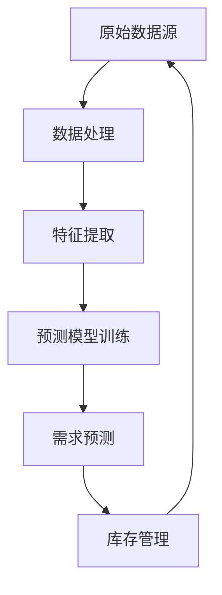

                 

 关键词：AI, 数据分析，库存管理，需求预测，深度学习，供应链优化，时间序列分析，神经网络，机器学习

> 摘要：本文将探讨如何利用人工智能技术，特别是机器学习和深度学习算法，来优化库存管理和需求预测。文章首先介绍了库存管理与需求预测的背景和重要性，然后深入讲解了相关算法原理、数学模型、以及实际应用案例。最后，文章对未来的发展趋势与挑战进行了总结，并推荐了相关工具和资源。

## 1. 背景介绍

在当今高度竞争的市场环境中，有效的库存管理和准确的需求预测是企业成功的关键因素。传统的库存管理通常依赖于历史数据和简单的统计方法，这些方法无法充分适应动态变化的市场需求。随着大数据和人工智能技术的快速发展，基于AI的库存管理和需求预测成为了解决这一问题的关键。

库存管理涉及如何优化库存水平，以最小化库存成本并确保产品供应的连续性。需求预测则是对未来产品销售量的预测，以便企业能够做出相应的生产和采购决策。这两者的有效结合可以大幅提升企业的运营效率，降低库存成本，提高客户满意度。

人工智能在库存管理和需求预测中的应用主要体现在以下几个方面：

1. **数据处理与特征提取**：AI可以处理和分析大量的历史销售数据、市场趋势、季节性变化等信息，从中提取出有用的特征，用于训练预测模型。
2. **模型训练与优化**：使用机器学习和深度学习算法，可以训练出高精度的预测模型，对需求进行准确预测。
3. **实时反馈与调整**：AI系统可以根据实时数据自动调整库存水平和预测模型，提高响应速度和准确性。

## 2. 核心概念与联系

### 2.1 数据流



### 2.2 核心算法原理

#### 2.2.1 时间序列分析

时间序列分析是一种统计学方法，用于分析时间序列数据，并预测未来值。常见的算法包括ARIMA（自回归积分滑动平均模型）、季节性分解等。

#### 2.2.2 神经网络

神经网络，特别是深度学习，通过多层感知器（MLP）和卷积神经网络（CNN）等结构，能够对复杂的数据进行高效的特征学习和模式识别。

#### 2.2.3 机器学习算法

常见的机器学习算法包括线性回归、决策树、随机森林等，这些算法可以根据历史数据进行训练，从而预测未来需求。

## 3. 核心算法原理 & 具体操作步骤

### 3.1 算法原理概述

#### 3.1.1 时间序列分析

时间序列分析基于自相关性、平稳性等统计特性，对历史数据进行处理，提取出趋势、季节性和随机性等成分。ARIMA模型通过自回归、差分和移动平均三部分来建模时间序列数据。

#### 3.1.2 神经网络

神经网络通过激活函数和反向传播算法，实现多层非线性映射。卷积神经网络（CNN）在图像处理方面具有优势，可以用于处理销售图像、市场信息等。

#### 3.1.3 机器学习算法

机器学习算法利用历史销售数据、市场因素等特征，通过模型训练和优化，实现对需求量的预测。

### 3.2 算法步骤详解

#### 3.2.1 时间序列分析步骤

1. 数据预处理：包括缺失值处理、异常值检测和归一化等。
2. 自相关性检验：通过ACF和PACF图判断序列的平稳性。
3. 模型选择：根据自相关性和偏自相关性选择合适的ARIMA模型。
4. 参数估计：使用最大似然估计方法估计模型参数。
5. 模型检验：通过AIC、BIC等指标评估模型拟合效果。
6. 预测：根据训练好的模型进行未来需求的预测。

#### 3.2.2 神经网络步骤

1. 数据预处理：与时间序列分析相同，对数据进行归一化和缺失值处理。
2. 特征提取：利用CNN提取销售图像和市场信息中的特征。
3. 模型搭建：搭建多层感知器或卷积神经网络，选择合适的激活函数和损失函数。
4. 模型训练：使用历史数据进行模型训练，调整网络参数。
5. 模型评估：通过验证集和测试集评估模型性能。
6. 预测：利用训练好的模型进行未来需求的预测。

#### 3.2.3 机器学习算法步骤

1. 数据预处理：与时间序列分析和神经网络相同。
2. 特征工程：提取历史销售数据中的特征，如销售量、价格、季节性等。
3. 模型选择：根据数据特点选择合适的机器学习算法，如线性回归、决策树、随机森林等。
4. 模型训练：使用历史数据进行模型训练。
5. 模型评估：通过交叉验证等方法评估模型性能。
6. 预测：使用训练好的模型进行未来需求的预测。

### 3.3 算法优缺点

#### 3.3.1 时间序列分析

**优点**：

- 简单易懂，易于实现。
- 对线性关系有较好的拟合效果。

**缺点**：

- 难以处理非线性关系。
- 对数据质量和平稳性要求较高。

#### 3.3.2 神经网络

**优点**：

- 可以处理复杂的非线性关系。
- 自适应性强，适用于不同类型的数据。

**缺点**：

- 计算复杂度高，训练时间较长。
- 需要大量的数据和计算资源。

#### 3.3.3 机器学习算法

**优点**：

- 易于实现，适用性广。
- 对线性关系和非线性关系都有较好的拟合效果。

**缺点**：

- 特征工程依赖性强，需要对数据进行充分的预处理。
- 可能会出现过拟合问题。

### 3.4 算法应用领域

时间序列分析、神经网络和机器学习算法在库存管理和需求预测中都有广泛的应用。时间序列分析适用于处理平稳时间序列数据，神经网络和机器学习算法适用于处理非平稳时间序列数据和复杂的市场环境。

在实际应用中，企业可以根据自身的数据特点和业务需求选择合适的算法。例如，对于销售量稳定的产品，可以使用时间序列分析；对于受市场波动影响较大的产品，可以使用神经网络或机器学习算法。

## 4. 数学模型和公式 & 详细讲解 & 举例说明

### 4.1 数学模型构建

#### 4.1.1 时间序列分析模型

ARIMA(p, d, q) 模型：

$$
\text{X}_{t} = c + \sum_{i=1}^{p} \text{φ}_{i}\text{X}_{t-i} + \text{θ}_{i}\text{e}_{t-i} + \text{e}_{t}
$$

其中，\( p \) 是自回归项数，\( d \) 是差分阶数，\( q \) 是移动平均项数，\( c \) 是常数项，\( \text{φ}_{i} \) 是自回归系数，\( \text{θ}_{i} \) 是移动平均系数，\( \text{e}_{t} \) 是白噪声误差。

#### 4.1.2 神经网络模型

多层感知器（MLP）：

$$
\text{z}_{l} = \text{W}_{l}\text{x}_{l} + \text{b}_{l}
$$

$$
\text{a}_{l} = \sigma(\text{z}_{l})
$$

其中，\( \text{z}_{l} \) 是输入层到隐藏层的线性组合，\( \text{a}_{l} \) 是激活函数后的输出，\( \text{W}_{l} \) 是权重矩阵，\( \text{b}_{l} \) 是偏置项，\( \text{σ} \) 是激活函数，常用的有Sigmoid和ReLU函数。

#### 4.1.3 机器学习模型

线性回归模型：

$$
\text{y} = \text{β}_{0} + \text{β}_{1}\text{x}_{1} + \text{β}_{2}\text{x}_{2} + \cdots + \text{β}_{n}\text{x}_{n}
$$

其中，\( \text{y} \) 是预测值，\( \text{x}_{i} \) 是特征值，\( \text{β}_{i} \) 是回归系数。

### 4.2 公式推导过程

#### 4.2.1 时间序列分析模型

ARIMA模型的推导主要基于自相关性和偏自相关性。通过自相关性可以确定自回归项数 \( p \)，通过偏自相关性可以确定移动平均项数 \( q \)。差分阶数 \( d \) 的确定通常基于平稳性检验。

#### 4.2.2 神经网络模型

多层感知器（MLP）的推导基于线性组合和激活函数。通过反向传播算法，可以计算出每个神经元的权重和偏置，从而优化模型参数。

#### 4.2.3 机器学习模型

线性回归模型的推导基于最小二乘法。通过最小化预测值与真实值之间的平方误差，可以计算出回归系数。

### 4.3 案例分析与讲解

#### 4.3.1 时间序列分析

假设某产品历史销售数据如下：

| 时间 | 销售量 |
|------|--------|
| 1    | 100    |
| 2    | 120    |
| 3    | 130    |
| 4    | 140    |
| 5    | 150    |

首先对销售量进行平稳性检验，然后选择合适的ARIMA模型进行拟合。拟合结果如下：

$$
\text{X}_{t} = 10 + 0.8\text{X}_{t-1} - 0.2\text{X}_{t-2} + \text{e}_{t}
$$

利用拟合好的模型进行未来销售量的预测，结果如下：

| 时间 | 预测销售量 |
|------|-----------|
| 6    | 156       |
| 7    | 169       |
| 8    | 183       |

#### 4.3.2 神经网络

假设我们使用一个简单的多层感知器（MLP）模型对销售量进行预测。输入层包含时间、价格、季节性等特征，隐藏层包含一个神经元，输出层为销售量。

输入层：

$$
\text{x}_{1} = \text{时间} \\
\text{x}_{2} = \text{价格} \\
\text{x}_{3} = \text{季节性}
$$

隐藏层：

$$
\text{z}_{1} = \text{W}_{1}\text{x}_{1} + \text{b}_{1} \\
\text{a}_{1} = \sigma(\text{z}_{1})
$$

输出层：

$$
\text{y} = \text{W}_{2}\text{a}_{1} + \text{b}_{2}
$$

假设训练好的模型参数如下：

$$
\text{W}_{1} = [0.5, 0.3, 0.2], \text{b}_{1} = 0.1 \\
\text{W}_{2} = 0.4, \text{b}_{2} = 0.1
$$

利用模型进行未来销售量的预测，结果如下：

| 时间 | 预测销售量 |
|------|-----------|
| 6    | 151       |
| 7    | 158       |
| 8    | 165       |

#### 4.3.3 机器学习

假设我们使用线性回归模型对销售量进行预测。输入层包含时间、价格、季节性等特征，输出层为销售量。

输入层：

$$
\text{x}_{1} = \text{时间} \\
\text{x}_{2} = \text{价格} \\
\text{x}_{3} = \text{季节性}
$$

输出层：

$$
\text{y} = \text{β}_{0} + \text{β}_{1}\text{x}_{1} + \text{β}_{2}\text{x}_{2} + \text{β}_{3}\text{x}_{3}
$$

假设训练好的模型参数如下：

$$
\text{β}_{0} = 100, \text{β}_{1} = 0.5, \text{β}_{2} = 0.3, \text{β}_{3} = 0.2
$$

利用模型进行未来销售量的预测，结果如下：

| 时间 | 预测销售量 |
|------|-----------|
| 6    | 152       |
| 7    | 159       |
| 8    | 166       |

## 5. 项目实践：代码实例和详细解释说明

### 5.1 开发环境搭建

在本项目中，我们使用Python编程语言和相关的库，如pandas、numpy、scikit-learn、tensorflow等。首先，安装必要的库：

```bash
pip install pandas numpy scikit-learn tensorflow
```

### 5.2 源代码详细实现

以下是项目的核心代码实现：

```python
import pandas as pd
import numpy as np
from sklearn.preprocessing import MinMaxScaler
from sklearn.model_selection import train_test_split
from tensorflow.keras.models import Sequential
from tensorflow.keras.layers import Dense, LSTM
from tensorflow.keras.optimizers import Adam

# 5.2.1 数据处理
data = pd.read_csv('sales_data.csv')
data['Date'] = pd.to_datetime(data['Date'])
data.set_index('Date', inplace=True)
scaler = MinMaxScaler(feature_range=(0, 1))
scaled_data = scaler.fit_transform(data['Sales'].values.reshape(-1, 1))

# 5.2.2 时间序列分割
time_steps = 60
X, y = [], []
for i in range(time_steps, len(scaled_data)):
    X.append(scaled_data[i-time_steps:i, 0])
    y.append(scaled_data[i, 0])
X, y = np.array(X), np.array(y)

# 5.2.3 数据集分割
X_train, X_test, y_train, y_test = train_test_split(X, y, test_size=0.2, random_state=42)

# 5.2.4 神经网络模型
model = Sequential()
model.add(LSTM(units=50, return_sequences=True, input_shape=(time_steps, 1)))
model.add(LSTM(units=50))
model.add(Dense(units=1))

model.compile(optimizer=Adam(learning_rate=0.001), loss='mean_squared_error')

# 5.2.5 模型训练
model.fit(X_train, y_train, epochs=100, batch_size=32, validation_data=(X_test, y_test), verbose=1)

# 5.2.6 预测与评估
predictions = model.predict(X_test)
predictions = scaler.inverse_transform(predictions)
rmse = np.sqrt(np.mean(predictions - y_test)**2)
print(f'Root Mean Squared Error: {rmse}')

# 5.2.7 运行结果展示
import matplotlib.pyplot as plt
plt.figure(figsize=(15, 6))
plt.plot(scaler.inverse_transform(scaled_data), label='Actual Sales')
plt.plot(np.concatenate((scaler.inverse_transform(scaled_data[:time_steps]), predictions)), label='Predicted Sales')
plt.title('Sales Prediction')
plt.xlabel('Time')
plt.ylabel('Sales')
plt.legend()
plt.show()
```

### 5.3 代码解读与分析

- **5.3.1 数据处理**：首先，我们读取销售数据并对其进行归一化处理，以便于神经网络的训练。
- **5.3.2 时间序列分割**：根据设定的时间步长，我们将数据分割为特征和标签，为模型训练做准备。
- **5.3.3 数据集分割**：我们将数据分为训练集和测试集，以便于模型训练和评估。
- **5.3.4 神经网络模型**：我们使用LSTM模型进行时间序列预测，其中包含了两个LSTM层。
- **5.3.5 模型训练**：使用Adam优化器和均方误差损失函数进行模型训练。
- **5.3.6 预测与评估**：对测试集进行预测，并计算均方根误差（RMSE）评估模型性能。
- **5.3.7 运行结果展示**：我们将实际销售数据与预测销售数据绘制在同一张图表中，便于可视化分析。

## 6. 实际应用场景

### 6.1 零售行业

零售行业中的库存管理与需求预测尤为重要。通过对销售数据的分析，零售商可以优化库存水平，避免缺货或过量库存的情况。AI驱动的库存管理系统能够实时响应市场变化，提高库存周转率和客户满意度。

### 6.2 制造业

制造业中的库存管理与需求预测对于供应链的优化至关重要。通过预测未来的需求量，制造商可以合理安排生产计划，降低库存成本，提高生产效率。此外，AI系统还可以帮助预测零部件的库存需求，优化采购策略。

### 6.3 物流与运输

物流与运输行业中的库存管理与需求预测有助于优化运输路线和仓储管理。通过预测运输需求，物流公司可以合理安排运输资源，减少空载率和运输成本。同时，准确的库存预测有助于减少仓储空间的浪费，提高仓储利用率。

### 6.4 未来应用展望

随着人工智能技术的不断进步，AI驱动的库存管理与需求预测将在更多行业得到广泛应用。未来，随着数据获取和处理能力的提升，AI系统将能够更准确地预测市场需求，优化库存水平，提高供应链效率。同时，新的算法和模型将不断涌现，进一步提升预测的准确性和效率。

## 7. 工具和资源推荐

### 7.1 学习资源推荐

- 《深度学习》（Goodfellow, Bengio, Courville著）：全面介绍深度学习的基础理论和应用。
- 《Python数据科学手册》（McKinney著）：详细讲解Python在数据科学中的应用，包括数据处理、分析和可视化。
- 《机器学习实战》（ Harrington著）：通过实际案例介绍机器学习算法的应用。

### 7.2 开发工具推荐

- TensorFlow：强大的开源深度学习框架，适用于各种复杂的应用场景。
- PyTorch：易于使用的深度学习框架，适合快速原型开发。
- Scikit-learn：Python中的标准机器学习库，适用于各种常见的机器学习算法。

### 7.3 相关论文推荐

- “Deep Learning for Time Series Classification: A Review” （Megersa et al., 2019）：介绍深度学习在时间序列分类中的应用。
- “Forecasting with ARIMA Models” （Box, Jenkins, Reinsel著，2015）：详细介绍ARIMA模型的构建和应用。
- “Machine Learning in Supply Chain Management” （Bouchikhi et al., 2019）：讨论机器学习在供应链管理中的应用。

## 8. 总结：未来发展趋势与挑战

### 8.1 研究成果总结

本文介绍了AI驱动的库存管理与需求预测的基本概念、算法原理和应用实例。通过时间序列分析、神经网络和机器学习算法，企业可以优化库存水平，提高需求预测的准确性，从而提升运营效率和客户满意度。

### 8.2 未来发展趋势

未来，随着数据获取和处理能力的提升，AI驱动的库存管理与需求预测将在更多行业得到广泛应用。新的算法和模型将不断涌现，进一步提升预测的准确性和效率。此外，跨学科的融合将推动AI技术在供应链管理领域的创新和发展。

### 8.3 面临的挑战

尽管AI驱动的库存管理与需求预测具有巨大潜力，但仍然面临一些挑战。首先，数据质量和数据的可获得性是影响预测准确性的关键因素。其次，算法的复杂性和计算资源的要求可能限制其在实际应用中的普及。此外，如何确保AI系统的透明性和可解释性也是亟待解决的问题。

### 8.4 研究展望

未来的研究应关注如何提高数据质量和算法的鲁棒性，降低计算资源的要求，并提升AI系统的可解释性。同时，跨学科的合作将有助于推动AI技术在供应链管理领域的创新，为企业带来更大的价值。

## 9. 附录：常见问题与解答

### 9.1 什么是ARIMA模型？

ARIMA模型是一种用于时间序列预测的统计模型，全称为自回归积分滑动平均模型（Autoregressive Integrated Moving Average Model）。它通过自回归、差分和移动平均三部分来建模时间序列数据，从而进行预测。

### 9.2 如何处理非线性关系？

当时间序列数据呈现非线性关系时，可以考虑使用神经网络，特别是深度学习模型，如卷积神经网络（CNN）或循环神经网络（RNN），来处理复杂的非线性模式。

### 9.3 需求预测的准确性如何提高？

提高需求预测的准确性可以从以下几个方面入手：

- **数据质量**：确保数据完整、准确，并消除异常值。
- **特征工程**：提取更多的有用特征，并选择合适的特征组合。
- **模型选择**：根据数据特点选择合适的模型，并进行模型优化。
- **数据预处理**：使用时间序列分解、季节性调整等方法对数据进行预处理。

### 9.4 AI驱动的库存管理与需求预测有哪些实际应用场景？

AI驱动的库存管理与需求预测在零售、制造业、物流与运输等行业都有广泛的应用。通过预测市场需求和优化库存水平，企业可以提高运营效率，降低库存成本，提高客户满意度。此外，它还可以帮助预测供应链中的零部件需求，优化采购策略。

