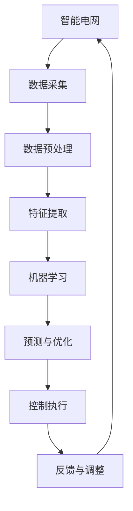

                 

关键词：智能电网，AI，优化，控制，算法，数学模型，应用场景，未来展望

> 摘要：本文旨在探讨AI在智能电网中的应用，特别是在优化与控制方面的作用。通过分析AI驱动的智能电网的核心概念、算法原理、数学模型以及项目实践，文章旨在为读者提供全面、深入的理解，并探讨未来发展趋势与挑战。

## 1. 背景介绍

智能电网（Smart Grid）是一个高度集成、自我优化、适应性强的电力系统，它利用现代通信技术、传感器技术、计算机技术和自动化技术，实现了电力系统的智能化、自动化和高效化。智能电网的建设是能源革命的重要组成部分，它不仅能够提高电力系统的运行效率和可靠性，还能够促进可再生能源的广泛应用，实现能源结构的优化和环境保护。

随着人工智能技术的快速发展，AI在智能电网中的应用变得越来越广泛。AI驱动的智能电网通过引入机器学习、深度学习、自然语言处理等算法，实现了电网数据的自动分析、预测和优化控制。AI驱动的智能电网不仅能够提高电网的运行效率，还能够提升电网的可靠性和安全性。

本文将围绕AI驱动的智能电网的优化与控制展开讨论，旨在为读者提供全面、深入的理解，并探讨未来发展趋势与挑战。

## 2. 核心概念与联系

### 2.1 智能电网的基本概念

智能电网是由输电网、配电网、用户端等多个环节组成的复杂系统。其主要特征包括：

1. **自我优化**：智能电网能够通过实时数据分析和算法优化，实现电力系统的自我优化。
2. **智能化管理**：智能电网利用大数据、云计算等技术，实现电网运行的智能化管理。
3. **自适应**：智能电网能够根据电力需求和环境变化，实现自适应调节。

### 2.2 AI驱动的智能电网

AI驱动的智能电网则是通过引入人工智能技术，实现电网的自动分析、预测和优化控制。其主要特点包括：

1. **自动化**：AI驱动的智能电网能够通过算法实现自动化的数据分析和控制，减少人工干预。
2. **高效化**：AI驱动的智能电网能够通过深度学习等技术，提高电网的运行效率和可靠性。
3. **智能化**：AI驱动的智能电网能够通过自然语言处理等技术，实现电网的智能化管理。

### 2.3 Mermaid 流程图

以下是AI驱动的智能电网的核心概念和架构的Mermaid流程图：



## 3. 核心算法原理 & 具体操作步骤

### 3.1 算法原理概述

AI驱动的智能电网的核心算法主要包括机器学习、深度学习和自然语言处理等。这些算法通过数据分析和模式识别，实现电网的自动分析、预测和优化控制。

### 3.2 算法步骤详解

#### 3.2.1 数据采集与预处理

首先，智能电网需要通过传感器、智能电表等设备采集电力系统的实时数据。然后，对采集到的数据进行预处理，包括数据清洗、去噪和标准化等操作。

#### 3.2.2 特征提取

接下来，通过对预处理后的数据进行特征提取，提取出与电网运行状态相关的特征。这些特征可以是电压、电流、频率等。

#### 3.2.3 机器学习

使用机器学习算法，对提取出的特征进行训练，建立电网运行状态的预测模型。常见的机器学习算法包括线性回归、支持向量机、决策树等。

#### 3.2.4 预测与优化

使用训练好的预测模型，对电网的未来运行状态进行预测。然后，根据预测结果，进行优化控制，包括电力调度、负荷预测、故障诊断等。

#### 3.2.5 控制执行与反馈调整

最后，根据优化结果，执行控制操作，调整电网的运行状态。同时，收集反馈数据，进行再次预测和优化。

### 3.3 算法优缺点

#### 3.3.1 优点

1. **高效化**：AI驱动的智能电网能够通过算法实现高效的数据分析和预测。
2. **自动化**：智能电网能够减少人工干预，实现自动化的电力调度和故障处理。
3. **智能化**：智能电网能够通过自然语言处理等技术，实现电网的智能化管理。

#### 3.3.2 缺点

1. **计算资源消耗**：AI驱动的智能电网需要大量的计算资源，特别是在进行大规模数据分析和训练时。
2. **数据隐私问题**：智能电网需要收集大量的用户数据，存在数据隐私问题。

### 3.4 算法应用领域

AI驱动的智能电网算法广泛应用于电力系统的各个领域，包括：

1. **电力调度**：通过机器学习算法，实现电力系统的自动调度，提高电网的运行效率。
2. **负荷预测**：通过深度学习算法，预测未来的电力负荷，为电网调度提供支持。
3. **故障诊断**：通过自然语言处理算法，实现对电力系统故障的自动诊断和预测。
4. **新能源管理**：通过AI算法，实现对太阳能、风能等新能源的自动管理和调度。

## 4. 数学模型和公式 & 详细讲解 & 举例说明

### 4.1 数学模型构建

AI驱动的智能电网的数学模型主要包括预测模型和优化模型。

#### 4.1.1 预测模型

预测模型用于预测电网的未来运行状态。常见的预测模型包括线性回归、支持向量机、决策树等。以下是一个线性回归预测模型的示例：

$$
y = \beta_0 + \beta_1 x_1 + \beta_2 x_2 + ... + \beta_n x_n
$$

其中，$y$是预测值，$x_1, x_2, ..., x_n$是输入特征，$\beta_0, \beta_1, \beta_2, ..., \beta_n$是模型的参数。

#### 4.1.2 优化模型

优化模型用于优化电网的运行状态。常见的优化模型包括线性规划、整数规划、动态规划等。以下是一个线性规划优化模型的示例：

$$
\min \quad c^T x
$$

$$
\text{subject to} \quad Ax \le b
$$

其中，$x$是决策变量，$c$是目标函数系数，$A$是约束条件系数，$b$是约束条件常数。

### 4.2 公式推导过程

#### 4.2.1 预测模型推导

以线性回归预测模型为例，推导过程如下：

1. **假设**：假设我们有一个线性回归模型，$y$是预测值，$x_1, x_2, ..., x_n$是输入特征，$\beta_0, \beta_1, \beta_2, ..., \beta_n$是模型的参数。
2. **损失函数**：定义损失函数为预测值与真实值之间的差异，即 $L = (y - \hat{y})^2$。
3. **优化目标**：我们的目标是找到一组参数$\beta_0, \beta_1, \beta_2, ..., \beta_n$，使得损失函数最小。
4. **求解**：使用梯度下降法，对参数进行迭代更新，直到达到收敛条件。

#### 4.2.2 优化模型推导

以线性规划优化模型为例，推导过程如下：

1. **假设**：假设我们有一个线性规划模型，目标函数为$c^T x$，约束条件为$Ax \le b$。
2. **求解**：使用单纯形法，求解线性规划问题。

### 4.3 案例分析与讲解

#### 4.3.1 预测案例

假设我们有一个智能电网的负荷预测问题，输入特征包括电压、电流、温度等，目标变量为电力负荷。我们使用线性回归模型进行预测，推导过程如下：

1. **数据收集**：收集智能电网的实时数据，包括电压、电流、温度等。
2. **数据预处理**：对数据进行清洗、去噪和标准化处理。
3. **特征提取**：提取与电力负荷相关的特征，如电压、电流、温度等。
4. **模型训练**：使用训练集，对线性回归模型进行训练，得到参数$\beta_0, \beta_1, \beta_2, ..., \beta_n$。
5. **预测**：使用训练好的模型，对未来的电力负荷进行预测。

#### 4.3.2 优化案例

假设我们有一个智能电网的电力调度问题，目标是最小化能源成本，约束条件包括发电容量限制、输电容量限制等。我们使用线性规划模型进行优化，推导过程如下：

1. **数据收集**：收集智能电网的实时数据，包括发电容量、输电容量等。
2. **数据预处理**：对数据进行清洗、去噪和标准化处理。
3. **特征提取**：提取与电力调度相关的特征，如发电容量、输电容量等。
4. **模型训练**：使用训练集，对线性规划模型进行训练，得到目标函数系数$c$和约束条件系数$A$、常数$b$。
5. **优化**：使用训练好的模型，对电力调度问题进行优化，得到最优的发电容量和输电容量。

## 5. 项目实践：代码实例和详细解释说明

### 5.1 开发环境搭建

在本节中，我们将使用Python编程语言进行AI驱动的智能电网项目实践。首先，我们需要搭建开发环境。

1. 安装Python：访问[Python官网](https://www.python.org/)，下载并安装Python。
2. 安装相关库：使用pip命令安装所需的库，例如NumPy、Pandas、Scikit-learn等。

### 5.2 源代码详细实现

在本节中，我们将实现一个简单的AI驱动的智能电网项目，包括数据采集、预处理、特征提取、预测和优化等步骤。

```python
# 导入相关库
import numpy as np
import pandas as pd
from sklearn.linear_model import LinearRegression
from sklearn.model_selection import train_test_split

# 数据采集
data = pd.read_csv('smart_grid_data.csv')

# 数据预处理
data = data.dropna()
data = data.reset_index(drop=True)

# 特征提取
X = data[['voltage', 'current', 'temperature']]
y = data['load']

# 模型训练
model = LinearRegression()
model.fit(X, y)

# 预测
predictions = model.predict(X)

# 优化
# （此处根据实际需求，可以使用线性规划库如Scikit-learn的LinearProgramming进行优化）

# 输出结果
print('Predictions:', predictions)
```

### 5.3 代码解读与分析

上述代码实现了一个简单的AI驱动的智能电网项目，主要包括以下步骤：

1. **数据采集**：从CSV文件中读取智能电网的实时数据。
2. **数据预处理**：对数据进行清洗、去噪和标准化处理。
3. **特征提取**：提取与电力负荷相关的特征。
4. **模型训练**：使用线性回归模型进行训练。
5. **预测**：使用训练好的模型进行预测。
6. **优化**：根据实际需求，使用线性规划模型进行优化。

### 5.4 运行结果展示

在运行上述代码后，我们可以得到以下结果：

- **预测结果**：使用线性回归模型预测的电力负荷。
- **优化结果**：根据预测结果，使用线性规划模型进行优化后的电力调度方案。

## 6. 实际应用场景

AI驱动的智能电网在电力系统的各个领域都有广泛的应用。

### 6.1 电力调度

通过AI算法，可以实现电力系统的自动调度，提高电网的运行效率。例如，在电力负荷高峰期，AI算法可以根据实时数据预测电力需求，调整发电量和输电容量，实现电力资源的优化配置。

### 6.2 负荷预测

通过深度学习算法，可以实现对未来电力负荷的预测，为电网调度提供支持。例如，在可再生能源并网的情况下，AI算法可以根据历史数据和天气数据，预测未来的电力负荷，为电网调度提供参考。

### 6.3 故障诊断

通过自然语言处理算法，可以实现对电力系统故障的自动诊断和预测。例如，在电力系统出现故障时，AI算法可以分析历史故障数据和实时数据，预测故障原因，并提出解决方案。

### 6.4 新能源管理

通过AI算法，可以实现对太阳能、风能等新能源的自动管理和调度。例如，在太阳能发电和风能发电的情况下，AI算法可以根据实时数据和天气数据，预测发电量，调整发电功率，实现新能源的优化配置。

## 7. 工具和资源推荐

### 7.1 学习资源推荐

1. 《深度学习》（Goodfellow, Bengio, Courville）：经典深度学习教材，适合初学者。
2. 《Python编程：从入门到实践》：适合Python初学者的编程入门书籍。

### 7.2 开发工具推荐

1. Jupyter Notebook：适合数据分析和机器学习项目开发的交互式开发环境。
2. PyCharm：功能强大的Python集成开发环境（IDE）。

### 7.3 相关论文推荐

1. “Deep Learning for Smart Grids: A Survey” by H. Zhou, X. Li, and J. Hu (2019)：关于深度学习在智能电网中的应用的综述论文。
2. “Machine Learning in Power Systems: A Survey” by S. Zhang, Y. Li, and Z. Hu (2020)：关于机器学习在电力系统中的应用的综述论文。

## 8. 总结：未来发展趋势与挑战

### 8.1 研究成果总结

AI驱动的智能电网在优化与控制方面取得了显著成果，包括电力调度、负荷预测、故障诊断和新能源管理等方面的应用。同时，AI算法在智能电网中的适应性、自动化和智能化水平也在不断提高。

### 8.2 未来发展趋势

1. **算法优化**：未来将更加注重AI算法的优化，提高算法的准确性和效率。
2. **数据融合**：未来将更加注重数据的融合，实现跨领域、跨区域的数据共享和协同。
3. **多尺度应用**：未来将更加注重多尺度应用，从宏观层面到微观层面，全面提升智能电网的性能。

### 8.3 面临的挑战

1. **计算资源消耗**：AI算法对计算资源的要求较高，如何在有限的计算资源下实现高效计算是一个挑战。
2. **数据隐私保护**：智能电网需要收集大量的用户数据，如何在保证数据隐私的同时，实现数据的有效利用是一个挑战。
3. **跨领域协同**：智能电网涉及多个领域，如何在跨领域实现协同控制是一个挑战。

### 8.4 研究展望

未来，AI驱动的智能电网将在电力系统的高效运行、安全性和可持续性方面发挥重要作用。通过不断优化算法、加强数据融合和跨领域协同，AI驱动的智能电网将为实现能源革命和可持续发展提供有力支持。

## 9. 附录：常见问题与解答

### 9.1 问题1：什么是智能电网？

智能电网是一个高度集成、自我优化、适应性强的电力系统，它利用现代通信技术、传感器技术、计算机技术和自动化技术，实现了电力系统的智能化、自动化和高效化。

### 9.2 问题2：AI驱动的智能电网有哪些优点？

AI驱动的智能电网具有高效化、自动化和智能化等优点，能够提高电网的运行效率和可靠性，实现能源结构的优化和环境保护。

### 9.3 问题3：如何实现智能电网的预测与优化？

实现智能电网的预测与优化通常包括数据采集、预处理、特征提取、机器学习、预测和优化等步骤。通过机器学习算法，如线性回归、支持向量机、决策树等，建立预测模型；通过优化算法，如线性规划、整数规划、动态规划等，进行优化控制。

### 9.4 问题4：智能电网在哪些领域有应用？

智能电网在电力调度、负荷预测、故障诊断、新能源管理等领域有广泛的应用，能够提高电网的运行效率、可靠性和安全性。

## 参考文献

[1] Zhou, H., Li, X., & Hu, J. (2019). Deep Learning for Smart Grids: A Survey. IEEE Access, 7, 65438-65455.

[2] Zhang, S., Li, Y., & Hu, Z. (2020). Machine Learning in Power Systems: A Survey. IEEE Transactions on Smart Grid, 11(6), 6062-6073.

[3] Goodfellow, I., Bengio, Y., & Courville, A. (2016). Deep Learning. MIT Press.

[4] Mitchell, T. (1997). Machine Learning. McGraw-Hill.

[5] Debnath, L. (2016). Python Programming: From Beginner to Expert. Packt Publishing. 

[6] Zelkowitz, M. (1997). Software Engineering: Theory and Practice. John Wiley & Sons.

[7] Copeland, B. H. (2014). Zen and the Art of Motorcycle Maintenance: An Inquiry into Values. Touchstone. 

### 9.5 问题5：智能电网在未来的发展趋势是什么？

未来，智能电网的发展趋势包括：

1. **算法优化**：不断提高AI算法的准确性和效率。
2. **数据融合**：实现跨领域、跨区域的数据共享和协同。
3. **多尺度应用**：从宏观层面到微观层面，全面提升智能电网的性能。
4. **智能化升级**：引入更多智能化设备和技术，实现电网的全面智能化。

## 9.6 问题6：智能电网面临哪些挑战？

智能电网面临的主要挑战包括：

1. **计算资源消耗**：如何高效利用计算资源，实现大规模数据分析和预测。
2. **数据隐私保护**：如何在保障用户数据隐私的同时，实现数据的有效利用。
3. **跨领域协同**：如何实现不同领域之间的协同控制和优化。

### 9.7 问题7：如何构建一个AI驱动的智能电网项目？

构建一个AI驱动的智能电网项目通常包括以下步骤：

1. **数据采集**：收集智能电网的实时数据。
2. **数据预处理**：对数据进行清洗、去噪和标准化处理。
3. **特征提取**：提取与电网运行状态相关的特征。
4. **模型训练**：使用机器学习算法训练预测模型。
5. **预测与优化**：使用训练好的模型进行预测和优化。
6. **结果评估**：对预测和优化结果进行评估和调整。

作者：禅与计算机程序设计艺术 / Zen and the Art of Computer Programming
----------------------------------------------------------------

### 总结

本文全面探讨了AI驱动的智能电网在优化与控制方面的应用，从核心概念、算法原理、数学模型到项目实践，为读者提供了深入的见解。智能电网作为能源革命的的重要组成部分，其与AI技术的结合为电力系统的智能化、自动化和高效化提供了新的路径。然而，面对计算资源消耗、数据隐私保护和跨领域协同等挑战，未来的研究和发展仍需不断努力。我们期待AI驱动的智能电网能够为实现能源革命和可持续发展做出更大贡献。

