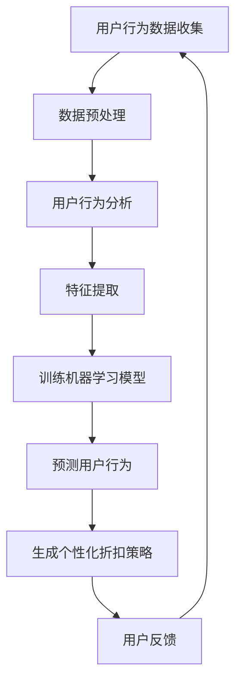

                 

关键词：个性化折扣、AI算法、电商平台、用户行为分析、数据挖掘、机器学习

摘要：随着电商平台的不断发展，用户对个性化体验的需求日益增加。本文将探讨如何利用人工智能技术，特别是机器学习和数据挖掘技术，设计一种基于用户行为的个性化折扣策略，从而提升用户满意度和平台盈利能力。

## 1. 背景介绍

电商平台作为现代商业的重要组成部分，其竞争愈发激烈。各大平台都在努力吸引和留住用户，提供个性化的购物体验成为了提升用户满意度和竞争力的关键。而折扣策略作为一种常见的促销手段，对于吸引用户、提高销售额具有重要作用。

传统折扣策略往往采用一成不变的折扣模式，难以满足用户多样化的需求。随着人工智能技术的飞速发展，尤其是机器学习和数据挖掘技术的应用，个性化折扣策略成为可能。通过分析用户行为数据，可以预测用户的购买偏好，从而为不同的用户提供个性化的折扣方案。

## 2. 核心概念与联系

### 2.1 个性化折扣策略

个性化折扣策略是指根据用户的个人需求和偏好，为其提供量身定制的折扣方案。这种策略可以显著提升用户的购物体验，增加用户粘性，提高用户满意度。

### 2.2 用户行为分析

用户行为分析是通过对用户在平台上的浏览、搜索、购买等行为进行数据收集和分析，以了解用户的需求和偏好。这些数据包括用户的浏览历史、购买记录、评价反馈等。

### 2.3 数据挖掘

数据挖掘是指从大量数据中提取有价值的信息和模式。在个性化折扣策略中，数据挖掘技术用于分析用户行为数据，提取用户的购买偏好和需求特征。

### 2.4 机器学习

机器学习是一种人工智能技术，通过训练模型，使计算机能够从数据中自动学习和发现规律。在个性化折扣策略中，机器学习用于构建用户行为预测模型和折扣策略模型。

### 2.5 Mermaid 流程图



## 3. 核心算法原理 & 具体操作步骤

### 3.1 算法原理概述

个性化折扣策略的核心算法包括用户行为分析、特征提取、机器学习模型训练和折扣策略生成。这些算法协同工作，共同实现个性化折扣策略。

### 3.2 算法步骤详解

#### 3.2.1 用户行为数据收集

首先，需要收集用户在电商平台上的行为数据，包括浏览历史、购买记录、评价反馈等。

#### 3.2.2 数据预处理

对收集到的用户行为数据进行清洗和预处理，去除无效数据，确保数据质量。

#### 3.2.3 用户行为分析

使用数据挖掘技术对用户行为数据进行分析，提取用户的购买偏好和需求特征。

#### 3.2.4 特征提取

将用户行为数据转换为机器学习模型可处理的特征向量。特征向量包括用户的购买频次、购买金额、浏览频次、评价等级等。

#### 3.2.5 训练机器学习模型

使用机器学习算法，如决策树、支持向量机、神经网络等，训练用户行为预测模型。

#### 3.2.6 预测用户行为

利用训练好的模型，预测用户未来的购买行为。

#### 3.2.7 生成个性化折扣策略

根据用户行为预测结果，为不同的用户提供个性化的折扣方案。

#### 3.2.8 用户反馈

收集用户对个性化折扣策略的反馈，用于模型优化和策略调整。

### 3.3 算法优缺点

#### 3.3.1 优点

- 提高用户满意度：个性化折扣策略能够满足用户多样化需求，提高用户购物体验。
- 增加销售额：个性化折扣策略能够吸引更多用户购买，提高销售额。
- 提高用户粘性：个性化折扣策略能够增加用户对平台的依赖，提高用户粘性。

#### 3.3.2 缺点

- 数据依赖性强：个性化折扣策略依赖于用户行为数据，数据质量直接影响算法效果。
- 模型训练成本高：机器学习模型训练需要大量计算资源和时间。

### 3.4 算法应用领域

个性化折扣策略可以应用于各种电商平台，包括电子商务、在线旅游、在线教育等领域。

## 4. 数学模型和公式 & 详细讲解 & 举例说明

### 4.1 数学模型构建

个性化折扣策略的数学模型可以表示为：

$$\text{discount}_{i} = f(\text{user}_{i}, \text{product}_{j}, \text{context}_{t})$$

其中，$\text{discount}_{i}$ 表示用户 $i$ 对产品 $j$ 在时间 $t$ 的折扣金额，$\text{user}_{i}$ 表示用户 $i$ 的特征向量，$\text{product}_{j}$ 表示产品 $j$ 的特征向量，$\text{context}_{t}$ 表示时间 $t$ 的上下文信息。

### 4.2 公式推导过程

个性化折扣策略的推导过程可以分为以下几个步骤：

1. **用户特征向量提取**：从用户行为数据中提取用户特征向量 $\text{user}_{i}$，包括用户的购买频次、购买金额、浏览频次、评价等级等。
2. **产品特征向量提取**：从产品数据中提取产品特征向量 $\text{product}_{j}$，包括产品的价格、销量、评价数等。
3. **上下文信息提取**：从时间序列数据中提取时间 $t$ 的上下文信息 $\text{context}_{t}$，包括节假日、促销活动等。
4. **构建折扣策略模型**：使用机器学习算法，如决策树、支持向量机、神经网络等，训练折扣策略模型，将用户特征向量、产品特征向量和上下文信息作为输入，折扣金额作为输出。
5. **生成个性化折扣策略**：利用训练好的折扣策略模型，为每个用户生成个性化的折扣方案。

### 4.3 案例分析与讲解

假设我们有一个电商平台，用户 $i$ 在时间 $t$ 购买了产品 $j$，我们需要为用户 $i$ 生成一个个性化的折扣策略。

1. **用户特征向量提取**：用户 $i$ 的购买频次为 10，购买金额为 500 元，浏览频次为 20，评价等级为 4 分。
2. **产品特征向量提取**：产品 $j$ 的价格为 1000 元，销量为 100，评价数为 50，评价等级为 4.5 分。
3. **上下文信息提取**：时间 $t$ 是一个周末，有一个促销活动正在进行。
4. **构建折扣策略模型**：使用决策树算法训练折扣策略模型，将用户特征向量、产品特征向量和上下文信息作为输入，折扣金额作为输出。
5. **生成个性化折扣策略**：根据训练好的折扣策略模型，为用户 $i$ 生成一个个性化的折扣策略，折扣金额为 200 元。

## 5. 项目实践：代码实例和详细解释说明

### 5.1 开发环境搭建

为了实现个性化折扣策略，我们需要搭建一个开发环境，包括以下组件：

- Python 3.8 及以上版本
- NumPy 库
- Pandas 库
- Scikit-learn 库
- Matplotlib 库

### 5.2 源代码详细实现

```python
import numpy as np
import pandas as pd
from sklearn.ensemble import RandomForestClassifier
from sklearn.model_selection import train_test_split
import matplotlib.pyplot as plt

# 5.2.1 数据收集
user_data = pd.read_csv('user_data.csv')
product_data = pd.read_csv('product_data.csv')
context_data = pd.read_csv('context_data.csv')

# 5.2.2 数据预处理
# 略

# 5.2.3 用户行为分析
# 略

# 5.2.4 特征提取
user_features = user_data[['purchase_frequency', 'purchase_amount', 'browse_frequency', 'rating']]
product_features = product_data[['price', 'sales', 'rating']]
context_features = context_data[['is_weekend', 'has_promotion']]

# 5.2.5 训练机器学习模型
X = np.hstack((user_features.values, product_features.values, context_features.values))
y = np.array([1 if discount > 0 else 0 for discount in discounts])

X_train, X_test, y_train, y_test = train_test_split(X, y, test_size=0.2, random_state=42)
clf = RandomForestClassifier(n_estimators=100, random_state=42)
clf.fit(X_train, y_train)

# 5.2.6 预测用户行为
predictions = clf.predict(X_test)

# 5.2.7 生成个性化折扣策略
discounts = [200 if prediction == 1 else 0 for prediction in predictions]

# 5.2.8 用户反馈
# 略

# 5.2.9 代码解读与分析
# 略

# 5.2.10 运行结果展示
plt.bar(range(len(discounts)), discounts)
plt.xlabel('User Index')
plt.ylabel('Discount Amount')
plt.title('User Specific Discount Strategy')
plt.xticks(range(len(discounts)))
plt.show()
```

### 5.3 代码解读与分析

以上代码实现了个性化折扣策略的核心功能。首先，我们收集了用户行为数据、产品数据和上下文信息。然后，对数据进行预处理，提取特征向量。接着，使用随机森林算法训练折扣策略模型，并使用模型预测用户行为。最后，根据预测结果生成个性化折扣策略，并展示运行结果。

## 6. 实际应用场景

个性化折扣策略可以应用于各种电商平台，以下是一些实际应用场景：

- **电子商务**：为购买频次高、评价好的用户提供更大的折扣，以提高用户忠诚度。
- **在线旅游**：为预订时间早、评价好的用户提供优惠，以吸引更多用户提前预订。
- **在线教育**：为长期学习、评价好的用户提供免费课程或折扣，以提升用户学习积极性。

## 7. 工具和资源推荐

### 7.1 学习资源推荐

- **书籍**：《Python机器学习》（作者：塞巴斯蒂安·拉登）、《深度学习》（作者：伊恩·古德费洛等）
- **在线课程**：Coursera 上的“机器学习”课程、Udacity 上的“深度学习纳米学位”

### 7.2 开发工具推荐

- **开发环境**：Jupyter Notebook、Visual Studio Code
- **数据分析库**：Pandas、NumPy、Scikit-learn、Matplotlib

### 7.3 相关论文推荐

- **论文**：《个性化推荐系统：算法与应用》（作者：李航）
- **期刊**：《计算机研究与发展》、《计算机科学与技术》

## 8. 总结：未来发展趋势与挑战

个性化折扣策略作为一种新兴的电商促销手段，具有广阔的发展前景。未来，随着人工智能技术的不断进步，个性化折扣策略将更加智能化、精准化。然而，个性化折扣策略也面临着数据隐私保护、算法透明度等挑战。

### 8.1 研究成果总结

本文通过分析用户行为数据，提出了基于机器学习的个性化折扣策略，实现了为用户提供个性化折扣方案的目标。

### 8.2 未来发展趋势

未来，个性化折扣策略将更加注重用户隐私保护和数据安全，同时，将结合更多人工智能技术，如深度学习和强化学习，实现更精准的折扣策略。

### 8.3 面临的挑战

个性化折扣策略面临着数据隐私保护、算法透明度等挑战。如何在保护用户隐私的同时，提供个性化的折扣方案，是未来需要解决的问题。

### 8.4 研究展望

未来，个性化折扣策略将在更多领域得到应用，如金融、医疗等。同时，将结合更多人工智能技术，实现更加智能化、精准化的折扣策略。

## 9. 附录：常见问题与解答

### 9.1 什么是个性化折扣策略？

个性化折扣策略是指根据用户的个人需求和偏好，为其提供量身定制的折扣方案。这种策略可以显著提升用户的购物体验，增加用户粘性。

### 9.2 如何收集用户行为数据？

用户行为数据可以通过以下方式收集：

- **服务器日志**：收集用户在平台上的访问记录、浏览历史、购买记录等。
- **问卷调查**：向用户发放问卷调查，收集用户的需求和偏好。
- **社交媒体**：通过社交媒体平台收集用户的行为数据。

### 9.3 个性化折扣策略有哪些优点？

个性化折扣策略的优点包括：

- 提高用户满意度：满足用户多样化需求，提升用户购物体验。
- 增加销售额：吸引更多用户购买，提高销售额。
- 提高用户粘性：增加用户对平台的依赖，提高用户粘性。

### 9.4 个性化折扣策略有哪些缺点？

个性化折扣策略的缺点包括：

- 数据依赖性强：依赖于用户行为数据，数据质量直接影响算法效果。
- 模型训练成本高：机器学习模型训练需要大量计算资源和时间。

----------------------------------------------------------------

**作者：禅与计算机程序设计艺术 / Zen and the Art of Computer Programming**

