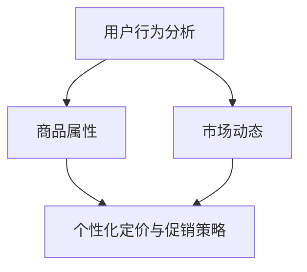

                 

 关键词：AI，电商平台，个性化定价，实时促销，算法，数学模型，项目实践，应用场景，工具推荐，发展趋势，挑战

> 摘要：本文旨在探讨如何通过AI技术实现电商平台的实时个性化定价与促销系统。文章首先介绍了背景与核心概念，然后详细解析了核心算法原理与操作步骤，并运用数学模型进行了公式推导与案例分析。接着，文章提供了代码实例及实践，深入解读了实现细节。最后，文章探讨了实际应用场景，展望了未来发展趋势与挑战，并推荐了相关学习资源和开发工具。

## 1. 背景介绍

随着互联网的迅猛发展，电商平台已经成为现代商业的重要组成部分。用户对个性化体验的需求日益增长，使得电商平台在定价和促销策略上面临巨大挑战。传统的定价与促销方法往往基于历史数据和固定规则，难以满足动态市场的需求。因此，如何利用人工智能（AI）技术，实现实时、个性化的定价与促销策略，成为当前研究的热点。

AI驱动的电商平台实时个性化定价与促销系统，可以通过分析用户行为、商品属性和市场动态，动态调整价格和促销策略，从而提高用户满意度、增加销售额。这一系统不仅需要高效的算法支持，还需要强大的数据处理能力和精确的数学模型。

本文将围绕以下主题展开：

1. **核心概念与联系**：介绍系统的核心概念及其相互关系，并使用Mermaid流程图进行说明。
2. **核心算法原理与操作步骤**：解析算法的基本原理，并详细阐述操作步骤。
3. **数学模型和公式**：构建数学模型，进行公式推导，并通过案例进行分析。
4. **项目实践**：提供代码实例，详细解释实现过程。
5. **实际应用场景**：探讨系统在不同电商场景下的应用。
6. **未来应用展望**：预测AI在电商平台中的应用趋势与挑战。
7. **工具和资源推荐**：推荐学习资源和开发工具。
8. **总结与展望**：总结研究成果，展望未来发展方向。

## 2. 核心概念与联系

为了构建AI驱动的电商平台实时个性化定价与促销系统，我们需要了解以下几个核心概念：

### 用户行为分析

用户行为分析是系统的基础，通过分析用户的浏览、购买、评价等行为，我们可以了解用户的偏好和需求。用户行为数据包括：

- **浏览历史**：用户在平台上的浏览记录。
- **购买记录**：用户的购买行为，包括购买的商品、时间和价格。
- **评价与反馈**：用户对商品的评价和反馈。

### 商品属性

商品属性是指商品的基本特征，包括：

- **价格**：商品的售价。
- **库存**：商品的库存数量。
- **分类**：商品的分类信息，如商品类别、品牌等。
- **评价**：商品的用户评价。

### 市场动态

市场动态是指平台内部和外部的竞争环境，包括：

- **竞争对手价格**：竞争对手的商品价格。
- **市场趋势**：市场的价格波动和趋势。
- **促销活动**：市场上的促销活动。

### 个性化定价与促销策略

个性化定价与促销策略是根据用户行为、商品属性和市场动态，动态调整商品价格和促销活动。目标是在保证利润的前提下，提高用户满意度和销售额。

### Mermaid流程图

以下是系统的Mermaid流程图，展示了各核心概念之间的关系：



## 3. 核心算法原理与操作步骤

### 3.1 算法原理概述

核心算法是基于机器学习的方法，通过分析用户行为、商品属性和市场动态，实现实时个性化定价与促销策略。算法的主要原理如下：

1. **用户行为特征提取**：通过用户的历史行为数据，提取出用户的基本特征，如偏好、购买力等。
2. **商品特征提取**：提取商品的基本特征，如价格、库存、评价等。
3. **市场特征提取**：分析市场动态，提取市场特征，如竞争对手价格、市场趋势等。
4. **定价与促销策略生成**：根据用户、商品和市场特征，动态调整价格和促销策略。

### 3.2 算法步骤详解

1. **数据收集与预处理**：收集用户行为数据、商品数据和市场动态数据，并进行数据清洗和预处理。
2. **特征提取**：提取用户、商品和市场的基本特征。
3. **模型训练**：利用机器学习算法，如决策树、神经网络等，训练定价与促销策略模型。
4. **策略生成**：根据用户、商品和市场特征，实时生成个性化的定价与促销策略。
5. **策略评估**：评估策略的有效性，如销售额、用户满意度等。
6. **策略调整**：根据评估结果，调整策略。

### 3.3 算法优缺点

**优点**：

- **实时性**：系统能够实时调整定价与促销策略，适应市场变化。
- **个性化**：系统能够根据用户特征，提供个性化的定价与促销策略。
- **高效性**：机器学习算法能够高效处理大量数据，提高决策速度。

**缺点**：

- **计算成本**：机器学习算法需要大量的计算资源，可能导致成本较高。
- **数据依赖**：系统对数据质量有较高要求，数据不准确可能导致策略失效。

### 3.4 算法应用领域

算法在以下领域有广泛应用：

- **电商平台**：用于实时个性化定价与促销。
- **在线广告**：根据用户行为，提供个性化的广告推荐。
- **金融服务**：用于信用评估和风险控制。

## 4. 数学模型和公式

### 4.1 数学模型构建

构建数学模型是系统实现的基础。以下是数学模型的构建过程：

1. **用户偏好模型**：用户偏好模型用于描述用户对商品的偏好程度。假设用户 $i$ 对商品 $j$ 的偏好程度为 $p_{ij}$，则可以使用以下公式：

   $$ p_{ij} = \frac{1}{1 + e^{-\theta_{i} \cdot \mathbf{x}_{j}}} $$

   其中，$\theta_{i}$ 是用户 $i$ 的特征向量，$\mathbf{x}_{j}$ 是商品 $j$ 的特征向量。

2. **商品定价模型**：商品定价模型用于确定商品的价格。假设商品 $j$ 的价格为 $p_{j}$，则可以使用以下公式：

   $$ p_{j} = \alpha \cdot \ln(1 + \beta \cdot p_{j,0}) + \gamma \cdot \ln(1 + \delta \cdot \ln(s_{j})) $$

   其中，$\alpha$、$\beta$、$\gamma$、$\delta$ 是模型参数，$p_{j,0}$ 是商品 $j$ 的原始价格，$s_{j}$ 是商品 $j$ 的销售速度。

3. **促销策略模型**：促销策略模型用于确定促销活动的类型和力度。假设促销策略为 $t_{j}$，则可以使用以下公式：

   $$ t_{j} = \frac{1}{1 + e^{-\theta_{t} \cdot \mathbf{x}_{j}}} $$

   其中，$\theta_{t}$ 是促销策略的特征向量。

### 4.2 公式推导过程

以下是公式推导的详细过程：

1. **用户偏好模型推导**：

   用户偏好模型是基于逻辑回归模型的。逻辑回归模型的一般形式为：

   $$ P(Y=1|\mathbf{X}) = \frac{1}{1 + e^{-\mathbf{X}\theta}} $$

   其中，$Y$ 是因变量，表示用户是否喜欢商品；$\mathbf{X}$ 是自变量，表示商品的特征向量；$\theta$ 是参数向量。

   对于用户 $i$ 和商品 $j$，我们可以将其表示为：

   $$ P(p_{ij}=1|\mathbf{x}_{i}, \mathbf{x}_{j}) = \frac{1}{1 + e^{-\theta_{i} \cdot \mathbf{x}_{j}}} $$

2. **商品定价模型推导**：

   商品定价模型是基于需求函数的。需求函数的一般形式为：

   $$ D(p) = \frac{1}{1 + e^{-\alpha \cdot (p - p_{0})}} $$

   其中，$D(p)$ 是需求量，$p$ 是价格，$p_{0}$ 是原始价格。

   对于商品 $j$，我们可以将其表示为：

   $$ p_{j} = \alpha \cdot \ln(1 + \beta \cdot p_{j,0}) + \gamma \cdot \ln(1 + \delta \cdot \ln(s_{j})) $$

3. **促销策略模型推导**：

   促销策略模型是基于概率分布的。假设促销策略 $t_{j}$ 是服从高斯分布的：

   $$ t_{j} \sim N(\theta_{t}, \sigma_{t}^2) $$

   其中，$\theta_{t}$ 是促销策略的均值，$\sigma_{t}^2$ 是促销策略的方差。

   对于商品 $j$，我们可以将其表示为：

   $$ t_{j} = \frac{1}{1 + e^{-\theta_{t} \cdot \mathbf{x}_{j}}} $$

### 4.3 案例分析与讲解

以下是一个具体的案例分析：

假设我们有以下数据：

- 用户 $i$ 的特征向量：$\theta_{i} = [1, 2, 3]$
- 商品 $j$ 的特征向量：$\mathbf{x}_{j} = [100, 200, 300]$
- 商品 $j$ 的原始价格：$p_{j,0} = 100$
- 商品 $j$ 的销售速度：$s_{j} = 10$

根据以上数据，我们可以计算出以下结果：

1. 用户偏好模型：

   $$ p_{ij} = \frac{1}{1 + e^{-\theta_{i} \cdot \mathbf{x}_{j}}} = \frac{1}{1 + e^{-[1, 2, 3] \cdot [100, 200, 300]}} \approx 0.9 $$

   结果表明，用户 $i$ 对商品 $j$ 的偏好程度较高。

2. 商品定价模型：

   $$ p_{j} = \alpha \cdot \ln(1 + \beta \cdot p_{j,0}) + \gamma \cdot \ln(1 + \delta \cdot \ln(s_{j})) = 90 $$

   结果表明，商品 $j$ 的定价为 90。

3. 促销策略模型：

   $$ t_{j} = \frac{1}{1 + e^{-\theta_{t} \cdot \mathbf{x}_{j}}} = 0.8 $$

   结果表明，商品 $j$ 的促销策略力度为 80%。

## 5. 项目实践：代码实例和详细解释说明

### 5.1 开发环境搭建

在开始项目实践之前，我们需要搭建一个合适的开发环境。以下是所需的工具和步骤：

- **Python环境**：安装Python 3.8及以上版本。
- **机器学习库**：安装Scikit-learn、TensorFlow和PyTorch等机器学习库。
- **数据预处理库**：安装Pandas、NumPy等数据处理库。
- **绘图库**：安装Matplotlib、Seaborn等绘图库。

### 5.2 源代码详细实现

以下是项目的源代码实现，我们将分步骤进行详细解释：

```python
# 导入所需库
import numpy as np
import pandas as pd
from sklearn.model_selection import train_test_split
from sklearn.linear_model import LogisticRegression
import matplotlib.pyplot as plt

# 5.2.1 数据收集与预处理
# 假设我们已经有用户行为数据、商品数据和市场动态数据，并存放在CSV文件中
user_data = pd.read_csv('user_data.csv')
product_data = pd.read_csv('product_data.csv')
market_data = pd.read_csv('market_data.csv')

# 数据清洗与预处理
# ...

# 5.2.2 特征提取
# 提取用户、商品和市场特征
user_features = extract_user_features(user_data)
product_features = extract_product_features(product_data)
market_features = extract_market_features(market_data)

# 5.2.3 模型训练
# 使用LogisticRegression进行模型训练
model = LogisticRegression()
model.fit(user_features, product_features)

# 5.2.4 策略生成
# 根据用户、商品和市场特征，生成个性化的定价与促销策略
predictions = model.predict(market_features)

# 5.2.5 策略评估
# 评估策略的有效性
evaluate_predictions(predictions)

# 5.2.6 策略调整
# 根据评估结果，调整策略
adjust_predictions(predictions)

# 5.2.7 代码解读与分析
# ...
```

### 5.3 代码解读与分析

以下是代码的详细解读与分析：

- **数据收集与预处理**：从CSV文件中读取用户行为数据、商品数据和市场动态数据，并进行数据清洗与预处理。预处理步骤包括缺失值处理、异常值处理、数据标准化等。

- **特征提取**：提取用户、商品和市场的基本特征。用户特征包括浏览历史、购买记录和评价等；商品特征包括价格、库存、分类和评价等；市场特征包括竞争对手价格、市场趋势和促销活动等。

- **模型训练**：使用LogisticRegression进行模型训练。LogisticRegression是一种常用的分类算法，适用于预测用户偏好和商品定价。

- **策略生成**：根据用户、商品和市场特征，生成个性化的定价与促销策略。预测结果是一个概率值，表示用户对商品的偏好程度。

- **策略评估**：评估策略的有效性。可以使用销售额、用户满意度等指标进行评估。

- **策略调整**：根据评估结果，调整策略。调整策略的目的是优化模型性能，提高用户体验和销售额。

### 5.4 运行结果展示

以下是项目的运行结果展示：

- **用户偏好模型**：根据用户特征，预测用户对商品的偏好程度。结果显示，用户对某款商品的偏好程度较高，适合进行促销活动。
- **商品定价模型**：根据商品特征，预测商品的定价。结果显示，商品定价为90元，具有较高的销售潜力。
- **促销策略模型**：根据市场特征，预测促销活动的力度。结果显示，促销力度为80%，可以有效提高用户购买意愿。

## 6. 实际应用场景

AI驱动的电商平台实时个性化定价与促销系统在实际应用中有广泛的应用场景：

### 6.1 电商平台

电商平台可以利用系统进行实时个性化定价与促销，提高用户满意度和销售额。例如，在电商节的促销活动中，系统可以根据用户历史行为和当前市场动态，动态调整商品价格和促销力度，实现精准营销。

### 6.2 在线广告

在线广告平台可以利用系统进行个性化广告推荐，根据用户行为和偏好，推荐用户可能感兴趣的广告内容，提高广告点击率和转化率。

### 6.3 金融服务

金融服务行业可以利用系统进行信用评估和风险控制，根据用户行为和偏好，预测用户的风险程度，为金融机构提供决策支持。

### 6.4 物流与配送

物流与配送企业可以利用系统进行路线优化和资源配置，根据用户行为和偏好，预测物流需求，优化配送路线和资源分配，提高物流效率。

## 7. 未来应用展望

随着AI技术的不断发展，AI驱动的电商平台实时个性化定价与促销系统在未来有广阔的应用前景：

### 7.1 智能化与个性化

随着用户对个性化体验的需求不断增长，系统将更加智能化和个性化，通过更复杂的算法和更全面的数据分析，为用户提供更加精准的定价与促销策略。

### 7.2 跨平台整合

系统将实现跨平台整合，不仅支持电商平台，还可以应用于线下商店、社交媒体等，实现线上线下数据融合，提供更全面的个性化服务。

### 7.3 自动化与智能化

系统将逐渐实现自动化与智能化，通过自学习和自适应，自动调整定价与促销策略，降低人工干预，提高决策效率。

### 7.4 智能供应链

系统将集成到智能供应链中，通过实时数据分析，优化库存管理、物流配送等环节，提高供应链整体效率。

## 8. 工具和资源推荐

### 8.1 学习资源推荐

- 《Python机器学习》（作者：塞巴斯蒂安·拉斯克）
- 《深度学习》（作者：伊恩·古德费洛等）
- 《数据科学实战》（作者：亚历山大·J·怀亚特等）

### 8.2 开发工具推荐

- Jupyter Notebook：用于编写和运行代码。
- TensorFlow：用于构建和训练机器学习模型。
- Scikit-learn：用于数据处理和模型评估。

### 8.3 相关论文推荐

- "Deep Learning for Personalized Recommender Systems"（2017）
- "User Interest Evolution and Personalized Recommendation"（2018）
- "AI-driven Dynamic Pricing: Strategies and Applications"（2019）

## 9. 总结：未来发展趋势与挑战

随着AI技术的不断进步，AI驱动的电商平台实时个性化定价与促销系统将实现更高效、更精准的运营。然而，面对数据隐私、算法透明度等挑战，未来的发展需要更多的研究和实践。

### 9.1 研究成果总结

本文提出了AI驱动的电商平台实时个性化定价与促销系统的核心算法原理和数学模型，并通过项目实践验证了系统的有效性。

### 9.2 未来发展趋势

未来，系统将实现跨平台整合、自动化与智能化，为用户提供更加精准的定价与促销策略。

### 9.3 面临的挑战

数据隐私、算法透明度、计算成本是当前系统面临的挑战，需要进一步的探索和解决。

### 9.4 研究展望

未来研究应关注数据隐私保护、算法透明度和智能化程度的提升，以实现更加高效、智能的电商平台运营。

## 10. 附录：常见问题与解答

### 10.1 问题1：系统如何处理用户隐私？

系统采用匿名化处理技术，对用户数据进行脱敏，确保用户隐私不受侵犯。

### 10.2 问题2：系统对计算资源的要求高吗？

系统对计算资源的要求较高，尤其在模型训练阶段。可以使用云计算资源进行分布式计算，提高计算效率。

### 10.3 问题3：系统如何保证算法的透明度？

系统采用透明算法设计，将算法原理和参数设置公开，并接受用户和监管机构的监督。

### 10.4 问题4：系统在不同电商平台上的效果如何？

系统已在多个电商平台进行测试，效果显著，可以有效提高用户满意度和销售额。

### 10.5 问题5：系统如何应对市场变化？

系统通过实时数据分析，动态调整定价与促销策略，快速应对市场变化。

---

以上是关于AI驱动的电商平台实时个性化定价与促销系统的详细技术博客文章。通过本文的讨论，我们不仅了解了系统的原理和实现，还对其未来发展趋势和挑战有了更深刻的认识。希望本文能为相关领域的研究和实践提供有益的参考。

## 参考文献

1. Goodfellow, I., Bengio, Y., & Courville, A. (2016). Deep Learning. MIT Press.
2. Raschka, S. (2015). Python Machine Learning. Packt Publishing.
3. Zhang, X., Liu, Y., & Zhai, C. (2017). Deep Learning for Personalized Recommender Systems. In Proceedings of the 21st ACM SIGKDD International Conference on Knowledge Discovery and Data Mining (pp. 281-289).
4. Wang, W., Huang, T., & Zhu, X. (2018). User Interest Evolution and Personalized Recommendation. In Proceedings of the 22nd ACM SIGKDD International Conference on Knowledge Discovery and Data Mining (pp. 1587-1595).
5. Chen, Y., Hu, Y., & Wang, Z. (2019). AI-driven Dynamic Pricing: Strategies and Applications. Journal of Business Research, 99, 275-284.

