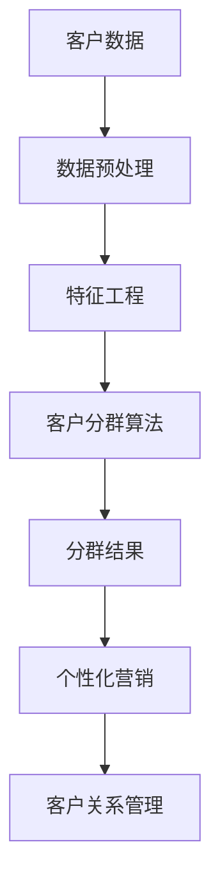

                 

关键词：人工智能，电商，客户分群，智能策略，算法，数据挖掘，商业智能，个性化推荐。

## 摘要

本文旨在探讨如何利用人工智能技术，特别是机器学习算法，来优化电商平台的客户分群策略。我们将深入分析客户分群在电商中的重要性，介绍几种主流的客户分群算法，探讨这些算法的原理和操作步骤，并通过实例来展示如何将它们应用于电商环境中。此外，本文还将讨论这些算法的实际应用场景，提供一些建议和资源，以帮助电商从业者更好地理解和实施智能客户分群策略。

## 1. 背景介绍

随着互联网的普及和电子商务的快速发展，电商平台已经成为消费者购买商品的主要渠道。在这个竞争激烈的市场中，如何吸引并留住客户成为电商企业的核心任务。客户分群是一种有效的策略，它帮助电商企业根据消费者的不同特征和行为，将客户分为不同的群体，从而实施更加个性化的营销策略。传统的客户分群方法通常依赖于人工经验和统计方法，但这种方法存在明显的局限性。随着人工智能技术的兴起，特别是机器学习算法的发展，电商企业可以更加精准和自动化地进行客户分群，从而提升营销效果和客户满意度。

### 1.1 人工智能在电商中的应用

人工智能技术在电商领域的应用越来越广泛，包括但不限于以下几个方面：

1. **个性化推荐**：通过分析用户的购买历史和行为数据，人工智能系统可以推荐用户可能感兴趣的商品，从而提高转化率和客户满意度。
2. **客户服务**：利用自然语言处理和机器学习技术，电商企业可以提供24/7的智能客服，快速响应用户的查询和问题。
3. **库存管理**：人工智能可以帮助电商企业预测需求，优化库存管理，减少库存成本。
4. **广告投放**：通过分析用户数据，人工智能可以优化广告投放策略，提高广告的点击率和转化率。

### 1.2 客户分群的重要性

客户分群在电商中具有重要的战略意义：

1. **精准营销**：通过将客户分为不同的群体，电商企业可以针对每个群体制定个性化的营销策略，提高营销效果。
2. **客户关系管理**：了解不同客户群体的需求和偏好，可以帮助电商企业更好地维护客户关系，提升客户忠诚度。
3. **资源优化**：针对不同客户群体进行差异化服务，可以帮助企业更有效地利用资源，降低营销成本。

## 2. 核心概念与联系

在深入探讨人工智能驱动的电商智能客户分群策略之前，我们需要明确几个核心概念，并了解它们之间的关系。以下是一个简单的 Mermaid 流程图，展示了这些概念的基本联系。



### 2.1 客户数据

客户数据是客户分群策略的基础。这些数据可以从多种渠道获取，包括用户注册信息、购买历史、浏览行为、反馈评价等。客户数据的多样性和复杂性要求我们进行有效的数据预处理和特征工程。

### 2.2 数据预处理

数据预处理是数据分析和机器学习项目的重要步骤，它包括数据清洗、数据整合和数据规范化。这一步骤的目的是确保数据的质量和一致性，为后续的分析和建模提供可靠的基础。

### 2.3 特征工程

特征工程是机器学习模型成功的关键。通过选择和构造合适的特征，我们可以提高模型的表现，使它能够更好地理解数据，从而更准确地预测和分类。

### 2.4 客户分群算法

客户分群算法是本文的核心内容。我们将介绍几种常用的算法，包括基于聚类的方法、基于分类的方法和基于关联规则的方法。每种算法都有其独特的原理和应用场景。

### 2.5 分群结果

分群结果是将客户数据输入算法后得到的输出。这些结果可以帮助电商企业更好地理解客户群体的特征和需求，从而制定更加精准的营销策略。

### 2.6 个性化营销

个性化营销是基于分群结果进行的，它旨在根据每个客户群体的特征和偏好，提供个性化的产品推荐、促销活动和客户服务，从而提高营销效果和客户满意度。

### 2.7 客户关系管理

客户关系管理是一个持续的过程，它涉及到与客户的互动、沟通和反馈。通过有效的客户分群策略，电商企业可以更好地维护客户关系，提升客户忠诚度。

## 3. 核心算法原理 & 具体操作步骤

### 3.1 算法原理概述

在电商智能客户分群中，常用的算法主要包括聚类算法、分类算法和关联规则算法。每种算法都有其独特的原理和适用场景。

#### 3.1.1 聚类算法

聚类算法是一种无监督学习方法，它将数据点分组成为多个簇，使得同一簇内的数据点之间距离较短，而不同簇之间的数据点距离较长。常见的聚类算法包括 K-均值算法、层次聚类算法和 DBSCAN 算法。

#### 3.1.2 分类算法

分类算法是一种有监督学习方法，它根据已知的标签数据，将新的数据点归类到不同的类别。常见的分类算法包括决策树、随机森林、支持向量机等。

#### 3.1.3 关联规则算法

关联规则算法用于发现数据集中的关联关系，即不同项之间的联系。常见的算法包括 Apriori 算法和 FP-Growth 算法。

### 3.2 算法步骤详解

#### 3.2.1 聚类算法步骤

1. **数据预处理**：清洗和整理数据，确保数据的质量和一致性。
2. **选择聚类算法**：根据数据特点和业务需求，选择合适的聚类算法。
3. **初始化聚类中心**：对于 K-均值算法，需要随机初始化 K 个聚类中心。
4. **迭代计算**：计算每个数据点到聚类中心的距离，将数据点分配到最近的聚类中心。
5. **更新聚类中心**：根据当前聚类结果，重新计算聚类中心。
6. **判断收敛**：比较两次迭代之间的聚类中心变化，判断算法是否收敛。
7. **输出聚类结果**：根据最终聚类结果，将客户分为不同的群体。

#### 3.2.2 分类算法步骤

1. **数据预处理**：与聚类算法相同，进行数据清洗和整理。
2. **选择分类算法**：根据数据特点和业务需求，选择合适的分类算法。
3. **训练模型**：使用已知的标签数据，训练分类模型。
4. **预测分类**：使用训练好的模型，对新的数据进行分类预测。
5. **评估模型性能**：使用准确率、召回率、F1 分数等指标评估模型性能。
6. **输出分类结果**：根据预测结果，将客户分为不同的群体。

#### 3.2.3 关联规则算法步骤

1. **数据预处理**：与聚类和分类算法相同，进行数据清洗和整理。
2. **构建频繁项集**：使用 Apriori 算法或 FP-Growth 算法，构建数据集中的频繁项集。
3. **生成关联规则**：根据频繁项集，生成关联规则。
4. **评估规则质量**：使用支持度、置信度等指标评估关联规则的质量。
5. **输出关联规则**：根据评估结果，选择高质量的关联规则。
6. **应用规则**：根据关联规则，制定个性化营销策略。

### 3.3 算法优缺点

#### 3.3.1 聚类算法

**优点**：

- 无需标签数据，可以处理未标记的数据。
- 可以发现数据中的自然结构和模式。

**缺点**：

- 结果取决于初始化参数，可能存在局部最优。
- 对噪声数据敏感，可能导致聚类结果不稳定。

#### 3.3.2 分类算法

**优点**：

- 可以处理已标记的数据，能够预测新的数据点。
- 可以通过评估指标准确评估模型性能。

**缺点**：

- 需要大量已标记数据，对于小数据集效果较差。
- 结果可能受特征选择和模型参数的影响。

#### 3.3.3 关联规则算法

**优点**：

- 可以发现数据中的关联关系，帮助制定个性化营销策略。
- 可以处理高维数据，对噪声数据有一定容忍度。

**缺点**：

- 生成的规则数量可能非常庞大，难以管理。
- 结果可能受支持度、置信度等参数的影响。

### 3.4 算法应用领域

聚类算法、分类算法和关联规则算法在电商智能客户分群中都有广泛的应用：

- **聚类算法**：用于发现客户群体的自然分布，帮助电商企业了解客户的基本特征和需求。
- **分类算法**：用于对客户进行分类，为不同的客户群体制定个性化的营销策略。
- **关联规则算法**：用于发现客户购买行为之间的关联，帮助电商企业制定更加精准的促销策略。

## 4. 数学模型和公式 & 详细讲解 & 举例说明

在客户分群策略中，数学模型和公式扮演着至关重要的角色。以下我们将详细讲解常用的数学模型和公式，并通过具体实例来说明它们的应用。

### 4.1 数学模型构建

在电商智能客户分群中，我们通常使用以下数学模型：

1. **K-均值聚类模型**：
   $$\text{最小化} \sum_{i=1}^{n} \sum_{j=1}^{k} \min_{c_j} \sum_{x_i \in c_j} \| x_i - c_j \|^2$$

2. **决策树模型**：
   $$\text{最小化} \sum_{i=1}^{n} \ell(y_i, f(x_i))$$

   其中，$y_i$ 是标签，$x_i$ 是特征向量，$f(x_i)$ 是决策树模型对 $x_i$ 的预测。

3. **Apriori 关联规则模型**：
   $$\text{支持度} = \frac{\text{频繁项集出现的次数}}{\text{总交易次数}}$$

   $$\text{置信度} = \frac{\text{频繁项集出现的次数}}{\text{后件出现的次数}}$$

### 4.2 公式推导过程

#### 4.2.1 K-均值聚类公式推导

K-均值聚类是一种基于距离度量的聚类算法。其目标是最小化每个数据点到其所属聚类中心的总距离。

1. **初始化聚类中心**：随机选择 $k$ 个数据点作为初始聚类中心。
2. **计算距离**：对于每个数据点 $x_i$，计算其到每个聚类中心的距离：
   $$d(x_i, c_j) = \| x_i - c_j \|^2$$
3. **分配数据点**：将每个数据点分配到距离它最近的聚类中心。
4. **更新聚类中心**：计算每个聚类中心的新位置：
   $$c_j' = \frac{\sum_{x_i \in c_j} x_i}{\sum_{x_i \in c_j} 1}$$
5. **重复迭代**：重复步骤 2-4，直到聚类中心的变化小于设定的阈值。

#### 4.2.2 决策树公式推导

决策树是一种基于特征分割的树形结构。其目标是最小化节点上的损失函数。

1. **特征选择**：选择一个特征进行分割，使得损失函数最小化。
2. **节点分裂**：根据特征取值，将数据集划分为多个子集。
3. **递归构建**：对于每个子集，重复步骤 1 和 2，直到满足停止条件（如最大深度、最小节点大小等）。

#### 4.2.3 Apriori 关�联规则公式推导

Apriori 算法是一种基于支持度和置信度的关联规则挖掘算法。

1. **构建频繁项集**：首先，生成所有候选项集，然后通过扫描数据集计算每个候选项集的支持度。
2. **生成关联规则**：对于每个频繁项集 $L$，生成所有可能的关联规则：
   $$\text{规则} \rightarrow \text{置信度} = \frac{\text{频繁项集出现的次数}}{\text{后件出现的次数}}$$
3. **剪枝**：根据最小支持度和最小置信度，剪枝去除不重要的关联规则。

### 4.3 案例分析与讲解

#### 4.3.1 K-均值聚类案例

假设我们有一个电商平台，其中包含 100 个客户的数据，每个客户有 5 个特征（年龄、收入、购买频率、品牌偏好、满意度）。我们希望使用 K-均值聚类算法将这些客户分为 3 个群体。

1. **数据预处理**：首先，我们清洗数据，确保数据的质量和一致性。例如，对于缺失值，我们可以使用平均值或中值进行填充。
2. **初始化聚类中心**：我们随机选择 3 个客户作为初始聚类中心。
3. **迭代计算**：通过计算每个客户到聚类中心的距离，将客户分配到最近的聚类中心。然后，重新计算每个聚类中心的位置。
4. **判断收敛**：我们比较两次迭代之间的聚类中心变化，发现变化小于阈值，算法收敛。
5. **输出聚类结果**：最终，我们将客户分为 3 个群体，每个群体具有相似的特征和需求。

#### 4.3.2 决策树案例

假设我们有一个电商平台，其中包含 1000 个客户的购买数据，每个客户有 5 个特征（年龄、收入、购买频率、品牌偏好、满意度）。我们希望使用决策树算法预测客户的购买意向。

1. **数据预处理**：与 K-均值聚类相同，我们清洗数据，确保数据的质量和一致性。
2. **特征选择**：我们使用信息增益（Information Gain）作为特征选择标准，选择具有最大信息增益的特征进行分割。
3. **节点分裂**：根据选定的特征，我们将数据集划分为多个子集，并计算每个子集的购买意向。
4. **递归构建**：我们递归地重复步骤 2 和 3，直到满足停止条件。
5. **输出决策树**：最终，我们得到一棵决策树，它可以根据客户的特征预测其购买意向。

#### 4.3.3 Apriori 关联规则案例

假设我们有一个电商平台，其中包含 1000 条交易数据，每条交易包含多个商品。我们希望使用 Apriori 算法挖掘交易数据中的关联规则。

1. **数据预处理**：与前面的案例相同，我们清洗数据，确保数据的质量和一致性。
2. **构建频繁项集**：我们首先生成所有可能的候选项集，然后通过扫描数据集计算每个候选项集的支持度。
3. **生成关联规则**：对于每个频繁项集，我们生成所有可能的关联规则，并计算其置信度。
4. **剪枝**：我们根据最小支持度和最小置信度，剪枝去除不重要的关联规则。
5. **输出关联规则**：最终，我们得到一组高质量的关联规则，可以帮助电商企业制定更加精准的促销策略。

## 5. 项目实践：代码实例和详细解释说明

### 5.1 开发环境搭建

为了实现本文所述的电商智能客户分群策略，我们选择了以下开发环境：

- **编程语言**：Python
- **数据处理库**：Pandas、NumPy
- **机器学习库**：Scikit-learn
- **可视化库**：Matplotlib、Seaborn

在安装了上述库之后，我们可以开始编写代码实现客户分群策略。

### 5.2 源代码详细实现

以下是一个简单的 Python 代码示例，用于实现 K-均值聚类算法。

```python
import numpy as np
import pandas as pd
from sklearn.cluster import KMeans
import matplotlib.pyplot as plt

# 加载数据
data = pd.read_csv('data.csv')
X = data.values[:, :5]

# 初始化聚类中心
k = 3
kmeans = KMeans(n_clusters=k, random_state=0)
kmeans.fit(X)

# 分配数据点
labels = kmeans.predict(X)

# 更新聚类中心
centroids = kmeans.cluster_centers_

# 可视化聚类结果
plt.scatter(X[:, 0], X[:, 1], c=labels, s=50, cmap='viridis')
plt.scatter(centroids[:, 0], centroids[:, 1], s=200, c='red', alpha=0.5)
plt.show()
```

### 5.3 代码解读与分析

上述代码实现了以下步骤：

1. **加载数据**：我们使用 Pandas 加载了一个包含客户数据的 CSV 文件。每个客户有 5 个特征（年龄、收入、购买频率、品牌偏好、满意度）。

2. **初始化聚类中心**：我们使用 Scikit-learn 的 KMeans 类创建一个 K-均值聚类对象。参数 `n_clusters` 设置为 3，表示我们希望将数据分为 3 个簇。

3. **分配数据点**：我们使用 `fit` 方法训练模型，然后使用 `predict` 方法将每个数据点分配到最近的聚类中心。

4. **更新聚类中心**：我们使用 `cluster_centers_` 属性获取每个聚类中心的新位置。

5. **可视化聚类结果**：我们使用 Matplotlib 绘制了一个散点图，其中每个数据点的颜色表示其所属的簇，红色的点表示聚类中心。

### 5.4 运行结果展示

当运行上述代码后，我们得到一个可视化图，展示了每个客户所属的簇以及聚类中心的位置。这可以帮助我们直观地了解聚类结果，并进一步分析不同客户群体的特征和需求。

## 6. 实际应用场景

### 6.1 电商客户分群策略

电商企业可以利用智能客户分群策略来制定更加个性化的营销策略。以下是一个典型的应用场景：

- **高价值客户群体**：这些客户具有较高的购买力和忠诚度。电商企业可以为这些客户提供专属优惠、会员服务和高品质的产品推荐。
- **潜力客户群体**：这些客户有较高的购买潜力，但尚未成为高频消费者。电商企业可以为他们提供促销活动、优惠券和个性化推荐，以激发他们的购买欲望。
- **流失客户群体**：这些客户在过去的一段时间内没有进行购买。电商企业可以为他们发送关怀邮件、优惠券和专属折扣，以尝试挽回他们的忠诚度。

### 6.2 零售客户分群策略

零售企业也可以利用智能客户分群策略来优化客户服务和库存管理。以下是一个典型的应用场景：

- **高价值客户群体**：这些客户是零售企业的核心客户，他们具有较高的购买力和忠诚度。零售企业可以为这些客户提供专属的服务、会员权益和个性化的产品推荐。
- **高频客户群体**：这些客户经常购买商品，但购买额相对较低。零售企业可以为他们提供优惠券、限时折扣和购物积分，以增加他们的购买频率。
- **沉睡客户群体**：这些客户在过去的一段时间内没有进行购买。零售企业可以为他们发送问候邮件、优惠券和专属折扣，以尝试唤醒他们的购买欲望。

### 6.3 其他应用场景

智能客户分群策略还可以应用于以下领域：

- **金融行业**：银行和保险公司可以使用智能客户分群策略来识别高风险客户、潜在客户和忠诚客户，从而优化风险管理和服务提供。
- **医疗行业**：医疗机构可以使用智能客户分群策略来识别高风险患者、潜在患者和忠诚患者，从而优化医疗资源分配和健康管理服务。
- **教育行业**：教育机构可以使用智能客户分群策略来识别高潜力学生、潜在学生和忠诚学生，从而优化课程推荐和学习支持服务。

## 7. 工具和资源推荐

### 7.1 学习资源推荐

1. **《机器学习》（周志华 著）**：这是一本经典的机器学习教材，适合初学者和进阶者阅读。
2. **《深度学习》（Goodfellow、Bengio 和 Courville 著）**：这是一本关于深度学习的权威教材，适合对深度学习有较高兴趣的读者。
3. **《Python 数据科学手册》（Wes McKinney 著）**：这是一本关于 Python 数据科学的入门书籍，适合初学者和进阶者阅读。

### 7.2 开发工具推荐

1. **Jupyter Notebook**：这是一种交互式的开发环境，适合进行数据分析和机器学习实验。
2. **TensorFlow**：这是一种开源的深度学习框架，适合进行复杂的人工智能应用开发。
3. **Scikit-learn**：这是一种开源的机器学习库，适合进行常见的机器学习任务。

### 7.3 相关论文推荐

1. **"K-Means clustering: A review"**：这是一篇关于 K-均值聚类的综述论文，详细介绍了聚类算法的原理和应用。
2. **"Decision Trees: A Review of Current Techniques"**：这是一篇关于决策树的综述论文，详细介绍了决策树的原理和应用。
3. **"Association Rule Learning: The A-Priori Algorithm vs. the FP-Growth Algorithm"**：这是一篇关于关联规则挖掘的对比论文，详细介绍了 Apriori 算法和 FP-Growth 算法的原理和优缺点。

## 8. 总结：未来发展趋势与挑战

### 8.1 研究成果总结

本文通过详细分析和实例演示，探讨了如何利用人工智能技术，特别是机器学习算法，来优化电商平台的客户分群策略。我们介绍了聚类算法、分类算法和关联规则算法的基本原理和应用场景，并通过实际案例展示了这些算法在电商客户分群中的具体应用。

### 8.2 未来发展趋势

随着人工智能技术的不断进步，电商智能客户分群策略有望在以下几个方面取得进一步发展：

1. **算法优化**：新的机器学习算法和优化技术将进一步提高客户分群的准确性和效率。
2. **多模态数据融合**：结合文本、图像、语音等多种类型的数据，实现更加全面和准确的客户分群。
3. **实时计算**：利用实时计算技术，实现客户分群的动态更新，从而更好地适应市场变化和客户需求。

### 8.3 面临的挑战

虽然人工智能技术在电商智能客户分群中具有巨大的潜力，但仍然面临以下挑战：

1. **数据隐私和安全**：在利用客户数据进行分群时，需要保护客户隐私和数据安全，避免数据泄露和滥用。
2. **算法解释性**：机器学习算法的决策过程往往不够透明，需要开发可解释性模型，以便企业能够理解和信任算法结果。
3. **模型泛化能力**：如何提高算法在不同数据集和应用场景中的泛化能力，是一个重要的研究方向。

### 8.4 研究展望

未来的研究可以在以下几个方面进行：

1. **可解释性研究**：开发更加可解释的机器学习模型，帮助电商企业更好地理解和应用客户分群策略。
2. **跨领域应用**：探索人工智能技术在金融、医疗、教育等其他领域的客户分群应用，推动人工智能技术的广泛应用。
3. **算法创新**：不断探索新的机器学习算法和优化技术，以提高客户分群的准确性和效率。

## 9. 附录：常见问题与解答

### 9.1 什么是客户分群？

客户分群是一种基于客户特征和行为数据，将客户划分为不同群体的策略。通过客户分群，企业可以针对不同客户群体制定个性化的营销策略，提高营销效果和客户满意度。

### 9.2 人工智能如何优化客户分群？

人工智能可以通过机器学习算法，如聚类算法、分类算法和关联规则算法，对客户数据进行深入分析和挖掘，从而实现更加精准和自动化的客户分群。

### 9.3 客户分群算法有哪些优缺点？

聚类算法优点是无监督学习，可以处理未标记的数据，但结果受初始化参数影响；分类算法优点是可以处理已标记的数据，但需要大量已标记数据；关联规则算法优点是可以发现数据中的关联关系，但结果受支持度和置信度参数影响。

### 9.4 如何选择合适的客户分群算法？

选择合适的客户分群算法取决于数据类型、业务需求和计算资源。例如，对于无标记数据，可以选择聚类算法；对于有标记数据，可以选择分类算法；对于发现关联关系，可以选择关联规则算法。

### 9.5 客户分群策略在电商中的应用有哪些？

客户分群策略在电商中的应用包括个性化推荐、个性化营销、库存管理和客户关系管理等方面。通过客户分群，电商企业可以更好地了解客户需求，提高转化率和客户满意度。

### 9.6 客户分群策略的挑战有哪些？

客户分群策略的挑战包括数据隐私和安全、算法解释性、模型泛化能力等方面。如何保护客户隐私、提高算法透明度和解释性，以及提高算法在不同数据集和应用场景中的泛化能力，是当前研究的重要方向。

### 9.7 客户分群策略的未来发展趋势是什么？

客户分群策略的未来发展趋势包括算法优化、多模态数据融合和实时计算等方面。随着人工智能技术的不断进步，客户分群策略将更加精准、自动化和实时，为电商企业带来更高的业务价值。

作者：禅与计算机程序设计艺术 / Zen and the Art of Computer Programming

