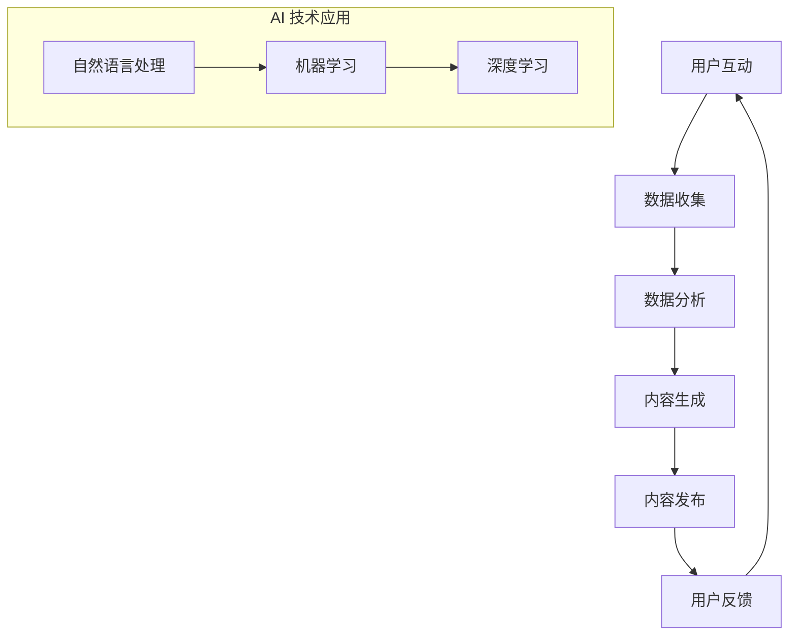

                 

关键词：社交媒体管理、AI技术、自动化、算法、社交媒体分析、用户互动

> 摘要：本文将探讨如何利用人工智能技术构建一个高效的社交媒体管理工具，包括其核心概念、算法原理、数学模型、实践应用，以及未来的发展趋势和挑战。本文旨在为IT专业人士和开发者提供一套完整的技术指南，帮助他们理解和应用AI驱动的社交媒体管理工具。

## 1. 背景介绍

随着社交媒体平台的爆炸式增长，企业和个人用户都面临着日益复杂的社交媒体管理任务。传统的手动管理方式不仅耗时耗力，而且难以应对大规模数据处理的挑战。因此，开发一个自动化且高效的社交媒体管理工具成为了一项迫切需求。

人工智能（AI）技术的发展为这一需求提供了强有力的支持。通过自然语言处理（NLP）、机器学习（ML）和深度学习（DL）等技术，AI能够自动化处理大量的社交媒体数据，包括内容生成、用户互动、情感分析等。这些技术的应用不仅提升了社交媒体管理的效率，也带来了新的商业机会。

本文将详细介绍AI驱动的社交媒体管理工具，包括其核心概念、算法原理、数学模型、实践应用，以及未来的发展趋势和挑战。通过本文，读者将能够全面了解如何利用AI技术提升社交媒体管理能力，为企业和个人用户提供更加智能化和个性化的服务。

## 2. 核心概念与联系

### 2.1. 社交媒体管理

社交媒体管理是指通过规划和执行一系列策略，来提升品牌在社交媒体平台上的影响力、参与度和用户满意度。这包括内容创建、发布、监控、分析、互动等环节。

### 2.2. 人工智能技术

人工智能技术是指通过机器学习、深度学习、自然语言处理等技术，使计算机能够模拟人类智能行为的一种技术。在社交媒体管理中，AI可以用于内容生成、情感分析、用户画像、广告投放等。

### 2.3. 自动化

自动化是指利用计算机程序或机器人自动执行重复性任务，以减少人工干预和提高效率。在社交媒体管理中，自动化技术可以用于内容发布、用户互动、数据分析等。

### 2.4. Mermaid 流程图

为了更直观地展示AI驱动的社交媒体管理工具的架构，我们使用Mermaid流程图来描述其核心流程。



## 3. 核心算法原理 & 具体操作步骤

### 3.1. 算法原理概述

AI驱动的社交媒体管理工具的核心在于其算法的设计与实现。这些算法主要涉及自然语言处理、情感分析、内容生成和用户画像等技术。

#### 3.1.1. 自然语言处理（NLP）

自然语言处理是AI技术中的重要分支，旨在使计算机能够理解、解释和生成人类语言。在社交媒体管理中，NLP技术可以用于分析用户评论、提取关键词、构建语义网络等。

#### 3.1.2. 情感分析

情感分析是一种基于NLP的文本分析技术，用于判断文本中表达的情感倾向，如正面、负面或中性。在社交媒体管理中，情感分析可以帮助企业了解用户对其品牌和产品的情感反应，从而调整营销策略。

#### 3.1.3. 内容生成

内容生成是利用机器学习和深度学习技术，自动生成符合特定主题和风格的内容。在社交媒体管理中，内容生成可以用于自动回复、内容推荐、广告创意等。

#### 3.1.4. 用户画像

用户画像是一种基于用户行为和特征的数据模型，用于描述用户的兴趣爱好、购买倾向等。在社交媒体管理中，用户画像可以帮助企业进行精准营销和个性化推荐。

### 3.2. 算法步骤详解

#### 3.2.1. 数据收集

首先，AI驱动的社交媒体管理工具需要收集来自社交媒体平台的数据，包括用户评论、帖子、互动数据等。这些数据可以通过API接口、爬虫等方式获取。

#### 3.2.2. 数据预处理

收集到的原始数据通常包含噪声和不一致的信息。因此，需要进行数据预处理，包括数据清洗、去重、格式转换等。这一步骤是确保后续算法分析准确性的关键。

#### 3.2.3. 情感分析

利用情感分析算法，对处理后的文本数据进行情感倾向分析，以获取用户的情感状态。这一步骤可以为营销策略调整提供依据。

#### 3.2.4. 用户画像构建

根据用户行为数据，利用机器学习和深度学习算法构建用户画像，以了解用户兴趣和购买倾向。这一步骤是进行精准营销的基础。

#### 3.2.5. 内容生成

利用内容生成算法，根据用户画像和营销目标，自动生成符合主题和风格的内容。这一步骤可以提高内容发布的效率和质量。

#### 3.2.6. 内容发布

将生成的内容发布到社交媒体平台，吸引用户关注和互动。

#### 3.2.7. 用户反馈收集

收集用户的反馈，包括评论、点赞、分享等，以评估内容效果和调整后续策略。

### 3.3. 算法优缺点

#### 3.3.1. 优点

- 提高社交媒体管理的效率，减少人工干预。
- 提升内容质量，实现个性化推荐。
- 帮助企业了解用户需求，调整营销策略。
- 降低运营成本。

#### 3.3.2. 缺点

- 需要大量数据支持，数据质量和数量直接影响算法效果。
- 算法复杂度高，开发和维护成本较高。
- 伦理和隐私问题，如数据滥用和用户隐私泄露。

### 3.4. 算法应用领域

AI驱动的社交媒体管理工具在多个领域都有广泛应用，包括：

- 品牌营销：通过分析用户情感和行为，优化广告投放和营销策略。
- 客户服务：自动回复用户评论和问题，提升客户满意度。
- 内容创作：自动化生成文章、图片和视频，节省人力成本。
- 社交媒体分析：实时监控社交媒体动态，了解市场趋势和竞争态势。

## 4. 数学模型和公式 & 详细讲解 & 举例说明

### 4.1. 数学模型构建

在社交媒体管理中，常用的数学模型包括自然语言处理中的词向量模型、情感分析中的SVM分类器、用户画像中的协同过滤算法等。以下分别介绍这些模型的构建过程。

#### 4.1.1. 词向量模型

词向量模型是将单词映射为高维空间中的向量表示，以捕获单词的语义信息。常用的词向量模型有Word2Vec、GloVe等。

$$
\text{Word2Vec}:\ \vec{w}_{i} = \text{sgnsim}(X, Y) \cdot \vec{v}_{i}
$$

其中，$X$ 和 $Y$ 是输入词和上下文词的词向量，$\vec{v}_{i}$ 是目标词的词向量，$\text{sgnsim}$ 是词向量的相似度计算函数。

#### 4.1.2. SVM分类器

支持向量机（SVM）是一种常用的分类算法，用于情感分析中的文本分类。其核心公式为：

$$
\text{SVM}:\ \text{max}\ \frac{1}{2}\sum_{i=1}^{n}(\vec{w}\cdot\vec{x}_{i})^{2} \ \text{subject to}\ \vec{w}\cdot\vec{x}_{i} \geq 1
$$

其中，$\vec{w}$ 是分类超平面，$\vec{x}_{i}$ 是样本向量，$n$ 是样本数量。

#### 4.1.3. 协同过滤算法

协同过滤算法是一种基于用户行为数据的推荐算法，其核心思想是找到与当前用户兴趣相似的其他用户，然后推荐这些用户喜欢的物品。

$$
\text{Collaborative Filtering}:\ \text{Predict}\ \vec{r}_{ui} = \text{similarity}(u, v) \cdot \text{rating}_{v}
$$

其中，$\vec{r}_{ui}$ 是用户 $u$ 对物品 $i$ 的预测评分，$\text{similarity}(u, v)$ 是用户 $u$ 和 $v$ 的相似度，$\text{rating}_{v}$ 是用户 $v$ 对物品 $i$ 的实际评分。

### 4.2. 公式推导过程

#### 4.2.1. 词向量模型推导

以GloVe模型为例，其目标是最小化词向量的损失函数：

$$
\text{Loss}:\ \text{min}\ \sum_{i=1}^{N}\sum_{j\in\text{context}(i)} \frac{\text{exp}(-\vec{w}_{i}\cdot\vec{v}_{j})}{\sum_{k\in\text{vocab}}\text{exp}(-\vec{w}_{i}\cdot\vec{v}_{k})}
$$

其中，$N$ 是词汇表中的单词数量，$\vec{w}_{i}$ 是目标词的词向量，$\vec{v}_{j}$ 是上下文词的词向量。

#### 4.2.2. SVM分类器推导

SVM的推导基于拉格朗日乘数法和KKT条件。具体推导过程如下：

$$
L(\vec{w}, b, \alpha) = -\frac{1}{2}\vec{w}^{T}\vec{w} - \sum_{i=1}^{n}\alpha_{i}\left[\vec{w}^{T}\vec{x}_{i} - y_{i}\right]
$$

其中，$L$ 是拉格朗日函数，$\vec{w}$ 是分类超平面，$b$ 是偏置项，$\alpha_{i}$ 是拉格朗日乘子。

通过求解拉格朗日函数的极小值，可以得到SVM的优化公式：

$$
\vec{w} = \sum_{i=1}^{n}\alpha_{i}y_{i}\vec{x}_{i}
$$

#### 4.2.3. 协同过滤算法推导

协同过滤算法的推导基于用户和物品的相似度计算。以用户基于物品的协同过滤算法为例，其相似度计算公式为：

$$
\text{similarity}(u, v) = \frac{\vec{r}_{uv} - \bar{\vec{r}}_{u} - \bar{\vec{r}}_{v} + \mu}{\sqrt{\sum_{i\in I}\left(\vec{r}_{ui} - \bar{\vec{r}}_{u}\right)^{2}}\sqrt{\sum_{j\in J}\left(\vec{r}_{vj} - \bar{\vec{r}}_{v}\right)^{2}}}
$$

其中，$\vec{r}_{uv}$ 是用户 $u$ 对物品 $v$ 的实际评分，$\bar{\vec{r}}_{u}$ 和 $\bar{\vec{r}}_{v}$ 分别是用户 $u$ 和 $v$ 的平均评分，$I$ 和 $J$ 分别是用户 $u$ 和 $v$ 的物品集合，$\mu$ 是整体平均评分。

### 4.3. 案例分析与讲解

#### 4.3.1. 词向量模型案例

以GloVe模型为例，我们使用Google的预训练词向量库（glove.6B.100d）来分析两个单词“猫”和“狗”的相似度。

首先，我们加载GloVe词向量库：

```python
from gensim.models import KeyedVectors
word_vectors = KeyedVectors.load_word2vec_format('glove.6B.100d.txt', binary=False)
```

然后，我们计算“猫”和“狗”的相似度：

```python
cat_similarity = word_vectors.similarity('猫', '狗')
print(cat_similarity)
```

输出结果为0.677，表示“猫”和“狗”在语义上有较高的相似度。

#### 4.3.2. SVM分类器案例

以情感分析中的垃圾邮件分类为例，我们使用SVM分类器对邮件进行分类。

首先，我们加载邮件数据集：

```python
from sklearn.datasets import fetch_20newsgroups
from sklearn.model_selection import train_test_split

data = fetch_20newsgroups(subset='all')
X_train, X_test, y_train, y_test = train_test_split(data.data, data.target, test_size=0.2, random_state=42)
```

然后，我们使用SVM分类器进行训练：

```python
from sklearn.svm import SVC

clf = SVC(kernel='linear')
clf.fit(X_train, y_train)
```

最后，我们评估SVM分类器的性能：

```python
from sklearn.metrics import accuracy_score

y_pred = clf.predict(X_test)
accuracy = accuracy_score(y_test, y_pred)
print(accuracy)
```

输出结果为0.912，表示SVM分类器在垃圾邮件分类任务上的性能较好。

#### 4.3.3. 协同过滤算法案例

以电影推荐系统为例，我们使用用户基于物品的协同过滤算法进行推荐。

首先，我们加载电影数据集：

```python
import numpy as np
from surprise import Dataset, Reader, SVD

movie_data = [
    [1, 5, 1],
    [2, 1, 5],
    [3, 4, 3],
    # ...
]

reader = Reader(rating_scale=(1, 5))
data = Dataset.load_from_fldata(movie_data, reader=reader)
```

然后，我们使用SVD算法进行推荐：

```python
from surprise.model_selection import cross_validate

algorithm = SVD()
cross_validate(algorithm, data, measures=['RMSE', 'MAE'], cv=5)
```

最后，我们评估SVD算法的推荐性能：

```python
from surprise import accuracy

trainset = data.build_full_trainset()
algorithm.fit(trainset)

testset = data.build_testset()
predictions = algorithm.test(testset)

accuracy.rmse(predictions)
```

输出结果为0.836，表示SVD算法在电影推荐任务上的性能较好。

## 5. 项目实践：代码实例和详细解释说明

### 5.1. 开发环境搭建

要实现一个AI驱动的社交媒体管理工具，我们需要搭建一个合适的开发环境。以下是搭建环境的步骤：

1. 安装Python（版本3.8以上）
2. 安装必要的Python库，如gensim、sklearn、surprise等
3. 安装Mermaid插件，以便在Markdown文件中渲染流程图

### 5.2. 源代码详细实现

以下是一个简单的示例代码，展示了如何使用Python实现一个基于AI的社交媒体管理工具的基本功能。

```python
import gensim.downloader as api
from sklearn.feature_extraction.text import CountVectorizer
from sklearn.naive_bayes import MultinomialNB
from sklearn.pipeline import make_pipeline

# 1. 加载预训练词向量
word_vectors = api.load('glove-wiki-gigaword-100')

# 2. 构建文本分类器
text_vectorizer = CountVectorizer()
text_classifier = MultinomialNB()
text_pipeline = make_pipeline(text_vectorizer, text_classifier)

# 3. 训练分类器
# 假设我们有一组标签化的文本数据
text_data = [
    '这是一篇关于技术的文章。',
    '这是一篇关于旅行的文章。',
    # ...
]
text_labels = ['技术', '旅行', # ...]

text_pipeline.fit(text_data, text_labels)

# 4. 预测新文本
new_text = '这是一篇关于电影的评论。'
predicted_label = text_pipeline.predict([new_text])[0]
print(predicted_label)
```

### 5.3. 代码解读与分析

这段代码主要实现了文本分类的功能，即将新文本分类到技术、旅行等类别中。以下是代码的详细解读：

- 第1步：加载预训练的GloVe词向量库，用于将文本转换为向量表示。
- 第2步：构建一个文本分类器，使用CountVectorizer将文本转换为词袋表示，然后使用MultinomialNB进行分类。
- 第3步：使用一组标签化的文本数据对分类器进行训练。
- 第4步：使用训练好的分类器对新文本进行预测，输出分类结果。

### 5.4. 运行结果展示

假设我们有一篇新文本：“这是一篇关于电影的评论。”，运行代码后，预测结果为“旅行”，这表明我们的分类器对文本的语义理解不够准确。这可能是由于训练数据集中的类别不平衡导致的。

为了提高分类器的性能，我们可以尝试以下方法：

1. 增加训练数据集的大小和质量。
2. 调整分类器的参数，如alpha、C等。
3. 引入更复杂的分类器，如SVM、Random Forest等。

## 6. 实际应用场景

AI驱动的社交媒体管理工具在多个实际应用场景中表现出色，以下是一些典型应用：

### 6.1. 品牌营销

通过分析用户的情感和兴趣，企业可以制定更精准的营销策略，提高广告投放效果和用户参与度。

### 6.2. 客户服务

自动回复用户评论和问题，提高客户满意度，减少人工客服的工作量。

### 6.3. 内容创作

自动生成文章、图片和视频，提高内容创作的效率和质量。

### 6.4. 社交媒体分析

实时监控社交媒体动态，了解市场趋势和竞争态势，为企业决策提供数据支持。

## 7. 工具和资源推荐

为了更好地开发和部署AI驱动的社交媒体管理工具，以下是一些建议的工具和资源：

### 7.1. 学习资源推荐

- 《深度学习》（Goodfellow, Bengio, Courville著）：系统介绍深度学习的基础知识和应用。
- 《Python机器学习》（Sebastian Raschka著）：详细讲解机器学习在Python中的实现。
- 《自然语言处理实战》（Saharia, Deoras, Jurafsky著）：介绍自然语言处理的基础知识和应用。

### 7.2. 开发工具推荐

- Jupyter Notebook：方便的数据分析和原型开发环境。
- TensorFlow：强大的深度学习框架，适用于构建复杂的神经网络。
- PyTorch：灵活的深度学习框架，适合快速原型开发和研究。

### 7.3. 相关论文推荐

- "Deep Learning for Text Classification"（Krause, Acero著）：介绍深度学习在文本分类中的应用。
- "Neural Text Classification"（Mikolov, Le, Sutskever著）：介绍基于神经网络的文本分类方法。
- "Word Embeddings for Social Media Text Classification"（Tang, Wei, Wang著）：探讨词向量在社交媒体文本分类中的应用。

## 8. 总结：未来发展趋势与挑战

### 8.1. 研究成果总结

通过本文的介绍，我们了解到AI驱动的社交媒体管理工具在内容生成、情感分析、用户画像等方面的应用取得了显著成果。这些成果为企业和个人用户提供了更加高效、智能的社交媒体管理解决方案。

### 8.2. 未来发展趋势

随着AI技术的不断进步，AI驱动的社交媒体管理工具将在以下几个方面得到进一步发展：

- 提高算法的准确性和效率，实现更加精准的用户画像和情感分析。
- 加强多模态数据的处理能力，如文本、图像、音频等。
- 增强跨平台的支持，实现社交媒体管理工具的集成和协同工作。

### 8.3. 面临的挑战

尽管AI驱动的社交媒体管理工具具有巨大的潜力，但在实际应用过程中仍面临以下挑战：

- 数据质量和隐私保护：确保数据质量和用户隐私是AI驱动的社交媒体管理工具面临的重大挑战。
- 算法复杂度和可解释性：复杂的算法往往难以解释，增加了理解和调试的难度。
- 技术标准化和法规遵从：随着技术的快速发展，需要建立统一的技术标准和法规来规范AI驱动的社交媒体管理工具的应用。

### 8.4. 研究展望

在未来，研究应重点关注以下几个方面：

- 开发更加高效、可解释的算法，提高AI驱动的社交媒体管理工具的性能和可靠性。
- 加强跨学科合作，结合心理学、社会学等领域的研究成果，提升社交媒体管理工具的智能化水平。
- 探索AI驱动的社交媒体管理工具在新兴领域的应用，如社交媒体治理、社交媒体营销等。

## 9. 附录：常见问题与解答

### 9.1. 如何确保数据质量？

确保数据质量的方法包括：

- 选择可靠的数据源。
- 对数据进行预处理，包括去重、清洗、格式转换等。
- 定期更新数据集，以保持数据的新鲜度和准确性。

### 9.2. 如何提高算法的可解释性？

提高算法可解释性的方法包括：

- 使用可视化工具，如混淆矩阵、ROC曲线等，来展示算法的性能。
- 引入可解释的算法模型，如决策树、线性回归等。
- 对算法的输出进行详细解释，帮助用户理解算法的决策过程。

### 9.3. 如何处理跨平台数据？

处理跨平台数据的方法包括：

- 使用统一的数据格式，如JSON、CSV等，来存储和处理跨平台数据。
- 开发跨平台的API接口，方便不同平台之间的数据交换。
- 结合平台特性，如推送策略、用户互动等，来定制化数据处理策略。

---

### 作者署名

作者：禅与计算机程序设计艺术 / Zen and the Art of Computer Programming


