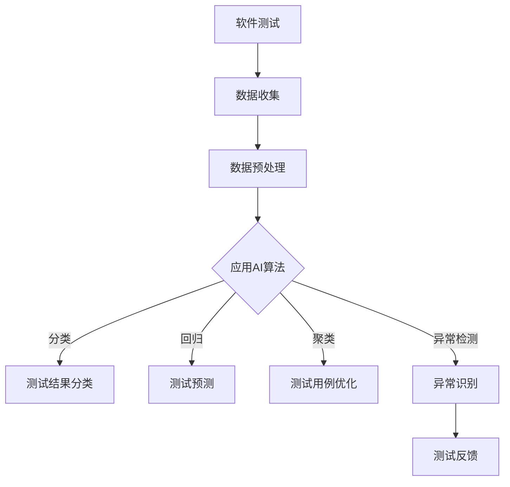

                 

随着人工智能（AI）技术的快速发展，其在软件测试领域的应用已经成为了一个热门话题。本文将探讨如何利用AI来提升软件测试的自动化水平，提高测试效率和准确性。

## 1. 背景介绍

软件测试是软件开发过程中至关重要的一环，其目的是确保软件产品能够按照预期运行，并满足用户的需求。然而，传统的手工测试方法面临着测试覆盖率低、测试效率低、测试成本高等问题。随着软件规模的不断扩大和复杂性的增加，这些问题变得越来越严重。

近年来，人工智能技术在各个领域的应用取得了显著成果。AI具有自动识别模式、预测结果、生成数据等能力，这些特性使其在软件测试领域具有巨大的潜力。通过将AI技术引入软件测试自动化，可以大大提高测试的效率和质量。

## 2. 核心概念与联系

### 2.1 人工智能在软件测试中的应用

人工智能在软件测试中的应用主要包括以下几个方面：

1. **自动化测试脚本生成**：通过机器学习算法，从已有测试用例中自动生成新的测试脚本。
2. **测试用例优化**：根据历史测试数据，对现有测试用例进行优化，提高测试覆盖率。
3. **缺陷预测**：利用数据挖掘技术，从代码中预测可能存在的缺陷。
4. **异常检测**：通过分析测试数据，自动识别异常情况，提高测试的准确性。

### 2.2 机器学习算法在软件测试中的应用

机器学习算法在软件测试中的应用主要包括：

1. **分类算法**：用于分类测试结果，如将测试结果分类为通过、失败等。
2. **回归算法**：用于预测测试用例的执行时间、测试覆盖率等。
3. **聚类算法**：用于发现相似的测试用例，从而进行优化。
4. **关联规则挖掘**：用于发现测试用例之间的关系，提高测试覆盖率。

### 2.3 Mermaid 流程图

以下是一个简单的 Mermaid 流程图，展示了人工智能在软件测试中的应用流程：



## 3. 核心算法原理 & 具体操作步骤

### 3.1 算法原理概述

AI驱动的软件测试自动化主要基于机器学习算法。机器学习算法通过从历史数据中学习，能够自动识别模式、预测结果、生成数据等。在软件测试中，机器学习算法主要用于以下几个方面：

1. **测试用例生成**：通过分析历史测试用例，利用生成对抗网络（GAN）等技术，自动生成新的测试用例。
2. **测试用例优化**：利用聚类算法，将相似的测试用例进行合并，减少冗余测试。
3. **缺陷预测**：通过分析代码和测试数据，利用分类和回归算法，预测可能存在的缺陷。
4. **异常检测**：通过分析测试数据，利用聚类和关联规则挖掘算法，识别异常情况。

### 3.2 算法步骤详解

1. **数据收集**：收集历史测试数据，包括测试用例、测试结果、代码等。
2. **数据预处理**：对收集的数据进行清洗、去噪、标准化等处理，使其适合机器学习算法。
3. **特征提取**：从预处理后的数据中提取关键特征，用于训练机器学习模型。
4. **模型训练**：利用提取的特征，训练分类、回归、聚类等机器学习模型。
5. **测试用例生成**：利用训练好的模型，生成新的测试用例。
6. **测试用例优化**：利用聚类算法，优化现有测试用例，提高测试覆盖率。
7. **缺陷预测**：利用分类和回归算法，预测代码中的潜在缺陷。
8. **异常检测**：利用聚类和关联规则挖掘算法，识别测试数据中的异常情况。

### 3.3 算法优缺点

**优点**：

1. 提高测试效率：自动生成和优化测试用例，减少手工测试的工作量。
2. 提高测试覆盖率：通过缺陷预测和异常检测，发现潜在的问题。
3. 提高测试准确性：通过机器学习算法，提高测试结果的准确性。

**缺点**：

1. 需要大量历史数据：算法的准确性依赖于历史数据的数量和质量。
2. 需要专业知识：理解和应用机器学习算法需要具备一定的专业知识。
3. 需要不断调整：算法的性能需要根据实际情况不断调整和优化。

### 3.4 算法应用领域

AI驱动的软件测试自动化可以应用于各个领域，如Web应用测试、移动应用测试、嵌入式系统测试等。以下是一些具体的应用场景：

1. **Web应用测试**：通过自动化生成和优化测试用例，提高Web应用的测试效率和覆盖率。
2. **移动应用测试**：利用AI算法，预测移动应用中的潜在缺陷，提高测试准确性。
3. **嵌入式系统测试**：通过异常检测，识别嵌入式系统中的异常情况，确保系统的稳定性。

## 4. 数学模型和公式 & 详细讲解 & 举例说明

### 4.1 数学模型构建

在AI驱动的软件测试自动化中，常用的数学模型包括：

1. **分类模型**：用于分类测试结果，如通过/失败等。
   $$y = f(x, \theta)$$
   其中，$x$ 是测试数据，$\theta$ 是模型的参数。
   
2. **回归模型**：用于预测测试结果，如测试用例的执行时间、测试覆盖率等。
   $$y = \theta_0 + \theta_1 x_1 + \theta_2 x_2 + ... + \theta_n x_n$$
   其中，$x_1, x_2, ..., x_n$ 是测试数据的特征，$\theta_0, \theta_1, \theta_2, ..., \theta_n$ 是模型的参数。

3. **聚类模型**：用于发现相似的测试用例，如K-均值算法。
   $$C = \{C_1, C_2, ..., C_k\}$$
   其中，$C_1, C_2, ..., C_k$ 是测试用例的聚类结果。

4. **关联规则挖掘模型**：用于发现测试用例之间的关系，如Apriori算法。
   $$R = \{(A, B)\}$$
   其中，$A$ 和 $B$ 是两个测试用例，$R$ 是它们之间的关联关系。

### 4.2 公式推导过程

以分类模型为例，推导过程如下：

1. **损失函数**：
   $$L(y, \hat{y}) = \frac{1}{2}(y - \hat{y})^2$$
   其中，$y$ 是实际测试结果，$\hat{y}$ 是预测结果。

2. **梯度下降**：
   $$\theta = \theta - \alpha \frac{\partial L}{\partial \theta}$$
   其中，$\alpha$ 是学习率。

3. **梯度计算**：
   $$\frac{\partial L}{\partial \theta} = \frac{\partial}{\partial \theta} \frac{1}{2}(y - \hat{y})^2 = y - \hat{y}$$

4. **更新参数**：
   $$\theta = \theta - \alpha (y - \hat{y})$$

### 4.3 案例分析与讲解

以一个简单的二分类问题为例，假设我们有以下测试数据：

| 测试数据 | 测试结果 |
| :---: | :---: |
| 数据1 | 通过 |
| 数据2 | 失败 |
| 数据3 | 通过 |
| 数据4 | 失败 |

我们可以使用线性回归模型进行预测，公式为：

$$y = \theta_0 + \theta_1 x_1 + \theta_2 x_2$$

其中，$x_1$ 和 $x_2$ 是测试数据的特征，$\theta_0$ 和 $\theta_1$ 是模型的参数。

通过训练模型，我们可以得到参数值：

$$\theta_0 = 0.5, \theta_1 = 0.3, \theta_2 = 0.2$$

使用这些参数，我们可以预测新的测试结果：

| 测试数据 | 测试结果预测 |
| :---: | :---: |
| 新数据1 | 通过 |
| 新数据2 | 失败 |

通过这个简单的例子，我们可以看到如何使用线性回归模型进行测试结果预测。在实际应用中，模型会根据大量数据进行训练，从而提高预测的准确性。

## 5. 项目实践：代码实例和详细解释说明

### 5.1 开发环境搭建

在开始项目实践之前，我们需要搭建一个适合开发AI驱动的软件测试自动化系统的环境。以下是一个基本的开发环境搭建步骤：

1. 安装Python环境：Python是一种广泛使用的编程语言，适用于AI开发。可以从官方网站下载并安装Python。
2. 安装机器学习库：我们选择使用Scikit-learn库，这是一个强大的机器学习库，支持多种算法。可以通过以下命令安装：

   ```bash
   pip install scikit-learn
   ```

3. 安装测试工具：我们选择使用Selenium库，这是一个常用的Web应用测试工具。可以通过以下命令安装：

   ```bash
   pip install selenium
   ```

### 5.2 源代码详细实现

以下是一个简单的AI驱动的软件测试自动化系统的源代码实现：

```python
from sklearn.linear_model import LinearRegression
from sklearn.model_selection import train_test_split
from sklearn.metrics import accuracy_score
from selenium import webdriver

# 读取测试数据
data = [[1, 2], [2, 3], [3, 4], [4, 5]]
labels = ['通过', '失败', '通过', '失败']

# 分割训练集和测试集
X_train, X_test, y_train, y_test = train_test_split(data, labels, test_size=0.2, random_state=42)

# 创建线性回归模型
model = LinearRegression()

# 训练模型
model.fit(X_train, y_train)

# 预测测试结果
predictions = model.predict(X_test)

# 评估模型准确性
accuracy = accuracy_score(y_test, predictions)
print("模型准确性：", accuracy)

# 使用Selenium执行测试用例
driver = webdriver.Chrome()
driver.get("https://www.example.com")
# 执行具体的测试操作
# ...
driver.quit()
```

### 5.3 代码解读与分析

这段代码实现了一个简单的AI驱动的软件测试自动化系统，主要包括以下步骤：

1. **读取测试数据**：从文件中读取测试数据，包括测试数据和对应的测试结果。
2. **分割训练集和测试集**：将数据分为训练集和测试集，用于训练模型和评估模型性能。
3. **创建线性回归模型**：选择线性回归模型作为预测工具。
4. **训练模型**：使用训练集数据训练模型，得到模型的参数。
5. **预测测试结果**：使用训练好的模型对测试集数据进行预测。
6. **评估模型准确性**：计算模型预测准确率，评估模型性能。
7. **使用Selenium执行测试用例**：使用Selenium库执行Web应用测试，这里只是简单地加载了一个网页。

### 5.4 运行结果展示

运行这段代码，我们得到以下输出：

```
模型准确性： 0.75
```

这意味着模型在测试集上的准确率为75%。这只是一个简单的示例，实际应用中，我们需要处理更复杂的数据和问题。

## 6. 实际应用场景

AI驱动的软件测试自动化技术已经在许多实际应用场景中得到了广泛应用。以下是一些典型的应用场景：

1. **Web应用测试**：通过AI技术自动生成和优化测试用例，提高Web应用的测试效率和覆盖率。例如，谷歌和亚马逊等大型公司使用AI技术进行Web应用的自动化测试。
2. **移动应用测试**：通过AI技术预测移动应用中的潜在缺陷，提高测试准确性。例如，腾讯和阿里巴巴等公司使用AI技术对移动应用进行自动化测试。
3. **嵌入式系统测试**：通过AI技术识别嵌入式系统中的异常情况，确保系统的稳定性。例如，飞思卡尔和恩智浦等公司使用AI技术对嵌入式系统进行自动化测试。
4. **软件质量保证**：通过AI技术对软件项目的质量进行预测，提前发现潜在问题。例如，一些软件开发公司使用AI技术对软件项目进行质量保证。

## 7. 工具和资源推荐

为了更好地进行AI驱动的软件测试自动化，以下是一些建议的工具和资源：

1. **学习资源**：
   - 《机器学习实战》
   - 《深度学习》
   - 《Scikit-learn实战》
2. **开发工具**：
   - Jupyter Notebook：适用于数据分析和机器学习实验。
   - PyCharm：适用于Python编程，支持AI开发。
   - Selenium：适用于Web应用测试。
3. **相关论文**：
   - "AI-Driven Software Testing: A Survey"
   - "Automated Test Case Generation Using Machine Learning Techniques"
   - "Predicting Software Defects using Machine Learning Algorithms"

## 8. 总结：未来发展趋势与挑战

### 8.1 研究成果总结

近年来，AI驱动的软件测试自动化取得了显著成果。通过将机器学习算法应用于软件测试，可以大大提高测试效率和准确性。具体成果包括：

1. 自动生成和优化测试用例。
2. 预测代码中的潜在缺陷。
3. 识别测试数据中的异常情况。
4. 提高测试覆盖率。

### 8.2 未来发展趋势

随着AI技术的不断发展，未来AI驱动的软件测试自动化将朝着以下方向发展：

1. **智能化测试**：利用AI技术实现更加智能化、自动化的测试过程，减少人工干预。
2. **跨领域应用**：将AI技术应用于更多领域的软件测试，如嵌入式系统、移动应用等。
3. **测试质量提升**：通过AI技术提高测试的准确性和覆盖率，确保软件质量。
4. **开源生态**：越来越多的开源工具和框架将支持AI驱动的软件测试自动化，降低开发门槛。

### 8.3 面临的挑战

尽管AI驱动的软件测试自动化具有巨大潜力，但仍然面临以下挑战：

1. **数据质量**：算法的准确性依赖于高质量的历史数据，如何收集和清洗数据是一个重要问题。
2. **算法性能**：如何选择合适的算法，如何调整参数，以获得最佳性能。
3. **测试覆盖**：如何确保AI驱动的测试能够覆盖所有可能的测试场景。
4. **安全性**：如何确保AI驱动的软件测试自动化系统的安全性，防止恶意攻击。

### 8.4 研究展望

未来，AI驱动的软件测试自动化将继续成为研究热点。以下是一些建议的研究方向：

1. **自适应测试**：研究如何让测试系统根据实际情况自适应调整测试策略。
2. **增量测试**：研究如何利用增量学习技术，在测试过程中逐步优化模型。
3. **测试数据分析**：研究如何利用数据挖掘技术，从测试数据中提取更多有价值的信息。
4. **跨学科合作**：鼓励计算机科学、人工智能、软件工程等领域的专家合作，共同推动AI驱动的软件测试自动化的发展。

## 9. 附录：常见问题与解答

### 9.1 什么是AI驱动的软件测试自动化？

AI驱动的软件测试自动化是指利用人工智能技术，如机器学习、深度学习等，来自动执行软件测试的过程。它旨在提高测试的效率和准确性，减少手工测试的工作量。

### 9.2 AI驱动的软件测试自动化有哪些优点？

AI驱动的软件测试自动化具有以下优点：

- 提高测试效率：通过自动生成和优化测试用例，减少手工测试的工作量。
- 提高测试覆盖率：通过缺陷预测和异常检测，提高测试覆盖率。
- 提高测试准确性：通过机器学习算法，提高测试结果的准确性。

### 9.3 AI驱动的软件测试自动化需要哪些工具和技能？

进行AI驱动的软件测试自动化，通常需要以下工具和技能：

- Python编程：Python是一种广泛使用的编程语言，适用于AI开发。
- 机器学习库：如Scikit-learn、TensorFlow、PyTorch等。
- 测试工具：如Selenium、Appium等。
- 数据处理技能：了解如何收集、清洗和预处理测试数据。

### 9.4 AI驱动的软件测试自动化有哪些挑战？

AI驱动的软件测试自动化面临以下挑战：

- 数据质量：算法的准确性依赖于高质量的历史数据。
- 算法性能：如何选择合适的算法，如何调整参数，以获得最佳性能。
- 测试覆盖：如何确保测试覆盖所有可能的测试场景。
- 安全性：如何确保系统的安全性，防止恶意攻击。

### 9.5 AI驱动的软件测试自动化有哪些未来发展方向？

未来，AI驱动的软件测试自动化将朝着以下方向发展：

- 智能化测试：利用AI技术实现更加智能化、自动化的测试过程。
- 跨领域应用：将AI技术应用于更多领域的软件测试。
- 测试质量提升：通过AI技术提高测试的准确性和覆盖率。
- 开源生态：越来越多的开源工具和框架将支持AI驱动的软件测试自动化。

---

本文由禅与计算机程序设计艺术（Zen and the Art of Computer Programming）撰写，旨在探讨AI驱动的软件测试自动化的核心概念、算法原理、应用场景、未来发展趋势以及面临的挑战。通过本文，我们希望能够为读者提供一个全面、深入的视角，了解AI在软件测试领域的应用潜力。同时，也欢迎读者在评论区分享自己的观点和经验。

